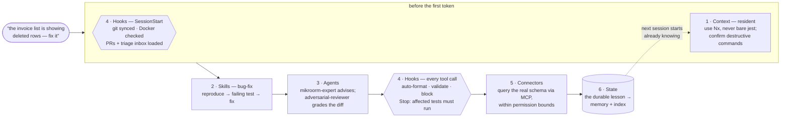

# 3 · The six layers

> Part I — The Idea · [← Loops, not prompts](02-loops-not-prompts.md) · [Contents](README.md) · [Next: Context →](04-context.md)

---

A Claude Code setup is easy to describe as a pile of files and hard to describe as a
system. The mental model that makes this repository navigable is six layers, each
answering exactly one question:

| #   | Layer          | Question it answers                                | Where it lives                                                                                          | Chapter                       |
| --- | -------------- | -------------------------------------------------- | ------------------------------------------------------------------------------------------------------- | ----------------------------- |
| 1   | **Context**    | What must it always know?                          | `project/**/CLAUDE.md` (19 files), [`global/rules/`](../global/rules/), [`global/references/`](../global/references/) | [4](04-context.md)            |
| 2   | **Skills**     | How is this kind of task done *here*?              | [`project/.claude/skills/`](../project/.claude/skills/) (71), [`global/commands/`](../global/commands/) (53)          | [5](05-skills.md)             |
| 3   | **Agents**     | Who does it — and who checks it?                   | [`project/.claude/agents/`](../project/.claude/agents/) (23), [`global/agents/`](../global/agents/) (8)               | [6](06-agents.md)             |
| 4   | **Hooks**      | What must never happen, whatever the model thinks? | [`project/.claude/hooks/`](../project/.claude/hooks/) (34 scripts, 28 wired across 8 lifecycle events)                | [7](07-hooks.md)              |
| 5   | **Connectors** | What real systems can it touch?                    | [`project/.mcp.json`](../project/.mcp.json), plugin + permission config in the two `settings.json`                    | [8](08-connectors.md)         |
| 6   | **State**      | What survives the session ending?                  | [`global/memory/`](../global/memory/) (172 files), PM epics/PRDs, [`examples/epic-walkthrough/`](../examples/epic-walkthrough/) | [9](09-memory.md)             |

The order is deliberate. It runs from *softest to hardest*: context and skills are
suggestions the model reads and follows; agents add structure; hooks are mechanical and
non-negotiable; connectors and their permission gates define the outer boundary of what
is physically possible; and state is what makes the whole thing cumulative rather than
Groundhog Day. When a rule matters, it tends to appear at more than one layer — you saw
the "never merge" rule enforced at four layers in [chapter 2](02-loops-not-prompts.md),
and that redundancy is a pattern, not an accident.

## One request through all six layers

Drawn in the order the layers *act* — which is not the order they are usually listed.
**Hexagons are mechanical**: the model does not get a vote. Rectangles are advisory —
read, then decided upon:



The cylinder is what makes tomorrow's session start further along than today's did —
without it, the loop back to `Context` never closes and every month repeats the last one.

In prose, the same trip. Suppose the user types: *"the invoice list is showing deleted
rows — fix it."*

**Before the first token**, layer 4 has already acted: `SessionStart` hooks synced git,
verified the Node version, checked Docker, loaded open PRs and issues into context, and
ran the worktree doctor. Layer 1 is resident: the root `CLAUDE.md` has told the model
this is an Nx monorepo where tests run as `nx test`, never bare `jest`, and that
destructive commands require explicit confirmation.

**Choosing the approach** is layer 2. The request pattern-matches the `bug-fix` skill,
which prescribes this project's shape for a fix: reproduce first, write the failing
test, then make it pass — not whatever generic strategy the model would improvise.

**Doing the work** engages layer 3. The skill may pull in the `mikroorm-expert` agent
(the ORM's soft-delete filters are exactly its territory), and when the fix is drafted,
a *different* agent — `adversarial-reviewer`, which receives only the diff and no
project context — tries to tear it apart. Maker ≠ checker, staffed.

**Every tool call** passes layer 4 again. The edit is auto-formatted on write; if the
fix had touched a Helm chart it would have been schema-validated on save; if the model
tried `git push --force` to main it would be blocked, no matter how sure it was. When
the turn ends, the `Stop` hook runs the affected tests — a quality gate the model cannot
skip by simply declaring victory.

**Verifying against reality** is layer 5. The model checks the actual database through
the custom `acme-mcp` server rather than guessing at column names, within permission
bounds that make credentials unreadable and PR-merging impossible.

**And afterwards**, layer 6 remembers. If the bug revealed something durable — say,
that a forked EntityManager silently bypasses the global tenant filter — it becomes a
memory file, indexed in `MEMORY.md`, and every future session starts knowing it. The
fix was a day's work; the memory is permanent.

Six layers, one bug fix. Remove any one of them and something specific degrades: without
context the model re-derives conventions and gets them subtly wrong; without skills every
fix takes its own improvised path; without a separate checker the fix is graded by its
author; without hooks the guardrails depend on the model's mood; without connectors the
"verification" is a guess; without state next month's session steps on the same rake.

## The map of the repository

The two configuration trees mirror Claude Code's own two scopes, **frozen at their
original paths** — what you see is where these files actually lived:

```
project/            repo-scoped config, exactly as it sits in the monorepo
  .claude/
    skills/         71 skills — procedure, not prose
    agents/         23 domain + review agents, tool-scoped
    hooks/          34 hook scripts, 28 wired — the rules the model can't argue with
    commands/       7 project slash-commands
    references/     checklists and templates loaded on demand
    settings.json   hook wiring, permissions, model + effort
  **/CLAUDE.md      19 nested instruction files, at their original paths
  .mcp.json         MCP servers

global/             machine-scoped config (the ~/.claude equivalent)
  rules/            8 always-resident rules
  references/       16 on-demand references, pulled in by a routing table
  commands/pm/      45 PM ceremony commands (see the attribution appendix)
  agents/           8 review + analysis agents
  memory/           172 durable facts — sanitized real history, not synthetic
  settings.json     model, permissions deny-list, plugins

book/               ← you are here: the guided reading of all of the above
docs/architecture/  the system this setup was used to build (Part IV)
examples/           one epic end-to-end, artefact by artefact (chapter 11)
```

A useful way to hold the split: `global/` is *who the engineer is* — their standing
rules, their ceremony, their accumulated memory, on every project. `project/` is *what
this codebase demands* — its skills, its guards, its experts. When you install any of
this yourself ([Appendix A](appendix-a-install.md)), the same split applies: global
config is yours to carry between machines; project config belongs to the repo it
governs and should diverge per project.

## What Part II does with this

Each of the next six chapters takes one layer, opens with what it is *for*, shows how
this setup implements it — with excerpts from the real files, not paraphrase — and
closes with pointers to the primary sources. The layers are presented softest-first,
same order as the table, because that is also the order in which each layer's failures
motivated the next: instructions that were ignored became skills, skills that were
rationalized away became hooks, and everything that was learned the hard way became
memory.

---

> **Next:** layer one — the 19-file `CLAUDE.md` hierarchy, the eight resident rules,
> and the routing table that keeps 16 reference documents out of context until the
> moment they're needed.
> [Chapter 4 — Context: what it always knows →](04-context.md)
