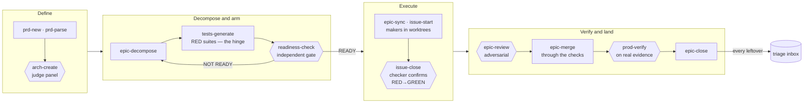

# 10 · The ceremony

> Part III — In Motion · [← Memory](09-memory.md) · [Contents](README.md) · [Next: An epic, start to finish →](11-an-epic-start-to-finish.md)

---

## Why a ceremony at all

Part II described six layers, but layers are inventory, not motion. The thing that
actually moves work from "we should harden the trading backend" to "verified in
production" is a fixed sequence of commands with artefacts between them — a *ceremony*,
in the unembarrassed sense: steps performed in order, each producing a durable record,
each gated before the next.

For solo-plus-agents engineering the ceremony is not bureaucratic overhead; it is the
substitute for the team. A team gives you a product manager who writes down what
"done" means before coding starts, an architect who is not the implementer, a reviewer
who did not write the code, and a release manager who demands evidence. Working alone
with agents, every one of those roles must be *staffed by structure* — and the
ceremony is the org chart. It also solves the amnesia problem at project scale:
every step writes its output to disk (`.claude/prds/`, `.claude/epics/`), so the state
of a six-week initiative survives any number of session boundaries. State on disk,
primitive six.

## The thirteen steps

From [`global/CLAUDE.md`](../global/CLAUDE.md) — the sequence, memorized as one line:

> `prd-new` → `prd-parse` → [`arch-create`] → `epic-decompose` → `tests-generate` →
> [`readiness-check`] → `epic-sync` → `issue-start` → `issue-close` → `epic-review` →
> `epic-merge` → `prod-verify` → `epic-close`

Drawn out, the alternation is the point — no two consecutive steps trust the same mind.
**Hexagons are graded by someone other than the author**; rectangles are where work is
made:

`tests-generate` is the hinge: the step that converts the PRD's acceptance criteria into
a machine-checkable definition of done, which every hexagon downstream then measures
against. Note there is no arrow out of this diagram that skips one.

Grouped by what they accomplish:

**Define** — `/pm:prd-new` interviews the requirement into a PRD with Gherkin
acceptance criteria; `/pm:prd-parse` converts it into an epic (technical approach,
decisions, task preview); `/pm:arch-create` runs the architecture pass, settling the
questions the epic deferred — with independent judge agents scoring approaches, so
even design is maker ≠ checker. Its outputs are ADRs.

**Decompose and arm** — `/pm:epic-decompose` breaks the epic into ~10 task files with
dependencies and parallelism flags. Then the hinge of the whole method:
`/pm:tests-generate` writes the **RED test suites** — failing acceptance tests derived
from the PRD's Gherkin, each failing *for a documented reason*. These are not
paperwork; they are the machine-checkable definition of done that every later step
grades against. `/pm:readiness-check` then has an independent checker audit the whole
package — FR-coverage matrix, dependency sanity, DDD-pipeline completeness — and issue
a verdict (READY / NOT READY) with findings by severity.

**Execute** — `/pm:epic-sync` pushes the epic and tasks to GitHub as real parent/child
issues (via the `gh-sub-issue` extension); `/pm:issue-start` dispatches implementation,
in worktrees when tasks parallelize ([chapter 12](12-running-many-at-once.md));
`/pm:issue-close` closes a task only when its REDs are GREEN and a separate checker
confirms no regression.

**Verify and land** — `/pm:epic-review` runs the adversarial review pipeline over the
epic's diff; `/pm:epic-merge` lands it through the required checks (never around
them); `/pm:prod-verify` demands *production evidence* — a real query, a real metric,
not "looks fine" — and `/pm:epic-close` updates state and routes every leftover to
the triage inbox, so nothing evaporates at the finish line.

Supporting commands (`status`, `standup`, `next`, `blocked`, `in-progress`, `search`…)
make the on-disk state legible; the full set of 45 is in
[`global/commands/pm/`](../global/commands/pm/).

## The loops threaded through it

[Chapter 2](02-loops-not-prompts.md) claimed the ceremony and the loops are one
machine. Here is the joint-by-joint mapping:

| Ceremony step               | Loop primitive       | What actually happens                                                                     |
| --------------------------- | -------------------- | ----------------------------------------------------------------------------------------- |
| `prd-new` / `prd-parse`     | State                | Acceptance conditions are captured *verifiably* — they become stop conditions later        |
| `arch-create`               | Sub-agents           | Judge panel: independent approaches, scored by separate judges, synthesized. Maker ≠ judge |
| `epic-decompose`            | Worktrees            | Tasks marked `parallel: true` can run as isolated makers                                   |
| `tests-generate`            | State + verify       | **The hinge.** RED tests *are* the verify-loop stop condition                              |
| `readiness-check`           | Sub-agents (checker) | An independent gate before anything syncs — not the author's opinion                       |
| `issue-start`               | Worktrees + maker    | Each issue a maker in its own worktree                                                     |
| `issue-close`               | Verify               | verify-loop: separate checker confirms RED→GREEN, no regression                            |
| `epic-review`               | Sub-agents (checker) | The adversarial pipeline; diff-only reviewers; git mutation forbidden                      |
| `epic-merge`                | Connectors           | Green required checks via the github connector; never `--admin`/`--no-verify` to force it  |
| `prod-verify`               | Verify               | Stop condition graded against production evidence                                          |
| `epic-close`                | State                | Leftovers → triage inbox. The discovery loop catches what the delivery loop dropped        |

Two structural observations fall out of the table. First, **checker steps alternate
with maker steps** the whole way down — define, *check*, arm, *check*, build, *check*,
merge, *check*. No two consecutive steps trust the same mind. Second, the ceremony has
**no unverifiable exits**: the ways out of an epic are a checker-confirmed close or an
explicit routing of the remainder into the inbox. "We sort of finished" is not a
reachable state.

## Where it came from, and what was added

The skeleton is not original, and the [NOTICE](../global/commands/pm/NOTICE.md) in the
command directory says so precisely: the `/pm:*` command set, the on-disk
`epics/`+`prds/` state model and the GitHub sync derive from
[automazeio/ccpm](https://github.com/automazeio/ccpm) (MIT, license preserved
alongside). What this setup **added** is exactly the loop-engineering spine — the five
commands that turn a tracking ceremony into a verification ceremony:

- `arch-create` — the judge-panel architecture pass
- `tests-generate` — the RED suites that become stop conditions
- `readiness-check` — the independent pre-sync gate
- `prod-verify` — evidence-based production verification
- `epic-start-worktree` — parallel execution in isolated worktrees

That diff *is* the thesis of this book in miniature: CCPM contributed state and sync;
loop engineering contributed maker ≠ checker and verifiable stops; the combination is
the machine. Full lineage in [Appendix B](appendix-b-attribution-and-lineage.md).

## The cost, honestly

The ceremony is heavy — thirteen steps is a lot of process for one engineer. Three
things keep it worth it. The gates are *cheap to pass and expensive to skip*: a
readiness check is minutes of agent time, while the class of defect it catches
(a task with no test coverage, a dependency pointing forward) costs days downstream.
The heavy steps are *agent-executed* — the human reads verdicts and makes calls;
the writing, checking and cross-referencing is delegated. And the ceremony is
*scale-adaptive* in practice: a bug fix doesn't enter it at all (that's what the
skills of chapter 5 are for); the ceremony is for work large enough to outlive
sessions and ambiguous enough to need a written "done."

Whether it holds up under contact with a real epic — five workstreams, ten tasks,
sixty RED tests, one critical finding at the gate — is the next chapter, which follows
one initiative through every step above, artefact by artefact.

## Primary sources

- [`global/commands/pm/`](../global/commands/pm/) — all 45 commands; [`help.md`](../global/commands/pm/help.md) is the map
- [`global/commands/pm/tests-generate.md`](../global/commands/pm/tests-generate.md) — the hinge step's actual procedure
- [`global/commands/pm/readiness-check.md`](../global/commands/pm/readiness-check.md) — the gate
- [`global/commands/pm/NOTICE.md`](../global/commands/pm/NOTICE.md) — upstream vs added
- [`global/rules/`](../global/rules/) — the frontmatter/datetime/GitHub conventions the ceremony's state model runs on

---

> **Next:** the ceremony under load — epic #1623, *platform-trading-hardening*, from
> gap analysis to verified green, including the part where the process caught its own
> test suite being wrong.
> [Chapter 11 — An epic, start to finish →](11-an-epic-start-to-finish.md)
