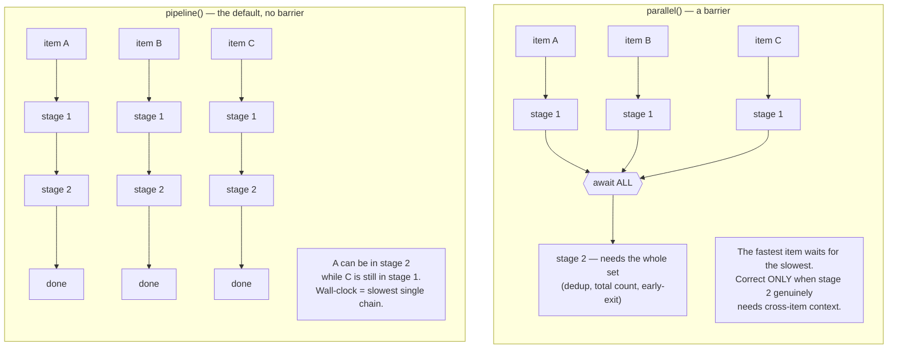

# 12 · Running many at once

> Part III — In Motion · [← An epic, start to finish](11-an-epic-start-to-finish.md) · [Contents](README.md) · [Next: The system it built →](13-the-system-it-built.md)

---

Scale arrives twice, wearing different clothes. Sometimes one *task* is too big for
one agent — thirty components to port, an audit that should sweep every chart, a
review whose findings each deserve an independent interrogation. And sometimes one
*machine* hosts too many workstreams — a feature branch, a hotfix, a PR under review
and an agent experimenting, all wanting port 3000 and a database named
`app_development`. This chapter is the two answers: **ultracode workflows** for
fanning agents out inside a task, and **worktree workspace allocation** for keeping
parallel workstreams from eating each other. Each has a full reference under
[`deep-dives/`](deep-dives/); this chapter is the narrative that makes those worth
opening.

## Fanning out: ultracode workflows

[Chapter 2](02-loops-not-prompts.md) replaced *you as the prompter*. Ultracode
workflows replace the **sequential maker**: instead of one agent doing task after task
in one context, you author a small deterministic script that fans work across many
agents — with control flow in *code* (loops, pipelines, barriers), not in a model's
judgment. You reach for one to be *comprehensive* (cover N units in parallel),
*confident* (independent perspectives and adversarial checks before committing), or to
take on *scale one context cannot hold*.

The [deep-dive](deep-dives/ultracode-workflows.md) carries complete, loadable script
skeletons; what belongs here is the pattern vocabulary, because it names things you
will want even without the tooling:

| Pattern                 | Shape                                                                  | Reach for it when                                    |
| ----------------------- | ---------------------------------------------------------------------- | ---------------------------------------------------- |
| **pipeline** (default)  | each item flows through all stages independently, no barrier           | multi-stage per-item work (port→verify, find→refute) |
| **parallel** (barrier)  | await *all* results, then continue                                     | you genuinely need the whole set (dedup, count)      |
| **loop-until-dry**      | keep spawning finders until K rounds surface nothing new               | unknown-size discovery                               |
| **adversarial verify**  | N skeptics per finding, each prompted to *refute*; kill on majority    | promoting findings you intend to act on              |
| **judge panel**         | N independent attempts → parallel judges score → synthesize            | wide solution spaces (architecture, design)          |
| **completeness critic** | a final agent asks "what's missing?"                                   | before claiming any sweep is done                    |

The first two are worth comparing directly, because choosing wrong is the most common
and most expensive mistake in the list:

The smell test: if you wrote `parallel()`, then a plain `map`/`filter`/`flatten`, then
another `parallel()` — that middle transform did not need the barrier. Do it inside a
pipeline stage instead. "I need to flatten first" is not cross-item context; "compare
each finding against all the others" is.

Two patterns deserve a longer look, because they are maker ≠ checker industrialized.

**Port→verify** (the pattern that drove a real design-system alignment epic): each
maker agent writes *only its own* component triplet — implementation, story, spec —
and a **separate** verifier then runs the tests and returns **verbatim** output,
passing only on a hard rule ("spec listed with ≥3 passing; 0 passed or spec-not-found
= FAIL *regardless of exit code*"). Every clause of that acceptance rule is a
patched exploit from [chapter 9](09-memory.md)'s scar tissue — subagents fabricate,
`passWithNoTests` lies, exit codes flatter.

**Adversarial verify**: every finding from a review stage faces three independent
refuters, each instructed to *default to refuted when uncertain*, and survives only
if a majority cannot kill it. This is the downstream filter that makes
[chapter 6](06-agents.md)'s find-at-least-10 reviewer safe to use: the quota
generates recall, the refuters restore precision.

The deep-dive's **guardrails section** is the part to internalize before running any
of this unattended. Its rules are compact and every one is load-bearing: makers never
grade; stop conditions are machine-checkable; subagent claims are verified
independently ("demand verbatim tool output"); shared files (barrels, configs) are
edited only in the main session because parallel writers race; workflows open PRs but
never merge; and any bound a workflow places on its own coverage must be *logged*,
because a silent cap reads as "covered everything" when it didn't.

One honest note the deep-dive makes that marketing wouldn't: fan-out is **opt-in and
expensive** — dozens of agents burn real tokens — and the norm is *hybrid*: scout
inline, cheaply, until the work-list is concrete; fan out only over that list; then
stitch and gate back in the main session. The leverage is in designing the fan-out,
not in maximizing it.

## Staying out of your own way: one integer per workspace

The second scale problem is mundane until the day it destroys an afternoon.
`git worktree` gives you four checkouts cheaply — but not four *workspaces*. The
moment two run, both bind port 3000, both start a container named `repo-db-1`, both
point at `app_development`; the second boot fails, or worse, succeeds and silently
writes into the first one's data.

The [worktree deep-dive](deep-dives/worktree-workspace-allocation.md) is a full
design document — twelve principles, each attached to the concrete failure it
prevents — but its core idea fits in a sentence: **stop letting humans decide
which ports a checkout uses, and make every resource a *derived property* of a
single small integer** allocated per workspace. For slot *n*: backend
`3000+(n−1)`, frontend `4200+(n−1)`, database port, blob-emulator port, database
*name*, Compose project name, even a cloud alias — all arithmetic, recorded in a
small JSON registry, materialized into generated env files by one command.

The reference implementation is `acme-worktree`
([`project/scripts/local-multi-instance/`](../project/scripts/local-multi-instance/)),
a Bash script with nine subcommands — and its most instructive one is `doctor`,
wired into `SessionStart` via `worktree-doctor.sh` ([chapter 7](07-hooks.md)):
it reports drift in *both* directions — registry entries whose worktree is gone, and
worktrees that were never registered — and changes nothing without being asked. A
registry that can drift silently is a registry you will eventually distrust; the
doctor is what keeps the map matching the territory. The deep-dive closes with an
honest record of where the implementation fell short of its own principles, which
teaches at least as much as the principles do.

Nothing in the design needs Bash, a monorepo, or worktrees specifically — the same
shape works for cloned siblings, devcontainers, or VMs. What matters is *derivation
over convention*: any resource a human assigns by hand is a resource two workspaces
will eventually share by accident.

## How the two compose

They meet in the epic machinery of [chapter 11](11-an-epic-start-to-finish.md), one
level apart, and the distinction is worth keeping crisp:

- **Per-issue worktrees** isolate whole tasks: `/pm:epic-start-worktree` gives each
  issue its own checkout (and, when it needs to *run*, its own allocated slot), and
  the conflict-graph wave plan decides which issues may run simultaneously.
- **Per-stage isolation inside a workflow** (`isolation: worktree` on a fan-out
  stage) exists too, but only for stages whose agents mutate the same files — it
  costs setup and disk per agent, and the default is the cheaper rule: fan-out
  agents create only their own files.

Same primitive — an isolated checkout — applied at two granularities, each chosen by
the same question: *what is the smallest unit whose writers can collide?*

## Primary sources

- [`deep-dives/ultracode-workflows.md`](deep-dives/ultracode-workflows.md) — patterns, complete script skeletons, guardrails, and a worked epic
- [`deep-dives/worktree-workspace-allocation.md`](deep-dives/worktree-workspace-allocation.md) — the twelve principles and the honest shortfalls
- [`project/scripts/local-multi-instance/`](../project/scripts/local-multi-instance/) — `acme-worktree` and its config, in place
- [`project/.claude/hooks/worktree-doctor.sh`](../project/.claude/hooks/worktree-doctor.sh) — the drift check, run every session start
- [Appendix A](appendix-a-install.md) — installing the worktree CLI (symlink, not copy — the reason is a story)

---

> **Part IV:** what all of this machinery actually produced — the platform itself,
> documented at C4 scale with 239 rendered diagrams.
> [Chapter 13 — The system it built →](13-the-system-it-built.md)
