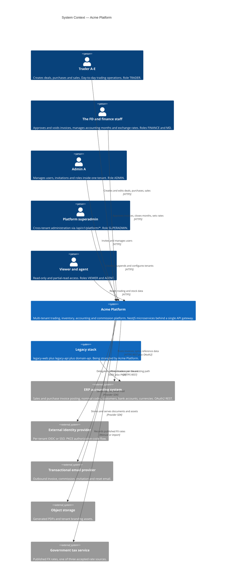
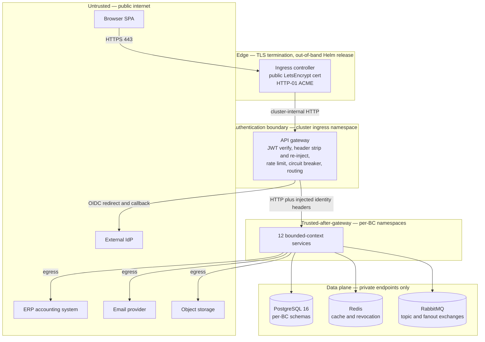
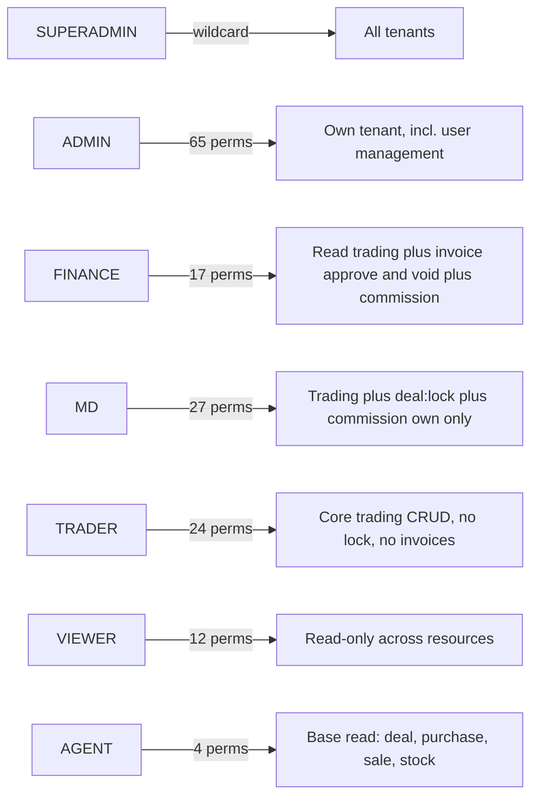

# System Context — the Acme Platform

What this covers: the outermost C4 level for **Acme**, Initech's B2B commodity-trading
platform. It names the human roles that use the system, the external systems it depends on,
the trust boundaries those dependencies cross, and the coexistence relationship with the
legacy stack that Platform is replacing. Everything here was verified against
`apps/platform/*`, `charts/`, and the service config schemas in the source repository —
where a claim could not be verified from source, the prose says so explicitly rather than
guessing.

---

## 1. The system in one diagram

### What this shows

The platform is a **single logical system with one front door**. Every human actor reaches
it through the same API gateway; there is no second ingress for admins or for finance. The
external dependency surface is deliberately small — five outbound integrations, four of
which are pluggable behind a port.

### Takeaways

1. **Role, not persona, is the access primitive.** The system defines 7 roles and 65 permissions (SUPERADMIN, ADMIN, FINANCE, MD, TRADER, VIEWER, AGENT). Permission keys are
   `{resource}:{action}` — `deal:create`, `invoice:approve`, `commission:view:all`. SUPERADMIN
   holds a wildcard; every other role is tenant-scoped. A user may hold several roles, and
   the JWT carries the union of their permissions.
2. **SUPERADMIN is a different lane, not a bigger key.** Cross-tenant administration only
   happens on `/api/v1/platform/*` routes, and the gateway forwards the `x-platform-scope`
   claim **only** on routes flagged `platformScope: true` in the routing table. On any
   business endpoint the same platform-scoped session behaves as tenant-scoped. See
   ADR-0029 _Superadmin platform scope auth_.
3. **Every external integration is behind a port with a mock adapter.** ERP posting
   (`ERP_MOCK_MODE`, `mock-erp.adapter.ts` vs `real-erp.adapter.ts`), email
   (`NOTIFICATION_EMAIL_PROVIDER: 'mock' | 'acs'`), and document storage
   (`DOCUMENT_STORAGE_PROVIDER: 'mock' | 'azure'`) all select the adapter from validated
   config. A dev cluster can run the entire platform with zero third-party calls.
4. **Identity is federated but tokens are local.** The platform accepts per-tenant OIDC,
   but after a successful SSO callback it mints its **own** RS256 JWT. Downstream services
   never see an external token and cannot distinguish an SSO login from a password login.
   See ADR-0053 _Platform identity JWT RS256 JWKS_.
5. **The legacy stack still owns the live ERP posting path.** Acme Platform and the legacy
   `legacy-api` both integrate with the same ERP tenant. This is a strangler-fig migration,
   not a big-bang cutover, so the context diagram has two systems reaching one external
   dependency for the duration.

### Invariant encoded

> **No request reaches a bounded context without a platform-issued identity.** The gateway
> strips inbound `x-tenant-id`, `x-user-id`, `x-user-roles`, `x-permissions` and
> `x-platform-scope` headers before authentication, then re-injects them from verified JWT
> claims. A client cannot assert its own identity.

---

## 2. Trust boundaries

### What this shows

Four concentric trust zones. The gateway is the **only** authentication boundary; once past
it, identity travels as **unsigned HTTP headers** on a network the platform treats as
trusted. That trust is enforced by network policy, not by cryptography.

### Takeaways

1. **The identity headers are unsigned.** `x-tenant-id`, `x-user-id`, `x-permissions` and
   `x-platform-scope` are plain headers. Their integrity rests entirely on the NetworkPolicy
   that restricts cross-namespace HTTP ingress on each bounded-context service to the
   gateway pod only. This is a **known, documented constraint**, not an oversight — it is
   why the bundle values files pin `namespaceSelector` rules to the gateway namespace.
2. **The gateway does not forward the bearer token by default.** `ServiceRoute.forwardAuthorization`
   defaults to `false`: re-sending the JWT to every bounded context would needlessly widen
   token exposure. It is opted into only for an upstream that re-verifies the token itself.
   Cookies are likewise withheld (`forwardCookies` defaults to `false`) except on the OIDC
   callback route, which needs the `__oidc_state` cookie for CSRF state-binding.
3. **The edge is outside the GitOps loop.** TLS termination runs as a standalone Helm
   release with an HTTP-01 ACME resolver, deliberately **not** reconciled by the GitOps
   controller. Config changes there require a manual `helm upgrade` — a trap worth knowing
   before debugging "why did my ingress change not apply".
4. **Data services are reachable only over private endpoints.** PostgreSQL, Redis and the
   broker have no public listener. Service-to-PostgreSQL enforces `sslmode=require`.
5. **Path-smuggling is rejected at the router, not the proxy.** `resolveService()`
   short-circuits on NUL bytes, on `..`, and on `%2e` before any upstream URL is built,
   because `new URL` would otherwise normalise a traversal into a path the matched route
   never intended.

### Invariant encoded

> **The routing decision and the privilege decision use one input.** `platformScope` is a
> property of the route object that routing already resolved — not a second, independently
> normalised path check. Two separate checks could disagree; a double-encoded traversal
> could route to a business service while re-parsing to a platform path and leak the
> cross-tenant header. One matcher, one decision.

---

## 3. External systems, verified

| External system            | Bounded context that owns the integration                                                                                               | Adapter selection                                                                                                                | Notes                                                                                                                                                                                                                                                                                                                                               |
| -------------------------- | --------------------------------------------------------------------------------------------------------------------------------------- | -------------------------------------------------------------------------------------------------------------------------------- | --------------------------------------------------------------------------------------------------------------------------------------------------------------------------------------------------------------------------------------------------------------------------------------------------------------------------------------------------- |
| ERP accounting             | `accounting-service` (`modules/erp/`)                                                                                                  | `ERP_MOCK_MODE` picks `mock-erp.adapter.ts` or `real-erp.adapter.ts`                                                          | OAuth2 with a token-refresh scheduler, a throttle service, retry policy, and an encryption subscriber for tokens at rest. Reference data (customers, nominal codes, currencies, bank accounts, companies) is synced into `accounting.erp_*` tables. ADR-0024 _ERP integration strategy_, ADR-0044 _ERP CSV import for onboarding_.                 |
| External identity provider | `auth-service` (`modules/oidc/`)                                                                                                        | Per-tenant `OidcProvider` rows                                                                                                   | PKCE authorization-code flow with `state` for CSRF and `nonce` for replay protection. Auto-provisioning when `autoProvision=true`. SSO-only accounts are refused at `/auth/login` with `SSO_ONLY_ACCOUNT`. ADR-0067 _SSO session handoff one-time code_.                                                                                            |
| Email provider             | `notification-service`                                                                                                                  | `NOTIFICATION_EMAIL_PROVIDER: 'mock' \| 'acs'` — fail-loud validation rejects `acs` without connection string and sender address | Delivery status and retry are exposed at `/api/v1/deliveries` for operators. `NOTIFICATION_DELIVERY_CONCURRENCY` and `NOTIFICATION_MAX_RETRY_ATTEMPTS` are tunables.                                                                                                                                                                                |
| Object storage             | `document-service` (`DOCUMENT_STORAGE_PROVIDER`) and `tenant-service` (`TENANT_ASSET_STORAGE_*`, container defaults to `tenant-assets`) | `'mock' \| 'azure'`                                                                                                              | Two distinct concerns: generated PDFs vs tenant branding assets. ADR-0074 _Platform tenant asset storage_.                                                                                                                                                                                                                                          |
| Government tax service     | `accounting-service` (`modules/exchange-rate/`)                                                                                         | n/a                                                                                                                              | The `ExchangeRateSource` enum is exactly `TAX_AUTHORITY \| MANUAL \| ERP`. **Not verified:** whether any automated fetch from the tax service exists in Platform — the entity records the _source_ of a rate, and the use case accepts an operator-supplied DTO. Treat automated FX ingestion as unconfirmed. ADR-0023 _Exchange rate temporary ownership_. |

### Takeaways

1. **Two of the five integrations are financial and audited.** ERP posting writes a
   `erp_posting_audit` row per attempt; ERP tokens are encrypted at rest by a MikroORM
   `EventSubscriber` keyed on `ERP_TOKEN_ENCRYPTION_KEY`.
2. **Provider selection is fail-loud, not fail-soft.** The notification config schema
   rejects a partially configured provider at boot rather than silently degrading to mock —
   a deliberate reaction to an earlier incident where a required variable defaulted quietly.
3. **The ERP integration is credentialed at the platform level, not per tenant.** Tenant
   onboarding does _not_ collect per-tenant ERP credentials; connection testing runs against
   platform-held credentials.
4. **Storage is split by lifecycle.** Documents are immutable artefacts of a business event;
   tenant assets are mutable branding. They use different containers and different services
   so a branding change cannot touch an invoice PDF.

### Invariant encoded

> **Every external call is a port with an in-repo test double.** No integration test, CI
> job, or local `docker compose` stack may require a third-party credential to pass.

---

## 4. Actors and what they can actually do

### What this shows

Privilege is not a ladder with one rung per job title — FINANCE and MD are **orthogonal**
slices, not "more than TRADER". FINANCE can approve an invoice but cannot lock a deal; MD
can lock a deal but sees only its own commission, never `commission:view:all`.

### Takeaways

1. `deal:lock` is the hinge permission of the whole platform. Locking a deal is what
   triggers commission calculation and FX-rate snapshotting downstream, which is why it sits
   with MD and ADMIN rather than with every trader.
2. `commission:view` and `commission:view:all` are separate permissions precisely so an MD
   can see personal earnings without seeing the team's.
3. AGENT exists for external partners — 4 read permissions and nothing else.
4. Roles are assigned through a `UserRole` join table with **no** unique constraint on
   `userId`; multi-role is a first-class case, and the JWT carries the union.
5. Tenant lifecycle state (`PROVISIONED`, `ONBOARDING`, `ACTIVE`, `SUSPENDED`, `DELETED`) is
   **derived** from entity columns by `Tenant.getState()`, never stored. There is no state
   column to drift out of sync with `suspendedAt` and `deletedAt`.

### Invariant encoded

> **Tenant isolation is an ORM-level default, not a query-level discipline.** Every
> tenant-scoped entity extends `TenantBaseEntity` and inherits a MikroORM `@Filter` declared
> `default: true`. There is no opt-out. The small set of exempt entities — `Tenant`,
> `TenantConfig`, `SuperadminAuditLog`, `PlatformSetting` — must carry an explicit
> `@TenantExempt()` decorator, which makes exemption grep-able and reviewable.

---

## 5. Deciding ADRs at this level

| ADR  | Title                                              | Why it matters here                                                                                   |
| ---- | -------------------------------------------------- | ----------------------------------------------------------------------------------------------------- |
| 0013 | Per-BC PostgreSQL schema isolation                 | Defines what "one system" means internally — shared cluster, isolated schemas, no cross-schema joins. |
| 0014 | Microservices separate binaries day one            | Each bounded context ships as its own deployable from the start.                                      |
| 0017 | RabbitMQ unified messaging                         | One broker for both domain events and background jobs; Redis is cache-only.                           |
| 0024 | ERP integration strategy                           | Shape of the accounting external boundary.                                                            |
| 0029 | Superadmin platform scope auth                     | Why cross-tenant access is a separate route lane, not a bigger role.                                  |
| 0031 | GDPR-compliant audit trail                         | Constrains what the audit feed may retain about people.                                               |
| 0051 | Cloud-native provider-neutral secrets and identity | Keeps the external-dependency set portable rather than vendor-welded.                                 |
| 0053 | Platform identity JWT RS256 JWKS                   | Platform mints its own tokens; external IdPs terminate at the auth boundary.                          |
| 0066 | Hostname-based tenant resolution                   | How a request is bound to a tenant before authentication.                                             |
| 0069 | Pre-auth tenant slug resolution                    | The public, enumeration-safe discovery lane at the apex domain.                                       |

---

## 6. What could not be verified

Honest gaps, stated rather than invented:

- **Automated FX ingestion from the government tax service.** The `ExchangeRateSource` enum
  includes `TAX_AUTHORITY`, and a `create-exchange-rate.use-case.ts` accepts a DTO with a `source`
  field — but no scheduled fetcher for that source was found in `accounting-service`. The
  arrow in the context diagram is drawn as "Manual or import" for that reason.
- **`ai-service` external model dependencies.** The service exposes `signals`,
  `predictions`, `agent-registration` and `agent-sessions` modules, but its event consumers
  bind routing keys and exchanges that do not yet exist, and the financial ingestion streams
  are gated on FD sanction (ADR-0047). It is drawn in the container view as deployed but
  inert; no external model-provider edge is claimed.
- **Whether the legacy stack and Platform share one ERP tenant or two.** Both integrate with
  the ERP; the diagram shows two arrows to one system, which is the safe reading.

Next: [01-container-view.md](01-container-view.md) — the gateway, the 12 services, and the
data and messaging plane.
