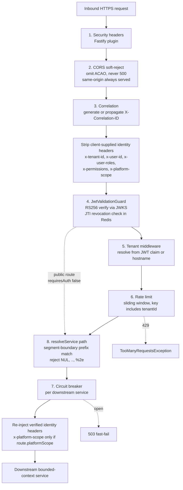
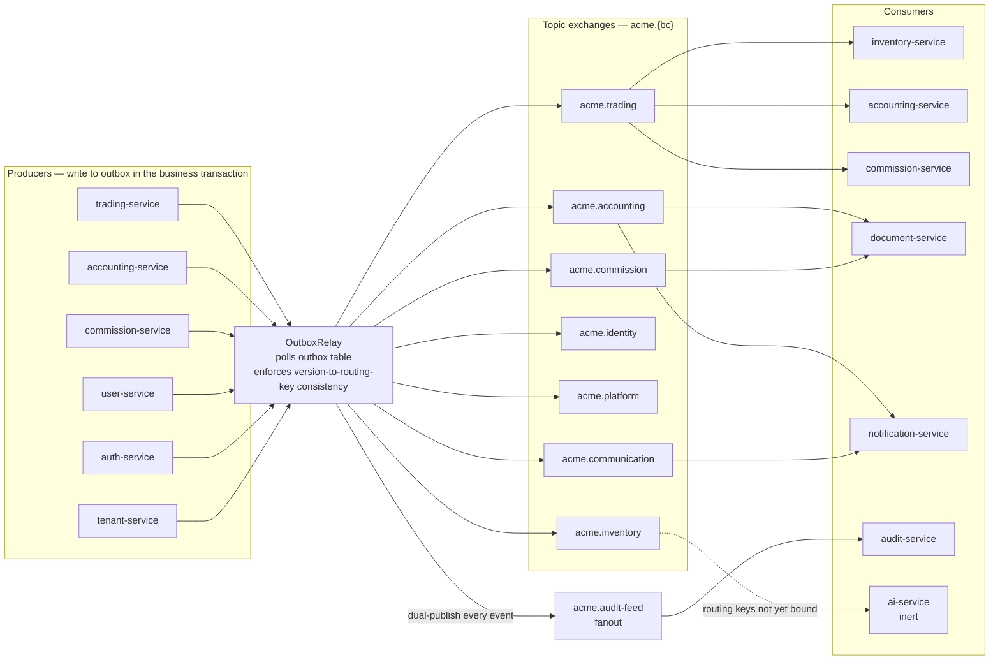
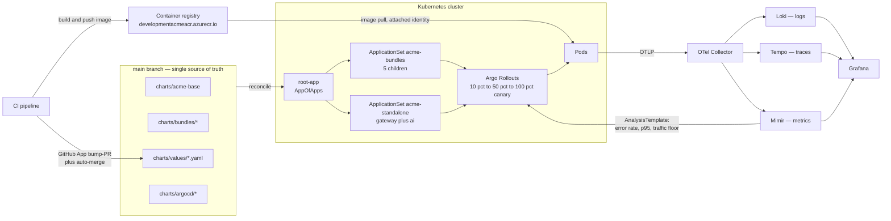

# Container View — Acme Platform

What this covers: the C4 container level. One React SPA, one API gateway, **twelve**
bounded-context services, and the shared data and messaging plane they sit on. The service
list here was enumerated from `apps/platform/*` in the source repository, not from the
architecture overview document — that document is stale and still describes the four-service
M1 platform. Ports, database schemas, exchange names and namespace assignments were read
from `gateway/src/config/gateway.config.ts`, each service's `config/*.config.ts`,
`charts/bundles/*/values.yaml` and `charts/values/*.yaml`.

---

## 1. Containers, grouped by bounded context

```mermaid
C4Container
    title Container Diagram — Acme Platform

    Person(user, "Platform user", "Trader, finance, admin or superadmin")

    System_Boundary(acme, "Acme Platform") {
        Container(spa, "Web frontend", "React, Vite, @acme/ui, React Query", "SPA. Served same-origin with the gateway.")
        Container(gw, "API gateway", "NestJS plus Fastify, port 3000", "JWT verify, tenant resolution, rate limit, circuit breaker, prefix routing.")

        Container_Boundary(identity, "Identity bundle — namespace acme-identity") {
            Container(auth, "auth-service", "NestJS, 3001, schema auth", "Login, JWT issue, refresh rotation, MFA, OIDC, sessions.")
            Container(tenant, "tenant-service", "NestJS, 3002, schema platform", "Tenant CRUD, tiers, feature flags, onboarding.")
            Container(userv, "user-service", "NestJS, 3003, schema identity", "Users, RBAC catalogue, invitations.")
        }

        Container_Boundary(trading, "Trading bundle — namespace acme-trading") {
            Container(trade, "trading-service", "NestJS, 3005, schema trading", "Deals, purchases, sales, haulages, overheads, credit notes, reference data.")
            Container(inv, "inventory-service", "NestJS, 3006, schema inventory", "Stock movements, positions, reservations.")
        }

        Container_Boundary(finance, "Finance bundle — namespace acme-finance") {
            Container(acct, "accounting-service", "NestJS, 3010, schema accounting", "Invoices, accounting months, FX rates, bank accounts, ERP posting.")
            Container(comm, "commission-service", "NestJS, 3012, schema commission", "Commission calculation, rules, approval and payment.")
        }

        Container_Boundary(comms, "Comms bundle — namespace acme-comms") {
            Container(notif, "notification-service", "NestJS, 3020, schema notification", "Email dispatch, delivery status, retry, DLQ.")
            Container(doc, "document-service", "NestJS, 3021, schema document", "PDF generation and document storage.")
        }

        Container_Boundary(ops, "Ops bundle — namespace acme-ops") {
            Container(audit, "audit-service", "NestJS, 3022, schema audit", "Immutable audit trail from the fanout feed.")
            Container(rep, "reporting-service", "NestJS, 3023, schema reporting", "Read-model reports, dashboards, exports, schedules.")
        }

        Container(ai, "ai-service", "NestJS, 3024, schema ai — namespace acme-ai", "Signals, predictions, agent registration and sessions. Deployed, consumers inert.")

        ContainerDb(pg, "PostgreSQL 16", "Managed flexible server", "One cluster, twelve per-BC schemas, per-service roles.")
        ContainerDb(redis, "Redis", "Managed cache", "Tenant resolution cache, JWT JTI revocation, MFA and reset tokens, rate-limit counters.")
        ContainerQueue(mq, "RabbitMQ", "Bitnami StatefulSet, topology-operator managed", "Per-BC topic exchanges plus one audit fanout. Also work queues.")
        Container(obs, "Observability stack", "OTel Collector, Loki, Tempo, Mimir, Grafana", "Logs, traces, metrics. Backs canary SLO analysis.")
    }

    System_Ext(erp, "ERP accounting", "Invoice posting and reference data")
    System_Ext(idp, "External IdP", "Per-tenant OIDC")
    System_Ext(mail, "Email provider", "Transactional mail")
    System_Ext(blob, "Object storage", "PDFs and tenant assets")

    Rel(user, spa, "Uses", "HTTPS")
    Rel(spa, gw, "REST plus httpOnly cookies", "HTTPS same-origin")
    Rel(gw, auth, "Proxies auth and OIDC routes", "HTTP")
    Rel(gw, tenant, "Proxies tenant and public discovery", "HTTP")
    Rel(gw, userv, "Proxies users and invitations", "HTTP")
    Rel(gw, trade, "Proxies deals, sales, purchases, ref data", "HTTP")
    Rel(gw, inv, "Proxies stock", "HTTP")
    Rel(gw, acct, "Proxies invoices, months, rates, ERP", "HTTP")
    Rel(gw, comm, "Proxies commissions and rules", "HTTP")
    Rel(gw, notif, "Proxies notifications and deliveries", "HTTP")
    Rel(gw, doc, "Proxies documents", "HTTP")

    Rel(auth, userv, "Resolves auth context", "HTTP internal")
    Rel(acct, erp, "Posts invoices, syncs ref data", "HTTPS OAuth2")
    Rel(auth, idp, "Authorization code plus PKCE", "OIDC")
    Rel(notif, mail, "Sends mail", "SDK")
    Rel(doc, blob, "Stores PDFs", "SDK")
    Rel(tenant, blob, "Stores branding assets", "SDK")

    Rel(gw, redis, "Rate limit and JTI blocklist", "TLS")
    Rel(auth, redis, "MFA challenge, reset token, revocation", "TLS")
    Rel(trade, mq, "Publishes trading events", "AMQP")
    Rel(inv, mq, "Consumes trading events", "AMQP")
    Rel(acct, mq, "Publishes and consumes", "AMQP")
    Rel(comm, mq, "Publishes and consumes", "AMQP")
    Rel(audit, mq, "Consumes fanout feed", "AMQP")
    Rel(trade, pg, "MikroORM", "TLS required")
    Rel(acct, pg, "MikroORM", "TLS required")
```



### What this shows

Thirteen application containers (gateway plus twelve services), one SPA, three stateful
backing services, and one observability stack. Services are **grouped five ways**, and that
grouping is not cosmetic — it is the deployment unit.

### Takeaways

1. **Twelve services, but only seven deployable Applications.** Five BC-aligned umbrella
   charts (identity, trading, finance, comms, ops) plus two standalone Applications
   (gateway, ai). Per-service primitives — HPA, PDB, NetworkPolicy, ExternalSecret — survive
   the consolidation because each bundle aliases the shared `acme-base` chart once per
   service. See ADR-0033 _BC-aligned bundle deploy units_.
2. **The gateway routes nine services, not twelve.** `GatewayConfigSchema` declares
   `AUTH_SERVICE_URL`, `TENANT_SERVICE_URL`, `USER_SERVICE_URL`, `TRADING_SERVICE_URL`,
   `INVENTORY_SERVICE_URL`, `ACCOUNTING_SERVICE_URL`, `COMMISSION_SERVICE_URL`,
   `NOTIFICATION_SERVICE_URL` and `DOCUMENT_SERVICE_URL`. **There is no gateway URL for
   `audit-service`, `reporting-service` or `ai-service`** — they are event-driven and
   internal-only, with no public HTTP surface through the front door.
3. **Every service is the same shape.** NestJS on the Fastify adapter, MikroORM, a Zod
   config schema, `ServiceModule.forRoot()` from `@acme/service-bootstrap` wiring health,
   logging, exception filter, ORM, event bus and queue. Divergence between services is
   domain logic, not plumbing.
4. **`@acme/common` must be imported first in every `main.ts`.** OpenTelemetry has to patch
   before NestJS, Fastify or the PostgreSQL driver load. Import ordering is a correctness
   constraint here, not style.
5. **Redis is cache-only, by decision.** No queues, no job state. ADR-0017 removed the
   BullMQ path deliberately so there is exactly one broker.

### Invariant encoded

> **A bounded context owns its schema exclusively and no cross-schema join exists.** Twelve
> schemas — `auth`, `identity`, `platform`, `trading`, `inventory`, `accounting`,
> `commission`, `document`, `notification`, `audit`, `reporting`, `ai` — on one PostgreSQL
> cluster, each with its own PostgreSQL role and restricted GRANTs. Cross-BC data access is
> an event or an internal HTTP endpoint, never a join. ADR-0013, ADR-0022.

---

## 2. Bundle-to-namespace-to-schema mapping

```
charts/
├── acme-base/                 shared templates: Rollout, Service, HPA, PDB,
│                              NetworkPolicy, ExternalSecret, migration Job
├── bundles/
│   ├── identity-bundle/       ns acme-identity   auth(3001) tenant(3002) user(3003)
│   │                          + acme-pg-bootstrap + acme-rmq-bootstrap
│   ├── trading-bundle/        ns acme-trading    trading(3005) inventory(3006)
│   ├── finance-bundle/        ns acme-finance    accounting(3010) commission(3012)
│   ├── comms-bundle/          ns acme-comms      notification(3020) document(3021)
│   └── ops-bundle/            ns acme-ops        audit(3022) reporting(3023)
├── values/                    per-service image tags, replicas, env
│   ├── gateway.yaml           ns acme-gateway    gateway(3000)
│   ├── ai-service.yaml        ns acme-ai         ai(3024)
│   └── …one file per service
├── acme-frontend/             ns acme-frontend   SPA, same-origin with gateway
├── databases/                 CloudNativePG cluster, pooler, backups, restore-verify
├── messaging-topology-operator/  declarative exchanges, queues, bindings, users
├── observability/             recording rules, alert rules, dashboards
└── argocd/                    root-app + 2 ApplicationSets + platform add-ons
```

| Bundle          | Namespace       | Services               | Schemas                        | Publishes to                         |
| --------------- | --------------- | ---------------------- | ------------------------------ | ------------------------------------ |
| identity-bundle | `acme-identity` | auth, tenant, user     | `auth`, `platform`, `identity` | `acme.identity`, `acme.platform`     |
| trading-bundle  | `acme-trading`  | trading, inventory     | `trading`, `inventory`         | `acme.trading`, `acme.inventory`     |
| finance-bundle  | `acme-finance`  | accounting, commission | `accounting`, `commission`     | `acme.accounting`, `acme.commission` |
| comms-bundle    | `acme-comms`    | notification, document | `notification`, `document`     | `acme.communication`                 |
| ops-bundle      | `acme-ops`      | audit, reporting       | `audit`, `reporting`           | `acme.reporting`                     |
| standalone      | `acme-gateway`  | gateway                | none                           | none                                 |
| standalone      | `acme-ai`       | ai                     | `ai`                           | `acme.ai`                            |

### Takeaways

1. **`identity-bundle` consolidated three former namespaces** (`acme-auth`, `acme-platform`,
   `acme-identity`) into one. Consequence: auth-to-tenant and user-to-auth calls became
   intra-namespace short names, and only the gateway needs a cross-namespace allowance.
2. **`identity-bundle` is the only bundle carrying bootstrap subcharts.** `acme-pg-bootstrap`
   (roles and GRANTs) and `acme-rmq-bootstrap` (broker users) run there because identity is
   the first bundle to sync.
3. **The gateway is the sole legitimate cross-namespace HTTP caller.** Every bundle's
   NetworkPolicy pins ingress to a `namespaceSelector` matching the gateway namespace. This
   is the enforcement that makes unsigned identity headers safe.
4. **Namespace boundaries follow bounded contexts, not tiers.** There is no "backend"
   namespace. A schema, a service, a namespace and an exchange all carry the same BC name.
5. **The frontend is a chart, not a static-hosting product.** It deploys into the cluster
   and is served same-origin with the gateway, which removes the CORS surface entirely.
   ADR-0058 _Gateway CORS soft-reject same-origin_.

### Invariant encoded

> **One bounded context = one schema = one namespace = one exchange = one PostgreSQL role.**
> When these five stop agreeing, isolation has already been broken somewhere upstream.

---

## 3. Gateway request pipeline



### What this shows

The order in which cross-cutting concerns run, and the two places where a request can be
turned away without ever touching a bounded context. Header stripping happens **before**
authentication; header injection happens **after** routing has already chosen the upstream.

### Takeaways

1. **Public routes are enumerated, not inferred.** `requiresAuth: false` appears on exactly five prefixes: `/api/v1/public/tenants`, `/api/v1/public/auth`, `/api/v1/auth/oidc`,
   `/api/v1/auth`, and `/api/v1/invitations/accept`. Everything else authenticates. The
   invitation-accept exception is deliberate — the single-use, sha256-hashed, 72-hour token
   _is_ the authorization.
2. **First-match-wins ordering is load-bearing.** `/api/v1/auth/oidc` must precede
   `/api/v1/auth`; `/api/v1/invitations/accept` must precede `/api/v1/invitations`;
   `/api/v1/platform/tenants` must precede `/api/v1/tenants`. Reordering the array is a
   security change, not a refactor.
3. **Prefix matching is on segment boundaries.** `/api/v1/tenantsX` does not match
   `/api/v1/tenants`. Note the corollary: `/api/v1/products` does **not** cover
   `/api/v1/product-groups`, which needs its own registry entry — a real bug this rule
   caused and then made obvious.
4. **Rate-limit keys must include the tenant id.** A key that omits it lets one tenant
   exhaust another's budget. This was a real defect in the password-reset path.
5. **Body limits are per-route class:** 1 MB default, 10 MB for document upload, 5 MB for
   imports. Health endpoints (`/health`, `/health/live`, `/health/ready`) bypass tenant
   resolution entirely so a probe never depends on tenant state.

### Invariant encoded

> **Identity is stripped before it is verified, and injected after routing.** There is no
> window in which a client-supplied identity header coexists with a routing decision.

---

## 4. Messaging plane



### What this shows

Nothing publishes to the broker directly. Every integration event is written to an outbox
table inside the same MikroORM transaction as the business state change, and a relay moves
it. The relay dual-publishes: once to the owning BC's topic exchange, once to a fanout the
audit service consumes.

### Takeaways

1. **Outbox atomicity is a caller-side convention.** The caller supplies the EntityManager
   and wraps the work in `em.transactional`; the outbox adapter **never forks its own EM**.
   A forked or non-request EntityManager silently escapes the tenant filter, so this is a
   correctness rule with a security consequence.
2. **Routing keys are versioned.** On a payload schema change, producers dual-publish to
   `{topic}` and `{topic}.v{N}` until consumers roll out. The relay validates
   version-to-routing-key consistency at publish time and dead-letters mismatches with a
   structured error. ADR-0036.
3. **Queue naming is `{consumer-service}.{producer-bc}`** — e.g. `inventory-service.trading`.
   The consumer owns the queue, so a slow consumer cannot back-pressure a producer into
   failure.
4. **The audit fanout is the reason audit-service has no HTTP surface.** ADR-0026 chose a
   fanout over N topic bindings so that adding a bounded context does not require touching
   audit-service configuration. The cost is real: every payload lands verbatim in the audit
   store, which is why an off-by-default `auditSecretFields` denylist exists to strip tokens
   before they are persisted.
5. **`ai-service` binds exchanges and routing keys that do not yet exist.** It is deployed
   and healthy but its consumers are non-functional pending prerequisite work, and its
   financial input streams are gated on FD sanction. ADR-0047.
6. **In-process domain events never reach the broker.** NestJS `EventEmitter` handles
   intra-service domain events inside one unit of work; only integration events cross the
   boundary. ADR-0018.

### Invariant encoded

> **An event is published if and only if the business state change committed.** No
> publish-then-write, no write-then-publish, no compensating cleanup. Combined with
> ADR-0072 _inbox idempotency parked-message tables_, at-least-once delivery becomes
> effectively-once processing.

---

## 5. Deploy and observability plane



### What this shows

The deploy loop closes **inside** the cluster. CI's last act is to open a bump-PR against
an image-tag values file; from there the GitOps controller reconciles, Argo Rollouts runs
the canary, and the rollback decision is made by an AnalysisTemplate querying Mimir — not by
a CI step watching from outside.

### Takeaways

1. **Auto-rollback is in-cluster.** If a canary burns error budget, Rollouts aborts it with
   no human and no pipeline involvement. A CI-side rollback would be blind whenever the
   pipeline itself is unavailable. ADR-0034.
2. **No static long-lived credentials in the deploy path.** CI writes to `main` as a GitHub
   App whose private key lives in the vault and is synced into the cluster by External
   Secrets Operator. Pods reach the vault through per-namespace workload-identity
   federation. Registry pulls use the cluster's attached identity. ADR-0035, ADR-0051.
3. **Seven Applications, not twelve, and the root manages itself.** `root-app.yaml` is
   applied once by bootstrap; from then on the controller reconciles the rest of
   `charts/argocd/` — AppProject, both ApplicationSets, notifications, ESO syncs, Rollouts,
   cert-manager and the messaging topology operator. ADR-0032.
4. **The ingress controller is deliberately outside this loop.** It is a standalone Helm
   release; changes require a manual `helm upgrade`. Expect exactly one confusing incident
   per team member who has not read this sentence.
5. **Metrics feed a control loop, not just a dashboard.** The same Mimir that renders
   Grafana panels gates the canary. Instrumentation gaps are therefore a _deployment safety_
   problem: if a service does not emit, the AnalysisTemplate has nothing to fail on.

### Invariant encoded

> **The desired state of every deployable is a file on one branch.** Image tags, replica
> counts, environment and ArgoCD manifests all live on `main`. There is no second GitOps
> branch and no imperative `kubectl apply` in the deploy path — an out-of-band change is
> drift, and the controller will reverse it.

---

## 6. Cross-cutting shared libraries

All shared code lives under `libs/acme/` and is imported as `@acme/{name}`. Grouped by role:

| Group          | Libraries                                                                 | Constraint they enforce                                                                                                                    |
| -------------- | ------------------------------------------------------------------------- | ------------------------------------------------------------------------------------------------------------------------------------------ |
| DDD core       | `domain-primitives`, `specifications`, `exceptions`, `event-contracts`    | Zero or near-zero dependencies. Domain layers may import these and nothing else.                                                           |
| Contracts      | `api-contracts`, `platform-contracts`                                     | Response envelope shape; gateway-injected header types.                                                                                    |
| Data access    | `mikro-orm`, `event-bus`, `service-client`                                | `TenantBaseEntity` and the always-on tenant filter; transactional outbox; inter-service HTTP with circuit breaker and context propagation. |
| Infrastructure | `common`, `auth-client`, `logger`, `config`, `queue`, `service-bootstrap` | OTel init ordering; Zod-validated config that fails fast; distributed cron with advisory locks; one-line service wiring.                   |
| Frontend       | `ui`, `data-access`                                                       | The design-system kit and the API/React Query layer.                                                                                       |
| Cross-platform | `utils`, `testing`                                                        | Runtime-agnostic helpers; Testcontainers fixtures.                                                                                         |

The dependency rule — infrastructure → application → domain — is enforced at build time by
Nx tags and `@nx/enforce-module-boundaries` across three dimensions: `scope:` (a hard wall
between platform and legacy), `bc:` (cross-BC imports only through `layer:contracts`), and
`layer:` (domain may depend only on shared-kernel and published-language).

Three consequences worth stating: a boundary violation fails **lint**, not review — the only
kind of architectural rule that survives a year; `@acme/service-bootstrap` is why twelve
services stay consistent, since health, exception filter, logger, ORM, event bus, queue and
migration runner are wired exactly once; and branded ID types (`TenantId`, `UserId`,
`DealId`, `InvoiceId`) are distinct at compile time, so passing a `UserId` where a `DealId`
belongs is a type error rather than a production incident.

---

## 7. Deciding ADRs at this level

**Structure:** 0013 Per-BC PostgreSQL schema isolation · 0014 Microservices separate binaries
day one · 0022 Database instance hardening strategy · 0025 CQRS read-model projections for
reporting.
**Messaging:** 0017 RabbitMQ unified messaging · 0018 Transactional outbox for domain events ·
0026 Audit-feed fanout exchange · 0036 Versioned event routing keys · 0049 RabbitMQ cluster
operator adoption · 0072 Inbox idempotency parked-message tables.
**Deploy and runtime:** 0015 Kubernetes deployment zero-downtime · 0032 Single-branch GitOps
AppOfApps · 0033 BC-aligned bundle deploy units · 0034 Argo Rollouts SLO analysis · 0035
Workload Identity end-to-end.
**Edge and presentation:** 0019 OpenTelemetry plus Grafana observability · 0058 Gateway CORS
soft-reject same-origin · 0060 Frontend stack: design kit plus React Query.

---

## 8. What could not be verified

- **`reporting-service` runtime maturity.** It has `custom-reports`, `dashboard`, `exports`,
  `reports` and `schedules` modules and a `reporting` schema, but no gateway route, so its
  consumption path is not observable from the routing table. Whether reports are surfaced
  through another service or are not yet exposed could not be determined from source.
- **`audit-service` HTTP surface.** Its source tree has no `modules/` directory — only
  `audit/`, `common/`, `config/`, `migrations/` — consistent with a pure consumer, but this
  is inference from layout, not from a verified absence of controllers.
- **`ai-service` bindings.** Confirmed deployed with its own namespace and chart values;
  confirmed its consumers bind routing keys that do not exist. The dashed arrow in §4 marks
  that honestly rather than drawing a working subscription.
- **Exact Redis SKU and replication in non-development environments.** Development is
  documented as a single-node cache with no replication, with the consequence that JWT
  revocations are lost on restart and tokens survive to their natural 15-minute expiry.
  Production sizing was not verified.

Previous: [00-system-context.md](00-system-context.md).
