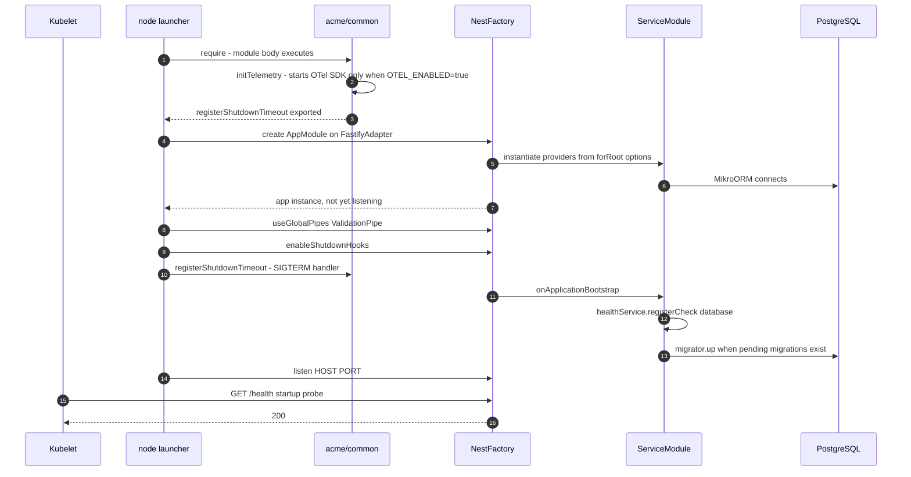
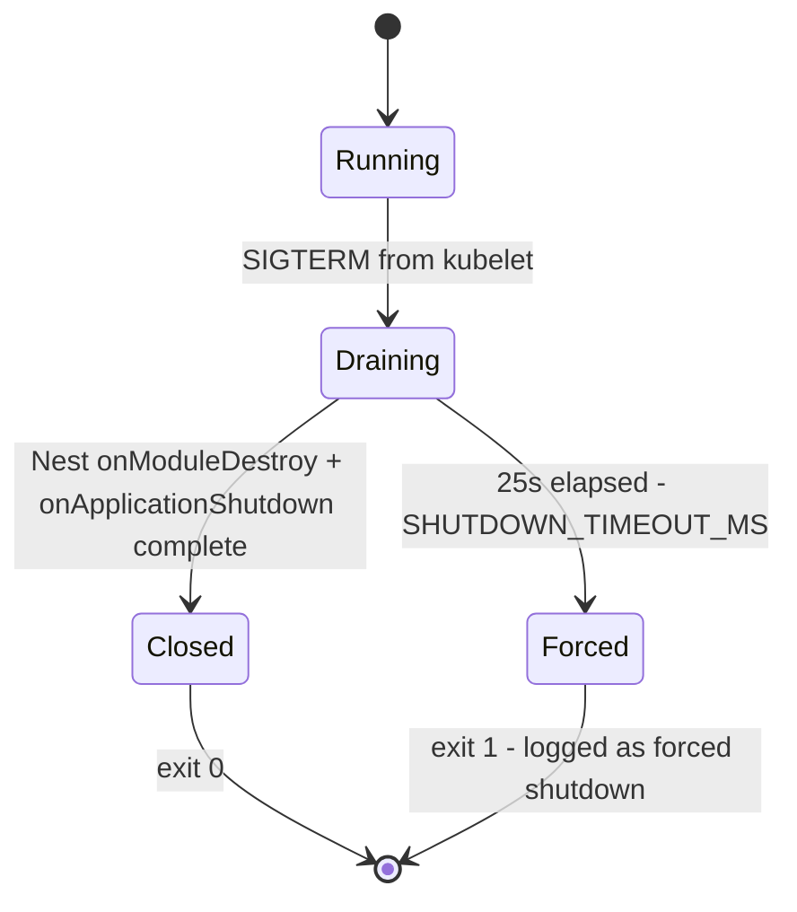
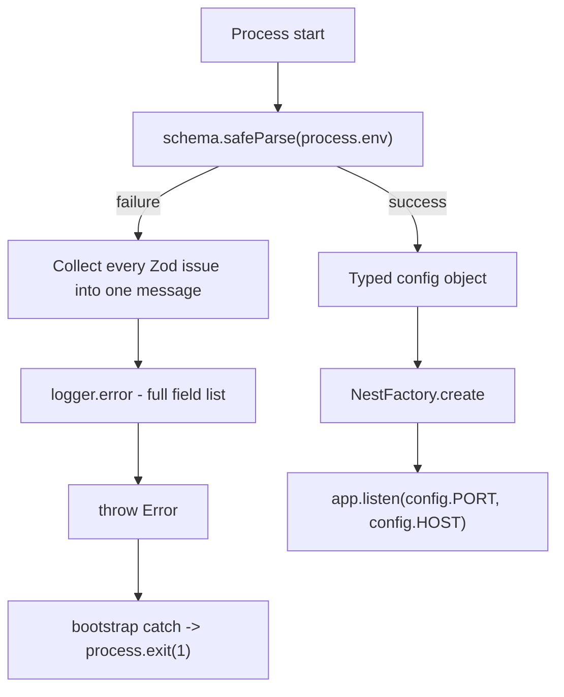
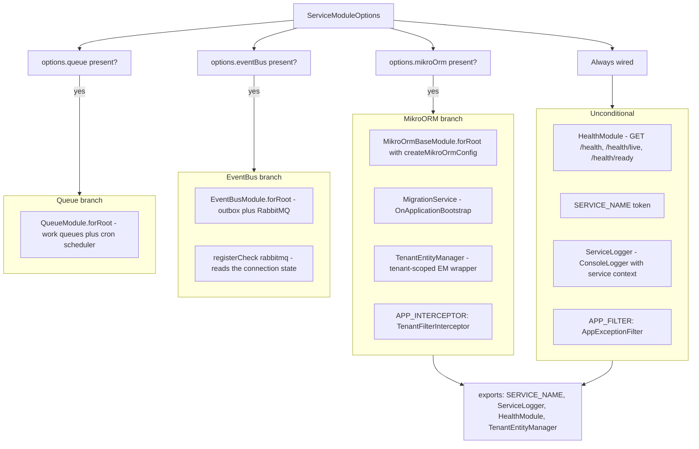
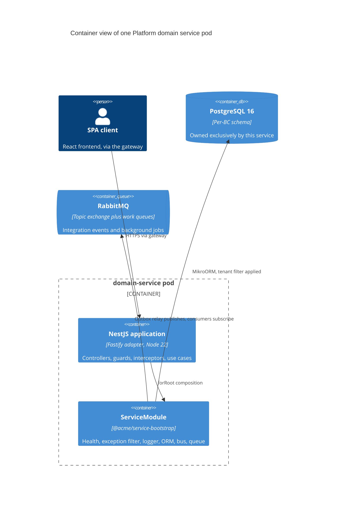
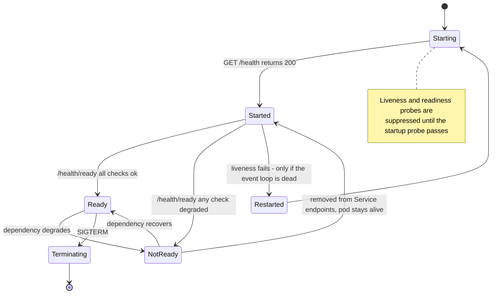
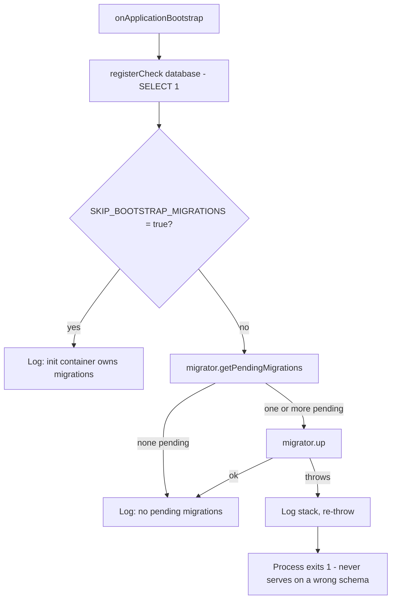
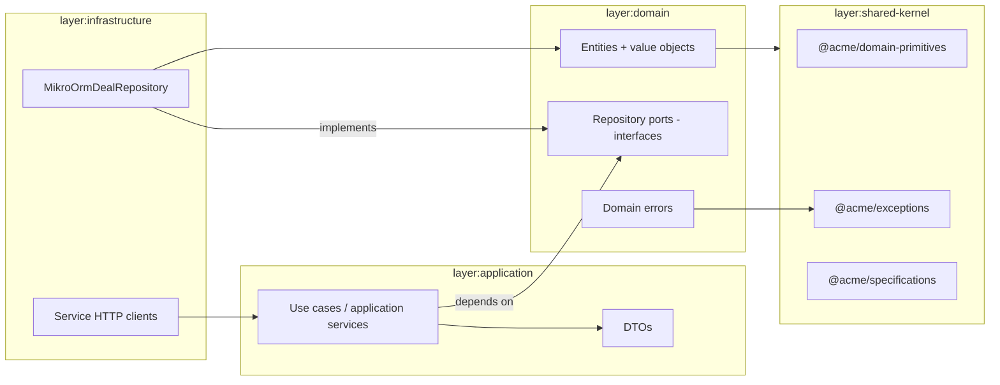
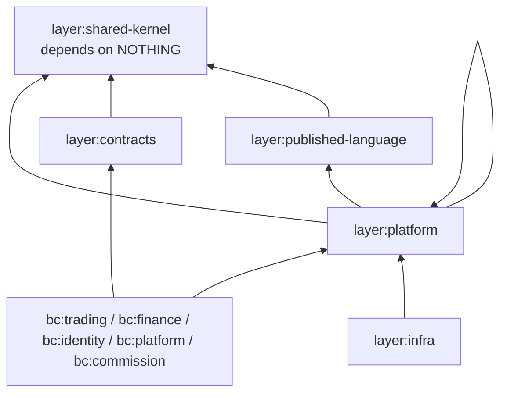

# Platform Service Anatomy

Every Platform backend service in the Acme monorepo is the same shape: a NestJS
application on the Fastify adapter, booted by a ~40-line `main.ts`, with all shared
infrastructure (health probes, exception filter, logger, ORM, event bus, job queue)
injected by one dynamic module — `ServiceModule.forRoot()` from
`@acme/service-bootstrap`. This document describes that shape: the boot sequence and
its ordering constraints, config validation, the health-probe contract Kubernetes
depends on, the migration-on-bootstrap path, the domain → application → infrastructure
layering inside a service, and the shared-library dependency graph that ESLint enforces
at build time. Everything here was read from `apps/platform/**`, `libs/platform/**` and
`charts/platform-base/values.yaml`; where the code diverges from the documented
convention, that divergence is called out rather than smoothed over.

---

## 1. The bootstrap contract

Thirteen services live under `apps/platform/`. All of them boot through the same
`main.ts` skeleton:

```
apps/platform/<service>/src/main.ts
├── // "OpenTelemetry MUST be imported before any other module"   <- convention comment
├── import { ValidationPipe }        from '@nestjs/common'
├── import { NestFactory }           from '@nestjs/core'
├── import { FastifyAdapter, ... }   from '@nestjs/platform-fastify'
├── import { registerShutdownTimeout } from '@acme/common'        <- telemetry side-effect
├── import { AppModule }             from './app.module'
│
└── async function bootstrap()
    ├── NestFactory.create<NestFastifyApplication>(AppModule, new FastifyAdapter())
    ├── app.useGlobalPipes(new ValidationPipe({ whitelist, forbidNonWhitelisted, transform }))
    ├── app.enableShutdownHooks()          // SIGTERM -> Nest lifecycle hooks
    ├── registerShutdownTimeout()          // 25s force-exit safety net
    ├── SwaggerModule.setup('api/docs', …) // 9 of 13 services
    └── app.listen(PORT, '0.0.0.0')

    bootstrap().catch(err => { console.error(...); process.exit(1) })   // fail loud
```



**Takeaways**

1. `@acme/common` is not a passive import. `libs/platform/common/src/lib/telemetry.ts`
   executes `const sdk = initTelemetry();` at module scope, so merely importing
   `registerShutdownTimeout` starts the OpenTelemetry Node SDK. The SDK is gated on
   `OTEL_ENABLED === 'true'`; unset means a genuine no-op, and the OTel packages are
   pulled in through dynamic `require()` so they stay out of the bundle when disabled.
2. Instrumentation-before-framework is a **convention documented in a comment, not an
   enforced invariant**. In every service that carries the comment, the first executed
   import is `@nestjs/common`, and `@acme/common` sits several lines below it (the
   import-order lint rule groups third-party before workspace packages). Auto-instrumentation
   still patches `http`/`pg` because those are loaded lazily by Nest, but the stated
   guarantee is weaker than the comment implies. Treat this as a known gap.
3. `app.listen(port, '0.0.0.0')` binds all interfaces because the pod is only reachable
   through the Service/ingress; `HOST` is configurable but defaults to `0.0.0.0` in
   `ServiceConfigSchema`.
4. A boot failure is fatal and loud: the top-level `.catch` logs and calls
   `process.exit(1)`, so a mis-configured pod CrashLoopBackOffs rather than serving
   traffic in a degraded state.

**Invariant encoded:** a service either starts fully wired (telemetry, validated config,
schema migrated) or it does not start at all. There is no partial-boot mode.

### Graceful shutdown

`registerShutdownTimeout()` (`libs/platform/common/src/lib/shutdown.ts`) installs a
`SIGTERM` listener that arms a 25-second timer and then `process.exit(1)`. The number is
derived, not arbitrary: Kubernetes sends SIGTERM, waits
`terminationGracePeriodSeconds` (30 by default) and then SIGKILLs, so the safety net
fires 5 seconds early — enough to log the forced shutdown before the kernel takes over.



Two details matter operationally. The timer is `unref()`'d, so a clean shutdown is not
delayed by the safety net itself. And `SHUTDOWN_TIMEOUT_MS` overrides the default, which
is what you change when a service holds long-running consumers that legitimately need
more drain time — you must also raise `terminationGracePeriodSeconds` in the chart, or
the safety net becomes dead code.

---

## 2. Configuration: validate once, fail closed

Two `validateConfig` helpers exist and both are in use: one in `@acme/config` and one in
`@acme/service-bootstrap`. Both take a Zod object schema, run `safeParse` against
`process.env`, and on failure throw an `Error` whose message enumerates **every**
offending field (`  - FIELD: message`, one per line) rather than the first one. That
matters when a fresh environment is missing six variables: you get all six in one pod
log, not six deploy iterations.



`ServiceConfigSchema` in `@acme/config` is the shared base:

| Field      | Rule                                                        | Why                                                                                              |
| ---------- | ----------------------------------------------------------- | ------------------------------------------------------------------------------------------------ |
| `PORT`     | `coerce.number().int().min(1).max(65535).default(3000)`     | Env vars are strings; coercion keeps `Number(...)` out of app code                               |
| `HOST`     | `string().default('0.0.0.0')`                               | Container binding                                                                                |
| `NODE_ENV` | `enum(development,test,production,staging)`, **no default** | Fail-closed (#1343): a missing value crashes the pod instead of silently selecting `development` |

The missing `NODE_ENV` default is the single most instructive rule in the file. It used
to default to `development`; nothing in `charts/**` set the variable, so every cluster
pod read `development`, which would have (a) permitted the known-credential dev
superadmin seed to run in a real cluster and (b) flipped every `NODE_ENV`-keyed
fail-closed rule into "safe mode". Removing the default converted a silent
misconfiguration into a boot crash. The chart now sets `NODE_ENV` explicitly for every
service, with `production` as the base value and `development` only in the dev overlay.

The same fail-closed pattern is factored into a reusable refinement for the shared
service-to-service secret. `refineInternalApiSecret()` rejects, outside
`development`/`test`, a secret that is (1) absent, (2) equal to the well-known dev
sentinel, or (3) shorter than 32 characters — and never echoes the value into the
error message.

**Invariant encoded:** configuration is parsed once, at the process boundary, into a
typed object. Application code injects the validated config; it does not read
`process.env`. (Compliance is partial — see §7.)

---

## 3. `ServiceModule.forRoot()` — the composition root

`ServiceModule` is a `@Module({})` shell whose only job is `forRoot(options)`. It returns
a **global** dynamic module, so a feature module anywhere in the service can inject
`ServiceLogger`, `SERVICE_NAME` or `TenantEntityManager` without re-importing anything.
Every block below `serviceName` is conditional on the corresponding options key being
present, which is how a service without a database (or without events, or without jobs)
avoids paying for wiring it will never use.



**Takeaways**

1. The exception filter is registered as `APP_FILTER` here, so **every** service that
   calls `forRoot` gets the canonical error envelope for free. The gateway, which does
   not use `ServiceModule`, registers the same `AppExceptionFilter` class explicitly in
   its own `AppModule` — the class is exported from `@acme/service-bootstrap` precisely
   so the two paths cannot drift.
2. Tenant isolation is wired as a **global interceptor**, not something each controller
   opts into. `TenantFilterInterceptor` reads the per-request tenant context (populated
   from the gateway-injected `x-tenant-id`) and calls
   `em.setFilterParams('tenant', { tenantId })` on the request EntityManager, so a plain
   `em.find()` is automatically tenant-scoped. Isolation-by-default is the property; an
   un-scoped query has to be a deliberate act.
3. Health checks are **registered**, not hardcoded. `HealthService` holds a
   `Map<string, () => Promise<string>>`; the MikroORM branch registers `database`, the
   event-bus branch registers `rabbitmq`. A service with no registered checks reports
   `{ service: 'ok' }` rather than falsely claiming dependencies are healthy.
4. `global: true` is a deliberate trade: it removes dozens of redundant `imports:` lines
   at the cost of making the shared providers ambient. NestJS DI in this codebase
   generally prefers `@Global()` for cross-cutting infrastructure.



---

## 4. Health probes: the three-probe contract

`HealthController` exposes exactly three routes, and `charts/platform-base/values.yaml`
points the three Kubernetes probes at exactly those paths (`/health`, `/health/live`,
`/health/ready` — verified in the chart).

| Route               | Probe     | Behaviour                                                                                    |
| ------------------- | --------- | -------------------------------------------------------------------------------------------- |
| `GET /health`       | startup   | Always `200 {status, timestamp}`. Answers "is the process listening?"                        |
| `GET /health/live`  | liveness  | Always `200`. Delegates to the startup handler — never touches a dependency                  |
| `GET /health/ready` | readiness | Runs all registered checks; `200` if every result is `ok`, else `503` with the per-check map |



**Takeaways**

1. Liveness deliberately never checks external dependencies. If it did, a database blip
   would restart every pod simultaneously — turning a recoverable dependency incident
   into a cluster-wide cascading failure. Readiness is the correct lever: it drains
   traffic without killing the process.
2. `checkDependencies()` runs every registered check through `Promise.allSettled`, and
   each check is additionally wrapped in its own try/catch that converts a throw into an
   error-string result. One broken check therefore degrades readiness; it cannot crash
   the probe endpoint.
3. Readiness returns the **per-check map**, not just a boolean. `{"database":"ok","rabbitmq":"disconnected"}`
   in a pod description is the fastest possible triage signal.
4. The distroless production image has no `curl` or `wget`, so the Docker `HEALTHCHECK`
   uses `node --eval` against `/health/live`. Same contract, different client.

**Invariant encoded:** liveness answers "is this process salvageable"; readiness answers
"should this process receive traffic". Conflating them is the failure mode this split
exists to prevent.

---

## 5. Migrations on bootstrap

`MigrationService` implements `OnApplicationBootstrap`. It registers the `database`
health check first (a `SELECT 1` through `orm.em.getConnection()`), then — unless
`SKIP_BOOTSTRAP_MIGRATIONS=true` — asks the MikroORM migrator for pending migrations and
runs `migrator.up()` if any exist. A migration failure is re-thrown, which propagates to
the `bootstrap().catch` and exits the process.



The two-path design is intentional. When the Helm chart enables the migration init
container (`migrations.enabled=true`), the schema is already current before the app
container starts, and `SKIP_BOOTSTRAP_MIGRATIONS=true` avoids a redundant round-trip and
a confusing "0 pending" log line. Because MikroORM migrations are idempotent, running
both paths is harmless — but "harmless" is not the same as "intended", and the flag makes
the ownership explicit. See ADR-0015 (_K8s deployment zero-downtime_), which also
establishes the three-probe model above.

**Invariant encoded:** a service never serves traffic against a schema it has not
verified. Fail-fast beats a subtly wrong column.

---

## 6. Layering inside a service

Each feature module in a service follows a strict three-layer structure:

```
apps/platform/<service>/src/modules/<feature>/
├── domain/                      layer:domain — zero framework dependencies
│   ├── entities/                MikroORM entities with behaviour, not data bags
│   ├── value-objects/           immutable plain TS classes
│   ├── events/                  domain event type definitions
│   ├── errors/                  extends AppException from @acme/exceptions
│   └── ports/                   repository interfaces + Symbol injection tokens
├── use-cases/                   layer:application — orchestration only
├── dto/                         request/response DTOs (class-validator decorated)
└── infrastructure/              layer:infrastructure — the only ORM-aware layer
    ├── repositories/            MikroORM implementations of domain ports
    └── stubs/                   in-memory test doubles for the same ports
```



**Takeaways**

1. Dependencies point inward only. The domain layer imports `@acme/domain-primitives`,
   `@acme/exceptions` and `@mikro-orm/core` **decorators** — nothing else. It never sees
   an `EntityManager`.
2. Ports are declared as an interface plus a `Symbol` token
   (`export const DEAL_REPOSITORY = Symbol('IDealRepository')`), which is what lets the
   application layer be constructed against an in-memory stub in unit tests and a
   MikroORM repository in production without a conditional anywhere.
3. Port methods are domain-named, not CRUD-named — `findBySlug`, `findLockableForDeal` —
   so the interface expresses the domain's questions rather than the table's columns.
4. Entities are rich: static factories (`Tenant.create()`) enforce creation invariants,
   behaviour methods (`Credential.recordFailedAttempt()`, `Tenant.suspend()`) enforce
   transition invariants, and a parameterless constructor is preserved purely for ORM
   hydration.

---

## 7. Shared libraries and the tag wall

Twenty-one libraries live under `libs/platform/`, imported as `@acme/<name>`. Every one
carries Nx tags, and `@nx/enforce-module-boundaries` in `.eslintrc.base.json` turns those
tags into a compile-time dependency wall.

| Library              | Layer tag            | Role                                                                  |
| -------------------- | -------------------- | --------------------------------------------------------------------- |
| `domain-primitives`  | `shared-kernel`      | `Money`, `Quantity`, `DateRange`, branded id types. Zero deps         |
| `exceptions`         | `shared-kernel`      | `AppException` hierarchy. Zero deps                                   |
| `specifications`     | `shared-kernel`      | `Specification<T>` + And/Or/Not combinators. Zero deps                |
| `event-contracts`    | `published-language` | `DomainEvent<T>` envelope, `OutboxRecord`                             |
| `api-contracts`      | `contracts`          | `ApiResponse`, `PaginatedResponse`, `ApiError`                        |
| `platform-contracts` | `contracts`          | Gateway-injected header type definitions                              |
| `common`             | `platform`           | OTel bootstrap + `registerShutdownTimeout`                            |
| `config`             | `platform`           | Zod schemas + `validateConfig`                                        |
| `logger`             | `platform`           | Pino JSON logger with trace/span injection and secret masking         |
| `mikro-orm`          | `platform`           | `TenantBaseEntity`, tenant filter/interceptor, `createMikroOrmConfig` |
| `event-bus`          | `platform`           | Transactional outbox + `OutboxRelay` + `EventHandler`                 |
| `queue`              | `platform`           | Work queues, `BaseProcessor`, cron with PG advisory locks             |
| `service-client`     | `platform`           | Inter-service HTTP with breaker, retry, context propagation           |
| `auth-client`        | `platform`           | JWT/permission guards and decorators                                  |
| `security-audit`     | `platform`           | Security-audit helpers                                                |
| `testing`            | `platform`           | Testcontainers helpers                                                |
| `utils`              | `platform`           | Runtime-agnostic formatting/validation helpers                        |
| `service-bootstrap`  | `infra`              | `ServiceModule.forRoot()` and everything in §3                        |
| `data-access`        | `data-access`        | Browser-side API client and React Query hooks                         |
| `ui`                 | `ui`                 | `@acme/ui` design-system kit                                          |
| `filter-presets`     | `app`                | Shared list-filter presets                                            |



**Takeaways**

1. `layer:shared-kernel` has `onlyDependOnLibsWithTags: []` — literally an empty
   allow-list. A pull request that adds `import { Logger } from '@nestjs/common'` to
   `@acme/exceptions` fails lint, not review. That is why the exception hierarchy can be
   imported by a domain layer without dragging a framework in behind it.
2. `scope:platform` may depend on `scope:platform` and `scope:platform-shared`;
   `scope:platform-shared` may depend only on `scope:platform-shared`. Combined with the
   legacy scopes (`scope:backend`, `scope:frontend`, `scope:shared`), this is a hard wall
   between the Platform rebuild and the legacy `legacy-api` / `legacy-web` stack.
3. Cross-bounded-context imports are only legal through `layer:contracts`. Every `bc:*`
   tag allows itself, `layer:contracts` and `scope:platform-shared` — nothing else. Two
   BCs share types by publishing a contract, never by reaching into each other's domain.
4. `runtime:` tags (`node`, `browser`, `agnostic`) are declared on every library. They
   are documentation today; they are the natural hook for a future constraint that stops
   a browser bundle importing a `node`-runtime library.

**Invariant encoded:** the architecture diagram is executable. If the dependency graph
drifts from the intended layering, CI fails.

---

## 8. Where the pattern is not yet uniform

Honest gaps, verified by reading all thirteen `main.ts` files:

| Concern                      | Uniform? | Detail                                                                                                                                                                            |
| ---------------------------- | -------- | ---------------------------------------------------------------------------------------------------------------------------------------------------------------------------------- |
| `ValidationPipe`             | **No**   | Registered by each `main.ts` rather than by the shared bootstrap, so its options drift: the full `{ whitelist, forbidNonWhitelisted, transform }`, a transform-only variant, and no global pipe at all are all present |
| Validated config             | **No**   | Config validation is opt-in per service; the common path reads `process.env['PORT'] ?? <literal>` inline, so a missing or malformed variable surfaces at first use rather than at boot |
| Shutdown handling            | Yes      | Every service calls `enableShutdownHooks()` then `registerShutdownTimeout()`                                                                                                       |
| OpenAPI at `/api/docs`       | **No**   | Most services publish a document, some gate it behind `NODE_ENV !== 'production'`, some publish none — three different answers to one question nobody asked twice                   |
| Instrumentation-first import | **No**   | Comment present, import order does not match it (§1)                                                                                                                               |
| Response envelope            | **No**   | `@acme/api-contracts` still exports the M1 `{ data, meta? }` / `{ data, pagination }` shapes, while ADR-0061 mandates `{ data, meta, errors[] }` — see `02-api-architecture.md`     |

Every row has the same cause: the concern is bootstrapped per service in a hand-written
`main.ts` rather than by the shared factory, so it is a default that each service
re-decides and none re-reviews. That is tolerable for an OpenAPI document and not for a
validation pipe, which is the sharpest of these: a service without a global pipe does not
strip unknown properties from request bodies, and a `whitelist`-less pipe does not reject
them, so the difference between the two configurations is invisible until a payload
exercises it. There is a related, subtler trap: declaring a DTO parameter with
`import type { CreateFooDto }` erases the runtime class reference, which silently disables
`ValidationPipe` for that handler with no error at all — a pipe that is registered and a
pipe that runs are still two different things. The fix for the whole column is to move
these registrations into the shared bootstrap, where the option object is written once and
an exception has to be argued.

---

## Cross-references

- **ADR-0013** — _Per-BC PostgreSQL schema isolation_: each service owns one schema; no
  cross-schema joins.
- **ADR-0014** — _Microservices, separate binaries day one_: why every bounded context is
  its own NestJS application with its own `main.ts`.
- **ADR-0015** — _K8s deployment zero-downtime_: source of the three-probe model and the
  init-container migration path in §4–5.
- **ADR-0017** — _RabbitMQ unified messaging_: why `ServiceModule` has one branch for
  events and one for jobs, both on RabbitMQ, with Redis reserved for caching.
- **ADR-0018** — _Transactional outbox for domain events_: the outbox that the event-bus
  branch wires.
- **ADR-0019** — _OpenTelemetry + Grafana observability_: the SDK started by `@acme/common`.
- **ADR-0071** — _Optimistic locking, version in DTO_: surfaces through the shared
  exception filter as `409 STALE_WRITE` (see `02-api-architecture.md` §4).
