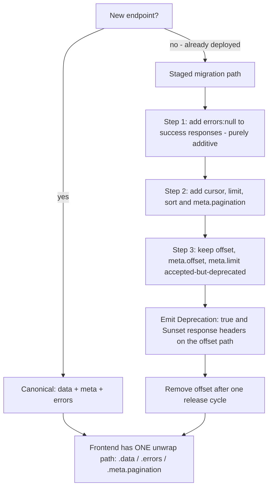
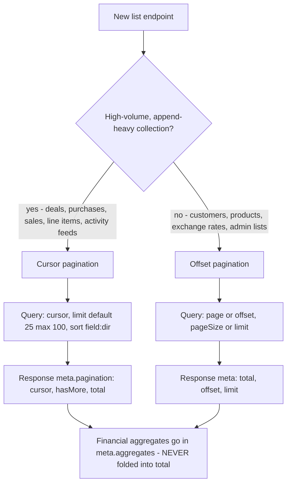
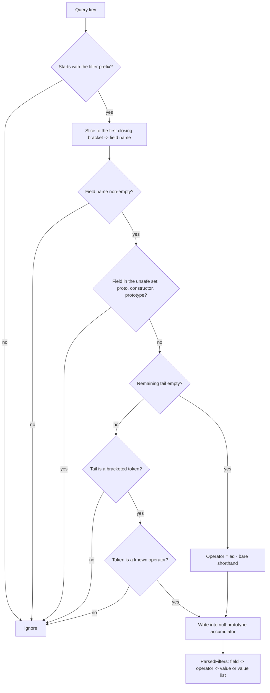
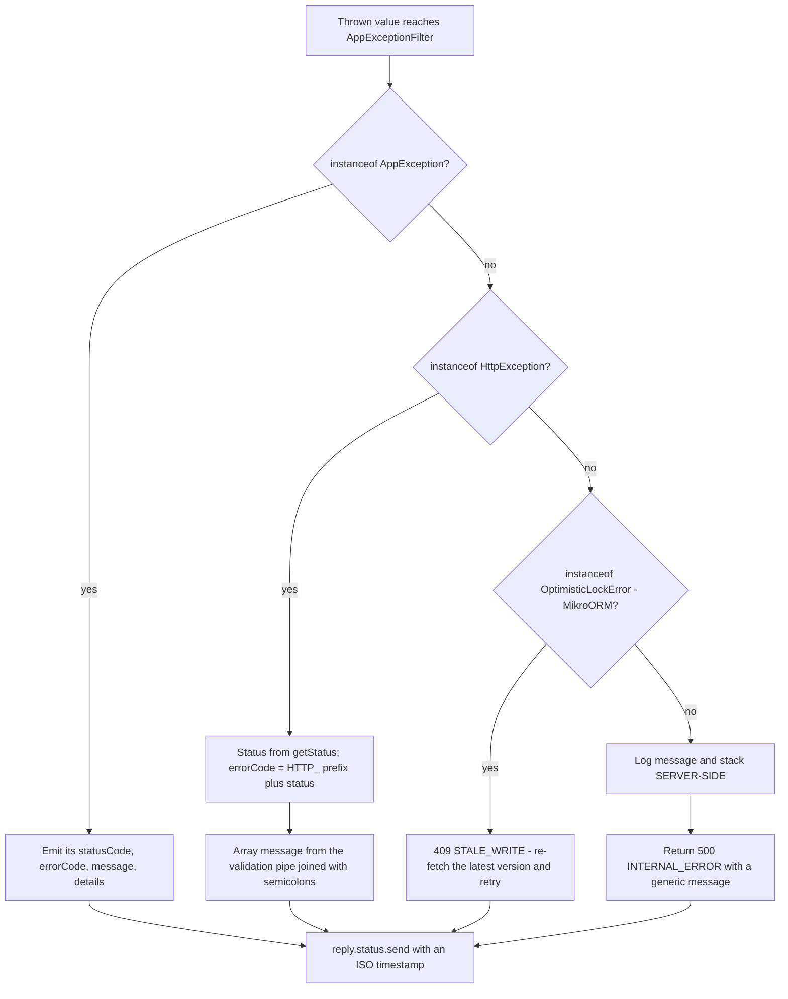
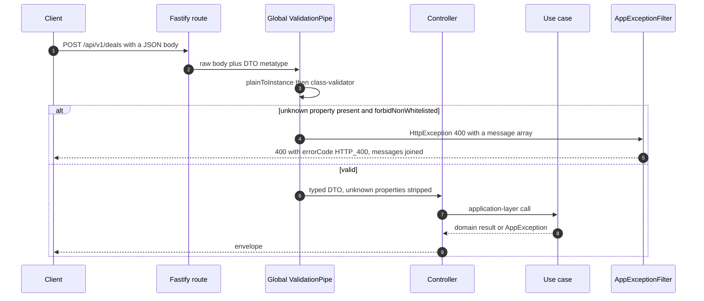
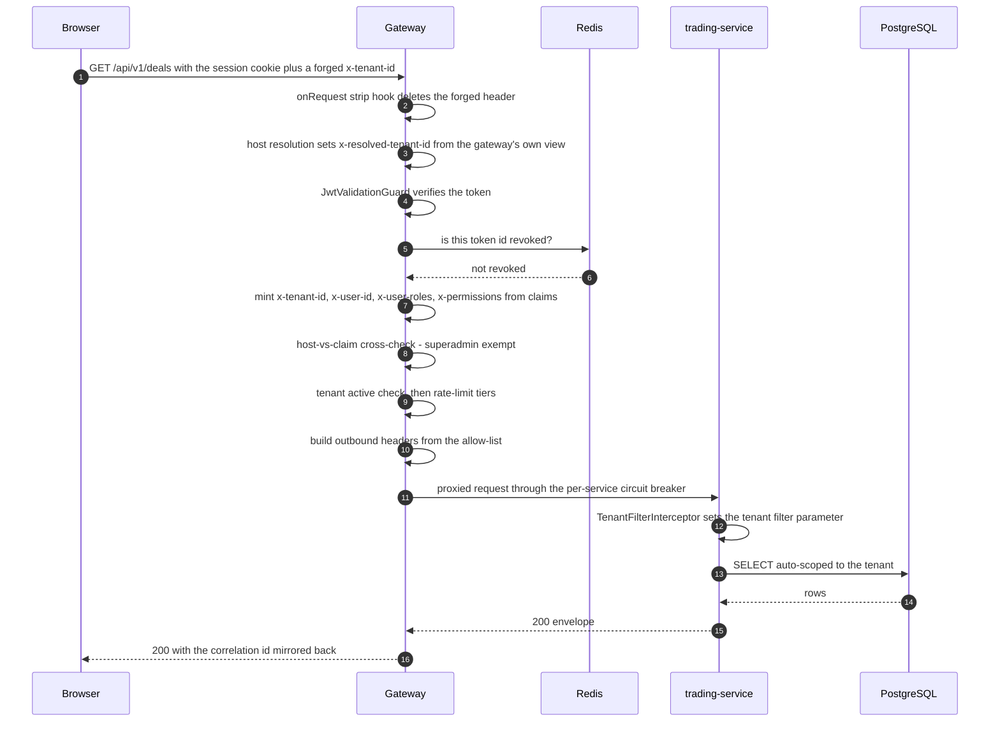
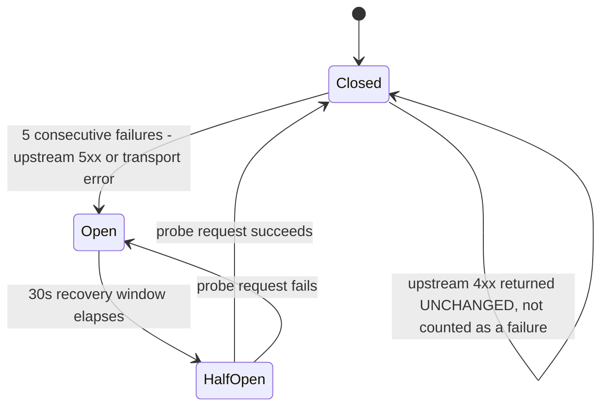

# Platform API Architecture

The HTTP surface of the Acme Platform is one gateway in front of a dozen bounded-context
services, and everything a client can observe about it — the response envelope, how a
list is paged, how a list is filtered, which error code comes back and with what status —
is defined by a small number of shared decisions. This document covers those: the
canonical `{ data, meta, errors[] }` envelope and the two legacy shapes still in flight,
cursor versus offset pagination, the bracket filter grammar and its parser hardening, the
`AppException` → HTTP mapping performed by the shared exception filter, the validation
pipeline and its silent-failure trap, and the gateway's request pipeline in exact
execution order. Sources: `docs/platform/architecture/api-reference.md`, ADR-0061,
`apps/platform/gateway/src/**`, `apps/platform/trading-service/src/common/**`, and
`libs/platform/{exceptions,api-contracts,service-bootstrap}`.

---

## 1. The response envelope — and the migration in progress

ADR-0061 (_Platform Trading API contract: canonical `{ data, meta, errors[] }` envelope +
cursor pagination + `filter[]`_) ratified one envelope for all **new** endpoints. Three
shapes are currently observable in the deployed system:

```
LEGACY (shipped identity services, "legacy-to-align")
  { "data": { ... } }                                     // singular resource
  { "data": [ ... ], "pagination": { page, pageSize,      // list
      total, totalPages, hasNext, hasPrev } }
  { "statusCode": 401, "message": "...", "error": "..." } // raw NestJS error

M1 TRADING LISTS (deployed, mid-migration)
  { "data": [ ... ],
    "meta": { "total": 412, "offset": 0, "limit": 20 } }  // NO errors key

CANONICAL (ADR-0061 — required for all new endpoints)
  { "data":   <T> | null,
    "meta":   { "pagination": { "cursor": "<opaque>|null",
                                "hasMore": true,
                                "total":  412 },
                "aggregates": { ... }        // optional, list-scoped financials
              } | null,
    "errors": [ { "code": "VALIDATION_ERROR",
                  "message": "...",
                  "field": "quantity",       // optional
                  "correlationId": "0000-..." } ] | null }
```

The canonical envelope is what `GET /api/v1/deals/:id/activity` returns today — verified
in `deal.controller.ts`, which emits `{ data, meta: { pagination: { cursor, hasMore,
total } }, errors: null }`. The same controller's `GET /api/v1/deals` still returns the
M1 shape (`meta: { total, offset, limit }`, no `errors` key). Both live in one file; that
is what a staged migration looks like in practice.



**Takeaways**

1. `errors` is an **array**, not a singular `error`. That was the decisive break from the
   M1-era record: a validation failure legitimately produces several field errors, and a
   singular object forces either truncation or a nested-array workaround.
2. Every error carries a machine `code` from a closed set —
   `VALIDATION_ERROR`, `UNAUTHORIZED`, `FORBIDDEN`, `NOT_FOUND`, `CONFLICT`,
   `RATE_LIMITED`, `INTERNAL_ERROR` — plus the `correlationId`, so a user-visible error
   can be joined to a trace without a support round-trip.
3. Removal of `offset` is **not** silent. `Deprecation: true` and `Sunset` headers ride
   the offset path for a full release cycle. A contract change that a client can only
   discover by breaking is treated as a defect here.
4. **Honest gap:** `libs/platform/api-contracts/src/index.ts` still exports the M1 types
   only — `ApiResponse<T> = { data, meta? }`, `PaginatedResponse<T> = { data, pagination }`,
   and a singular `ApiError`. The canonical types ADR-0061 references are not yet in the
   shared library, so canonical responses are currently hand-assembled in controllers.
   That is a real drift between the decision and the shared contract.

**Invariant encoded:** a client never has to guess where the payload is. `data` for the
payload, `meta` for everything about the payload, `errors` for everything wrong with it.

---

## 2. Pagination: cursor for feeds, offset for catalogues



The cursor itself is opaque to clients and stable under concurrent inserts. In
`mikro-orm-deal-activity.repository.ts` it is the `(occurredAt, id)` tuple of the last
returned row, `base64url`-encoded; `decodeCursor` returns `null` on any malformed input
rather than producing a mis-parsed boundary, so a tampered cursor degrades to "start from
the beginning" instead of silently skipping or duplicating rows. `hasMore` is computed by
over-fetching one row, and `total` is a separate count over the whole collection —
independent of the cursor window.

**Takeaways**

1. Cursor pagination is chosen for correctness, not speed. Offset paging over a feed that
   receives inserts between page 1 and page 2 will duplicate and drop rows; a keyset
   cursor cannot.
2. Limits are clamped server-side, always. Activity: default 25, max 100. The deal list:
   `Math.min(Math.max(1, rawLimit), 500)` with offset floored at 0. A client cannot
   request an unbounded page, and a negative offset cannot reach the query builder.
3. `meta.pagination.total` means "rows matching the filter", full stop. Financial
   aggregates (summed cost, revenue, gross profit for the filtered set) are a distinct
   concern and live under `meta.aggregates`. Conflating a row count with a money total is
   exactly the class of bug that reaches a finance stakeholder as a wrong number.
4. An unknown or cross-tenant deal id on the activity feed returns an **empty feed with
   200**, not 404 — deliberately, because a 404 would confirm the existence of another
   tenant's id.

---

## 3. Filter grammar

Bracket notation, parsed by `parseListFilters` in
`apps/platform/trading-service/src/common/parse-list-filters.ts`. Fastify is configured
without a `qs` parser, so bracket keys arrive **flat** on `request.query` and the parser
reads them as strings:

```
GET /api/v1/customers?filter[role]=BUYER
                       └─ bare form, normalised to { role: { eq: 'BUYER' } }

GET /api/v1/deals?filter[status][in]=OPEN,LOCKED
                  &filter[createdAt][gte]=2026-01-01
                  &filter[grossProfit][lt]=0
                  &sort=createdAt:desc
                  &limit=50

  operators : eq | in | gte | lte | gt | lt | like
  in        : comma-separated, trimmed, empty segments dropped
  sort      : field:dir, permitted on indexed fields only
  ignored   : every non-filter key (offset, limit, sort, cursor) and unknown operators
```



**Takeaways**

1. The parser is hardened against **prototype pollution**, and in two independent ways.
   `filter[__proto__][eq]=x` would otherwise resolve `filters['__proto__']` to
   `Object.prototype` and then mutate it, poisoning every plain object in the process.
   `__proto__`, `constructor` and `prototype` are rejected at parse time, _and_ the
   accumulator is created with `Object.create(null)` as defence in depth.
2. Key parsing uses string slicing, not a regex. That makes it provably linear — no
   catastrophic backtracking, and no ReDoS surface for a lint rule to flag.
3. Unknown fields and unknown operators are **dropped, not rejected**. That keeps the
   grammar additive: a newer client can send a filter an older service does not know
   about without receiving a 400.
4. `sort` is restricted to indexed fields by policy (ADR-0061). Free-form sort on an
   unindexed column is a sequential-scan denial-of-service waiting for a large tenant.
5. Nested child URLs (`/deals/{id}/purchases`) remain the long-term target; the flat
   `GET /purchases?filter[dealId]=` form is the ratified v1 realisation, chosen because
   the deployed controllers and gateway routing are flat and the change had to stay
   additive within `v1`.

_Note:_ the parser's own header comment cites ADR-0057, but ADR-0057 in the index is a
frontend nav-shell decision. The governing record for this grammar is **ADR-0061**.

---

## 4. Error taxonomy and HTTP mapping

`@acme/exceptions` is a zero-dependency library — importable from a domain layer without
dragging a framework in — built on one base class:

```
AppException extends Error
  ├── statusCode : number
  ├── errorCode  : string        // machine code, stable across releases
  ├── message    : string        // human-readable
  └── details?   : Record<string, unknown>
```

| Exception                  | Status | `errorCode`        | Typical trigger                                       |
| -------------------------- | ------ | ------------------ | ----------------------------------------------------- |
| `ValidationException`      | 400    | `VALIDATION_ERROR` | Malformed or semantically invalid input               |
| `UnauthorizedException`    | 401    | `UNAUTHORIZED`     | Missing/invalid/revoked token                         |
| `ForbiddenException`       | 403    | `FORBIDDEN`        | Authenticated but not permitted                       |
| `NotFoundException`        | 404    | `NOT_FOUND`        | Entity absent — also used for cross-tenant reads      |
| `ConflictException`        | 409    | `CONFLICT`         | State conflict                                        |
| `TooManyRequestsException` | 429    | `RATE_LIMITED`     | Rate-limit tier exceeded; carries `retryAfterSeconds` |
| `InternalException`        | 500    | `INTERNAL_ERROR`   | Explicit internal failure                             |

Bounded contexts subclass these with domain-precise codes. From trading-service:

| Domain error                 | Status | `errorCode`                 | Meaning                                                      |
| ---------------------------- | ------ | --------------------------- | ------------------------------------------------------------ |
| `DealLockedError`            | 409    | `DEAL_LOCKED`               | Parent deal is locked; details carry `lockedById`/`lockedAt` |
| `DealNotLockableError`       | 422    | `DEAL_NOT_LOCKABLE`         | Deal still OPEN — a _precondition_, distinct from 409        |
| `CustomerRoleError`          | 422    | `CUSTOMER_ROLE_MISMATCH`    | Customer lacks the required role, e.g. SUPPLIER              |
| `DealLockBatchTooLargeError` | 400    | `DEAL_LOCK_BATCH_TOO_LARGE` | Batch exceeds the per-request lock limit, default 50         |
| `StockInsufficientError`     | 4xx    | `STOCK_INSUFFICIENT`        | Inventory precondition failure                               |
| `IdempotencyKeyReuseError`   | 4xx    | `IDEMPOTENCY_KEY_REUSE`     | Key replayed with a different payload                        |

The 409-vs-422 split is the interesting one: _already locked_ is a conflict with current
state (409, retry after re-fetch is meaningless), while _not yet lockable_ is an
unsatisfied business precondition (422, the caller must do something else first). A
client can branch on that without string-matching a message.



**Takeaways**

1. `@Catch()` with no argument means the filter catches **everything**, including plain
   `Error`. That is why `AppException` — which extends `Error`, not `HttpException` —
   does not fall through NestJS's default handler and surface as an untyped 500.
2. The unknown-error branch is the security boundary: the full message and stack go to
   the server log, and the client gets a fixed `"Internal server error"` string. Stack
   traces and driver messages never cross the wire.
3. The MikroORM `OptimisticLockError` branch (ADR-0071, platform-wide) converts a
   versioned `UPDATE` that matched zero rows into `409 STALE_WRITE` rather than a raw 500. Without it, a lost update looks like a server bug to the client instead of a
   re-fetch-and-retry instruction.
4. The filter is registered once by `ServiceModule.forRoot()` for every domain service,
   and explicitly by the gateway's own `AppModule`. Same class, both paths — the two
   cannot drift.

---

## 5. Validation pipeline



The pipe is configured as
`new ValidationPipe({ whitelist: true, forbidNonWhitelisted: true, transform: true })` in
ten of the thirteen services. `whitelist` strips properties with no decorator;
`forbidNonWhitelisted` upgrades that from silent stripping to a 400; `transform` produces
a real DTO instance so `@Type`-driven coercion works.

**The trap worth knowing:** `ValidationPipe` needs the DTO's **runtime class** to look up
`class-validator` metadata. Writing `import type { CreateDealDto } from './dto'` erases
the value binding at compile time, the parameter metatype becomes `Object`, and the pipe
silently skips validation for that handler — no error, no warning, and every test that
constructs the DTO by hand still passes. Two services in this codebase were found and
fixed for exactly this.

**Coverage gaps** (verified across all `main.ts` files): auth-service registers
`new ValidationPipe({ transform: true })` only, so unknown properties are neither
stripped nor rejected there; **user-service and the gateway register no global pipe at
all**. For the gateway this is defensible — it is a reverse proxy that forwards raw body
bytes and does not bind DTOs — but for user-service it is a genuine gap.

---

## 6. Gateway request pipeline

The gateway is a NestJS app on Fastify that terminates cross-cutting concerns and reverse-proxies
`/api/v1/*` to the owning bounded-context service. Execution order is
load-bearing and is fixed by the NestJS lifecycle: **Fastify `onRequest` hooks →
middleware → guards → interceptors → controller**.

```mermaid
flowchart TB
    In["Inbound request from Traefik ingress"]

    subgraph FH["1. Fastify onRequest hooks - registered on the raw instance"]
      H1["Security headers"]
      H2["CORS - soft reject: omit the allow-origin header, never 500"]
      H3["stripGatewayHeaders: delete client-supplied x-tenant-id, x-user-id, x-user-roles, x-permissions, x-ip-address, x-correlation-id, x-platform-scope"]
    end

    subgraph MW["2. NestJS middleware"]
      M1["TenantHostResolutionMiddleware - classify Host, emit resolution metric, set the resolved-tenant header"]
      M2["StripPlatformScopeMiddleware - drop the platform-scope hint on non-platform routes"]
    end

    subgraph GD["3. Global guards - registration order is execution order"]
      G1["JwtValidationGuard - verify the session cookie or bearer, check JTI revocation, MINT the identity headers"]
      G2["TenantHostCrossCheckGuard - reject when the host-resolved tenant differs from the verified token claim"]
      G3["TenantResolutionGuard - assert the tenant is active"]
      G4["RateLimitGuard - three-tier sliding window"]
    end

    subgraph IC["4. Global interceptors"]
      I1["CorrelationIdInterceptor - mirror the correlation id onto the response"]
      I2["TenantAsyncLocalStorageInterceptor - run the handler inside the tenant ALS scope"]
    end

    subgraph PX["5. Proxy controller"]
      P1["Resolve upstream from the service registry - first prefix match wins"]
      P2["Re-assert the per-path body limit"]
      P3["Build outbound headers from an ALLOW-LIST"]
      P4["Dispatch through the per-service circuit breaker"]
    end

    In --> FH --> MW --> GD --> IC --> PX --> Up["Upstream bounded-context service"]
```



**Takeaways**

1. **Strip before mint.** The strip hook is registered on the raw Fastify instance
   _before_ `NestFactory.create()` runs, because Fastify executes `onRequest` hooks in
   registration order and Nest installs its own `onRequest` hook (the one that runs the
   whole middleware chain) during creation. Registering strip afterwards put it _after_
   the middleware and deleted the resolved-tenant header the gateway itself had just set —
   which broke the SSO handoff exchange with an invalid-code error while every earlier hop
   succeeded. The order `[strip → middleware-set → guard-mint]` is a correctness
   requirement, not a style preference.
2. **The tenant guard must run after the JWT guard.** NestJS middleware executes _before_
   guards and therefore cannot see a JWT-derived identity. That is why tenant resolution
   was moved out of middleware into a guard: it must read the `x-tenant-id` the JWT guard
   minted, never a client-supplied one.
3. **The ALS interceptor must run after both guards.** A guard cannot wrap downstream
   execution in `AsyncLocalStorage.run(...)`; only an interceptor can. So the tenant scope
   that the ORM's tenant filter subscriber reads is established at the interceptor stage.
4. CORS **soft-rejects** (ADR-0058): an unlisted origin gets a response with no
   allow-origin header rather than a 500. The browser enforces the block; the server never
   converts a cross-origin probe into an error page. The same-origin SPA is always served.

### Header policy

```
INGRESS  — stripped from every inbound request, unconditionally
  x-tenant-id  x-user-id  x-user-roles  x-permissions
  x-ip-address  x-correlation-id  x-platform-scope  x-super-admin

MINTED   — written by JwtValidationGuard from verified claims
  x-tenant-id      <- claim tid          x-user-id     <- claim sub
  x-user-roles     <- claim roles        x-permissions <- claim permissions
  x-mfa-enabled    <- verified MFA-enrolment claim (ADR-0054)
  x-platform-scope <- verified superadmin platform-scope claim (ADR-0029)

EGRESS   — allow-list only; nothing is forwarded implicitly
  always            : content-type, accept, accept-language, x-correlation-id,
                      x-resolved-tenant-id
  authed routes only: x-tenant-id, x-user-id, x-user-roles, x-permissions,
                      x-ip-address, x-mfa-enabled
  platform routes   : x-platform-scope        <- gated on route.platformScope
  never             : x-super-admin, authorization (unless route opts in),
                      cookie (unless route opts in), and RFC 7230 hop-by-hop:
                      connection, keep-alive, transfer-encoding, upgrade, te,
                      trailer, proxy-authorization, proxy-authenticate,
                      host, content-length
```



**Invariant encoded:** identity is never client input. Anything a downstream service
trusts about _who_ is calling was minted by the gateway from a cryptographically verified
claim, after the client's copy was destroyed.

### Rate limiting, body limits, breaker

| Tier         | Limit               | Key                     |
| ------------ | ------------------- | ----------------------- |
| Per-user     | 1,000 requests/min  | `x-user-id`             |
| Per-tenant   | 10,000 requests/min | `x-tenant-id`           |
| Per-endpoint | 100 requests/min    | method + path + user id |

The limiter is a sliding window over a timestamp list per key, lazily pruned on each hit,
with an `unref()`'d periodic sweep every two windows to bound memory. It is **in-process**,
so limits are per gateway replica — an important caveat when reasoning about the effective
ceiling at scale. Related and worth stating explicitly: any Redis-backed counter in this
platform must include the tenant id in its key; a password-reset limiter that omitted it
let one tenant exhaust another's budget.

Body limits are declared **once** in `proxy.config.ts` and enforced twice, because a
single catch-all proxy route defeats Fastify's path-keyed `onRoute` limit:

| Path prefix                | Limit |
| -------------------------- | ----- |
| default                    | 1 MB  |
| `/api/v1/import`           | 5 MB  |
| `/api/v1/documents/upload` | 10 MB |

The Fastify ceiling is set to the maximum (10 MB) so the catch-all can accept the largest
legal request, and `ProxyService.assertWithinBodyLimit` re-asserts the real per-path
sub-limit before any upstream call — checking the declared `content-length` first, then
the actually-buffered `Buffer.length`, because a chunked or understated `content-length`
would slip past the fast path.



That last self-transition is the important one. A 404 or a 422 from an upstream is a
normal client outcome; counting it as a circuit failure would let one client's bad input
trip the breaker for every other client. Only transport errors and upstream 5xx count.
Failures map to typed exceptions: transport → `502 BadGatewayError`, header/body timeout
(30 s) → `504 GatewayTimeoutError`, tripped breaker → `503 ServiceUnavailableError`,
oversized body → `413 PayloadTooLargeError`.

---

## 7. Routing table

First matching prefix wins, so more specific prefixes are declared first.

| Path prefix                | Upstream           | Auth | Notes                                          |
| -------------------------- | ------------------ | ---- | ---------------------------------------------- |
| `/api/v1/public/tenants`   | tenant-service     | No   | Pre-auth branding / SSO discovery              |
| `/api/v1/public/auth`      | auth-service       | No   | Enumeration-safe workspace discovery           |
| `/api/v1/auth/oidc`        | auth-service       | No   | `forwardCookies` — needs the OIDC state cookie |
| `/api/v1/auth`             | auth-service       | No   | Login, refresh, reset                          |
| `/api/v1/platform/tenants` | tenant-service     | Yes  | `platformScope` — superadmin cross-tenant      |
| `/api/v1/platform/users`   | user-service       | Yes  | `platformScope`                                |
| `/api/v1/tenants`          | tenant-service     | Yes  |                                                |
| `/api/v1/users`            | user-service       | Yes  |                                                |
| `/api/v1/invitations`      | user-service       | Yes  | `accept` is public by design                   |
| `/api/v1/deals`            | trading-service    | Yes  |                                                |
| `/api/v1/purchases`        | trading-service    | Yes  |                                                |
| `/api/v1/sales`            | trading-service    | Yes  |                                                |
| `/api/v1/invoices`         | accounting-service | Yes  |                                                |
| `/api/v1/commissions`      | domain-api service | Yes  |                                                |
| `/api/v1/stock`            | inventory-service  | Yes  |                                                |

The `platformScope` flag is worth dwelling on. It is declared **on the route entry**, and
the egress header copy is gated on that already-resolved flag rather than on a fresh path
inspection. The reason is stated in the source: a separately-normalised path check could
disagree with routing — a double-encoded traversal that routes to a business service but
re-parses to a platform path would leak the cross-tenant scope header. Deriving both
decisions from one matcher makes the disagreement unrepresentable.

---

## Cross-references

- **ADR-0029** — _Superadmin platform-scope auth_: the `x-platform-scope` claim and its
  route-scoped egress gate.
- **ADR-0053** — _Platform identity JWT RS256 + JWKS_: token format the gateway verifies.
- **ADR-0054** — _Current-user read model_: source of the `x-mfa-enabled` header.
- **ADR-0058** — _Gateway CORS soft-reject, same-origin_: why an unlisted origin is not an
  error.
- **ADR-0061** — _Trading API contract: canonical envelope + cursor pagination + filter
  grammar_: the governing record for §1–3.
- **ADR-0062** — _Deal activity read model_: the first canonical-envelope, cursor-paginated
  endpoint in production.
- **ADR-0066** — _Hostname-based tenant resolution_: the host classifier and the host-vs-claim
  cross-check guard.
- **ADR-0071** — _Optimistic locking, version in DTO_: the `409 STALE_WRITE` branch of the
  exception filter.
- Service bootstrap, module layering and the shared-library graph:
  [`01-service-anatomy.md`](01-service-anatomy.md).
