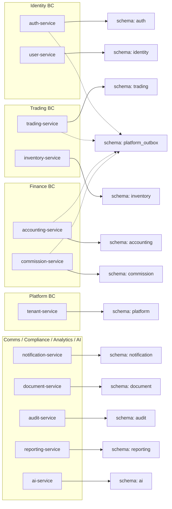
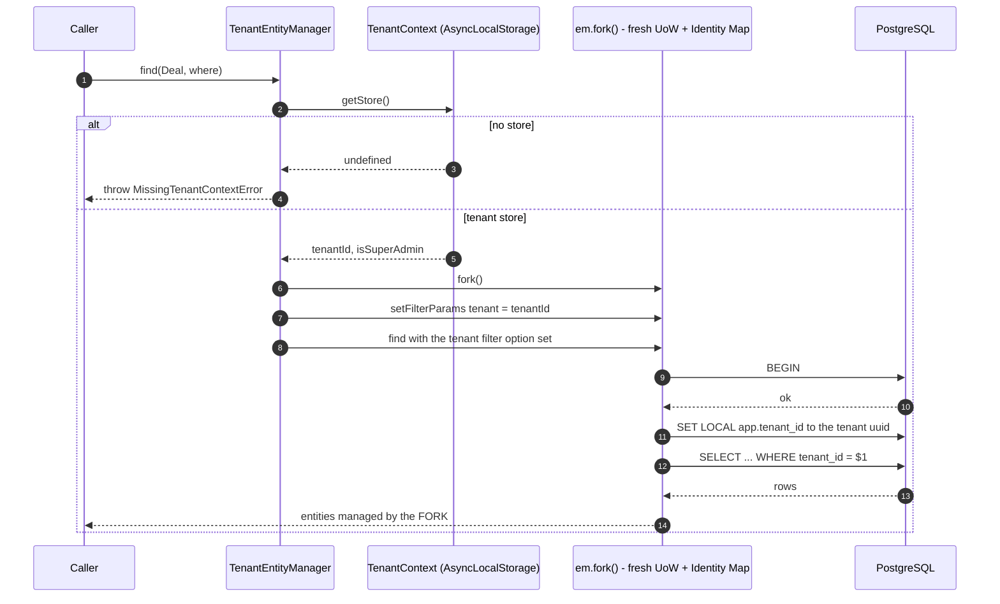
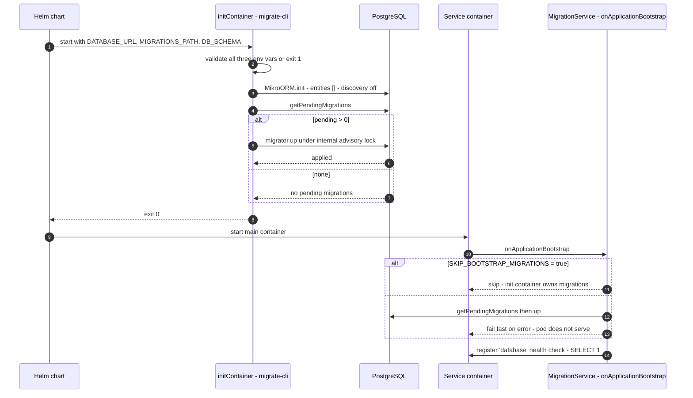
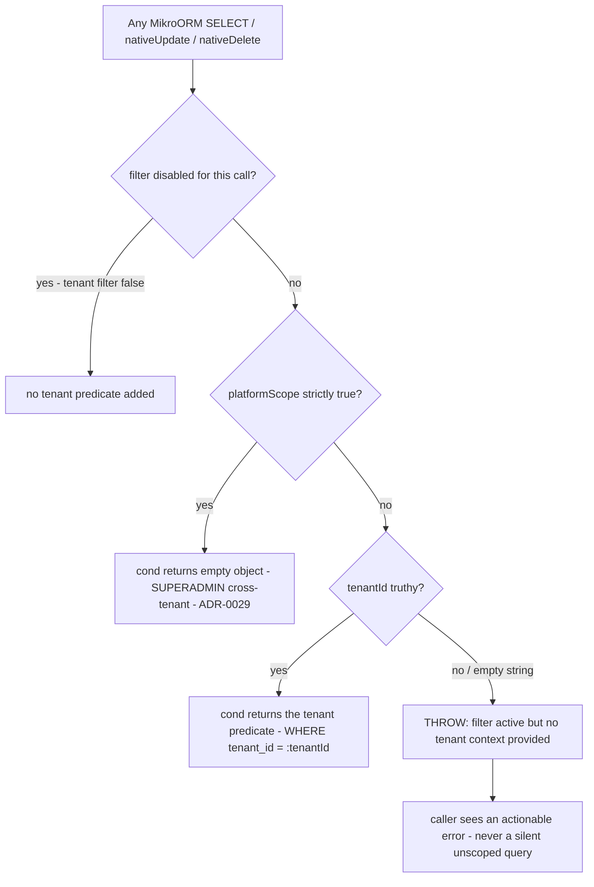
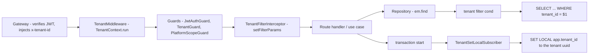
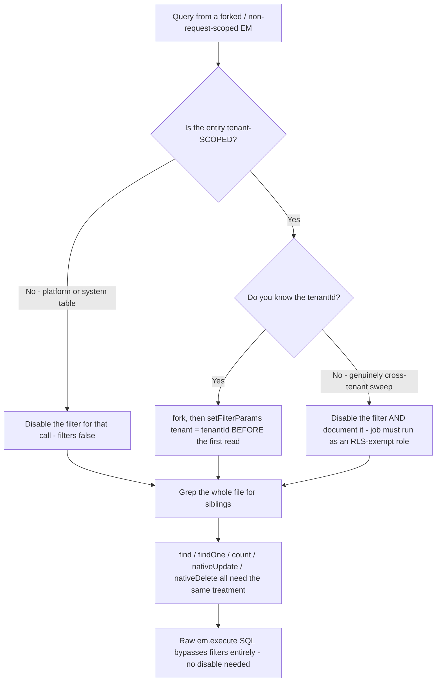
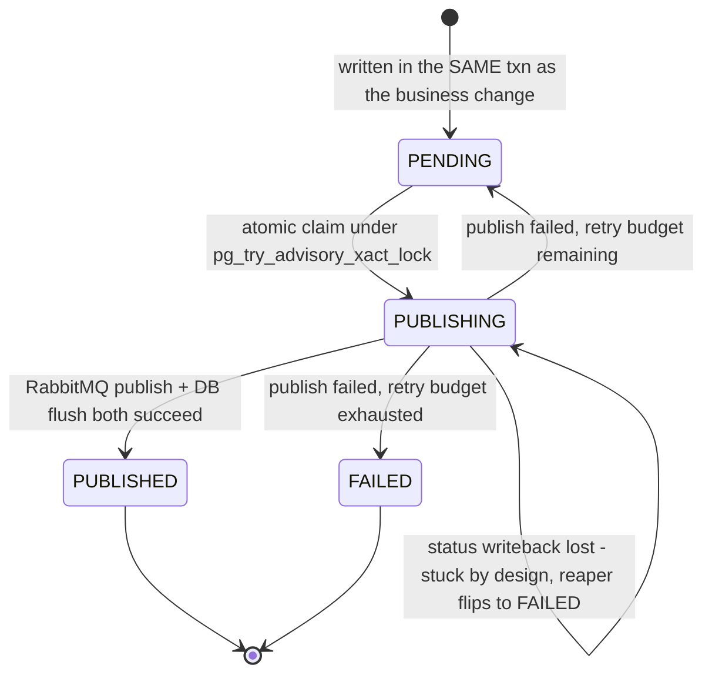

# Backend Data Architecture — Schema Isolation, MikroORM, Multi-Tenancy

What this covers: how the Acme Platform services store data. One PostgreSQL instance, one schema
per bounded context (ADR-0013), one MikroORM `EntityManager` per service configured by a shared
factory (`@acme/mikro-orm`), migrations owned and run per service, and a **fail-closed** global
tenant filter that is the last line of defence for multi-tenant isolation. The most expensive
lesson in this section is at the end: the fail-closed filter is _global_ and _default-on_, which
means every query issued from a **forked or non-request-scoped EntityManager** — event consumers,
seeders, cron jobs, outbox pollers — must explicitly establish tenant context or explicitly
disable the filter. Getting that wrong does not leak data; it silently kills the feature.

---

## 1. One database, one schema per bounded context

ADR-0013 (_Per-BC PostgreSQL Schema Isolation_) makes each bounded context own a PostgreSQL
schema inside a single database. The goal is that extracting a service later is a _configuration_
change (point `DATABASE_URL` somewhere else) rather than a schema refactor.



Takeaways:

1. **Schema is set once, in the service's config factory.** Each service exports
   `<svc>MikroOrmOptions(entities, clientUrl)` returning `{ schema: 'trading', … }`, which the
   shared `createMikroOrmConfig()` turns into MikroORM `Options`. There is no per-query schema
   selection anywhere.
2. **No cross-schema foreign keys.** Cross-BC references are UUID columns, never `@ManyToOne`.
   Cross-BC _reads_ go through the owning service's internal API or through an event — never
   through SQL against another schema.
3. **`platform_outbox` is the one deliberately shared schema.** The transactional outbox
   (ADR-0018) must commit in the same transaction as the business write, so it currently lives in
   a shared schema that every publishing service can write to. ADR-0022 records this as the
   _pre-extraction prerequisite_: before any service moves to its own PostgreSQL instance, its
   outbox table must move into its own schema first, or the atomicity guarantee breaks across
   databases.
4. **The Terraform service catalogue has known naming drift.** The infra catalogue and the
   `platform-pg-bootstrap` chart historically declared `schema: tenant` / `schema: user` where the
   migrations and the running pods use `platform` / `identity`. ADR-0037 Amendment 14
   (_D1-3 schema/role reconciliation_) settled this: **runtime and migrations are the source of
   truth**; the bootstrap chart is the lagging config, and the fix is gated behind the
   connection-cutover slice. The PostgreSQL _roles_ (`auth_user`, `tenant_user`, `user_user`) were
   never wrong, so nothing running is affected.

Physical layout:

```
platform_dev  (PostgreSQL 16, Flexible Server)
├── auth              — credential, refresh_token, session, mfa_config, oidc_provider, oidc_mapping
├── platform          — tenant, tenant_config, platform_setting
├── identity          — user, role, permission, membership
├── trading           — deal, deal_line, processed_event, idempotency_key, parked_message
├── inventory         — stock, reservation, movement, processed_event
├── accounting        — invoice, erp_token, erp_posting_job
├── commission        — commission_period, commission_record, adjustment
├── notification      — in_app_notification, email_outbox_projection
├── document          — document, document_version
├── audit             — audit_entry
├── reporting         — read-model projections
├── ai                — signal, agent_run
└── platform_outbox   — outbox_entry   (SHARED — every publisher writes here)
```

**Invariant encoded:** a service may open exactly one schema. A raw `em.execute()` mentioning
another BC's schema name is a boundary violation, and ADR-0022 Phase 0 adds a pre-commit hook that
greps for exactly that.

---

## 2. The tenant-scoped entity contract

Every tenant-owned entity extends `TenantBaseEntity` from `@acme/mikro-orm`. Platform-level tables
(`Tenant`, `TenantConfig`, `Role`, `Permission`, `PlatformSetting`, `SuperadminAuditLog`) do not —
they are listed in `TENANT_EXEMPT_ENTITY_NAMES` and may carry the `@TenantExempt()` decorator.

```mermaid
erDiagram
    TENANT_SCOPED_TABLE {
        uuid id PK "v4, generated in app"
        uuid tenant_id "NOT NULL, indexed, fieldName tenant_id"
        timestamptz created_at "onCreate"
        timestamptz updated_at "onCreate and onUpdate"
    }
    OUTBOX_ENTRY {
        uuid id PK "uuid v7 - time-ordered"
        varchar entry_type "DOMAIN_EVENT or JOB"
        varchar event_type "dotted event name or queue name"
        jsonb payload "full DomainEvent envelope"
        varchar status "PENDING PUBLISHING PUBLISHED FAILED"
        timestamptz created_at "idx_outbox_pending on status+created_at"
    }
    PROCESSED_EVENT {
        text consumer PK "inbox dedup ledger"
        text event_id PK "opaque string - NOT uuid typed"
        timestamptz processed_at
    }
    IDEMPOTENCY_KEY {
        uuid tenant_id "UNIQUE with endpoint+key"
        text endpoint
        text key
        text payload_hash "409 on reuse with different hash"
        jsonb stored_response
        timestamptz expires_at
    }
    PARKED_MESSAGE {
        uuid id PK
        text reason "domain-level quarantine"
        jsonb payload
        timestamptz parked_at
    }
```



Notes that matter:

- `tenant_id` is **`NOT NULL` and indexed on every tenant-scoped table**. ADR-0029 fixes the
  SUPERADMIN model: cross-tenant access is granted by a `platformScope` flag, _never_ by writing a
  `NULL` tenant. There is no such thing as a legitimately unscoped business row.
- `TenantBaseEntity` deliberately carries **no** `@Filter('tenant')` decorator. MikroORM dedupes
  filters by name in config → EM → entity order, so a config-level filter always wins and an
  entity-level one would be permanently dead code implying protection it does not provide.
  The config-level registration is the single source of truth.
- `ProcessedEvent` (the inbox, ADR-0072) is intentionally **not** a `TenantBaseEntity`: its
  identity is `(consumer, event_id)` and it holds no tenant-owned data. `event_id` is `text`, not
  `uuid` — event ids are opaque strings and a `uuid` column would reject non-UUID ids and break
  dedup silently.
- Value objects reach the database through MikroORM custom types: `DecimalType`
  (`Big` ⇄ `numeric`, and it **throws on a raw JS `number`** to prevent float precision loss),
  `EmailType` and `TenantSlugType` (lowercase-normalising on write), `HashedPasswordType`
  (pass-through, redacted in `toString()`).

---

## 3. Unit of Work, Identity Map, and the fork-per-operation choice

MikroORM is a Data Mapper ORM: `EntityManager` owns an Identity Map and a Unit of Work; nothing
hits the database until `flush()`. The platform wraps that in `TenantEntityManager`, whose
defining implementation detail is that **every read and write forks a fresh EntityManager**.



Takeaways:

1. **Isolation is per operation, not per request.** Each `find` / `findOne` / `count` /
   `findAndCount` / `persist` / `remove` / `createQueryBuilder` call gets its own fork, its own
   Identity Map, and its own filter params. Two `find` calls in the same request return entities
   from _different_ identity maps — object identity is not shared and change tracking on a
   returned entity does not accumulate into a later `flush()`.
2. **`persist()` and `remove()` flush their own fork immediately**; `flush()` on the wrapper flushes
   the _underlying_ EntityManager, not any fork. Treat `TenantEntityManager` as a
   scoped-repository facade, not as a long-lived Unit of Work.
3. **Writes are validated before they are stamped.** `persist()` refuses three cases outright:
   a SUPERADMIN write with no explicit non-empty `tenantId` (`InvalidTenantWriteError`), a tenant
   context whose own `tenantId` is empty/whitespace (`InvalidTenantWriteError`), and an entity that
   already carries a _different_ non-empty `tenantId` (`CrossTenantWriteError`, symmetric with
   `remove()`). Only after those checks does it stamp the id.
4. **The multi-statement outbox convention is the opposite: never fork.** Repositories that must
   participate in the caller's transaction — the inbox `recordOnce`, the outbox publisher — take
   the _caller's_ EntityManager in the constructor and never fork, so the dedup row and the state
   change commit or roll back together.
5. `createQueryBuilder` is `async` on purpose: it awaits `qb.applyFilters(...)` internally so a
   caller cannot forget the activation step and ship a silently unfiltered query. MikroORM v6
   quirk worth remembering: `addFilter(name, false)` does **not** disable a filter — it registers a
   new filter whose `cond` is `false` and crashes at runtime. The correct v6 disable is
   `{ [name]: false }` passed to `applyFilters` / the `filters` option.

**Connection pool caveat (verified divergence):** the shared factory still ships `pool: { min: 2,
max: 10 }`, while ADR-0022 Phase 0 item 4 specifies `min: 2, max: 5` per pod to survive HPA
scale-out on a shared instance. The ADR decision has not been reflected in the factory.

---

## 4. Migrations: owned per service, run twice-guarded

Each service owns its migration folder; nothing is shared. Migrations are hand-written SQL inside
`Migration` classes (`this.addSql(...)`), beginning with `CREATE SCHEMA IF NOT EXISTS "<bc>"`.

```
apps/platform/<service>/src/migrations/
├── Migration_001_initial.ts          CREATE SCHEMA + base tables + tenant_id indexes
├── Migration_002_*.ts                additive change
├── Migration_00N_*.ts
└── __tests__/                        migration specs (SQL assertions)

MikroORM settings applied by createMikroOrmConfig():
  migrations.path            = MIGRATIONS_PATH env, default /tmp/migrations
  migrations.tableName       = mikro_orm_migrations   (per schema)
  migrations.transactional   = true
  migrations.safe            = true       (never auto-drops)
  strict                     = true       (throws on undefined filter params, unknown props)
```

Two runners exist, and exactly one should be active per deployment:



Takeaways:

1. **`migrate-cli` is a standalone Node entrypoint for a Kubernetes init container.** It requires
   `DATABASE_URL`, `MIGRATIONS_PATH` and `DB_SCHEMA` and exits `1` if any is missing — a
   misconfigured chart fails the pod instead of migrating the wrong schema.
2. **Concurrency is handled by MikroORM's internal advisory lock**, so a rolling update with N
   replicas does not run migrations N times.
3. **`SKIP_BOOTSTRAP_MIGRATIONS=true` disambiguates the dual path.** Running both is harmless
   (idempotent) but produces confusing "0 pending" logs and extra connections.
4. **Failure is fatal by design** — `MigrationService` rethrows so the service never starts against
   a schema it does not expect.
5. **`sslmode=require` is not honoured by the `pg` driver from the URL** — both the runtime factory
   and `migrate-cli` detect the substring and pass `driverOptions.connection.ssl` explicitly.

---

## 5. The fail-closed global tenant filter

`createMikroOrmConfig()` registers exactly one filter, named `tenant`, with `default: true`. Its
`cond` is the enforcement point.



Takeaways:

1. **Three outcomes, and the third is an exception, not an empty predicate.** Returning `{}` on a
   missing context would drop the `WHERE` clause and leak across tenants; throwing turns a data
   breach into a loud, greppable bug. This replaced an earlier cryptic
   `TypeError: reading 'platformScope'` crash.
2. **An empty-string `tenantId` falls through to the throw.** `WHERE tenant_id = ''` is never a
   valid scope.
3. **`platformScope: true` is not self-authorising.** The filter cannot verify the caller is a
   SUPERADMIN; it must always be paired with a prior `PlatformScopeGuard` check that uses the same
   strict `=== true` comparison (truthy-but-not-`true` must not bypass). The filter is the last
   line of defence, not the only one.
4. **Who seeds the params in a normal request:** `TenantFilterInterceptor` (the lightweight,
   always-on default) reads the `TenantContext` ALS store and calls
   `em.setFilterParams('tenant', { tenantId })` on the request-scoped EntityManager. It runs as an
   _interceptor_ — after guards, after MikroORM's `RequestContext` middleware has created the
   per-request fork. `TenantGuard` does the same thing plus tenant resolution/validation, and
   `TenantEntityManager` does it per fork.
5. **For SUPERADMIN and for unauthenticated routes the interceptor sets nothing.** A SUPERADMIN
   cross-tenant query must disable the filter explicitly; a public route that later issues a
   tenant-scoped query fails closed. Both are the intended behaviour.

Request-path assembly:



---

## 6. Row-level security as defence in depth — and where it actually stands

`TenantSetLocalSubscriber` is registered by `createMikroOrmConfig()` as a default EventSubscriber
(merged with any service-supplied subscribers so a service cannot silently drop it). On
`afterTransactionStart` it emits `SET LOCAL app.tenant_id = ?` so PostgreSQL RLS policies can
evaluate against a transaction-bound GUC.

Facts worth carrying:

- **`afterTransactionStart`, never before.** `SET LOCAL` is rejected outside a transaction, so the
  `BEGIN` must already be on the wire.
- **The value is interpolated, not bound.** PostgreSQL's `SET` command does not accept bind
  parameters in the extended-query protocol; MikroORM's `em.execute(sql, params)` substitutes `?`
  client-side with proper escaping. `set_config('app.tenant_id', $1, true)` is the true
  parameterised equivalent if wire-level binding is ever required.
- **`SET LOCAL` is mandatory; plain `SET` is a leak.** ADR-0037 Amendment 1 (_B1 outcome — KEEP
  RLS_) proved empirically under PgBouncer transaction pooling that session-level GUCs survive
  `server_reset_query` and the next request on that backend reads with the previous tenant's
  identity. Only `SET LOCAL` or `set_config(_, _, true)` is permitted — a hard contract, enforced
  by a CI lint on `CREATE POLICY` / `ALTER POLICY` statements.
- **PG 16 quirk:** after `SET LOCAL … ; COMMIT`, `current_setting('app.x', true)` returns `''`, not
  `NULL`. No test or assertion may use `IS NULL` as the "no context" sentinel.
- **SUPERADMIN is skipped entirely.** Setting the GUC to `''` would block every row rather than
  bypass, because the policy fixture has no empty-string branch. Database-side SUPERADMIN bypass
  needs a role grant (`BYPASSRLS` or an RLS-excluded role) that is still an open design item.
- **Honest gap:** the only `CREATE POLICY` / `ENABLE ROW LEVEL SECURITY` statements found in this
  repository are in the POC fixture (`test/poc/b1-rls-pgbouncer-matrix/rls-fixture.sql`). **No
  production service migration enables RLS today.** The subscriber emits the GUC unconditionally,
  so the application half of the contract is live and correct, but the database half is still POC
  state. Application-level enforcement (the fail-closed filter) is currently the _only_ active
  isolation mechanism, not one of two. Cross-tenant maintenance jobs already carry comments
  flagging the role grants they will need when RLS is switched on.

---

## 7. The forked-EntityManager hazard (read this before writing a consumer)

This is the highest-yield operational lesson in the data layer. The filter is `default: true` with
no entity restriction, so in MikroORM v6 it fires for **every** entity — including tenant-exempt
ones that have no `tenant_id` column at all. Only three places seed filter params, and all three
are HTTP-request-scoped: `TenantGuard`, `TenantFilterInterceptor`, `TenantEntityManager`.

Anything else — an AMQP consumer, an `onApplicationBootstrap` seeder, a `@nestjs/schedule` cron, a
background poller, a CLI — runs with no filter params. Wrapping the work in
`TenantContext.run(...)` is **not sufficient**: ALS carries the tenant id, not MikroORM's filter
params.



Confirmed instances of this class of bug, all found in review or production, none caught by the
test suite:

| Site                                                 | Entity                         | Symptom                                                                                 | Resolution                                                                                                            |
| ---------------------------------------------------- | ------------------------------ | --------------------------------------------------------------------------------------- | --------------------------------------------------------------------------------------------------------------------- |
| Trading + inventory inbox `recordOnce` (#1625/#1626) | `processed_event` (exempt)     | first `findOne` throws → transaction rejects → `nack` → DLQ; feature 100% dead          | `{ filters: false }` on the read                                                                                      |
| Shared `OutboxRelay` (#1707/#1715)                   | `OutboxEntry` (platform table) | claim `find` throws, caught-and-logged → **nothing ever published**, invisibly          | `{ filters: { tenant: false } }` on the `find` _and_ the status-writeback `nativeUpdate`                              |
| Sibling `OutboxReaper`                               | `OutboxEntry`                  | identical defect at its own two sites, silently defeated on every relay-enabled service | same, both sites                                                                                                      |
| `trading-service` seed on bootstrap                  | `Country` (tenant-**scoped**)  | pod crash-loop at boot: first the global-EM ban, then the filter throw                  | `em.fork()` **and** `setFilterParams('tenant', { tenantId })` — _not_ `filters: false`, which would drop real scoping |

Rules that fall out of this, in priority order:

1. **Tenant-exempt / platform entity → disable the filter. Tenant-scoped entity → seed the
   params.** Never use `filters: false` on a tenant-scoped read; it removes real protection.
2. **MikroORM v6 applies filters to `nativeUpdate` and `nativeDelete`, not just `find`.** Fixing
   only the read produces the worst possible outcome: entries publish but never mark `PUBLISHED`,
   so they redeliver forever.
3. **This bug class travels in pairs and in siblings.** When you fix one query, grep the whole
   file and directory for every ORM `find` / `findOne` / `count` / `nativeUpdate` / `nativeDelete`
   on the same entity, and check the sibling component (relay ↔ reaper).
4. **Raw `em.execute()` SQL is filter-exempt** — advisory locks and backlog counts need no disable.
5. **Persists and inserts are safe** — filters apply to reads and native writes, not to `persist`.
6. **The test harness hides all of it.** The testcontainers `setup.ts` registers a _neutered_
   tenant filter (`cond: () => ({}), default: false`). A green integration run does **not** prove
   the tenant-filter path. The only real guard is a testcontainer that boots the genuine
   `createMikroOrmConfig()` filter with no tenant context and drives the consumer end to end.

---

## 8. Outbox and inbox — the two tables that make delivery safe



- The relay query filters on `status = PENDING`, so an entry stuck in `PUBLISHING` is **not**
  republished — that is the deliberate defence against duplicate delivery when a post-publish
  status update is lost mid-cycle. `OutboxReaper` is the recovery net that flips long-stuck
  `PUBLISHING` rows to `FAILED`.
- Single-writer election is a **PostgreSQL transaction-scoped advisory lock**. ADR-0022 keeps a
  lock-ID registry (auth `900001`, tenant `900002`, user `900003`, trading `900005`, inventory
  `900006`) and requires the constructor default be removed so a missing configuration is a startup
  failure rather than a silent collision between two services sharing an id.
- `id` is **UUID v7** — time-ordered, so the `idx_outbox_pending (status, created_at)` scan and the
  primary key agree on locality.
- ADR-0072 (_inbox, idempotency-key and parked-message PG tables_) closes the other half: the
  inbox row is inserted in the same transaction as the state change, so a redelivery hits the
  composite PK and the handler acks without re-applying — **at-least-once delivery becomes
  effectively-once processing**. A lost race on the unique constraint is caught as
  `UniqueConstraintViolationException` and reported as "already processed" rather than nacking the
  message into the DLQ. `idempotency_key` does the same for HTTP financial mutations (409
  `IDEMPOTENCY_KEY_REUSE` when a key is replayed with a different payload hash);
  `parked_message` is the domain-level quarantine for events that are validly delivered but cannot
  be applied. All three live in the _service's own schema_ — never a shared infrastructure store —
  precisely so they stay transactional with that service's state.

---

## 9. Deciding ADRs

| ADR          | Title                                            | What it fixes here                                                               |
| ------------ | ------------------------------------------------ | -------------------------------------------------------------------------------- |
| ADR-0013     | Per-BC PostgreSQL Schema Isolation               | one schema per BC, no cross-schema FKs, per-BC migrations                        |
| ADR-0014     | Microservices — separate binaries day one        | why extraction must stay a config change                                         |
| ADR-0018     | Transactional outbox for domain events           | business write + outbox write in one transaction                                 |
| ADR-0022     | Database instance hardening strategy             | per-service PG roles, advisory-lock registry, pool tuning, phased split triggers |
| ADR-0029     | SUPERADMIN platform-scope auth                   | `platformScope` instead of a null tenant; strict `=== true`                      |
| ADR-0037     | POC-gated CNPG per-BC data tier                  | the path that would supersede ADR-0022                                           |
| ADR-0037 A1  | B1 outcome — KEEP RLS                            | `SET LOCAL` only; PG16 empty-string GUC quirk; pinning caveat                    |
| ADR-0037 A14 | D1-3 schema/role reconciliation                  | runtime/migrations are the source of truth for schema names                      |
| ADR-0038 A   | pg-bootstrap via Kubernetes Job                  | schema + role provisioning mechanism                                             |
| ADR-0072     | Inbox, idempotency-key, parked-message PG tables | effectively-once processing, retry-safe mutations                                |
