# Authentication & Authorization

This covers the full identity architecture of the Platform stack: how a session is minted
(password + TOTP MFA, OIDC/SSO), how it is refreshed and revoked, how the gateway turns a
signed RS256 JWT into an unsigned header contract that bounded-context services trust, and
how a tenant is resolved before and after authentication. Every diagram below is derived
from `apps/platform/auth-service/src/**`, `apps/platform/gateway/src/**`,
`libs/platform/auth-client/**` and `libs/platform/platform-contracts/**`; where the code and
the prose documentation disagree, the code is treated as authoritative and the discrepancy
is called out. Deciding records: **ADR-0029 SUPERADMIN Platform Scope Authentication**,
**ADR-0053 Platform Identity JWT — RS256 Signing + JWKS Verification**, **ADR-0054 Platform
Current-User Read Model**, **ADR-0066 Hostname-Based Tenant Resolution**, **ADR-0067 SSO
Session Handoff via One-Time Redis Code**, **ADR-0069 Pre-Auth Tenant Slug Resolution**.

---

## 1. Identity containers and trust zones

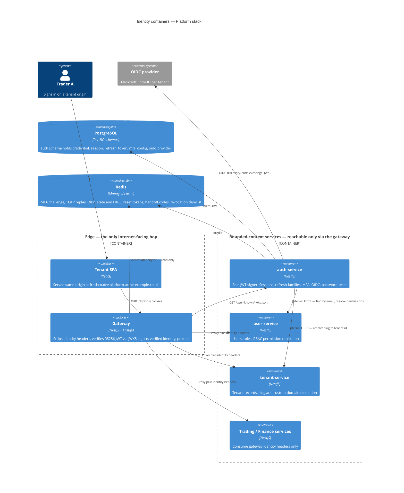

**Takeaways**

1. **auth-service is the only signer.** The RSA private key is mounted into auth-service
   alone; every other verifier holds public material or nothing at all (ADR-0053).
2. **The gateway is the only verifier of the JWT.** BC services never parse a token — they
   read gateway-injected headers via `GatewayIdentityGuard` (`@acme/auth-client`).
3. **Redis is availability-critical for authentication, not just performance.** MFA
   challenges, OIDC state/PKCE, reset tokens, SSO handoff codes and the revocation denylist
   all live there. A Redis outage fails _closed_ at the gateway (503 `AUTH_REVOCATION_UNAVAILABLE`).
4. auth-service reaches user-service and tenant-service over internal HTTP; it never queries
   their schemas directly (per-BC schema isolation).

**Invariant:** the trust boundary is _the gateway_, and it is enforced by network policy —
BC services accept identity headers because no pod other than the gateway may reach them.

---

## 2. The gateway request pipeline

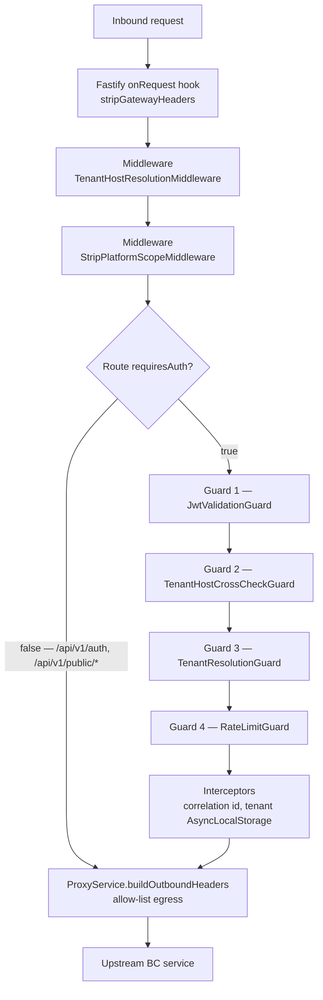

The ordering is load-bearing and was learned the hard way (issue #865): **NestJS middleware
runs before guards**, so anything that needs JWT-derived identity must be a guard, not
middleware. That is why `TenantHostCrossCheckGuard` is a guard while host _classification_
is middleware, and why `StripPlatformScopeMiddleware` is explicitly documented in-code as
belt-and-braces rather than the authoritative control.

**Takeaways**

1. The strip hook runs at the Fastify layer, _before_ any Nest component, so a spoofed
   `x-tenant-id` cannot influence even the earliest middleware.
2. `requiresAuth: false` routes bypass both the JWT guard and the host cross-check — their
   tenant context comes from the Host only. `/api/v1/auth/*` is one of them: the gateway
   proxies the login surface to the auth authority rather than guarding it.
3. Both the JWT guard and the cross-check guard call the _same_ `resolveService()` matcher
   used to pick the upstream, so "is this route public" can never diverge from "where does
   this route go".
4. `resolveService()` rejects NUL bytes, `..` and `%2e` outright and matches on URL segment
   boundaries, so `/api/v1/tenantsX` cannot borrow `/api/v1/tenants`' policy.

**Invariant:** every security decision that depends on the route is taken from the
_already-resolved route object_, never from a separately re-parsed path.

---

## 3. Password login with MFA challenge

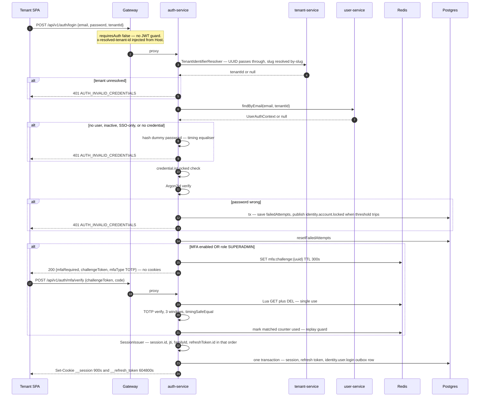

**Takeaways**

1. **Every rejection branch runs the same amount of password work.** Unknown email,
   deactivated account and SSO-only account all hash a dummy password before returning the
   identical `InvalidCredentialsError`, so `/auth/login` is not an account-enumeration oracle.
2. **Tenant resolution is deliberately _not_ timing-equalised** (ADR-0069). A tenant slug is
   a public company subdomain that the SSO flow already discloses; the secret being protected
   is email-within-a-valid-tenant, and that stays equalised inside the login use case.
3. **A correct password is not a session.** When MFA is enabled — or when the account holds
   `SUPERADMIN`, _even if it has never enrolled_ — the response carries a challenge token and
   **no cookies**. An unenrolled superadmin is routed into enrolment before any session exists.
4. The session write, the refresh-token write and the `identity.user.login` outbox row commit
   in **one** transaction, so the audit event can never diverge from the session it describes.
5. Argon2id parameters are OWASP-aligned and defined in `password.service.ts`: memory 65536 KB
   (64 MB), time cost 3, parallelism 4; the algorithm is left unset because Argon2id is the
   library default. Policy: min 12 chars, upper + lower + digit + special, last 5 passwords
   rejected. Lockout: 5 failed attempts, 15 minutes.

**Invariant:** the token-generation call order inside `SessionIssuer`
(`session.id → jti → familyId → refreshToken.id`) is fixed and documented as
non-reorderable — deterministic test fixtures depend on it, and password login and SSO share
this one seam so they can never drift apart.

---

## 4. Refresh-token rotation with family reuse detection

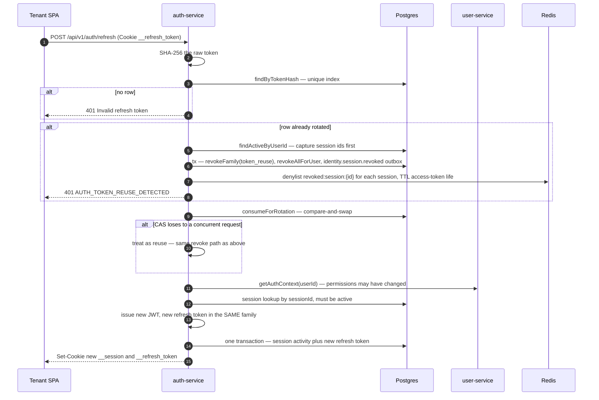

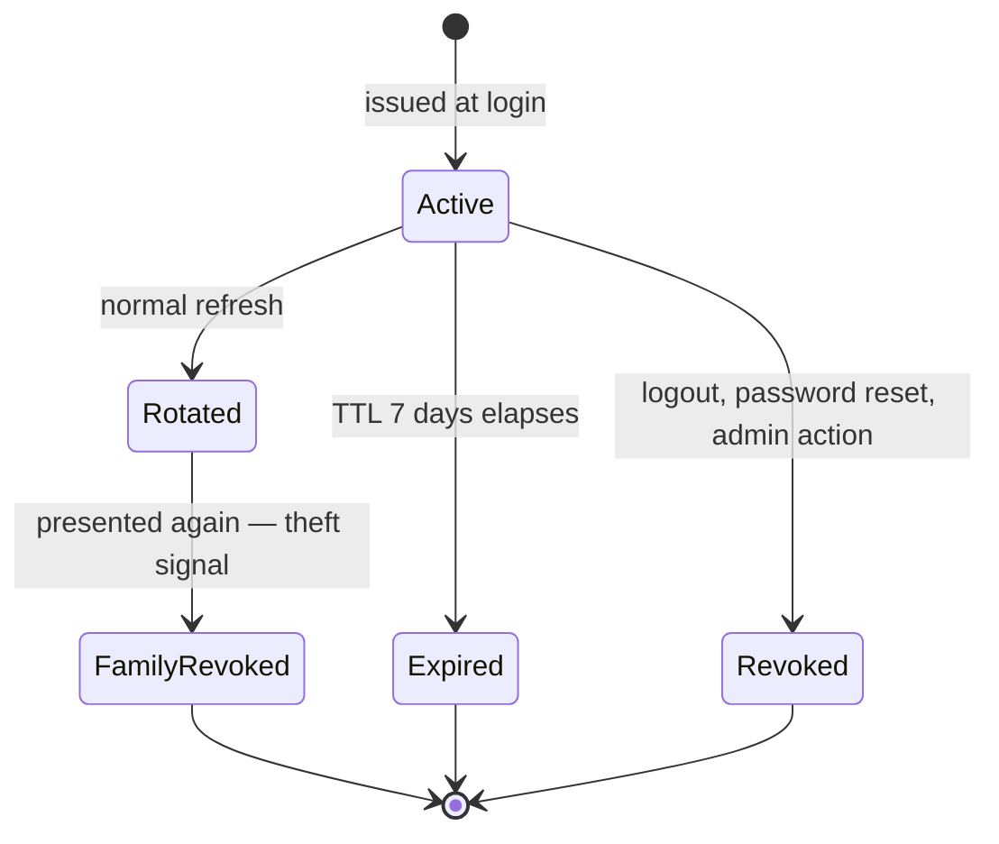

**Takeaways**

1. Reuse detection covers **both** shapes: sequential reuse (an already-rotated token is
   presented) and concurrent reuse (the loser of a compare-and-swap race). Both take the same
   revoke path, so a race can never mint a second valid token that outlives family revocation.
2. Revocation is layered: PostgreSQL is the durable record, Redis is the _fast_ denylist the
   gateway reads. Session ids are enumerated **before** the revoke transaction because the SQL
   revoke does not return them.
3. Permissions are re-read from user-service on every refresh, so a role change takes effect
   within one access-token lifetime rather than one refresh-token lifetime.
4. **A documented, deliberate gap:** happy-path rotation writes _nothing_ to the denylist. The
   just-superseded access token stays valid at the gateway until its natural 15-minute expiry.
   The in-code comment explicitly forbids "fixing" this — normal rotation is not a revocation
   event and denylisting every refresh would bloat Redis. Reuse, logout and password reset
   _do_ denylist.

**Invariant:** refresh tokens are never stored in plaintext — only their SHA-256 hash, under
a unique index. Possession of the database does not yield usable refresh tokens.

---

## 5. OIDC / SSO with PKCE and one-time-code session handoff

Under hostname-based tenancy (ADR-0066) each tenant is its own origin, and session cookies
must be **host-only** — no `Domain=` attribute, ever. But Entra forbids wildcard redirect
URIs, so the callback must land on one central host. ADR-0067 resolves the contradiction with
an opaque, single-use, 60-second handoff code.

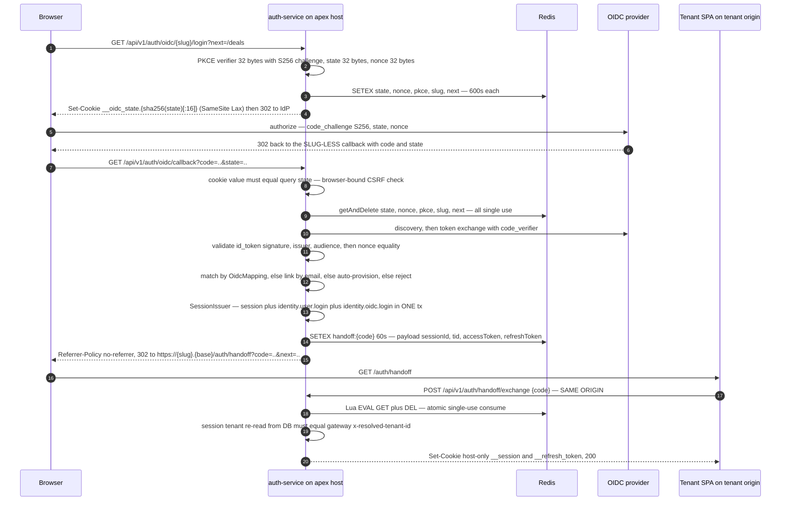

**Takeaways**

1. **The tenant is recovered from server-side state, never from the URL.** The callback is
   slug-less — one registered redirect URI serves every tenant — and the slug travels in Redis
   bound to `state`. A path slug that _contradicts_ the state-bound slug is rejected.
2. **The state cookie is named per attempt** (`__oidc_state.{sha256(state)[:16]}`). SSO
   initiates on the apex where all tenants share one cookie jar; a fixed cookie name let
   concurrent logins clobber each other and produced intermittent `AUTH_INVALID_OAUTH_STATE`.
   Deriving the _name_ from the attacker-visible state is sound because the check remains
   cookie value === query state.
3. **The exchange is fail-closed at four gates** — code miss, unknown session, unresolvable
   host, tenant mismatch — and every one throws the _identical_ `401 HANDOFF_CODE_INVALID`
   before a single cookie object is constructed. Each gate logs which one fired, because a
   silent uniform rejection previously hid a dropped proxy header for days.
4. `GETDEL` is unavailable on the managed Redis 6.0 in use, so single-use consumption is a
   two-line Lua `EVAL` (`GET` then `DEL`). The same helper backs MFA challenge tokens and
   password-reset tokens.
5. The 302 target's origin is built purely from the state-bound slug plus the configured
   `PLATFORM_BASE_DOMAIN`; only `next` is caller-influenced and it is reduced to a same-origin
   relative path (rejects absolute URLs, `//host`, backslashes, `://`). No open redirect.
6. Failure events are attributed by **tenant id from the server-side state binding**, never a
   caller-supplied slug — otherwise an attacker could poison another tenant's audit trail. An
   unattributable forged callback produces a log line and no event.

**Invariant:** no session cookie is ever set on the central callback host, and no cookie the
platform sets carries a `Domain=` attribute. Cross-subdomain session material does not exist.

---

## 6. Password reset

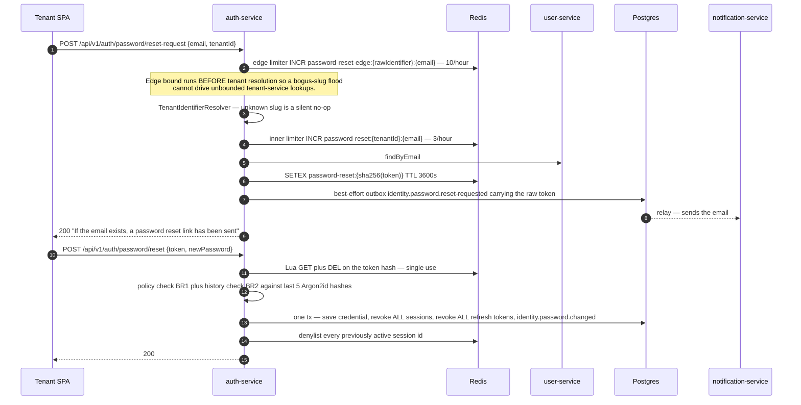

**Takeaways**

1. **Two rate limiters, deliberately.** The inner per-`(tenant, email)` limit (3/hour) only
   runs once a tenant resolves; the coarser edge limit (10/hour) is keyed on the _raw_
   pre-resolution identifier so an unresolvable-slug flood is bounded. Rate-limit keys are
   tenant-scoped so one tenant cannot exhaust another tenant's user's quota.
2. The response is byte-identical whether the email exists, the tenant is unknown, or the edge
   bucket is exhausted — the endpoint is never an enumeration oracle.
3. The token lives only as a SHA-256 hash in Redis and is consumed atomically. Completing a
   reset revokes **all** sessions and **all** refresh tokens for the user and denylists their
   live access tokens immediately, rather than waiting out the 15-minute JWT TTL.
4. **Accepted atomicity boundary:** the token is in Redis and the notification event is in the
   PostgreSQL outbox, so they cannot share a transaction. The event publish is best-effort and
   non-fatal; a crash in between is a documented accepted gap.

---

## 7. RS256 signing, JWKS distribution and key rotation

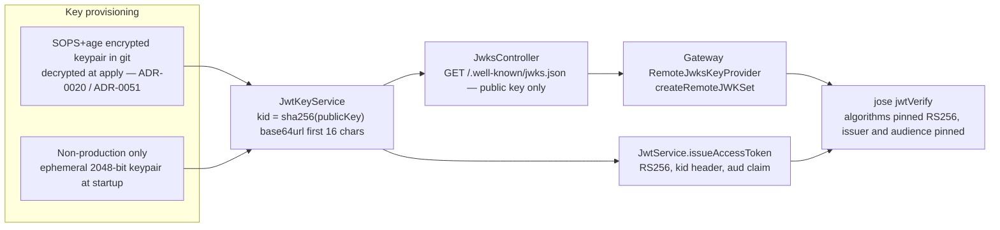

```
Access token — verified claim set (JwtService.issueAccessToken)
┌──────────────┬──────────────────────────────────────────────────────────────┐
│ sub          │ userId (UUID)                                                │
│ tid          │ tenantId (UUID) — ALWAYS present, even for SUPERADMIN         │
│ roles        │ string[]  e.g. ["ADMIN","TRADER"]                            │
│ permissions  │ string[]  union of role grants, or ["*"] for SUPERADMIN      │
│ sessionId    │ session reference — required; feeds the session denylist key │
│ jti          │ unique token id — feeds the per-token denylist key           │
│ iat / exp    │ epoch seconds; exp = iat + 900 (JWT_ACCESS_TOKEN_TTL)        │
│ iss          │ "platform-auth-service"                                      │
│ aud          │ "platform-api"  (optional; pinned on verify when configured) │
│ platformScope│ true — emitted IFF roles includes SUPERADMIN (ADR-0029)      │
│ mfaEnabled   │ boolean — emitted when known (ADR-0054)                      │
└──────────────┴──────────────────────────────────────────────────────────────┘
Protected header: { "alg": "RS256", "kid": "<16-char base64url digest>" }
```

**Takeaways**

1. **Rotation is a `kid` overlap, not a redeploy of every verifier.** Publish old + new public
   keys in the JWKS, roll auth-service onto the new private key, retire the old entry. The
   gateway's `createRemoteJWKSet` caches for 10 minutes, rate-limits forced refetches to one
   per 30 seconds (the rotation path), and times out at 5 seconds.
2. **Algorithm confusion is closed by pinning.** The gateway pins `algorithms: ['RS256']`; a
   token replayed as HS256 with the public key as the HMAC secret raises
   `JOSEAlgNotAllowed → 401 AUTH_INVALID_SIGNATURE`.
3. **A JWKS outage is a 503, not a 401.** `JWKSTimeout` maps to `AUTH_JWKS_UNAVAILABLE` (503)
   so a transient key-fetch failure is not misreported as a client-side signature error.
4. **The JWKS route is pinned at the application root.** `JwksController` is `@Controller()`
   with no prefix and carries an in-code warning: adding an `api/v1` prefix would break
   `createRemoteJWKSet` and cause cluster-wide token-verification 503s. A regression test
   guards the path.
5. In production, absent `JWT_PRIVATE_KEY`/`JWT_PUBLIC_KEY` is a **hard startup failure** —
   the ephemeral-keypair fallback is gated on `NODE_ENV !== 'production'`.
6. Two privilege guards live in the signer itself: `SUPERADMIN` must have a non-blank home
   `tid`, and `platformScope: true` is rejected outright for a non-`SUPERADMIN` caller.

---

## 8. The gateway identity-header contract

```
STRIP (Fastify onRequest, before all Nest components)     INJECT (JwtValidationGuard, from verified claims)
──────────────────────────────────────────────────────    ─────────────────────────────────────────────────
x-tenant-id            ← any inbound copy deleted          x-tenant-id      ← tid
x-user-id                                                  x-user-id        ← sub
x-user-roles                                               x-user-roles     ← roles joined by comma
x-permissions                                              x-permissions    ← permissions joined by comma
x-ip-address                                               x-ip-address     ← first x-forwarded-for hop, else request.ip
x-correlation-id                                           x-correlation-id ← FRESH randomUUID, never inherited
x-super-admin          ← strip-only, NEVER re-injected     x-mfa-enabled    ← mfaEnabled, when the claim is present
x-platform-scope                                           x-platform-scope ← fixed literal 'true', IFF platformScope === true
x-mfa-enabled                                              x-resolved-tenant-id ← set by TenantHostResolutionMiddleware
x-resolved-tenant-id                                                            from the gateway's OWN host resolution
```

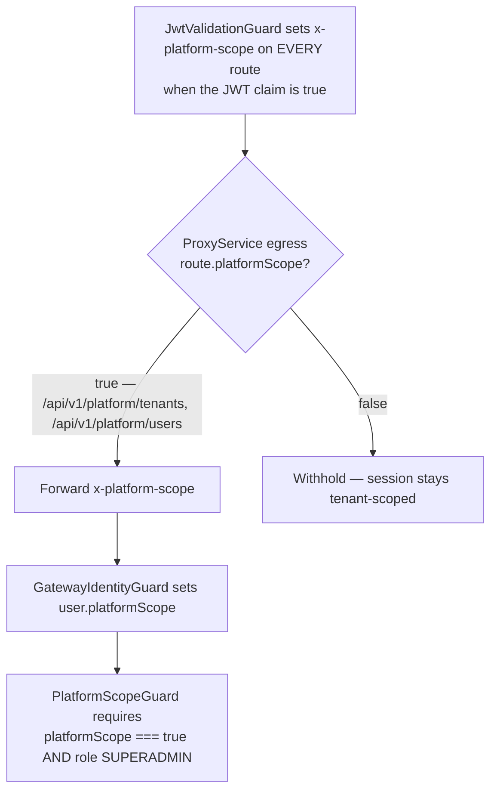

**Takeaways**

1. **Strip-then-inject, in that order, at two different layers.** The strip is a Fastify hook
   so it precedes even the earliest middleware; the inject is a guard so it follows JWT
   verification. Nothing in between can read a client-supplied identity header.
2. **Every injected value is `String()`-coerced and CR/LF/NUL-sanitised**, so even a
   compromised signer cannot smuggle extra headers downstream through a doctored claim.
   `roles`/`permissions` are normalised once into a canonical array used by _both_ the CSV
   header and `request.user`, so the two views cannot drift.
3. **`x-correlation-id` is always minted fresh.** No inbound value is trusted — this removes
   the implicit "the strip hook must never be route-scoped" invariant from the guard.
4. **`x-platform-scope` is not in the always-forwarded identity set.** The authoritative
   route-scope is the _egress_ gate, keyed off the already-resolved route object. A separately
   normalised path check could be bypassed by a double-encoded traversal that routes to a
   business service but re-parses to a platform path. `StripPlatformScopeMiddleware` is
   explicitly documented as belt-and-braces, not the control.
5. **`x-super-admin` is strip-only.** The legacy data-layer tenant middleware reads it to
   disable the ORM tenant filter, so it is dropped at ingress and never forwarded.
6. **The `Authorization` header and the `Cookie` header are dropped by default.** Cookies are
   forwarded only for `/api/v1/auth/oidc` (which needs `__oidc_state`); the bearer only for
   routes that opt in via `forwardAuthorization`.

**Invariant — and the honest caveat:** these headers are **unsigned**. Their integrity rests
entirely on NetworkPolicy ensuring the gateway is the only pod that can reach a BC service.
ADR-0029 records this explicitly and defers signing / mesh mTLS as separately tracked
hardening. `GatewayIdentityGuard` rejects any request lacking `x-user-id`/`x-tenant-id` — the
only defence against direct traffic is that the request cannot arrive at all.

---

## 9. RBAC — 7 roles, multi-role union, wildcard superadmin

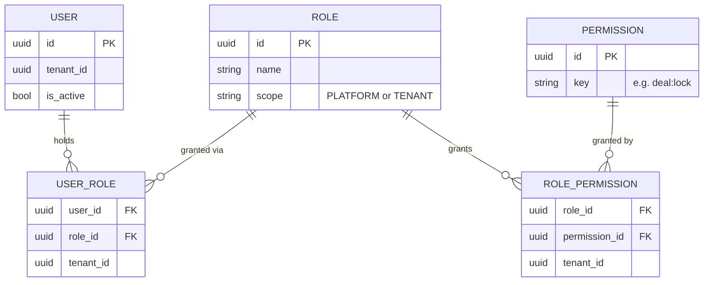

| Role         | Scope    | Grants (seed) | Notes                                                                     |
| ------------ | -------- | ------------- | ------------------------------------------------------------------------- |
| `SUPERADMIN` | PLATFORM | `['*']`       | Wildcard; carries `platformScope`; provisioned at deployment only         |
| `ADMIN`      | TENANT   | 65            | Full tenant operations incl. `commission:configure`                       |
| `MD`         | TENANT   | 27            | Trading oversight + `deal:lock`; explicitly **not** `commission:view:all` |
| `TRADER`     | TENANT   | 24            | Core trading operations                                                   |
| `FINANCE`    | TENANT   | 17            | Invoice read/approve/void, commission pay                                 |
| `VIEWER`     | TENANT   | 12            | Read-only                                                                 |
| `AGENT`      | TENANT   | 4             | External agent base set; finer scoping deferred                           |

**Takeaways**

1. **Permissions are resolved at token issuance, not per request.** `RbacService.resolvePermissions()`
   batch-loads roles (no N+1), short-circuits to `['*']` if any role is `SUPERADMIN`, otherwise
   returns the deduplicated union across all of the user's roles within the tenant.
2. **The wildcard is a shared grammar, not an accident.** `satisfiesPermission()` in
   `@acme/auth-client` is the single unit-tested predicate: `granted.includes('*') || granted.includes(required)`.
   Without it, `['*'].includes('deal:lock')` would be `false` and superadmins would be denied
   every guarded endpoint. Issuer and enforcer are kept in lock-step by that one function.
3. **Two business rules are enforced in user-service, not the gateway:** a user cannot change
   their own roles (`CannotChangeOwnRoleError` when `userId === assignedById`), and `SUPERADMIN`
   is not assignable from a tenant context.
4. Because permissions are frozen into the JWT, a revocation of privilege takes effect at the
   next refresh (≤15 minutes) — or immediately, if the session is denylisted.

---

## 10. Tenant resolution — pre-auth by hostname, post-auth by claim

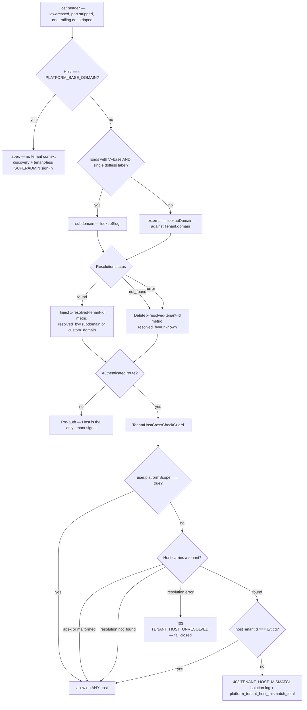

**Takeaways**

1. **The match is anchored on a dot boundary, never a raw suffix.** `evilacme-example.co.uk`
   must not read as a subdomain of `acme-example.co.uk`. A multi-label prefix (`a.b.{base}`)
   falls through to `external` because tenant slugs forbid dots.
2. **Pre-auth and post-auth resolve differently, on purpose.** Public routes take the tenant
   from the Host; authenticated routes take it from the **verified JWT `tid`** and only
   _cross-check_ the Host. ADR-0066 corrects the older API reference, which had the gateway
   resolving tenant from headers _before_ JWT validation — spoofable.
3. **Indeterminate resolution fails closed but does not cry wolf.** A tenant-service outage on
   a host that _should_ resolve returns `TENANT_HOST_UNRESOLVED` and deliberately does **not**
   increment the mismatch counter, so the isolation-violation alert only fires on a confirmed
   cross-tenant hit.
4. **`x-resolved-tenant-id` is the gateway's own annotation**, forwarded on _every_ route
   including unauthenticated ones — the SSO handoff exchange fail-closes on it. Dropping it
   once made the exchange 401 deterministically while every earlier SSO hop succeeded.
5. **Pre-auth slug→UUID resolution currently lives in auth-service** (ADR-0069 contract A):
   the SPA sends the hostname-derived slug in the `tenantId` body field and
   `TenantIdentifierResolver` converts it, mirroring how OIDC already resolves `:tenantSlug`.
   The target end-state (contract C) moves this to the gateway and retires both the resolver
   and the DTO field — gated on ratifying header-trust posture for public routes.
6. Entity-level cross-tenant reads remain a **404** data-contract concern of the ORM tenant
   filter; the 403 here is host-level only and never re-derives data isolation.

**Invariant:** tenant identity after authentication is cryptographically bound to the session
(`tid`), never derived from a URL or header. The Host is a cross-check, not a source.

---

## 11. What is not verified, and where docs disagree with code

- **`JWT_CLAIMS` in `@acme/platform-contracts` is stale and unused.** It declares
  `TENANT_ID: 'tenantId'` and `SESSION_ID: 'sid'`, while the implemented and verified claims
  are `tid` and `sessionId`. A repo-wide grep finds no consumer of the constant outside its
  own barrel file, so nothing breaks — but the contract library is not the source of truth for
  claim names. ADR-0066 settled this empirically in favour of `tid`.
- **Cookie forwarding on the general auth route.** `ProxyService` copies the `Cookie` header
  only when `route.forwardCookies` is set, which is true **only** for `/api/v1/auth/oidc`; a
  unit test explicitly asserts the general `/api/v1/auth` route is falsy. Yet
  `/auth/refresh`, `/auth/logout` and `/auth/mfa/setup` all recover identity from the
  `__session` / `__refresh_token` cookies via `SessionCookieResolver`. I could not verify from
  source how those cookies reach auth-service through the gateway proxy — the plausible
  explanations (a separate ingress route, or a defect) are not distinguishable from the code
  I read. Treat this as an open question, not as documented behaviour.
- **Prose drift in the security architecture document.** It locates the header-strip hook in
  `main.ts`; the strip was extracted into a dedicated Fastify-hook wiring module precisely so
  integration tests register the same chain production does (deleting an inline `addHook` line
  had previously passed every test in the repo). It also describes rate limiting as in-memory
  with "no Redis dependency" — the auth-service limiters verified here are Redis-backed.
- **Not examined in this section:** the gateway rate-limit tiers, CORS soft-reject
  (ADR-0058), body-size limits, container hardening, and the encryption-at-rest subscriber
  that AES-256-GCM-encrypts OIDC client secrets and TOTP secrets. Each is covered by its own
  document.
- **MFA email as a second factor** appears in the response type (`mfaType: 'TOTP' | 'EMAIL'`)
  but every issuance path verified returns `'TOTP'`. `'EMAIL'` looks reserved, not implemented.
