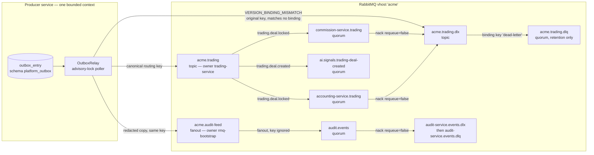
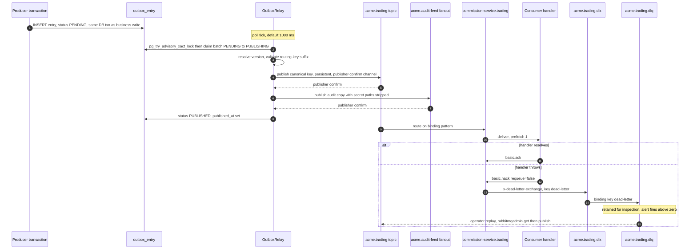
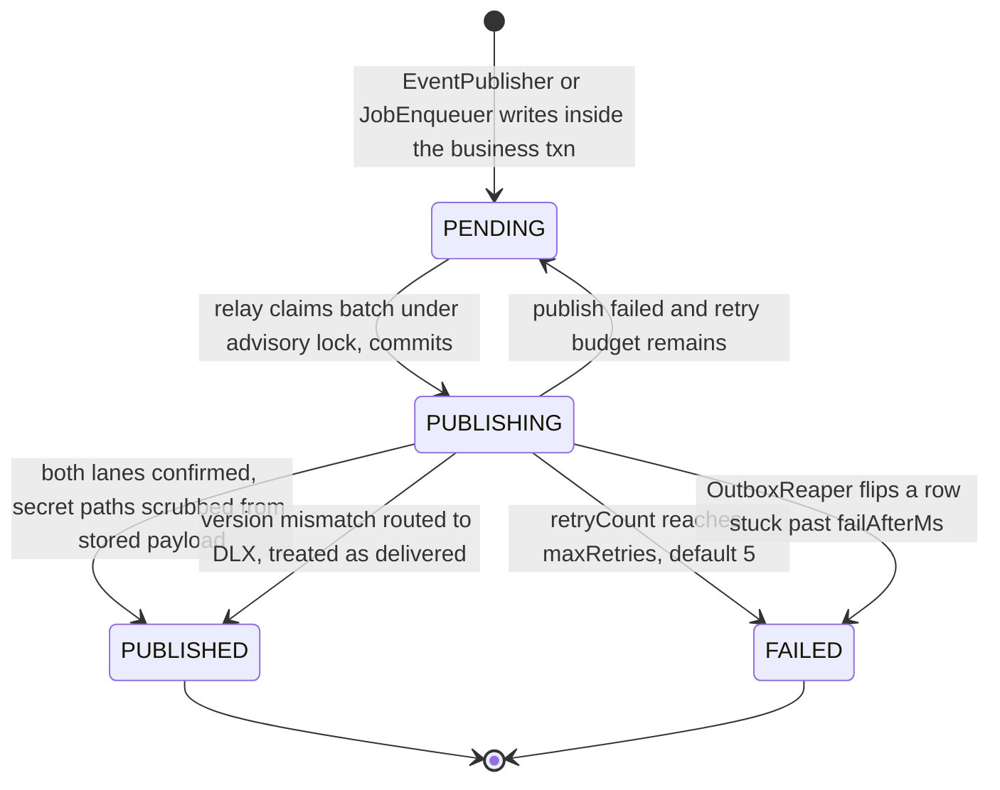
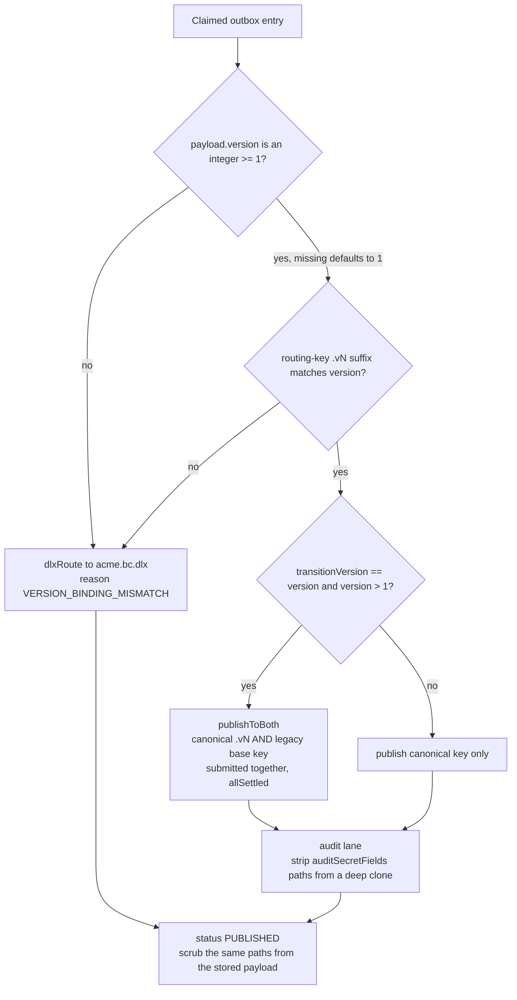
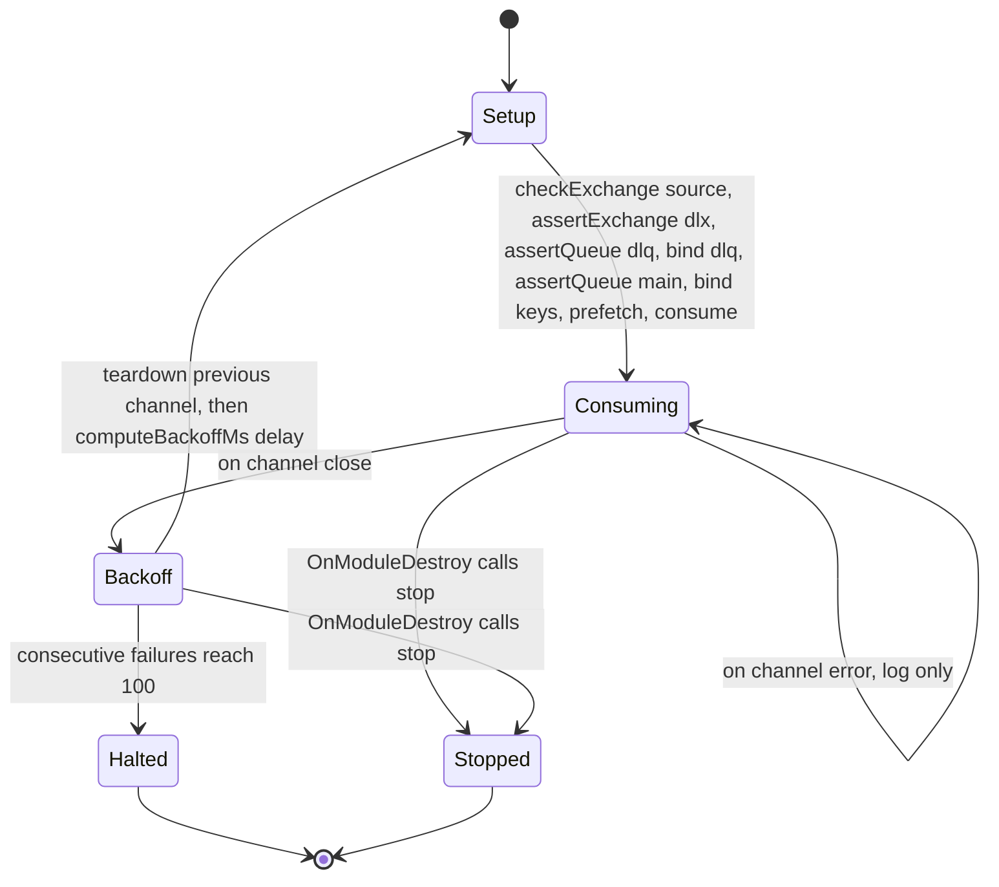
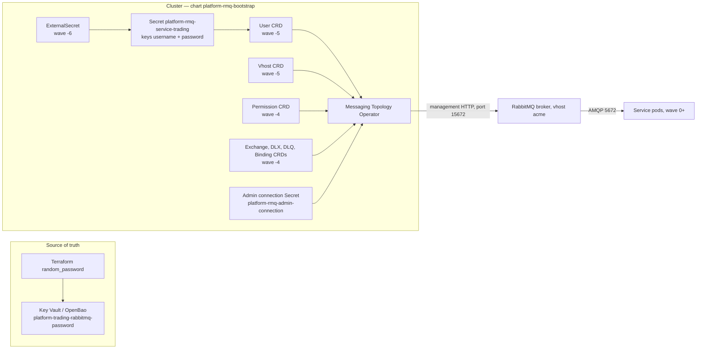

# Backend — Asynchronous Messaging (RabbitMQ)

What this covers: the complete asynchronous spine of the Platform services — one topic
exchange per bounded context, the `acme.audit-feed` fanout every producer dual-publishes to,
the queue/DLX/DLQ naming grammar that runtime code and Helm charts must agree on
character-for-character, the transactional-outbox relay that is the only sanctioned publish
path, the consumer reconnect/teardown discipline, and how users, permissions and topology are
provisioned declaratively through the RabbitMQ Messaging Topology Operator. Everything below
was read out of the runtime libraries (`libs/platform/event-bus`, `libs/platform/queue`), the
`charts/platform-rmq-bootstrap` chart, and ADRs 0017, 0018, 0026, 0028, 0036 and 0049. Where
chart comments and shipped code disagree, the drift is called out rather than smoothed over.

---

## 1. Deciding ADRs

| ADR      | Title                                                 | What it fixes here                                                                                                                                              |
| -------- | ----------------------------------------------------- | --------------------------------------------------------------------------------------------------------------------------------------------------------------- |
| ADR-0017 | RabbitMQ Unified Messaging (Events + Jobs)            | One broker for events _and_ jobs; BullMQ removed; Redis is cache-only. Topic exchange per BC, work queues `jobs.{service}.{purpose}`, DLX per queue.            |
| ADR-0018 | Transactional Outbox for Domain Events                | Integration events are written to `outbox_entry` in the business transaction; a relay publishes them. In-process domain events stay on the NestJS emitter.      |
| ADR-0026 | Audit Feed Fan-Out Exchange for Event Consumption     | Relay dual-publishes every entry to `acme.audit-feed` (fanout) so the audit service needs zero per-BC bindings.                                                 |
| ADR-0028 | AI Service Messaging: RabbitMQ with Explicit ACL      | No wildcard `#` bindings for the AI service — one named queue per consumed event type.                                                                          |
| ADR-0036 | Versioned Event Routing Keys for Safe Rolling Deploys | `.vN` routing-key suffix, producer-side dual-publish window, relay-enforced version↔routing-key match with DLX on mismatch.                                     |
| ADR-0049 | RabbitMQ Cluster Operator Adoption                    | Declarative topology via CRDs, per-service `User`/`Permission`, passive `checkExchange` on foreign exchanges, credential chain without password-embedding URIs. |

---

## 2. Broker topology



**What it shows.** One BC — trading — as a representative slice. The same shape is repeated
for `acme.identity`, `acme.platform`, `acme.inventory`, `acme.accounting`, `acme.commission`,
`acme.communication`, `acme.reporting` and `acme.ai`; the chart declares ten exchanges in total
(nine topic + one fanout).

**Takeaways.**

1. **The publishing BC owns its exchange.** A consumer in another BC has no `configure`
   permission on it and must verify it _passively_ — `checkExchange` (a passive `exchange.declare`)
   rather than `assertExchange`. An active declare on a foreign exchange returns
   `403 ACCESS_REFUSED - configure access to exchange ... refused` and crash-loops the consumer
   (#970; publisher-side analogue #1039).
2. **The fanout is not per-BC.** ADR-0026 rejected binding the audit queue to each BC exchange
   with `#`: that makes every new BC an operational trap where events are silently unaudited
   until someone adds the binding. The fanout costs one extra publisher confirm and buys
   zero coupling.
3. **A DLX with no bound queue is a black hole.** `acme.<bc>.dlx` alone silently discards
   dead-lettered messages; the chart's `<exchange>.dlq` + `Binding(routingKey=dead-letter)` are
   what make failure inspectable (#976 problem 3).
4. **Every queue is a quorum queue.** Broker default is `default_queue_type = quorum`, so runtime
   `assertQueue` pins `x-queue-type: quorum` explicitly — a redeclare against leftover
   classic-queue state otherwise throws `PRECONDITION_FAILED` (#958).
5. **The AI service never wildcards.** Per ADR-0028 each consumed event type gets a named queue
   (`ai.signals.<source>-<event>`) and an explicit binding, so adding an event needs a code
   change plus a contract test — deliberately.

**Invariant.** _Topology is declared, not discovered._ Every exchange, DLX, retention DLQ and
DLQ binding exists as a CRD before any service pod starts, so consumer startup never depends on
producer startup order.

---

## 3. Naming grammar

```
event type            <bc>.<aggregate>.<past-tense-action>       trading.deal.locked
routing key (v1)      == event type                              trading.deal.locked
routing key (vN>=2)   <event type>.v<N>                          trading.deal.locked.v2
topic exchange        acme.<bc>                                  acme.trading
audit fanout          acme.audit-feed                            (shared, all producers)
dead-letter exchange  <exchange>.dlx                             acme.trading.dlx
retention DLQ         <exchange>.dlq                             acme.trading.dlq
DLQ binding key       literal "dead-letter"

consumer queue        <service>-service.<source-bc>              commission-service.trading
                      <service>-service.<routing-key>            user-service.platform.tenant.created
  AI service          ai.signals.<source>-<event>                ai.signals.trading-deal-created
  audit service       audit.events                               (bound to the fanout)

work queue            jobs.<service>.<purpose>                   jobs.communication.document-generation
```

The queue prefix is not cosmetic. RabbitMQ checks `configure` against the **queue name** on
`assertQueue`, and — critically — `queue.bind` checks **write on the destination queue** and
**read on the source exchange**. That is why every service's `write` regex includes its own
`<service>-service\..*` namespace even though the service publishes only to its BC exchange;
omitting it 403s the _bind_, not the publish, and crash-loops the pod at boot (observed for
`trading_user`, 2026-07-17; the same fix earlier for `user_user` and `inventory_user`).

The DLX/DLQ are keyed off the **exchange**, never off the service. Both runtime paths — the
relay's `${exchangeName}.dlx` and the consumer explorer's `<derived exchange>.dlx` — target the
exchange-derived name, so a per-service `<svc>.dlx` would never be the runtime target and the
retention DLQ would catch nothing (#1183 defect E).

---

## 4. Message lifecycle: publish → route → consume → ack/nack → DLQ → replay



**What it shows.** The full path of one integration event, from the business transaction that
mints it to the dead-letter sink and back.

**Takeaways.**

1. **`EventPublisher` never touches AMQP.** It writes an `OutboxEntry` with
   `routingKey = eventType` and `status = PENDING` onto the caller's transactional
   `EntityManager`. If the business transaction rolls back, the event never existed.
2. **Claim, publish, persist are three separate transactions.** Phase 1 claims a batch under
   `pg_try_advisory_xact_lock` and commits (`PENDING → PUBLISHING`); phase 2 publishes with no
   transaction open, because a broker publish cannot be rolled back; phase 3 writes each outcome
   in a short transaction (default chunk of 10 entries). The earlier cycle-wrapping transaction
   could roll back N successful publishes to `PENDING` and re-deliver them (#792).
3. **Nack is always `requeue=false`.** `setupRabbitConsumer` acks after the handler resolves and
   nacks-without-requeue on any throw — including a JSON parse failure. There is no in-place
   redelivery loop; a poison message goes to the DLX on the first failure.
4. **Delivery is at-least-once.** The `@EventHandler` contract states it explicitly: handlers
   MUST be idempotent. During a dual-publish window a retry can re-send the canonical key
   (the per-routing-key publish checkpoint is a tracked follow-up in `publishToBoth`).
5. **Replay is manual.** The monitoring runbook's DLQ procedure is `rabbitmqadmin get` to
   inspect, fix the consumer, redeploy, then `rabbitmqadmin publish` back to the original
   exchange and routing key. There is **no committed DLQ-reprocess tooling in the repository** —
   see §9.

**Invariant.** _The relay is the only publish path of record._ Every message on a BC exchange
carries `persistent: true` and is confirmed by the broker before the outbox row is marked
`PUBLISHED`; a publish whose confirm callback never fires is bounded by
`publishConfirmTimeoutMs` (default 30 s) and treated as a normal failure rather than hanging
the poll loop and blocking SIGTERM (#816).

---

## 5. Outbox entry lifecycle



**Takeaways.**

1. **Stuck-in-`PUBLISHING` is the safe state, by design.** If the phase-3 status write fails
   (DB blip mid-cycle) the row stays `PUBLISHING`; the relay's claim query filters on
   `status = PENDING`, so it is never republished. That trades a stuck row for the
   duplicate-delivery class (#792 H-5).
2. **The reaper is the cleanup for that trade.** `OutboxReaper` scans `PUBLISHING` rows older
   than a warn threshold, logs them, and past `failAfterMs` flips them to `FAILED` with an
   explicit `lastError` marker via a `nativeUpdate` whose `WHERE` still asserts `PUBLISHING` —
   so it can never stomp a row the relay concurrently completed. It is co-located with the relay
   and instantiated only when `enableRelay: true` (#813).
3. **A version-mismatched entry ends `PUBLISHED`, not `FAILED`.** The relay ships a structured
   envelope to `<exchange>.dlx` and marks the entry delivered, so it does not re-attempt a
   message that is broken at the producer.
4. **Both the relay and the reaper must disable the global tenant filter.** `OutboxEntry` lives
   in the non-tenant-scoped `platform_outbox` schema, but the fail-closed `tenant` filter is
   registered `default: true` and its condition _throws_ with no tenant context. MikroORM v6
   applies filters to `nativeUpdate` as well as `find`, so `{ filters: { tenant: false } }` is
   required on the claim **and** on the status write-back — otherwise every entry sticks in
   `PUBLISHING` forever.
5. **Secrets do not survive a successful relay.** After a confirmed publish, the paths declared
   in `auditSecretFields[eventType]` are deleted from the stored jsonb payload as well as from
   the audit-feed copy, so a raw invite/reset token is not retained at rest in the outbox row.

**Invariant.** The relay is single-flight per outbox table: `pg_try_advisory_xact_lock` with a
per-service lock id (`OUTBOX_ADVISORY_LOCK_ID`, default `900001`, validated as a positive
integer at module construction). Two services sharing an id would silently serialise against
each other.

---

## 6. Relay publish decision tree (version enforcement + audit lane)



**Takeaways.**

1. **`version` is enforced at publish time, not at compile time.** TypeScript protects the
   producer; nothing protected the wire until ADR-0036 made the relay validate the `.vN` suffix
   against `payload.version`. A missing `version` defaults to 1 for pre-ADR producers.
2. **The DLX message is a structured envelope, not the original.** The body carries
   `{ originalRoutingKey, expectedVersion, actualVersion, eventId, reason }`; the original
   payload rides on the `x-acme-original-payload` header (and a non-numeric raw version on
   `x-acme-actual-version-raw`) so a recovery tool can replay verbatim once the producer bug is
   fixed.
3. **Dual-publish is a Helm value, not a code change.** `eventBus.transitionVersion` in the
   producer bundle's values renders `EVENT_BUS_TRANSITION_VERSION`; the relay dual-publishes only
   when it exactly equals the entry's version and that version is ≥ 2. Unsetting it after the
   observation window reverts to canonical-only.
4. **Both publishes are submitted before either is awaited** (`Promise.allSettled`). Sequential
   publishing produced a duplicate-delivery mode where the canonical key confirmed, the legacy
   key failed, the entry went back to `PENDING`, and the canonical key was published again.
5. **Redaction is one-directional and off by default.** The BC lane always ships the untouched
   buffer (notification-service legitimately needs the raw accept token to build an invite
   email); only the audit copy — which the audit service persists verbatim into
   `audit_entry.new_state` — is cloned and stripped. When no paths are configured for an event
   type the original buffer is returned unchanged, so unaffected services pay nothing.

**Invariant.** A relay-enabled service only ever emits its own bounded context's events. The
statically asserted `${exchangeName}.dlx` therefore always equals the runtime
`${deriveExchange(eventType)}.dlx`. A service that ever relays cross-BC events breaks this and
must move to a lazy declare-on-first-use.

---

## 7. Consumer reconnect and teardown discipline



**Takeaways.**

1. **Declaration order is load-bearing.** DLX before DLQ before the main queue: a quorum queue
   referencing an undeclared `x-dead-letter-exchange` is rejected on some broker versions (#958),
   and the DLX→DLQ binding must exist before any message can dead-letter (#976).
2. **Recovery is driven by `close` only.** amqplib emits `error` _then_ `close` on a server-side
   channel exception. If both scheduled a reconnect you would get two overlapping chains — a
   leaked channel and a duplicated consumer. `error` therefore only logs (which also satisfies
   the EventEmitter contract and prevents an unhandled-`error` crash).
3. **The failure counter resets on every successful setup.** It bounds an _unbroken_ failure
   streak, not the pod's lifetime. Counting cumulatively meant a long-lived pod that survived
   many isolated blips would eventually cross the cap and stop consuming silently.
4. **Backoff is exponential with jitter and a cap.** `computeBackoffMs` yields
   `min(base·2^attempt, cap) + rand(0..jitter)`. The library default is 5 s base / 5 min cap /
   1 s jitter; the consumer wrapper passes 10 ms / 30 s / 5 ms. Jitter is what stops replicas
   from re-storming the broker in lockstep after a restart.
5. **Adopters must own the handle.** `setupRabbitConsumerWithReconnect` returns
   `{ stop() }`; a consumer that does not capture it and call `stop()` from `OnModuleDestroy`
   keeps opening channels on a closing connection during shutdown (#982).

**Invariant.** Teardown is deterministic: every reconnect removes the previous channel's `close`
and `error` listeners and closes it _before_ opening a new one, so listeners and channels never
accumulate across a partition.

---

## 8. Credentials, permissions and topology provisioning



**Takeaways.**

1. **The store holds a password, never a URI.** ADR-0049 removed the dual-secret
   `-uri`(password-embedding) + `-password` pattern and the Terraform `ignore_changes = [value]`
   that severed reconciliation and caused a three-service AMQP 403 outage (#1154). The AMQP URI
   is composed at consume time.
2. **Sync waves encode a hard dependency order.** ESO at `-6`, `Vhost` + `User` at `-5`,
   `Permission` + `Exchange` + DLX + DLQ + Binding at `-4`, service Applications at `0+`. Within
   one wave ArgoCD applies alphabetically **by kind** — `Exchange` sorts before `Vhost`,
   `Permission` before `User` — so co-locating them produces a noisy "vhost/user not found"
   first reconcile. Separate waves are the fix.
3. **`Permission` CRDs are effectively immutable.** The admission webhook rejects in-place
   updates to `user`/`userReference`/`vhost`/`rabbitmqClusterReference` **and** to the
   `spec.permissions` triplet. Tightening a permission means deleting the CRDs and letting
   ArgoCD recreate them — services mid-publish get 403'd during the gap. Coordinated rollout,
   not a routine sync.
4. **Use `userReference`, not `user`.** `spec.user` is the literal AMQP login and bypasses the
   User-CR linkage; a first cut that passed the short service name literally produced
   `vhost_or_user_not_found` on the broker PUT.
5. **A rotated Secret is not enough.** The operator caches the admin `connectionSecret`; after
   rotating the admin password the operator pod must be restarted or cluster-wide CRD
   reconciliation keeps using stale credentials.

**Permission triplet shape** (from the chart's service catalogue — patterns match _resource
names_, not routing keys):

```yaml
- name: trading
  username: trading_user
  permissions:
    configure: '^(acme\.trading(\..*)?|trading-service\..*)$'
    write: '^(acme\.trading(\..*)?|acme\.audit-feed(\..*)?|trading-service\..*)$'
    read: '^(acme\.(trading|platform|identity|accounting)(\..*)?|trading-service\..*)$'
```

Read it as: _declare only my own BC's resources and my own queue family_; _publish to my BC
exchange and the audit fanout, and bind my own queues_; _consume from my BC plus the foreign BCs
I subscribe to_. Every publisher needs `write` on `acme.audit-feed` because the relay
dual-publishes; the audit service, a pure consumer, needs `read` on it and nothing on the BC
exchanges.

**Chart layout:**

```
charts/platform-rmq-bootstrap/
├── Chart.yaml
├── values.yaml                       # services[] catalogue + exchanges[] + syncWaves
└── templates/
    ├── externalsecret-admin.yaml     # admin connectionSecret for the operator   (-6)
    ├── externalsecret-services.yaml  # per-service username+password Secret      (-6)
    ├── vhost.yaml                    # Vhost CRD                                 (-5)
    ├── user.yaml                     # User CRD, importCredentialsSecret         (-5)
    ├── permission.yaml               # Permission CRD, configure/write/read      (-4)
    ├── exchange.yaml                 # one Exchange per exchanges[] entry        (-4)
    ├── dlx-exchange.yaml             # <exchange>.dlx per entry                  (-4)
    ├── dlq-queue.yaml                # <exchange>.dlq quorum queue per entry     (-4)
    └── dlq-binding.yaml              # DLX -> DLQ, routingKey 'dead-letter'      (-4)
```

`permission.yaml` `fail`s the render if a service entry omits its triplet — the chart-wide
fallback ships a sentinel string that matches no real resource, so a migration gap surfaces as a
403 on a named service rather than as a silent broad grant.

---

## 9. Background jobs

Jobs share the outbox for atomicity: `JobEnqueuer.enqueue` writes an `OutboxEntry` with
`entryType = JOB`, `eventType = routingKey = <queue name>`, so a job is never enqueued for a
transaction that rolled back. `BaseProcessor` is the abstract consumer (`handle`, `onCompleted`,
`onFailed`); `CronScheduler` pairs `@nestjs/schedule` triggers with a per-job PostgreSQL
advisory lock so exactly one replica runs each tick.

Two honest gaps, both verified in source:

- **`OutboxRelay` does not branch on `entryType`.** `entryType` appears nowhere in
  `outbox-relay.ts`; every claimed entry goes through `deriveExchange(eventType)`, which takes
  the first dotted segment. A `JOB` entry with `eventType = 'jobs.tenant.cleanup'` therefore
  derives the exchange `acme.jobs`, which the bootstrap chart does not declare. The job lane as
  written in `libs/platform/queue` is not carried end-to-end by the relay.
- **Shipping job workers hand-wire their own AMQP.** `DocumentGenerationWorker` declares
  `jobs.communication.document-generation` itself, declares `acme.communication.dlx` +
  `.dlq`, binds them, and the enqueue side publishes to the **default exchange** with the queue
  name as routing key. That is why `document_user`'s permissions carry an explicit
  `jobs\.communication(\..*)?` alternation in all three positions (#975): `configure` is checked
  against the queue name, `write` against the routing key when publishing to `''`.

Naming also diverges between ADR-0017 (`dlq.{service}.{purpose}`) and the `libs/platform/queue`
types (`{queueName}.dlx` / `{queueName}.failed`). Neither is what the shipped workers do — they
use the event-side `<exchange>.dlx` / `<exchange>.dlq` convention. Treat the event-side grammar
in §3 as authoritative and the queue-lib defaults as unreconciled.

---

## 10. Observability and operational thresholds

| Signal                                                      | Source                                     | Threshold                                                                                           |
| ----------------------------------------------------------- | ------------------------------------------ | --------------------------------------------------------------------------------------------------- |
| `acme_trading_outbox_lag_seconds{service,tenant}`           | app metric — age of oldest `PENDING` entry | warn > 60 s, crit > 300 s. Check the relay pod holds the advisory lock and the broker is reachable. |
| `rabbitmq_queue_messages{queue=~"trading-service\\..*dlq"}` | broker                                     | **any value > 0 is critical** — a message was nacked.                                               |
| Queue depth                                                 | broker                                     | > 1000 for 5 min → consumer starvation or a stopped relay.                                          |
| DLQ non-empty                                               | broker                                     | > 5 min → alert `platform-dlq-not-empty`; escalate above 100 messages or on financial data.         |
| Broker reachability                                         | blackbox probe against the management API  | part of the infra-dependency probe set.                                                             |

ADR-0049 enables the `rabbitmq_prometheus` plugin on port 15692 for a `ServiceMonitor`; the
management API on 15672 is what the topology operator and the blackbox probe use. Local
inspection is a port-forward to 15672.

---

## 11. Verified drift — read before trusting a single source

These are real inconsistencies between shipped code, chart values and ADR text, found while
writing this page. They are documented rather than papered over.

1. **Cluster operator is not yet adopted.** ADR-0049 is `Proposed`; `values.yaml` still uses the
   `connectionSecret` form of `rabbitmqClusterReference` precisely _because_ the broker runs as
   a plain StatefulSet from the legacy vendored chart, not as a `RabbitmqCluster` CRD. The
   **Messaging Topology Operator half is live**; the cluster-operator half is not.
2. **The inventory `configure` over-grant on `acme.audit-feed` is stale.** The chart comment
   marks it TEMPORARY pending the passive-`checkExchange` fix (#1039) — but that fix has shipped:
   `EventBusModule.createOutboxRelay` calls `checkExchange(AUDIT_FEED_EXCHANGE)`, not
   `assertExchange`. The grant can be revoked; the comment has not caught up.
3. **"the ONLY `enableRelay: true` service" is stale.** Four services now run the relay —
   auth, tenant, user and inventory — which makes the per-service `OUTBOX_ADVISORY_LOCK_ID`
   allocation load-bearing rather than theoretical.
4. **The audit consumer does not use the chart-declared audit DLX/DLQ.** The chart renders
   `acme.audit-feed.dlx` and `acme.audit-feed.dlq` (it ranges over _all_ exchanges), but
   `audit_user`'s `configure` regex is `^(audit\.events|audit-service\..*)$`, which cannot
   declare them — so the consumer uses `audit-service.events.dlx` / `.dlq` instead (#975). The
   two chart-rendered audit-feed dead-letter resources are inert.
5. **Version-mismatch envelopes still do not reach the retention DLQ.** Consumer nacks do,
   because the consumer queue rewrites the key via `x-dead-letter-routing-key: dead-letter`,
   which is exactly the chart's binding key. But `dlxRoute` publishes **directly** to
   `<exchange>.dlx` with `routingKey = originalRoutingKey` (e.g. `trading.deal.locked.v2`), and
   a topic exchange whose only binding is the literal `dead-letter` does not match that. The
   envelope is dropped; the WARN log remains the sole forensic record, as the relay's own
   comment says. Fixing it means either publishing the DLX envelope with the `dead-letter` key
   or adding a `#` binding on each `<exchange>.dlx`.
6. **No committed DLQ-reprocess tooling.** A repository-wide search for `reprocess` returns only
   prose and one unrelated consumer comment. Replay today is the manual `rabbitmqadmin`
   procedure in the monitoring runbook.
