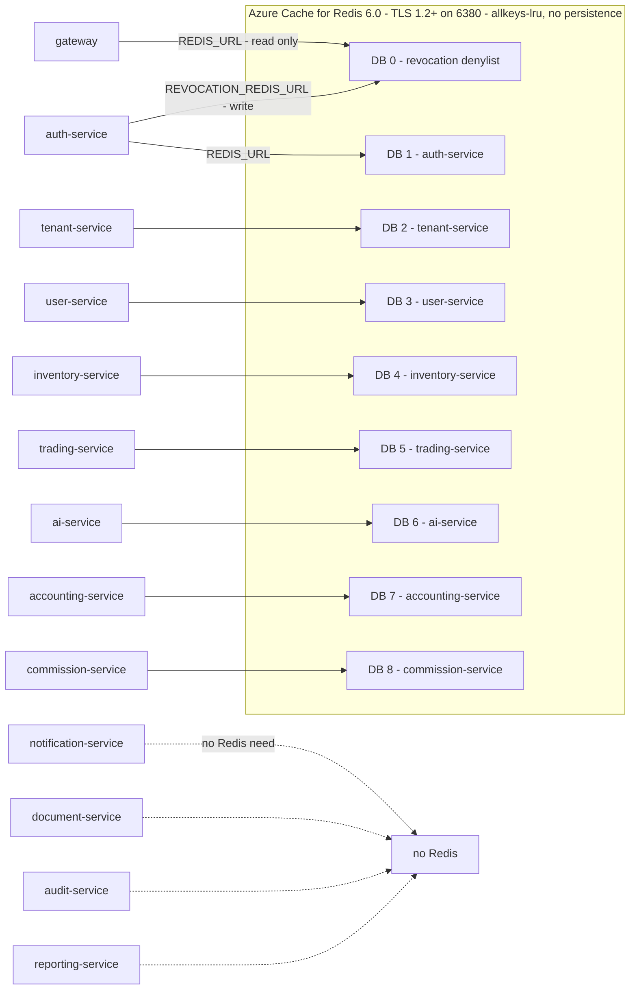
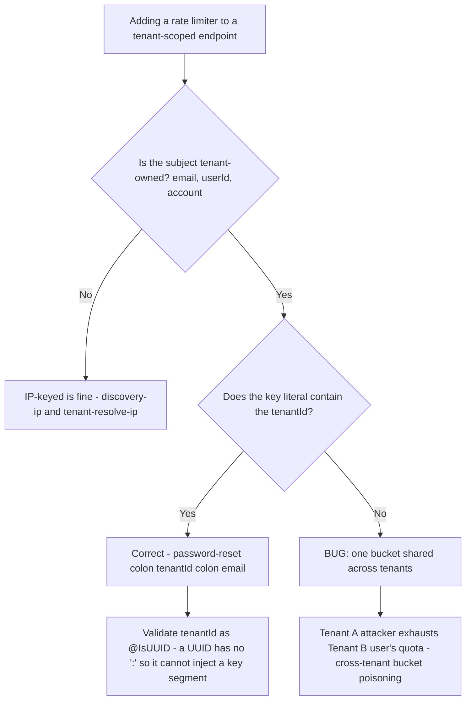
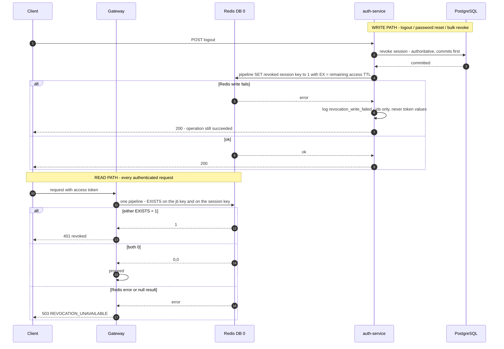
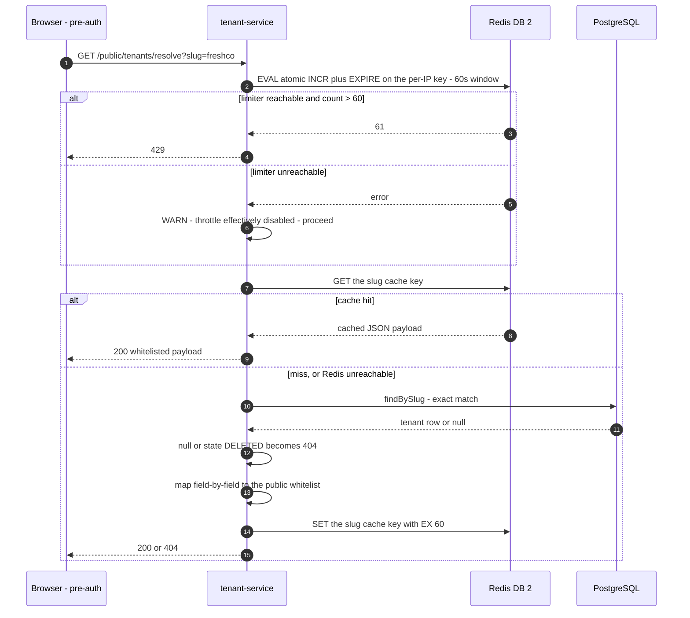
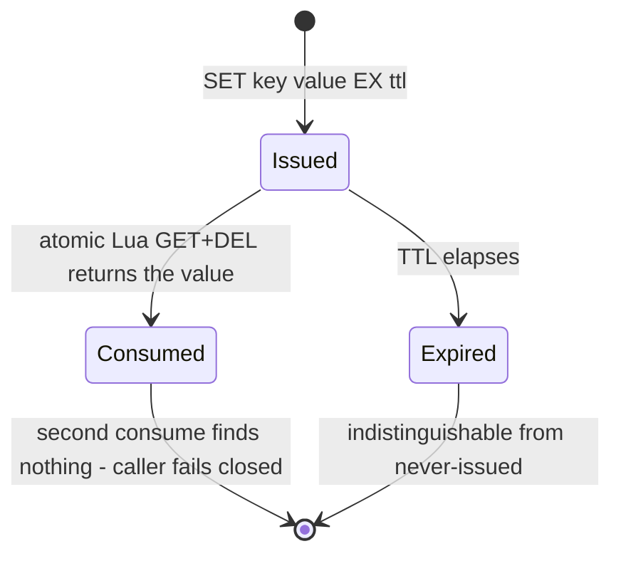

# Backend Caching — Redis Topology, Keys, TTLs and Failure Semantics

What this covers: every way the Acme Platform services use Redis — pre-auth tenant resolution,
the JWT/session revocation denylist, single-use MFA / password-reset / OIDC-state / SSO-handoff
tokens, per-tenant config caching and rate-limit counters. The through-line is that **Redis is
cache-only**: PostgreSQL is the source of truth for every fact stored here, and each call site has
an explicit, deliberate answer to "what happens when Redis is down" — fail-**open** for
availability-shaped caches, fail-**closed** for the security-shaped denylist. The second
through-line is key design: in a multi-tenant system a counter key without a `tenantId` is a
cross-tenant griefing vector.

---

## 1. Topology — one managed instance, one logical DB per service

There is no per-service Redis deployment today. Every Redis-using service shares one Azure Cache
for Redis instance and is separated by **logical DB index**, composed in Terraform as
`rediss://:<KEY>@<host>:6380/<db-index>` and delivered to the pod as a Key Vault secret projected
by External Secrets Operator.



Takeaways:

1. **DB 0 is a shared contract, not a private store.** auth-service _writes_ the revocation
   denylist there through a dedicated `REVOCATION_REDIS_URL`; the gateway _reads_ the same keys
   through its own `REDIS_URL`. The key shapes come exclusively from helpers exported by
   `@acme/platform-contracts` (`revokedJtiKey`, `revokedSessionKey`) so the two sides cannot drift.
2. **`REVOCATION_REDIS_URL` fails closed in production.** The config schema rejects the localhost
   dev default (and any `localhost`/`127.0.0.1` host) in production and staging — a pod that
   silently fell back to a local Redis would write revocations the gateway never reads, so a
   revoked token would keep working. Dev and test keep the default.
3. **Four services declare no Redis need at all** (notification, document, audit, reporting).
   Their Terraform catalogue entries carry `redis_db = null` and no `REDIS_URL` is projected.
4. **Every connection is `lazyConnect`.** Nest bootstrap must not hard-fail on a brief Redis blip;
   the first command connects. The gateway additionally does an eager `connect()` + `ping()` in
   `onModuleInit` (logged, never rethrown) so the first authenticated request does not pay a
   cold-start connect, and `quit()`s on `onModuleDestroy` with a `disconnect()` fallback for the
   never-opened case.
5. **Per-BC in-cluster Redis is designed but inert.** ADR-0037 Amendment 5 (_F11 — per-BC Redis
   Sentinel Helm values_) authors Sentinel values for five namespaces with ESO wiring and a
   NetworkPolicy locking 6379 to the owning namespace, but no ArgoCD Application syncs
   `charts/infrastructure/`, so nothing is deployed. The current reality is one shared managed
   instance.

---

## 2. Key namespaces

Keys are composed at the call site and passed to the adapters verbatim; the adapters do not add
prefixes. Verified key shapes:

```
── Revocation denylist (DB 0, shared contract) ───────────────────────────────
revoked:jti:{jti}                          value '1'   presence marker only
revoked:session:{sessionId}                value '1'

── auth-service (DB 1) ───────────────────────────────────────────────────────
mfa:challenge:{token}                      JSON        single-use, Lua GET+DEL
mfa:totp-used:{...}                        marker      TOTP replay guard
password-reset:{tokenHash}                 JSON        single-use, Lua GET+DEL
password-reset:{tenantId}:{email}          counter     rate limit  <-- tenant-scoped
discovery-ip:{ipAddress}                   counter     rate limit
discovery:{email}                          counter     rate limit
handoff:{code}                             JSON        one-time SSO handoff, Lua GET+DEL
<oidc state/PKCE key>                      JSON        single-use, Lua GET+DEL

── tenant-service (DB 2) ─────────────────────────────────────────────────────
tenant-resolve:slug:{slug}                 JSON        pre-auth resolve cache
tenant-resolve:domain:{host}               JSON        pre-auth resolve cache
tenant-resolve-ip:{ip}                     counter     rate limit

── trading-service (DB 5) ────────────────────────────────────────────────────
trading:tenant-config:{tenantId}           JSON        partner-mode config cache
```

Design rules the shapes encode:

- **Namespace prefix per concern.** `trading:tenant-config:` carries an explicit service prefix so
  the config cache can never collide with another store sharing a DB index.
- **Slug and domain are namespaced separately** in `tenant-resolve:{kind}:{identifier}`, so a
  custom domain that happens to equal another tenant's slug can never alias into the wrong cache
  entry.
- **Token-keyed entries are keyed by the _hash_, never the token** (`password-reset:{tokenHash}`).
- **Presence markers store `'1'`**, because the read path only ever does `EXISTS`.

---

## 3. The tenant-scoping invariant for counters



Takeaways:

1. **A per-user throttle on a multi-tenant endpoint must include the resolved `tenantId`.**
   Password reset was originally keyed `password-reset:{email}`; the same email registered in two
   tenants shared one bucket, so an attacker in tenant A could lock out a user in tenant B. The
   fix keys it `password-reset:{tenantId}:{email.toLowerCase()}`. Login was already scoped by
   `(tenantId, email)` — that is the shape to copy for any new limiter (MFA verify, OTP resend).
2. **`@IsUUID()` on the DTO field is part of the defence.** A UUID contains no `:`, so it cannot
   inject a key segment, collide with a neighbouring namespace, or blow up key cardinality.
3. **Token-store keys are a different namespace and must be left alone.**
   `password-reset:{tokenHash}` is a single-use `GET+DEL` entry keyed by a hash; adding a tenant id
   there would break the lookup, which by construction has only the token.
4. **The accepted trade-off is explicit:** an email registered in N tenants gets N × the hourly
   quota to one inbox. That is correct behaviour, and preferable to cross-tenant griefing.
5. Pre-auth endpoints are keyed by IP by definition — there is no authenticated tenant yet. The
   public tenant-resolve limiter uses `tenant-resolve-ip:{ip}` at 60 requests / 60 s.

---

## 4. Counter atomicity and the Redis 6.0 command ceiling

Two portability constraints shape every adapter:

**(a) No `GETDEL`.** Azure Cache for Redis is on **6.0**; `GETDEL` arrived in 6.2. Shipping it
503'd MFA verify, password reset and OIDC login on the dev environment. Every atomic
read-and-delete therefore runs the same Lua script, which needs only `EVAL` (Redis 2.6+):

```lua
local v = redis.call('GET', KEYS[1]); if v then redis.call('DEL', KEYS[1]) end; return v
```

One round-trip, atomic server-side, version-independent. It backs MFA challenge consumption,
password-reset token consumption, OIDC `state`/PKCE consumption, SSO handoff-code consumption and
tenant-config cache invalidation. Test environments must pin `redis:6.0` or the ceiling is not
actually exercised.

**(b) `INCR` + `EXPIRE` must not be two calls.** The naive form can crash between the two commands
and leave a TTL-less counter permanently over the limit — a wedged bucket that never recovers.
The tenant-service limiter runs it as one atomic Lua script:

```lua
local c = redis.call('INCR', KEYS[1]); if c == 1 then redis.call('EXPIRE', KEYS[1], ARGV[1]) end; return c
```

`EXPIRE` fires only on the first hit, so the window is **fixed, not sliding**. The auth-service
`RedisRateLimitStore` still uses the two-call `INCR` then conditional `EXPIRE` form — same
semantics, without the crash-window guarantee.

---

## 5. Revocation: fail-open write, fail-closed read



Takeaways:

1. **The write is deliberately non-fatal.** PostgreSQL has already committed and is the source of
   truth; failing a logout because of a Redis blip would be wrong. The failure is _observable_ —
   a structured `revocation_write_failed` security event carrying ids and the error message only,
   never token values. The residual risk is documented: the gateway keeps accepting that token
   until its natural 15-minute expiry.
2. **The read is deliberately fail-closed.** `isRevoked` propagates any pipeline error, `exec()`
   rejection, or null result; the JWT guard maps a throw to `503 REVOCATION_UNAVAILABLE`.
   Swallowing the error and returning `false` would let revoked tokens through during exactly the
   outage where that matters most.
3. **One round-trip checks both keys.** A single pipeline does `EXISTS revoked:jti:{jti}` and
   `EXISTS revoked:session:{sid}`; either hit means revoked. Session-level revocation is what
   every live flow actually writes — `revokeJti` exists as a forward surface for per-token replay
   detection but has no production call site today.
4. **Partial pipeline failures are inspected, not assumed.** `pipeline.exec()` can _resolve_ while
   individual commands carry per-command errors (OOM, wrong-DB permission). The bulk write zips
   the result tuples with the session ids so a partial denylist failure is reported with the exact
   ids that did not land.
5. **TTL = remaining access-token life** (default 900 s / 15 min, matching `JWT_ACCESS_TOKEN_TTL`),
   so entries self-expire exactly when the token would have died anyway. The denylist never grows
   unboundedly and needs no sweeper.

**Operational consequence of the current SKU:** the dev cache has no replication, so a Redis
restart drops the whole denylist and every revoked-but-unexpired token becomes valid again for up
to 15 minutes. That is an accepted dev-only risk; production requires a replicated tier.

---

## 6. Tenant resolution: fail-open, loudly

The pre-auth resolve endpoint is the sign-in branding path — it runs before any authentication, so
an outage here must degrade, not 503.



Takeaways:

1. **Fail open on the cache and on the limiter, never on the restriction.** A Redis outage
   degrades to a direct repository read. Only a _reachable_ limiter reporting an over-limit count
   throws 429.
2. **Never fail open silently.** While Redis is down the pre-auth workspace-guessing throttle is
   effectively disabled, and the warn log is the only server-side signal that it happened. The
   warn logs the error message only — never the key, which embeds the caller IP.
3. **60-second TTL is the invalidation backstop.** Tenant suspend/update calls `del` on the
   affected keys best-effort; the short TTL bounds staleness if that delete is lost. Both the slug
   and domain keys are invalidated together.
4. **The cached payload is a whitelist built field-by-field from getters, never a spread of the
   entity.** A suspended tenant's suspension reason, integration credentials and feature flags can
   never reach an anonymous caller — and, just as importantly, can never be _cached_ into a
   pre-auth-readable key.
5. **The domain path never falls through to a slug lookup.** Exact host matching is the whole
   point: `sub.trading.partner.example` must not resolve `trading.partner.example`. Hosts are
   lowercased before both the key and the lookup, since DNS is case-insensitive.

The trading-service partner-config cache follows the same shape with a longer TTL: read-through on
miss, and on **any** Redis error the source result is still returned and logged as a warning —
a cache blip must never silently disable partner trading restrictions.

---

## 7. Single-use token lifecycles



| Store                                               | TTL                                                | Fail mode on miss                   |
| --------------------------------------------------- | -------------------------------------------------- | ----------------------------------- |
| MFA challenge (`mfa:challenge:{token}`)             | 300 s                                              | challenge invalid — re-authenticate |
| Password-reset token (`password-reset:{tokenHash}`) | 3600 s                                             | generic "link invalid or expired"   |
| OIDC `state` / PKCE                                 | 600 s                                              | callback rejected                   |
| SSO handoff code (`handoff:{code}`)                 | 60 s                                               | exchange fails closed               |
| Revocation entry                                    | = remaining access-token TTL (900 s default)       | entry gone ⇒ token treated as valid |
| Tenant resolve payload                              | 60 s                                               | falls through to PostgreSQL         |
| Rate-limit windows                                  | 3600 s (password reset), 60 s (resolve, discovery) | limiter fails open                  |

Single-use is enforced **by construction**, not by a flag: consumption is an atomic
`GET`-then-`DEL`, so a second consume finds nothing and cannot be raced. Miss and
never-issued are deliberately indistinguishable, which is also what keeps these endpoints free of
enumeration oracles. The OIDC store additionally exposes a non-destructive `get` used only for
audit attribution.

---

## 8. What is _not_ in Redis

Verified gaps worth stating plainly, because the infrastructure documentation implies otherwise:

- **Gateway rate limiting is in-memory, not Redis.** `RateLimitGuard` uses `SlidingWindowCounter`,
  a per-pod `Map` of timestamps with a periodic sweep, across three tiers (per-user 1 000/min,
  per-tenant 10 000/min, per-endpoint 100/min). Limits are therefore **per replica** and reset on
  restart; the effective cluster-wide limit is `limit × replicas`. The infrastructure doc's table
  listing `rate:{ip}:{endpoint}` in Redis describes an intended design, not the shipped code.
- **The `tenant:{slug}` / `jti:{tokenId}` / `mfa:{challengeId}` key patterns in that same table do
  not match the code.** The shipped shapes are `tenant-resolve:{kind}:{identifier}`,
  `revoked:jti:{jti}` / `revoked:session:{sessionId}` and `mfa:challenge:{token}`. Treat this
  document's §2 as the accurate list.
- **Commission report caching is not wired.** The module has a placeholder comment and the config
  schema reserves the variables, but no cache provider is registered.
- **No durable state ever lives in Redis.** ADR-0017 makes it cache-only, which is exactly why
  ADR-0072 puts the inbox, idempotency keys and parked messages in PostgreSQL tables rather than
  in Redis — dedup and idempotency must be transactional with the state change they guard.
- **`TenantGuard`'s `TenantCache` port (60 s TTL) is Redis-backed by design** but is an interface
  in `@acme/mikro-orm` with an in-memory implementation in tests; the always-on default path in
  most services is the lighter `TenantFilterInterceptor`, which needs no cache at all.

---

## 9. Failure-mode summary

| Store                        | Redis down                  | Rationale                                               |
| ---------------------------- | --------------------------- | ------------------------------------------------------- |
| Revocation read (gateway)    | **503 fail-closed**         | a revoked token must never be accepted during an outage |
| Revocation write (auth)      | **succeed + log**           | PostgreSQL already committed; do not fail a logout      |
| Tenant resolve cache         | **fail open to PostgreSQL** | pre-auth branding must not 503                          |
| Tenant resolve limiter       | **fail open + WARN**        | availability wins; the warn is the only signal          |
| Partner-config cache         | **fail open to source**     | never silently drop trading restrictions                |
| MFA / reset / OIDC / handoff | **operation fails**         | these _are_ the security state; there is no fallback    |
| Gateway rate limit           | unaffected                  | in-memory, per pod                                      |

---

## 10. Deciding ADRs

| ADR         | Title                                              | Relevance                                                  |
| ----------- | -------------------------------------------------- | ---------------------------------------------------------- |
| ADR-0017    | RabbitMQ unified messaging, Redis cache-only       | the constraint that shapes every entry above               |
| ADR-0029    | SUPERADMIN platform-scope auth                     | why cross-tenant access is a scope flag, not a null tenant |
| ADR-0037 A5 | F11 — per-BC Redis Sentinel Helm values            | designed per-BC topology; inert, not deployed              |
| ADR-0053    | Identity JWT RS256 + JWKS                          | token shape whose `jti` / `sid` claims key the denylist    |
| ADR-0066    | Hostname-based tenant resolution                   | what the resolve cache serves                              |
| ADR-0067    | SSO session handoff via one-time code              | the 60 s `handoff:{code}` store                            |
| ADR-0069    | Pre-auth tenant slug resolution                    | the public resolve contract and its rate limits            |
| ADR-0072    | Inbox / idempotency-key / parked-message PG tables | why dedup state is _not_ in Redis                          |
