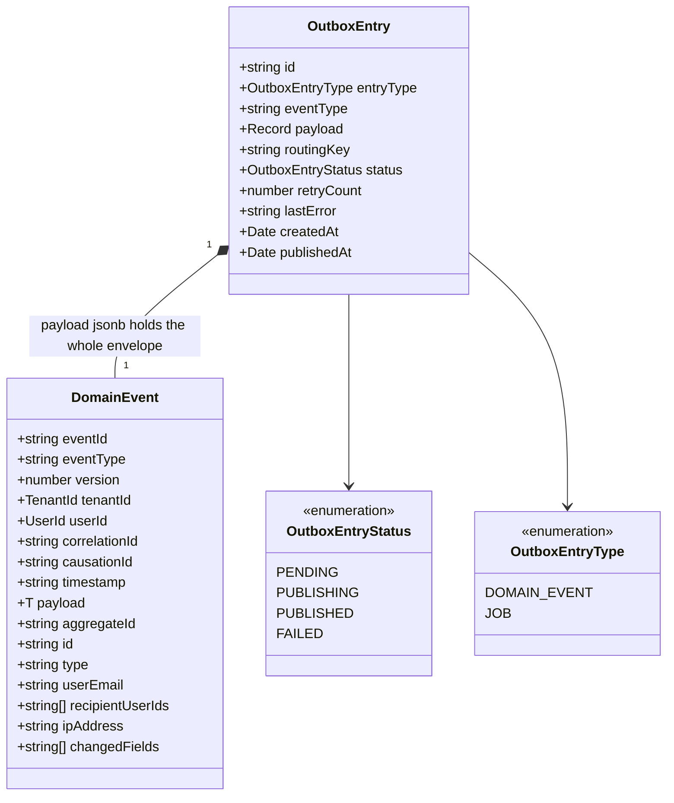
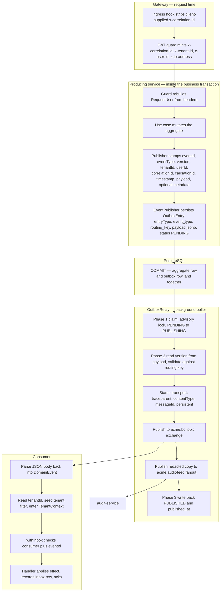
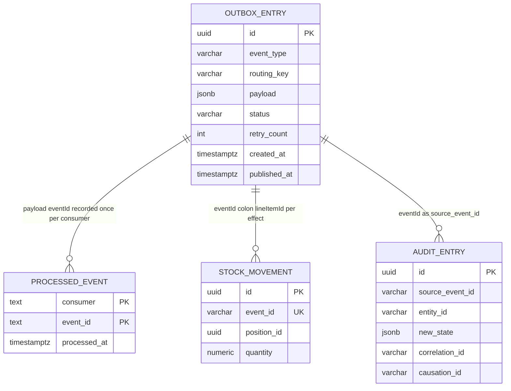
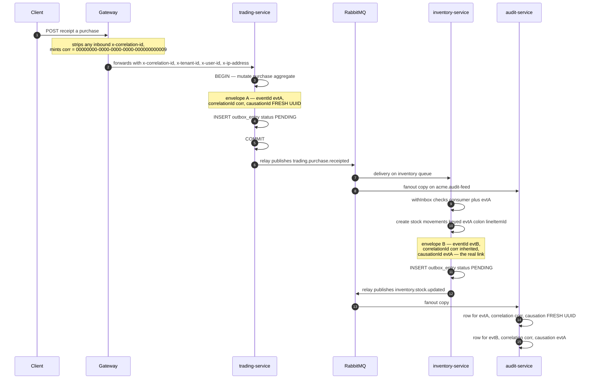

# Event Anatomy — the envelope, field by field

This document dissects the exact bytes that move between Acme Platform services: which
fields the `DomainEvent<T>` envelope really declares, which component writes each one and
at what moment, which component reads it, and — the part that matters when something goes
wrong — what concretely breaks when a field is missing or wrong. It is written for
engineers adding a producer or consumer, and for anyone debugging a message that arrived
but did not do what it should have. It goes below
[`platform/event-catalog.md`](../../platform/event-catalog.md), which describes the
taxonomy and routing grammar; here we stay inside a single message.

Everything below was read off the shipped source. Where a design document (ADR, code
comment, or JSDoc) disagrees with the code, both are stated and the disagreement is
labelled. Several of the disagreements are load-bearing.

---

## 1. Two records, not one

Newcomers reasonably assume there is one thing called "the event". There are two, and
conflating them is the source of several real bugs in this codebase.

The **envelope** is `DomainEvent<T>`, a plain TypeScript interface in
`libs/platform/event-contracts/src/index.ts`. It is the published language of the platform
— the DDD contract that crosses bounded-context boundaries — and it depends on nothing but
the shared kernel (`@acme/domain-primitives`), so no bounded context can drag its internals
into a contract.

The **outbox row** is `OutboxEntry`, a MikroORM entity in
`libs/platform/event-bus/src/lib/outbox-entry.entity.ts`, stored in
`platform_outbox.outbox_entry`. It is transport bookkeeping: status, retry budget, last
error, timestamps. It carries the entire envelope, serialized, in a single `jsonb` column.



**What the diagram shows.** The envelope is nested wholly inside the row. `EventPublisher.publish`
does exactly this, and nothing else:

```ts
const entry = new OutboxEntry();
entry.entryType = OutboxEntryType.DOMAIN_EVENT;
entry.eventType = event.eventType;
entry.payload = event as unknown as Record<string, unknown>;
entry.routingKey = event.eventType;
entry.status = OutboxEntryStatus.PENDING;
em.persist(entry);
```

Note the consequences of that five-line body, because they recur throughout this document:

1. **`eventType` is stored three times** — as the row's `event_type` column, as the row's
   `routing_key` column, and inside the serialized envelope as `payload->>'eventType'`. The
   relay reads the routing key from the column but the version from the envelope, so the
   two can drift. Section 3.3 shows a shipped case where they do.
2. **The row id is not the event id.** `OutboxEntry.id` defaults to a fresh UUID v7 per
   row; `DomainEvent.eventId` is supplied by the caller. If an entry is ever re-created
   (replay tooling, a manual recovery insert), the row id changes but the domain event id
   must not. The prototype work on a relay-side dedup table recorded this explicitly: the
   dedup key must be extracted as `payload->>'eventId'`, never `outbox_entry.id`, because
   "a re-queued entry gets a new row id but the SAME domain `eventId`".
3. **The publisher never touches AMQP.** Atomicity with the business write is the entire
   point of the outbox ADR; the publish is somebody else's problem, deliberately.

The physical row, from the migration that creates it:

```sql
CREATE TABLE IF NOT EXISTS "platform_outbox"."outbox_entry" (
  "id"            uuid          NOT NULL DEFAULT gen_random_uuid(),
  "entry_type"    varchar(20)   NOT NULL,
  "event_type"    varchar(255)  NOT NULL,
  "payload"       jsonb         NOT NULL,
  "routing_key"   varchar(255)  NOT NULL,
  "status"        varchar(20)   NOT NULL DEFAULT 'PENDING',
  "retry_count"   int           NOT NULL DEFAULT 0,
  "last_error"    text          NULL,
  "created_at"    timestamptz   NOT NULL DEFAULT now(),
  "published_at"  timestamptz   NULL,
  CONSTRAINT "platform_outbox_outbox_entry_pkey" PRIMARY KEY ("id")
);
CREATE INDEX IF NOT EXISTS "idx_outbox_pending"
  ON "platform_outbox"."outbox_entry" ("status", "created_at");
```

Two design decisions are visible in that DDL. `status` is a bare `varchar(20)` with **no
CHECK constraint**, deliberately — the entity comment states that new statuses can be added
at the TypeScript level without a migration. And there is **no `tenant_id` column**: the
outbox is a platform-level infrastructure table, exempt from the global tenant filter and
from row-level security. That exemption is what forces every relay and reaper query to
carry `{ filters: { tenant: false } }`, which section 3.4 returns to.

The `platform_outbox` schema is shared. `@Entity({ schema: 'platform_outbox' })` is an
_explicit_ entity schema, which in MikroORM outranks the per-service `schema` config, so a
service configured for `schema: 'trading'` still reads and writes
`platform_outbox.outbox_entry`. The bootstrap job creates the schema once, owned by a group
role every service role joins. Three services each ship an idempotent
`CREATE TABLE IF NOT EXISTS` migration for the same table; whichever runs first wins.

---

## 2. The declared field set

This is the interface verbatim from `libs/platform/event-contracts/src/index.ts`, with the
comments as written:

```ts
export interface DomainEvent<T = unknown> {
  readonly eventId: string; // UUID v7 (time-ordered)
  readonly eventType: string; // e.g. 'trading.deal.locked'
  readonly version: number; // schema version for evolution
  readonly tenantId: TenantId;
  readonly userId: UserId;
  readonly correlationId: string;
  readonly causationId: string; // the event that caused this
  readonly timestamp: string; // ISO 8601
  readonly payload: T;
  readonly aggregateId?: string; // Aggregate root ID for the entity that emitted this event

  // Convenience aliases populated by outbox relay serialization — consumers may use either form
  readonly id?: string;
  readonly type?: string;

  // Optional audit/notification metadata (backward compatible — added M5)
  readonly userEmail?: string;
  readonly recipientUserIds?: string[];
  readonly ipAddress?: string;
  readonly changedFields?: string[];
}
```

Sixteen declared fields: nine required, seven optional. `TenantId` and `UserId` are branded
string aliases from the shared kernel —
`export type TenantId = string & { readonly __brand: 'TenantId' }` — so they are compile-time
distinct but runtime-identical to `string`. Nothing validates them at runtime; every
producer reaches them by cast (`tenantId as TenantId`).

| Field              | Type        | Req. | Stamped by                                      | Read by                                                                   |
| ------------------ | ----------- | ---- | ----------------------------------------------- | ------------------------------------------------------------------------- |
| `eventId`          | `string`    | yes  | producer, `uuid.v7()` (auth-service uses v4)    | consumer inbox PK, per-effect idempotency keys, audit `source_event_id`   |
| `eventType`        | `string`    | yes  | producer, literal                               | relay exchange derivation, consumer dispatch switch, audit action mapping |
| `version`          | `number`    | yes  | producer, literal                               | relay routing-key validation, `@EventHandler` binding derivation          |
| `tenantId`         | `TenantId`  | yes  | producer                                        | consumer tenant filter params, `TenantContext.run`, audit row             |
| `userId`           | `UserId`    | yes  | producer, or the literal `'system'`             | audit row `user_id`                                                       |
| `correlationId`    | `string`    | yes  | producer, from request context or a business id | audit row, log join key, downstream envelope inheritance                  |
| `causationId`      | `string`    | yes  | producer                                        | audit row; only inventory-service uses it as a real parent pointer        |
| `timestamp`        | `string`    | yes  | producer, `new Date().toISOString()`            | audit row `timestamp`                                                     |
| `payload`          | `T`         | yes  | producer                                        | every handler                                                             |
| `aggregateId`      | `string?`   | no   | **one** producer in the whole codebase          | five consumer sites, three of them with a non-null assertion              |
| `id`, `type`       | `string?`   | no   | **nobody**                                      | nobody                                                                    |
| `userEmail`        | `string?`   | no   | trading-service only, from request context      | audit row                                                                 |
| `recipientUserIds` | `string[]?` | no   | trading-service only                            | notification routing                                                      |
| `ipAddress`        | `string?`   | no   | trading, inventory, auth                        | audit row                                                                 |
| `changedFields`    | `string[]?` | no   | trading, inventory, accounting, commission      | audit row                                                                 |

Across `apps/platform/*/src`, excluding tests, there are **18 literal envelope construction
sites in 16 files**. Seventeen of them write `version: 1`; exactly one writes `version: 2`.

---

## 3. Field by field

### 3.1 `eventId`

**Declared** `readonly eventId: string`, documented as UUID v7. **Written** by the producer,
never by the infrastructure — the relay does not generate one and will happily publish an
entry whose envelope has no `eventId` at all.

The v7 choice is not cosmetic. UUID v7 embeds a millisecond timestamp in its high bits, so
ids sort in emission order. That makes the inbox primary key `(consumer, event_id)` insert
in near-append order rather than scattering across the B-tree, and it makes a raw
`ORDER BY event_id` on a dedup ledger a usable proxy for "in what order did this consumer
see things". Ten of the eleven producers use `v7` from the `uuid` package. `auth-service`'s
`AuthEventPublisher` uses `v4 as uuidv4` instead, so identity events lose the ordering
property. Nothing depends on it today, but the divergence is real and undocumented.

**Read** by three independent mechanisms, which section 6 treats as a unit:

- The consumer inbox: `processed_event` has the composite primary key `(consumer, event_id)`,
  and `event_id` is deliberately `text`, not `uuid` — the entity comment says so explicitly,
  because "event ids are opaque strings (e.g. `evt-200`), not guaranteed UUIDs — a uuid
  column would reject non-UUID ids and break dedup".
- Per-effect idempotency: inventory's `stock_movement.event_id` is `varchar(255)` under a
  unique index `ix_movement_event`, populated with the composite
  `` `${event.eventId}:${lineItem.lineItemId}` `` so one event can produce one movement per
  line item and no more.
- Audit: `audit_entry.source_event_id`.

**What breaks if it is absent or wrong.** Absent, the inbox insert writes a `null` primary
key component and fails; the consumer nacks and the message dead-letters. Duplicated across
two genuinely different state changes — the failure mode that matters most — the second
event is silently swallowed as a redelivery, `acme_inventory_consumer_redeliveries_total`
increments, the broker gets an ack, and no error surfaces anywhere. This is the single most
dangerous mistake a producer can make with the envelope, because it is invisible. The rule
is: a fresh `eventId` per emission, never reused, never derived from the aggregate id.

### 3.2 `eventType`

**Declared** `readonly eventType: string`. **Written** by the producer as a string literal.
The grammar is `{context}.{aggregate}.{action}` with the action in the past tense, and the
first dotted segment is load-bearing infrastructure, not documentation:

```ts
private deriveExchange(eventType: string): string {
  const dotIndex = eventType.indexOf('.');
  if (dotIndex <= 0) {
    throw new Error(`Invalid eventType format: '${eventType}' — expected 'bc.entity.action' pattern`);
  }
  return `acme.${eventType.substring(0, dotIndex)}`;
}
```

That function exists twice, once in `OutboxRelay` (publisher side) and once as
`deriveExchangeFromEventType` in `EventHandlerExplorer` (consumer side), with a comment in
the latter naming the former as the single source of truth. They agree today. They are not
mechanically kept in sync.

`eventType` is also the default routing key (`entry.routingKey = event.eventType`), the
default consumer queue name (`` `${exchange}.consumer.${eventType}` ``), the dispatch
discriminant in every consumer's `switch (event.eventType)`, the key into the audit
service's action map, and the key into the relay's audit-lane secret denylist.

**What breaks.** A single-segment `eventType` throws inside Phase 2 of the relay cycle,
which is caught per entry, so the entry burns a retry and eventually lands in `FAILED`
after five attempts. A _valid-looking but wrong_ prefix is worse: `deriveExchange` returns
a real exchange name the publishing service has no `write` permission on, the broker replies
`403 ACCESS_REFUSED`, and the entry retries into `FAILED` with that message in `last_error`.
On the consumer side an unmatched `eventType` falls through the dispatch switch — most
consumers log and ack, so the event is consumed and discarded.

There is also a compliance gate keyed on the prefix. `EventHandlerExplorer` refuses to wire
any `@EventHandler` whose `eventType` starts with `trading.`, `accounting.`, `commission.`
or `finance.`:

```ts
const FINANCIAL_PREFIXES = [
  "trading.",
  "accounting.",
  "commission.",
  "finance.",
] as const;
```

Those streams carry financial data, so ingestion by non-financial consumers is gated at the
prefix. The mechanism is worth copying and its hazard is worth knowing: the gate reads a
string prefix, so renaming an event across that boundary silently changes whether it can be
auto-wired at all — in either direction, with no error at the rename site.

### 3.3 `version`

**Declared** `readonly version: number`. **Written** by the producer. **Read** by the relay,
in `publishToChannel`, and only there:

```ts
const versionRaw = (entry.payload as { version?: unknown } | undefined)
  ?.version;
const version = this.resolveEntryVersion(versionRaw);
```

`resolveEntryVersion` returns `1` for `undefined`/`null` (backward compatibility with
producers predating the versioned-routing-key ADR), `null` for anything non-integer or
below 1, and the integer otherwise. A `null` result routes the entry to `{exchange}.dlx`
with reason `VERSION_BINDING_MISMATCH`. Otherwise the relay checks that the version agrees
with the
routing key's `\.v(\d+)$` suffix — absent suffix means "expect v1":

```ts
const suffixMatch = routingKey.match(/\.v(\d+)$/);
const expectedVersion = suffixMatch ? parseInt(suffixMatch[1], 10) : 1;
if (expectedVersion === eventVersion) return { valid: true };
```

**What breaks — and does, today.** `EventPublisher.publish` sets
`entry.routingKey = event.eventType`, with no version suffix, unconditionally. There is
exactly one producer emitting a version above 1:

```ts
// apps/platform/trading-service/src/modules/deal/lock-deal.use-case.ts
const event: DomainEvent<DealLockedEventPayloadV2> = {
  eventId: v7(),
  eventType: 'trading.deal.locked',
  version: 2,
  ...
};
```

Its routing key is therefore the bare `trading.deal.locked`, whose parsed expectation is
v1, against an envelope version of 2. `validateVersionRoutingKeyMatch` returns invalid, and
`dlxRoute` publishes a structured mismatch body to `acme.trading.dlx` with the original
payload preserved on the `x-acme-original-payload` header. The entry is then marked
`PUBLISHED` — the relay deliberately does not retry a structural fault. The retention DLQ is
bound to the DLX with the fixed key `dead-letter`, while `dlxRoute` publishes with
`routingKey = originalRoutingKey`, so the copy is not retained either. The WARN log is the
only forensic record.

The relay's own docstring says as much: "`<exchange>.dlx` is declared but has no bound DLQ
yet, so the published copy is not retained — the WARN log is the current forensic record."

To emit v2 correctly, either the producer must set the routing key explicitly to
`trading.deal.locked.v2` (which `EventPublisher` gives it no way to do) or `EventPublisher`
must derive the routing key via `buildVersionedRoutingKey(eventType, version)`. Neither is
implemented. `buildVersionedRoutingKey` exists and is correct; it is called from
`publishToBoth` and from the consumer-side `deriveConsumerWiring`, but never from the write
path.

`DealLockedEventPayloadV2` — the payload type that adds `idempotencyKey` — is declared,
exported from the contracts library, and consumed by exactly one producer, the one above.
No consumer binds `trading.deal.locked.v2`.

### 3.4 `tenantId`

**Declared** `readonly tenantId: TenantId`, required. **Written** by the producer.
**Read** by every consumer as the key that unlocks the data layer.

The data layer is fail-closed. The global MikroORM `tenant` filter is registered with
`default: true`, so it applies to _every_ entity query unless explicitly disabled, and its
condition function throws rather than returning an empty predicate:

```ts
if (args?.platformScope === true) return {};
if (args?.tenantId) return { tenantId: args.tenantId };
throw new Error(
  `MikroORM 'tenant' filter is active but no tenant context was provided. ...`
);
```

An empty-string tenant id is falsy and falls through to the throw — `WHERE tenant_id = ''`
is never a valid scope. That is why consumers seed the filter from the envelope before
dispatching, and why the outbox relay and reaper must pass `{ filters: { tenant: false } }`
on their `find` _and_ their `nativeUpdate` (MikroORM v6 applies registered filters to both).
Omitting it on the write-back would leave every entry stuck in `PUBLISHING` forever.

The consumer-side read of `tenantId` has a wrinkle worth knowing:

```ts
const tenantId =
  (event.payload?.tenantId as string | undefined) ?? event.tenantId;
```

Both the inventory trading consumer and the notification consumer **prefer the payload's
`tenantId` over the envelope's**. Most payload types redundantly carry `tenantId`, so in
practice they agree; if they ever disagreed, the payload silently wins. Nothing asserts they
match.

**What breaks if it is absent.** The consumer logs
`Event <id> missing tenantId — rejecting to DLX` and nacks without requeue. The message
dead-letters and the state change never happens. There is one sanctioned exception:
platform-scoped event types, currently just `identity.workspace.discovery-requested`, which
legitimately have no tenant because the requesting email may belong to no workspace at all.
Those carry a nil-UUID sentinel tenant, are listed in a `PLATFORM_EVENT_TYPES` set, run with
the tenant filter left unseeded, and are exempt from the nack.

**What breaks if it is wrong.** Nothing throws. The consumer scopes its reads and writes to
whatever tenant the envelope names, and the RLS `SET LOCAL app.tenant_id` emitted by the
transaction subscriber follows suit. A wrong `tenantId` is a silent cross-tenant write. The
envelope field is trusted absolutely; there is no equivalent of the gateway's header-strip
hook on the message path.

### 3.5 `userId`

**Declared** `readonly userId: UserId`, required. **Written** by the producer from request
context where one exists, and by the literal string `'system'` where none does — background
workers, cron-driven purges, the invoice generator. `'system'` is not a UUID, so any
consumer that assumes a parseable UUID here is wrong.

**Read** by the audit service into `audit_entry.user_id`, where it is nullable
(`userId: event.userId ?? null`). Nothing authorises on it — the envelope's `userId` is
provenance, not permission. Authorisation happened at the gateway before the command that
produced the event.

**What breaks.** Practically nothing at runtime; the audit trail loses its actor. That is
the whole cost, and for a financial system of record it is not nothing.

### 3.6 `correlationId`

**Declared** `readonly correlationId: string`, required. This is where the codebase is
least consistent, so it is worth being precise about where the value originates.

At the edge, the gateway is the sole authority on correlation identity. The ingress hook
strips any client-supplied `x-correlation-id` (it is in `GATEWAY_INJECTED_HEADERS` alongside
`x-tenant-id`, `x-user-id`, `x-permissions`, `x-platform-scope` and friends), and the JWT
guard then mints a fresh one unconditionally:

```ts
// Always mint a fresh correlation id — never trust an inbound value, even
// a survivor of the strip hook.
rawRequest.headers["x-correlation-id"] = randomUUID();
```

Downstream, `GatewayIdentityGuard` reads it back into `RequestUser.correlationId`, defaulting
to the empty string when the header is absent. From there each service does something
different:

| Producer                                     | `correlationId` set to                                                            |
| -------------------------------------------- | --------------------------------------------------------------------------------- |
| `TradingEventPublisher`                      | request `correlationId`, else a fresh `v7()`                                      |
| `LockDealUseCase`                            | request `correlationId`, else a fresh `v7()`                                      |
| `InventoryEventPublisher`                    | the **source event's** `correlationId`, else a fresh `v7()`                       |
| `UserEventPublisher`, `TenantEventPublisher` | a `correlationId` passed in by the caller                                         |
| `AuthEventPublisher`                         | a fresh `uuidv4()` per event, with a `TODO(M2)` to propagate from request context |
| accounting invoice use-cases                 | `invoice.dealId ?? invoice.id` — a **business identifier**                        |
| commission calculation                       | `dealId` — a business identifier                                                  |
| document generation worker                   | `doc.dealId ?? doc.id` — a business identifier                                    |

So `correlationId` means "the request that started this" in trading and inventory, "nothing,
sorry" in auth, and "the deal this is about" in accounting, commission and document. A
single trace joined on `correlationId` will connect an invoice to its deal but will not
connect either back to the HTTP request that triggered the lock.

**Read** by the audit service into `audit_entry.correlation_id`, and inherited by
`InventoryEventPublisher` when it emits a downstream event.

**What breaks.** Nothing throws. You lose the ability to answer "what else happened because
of this request", which is exactly the question you want to ask during an incident.

### 3.7 `causationId`

**Declared** `readonly causationId: string`, commented "the event that caused this". Only
one producer implements that meaning:

```ts
// InventoryEventPublisher
correlationId: sourceEvent?.correlationId ?? v7(),
causationId:   sourceEvent?.eventId ?? v7(),
```

Inventory threads the inbound event through as `sourceEvent`, inherits its `correlationId`,
and points `causationId` at its `eventId`. That is the textbook chain, and it is real —
`purchase-receipted.handler.ts` passes
`{ correlationId: event.correlationId, eventId: event.eventId, userId: event.userId }` when
emitting `inventory.stock.updated`.

Everyone else does one of three other things:

- `UserEventPublisher`, `TenantEventPublisher`, `AuthEventPublisher`: `causationId = correlationId`.
  A self-referential pointer that carries no information.
- accounting and commission: `causationId = invoice.id` / `dealId` — an _aggregate_ id, not
  an event id. `LockDealUseCase` likewise sets `causationId: dealId`.
- `TradingEventPublisher`: `causationId: v7()` — a **freshly generated UUID that names
  nothing at all**. It is not the parent event, not the aggregate, not the request. It is
  noise that satisfies a required field.

`AuthEventPublisher` is at least honest about it, carrying an explicit TODO:

```ts
// TODO(M2): Propagate correlationId from request context ... instead of generating a new
// one per event. causationId should be the ID of the command/event that caused this event,
// not the same as correlationId.
```

**Read** by the audit service into `audit_entry.causation_id`. Nothing else reads it.

**What breaks.** Nothing throws, and that is precisely the problem: the field is required by
the type, so every producer fills it with _something_, and four of the eight fill it with
something meaningless. Causation graphs built from this data are wrong in ways that look
right. Section 7 draws the chain that does work and marks the links that do not.

### 3.8 `timestamp`

**Declared** `readonly timestamp: string`, ISO 8601. **Written** by every producer as
`new Date().toISOString()` at envelope construction — that is, inside the business
transaction, at the moment the outbox row is persisted, not at commit and not at publish.

**Read** by the audit service, which parses it back: `timestamp: new Date(event.timestamp)`.

**What breaks if it is absent or malformed.** `new Date(undefined)` yields `Invalid Date`,
and inserting that into a `timestamptz` column throws, so the audit consumer nacks and the
message dead-letters. Nothing validates the string before that point.

There is no `occurredAt`, no `publishedAt` and no `processedAt` **in the envelope**. Section
9 lays out where each of those three times actually lives, because they do exist — just not
on the wire.

### 3.9 `payload`

**Declared** `readonly payload: T`, where `T` defaults to `unknown` and is narrowed per
event type by the payload interfaces in
`libs/platform/event-contracts/src/lib/{trading,inventory,accounting,commission}-events.ts`.

The governing convention is stated at the top of the trading contracts file: _payloads are
enriched with names, not just ids, so consumers don't need to re-fetch reference data._
`TradingLineItemSnapshot` carries `productName` beside `productId`, `unitCode` beside
`unitId`, `currencyCode` beside `currencyId`. `DealLockedPurchaseSnapshot` carries
`supplierName` and `traderName`. The ADR on event-carried invoice line items extends this:
the `trading.line-item.finalised` payload carries the full invoice-relevant snapshot
including the FX rate snapshotted at confirmation, so accounting can build an invoice from
the event alone with no synchronous call back into trading.

That is a deliberate trade of message size for autonomy. `trading.deal.locked` is the
extreme case — a full snapshot of the deal with purchases, sales, haulages, overheads and
credit notes, each with their line items. It is also the reason the audit fanout is a
privacy surface: whatever is in the payload is persisted verbatim into
`audit_entry.new_state`.

That last point produced a real defect and a real fix. Two payloads carry raw bearer
tokens — `platform.user.invited` carries the invitation accept token so notification can
build the email link, and `identity.password.reset-requested` carries the reset token for the
same reason. The relay dual-publishes every payload byte-identically to the BC exchange
_and_ to `acme.audit-feed`, so those tokens landed unredacted, at rest, in the platform-wide
audit store. The fix is an off-by-default per-`eventType` denylist of dotted paths:

```ts
readonly auditSecretFields?: Readonly<Record<string, readonly string[]>>;
// e.g. { 'platform.user.invited': ['payload.token'] }
```

`buildAuditBuffer` deep-clones the envelope by JSON round-trip and deletes each declared
path — from the audit copy only; the BC lane still ships the untouched buffer, because the
legitimate consumer needs the token. A later hardening reuses the same denylist in
`scrubbedPublishedPayload`, so that when the entry flips to `PUBLISHED` the _stored_ jsonb is
rewritten without the token too. Both are no-ops when no path is configured for the event
type: `buildAuditBuffer` returns the original buffer by reference, and
`scrubbedPublishedPayload` returns `undefined` so the `SET` clause omits `payload` entirely.

**What breaks.** A payload shape change that is not additive, shipped without a version
bump, is deserialized by the old consumer as whatever it happens to be — TypeScript types
are erased at runtime and nothing validates the body. That is the failure the
versioned-routing-key ADR exists to prevent, and it is prevented only if producers actually
bump `version` and route to the suffixed key. See 3.3 for the state of that.

### 3.10 `aggregateId`

**Declared** `readonly aggregateId?: string`. Optional in the type. This field has the
sharpest producer/consumer mismatch in the envelope.

**Written** by exactly one producer in the entire codebase:

```ts
// apps/platform/accounting-service/.../open-month.use-case.ts
await this.eventPublisher.publish(txEm, {
  eventId: uuidV7(),
  eventType: 'accounting.accounting-month.opened',
  ...
  aggregateId: accountingMonth.id,
  payload,
});
```

**Read** at five production sites, three of which force it with a non-null assertion:

- `audit-event.consumer.ts`: `entityId: event.aggregateId!`
- `reporting-service` projection consumers for trading, accounting, inventory and commission:
  `{ _dealId: event.aggregateId!, tenantId: event.tenantId }` and equivalents
- `ai-service` signal consumers, which are the only readers that guard:
  `if (!event.aggregateId || !event.tenantId) { ... }` and drop the event with a structured log

The audit path is the consequential one. `AuditEntry.create` has no fallback
(`entry._entityId = params.entityId`), and the column is declared
`entity_id VARCHAR(255) NOT NULL` in both the entity and the migration. An event with no
`aggregateId` therefore produces an entry with an undefined required property, the flush
fails, `handleEvent` throws, and `setupRabbitConsumer`'s catch nacks the message without
requeue to `audit-service.events.dlx` and on to `audit-service.events.dlq`.

**Unverified:** only the code path was read; no live audit table was queried, so what
fraction of events actually dead-letters in a running environment is unknown. What is
verifiable is that the code has no guard, that seventeen of eighteen producers omit the
field, and that every fixture in `audit-event.consumer.spec.ts` supplies
`aggregateId: 'deal-123'` — so the unit suite never exercises the case that production
overwhelmingly produces.

**What breaks.** For audit, the entry is not written and the event dead-letters. For the
reporting projections, the non-null assertion means `undefined` flows into a `findOne`
predicate — matching nothing, or upserting a row keyed on `undefined`. For AI signal
ingestion, the event is explicitly dropped and logged, which is the only correct handling of
the three.

The right fix is either to make `aggregateId` required in the interface and backfill all
eighteen producers, or to make every consumer fall back to a payload id. Neither has
happened.

### 3.11 `id` and `type` — aliases that do not exist

**Declared** as optional, with the comment "Convenience aliases populated by outbox relay
serialization — consumers may use either form."

**This comment is false.** The relay's serialization is one line:

```ts
const buffer = Buffer.from(JSON.stringify(entry.payload));
```

It writes the stored envelope verbatim. Nothing anywhere in `libs/platform/event-bus` or in
any service assigns `id` or `type` on an envelope, and no consumer reads either. A consumer
that trusted the comment and read `event.id` would get `undefined` for every message on the
bus.

They are dead fields. They should be deleted from the interface; until they are, treat the
comment as a trap.

### 3.12 The optional audit and notification metadata

Four fields were added later and are documented as backward compatible. The contracts test
suite (`domain-event.spec.ts`) exists specifically to pin that: it asserts a base event
without any of them is valid, that each is accepted individually, that `userEmail` accepts
`null` (GDPR — the audit service prefers a lookup table over storing the address), that
`recipientUserIds` accepts an empty array, and that all four are `undefined` when omitted.

- **`userEmail?: string`** — notification routing only. Trading is the only producer that
  sets it, from `EventContext.userEmail`. Audit reads it into a nullable column but the
  field's own comment directs the audit service to use a lookup table instead, for GDPR
  erasure.
- **`recipientUserIds?: string[]`** — target users for notification. Only
  `LockDealUseCase` sets it, from the trader ids extracted off the deal, and only when the
  list is non-empty (`...(traderIds.length > 0 && { recipientUserIds: traderIds })`).
- **`ipAddress?: string`** — the client IP the gateway resolved from `x-forwarded-for`,
  falling back to the socket address, injected as `x-ip-address`. Trading and inventory
  thread it through their `EventContext`/`sourceEvent`; `AuthEventPublisher` sets it on
  login, logout and account-locked. Audit persists it.
- **`changedFields?: string[]`** — which fields this event changed, computed by the
  producer. `LockDealUseCase` writes `['status', 'lockedAt', 'lockedGrossProfit']`;
  inventory writes `['availableQuantity']` or `['reservedQuantity']`; commission writes
  `['status', 'amount', 'period']`. Audit persists it, nullable.

Every one of the four uses conditional spread at the construction site, so an absent value
means the key is absent from the JSON entirely rather than present-and-null. That matters
for the audit `?? null` reads, which cannot distinguish the two anyway.

---

## 4. Who stamps what, and when

The envelope is not assembled in one place. Four components contribute, at four different
moments, and only the first two touch the envelope itself — the rest wrap it.



**What the diagram shows, and the three things worth reading off it.**

_The envelope is frozen at commit._ Every envelope field is written in the `SVC` box, inside
the business transaction, before the aggregate is durable. Nothing downstream edits the
envelope — the relay adds transport metadata _around_ it and, when a secret denylist applies,
subtracts from a _copy_. The single exception is the post-publish
`scrubbedPublishedPayload` rewrite, which mutates the stored row after the message has
already left.

_The gateway owns correlation identity, but only for the first hop._ The ingress hook and
the JWT guard together guarantee a downstream service cannot be told what its correlation id
is by an external caller. What the platform does not have is a mechanism to carry that id
into an event chain — no AsyncLocalStorage correlation context, no automatic inheritance.
Each producer re-derives it, which is why section 3.6's table looks the way it does.

_The relay stamps nothing on the envelope._ This is deliberate and it is the reason
`eventId` must be producer-supplied. If the relay generated ids, a replayed row would get a
new one and every downstream inbox would treat the replay as a new event.

---

## 5. The transport layer — AMQP properties and headers

The relay publishes each entry twice, on two code paths, with different options. The
difference is not documented anywhere and it is observable at the broker.

**BC lane.** `publishToChannel` calls `publishToBoth`, passing its transport metadata as the
`headers` argument:

```ts
await this.withConfirmTimeout(
  publishToBoth(
    channel,
    exchange,
    entry.eventType,
    version,
    transitionVersion,
    buffer,
    { ...headers, contentType: "application/json", messageId: entry.id }
  ),
  contextLabel
);
```

`publishToBoth` then hands that whole object to amqplib as `headers`:

```ts
channel.publish(
  exchange,
  routingKey,
  payload,
  { persistent: true, headers },
  callback
);
```

So on the BC lane, `contentType` and `messageId` are **AMQP application headers**, not AMQP
basic properties. The `content-type` basic property still gets set, because the connection
wrapper merges its own defaults:

```ts
const publishOptions = {
  persistent: true,
  contentType: "application/json",
  ...options,
};
```

but `message-id` does not. It exists only as a header named `messageId`.

**Audit lane.** `publishOnce` builds an amqplib options object properly:

```ts
const auditOptions: Record<string, unknown> = {
  persistent: true,
  contentType: "application/json",
  messageId: entry.id,
  headers,
};
```

so on the fanout copy, `message-id` _is_ a basic property.

The net effect, per message:

| Transport slot                | BC lane                                                              | Audit lane                                                                     | Set from                      |
| ----------------------------- | -------------------------------------------------------------------- | ------------------------------------------------------------------------------ | ----------------------------- |
| `delivery-mode`               | 2 (persistent)                                                       | 2 (persistent)                                                                 | `persistent: true`            |
| `content-type`                | `application/json`                                                   | `application/json`                                                             | connection default / explicit |
| `message-id`                  | **not set**                                                          | `OutboxEntry.id`                                                               | —                             |
| header `messageId`            | `OutboxEntry.id`                                                     | absent                                                                         | relay                         |
| header `contentType`          | `application/json`                                                   | absent                                                                         | relay                         |
| header `traceparent`          | W3C context if OTel present                                          | same                                                                           | `injectTraceContext()`        |
| `correlation-id`              | **not set**                                                          | **not set**                                                                    | —                             |
| `app-id`, `type`, `timestamp` | **not set**                                                          | **not set**                                                                    | —                             |
| routing key                   | canonical `.vN` key, plus legacy base key during a transition window | the entry's stored `routingKey`, for traceability only — the fanout ignores it | relay                         |

Three practical consequences.

First, **the AMQP `message-id`, where it is set at all, is the outbox row id, not the
`eventId`**. A consumer that deduplicated on the broker's message id rather than on
`event.eventId` would break the moment a row was re-created for the same domain event. Every
consumer in this codebase correctly reads `event.eventId` out of the body; the trap is there
for the next one.

Second, **the envelope's `correlationId` is never mirrored into the AMQP `correlation-id`
property**. Broker-level tooling — the management UI, a shovel, a firehose tracer — cannot
see it. Correlation is a body-level concept here, full stop.

Third, **trace context is a header, and it is optional**. `injectTraceContext` resolves
`@opentelemetry/api` through a lazy `require` inside a try/catch and returns `{}` if the
package is unavailable, so the relay degrades to untraced publishing rather than crashing.
The symmetric static `OutboxRelay.extractTraceContext(headers)` filters incoming headers to
string values only — RabbitMQ headers can be Buffers or numbers — before handing them to the
propagator.

The dead-letter path adds two more headers, both defined as exported constants:

| Header                      | Carries                                                                                                                                 |
| --------------------------- | --------------------------------------------------------------------------------------------------------------------------------------- |
| `x-acme-original-payload`   | the entire original envelope, JSON-stringified, so a recovery tool can replay it verbatim once the producer bug is fixed                |
| `x-acme-actual-version-raw` | the raw `version` value stringified, present only when it was non-numeric or out of range — RabbitMQ headers cannot hold arbitrary JSON |

and the DLX message _body_ is not the event at all, but a structured envelope DLX consumers
can rely on:

```ts
export interface VersionMismatchDlxPayload {
  readonly originalRoutingKey: string;
  readonly expectedVersion: number;
  readonly actualVersion: number;
  readonly eventId: string; // NOTE: this is entry.id, the row id
  readonly reason: "VERSION_BINDING_MISMATCH";
}
```

Note the field named `eventId` there is populated with `entry.id` — the outbox row id, not
the domain event id. Two different identifiers under one name, one hop apart.

---

## 6. The identity triple

At-least-once delivery is a broker guarantee that cannot be turned off. Effectively-once
_processing_ is built on top of it, by three cooperating identities. All three derive from
`eventId`, and each covers a failure the others do not.



**What the diagram shows.** One outbox row fans out into three different durable records
downstream, each keyed on a different derivation of the same `eventId`.

**Layer 1 — the inbox, keyed `(consumer, event_id)`.** `processed_event` deliberately has a
composite primary key with the consumer name in it, so two different consumers of the same
event each get to process it once. The consumer name is a constant, e.g.
`INVENTORY_TRADING_CONSUMER = 'inventory-trading-event-consumer'`. The wrapper is small
enough to quote whole:

```ts
export async function withInbox(
  em,
  consumer,
  eventId,
  eventType,
  apply
): Promise<boolean> {
  const inbox = new MikroOrmProcessedEventRepository(em);
  if (await inbox.hasProcessed(consumer, eventId)) {
    recordConsumerRedelivery(consumer, eventType);
    return false;
  }
  await apply();
  await inbox.recordOnce(consumer, eventId);
  return true;
}
```

The **ordering is the whole design**. The inbox row is recorded _after_ a successful
`apply()`, never before. Inventory's stock handlers persist through per-operation forked
EntityManagers, so a single caller transaction cannot span both the inbox insert and every
stock write. Recording after success keeps the inbox a truthful "already-applied" ledger: a
crash between `apply()` and the insert simply re-runs `apply()` on redelivery, which is safe
because layer 2 makes every handler independently idempotent. Recording _before_ `apply()`
would be the classic anti-pattern — mark processed, then lose the state change.

The repository behind it wins the exactly-one-winner race twice over: a synchronous
in-process `Set` reservation that closes the window between two concurrent calls on the same
instance _before the first `await`_, and the database composite primary key, whose violation
is caught and reported as a duplicate rather than rethrown:

```ts
try {
  await this.em.flush();
} catch (error) {
  if (error instanceof UniqueConstraintViolationException) return false;
  throw error;
}
```

Both of its reads pass `{ filters: false }`, because `ProcessedEvent` is deliberately not a
tenant entity — the dedup identity is `(consumer, event_id)`, the columns carry no
tenant-owned data — and the fail-closed global filter would otherwise throw on a consumer
path that has no tenant context.

**Layer 2 — the per-effect key.** The inbox is coarse: one row per event. But one event can
legitimately produce many effects, and the effect table needs its own guard for the window
where `apply()` half-succeeded. Inventory composes it:

```ts
// Per-line-item idempotency: composite key = eventId:lineItemId
const movementEventId = `${event.eventId}:${lineItem.lineItemId}`;
```

`stock_movement.event_id` is `varchar(255)` under the unique index `ix_movement_event`. Note
the uniqueness is **global, not per-tenant** — the index is declared on `_eventId` alone. With
UUID v7 event ids that is safe, and it is what allows the column to be `varchar` rather than
`uuid`.

**Layer 3 — the observability counter.** Every dedup hit increments
`acme_inventory_consumer_redeliveries_total`, labelled by `consumer` and `event_type`. It is
a deliberately dependency-free in-process `Map` — the services do not yet vendor a Prometheus
client — with `snapshotConsumerRedeliveries()` waiting for the exposition endpoint to land.
Without this counter, dedup is invisible: a broker retry storm and a healthy system look
identical from the outside.

**Why the envelope, not the payload, is the contract boundary.** A consumer needs three
things before it can even look at the business data: what tenant it is in, whether it has
seen this before, and what shape the body is. All three live on the envelope —
`tenantId`, `eventId`, `version` — and all three are read before `payload` is touched. That
ordering is visible in every consumer:

```ts
const event = JSON.parse(msg.content.toString()) as DomainEvent<T>;
const tenantId = event.payload?.tenantId ?? event.tenantId; // envelope
if (!tenantId) {
  channel.nack(msg, false, false);
  return;
} // envelope
await TenantContext.run({ tenantId }, () => this.dispatch(event));
// dispatch: withInbox(em, CONSUMER, event.eventId, event.eventType, ...)  // envelope
// only then: switch (event.eventType) { case ...: handler.handle(typed) } // envelope
```

The payload is what the _domain_ agreed on. The envelope is what the _platform_ agreed on,
and it is uniform across every bounded context — which is why a completely BC-agnostic
consumer like the audit service can bind one fanout queue and process everything without
knowing a single payload type.

---

## 7. Correlation and causation across three services

The intended chain is: a command produces an event, that event causes a second event in
another service, which causes a third. Correlation stays constant across the whole chain;
causation points one link back.



**What the diagram shows, and where it is honest.** The correlation id survives the whole
chain, because trading takes it off the request and inventory inherits it from the inbound
event. That part works.

The causation link works on exactly one hop — the inventory one, drawn as `causationId evtA`.
The trading hop is drawn as `causationId FRESH UUID` because that is literally what
`TradingEventPublisher` writes:

```ts
correlationId: context?.correlationId ?? v7(),
causationId: v7(),
```

There is no parent event for a command-originated event, so a correct implementation would
point `causationId` at the command — a request id, or the correlation id, or nothing at all
if the field were optional. Generating a fresh UUID produces a graph node with an edge to a
vertex that does not exist. Rebuild a causation tree from `audit_entry` and every
trading-originated branch is rooted at a phantom.

Also worth noting what the diagram does **not** show: no synchronous call from inventory back
to trading. Inventory has everything it needs because the payload is name-enriched
(`TradingLineItemSnapshot` carries `productName`, `unitCode`, `currencyCode`). That is the
autonomy the enrichment convention buys, and it is why the deal-locked payload is as large
as it is.

One more honest caveat on this diagram: trading-service's leg is drawn as designed, not as
verified running. Section 10, item 1 explains why.

---

## 8. An annotated wire example

This is the JSON body of a `trading.purchase.receipted` message as it would appear on
`acme.trading`, with every value sanitized. The shape is derived from `DomainEvent<T>` plus
`PurchaseReceiptedEventPayload` and the construction site in `TradingEventPublisher`.

```json
{
  "eventId": "00000000-0000-0000-0000-000000000001",
  "eventType": "trading.purchase.receipted",
  "version": 1,
  "tenantId": "00000000-0000-0000-0000-000000000002",
  "userId": "00000000-0000-0000-0000-000000000003",
  "correlationId": "00000000-0000-0000-0000-000000000004",
  "causationId": "00000000-0000-0000-0000-000000000005",
  "timestamp": "2026-07-30T09:14:22.481Z",
  "ipAddress": "203.0.113.17",
  "changedFields": ["status", "receiptedAt"],
  "payload": {
    "purchaseId": "00000000-0000-0000-0000-000000000006",
    "dealId": "00000000-0000-0000-0000-000000000007",
    "tenantId": "00000000-0000-0000-0000-000000000002",
    "receiptedAt": "2026-07-30T09:14:22.400Z",
    "supplierId": "00000000-0000-0000-0000-000000000008",
    "lineItems": [
      {
        "lineItemId": "00000000-0000-0000-0000-000000000009",
        "productId": "00000000-0000-0000-0000-00000000000a",
        "productName": "Product Alpha",
        "quantity": "1000.0000",
        "unitId": "00000000-0000-0000-0000-00000000000b",
        "unitCode": "KG",
        "price": "1.2500",
        "priceUnitId": "00000000-0000-0000-0000-00000000000b",
        "currencyId": "00000000-0000-0000-0000-00000000000c",
        "currencyCode": "GBP",
        "countryOfOrigin": "GB"
      }
    ]
  }
}
```

| Line   | Field                     | Commentary                                                                                                                                                                                                                                                                                                            |
| ------ | ------------------------- | --------------------------------------------------------------------------------------------------------------------------------------------------------------------------------------------------------------------------------------------------------------------------------------------------------------------- |
| 2      | `eventId`                 | UUID v7 from `v7()`, minted at envelope construction inside the business transaction. Becomes `processed_event.event_id`, and with the line-item id appended becomes `stock_movement.event_id`. Reuse it for a second, different receipt and inventory silently swallows the second one.                              |
| 3      | `eventType`               | First segment `trading` is what makes `deriveExchange` return `acme.trading`. Also the row's `event_type` and `routing_key` columns, the consumer dispatch discriminant, and — because it starts with `trading.` — the reason `EventHandlerExplorer` will refuse to auto-wire any handler for it without FD sanction. |
| 4      | `version`                 | Read from the _body_, not from the row. Absent would default to 1. Because the routing key is the unsuffixed `trading.purchase.receipted`, the relay expects 1 and finds 1 — this message passes. Set it to 2 without changing the routing key and this message dead-letters instead.                                 |
| 5      | `tenantId`                | The only thing that lets the consumer query anything. Consumers read `payload.tenantId ?? event.tenantId`, so line 16 actually wins here — they agree, and nothing checks that they do.                                                                                                                               |
| 6      | `userId`                  | The operator who receipted. Would be the literal string `"system"` for a background-originated event, so do not parse it as a UUID.                                                                                                                                                                                   |
| 7      | `correlationId`           | Minted by the gateway with `randomUUID()` and injected as `x-correlation-id` after the ingress hook stripped any client copy. `TradingEventPublisher` reads it off `EventContext`. Inventory will inherit this exact value onto its downstream event.                                                                 |
| 8      | `causationId`             | A fresh `v7()` that points at nothing — see 3.7. In a correctly-chained event (anything inventory emits) this would be the parent's `eventId`.                                                                                                                                                                        |
| 9      | `timestamp`               | `new Date().toISOString()` at construction time, so it precedes both COMMIT and publish. Audit parses it back into `timestamptz`.                                                                                                                                                                                     |
| 10     | `ipAddress`               | From the gateway's `x-ip-address`, resolved from the first `x-forwarded-for` entry or the socket address. Present only because the producer threaded `EventContext.ipAddress` through.                                                                                                                                |
| 11     | `changedFields`           | Producer-computed. Present only because the array is non-empty — the construction site uses a conditional spread, so an empty list means the key is absent, not `[]`.                                                                                                                                                 |
| 12–29  | `payload`                 | The typed `PurchaseReceiptedEventPayload`. Note it is delivered verbatim to `acme.audit-feed` as well and persisted into `audit_entry.new_state`, so anything secret here needs a denylist entry.                                                                                                                     |
| 16     | `payload.tenantId`        | Redundant with line 5 by convention, and the value consumers actually prefer.                                                                                                                                                                                                                                         |
| 22–24  | `productName`, `unitCode` | The name-enrichment convention: inventory never calls back into trading to resolve them.                                                                                                                                                                                                                              |
| 21, 24 | `quantity`, `price`       | **Decimal strings, never JSON numbers.** Money and quantities are `Big` in process, `numeric` in the database and strings on the wire, so no value ever passes through an IEEE-754 double.                                                                                                                            |
| 27     | `currencyCode`            | Shipped alongside `currencyId` for the same reason as `productName`.                                                                                                                                                                                                                                                  |

Fields absent from this message and why: `aggregateId` (no trading producer sets it — see
3.10); `id` and `type` (nothing ever sets them — 3.11); `userEmail` and `recipientUserIds`
(set only where a notification needs them, e.g. `trading.deal.locked` carries the trader
ids). Their absence is not an error; the interface marks all of them optional.

---

## 9. The three times, and where each one lives

The envelope has one timestamp. The system distinguishes three, and only one of them is on
the wire.

| Time         | Meaning                               | Where it lives                                                        | Set by                                                     |
| ------------ | ------------------------------------- | --------------------------------------------------------------------- | ---------------------------------------------------------- |
| occurred-at  | when the domain fact happened         | `DomainEvent.timestamp`, ISO 8601 string, **on the wire**             | producer, at envelope construction, inside the transaction |
| published-at | when the broker confirmed the publish | `outbox_entry.published_at`, `timestamptz`, **producer-side only**    | relay Phase 3, `entry.publishedAt = new Date()`            |
| processed-at | when a given consumer applied it      | `processed_event.processed_at`, `timestamptz`, **consumer-side only** | inbox row, `onCreate: () => new Date()`                    |

Nothing propagates `published_at` or `processed_at` across a boundary. A consumer cannot tell
how long a message sat in the outbox before publication, and a producer cannot tell whether
anyone consumed it. End-to-end latency is only observable by joining OTel spans through the
`traceparent` header — which is why that header degrading silently to absent when
`@opentelemetry/api` cannot be resolved is worth knowing about.

There is one further subtlety on `published_at`. When the reaper flips a long-stuck
`PUBLISHING` row to `FAILED`, it also nulls `publishedAt`, so a `FAILED` row never carries a
publish time it did not earn.

The outbox ADR describes the envelope as carrying `occurredAt: Date`. The shipped interface has
`timestamp: string`. That is one of several divergences catalogued next.

---

## 10. Verified defects, drift and dead code

These are as-built observations from the branch that was read, not aspirations. Each names
the file that proves it.

1. **Four services construct envelopes for an entity their ORM does not know about.**
   `EventPublisher.publish` ends in `em.persist(new OutboxEntry())`, and MikroORM in this
   codebase discovers entities from an explicit array only — `createMikroOrmConfig` passes
   `entities` straight through, with no glob discovery, and `ServiceModule.forRoot` does not
   append anything. `OutboxEntry` appears in the entity arrays of **auth-, inventory-,
   tenant- and user-service only**. It does not appear in trading-, accounting-, commission-
   or document-service, all four of which construct `DomainEvent` envelopes and call
   `EventPublisher.publish`. Inventory's own outbox migration documents the resulting error
   verbatim: _"registering OutboxEntry fixes the 'Metadata for entity OutboxEntry not found'
   error"_. Trading-service registers `ProcessedEvent`, `ParkedMessage` and `IdempotencyKey`
   — the inbound-integration tables — but not the outbound one. **Unverified:** none of
   these services were run, so the exact runtime exception text — and whether some path
   avoids the persist — is unconfirmed.

2. **The one v2 producer cannot reach its exchange.** `LockDealUseCase` emits
   `version: 2` while `EventPublisher` hardcodes `routingKey = eventType`, so the relay's
   version check fails and routes the entry to `acme.trading.dlx` with reason
   `VERSION_BINDING_MISMATCH`, marking it `PUBLISHED`. The DLX has no queue bound for that
   routing key, so the copy is not retained either. `buildVersionedRoutingKey` exists and
   would fix this in one line; nothing on the write path calls it.

3. **`aggregateId` is written by one producer and read by five consumers, three of them with
   `!`.** `audit_entry.entity_id` is `NOT NULL` with no fallback in `AuditEntry.create`. The
   audit consumer's unit fixtures all supply `aggregateId`, so the suite never covers the
   case production overwhelmingly produces. The `ai-service` consumers are the only readers
   that guard.

4. **`id` and `type` are documented as "populated by outbox relay serialization" and are
   populated by nothing.** The relay's serialization is `JSON.stringify(entry.payload)`.

5. **`causationId` is meaningless in four of eight producers.** `TradingEventPublisher`
   writes a fresh `v7()`; three others write the correlation id back into it; accounting,
   commission and `LockDealUseCase` write an aggregate id where an event id is specified.
   `AuthEventPublisher` carries an explicit TODO acknowledging it.

6. **`correlationId` means three different things.** A request id in trading and inventory,
   a fresh per-event UUID in auth, and a business identifier (`dealId`, `invoiceId`) in
   accounting, commission and document. There is no request-scoped correlation context to
   propagate it automatically.

7. **`message-id` is the outbox row id on the audit lane and is not set at all on the BC
   lane**, where `messageId` and `contentType` end up as application headers because the
   relay passes them into `publishToBoth`'s `headers` parameter. `correlation-id`, `app-id`,
   `type` and `timestamp` basic properties are never set on either lane.

8. **The outbox table is shared, and the advisory lock is per service.**
   `platform_outbox.outbox_entry` lives in a shared schema of a shared database, owned by a
   group role every service role joins. Phase 1 claims rows with
   `find(OutboxEntry, { status: PENDING })` — no bounded-context discriminator — under
   `pg_try_advisory_xact_lock(advisoryLockId)`, where every service's config schema declares
   a _different_ default lock id and bundle values override with different ids again. Two
   relay-enabled services therefore both acquire their own lock and can both claim the same
   PENDING rows. `EventBusModule` even encodes the assumption that this cannot happen: _"this
   static `<exchangeName>.dlx` equals `dlxRoute()`'s runtime target because a relay-enabled
   service only ever emits its own bounded context's events (one-BC-per-outbox)"_ — which
   holds only under per-BC databases, a topology the database-hardening ADR defers to a
   future extraction.
   **Unverified:** no duplicate delivery caused by this was observed, only the code paths
   that permit it.

9. **The outbox ADR and the shipped envelope disagree in four ways.** The ADR specifies
   `aggregateType`, `occurredAt: Date`, and a nested `metadata: { tenantId, correlationId,
causationId, userId }`; the shipped interface is flat, uses `timestamp: string`, and has
   no `aggregateType`. The ADR also describes a consumer-side `processed_events` table keyed
   on `event_id` alone; the shipped `processed_event` is keyed on `(consumer, event_id)`.
   And the ADR's replay recipe — "re-publish events by resetting `published_at` to null" —
   would do nothing, because the relay's claim query filters on `status = PENDING`, not on
   `published_at IS NULL`. The code is the source of truth on the wire.

10. **The polling interval doubles the outbox ADR's estimate.** That ADR says the relay adds
    "typically 100–500ms"; `OutboxRelayConfig.pollIntervalMs` defaults to 1000.

---

## Where this connects

- **Its survey doc:** [`platform/event-catalog.md`](../../platform/event-catalog.md) — the
  event taxonomy, exchange and routing-key grammar, the versioned-key mechanism end to end,
  and the per-BC broker topology this document assumes.
- **Sibling patterns:**
  [`platform/integration-patterns.md`](../../platform/integration-patterns.md) — the outbox,
  inbox, idempotency-key and parked-message trio as _patterns_, plus the saga and projection
  flows that consume these envelopes.
- **The transport:** [`backend/05-messaging.md`](../../backend/05-messaging.md) — queue,
  DLX and DLQ naming, relay phase mechanics, consumer reconnect discipline, and how users,
  permissions and topology are provisioned declaratively.
- **Where the row lives:**
  [`backend/03-data-architecture.md`](../../backend/03-data-architecture.md) — per-BC schema
  isolation, the shared `platform_outbox` schema, the fail-closed tenant filter, and RLS.
- **Why `tenantId` is load-bearing:**
  [`backend/04-authn-authz.md`](../../backend/04-authn-authz.md) — the gateway header
  contract that produces `x-correlation-id`, `x-tenant-id`, `x-user-id` and `x-ip-address`,
  and the ingress strip hook that makes them trustworthy.
- **In this folder:**
  [`02-event-families.md`](./02-event-families.md) — the counted index of every event, the
  exchange and routing key that carry it, and which consumer actually receives it;
  [`03-the-life-of-one-event.md`](./03-the-life-of-one-event.md) — one message traced hop by
  hop from the browser click to the last downstream side effect;
  [`04-event-evolution.md`](./04-event-evolution.md) — how to change a payload without
  breaking a consumer, and which changes need a version bump;
  [`05-choreography-decisions.md`](./05-choreography-decisions.md) — why there is no
  orchestrator, and where the choreography is currently broken.
- **Deep-dive siblings:** [`../rabbitmq/01-topology.md`](../rabbitmq/01-topology.md) and
  [`../rabbitmq/04-failure-atlas.md`](../rabbitmq/04-failure-atlas.md) for broker-level
  behaviour and what an operator does when it breaks;
  [`../multi-tenancy/03-propagation.md`](../multi-tenancy/03-propagation.md) and
  [`../multi-tenancy/04-enforcement.md`](../multi-tenancy/04-enforcement.md) for how the
  `tenantId` on this envelope becomes a `SET LOCAL` and a filter predicate.
- **Decisions referenced here:** per-bounded-context schema isolation; unified broker
  messaging; the transactional outbox; database hardening and the per-service
  advisory-lock allocation; the audit-feed fanout; platform scope; versioned routing keys;
  the AI signal event taxonomy; the deal-activity read model; event-carried invoice line
  items; and the inbox, idempotency-key and parked-message tables.
