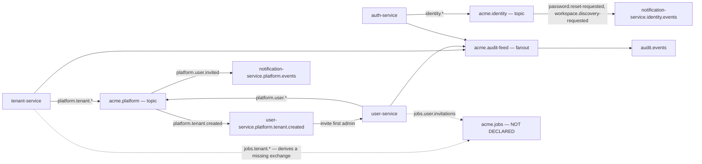
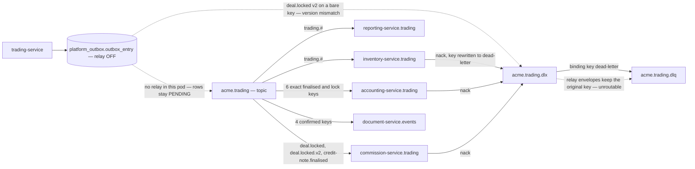
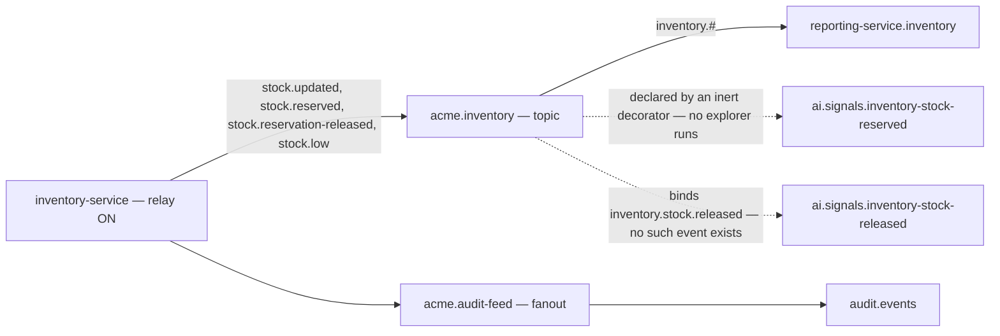
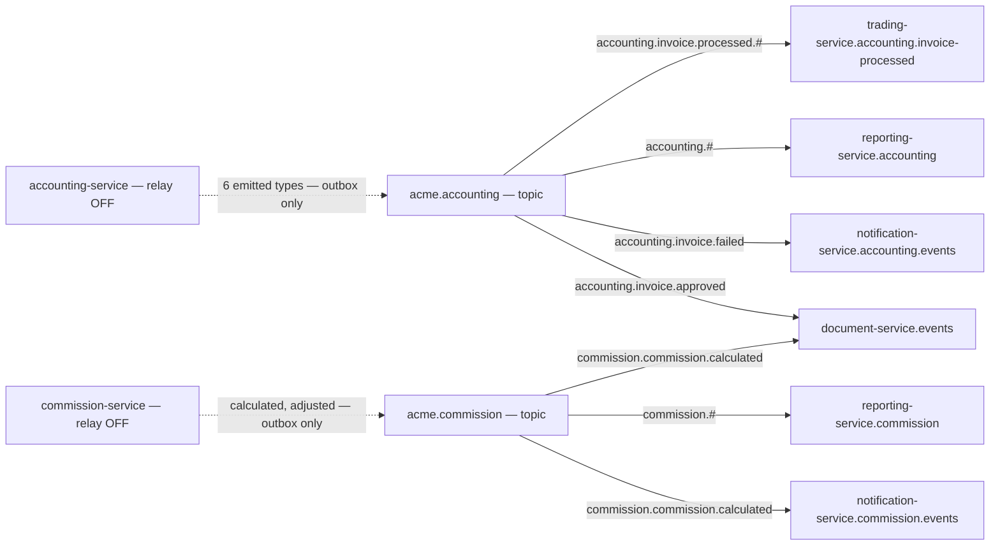
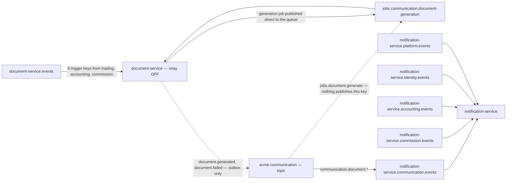
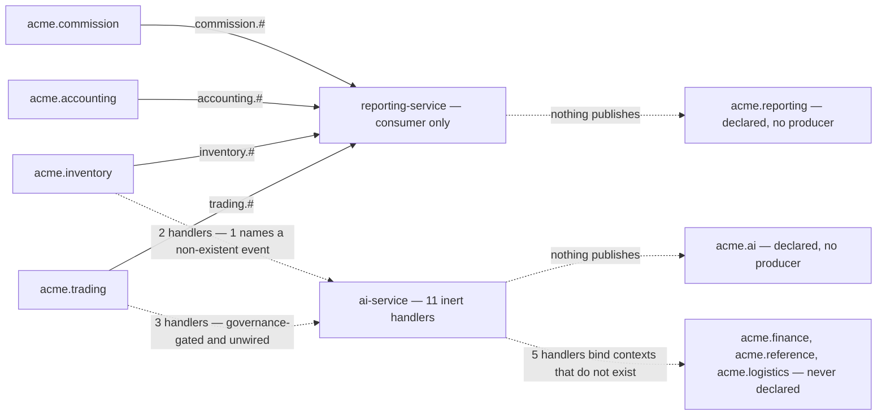
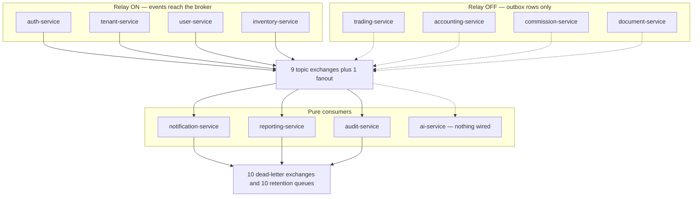

# Event Families — every event in the system

This is the counted, code-derived index of every domain event the platform emits or binds:
which bounded context owns it, which exchange and routing key carry it, what state
transition it records, which module publishes it, and which consumer — if any — actually
receives it. It is written for someone who has to answer "if I change this event, what
breaks?" or "why did that event never arrive?", and it deliberately separates events that
are _declared_ from events that are _emitted_ and from events that are _delivered_. Read
[`platform/event-catalog.md`](../../platform/event-catalog.md) first for the envelope,
naming grammar and broker topology; this page assumes all of that and goes to the level of
individual bindings.

Everything below was established by reading the shipped source on the branch under review,
not from ADR text. Where an ADR, a chart comment or the survey catalog disagrees with the
code, the disagreement is stated inline.

---

## 1. How an event type becomes a routing key

Three derivations, all mechanical, all in `libs/platform/event-bus`. Nothing in the system
lets a producer choose an exchange or a routing key by hand.

**Exchange** comes from the first dotted segment of `eventType`. `OutboxRelay.deriveExchange`
and `deriveExchangeFromEventType` in `event-handler-explorer.ts` implement the same rule
independently:

```ts
export function deriveExchangeFromEventType(
  eventType: string | undefined
): string | undefined {
  if (!eventType) return undefined;
  const dotIndex = eventType.indexOf(".");
  if (dotIndex <= 0) return undefined;
  return `acme.${eventType.substring(0, dotIndex)}`;
}
```

So `trading.deal.locked` publishes to `acme.trading`, `identity.user.login` to
`acme.identity`, and — this matters later — `jobs.tenant.cleanup` would derive
`acme.jobs`, an exchange the bootstrap chart never declares.

**Routing key** is set at outbox-write time and is always the bare event type.
`EventPublisher.publish` does exactly one thing beyond persisting the row:

```ts
entry.eventType = event.eventType;
entry.routingKey = event.eventType; // no version suffix, ever
```

The two service-local adapters (`apps/platform/tenant-service/src/infrastructure/outbox-event-publisher.adapter.ts`
and the user-service twin) repeat the same two assignments. There is no third
implementation.

**Version** is a field on the envelope, and the relay cross-checks it against the routing
key's `.vN` suffix before publishing. A version of 1 must appear on an unsuffixed key; a
version of _N ≥ 2_ must appear on a key ending `.vN`. A mismatch is not published to the BC
exchange at all — it is routed to `<exchange>.dlx` and the outbox row is marked `PUBLISHED`
so it is never retried. That enforcement path is the subject of §4.3 below, because on this
branch exactly one event trips it.

---

## 2. Delivery preconditions — why "the event exists" is not the same as "the event arrives"

Two independent switches decide whether a family is live. Both are compile-time, neither is
an environment variable, and each of them silently disables a whole class of events.

### 2.1 The relay switch

`EventBusModule.forRoot({ enableRelay })` decides whether a service polls its own
`platform_outbox.outbox_entry` table and publishes rows to the broker. Every service still
_writes_ outbox rows regardless. Counted from the eleven `app.module.ts` files that
configure an event bus:

| Service              | `exchangeName`       | `enableRelay` | Outbox rows leave the database? |
| -------------------- | -------------------- | ------------- | ------------------------------- |
| auth-service         | `acme.identity`      | **true**      | yes                             |
| tenant-service       | `acme.platform`      | **true**      | yes                             |
| user-service         | `acme.platform`      | **true**      | yes                             |
| inventory-service    | `acme.inventory`     | **true**      | yes                             |
| trading-service      | `acme.trading`       | false         | **no**                          |
| accounting-service   | `acme.accounting`    | false         | **no**                          |
| commission-service   | `acme.commission`    | false         | **no**                          |
| document-service     | `acme.communication` | false         | **no**                          |
| notification-service | `acme.communication` | false         | **no**                          |
| reporting-service    | `acme.reporting`     | false         | **no**                          |
| audit-service        | `acme.audit-feed`    | false         | n/a — publishes nothing         |
| ai-service           | `acme.ai`            | false         | n/a — publishes nothing         |

Four relays out of twelve event-bus consumers. The module is not silent about it — when the
flag is false it logs at boot:

> `OutboxRelay is DISABLED — events written to outbox will NOT be published to RabbitMQ.`

The consequence is blunt: **every trading, accounting, commission and communication event
enumerated in §4, §6, §7 and §8 is written to a database table and stays there.** The
consumers that bind those routing keys are correctly wired, hold the right AMQP grants, and
receive nothing. trading-service ships an OTel gauge specifically to detect this condition —
`acme_trading_outbox_lag_seconds{service,tenant}`, computed as the age in seconds of the
oldest `PENDING` row grouped by envelope tenant:

```sql
SELECT payload->>'tenantId' AS tenant,
       EXTRACT(EPOCH FROM (now() - min(created_at))) AS lag_seconds
  FROM platform_outbox.outbox_entry
 WHERE status = 'PENDING'
 GROUP BY payload->>'tenantId'
```

With the relay off that gauge grows without bound, which is the intended alarm.

### 2.2 The explorer switch

`@EventHandler({ eventType, version?, queue? })` is a `SetMetadata` decorator. Something has
to scan providers for that metadata and call `setupRabbitConsumer`. `EventHandlerExplorer`
in `libs/platform/event-bus` is that something — and a repository-wide search finds it
referenced in exactly two places: its own export line in `libs/platform/event-bus/src/index.ts`,
and a comment in user-service explaining that it is never instantiated. No `app.module.ts`,
no `ServiceModule`, no bootstrap file constructs one.

user-service documents the consequence in the file that suffered from it:

> the `@EventHandler` decorator is a dead no-op in production (no `EventHandlerExplorer` is
> ever instantiated), so relying on it left user-service NEVER declaring/binding its queue
> and the first-admin invite never fired

**Seventeen `@EventHandler`-decorated methods exist in production code. Zero are wired.**
The breakdown, counted per file:

| Service        | File                          | Decorated methods |
| -------------- | ----------------------------- | ----------------- |
| ai-service     | `trading-event.consumer.ts`   | 3                 |
| ai-service     | `inventory-event.consumer.ts` | 2                 |
| ai-service     | `reference-event.consumer.ts` | 2                 |
| ai-service     | `finance-event.consumer.ts`   | 2                 |
| ai-service     | `logistics-event.consumer.ts` | 1                 |
| ai-service     | `reporting-event.consumer.ts` | 1                 |
| tenant-service | `tenant-event.consumer.ts`    | 2                 |
| user-service   | `user-event.consumer.ts`      | 2                 |
| auth-service   | `auth-event.consumer.ts`      | 2                 |
| **Total**      |                               | **17**            |

Even if the explorer were instantiated, it would refuse to wire five of the eleven
ai-service handlers. `isFinancialEventType` is an explicit compliance gate — it blocks any
handler whose `eventType` begins `trading.`, `accounting.`, `commission.` or `finance.`,
because ingesting those streams into this context needs an explicit data-governance approval
first:

```ts
const FINANCIAL_PREFIXES = [
  "trading.",
  "accounting.",
  "commission.",
  "finance.",
] as const;
```

The gate logs a `WARN` naming the skipped handler and returns `undefined` rather than
throwing, so a service with only financial handlers boots healthy and consumes nothing.

### 2.3 The mechanism that _is_ live

All thirteen working consumers are hand-rolled classes implementing `OnModuleInit`, calling
either `setupRabbitConsumer`, `setupRabbitConsumerWithReconnect`, or raw `amqplib` channel
methods. They are enumerated in §12. Their common shape: `checkExchange` on the foreign
source exchange (passive — BC isolation withholds `configure`), `assertExchange` on their own
DLX, `assertQueue` + `bindQueue` for a quorum DLQ, then `assertQueue` for the main queue with
`x-dead-letter-exchange` and `x-dead-letter-routing-key: dead-letter`, then `prefetch(1)`,
then `consume`.

---

## 3. Identity family — auth-service, exchange `acme.identity`

Thirteen event types are declared by auth-service publishers. Eleven have at least one
production call site; two do not. The relay is enabled, so the eleven live types do reach
the broker.

| Event type                               | Ver | State transition recorded                                         | Emitting module                                    | Call sites |
| ---------------------------------------- | --- | ----------------------------------------------------------------- | -------------------------------------------------- | ---------- |
| `identity.user.login`                    | 1   | Successful credential or MFA login, with IP and device string     | `auth-event.publisher.ts` `publishLogin`           | 3          |
| `identity.user.logout`                   | 1   | Session ended by the user                                         | `auth-event.publisher.ts` `publishLogout`          | 3          |
| `identity.session.revoked`               | 1   | A single session invalidated, with reason                         | `auth-event.publisher.ts` `publishSessionRevoked`  | 6          |
| `identity.password.changed`              | 1   | Password rotated by its owner                                     | `auth-event.publisher.ts` `publishPasswordChanged` | 3          |
| `identity.account.locked`                | 1   | Lockout after N failed attempts, carries `lockedUntil`            | `auth-event.publisher.ts` `publishAccountLocked`   | 3          |
| `identity.password.reset-requested`      | 1   | Reset requested — **carries the raw single-use token**            | `auth-event.publisher.ts`                          | 3          |
| `identity.workspace.discovery-requested` | 1   | "Email me my workspaces" — platform-scoped, fires even for 0 hits | `outbox-workspace-discovery-notifier.adapter.ts`   | 1          |
| `identity.user.mfa_enabled`              | 1   | TOTP enrolment confirmed                                          | `mfa-verify.use-case.ts`                           | 1          |
| `identity.oidc.login`                    | 1   | Federated login succeeded                                         | `oidc-event.publisher.ts`                          | 2          |
| `identity.oidc.failed`                   | 1   | Federated login rejected                                          | `oidc-event.publisher.ts`                          | 2          |
| `identity.user.provisioned`              | 1   | Just-in-time user creation from an OIDC assertion                 | `oidc-event.publisher.ts`                          | 2          |
| `identity.oidc.linked`                   | 1   | External identity attached to an existing user                    | `oidc-event.publisher.ts`                          | **0**      |
| `identity.oidc.unlinked`                 | 1   | External identity detached                                        | `oidc-event.publisher.ts`                          | **0**      |

Two of these have security-relevant handling. `identity.password.reset-requested` puts the
**raw** reset token in `payload.token` so notification-service can build the reset link, and
the publisher's own comment concedes that this is a bearer credential travelling on the bus.
The mitigation is a per-`eventType` denylist configured on the relay in auth-service's
`app.module.ts`:

```ts
relay: {
  auditSecretFields: {
    'identity.password.reset-requested': ['payload.token'],
  },
}
```

`buildAuditBuffer` in the relay deep-clones the payload and deletes those dotted paths from
the **audit-feed copy only** — the BC-lane bytes that notification-service reads are the
original buffer, untouched. Without an entry in that map the strip is a pure no-op and the
original buffer is forwarded to both lanes.

`identity.workspace.discovery-requested` is the one platform-scoped identity event. It is
dispatched for every discovery request including an unregistered address that maps to zero
workspaces, so it carries the nil-UUID sentinel `00000000-0000-0000-0000-000000000000`
rather than a real tenant. notification-service keeps a set naming exactly this event type
and runs its reads with the tenant filter disabled (`{ filters: { tenant: false } }`) rather
than scoped.

### Consumers of `acme.identity`

Only one queue binds this exchange in shipped code: notification-service's
`notification-service.identity.events`, with two exact routing keys —
`identity.workspace.discovery-requested` and `identity.password.reset-requested`. The other
eleven identity events reach the broker, fan out to `acme.audit-feed`, and are persisted by
audit-service — but no bounded context reacts to them.

user-service carries an `@EventHandler({ eventType: 'identity.user.login' })` method intended
to stamp `lastLoginAt`. It is one of the seventeen inert decorators. Its own file comment is
explicit that it "was dead before this change and stays dead".

---

## 4. Platform family — tenant-service and user-service, exchange `acme.platform`

Two services share one exchange and one bounded-context prefix. Both run relays, so this
family is the most fully-functional lane in the system.

### 4.1 tenant lifecycle — tenant-service

| Event type                                  | Ver | State transition recorded                      | Emitting module                         |
| ------------------------------------------- | --- | ---------------------------------------------- | --------------------------------------- |
| `platform.tenant.created`                   | 1   | New tenant provisioned, carries `adminEmail`   | `create-tenant.use-case.ts`             |
| `platform.tenant.updated`                   | 1   | Tenant attributes changed                      | `tenant.service.ts`                     |
| `platform.tenant.suspended`                 | 1   | Tenant suspended, carries reason               | `suspend-tenant.use-case.ts`            |
| `platform.tenant.reactivated`               | 1   | Suspension lifted                              | `tenant.service.ts`                     |
| `platform.tenant.deleted`                   | 1   | Soft delete — starts the 30-day retention      | `soft-delete-tenant.use-case.ts`        |
| `platform.tenant.purge`                     | 1   | Hard purge after retention, `userId: 'system'` | `tenant-event.publisher.ts`             |
| `platform.tenant.config.updated`            | 1   | Feature flags / limits changed                 | `tenant-event.publisher.ts`             |
| `platform.tenant.onboarding.completed`      | 1   | Onboarding wizard finished                     | `onboarding.service.ts`                 |
| `platform.notification.onboarding-reminder` | 1   | Cron nudge for an incomplete onboarding        | `send-onboarding-reminder.processor.ts` |
| `jobs.tenant.cleanup`                       | —   | Per-tenant purge job                           | `tenant-cron.service.ts`                |
| `jobs.tenant.usage`                         | —   | Hourly usage-metric job                        | `tenant-cron.service.ts`                |
| `jobs.tenant.onboarding`                    | —   | Daily onboarding-reminder job                  | `tenant-cron.service.ts`                |

A typed helper, `TenantEventPublisher`, exposes one method per tenant event and builds the
full `DomainEvent` envelope. Five of its eight methods have **no production caller** —
`publishTenantUpdated`, `publishTenantSuspended`, `publishTenantReactivated`,
`publishTenantDeleted` and `publishOnboardingCompleted`. Those five events _are_ emitted, but
by call sites that construct the envelope inline and call the outbox port directly, bypassing
the typed helper. The events are live; the helper methods are dead code. Only
`publishTenantCreated`, `publishTenantPurge` and `publishConfigUpdated` are still reached
through the helper.

The four `jobs.*` and one `platform.notification.*` entries are a different animal and the
source of two concrete defects.

First, they are written through the same `IEventPublisher` port, which sets
`entryType = DOMAIN_EVENT` and stores `entry.payload = event.payload` verbatim. The cron and
reminder call sites pass a bare business payload, not a `DomainEvent` envelope:

```ts
await this.eventPublisher.publish(
  { eventType: "jobs.tenant.cleanup", payload: { tenantId, deletedAt } },
  em
);
```

The resulting outbox row therefore has no `eventId`, no `version`, no `tenantId` and no
`timestamp` at envelope level. `resolveEntryVersion(undefined)` returns 1, so version
enforcement passes; but any consumer that reads `event.eventType` or `event.tenantId` off the
message body gets `undefined`. audit-service, which binds the fanout and calls
`AuditEntry.create({ tenantId: event.tenantId, ... })`, will fail on exactly these messages
and nack them to `audit-service.events.dlx`.

Second, `deriveExchange('jobs.tenant.cleanup')` yields `acme.jobs`. That exchange is not in
the bootstrap chart's ten declared exchanges, and `tenant_user`'s write grant is
`^(acme\.platform(\..*)?|acme\.audit-feed(\..*)?)$`, which does not match it. The publish
fails, the retry budget burns down, and the row lands in `FAILED`. The relay does not branch
on `entryType` anywhere in `outbox-relay.ts` — every claimed row goes through
`deriveExchange(eventType)` regardless of whether it is a domain event or a job.

### 4.2 user lifecycle — user-service

| Event type                                  | Ver | State transition recorded                            | Emitting module                                       |
| ------------------------------------------- | --- | ---------------------------------------------------- | ----------------------------------------------------- |
| `platform.user.invited`                     | 1   | Invitation minted — **carries the raw accept token** | `invitation.service.ts`, `user-event.consumer.ts`     |
| `platform.user.created`                     | 1   | Invitation accepted, or JIT provisioning             | `invitation.service.ts`, `provision-user.use-case.ts` |
| `platform.user.updated`                     | 1   | Profile or role changed                              | `user.service.ts`                                     |
| `platform.user.deactivated`                 | 1   | Admin deactivated the user                           | `user.service.ts`                                     |
| `platform.user.reactivated`                 | 1   | Admin restored the user                              | `user.service.ts`                                     |
| `platform.notification.invitation-reminder` | 1   | Cron nudge for an unaccepted invitation              | `send-invitation-reminder.processor.ts`               |
| `jobs.user.invitations`                     | —   | Invitation sweep job (2 call sites)                  | `user-cron.service.ts`                                |

`platform.user.invited` is the second token-bearing event, and user-service configures the
matching relay denylist:

```ts
auditSecretFields: { 'platform.user.invited': ['payload.token'] }
```

### 4.3 The one working cross-service chain in this family

user-service self-wires a consumer for `platform.tenant.created` — not with `@EventHandler`,
which had left the queue undeclared entirely, but with `setupRabbitConsumerWithReconnect`
against a fixed config: exchange `acme.platform`, queue
`user-service.platform.tenant.created`, DLX `acme.platform.dlx`, DLQ `acme.platform.dlq`,
routing key `platform.tenant.created`, prefetch 1.

Its handler is where the family's business rule lives: on tenant creation, invite the first
admin. Before doing anything it validates the payload defensively, because inter-service
events are unsigned:

```ts
if (!payloadTenantId || !UUID_REGEX.test(payloadTenantId)) {
  throw new Error(
    `platform.tenant.created payload.tenantId missing or not a UUID … rejecting to DLX`
  );
}
```

and then cross-checks the payload `tenantId` against the envelope `tenantId`, because a
publisher holding `write` on `acme.platform` could otherwise forge a payload tenant and
inject an `ADMIN` into an arbitrary tenant. Throwing propagates to `setupRabbitConsumer`,
which nacks without requeue.

The chain completes at notification-service, whose `notification-service.platform.events`
queue binds `platform.user.invited` and renders the invite email.



**Reading it.** Solid edges are bindings that exist and carry traffic. The dashed edges are
the job lane: the relay derives `acme.jobs` from the `jobs.` prefix, no such exchange is
declared, and no grant permits writing to it. Note the asymmetry between the two platform
producers — tenant-service's output drives user-service, and user-service's output drives
notification-service, but nothing consumes the tenant _lifecycle_ events (`suspended`,
`deleted`, `purge`, `config.updated`) except the audit fanout. auth-service carries
`@EventHandler` methods for `platform.user.deactivated` and `platform.tenant.suspended` whose
whole purpose is session revocation within 60 seconds of a suspension — both inert.

---

## 5. Trading family — trading-service, exchange `acme.trading`

Twenty-nine distinct event types, the largest family by a wide margin, and the one whose
relay is off.

| Aggregate    | Event types                                                                              | Count |
| ------------ | ---------------------------------------------------------------------------------------- | ----- |
| Deal         | `trading.deal.created`, `trading.deal.locked`                                            | 2     |
| Purchase     | `.created` `.deleted` `.confirmed` `.receipted` `.finalised` `.unfinalised` `.cancelled` | 7     |
| Sale         | `.created` `.deleted` `.updated` `.confirmed` `.finalised` `.unfinalised` `.cancelled`   | 7     |
| Haulage      | `.deleted` `.confirmed` `.finalised` `.cancelled`                                        | 4     |
| Overhead     | `.deleted` `.confirmed` `.finalised` `.cancelled`                                        | 4     |
| Credit note  | `.created` `.deleted` `.finalised` `.cancelled`                                          | 4     |
| Cross-entity | `trading.line-item.finalised`                                                            | 1     |

All except `trading.deal.locked` are emitted through `TradingEventPublisher.publish`, which
hard-codes `version: 1` and threads request context (`userId`, `correlationId`, `ipAddress`,
`userEmail`) plus optional `changedFields` and `recipientUserIds` into the envelope. The same
publisher is the single choke-point for the in-process deal-activity projection: after the
outbox write it calls an optional `DealActivityRecorderPort`, best-effort, in its own unit of
work, so a projection failure never fails the authoritative write.

`trading.line-item.finalised` is emitted from four different services —
`purchase.service.ts`, `sale.service.ts`, `haulage.service.ts` and `overhead.service.ts` —
alongside each type's own `.finalised` event. It carries the full invoice-relevant line
snapshot so accounting can build an invoice from event-carried data without a synchronous
callback into trading. The contract index still cites this as "ADR-0058"; the actual decision
record is **ADR-0063**, and 0058 was allocated to an unrelated decision. The stale
cross-reference survives in `libs/platform/event-contracts/src/index.ts` and in the
accounting contracts header comment;
the accounting consumer itself cites 0063 correctly.

### 5.1 `trading.deal.locked` — the only v2 event, and why it cannot be delivered

`LockDealUseCase` builds its envelope by hand rather than through `TradingEventPublisher`,
because the lock event must participate in the pessimistic-lock transaction:

```ts
const event: DomainEvent<DealLockedEventPayloadV2> = {
  eventId: v7(),
  eventType: 'trading.deal.locked',
  version: 2,
  …
  payload: { ...snapshotPayload, idempotencyKey },
  changedFields: ['status', 'lockedAt', 'lockedGrossProfit'],
  ...(traderIds.length > 0 && { recipientUserIds: traderIds }),
};
await this.eventPublisher.publish<DealLockedEventPayloadV2>(em, event);
```

`idempotencyKey` is `` `${dealId}:${snapshotPayload.lockedAt}` `` — a deterministic key
derived from the DB-committed lock timestamp, which is what makes consumer-side dedup
possible for a v2 payload.

The problem is the interaction with §1. `EventPublisher.publish` sets
`entry.routingKey = event.eventType`, i.e. the bare `trading.deal.locked`, with no `.v2`
suffix. The relay then runs:

```ts
const validation = validateVersionRoutingKeyMatch({
  routingKey: entry.routingKey, // 'trading.deal.locked'  → suffix implies v1
  eventVersion: version, // 2
  eventId: entry.id,
});
```

`expectedVersion` is 1 (no suffix), `actualVersion` is 2, so `valid` is false and the entry
is sent to `dlxRoute` instead of the BC exchange. This is not inference — it is the exact
scenario asserted by a shipped unit test, _"v=2 on base routing key routes to
acme.trading.dlx with structured payload"_, which additionally asserts that **no publish
reaches `acme.trading` or `acme.audit-feed`**, and that the outbox row still transitions to
`PUBLISHED` and is never retried.

So even after trading's relay is enabled, `trading.deal.locked` as currently written will
dead-letter every time. Fixing it requires the routing key at outbox-write time to carry the
version suffix — `buildVersionedRoutingKey(eventType, version)` already exists and is used by
`publishToBoth`, but nothing calls it on the write path.

The dead-letter copy is also not retained. `dlxRoute` publishes to `<exchange>.dlx` with
`routingKey = payload.originalRoutingKey` — the original `trading.deal.locked` — while the
bootstrap chart binds `<exchange>.dlq` to `<exchange>.dlx` with the literal key
`dead-letter`. On a topic exchange those do not match, so the envelope is unroutable and
dropped. The relay's own comment says so:

> `<exchange>.dlx` is declared (#976 P4) but has no bound DLQ yet, so the published copy is
> not retained — the WARN log is the current forensic record.

That comment is half right: a DLQ _is_ bound, but only for the `dead-letter` key that
consumer nacks use, not for the original key the relay uses.

### 5.2 Consumers of `acme.trading`

Four queues bind this exchange, and they use three different binding strategies.

| Consumer                                  | Queue                        | Routing keys bound                                                                                                               |
| ----------------------------------------- | ---------------------------- | -------------------------------------------------------------------------------------------------------------------------------- |
| inventory-service `TradingEventConsumer`  | `inventory-service.trading`  | `trading.#` — one wildcard                                                                                                       |
| reporting-service `TradingEventConsumer`  | `reporting-service.trading`  | `trading.#` — one wildcard                                                                                                       |
| accounting-service `TradingEventConsumer` | `accounting-service.trading` | 6 exact: `purchase.finalised`, `sale.finalised`, `haulage.finalised`, `overhead.finalised`, `deal.locked`, `line-item.finalised` |
| commission-service `TradingEventConsumer` | `commission-service.trading` | 3 exact: `deal.locked`, `deal.locked.v2`, `credit-note.finalised`                                                                |
| document-service `DocumentEventConsumer`  | `document-service.events`    | 4 exact from this exchange: `purchase.confirmed`, `sale.confirmed`, `haulage.confirmed`, `overhead.confirmed`                    |

inventory binds `trading.#` but dispatches only eight event types in its `switch`;
everything else falls to `default` and is logged at debug and acked. The eight it handles:
`purchase.receipted`, `purchase.cancelled`, `sale.created`, `sale.confirmed`, `sale.updated`,
`sale.cancelled`, `credit-note.finalised`, `deal.locked`. Its dispatch is wrapped in
`withInbox`, the ADR-0072 dedup: `(consumer, eventId)` is checked against
`inventory.processed_event` and a redelivery is acked without re-applying while incrementing
`acme_inventory_consumer_redeliveries_total`. The ordering is deliberate and documented — the
inbox row is written **after** a successful apply, never before, because inventory's stock
handlers persist through per-operation forked entity managers and a single caller transaction
cannot span both.

commission-service is the only consumer that dispatches on the **broker-side routing key**
rather than `eventType`, and it has to:

```ts
const routingKey: string = msg.fields?.routingKey ?? event.eventType;
```

For v1 and v2 of `deal.locked` the `eventType` is byte-identical; only the routing key
distinguishes them, so it is the canonical version discriminator. It binds both keys so that
it receives traffic under any producer state — bare-key only, `.v2` only, or both during a
dual-publish window.



**Reading it.** The five consumer queues are correctly declared and bound; every solid edge
from `acme.trading` is a real binding held by a running pod. The two dashed edges out of the
outbox are the two independent reasons trading events do not arrive: the relay is not
started in this service, and the one v2 event would be diverted even if it were. The dashed
edge into the DLQ shows why relay-diverted envelopes are not retained — the DLQ binding key
matches consumer nacks, not relay dead-letters.

---

## 6. Inventory family — inventory-service, exchange `acme.inventory`

Four event types, all emitted through `InventoryEventPublisher`, all `version: 1`. Payload
quantities are decimal strings in the canonical unit, kilograms.

| Event type                             | State transition recorded                            | Key payload fields                                                        |
| -------------------------------------- | ---------------------------------------------------- | ------------------------------------------------------------------------- |
| `inventory.stock.updated`              | Position availability changed                        | `positionId`, `dealId`, `productId`, `availableQuantity`, `canonicalUnit` |
| `inventory.stock.reserved`             | Stock reserved against a sale line item              | `reservationId`, `positionId`, `saleLineItemId`, `quantity`               |
| `inventory.stock.reservation-released` | Reservation released, typically on sale cancellation | `reservationId`, `positionId`, `saleLineItemId`                           |
| `inventory.stock.low`                  | Position fell below the configured threshold         | `positionId`, `productId`, `availableQuantity`, `threshold`               |

The publisher threads causation properly: when a source event is supplied it inherits that
event's `correlationId` and uses its `eventId` as `causationId`, so a trace survives the
trading → inventory hop.

**One consumer binds this exchange**: reporting-service's `reporting-service.inventory` queue,
pattern `inventory.#`, projecting into `RptStockPosition`. Its handler guards on
`eventType.startsWith('inventory.')`, which is redundant given the binding, and projects
`payload.product` and `payload.quantity` — **neither field exists on any of the four
payloads**, which publish `productId` and either `availableQuantity` or `quantity`
depending on the event. The projection therefore writes rows whose `product` and `quantity`
columns are always undefined for `stock.updated` and `stock.low`.

`inventory.stock.low` has no notification consumer despite the survey catalog listing one;
notification-service's `ROUTING_KEYS` map contains no inventory key at all.



**Reading it.** Inventory is one of only four services whose relay is on, so the solid edges
carry real traffic. The dashed edges are the AI service's two inventory bindings: the first
names a real event type but is never wired because no explorer instantiates it; the second is
doubly broken, since it binds `inventory.stock.released` while the producer emits
`inventory.stock.reservation-released`. ADR-0047 records the intended remedy — "keep
`inventory.stock.reserved`; fix `.released` → `.reservation-released`" — but the enum on this
branch still carries the wrong name.

---

## 7. Accounting family — accounting-service, exchange `acme.accounting`

Six event types are emitted; the published-language contract declares nine. The relay is off.

| Event type                           | Emitted? | State transition recorded                        | Emitting module                   |
| ------------------------------------ | -------- | ------------------------------------------------ | --------------------------------- |
| `accounting.invoice.created`         | yes      | Invoice generated from finalised trading lines   | `generate-invoices.use-case.ts`   |
| `accounting.invoice.approved`        | yes      | Finance authorised the invoice for ERP posting   | `approve-invoice.use-case.ts`     |
| `accounting.invoice.cancelled`       | yes      | Invoice cancelled before processing              | `cancel-invoice.use-case.ts`      |
| `accounting.invoice.processed`       | yes      | ERP posting succeeded — carries `erpUrn`         | `erp-posting.worker.ts` (2 sites) |
| `accounting.invoice.failed`          | yes      | ERP posting failed — drives an admin alert email | `erp-posting.worker.ts`           |
| `accounting.accounting-month.opened` | yes      | Period opened to receive invoices                | `open-month.use-case.ts`          |
| `accounting.invoice.rejected`        | **no**   | Finance rejected during approval                 | contract only                     |
| `accounting.exchange-rate.updated`   | **no**   | Currency rate created or imported                | contract only                     |
| `accounting.accounting-month.closed` | **no**   | Period closed, rejects new invoices              | contract only                     |

The three contract-only types have full typed payload interfaces exported from
`@acme/event-contracts` and zero emission sites anywhere in `apps/platform`.

### Consumers of `acme.accounting`

| Consumer                                    | Queue                                          | Routing keys bound               |
| ------------------------------------------- | ---------------------------------------------- | -------------------------------- |
| trading-service `InvoiceProcessedConsumer`  | `trading-service.accounting.invoice-processed` | `accounting.invoice.processed.#` |
| reporting-service `AccountingEventConsumer` | `reporting-service.accounting`                 | `accounting.#`                   |
| notification-service                        | `notification-service.accounting.events`       | `accounting.invoice.failed`      |
| document-service `DocumentEventConsumer`    | `document-service.events`                      | `accounting.invoice.approved`    |

`accounting.invoice.processed` is the only accounting event that trading consumes, and the
only inbound integration trading has at all. The binding pattern is deliberately
`accounting.invoice.processed.#` rather than the exact key, so a future versioned key
(`…​.processed.v2`) is captured without a rebind — `#` on a topic exchange also matches zero
segments, so the unversioned key still routes. The consumer guards anyway, comparing against
a constant `HANDLED_EVENT_TYPE`.

This consumer is also the trading BC's inbox entry point: it registers the ORM into a
module-level registry in `onModuleInit` _before_ any message can be dispatched, so the
dependency-free handler can fork an entity manager and perform the ADR-0072 same-transaction
inbox insert.

### The accounting consumer of trading events

accounting-service's own `TradingEventConsumer` is the reverse leg. It binds six exact keys
and maps each `.finalised` event to an `InvoiceEligibility` row, and `trading.deal.locked` to
`ExchangeRateSnapshot` rows. Idempotency is enforced by database constraints rather than an
inbox: `UNIQUE(source_entity_id, source_entity_type, tenant_id)` on `invoice_eligibility`,
`UNIQUE(deal_id, currency_code, tenant_id)` on `exchange_rate_snapshot`, plus an in-memory
`eventId` check to reject obvious replays.

Note that it binds `trading.deal.locked` — the bare v1 key — while the producer emits
version 2. Even with both relays enabled, that binding would receive nothing unless a
dual-publish transition window is active _and_ the routing-key defect in §5.1 is fixed.

---

## 8. Commission family — commission-service, exchange `acme.commission`

Two event types emitted, four declared. Relay off.

| Event type                         | Emitted? | State transition recorded                           | Emitting module                    |
| ---------------------------------- | -------- | --------------------------------------------------- | ---------------------------------- |
| `commission.commission.calculated` | yes      | Commission earned per trader, computed on deal lock | `calculate-commission.use-case.ts` |
| `commission.commission.adjusted`   | yes      | Delta adjustment from a post-lock credit note       | `apply-adjustment.use-case.ts`     |
| `commission.commission.approved`   | **no**   | Commission approved for payment                     | contract only                      |
| `commission.commission.paid`       | **no**   | Payment confirmed for a trader's commission         | contract only                      |

`approve-payout.use-case.ts` and `pay-payout.use-case.ts` both exist and both run; neither
injects an `EventPublisher` and neither emits anything. The approve and pay transitions are
therefore invisible outside the commission database — including to the audit trail, since the
audit feed only sees what the relay publishes.

`CommissionCalculatedEventPayload` carries a `contextData` bag described in the contract as
"rendering context for the downstream Communication BC (PDF + email)" — a deliberate
denormalisation so document-service can render a commission statement without calling back.

### Consumers of `acme.commission`

| Consumer                                    | Queue                                    | Routing keys bound                 |
| ------------------------------------------- | ---------------------------------------- | ---------------------------------- |
| reporting-service `CommissionEventConsumer` | `reporting-service.commission`           | `commission.#`                     |
| notification-service                        | `notification-service.commission.events` | `commission.commission.calculated` |
| document-service `DocumentEventConsumer`    | `document-service.events`                | `commission.commission.calculated` |

Both `.approved` and `.paid` would be swept up by reporting's `commission.#` wildcard if they
were ever emitted; nothing binds them individually.



**Reading it.** Every binding shown is declared by a running pod and holds the AMQP grants it
needs — the seven solid edges are correct wiring. The two dashed producer edges are the whole
problem: neither service starts a relay, so both exchanges are permanently empty. This is the
clearest illustration of why "the binding exists" and "the event arrives" have to be tracked
as separate facts.

---

## 9. Communication family — document-service and notification-service, exchange `acme.communication`

Two services share the exchange. document-service emits; notification-service consumes and
emits nothing.

| Event type                         | Emitted? | State transition recorded                           | Emitting module                 |
| ---------------------------------- | -------- | --------------------------------------------------- | ------------------------------- |
| `communication.document.generated` | yes      | PDF rendered, uploaded, checksum verified           | `document-generation-worker.ts` |
| `communication.document.failed`    | yes      | Rendering or upload failed, carries `failureReason` | `document-generation-worker.ts` |

Both are published inside `em.transactional` alongside the `GeneratedDocument` state change,
which is the correct outbox discipline. Both are then stranded, because document-service runs
no relay.

### The job lane, and its inert binding

`DocumentGenerationWorker` declares its own AMQP topology rather than using the shared
consumer helper: exchange `acme.communication`, queue
`jobs.communication.document-generation`, DLX `acme.communication.dlx`, DLQ
`acme.communication.dlq`, and:

```ts
await channel.bindQueue(
  JOB_QUEUE_NAME,
  JOB_EXCHANGE_NAME,
  "jobs.document.generate"
);
```

A repository-wide search for the string `jobs.document.generate` returns **exactly one hit** —
that `bindQueue` call. Nothing publishes that routing key, so the binding itself is inert. The
pipeline still runs, because `DocumentEventConsumer` bypasses the exchange entirely: after
creating the `GeneratedDocument` row in `PENDING` on one of the six trigger events, it
publishes the generation job to the **default exchange** with the queue name as the routing
key, which RabbitMQ delivers straight into `jobs.communication.document-generation`. That
publish is deliberately not routed through the outbox — the document row is already committed
when it fires, so there is nothing left to make atomic.

This is worth pausing on, because it is a shape that reads wrong in every topology dump. The
declared binding suggests the job travels over the BC exchange; the traffic actually arrives
by default-exchange direct routing, which no exchange-level view shows. A reader auditing
bindings concludes the pipeline is dead; a reader following the publish calls concludes it is
healthy. Both are half right, and the only way to tell them apart is to read the publish site,
not the topology.

The `document_user` AMQP grant carries an explicit `jobs\.communication(\..*)?` alternation
in all three positions (`configure`, `write`, `read`) precisely for this worker — RabbitMQ
checks `configure` against the queue name and `write` against the routing key when publishing
to the default exchange.

### notification-service — the widest consumer in the system

One class, five per-source-BC queues, five per-BC dead-letter exchanges, seven exact routing
keys, and seven handler methods. The queue name for source BC _b_ is
`notification-service.<b>.events`, the DLX `notification-service.<b>.dlx`, the DLQ
`notification-service.<b>.dlq` — all in notification's own `configure` namespace, because
`acme.<b>.dlx` is foreign for the commission and accounting BCs and cannot be declared here.

| Routing key                              | Source exchange      | Handler                      |
| ---------------------------------------- | -------------------- | ---------------------------- |
| `communication.document.generated`       | `acme.communication` | `handleDocumentGenerated`    |
| `communication.document.failed`          | `acme.communication` | `handleDocumentFailed`       |
| `commission.commission.calculated`       | `acme.commission`    | `handleCommissionCalculated` |
| `accounting.invoice.failed`              | `acme.accounting`    | `handleInvoiceFailed`        |
| `identity.workspace.discovery-requested` | `acme.identity`      | `handleWorkspaceDiscovery`   |
| `identity.password.reset-requested`      | `acme.identity`      | `handlePasswordReset`        |
| `platform.user.invited`                  | `acme.platform`      | `handleUserInvited`          |

Three details are load-bearing.

**In-process serialisation replaces channel-wide QoS.** Quorum queues reject
`basic.qos(global=true)` with `NOT_IMPLEMENTED`, so the "one message in flight across all
five consumers" guarantee — needed because MikroORM's identity map is not concurrency-safe —
is enforced by a promise chain instead:

```ts
const myTurn = this.handlerLock.then(() => this.handleOne(channel, msg));
this.handlerLock = myTurn.catch(() => undefined);
await myTurn;
```

The `.catch(() => undefined)` prevents one failing message from poisoning the chain for every
subsequent message. The chain is reset on every reconnect, otherwise a handler could ack a
new channel's delivery tag against the old, closed channel.

**Token-bearing events are never dead-lettered.** Two routing keys carry raw single-use
tokens. On a pre-send failure the consumer **acks and drops** rather than nacking, because a
nack would retain the raw token at rest in the platform DLQ:

```ts
const TOKEN_BEARING_ROUTING_KEYS: ReadonlySet<string> = new Set([
  "platform.user.invited",
  "identity.password.reset-requested",
]);
```

The decision is made from `msg.fields.routingKey`, which is reliable even when the body fails
to parse. The recovery path is to resend the invitation or reset, which mints a fresh token.
The operator alert is scrubbed — routing key and cause only, never `msg.content`.

**Platform-lane events bypass the tenant filter.** A tenant-scoped event with no `tenantId`
is nacked to the DLX; a platform event legitimately has none, so it runs with
`effectiveTenantId` set to the nil-UUID sentinel and its reads pass
`{ [TENANT_FILTER_NAME]: false }` rather than setting filter params.



**Reading it.** notification-service's five queues converge on one class with one
serialisation lock — the fan-in is a design choice, not an accident, and it is why the
handler lock exists. The two dashed edges touching `acme.communication` are the family's dead
ends: the document events never leave the outbox; the generation job queue's
`acme.communication` binding has no producer, but the job itself is published directly to the
queue on the default exchange, so the pipeline does run — only its `.generated` / `.failed`
events are stranded.

---

## 10. Audit family — audit-service, exchange `acme.audit-feed`

audit-service is a pure sink. It publishes nothing, has no `EventPublisher` reference
anywhere in its source, and sets `enableRelay: false` with the comment "Audit service is
read-only".

Its single consumer binds the **fanout** exchange, which is what makes it BC-agnostic
forever — a new bounded context needs no new binding:

| Property     | Value                      |
| ------------ | -------------------------- |
| Exchange     | `acme.audit-feed` (fanout) |
| Queue        | `audit.events`             |
| DLX          | `audit-service.events.dlx` |
| DLQ          | `audit-service.events.dlq` |
| Routing keys | none supplied → `['']`     |

The DLX and DLQ live under `audit-service.*` rather than `audit.events.*` because
`audit_user`'s `configure` regex is `^(audit\.events|audit-service\..*)$` — an exact match on
the queue name, which does not permit a dotted `.dlx` suffix. A consequence worth recording:
the bootstrap chart ranges over _all_ exchanges when rendering DLX/DLQ/binding CRDs, so it
also renders `acme.audit-feed.dlx` and `acme.audit-feed.dlq` — resources this service cannot
declare and does not use. They are inert.

Every event that survives the relay is written as an `AuditEntry` with `entityType` derived
by dropping the last dotted segment (`trading.deal.locked` → `trading.deal`), an action from
a suffix map, and `UNIQUE(source_event_id)` as the idempotency guard. On a `23505` unique
violation the batch is re-inserted row by row so a single duplicate does not drop the rest.

The suffix map is the family's most visible gap:

```ts
const EVENT_SUFFIX_MAP: Record<string, AuditAction> = {
  created: CREATE,
  updated: UPDATE,
  deleted: DELETE,
  locked: LOCK,
  confirmed: STATUS_CHANGE,
  receipted: STATUS_CHANGE,
  finalised: STATUS_CHANGE,
  approved: STATUS_CHANGE,
  cancelled: STATUS_CHANGE,
};
```

Nine suffixes are mapped. Counting the emitted event types in §3 through §9, the following
suffixes are emitted and **not** mapped, so every such event is persisted with
`action = UNKNOWN` and a `WARN` log: `unfinalised`, `reserved`, `low`, `reservation-released`,
`processed`, `failed`, `opened`, `calculated`, `adjusted`, `generated`, `invited`,
`reactivated`, `suspended`, `purge`, `login`, `logout`, `revoked`, `changed`, `provisioned`,
`mfa_enabled`, `discovery-requested`, `reset-requested`, `completed`, `onboarding-reminder`,
`invitation-reminder`. That is a clear majority of the taxonomy.

---

## 11. Reporting and AI families — the two inert contexts

### 11.1 reporting-service, exchange `acme.reporting`

`acme.reporting` is declared as an Exchange CRD, `reporting_user` holds `write` on it, and
`reporting-service` sets `exchangeName: 'acme.reporting'`. A search for `EventPublisher` in
`apps/platform/reporting-service/src` returns nothing. **The exchange has no producer.**

reporting-service is purely a consumer: four `setupRabbitConsumer` calls, one per source BC,
each with a `<bc>.#` wildcard, each feeding `ProjectionService.upsert` into a read-model
entity.

| Queue                          | Source exchange   | Pattern        | Projection targets                         |
| ------------------------------ | ----------------- | -------------- | ------------------------------------------ |
| `reporting-service.trading`    | `acme.trading`    | `trading.#`    | `RptDealSummary`, `RptLineItemSummary`     |
| `reporting-service.accounting` | `acme.accounting` | `accounting.#` | `RptInvoiceSummary`, `RptAccountingPeriod` |
| `reporting-service.commission` | `acme.commission` | `commission.#` | `RptCommissionSummary`                     |
| `reporting-service.inventory`  | `acme.inventory`  | `inventory.#`  | `RptStockPosition`                         |

Three of those four source exchanges have no relay, so only the inventory projection can
currently receive anything.

The queue names deserve a note, because they encode a hard-won lesson. They live under
`reporting-service.*` — not the more natural `reporting.<bc>` — because reporting's
`configure` grant is `^(acme\.reporting(\..*)?|reporting-service\..*)$` and, as the source
comment says, "the previous `reporting.<bc>` names matched NEITHER alternative".

`reporting.report.generated` is bound by ai-service and produced by nobody.

### 11.2 ai-service, exchange `acme.ai`

ai-service declares eleven `SignalEventType` values and eleven matching `@EventHandler`
methods across six consumer classes. It publishes nothing — no `EventPublisher` reference
exists in its source — so `acme.ai` is a declared exchange with no producer, mirroring
`acme.reporting`.

Of the eleven bindings, **not one can deliver a message today**, for three stacking reasons.

| Declared binding                        | Blocked by explorer? | Governance-gated? | Producer exists?                                |
| --------------------------------------- | -------------------- | --------- | ----------------------------------------------- |
| `trading.deal.created`                  | yes                  | **yes**   | yes — trading-service                           |
| `trading.deal.completed`                | yes                  | **yes**   | **no** — test fixtures only                     |
| `trading.deal.profitability-calculated` | yes                  | **yes**   | **no** — test fixtures only                     |
| `finance.invoice.posted`                | yes                  | **yes**   | **no** — no `acme.finance` exchange exists      |
| `finance.commission.calculated`         | yes                  | **yes**   | **no** — no `acme.finance` exchange exists      |
| `inventory.stock.reserved`              | yes                  | no        | yes — inventory-service                         |
| `inventory.stock.released`              | yes                  | no        | **no** — producer emits `.reservation-released` |
| `reference.product.updated`             | yes                  | no        | **no** — no reference BC, exchange or producer  |
| `reference.customer.updated`            | yes                  | no        | **no** — no reference BC, exchange or producer  |
| `logistics.haulage.completed`           | yes                  | no        | **no** — no logistics BC or exchange            |
| `reporting.report.generated`            | yes                  | no        | **no** — reporting-service publishes nothing    |

Only **two** of eleven name an event type that any producer actually emits. Four name a
bounded context — `finance.`, `reference.`, `logistics.` — that has no exchange, no service
and no producer; `deriveExchangeFromEventType` would happily construct `acme.finance`,
`acme.reference` and `acme.logistics` and then fail on the passive exchange check.

ADR-0047 is the record that establishes all of this independently, and its remediation plan
is explicit per consumer: remap `trading` to `trading.deal.locked`;
keep `inventory.stock.reserved` and fix `.released` to
`.reservation-released`; split `finance` into real `accounting.invoice.approved` and
`commission.commission.calculated` consumers; **drop** `reference` and `reporting` entirely;
remap `logistics` onto `trading.haulage.*`. None of that has landed on this branch — the
enum and the six consumer classes are unchanged.

ai-service is also absent from `charts/services.yaml`, the file whose header calls itself the
"Platform Service Registry — Single Source of Truth". It is nonetheless deployed, via a
separate `platform-standalone` generator in the ArgoCD `ApplicationSet` alongside the gateway. The
registry and the deploy manifest disagree.



**Reading it.** The four solid edges into reporting-service are the only real wiring in this
diagram. Everything dashed is declared intent with no runtime effect: two exchanges nobody
writes to, eleven handler methods no explorer discovers, five of them gated by a compliance
check even if it did, and three bounded-context prefixes with no exchange behind them. This
is what an unfinished context looks like when it is honestly recorded rather than quietly
deleted.

---

## 12. The consumer inventory — all thirteen wired consumers

Every consumer that a running pod actually declares and binds, with its full topology.

| #   | Class                       | Service              | Source exchange(s)                                   | Queue                                          | Keys                             | DLX                                 |
| --- | --------------------------- | -------------------- | ---------------------------------------------------- | ---------------------------------------------- | -------------------------------- | ----------------------------------- |
| 1   | `AuditEventConsumer`        | audit-service        | `acme.audit-feed` (fanout)                           | `audit.events`                                 | `['']`                           | `audit-service.events.dlx`          |
| 2   | `TradingEventConsumer`      | reporting-service    | `acme.trading`                                       | `reporting-service.trading`                    | `trading.#`                      | `reporting-service.trading.dlx`     |
| 3   | `AccountingEventConsumer`   | reporting-service    | `acme.accounting`                                    | `reporting-service.accounting`                 | `accounting.#`                   | `reporting-service.accounting.dlx`  |
| 4   | `CommissionEventConsumer`   | reporting-service    | `acme.commission`                                    | `reporting-service.commission`                 | `commission.#`                   | `reporting-service.commission.dlx`  |
| 5   | `InventoryEventConsumer`    | reporting-service    | `acme.inventory`                                     | `reporting-service.inventory`                  | `inventory.#`                    | `reporting-service.inventory.dlx`   |
| 6   | `TradingEventConsumer`      | inventory-service    | `acme.trading`                                       | `inventory-service.trading`                    | `trading.#`                      | `inventory-service.trading.dlx`     |
| 7   | `TradingEventConsumer`      | accounting-service   | `acme.trading`                                       | `accounting-service.trading`                   | 6 exact                          | `accounting-service.trading.dlx`    |
| 8   | `TradingEventConsumer`      | commission-service   | `acme.trading`                                       | `commission-service.trading`                   | 3 exact                          | `commission-service.trading.dlx`    |
| 9   | `InvoiceProcessedConsumer`  | trading-service      | `acme.accounting`                                    | `trading-service.accounting.invoice-processed` | `accounting.invoice.processed.#` | `trading-service.accounting.dlx`    |
| 10  | `DocumentEventConsumer`     | document-service     | `acme.trading`, `acme.accounting`, `acme.commission` | `document-service.events`                      | 6 exact                          | `acme.communication.dlx`            |
| 11  | `DocumentGenerationWorker`  | document-service     | `acme.communication`                                 | `jobs.communication.document-generation`       | `jobs.document.generate`         | `acme.communication.dlx`            |
| 12  | `NotificationEventConsumer` | notification-service | 5 exchanges                                          | `notification-service.<bc>.events` × 5         | 7 exact                          | `notification-service.<bc>.dlx` × 5 |
| 13  | `UserEventConsumer`         | user-service         | `acme.platform`                                      | `user-service.platform.tenant.created`         | `platform.tenant.created`        | `acme.platform.dlx`                 |

Consumer #12 declares five queues from one class, so the true queue count across all
consumers is seventeen, not thirteen.

---

## 13. Producer / consumer matrix

Rows are emitted event types grouped by owning context. `—` in the consumer column is a
dangling edge: the event is produced and nothing binds it beyond the audit fanout, which
binds everything.

| Event type                                                                                                                      | Producer           | Relay   | Consumers (queue → service)                                                                                                           |
| ------------------------------------------------------------------------------------------------------------------------------- | ------------------ | ------- | ------------------------------------------------------------------------------------------------------------------------------------- |
| `identity.user.login`                                                                                                           | auth-service       | on      | — (audit fanout only; user-service handler is inert)                                                                                  |
| `identity.user.logout`                                                                                                          | auth-service       | on      | —                                                                                                                                     |
| `identity.session.revoked`                                                                                                      | auth-service       | on      | —                                                                                                                                     |
| `identity.password.changed`                                                                                                     | auth-service       | on      | —                                                                                                                                     |
| `identity.account.locked`                                                                                                       | auth-service       | on      | —                                                                                                                                     |
| `identity.password.reset-requested`                                                                                             | auth-service       | on      | `notification-service.identity.events`                                                                                                |
| `identity.workspace.discovery-requested`                                                                                        | auth-service       | on      | `notification-service.identity.events`                                                                                                |
| `identity.user.mfa_enabled`                                                                                                     | auth-service       | on      | —                                                                                                                                     |
| `identity.oidc.login` / `.failed`                                                                                               | auth-service       | on      | —                                                                                                                                     |
| `identity.user.provisioned`                                                                                                     | auth-service       | on      | —                                                                                                                                     |
| `platform.tenant.created`                                                                                                       | tenant-service     | on      | `user-service.platform.tenant.created`                                                                                                |
| `platform.tenant.updated` / `.suspended` / `.reactivated` / `.deleted` / `.purge` / `.config.updated` / `.onboarding.completed` | tenant-service     | on      | — (auth-service suspension handler is inert)                                                                                          |
| `platform.user.invited`                                                                                                         | user-service       | on      | `notification-service.platform.events`                                                                                                |
| `platform.user.created`                                                                                                         | user-service       | on      | — (tenant-service user-count handler is inert)                                                                                        |
| `platform.user.updated` / `.reactivated`                                                                                        | user-service       | on      | —                                                                                                                                     |
| `platform.user.deactivated`                                                                                                     | user-service       | on      | — (auth + tenant handlers both inert)                                                                                                 |
| `platform.notification.*` (2)                                                                                                   | tenant, user       | on      | —                                                                                                                                     |
| `jobs.tenant.*` (3), `jobs.user.invitations`                                                                                    | tenant, user       | on      | — derives `acme.jobs`, which does not exist                                                                                           |
| `trading.deal.created`                                                                                                          | trading-service    | **off** | `inventory-service.trading`†, `reporting-service.trading`                                                                             |
| `trading.deal.locked` (**v2**)                                                                                                  | trading-service    | **off** | `commission-service.trading`, `accounting-service.trading`, `inventory-service.trading` — **all starved by the routing-key mismatch** |
| `trading.purchase.confirmed` / `sale.confirmed` / `haulage.confirmed` / `overhead.confirmed`                                    | trading-service    | **off** | `document-service.events`, `inventory-service.trading`†, `reporting-service.trading`                                                  |
| `trading.*.finalised` (4 types)                                                                                                 | trading-service    | **off** | `accounting-service.trading`, `reporting-service.trading`                                                                             |
| `trading.line-item.finalised`                                                                                                   | trading-service    | **off** | `accounting-service.trading`                                                                                                          |
| `trading.credit-note.finalised`                                                                                                 | trading-service    | **off** | `commission-service.trading`, `inventory-service.trading`                                                                             |
| `trading.purchase.receipted` / `.cancelled`, `trading.sale.created` / `.updated` / `.cancelled`                                 | trading-service    | **off** | `inventory-service.trading`                                                                                                           |
| `trading.*.deleted` (5), `trading.*.unfinalised` (2), `trading.haulage.cancelled`, `trading.overhead.cancelled`                 | trading-service    | **off** | `reporting-service.trading` (wildcard, no dispatch branch)                                                                            |
| `inventory.stock.reserved`                                                                                                      | inventory-service  | on      | `reporting-service.inventory`                                                                                                         |
| `inventory.stock.updated` / `.reservation-released` / `.low`                                                                    | inventory-service  | on      | `reporting-service.inventory` (wildcard)                                                                                              |
| `accounting.invoice.processed`                                                                                                  | accounting-service | **off** | `trading-service.accounting.invoice-processed`, `reporting-service.accounting`                                                        |
| `accounting.invoice.approved`                                                                                                   | accounting-service | **off** | `document-service.events`, `reporting-service.accounting`                                                                             |
| `accounting.invoice.failed`                                                                                                     | accounting-service | **off** | `notification-service.accounting.events`, `reporting-service.accounting`                                                              |
| `accounting.invoice.created` / `.cancelled`, `accounting.accounting-month.opened`                                               | accounting-service | **off** | `reporting-service.accounting` (wildcard)                                                                                             |
| `commission.commission.calculated`                                                                                              | commission-service | **off** | `notification-service.commission.events`, `document-service.events`, `reporting-service.commission`                                   |
| `commission.commission.adjusted`                                                                                                | commission-service | **off** | `reporting-service.commission` (wildcard)                                                                                             |
| `communication.document.generated` / `.failed`                                                                                  | document-service   | **off** | `notification-service.communication.events`                                                                                           |

† inventory binds `trading.#` but has no `switch` branch for these, so they are acked and
discarded.

---

## 14. Dangling edges — the complete list

Every mismatch found while counting, with what makes it verifiable.

**Consumers binding a key nothing publishes (7):**

1. `jobs.document.generate` — bound by `DocumentGenerationWorker`; the string appears exactly
   once in the whole repository, in that `bindQueue` call. The binding is inert rather than the
   pipeline being broken — the job reaches the queue by direct default-exchange routing.
2. `inventory.stock.released` — bound by ai-service; producer emits
   `inventory.stock.reservation-released`.
3. `reference.product.updated` and 4. `reference.customer.updated` — no reference bounded
   context, service or exchange exists.
4. `logistics.haulage.completed` — no logistics bounded context or exchange exists.
5. `finance.invoice.posted` and 7. `finance.commission.calculated` — no `acme.finance`
   exchange is declared; ADR-0047 records both as contracts with no exchange behind them.

Also bound-with-no-producer, though by an inert handler: `reporting.report.generated`,
`trading.deal.completed`, `trading.deal.profitability-calculated`.

**Contract types declared with no emission site (7):**

`accounting.invoice.rejected`, `accounting.exchange-rate.updated`,
`accounting.accounting-month.closed`, `commission.commission.approved`,
`commission.commission.paid`, `identity.oidc.linked`, `identity.oidc.unlinked`. Each has a
fully typed payload interface exported from `@acme/event-contracts` or a publisher method,
and zero callers.

**Events emitted with no consumer** — the whole identity family except two types, the whole
tenant lifecycle except `created`, and four of five user events. Each of those has an
`@EventHandler` method written for it that would work if an explorer existed.

**Structural defects (6):**

1. **`trading.deal.locked` cannot be relayed.** `version: 2` on an unsuffixed routing key
   fails `validateVersionRoutingKeyMatch` and is diverted to `acme.trading.dlx`, with the
   outbox row marked `PUBLISHED`. Asserted by a shipped unit test.
2. **Relay dead-letters are not retained.** `dlxRoute` publishes with the original routing
   key; the retention DLQ is bound with the literal key `dead-letter`. On a topic exchange
   they do not match.
3. **The relay ignores `entryType`.** `JOB` rows go through `deriveExchange(eventType)` like
   everything else, producing `acme.jobs`, which is not declared and not granted.
4. **Cron and reminder events are published without an envelope.** They pass a bare payload
   to the outbox port, so `eventId`, `version`, `tenantId` and `timestamp` are absent from
   the message body; audit-service will nack them.
5. **The reporting inventory projection reads fields that do not exist.** It projects
   `payload.product` and `payload.quantity`; the four inventory payloads publish `productId`
   and `availableQuantity` / `quantity`.
6. **Eight of twelve event-bus services never start a relay**, so four whole families never
   reach the broker.

**Documentation drift (3):**

1. `libs/platform/event-contracts/src/index.ts` and the accounting contracts header cite
   "ADR-0058" for event-carried line items; the decision is ADR-0063, and 0058 belongs to an
   unrelated decision.
2. `charts/services.yaml` calls itself the single source of truth for services but omits
   ai-service, which the ArgoCD `ApplicationSet` deploys through a separate generator.
3. The survey catalog's taxonomy tables list event types this branch does not emit —
   `auth.login.success`, `trading.deal.updated`, `trading.haulage.created`,
   `trading.overhead.created`, `accounting.invoice.updated`, `inventory.position.updated`,
   `inventory.movement.created`. Grepping each of those returns hits only in test fixtures
   (`trading.deal.updated`, `trading.deal.exported`, `inventory.item.created`,
   `commission.payout.calculated`, `accounting.invoice.posted`) or nothing at all. The
   counted lists in §3 through §11 supersede those tables.

---

## 15. Cross-context overview



**Reading it.** The platform splits three ways. Four services publish and are consumed;
four publish into a table nobody drains; four consume only, of which one consumes nothing
because its wiring mechanism was never instantiated. The dead-letter layer is fully
provisioned — ten DLX exchanges, ten quorum DLQs, ten bindings, all rendered by the
bootstrap chart from the same `exchanges[]` list that produces the main exchanges — which is
why consumer nacks are always retained even though relay dead-letters are not.

The shape of the failure is worth stating plainly: nothing here is misconfigured at the
broker. Grants are correct, queues are declared, bindings exist, quorum types match, DLX
chains are complete. Every gap in this document is on the application side — a compile-time
flag, a decorator with no scanner, a routing key built without its version suffix, or an
event type someone bound before anyone wrote the producer.

---

## Where this connects

**Its survey doc**

- [`platform/event-catalog.md`](../../platform/event-catalog.md) — the envelope fields,
  naming grammar, broker topology and the ADR-0036 versioning rationale this index assumes.
  Its §4 taxonomy tables are a summary and diverge from source at the seven points listed in
  §14; treat the counts here as authoritative.
- [`backend/05-messaging.md`](../../backend/05-messaging.md) — message lifecycle, outbox
  entry state machine, the relay's publish decision tree, consumer reconnect discipline, AMQP
  permission model and observability thresholds.
- [`platform/integration-patterns.md`](../../platform/integration-patterns.md) — the outbox
  and inbox patterns in the abstract, the two legal orderings for inbox writes, stock
  reservation, CQRS projections and audit-lane redaction.

**Sibling deep-dives**

- [`../rabbitmq/02-publishing.md`](../rabbitmq/02-publishing.md) — the three-phase relay cycle,
  advisory locking, the reaper and the `PUBLISHING` stuck-state contract.
- [`../rabbitmq/03-consuming.md`](../rabbitmq/03-consuming.md) — `withInbox`,
  processed-event tables, per-effect unique indexes and the redelivery metric.
- [`04-event-evolution.md`](./04-event-evolution.md) — `publishToBoth`,
  the dual-publish window, `EVENT_BUS_TRANSITION_VERSION` and what a safe rolling cutover
  looks like for the one v2 event.
- [`../rabbitmq/04-failure-atlas.md`](../rabbitmq/04-failure-atlas.md) — nack semantics, per-BC DLX
  isolation, what is and is not retained, and the manual reprocess procedure.
- [`../rabbitmq/01-topology.md`](../rabbitmq/01-topology.md) — broker topology provisioning, the Messaging Topology
  Operator, per-service AMQP grants and quorum-queue constraints.
- [`../multi-tenancy/04-enforcement.md`](../multi-tenancy/04-enforcement.md) — `TenantContext.run`, the fail-closed tenant
  filter, and why every consumer forks an entity manager per message.

**Decision records referenced**

Every claim above rests on a handful of platform-level decisions, recorded in the decision log
and cited by number inline where a section depends on one: a single broker for all
asynchronous messaging; the transactional outbox as the only publish path; a shared fanout
that every producer dual-publishes to so the audit trail needs no per-context binding; an
explicit allow-list ACL for the AI context; version suffixes on routing keys as the
compatibility mechanism; the signal-event taxonomy that catalogued the AI bindings and set
their remediation; the deal-activity read model; invoice generation from event-carried line
items; and per-service inbox, idempotency-key and parked-message tables.
