# The Life of One Event

This document follows a single business event — `trading.deal.locked` — from the
moment a user presses "Lock" in the browser to the moment the last downstream side
effect has settled and the durable record of the event is left to rot in a table
nobody prunes. It answers the question "what _exactly_ happens, in what order, in
which file, and what happens when each step breaks". Read it if you are about to
change anything in the publish path, debug an event that did not arrive, or design a
new integration event and want to know which invariants you are inheriting.

Everything below was read off the shipped source. Where the code disagrees with an
ADR, a code comment, or the test harness, the disagreement is stated rather than
smoothed over — several of the most useful facts in this document are places where
the pipeline as designed and the pipeline as built are not the same pipeline.

---

## 0. Choosing the specimen

`trading.deal.locked` is the right event to trace for four reasons:

1. **It is a real production event, not a synthetic example.** It is emitted by a
   user-facing command on the critical path, and downstream contexts act on it
   irreversibly. Nothing about it is a toy.
2. **It has the richest payload on the platform.** `DealLockedEventPayload` in
   `libs/platform/event-contracts/src/lib/trading-events.ts` is a full point-in-time
   snapshot of the deal: every purchase, sale, haulage, overhead and credit note,
   each with its line items, each line item carrying `productName`, `unitCode`,
   `currencyCode` and `traderName` alongside the ids. Consumers never call back into
   trading-service to render a row.
3. **It is the only event on the platform at schema version 2.** A repository-wide
   search for a `version:` literal greater than 1 in producer code returns exactly
   one hit — `lock-deal.use-case.ts`. Every routing-key-versioning mechanism on the
   platform exists for this one event, which makes it the only place the machinery
   is actually exercised.
4. **It has the widest consumer fan-out.** Five queues can receive it, plus the audit
   fanout. Inventory flips stock positions, commission runs its calculation,
   accounting persists exchange-rate snapshots, reporting maintains a read model,
   and audit persists an immutable copy.

The honest caveat, stated up front because it colours several hops: **on the branch
that was read, this specific event is not currently delivered end to end.** Three
independent defects sit in its path, and each is documented at the hop where it bites
(hops 3, 5 and 6) and summarised in §13. The pipeline itself is real and does deliver
other events — `platform.tenant.created`, `platform.user.invited`,
`identity.password.reset-requested` and the `inventory.*` family all flow through it
today — so the mechanism described here is the live mechanism, not a design sketch.

### The cast

| Component           | File                                                                                                                 |
| ------------------- | -------------------------------------------------------------------------------------------------------------------- |
| HTTP entry point    | `apps/platform/trading-service/src/modules/deal/deal.controller.ts`                                                  |
| Guard chain         | `libs/platform/auth-client/src/lib/gateway-identity.guard.ts`, `permissions.guard.ts`                                |
| Tenant scoping      | `libs/platform/mikro-orm/src/lib/tenant-filter.ts`, `tenant-filter-interceptor.ts`, `tenant-set-local.subscriber.ts` |
| Application service | `apps/platform/trading-service/src/modules/deal/lock-deal.use-case.ts`                                               |
| Payload builder     | `.../deal/infrastructure/deal-locked-snapshot.builder.ts`                                                            |
| Outbox write        | `libs/platform/event-bus/src/lib/event-publisher.ts`                                                                 |
| Outbox row          | `libs/platform/event-bus/src/lib/outbox-entry.entity.ts`                                                             |
| Relay               | `libs/platform/event-bus/src/lib/outbox-relay.ts`                                                                    |
| Version routing     | `libs/platform/event-bus/src/lib/routing-key-versioning.ts`                                                          |
| Broker topology     | `charts/platform-rmq-bootstrap/`                                                                                     |
| Consumers           | `apps/platform/{inventory,commission,accounting,reporting}-service/.../trading-event-consumer.ts`                    |
| Consumer dedup      | `apps/platform/inventory-service/src/stock/inbox/with-inbox.ts`                                                      |
| Audit sink          | `apps/platform/audit-service/src/audit/infrastructure/audit-event.consumer.ts`                                       |
| Reaper              | `libs/platform/event-bus/src/lib/outbox-reaper.ts`                                                                   |

---

## Hop 1 — The request arrives and acquires an identity

### What happens

A trader's browser issues `POST /api/v1/deals/{dealId}/lock`. The request reaches the
gateway first. Before any NestJS middleware runs, a Fastify `onRequest` hook in
`strip-gateway-headers.hook.ts` deletes ten specific headers from the inbound request,
comparing each actual header key in lowercase so a recased survivor from a
non-conforming upstream proxy is still removed:

```text
x-tenant-id        x-user-id          x-user-roles      x-permissions
x-ip-address       x-correlation-id   x-super-admin     x-platform-scope
x-mfa-enabled      x-resolved-tenant-id
```

These are precisely the headers that downstream services _trust_. Stripping them at
ingress means a client cannot forge them. The strip must happen before guards run,
because a middleware that runs earlier in the NestJS lifecycle (tenant resolution, for
instance) would otherwise read a spoofed value and bind the request to a tenant the
caller does not own.

The gateway then verifies the JWT and re-injects the same headers from verified claims.
`x-platform-scope` is deliberately _not_ in the general identity-header set: it is
forwarded only on `/api/v1/platform/*` routes, because it grants cross-tenant access.

Inside trading-service the handler is decorated `@RequireTradingPermission('deal:lock')`.
That composite decorator (`common/require-trading-permission.decorator.ts`) expands to
`UseGuards(GatewayIdentityGuard, PermissionsGuard)` plus `RequirePermission('deal:lock')`.
The permission string is typed against a `TradingPermission` union, so a typo is a
compile error rather than a silently-unsatisfiable guard that 403s every caller until
somebody notices.

`GatewayIdentityGuard` does **not** verify a JWT. It reads headers and builds a
`RequestUser`:

```ts
const userId = firstHeader(headers["x-user-id"]);
const tenantId = firstHeader(headers["x-tenant-id"]);
if (!userId || !tenantId) {
  throw new UnauthorizedException("Missing gateway identity headers");
}
```

`firstHeader` normalises `string | string[] | undefined` to the first usable string;
`csvToArray` splits the roles and permissions headers on commas and drops blanks.
Platform scope is admitted only on a strict `=== 'true'` comparison, and the field is
_omitted_ rather than set to `false` when absent, mirroring the JWT payload shape.

Two things then establish the data-tier tenant scope. `TenantFilterInterceptor` reads
the per-request `TenantContext` `AsyncLocalStorage` store and, only when the store
exists, is not a super-admin store, and carries a non-empty `tenantId`, calls
`em.setFilterParams('tenant', { tenantId })` on the request-scoped EntityManager. From
that point a plain `em.find(Entity)` automatically gets `WHERE tenant_id = :tenantId`.
Separately, `TenantSetLocalSubscriber` hooks MikroORM's `afterTransactionStart` and
emits `SET LOCAL app.tenant_id = ?` so PostgreSQL row-level-security policies evaluate
against a transaction-scoped GUC.

The controller also reads `x-ip-address` off the raw request and threads it into the
use case, purely so it can end up on the event envelope for audit.

### Diagram

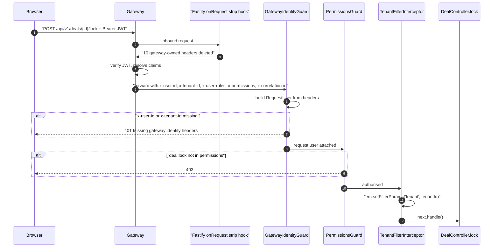

**What it shows.** The order is strip, verify, inject, guard, guard, interceptor,
handler. The strip is first because everything after it trusts what it left behind.

### When this hop fails

- **Header missing.** A request that reaches trading-service without transiting the
  gateway has no `x-user-id`/`x-tenant-id` and is rejected `401 Missing gateway
identity headers`. This is the _only_ thing stopping direct pod-to-pod calls: the
  guard is a header-trust guard, and the headers are plaintext and unsigned. The
  actual boundary is the network policy, not cryptography. A NetworkPolicy that
  isolates service pods from anything but the gateway is the load-bearing control
  here, and the guard is defence in depth.
- **Permission missing.** `PermissionsGuard` 403s. The server guard is the authority;
  the UI merely mirrors it. `deal:lock` is seeded to the administrator and
  managing-director roles in user-service.
- **No tenant context at all.** The interceptor leaves the EntityManager untouched.
  The global `tenant` filter is registered `default: true` with a `cond` that _throws_
  when invoked with no arguments:

  ```text
  MikroORM 'tenant' filter is active but no tenant context was provided.
  Disable it for a system/cross-tenant query with { filters: { tenant: false } },
  or provide { tenantId } / { platformScope: true }.
  ```

  This is fail-closed by construction. The alternative — silently dropping the
  `WHERE` clause — would leak across tenants, and an earlier version of this filter
  crashed with an opaque `TypeError` instead. A loud actionable error beats both.

---

## Hop 2 — A transaction opens and the aggregate mutates

### What happens

`LockDealUseCase.execute(dealId, userId, tenantId, correlationId?, ipAddress?)` does
eight things before it opens a transaction, then everything else inside one.

Before the transaction:

1. Load the full deal aggregate with all children populated
   (`IDealRepository.findByIdWithChildren`). 404 if absent.
2. Reject with `DealLockedError` (409) if `deal.isLocked()`.
3. Derive the aggregate's status from the state of its children via
   `DealStatusDeriver.derive` — the status is computed, never stored. Anything other
   than `LOCKABLE` is `DealNotLockableError` (422). _(The eligibility predicate itself
   is business policy and is not part of this export.)_
4. Flatten the aggregate into a calculation DTO.
5. Pre-load every reference-data row the calculation needs in one query and build a
   synchronous in-memory lookup, so the calculation makes no I/O. A referenced row
   missing from the database is a `ValidationException`, not a silent zero.
6. Compute the frozen monetary figure with `DealFinancialSummaryCalculator.calculate`
   — a `Big` decimal, never a float.
7. Resolve currency codes for the snapshot audit trail.
8. Build `ExchangeRateSnapshot` entities in memory (no database write yet).

Then `this.em.transactional(async (em) => { ... })` opens the unit of work, and the
first statement inside it re-loads the deal _with a row lock_:

```ts
const lockedDeal = await em.findOne(Deal, { id: dealId } as never, {
  lockMode: LockMode.PESSIMISTIC_WRITE,
});
if (!lockedDeal) throw new NotFoundException("Deal", dealId);
if (lockedDeal.isLocked()) throw new DealLockedError(dealId);
lockedDeal.lock(userId, grossProfit);
deal.lock(userId, grossProfit); // mirror onto the populated read-source
```

That double-load looks redundant and is not. An earlier version called `deal.lock()`
_outside_ the transaction and then persisted inside it, while the concurrency guard
checked a different entity instance from the one being written. Two concurrent lock
requests could each observe an unlocked deal, each pass the guard, and each flush
their own instance — the pessimistic lock was held but bypassed, because the entity it
protected was not the entity being written. The fix is that the mutation and the
persist now both target `lockedDeal`, the pessimistically-loaded row. The outer `deal`
is mutated only so the snapshot builder — which needs the populated children — sees
post-lock state; it is never flushed.

`Deal.lock()` itself is three lines of domain logic and one invariant:

```ts
lock(userId: string, grossProfit: Big): void {
  if (this._lockedAt !== null) {
    throw new DealLockedError(this.id, { lockedById: this._lockedById, lockedAt: this._lockedAt });
  }
  this._lockedAt = new Date();
  this._lockedById = userId;
  this._lockedGrossProfit = grossProfit;
}
```

`lockedAt` is assigned _inside_ the transaction so that the timestamp embedded in the
event payload is the same one that is committed to the row, even under crash-recovery.

### Diagram

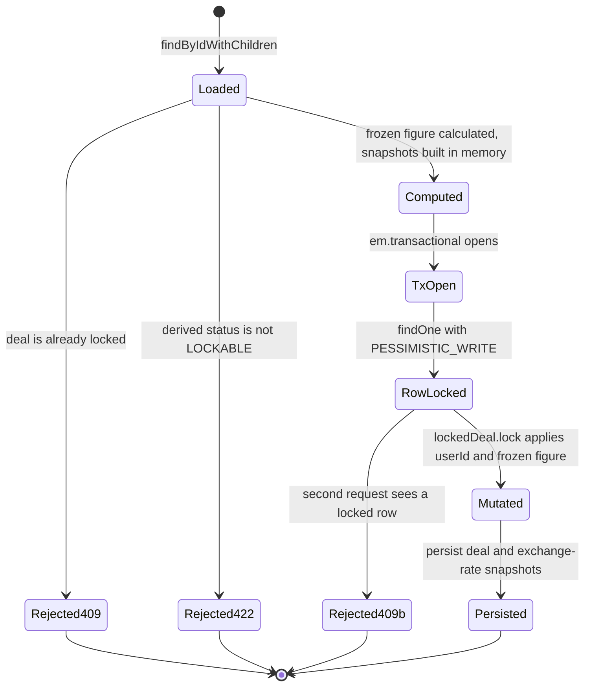

**What it shows.** Two independent rejection points guard the same invariant: an
optimistic pre-check outside the transaction that saves work, and an authoritative
re-check under the row lock that provides the guarantee.

### When this hop fails

- **Concurrent lock.** The second request blocks on `SELECT ... FOR UPDATE` until the
  first commits, then re-reads a locked row and gets `409`. The observable symptom is
  one success and one 409, never two successes.
- **Lock wait.** The snapshot builder is asynchronous (it batch-resolves customer,
  product, unit and user names through `IEntityNameResolver`) and it runs _while the
  write lock is held_. This is a documented correctness-over-throughput trade-off:
  lock operations are infrequent, and the alternative is a snapshot that does not
  match the committed row. Under a hot deal with a slow resolver you will observe
  lock waits on `deal` and, if PostgreSQL's `deadlock_timeout` is crossed with
  another writer, a deadlock abort.
- **Unresolvable unit or missing currency.** `ValidationException` before the
  transaction opens. Nothing is written, nothing is published.
- **Anything throwing inside the callback.** The transaction rolls back. Deal not
  locked, snapshots not written, outbox row not written. That last part is the point
  of the next hop.

---

## Hop 3 — The same transaction writes the outbox row

### What happens

Still inside `em.transactional`, after the deal and its exchange-rate snapshots have
been persisted, the use case builds the event envelope and hands it to the publisher:

```ts
const idempotencyKey = `${dealId}:${snapshotPayload.lockedAt}`;

const event: DomainEvent<DealLockedEventPayloadV2> = {
  eventId: v7(),
  eventType: "trading.deal.locked",
  version: 2,
  tenantId,
  userId,
  correlationId: correlationId ?? v7(),
  causationId: dealId,
  timestamp: new Date().toISOString(),
  payload: { ...snapshotPayload, idempotencyKey },
  ...(ipAddress && { ipAddress }),
  changedFields: ["status", "lockedAt", "lockedGrossProfit"],
  ...(traderIds.length > 0 && { recipientUserIds: traderIds }),
};
await this.eventPublisher.publish<DealLockedEventPayloadV2>(em, event);
```

Note what the envelope carries and what it does not. `causationId` is the deal id (the
thing that caused this event), `correlationId` is the gateway-issued request
correlation id or a fresh UUID v7 if the header was absent, `recipientUserIds` is the
de-duplicated set of trader ids scraped off the purchases and sales for notification
routing, and `changedFields` is a hand-written literal for the audit trail. There is
no `aggregateId` — remember that; it matters at hop 10.

`EventPublisher.publish` is deliberately tiny:

```ts
async publish<T>(em: EntityManager, event: DomainEvent<T>): Promise<void> {
  const entry = new OutboxEntry();
  entry.entryType = OutboxEntryType.DOMAIN_EVENT;
  entry.eventType = event.eventType;
  entry.payload = event as unknown as Record<string, unknown>;
  entry.routingKey = event.eventType;
  entry.status = OutboxEntryStatus.PENDING;
  em.persist(entry);
}
```

Four properties of that method carry the whole atomicity guarantee:

1. **It takes the caller's `EntityManager` as its first argument.** It does not
   inject one, does not resolve one from a request context, and does not fork.
2. **It calls `persist`, never `flush`.** The row joins the caller's unit of work and
   is written by the caller's `COMMIT`.
3. **It stores the entire envelope in `payload`.** The `jsonb` column holds the
   `DomainEvent<T>`, not just `T`. What the relay later publishes is a byte-for-byte
   `JSON.stringify` of this column.
4. **It sets `routingKey = eventType`, unconditionally.** No version suffix is ever
   appended. This is the defect described at hop 6.

This is the **caller-owned-EM convention**, and it is restated verbatim in every
service-local adapter that implements the same port. From
`apps/platform/tenant-service/src/infrastructure/outbox-event-publisher.adapter.ts`:

> `publish` enlists in the CALLER's transaction — it `persist`s the `OutboxEntry` on
> the caller-provided `EntityManager` and never forks or flushes. The caller MUST wrap
> the domain write and this call in a single `em.transactional(...)` block, so the
> outbox row commits (or rolls back) atomically with the state change.

The convention exists because forking is the single easiest way to destroy the outbox
guarantee. A forked EntityManager gets its own connection and its own transaction. If
an adapter forks and flushes, the outbox row commits independently of the business
write, and you are back to the dual-write problem the outbox was adopted to solve —
except now it is disguised behind a method named `publish` that looks transactional.

The convention is not uniformly honoured. `TradingEventPublisher`, the trading-service
wrapper used by every trading event _other_ than the lock, contains:

```ts
const em = callerEm ?? this.em.fork();
...
if (!callerEm) { await em.flush(); }
```

That fallback is exactly the anti-pattern. It is safe only as long as every call site
passes a caller EM; nothing in the type system enforces it, because `callerEm` is
optional. `LockDealUseCase` sidesteps the wrapper entirely and calls the raw
`EventPublisher` with an explicit transactional EM — which is why the lock event also
has to record its deal-activity projection by hand (see hop 4).

The row that lands looks like this (DDL from the shared migration, identical in
auth-service and tenant-service):

```sql
CREATE TABLE IF NOT EXISTS "platform_outbox"."outbox_entry" (
  "id"           uuid         NOT NULL,
  "entry_type"   varchar(255) NOT NULL,
  "event_type"   varchar(255) NOT NULL,
  "payload"      jsonb        NOT NULL,
  "routing_key"  varchar(255) NOT NULL,
  "status"       varchar(255) NOT NULL DEFAULT 'PENDING',
  "retry_count"  int          NOT NULL DEFAULT 0,
  "last_error"   text         NULL,
  "created_at"   timestamptz  NOT NULL DEFAULT now(),
  "published_at" timestamptz  NULL,
  CONSTRAINT "outbox_entry_pkey" PRIMARY KEY ("id")
);
CREATE INDEX IF NOT EXISTS "idx_outbox_pending"
  ON "platform_outbox"."outbox_entry" ("status", "created_at");
```

The primary key is a UUID **v7**, so ids are time-ordered and the index on
`(status, created_at)` is the exact shape the relay's claim query needs.

`OutboxEntry` deliberately does **not** extend `TenantBaseEntity`. It is a
platform-level table in its own `platform_outbox` schema, shared by every
outbox-writing service in the same database. That decision has a consequence which
surfaces at hop 5: the relay has no tenant context, so every one of its queries must
explicitly disable the global tenant filter.

### Diagram

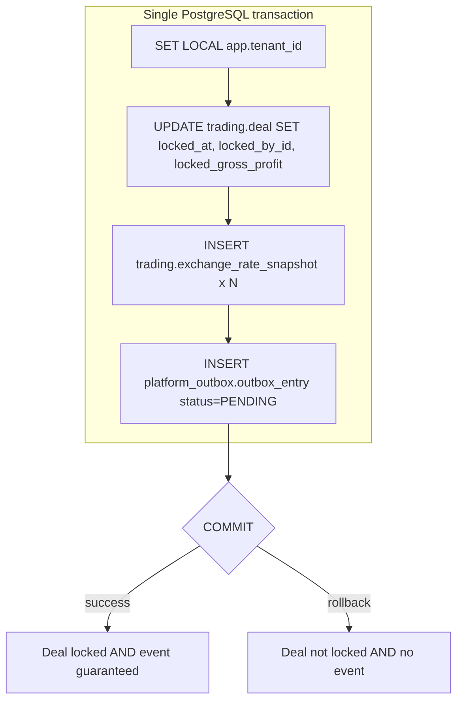

**What it shows.** There is no ordering in which the deal is locked without the event,
or the event exists without the lock. That is the entire value proposition of the
pattern, and it is delivered by one `COMMIT`, not by any retry logic.

### When this hop fails

- **The adapter forks.** The outbox row commits on its own connection. If the business
  transaction then rolls back you have published a phantom event describing a state
  change that never happened — strictly worse than losing an event, because consumers
  will act on it. Conversely, if the fork's flush fails after the business commit, the
  state change happened and no event exists. Both failure modes are silent.
- **The outbox entity is not registered with MikroORM.** `em.persist()` on a class
  MikroORM has no metadata for raises a metadata error and aborts the transaction, so
  the lock 500s and nothing is written. **This is the state of trading-service on the
  branch that was read.** Its `app.module.ts` entity array registers 24 entities —
  `Deal`, `Purchase`, `Sale`, `ProcessedEvent`, `ParkedMessage`, `IdempotencyKey` and
  the rest — and does not include `OutboxEntry`. No shared helper adds it:
  `createMikroOrmConfig` passes `options.entities` straight through. The
  testcontainers harness at `test/testcontainers/setup.ts` _does_ register it, with a
  comment saying exactly why ("the lock / batch-lock flows publish `trading.deal.locked`
  events through EventPublisher, which persists an `OutboxEntry` in the same
  transaction"), which means the integration suite exercises a configuration
  production does not have. inventory-service's module carries the counterpart
  comment describing the same omission as a shipped incident: without the
  registration, "every poll cycle throws _Metadata for entity OutboxEntry not found_".
  **Unverified:** the precise HTTP status trading-service returns today was not
  observed at runtime — only the registration gap and the documented failure mode of
  the equivalent gap elsewhere.
- **Constraint violation on the outbox insert.** Rolls back the whole transaction,
  including the lock. Correct: a deal must not be lockable if its event cannot be
  recorded.

---

## Hop 4 — Commit, and the moment of inevitability

### What happens

`em.transactional` resolves. MikroORM's unit of work has issued the deal update, the
snapshot inserts and the outbox insert on one connection, and the `COMMIT` has
returned. The `SET LOCAL app.tenant_id` GUC set at transaction start goes out of scope
with it.

From this instant the event is _inevitable_. Not delivered — inevitable. Nothing about
the process that produced it needs to survive: the pod can be killed, the connection
pool can be drained, the broker can be down for a week. The event is a committed row
in a table that a poller will find.

This is the crossover point where a distributed-systems guarantee replaces a
programming-language guarantee. Everything before the commit is enforced by types,
guards and a transaction. Everything after it is enforced by durable state and
at-least-once retry.

One thing does happen after the commit, deliberately outside the transaction:

```ts
if (lockedEvent) {
  await this.activityRecorder?.record(lockedEvent);
}
```

`DealActivityRecorder` projects the event into a deal-activity read model. It is
declared `@Optional()`, it runs after commit so a rolled-back lock never leaves an
activity row, and it swallows its own errors:

```ts
catch (error) {
  this.logger.warn(`deal-activity projection skipped for ${event.eventType} (${event.eventId}): …`);
}
```

The contract is explicit: best-effort, eventually consistent, rebuildable from the
outbox. It must never break the authoritative write. This is worth internalising as a
pattern — a read model derived from an event should never be able to fail the
transaction that produced the event.

### Diagram

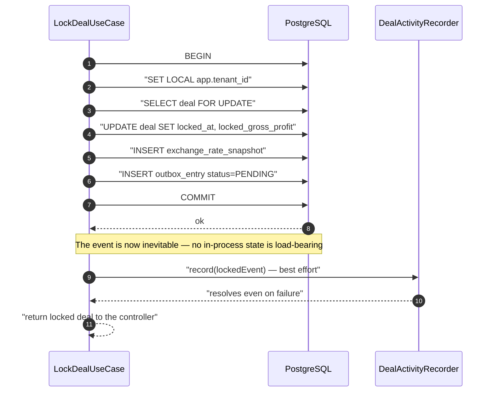

**What it shows.** Everything that must be atomic is above the `COMMIT`. Everything
below it is allowed to fail without consequence for correctness.

### When this hop fails

- **Commit fails.** Serialization failure, connection loss, disk full — the whole unit
  of work is gone. The caller sees a 5xx. No deal lock, no event. Retryable by the
  user with no cleanup.
- **Process dies immediately after commit.** The deal is locked, the outbox row is
  `PENDING`, and the activity projection never ran. The relay will still publish; the
  activity feed will be missing one row until it is rebuilt. This asymmetry is by
  design.
- **The activity recorder throws.** Logged at `warn`, request still succeeds with 200.
  You will see `deal-activity projection skipped` in logs and a gap in the feed.

---

## Hop 5 — The relay claims the row under an advisory lock

### What happens

`OutboxRelay` is a plain injectable with a self-rescheduling `setTimeout` loop. It is
constructed by `EventBusModule.forRoot` only when `enableRelay: true`, and it starts
polling when `setDependencies(em, channel)` is called — which happens after
`RabbitMqConnection.whenReady()` resolves and two exchange checks pass.

The loop never overlaps: `scheduleNextPoll` awaits the current cycle before arming the
next timer, and the in-flight promise is cleared in a `finally` so `onModuleDestroy`
can await a genuinely in-flight cycle rather than a stale resolved one.

A cycle is three phases, and the phase boundaries are the interesting part:

```ts
async pollAndPublish(em, channel): Promise<void> {
  const claimed = await this.claimPendingEntries(em);   // Phase 1 — short tx, advisory lock
  if (claimed.length === 0) return;
  const results = await this.publishClaimedEntries(channel, claimed);  // Phase 2 — no tx
  await this.persistEntryResults(em, results);          // Phase 3 — short txs
}
```

Phase 1 in full:

```ts
return await em.transactional(async (txEm) => {
  const lockResult = await txEm.execute(
    `SELECT pg_try_advisory_xact_lock(${Number(lockId)}) AS acquired`
  );
  if (!(lockResult[0]?.acquired ?? false)) return [];

  const entries = await txEm.find(
    OutboxEntry,
    { status: OutboxEntryStatus.PENDING },
    {
      orderBy: { createdAt: "ASC" },
      limit: this.config.batchSize,
      filters: { tenant: false },
    }
  );
  if (entries.length === 0) return [];
  for (const entry of entries) entry.status = OutboxEntryStatus.PUBLISHING;
  await txEm.flush();
  return entries;
});
```

Four design choices are packed into that block.

**`pg_try_advisory_xact_lock`, not `pg_try_advisory_lock`.** The transaction-scoped
variant auto-releases on commit _or rollback_. A session-scoped lock leaks if the
connection dies mid-cycle and would wedge every replica until the backend is reaped.
`try_` (not the blocking form) means a losing replica returns immediately and waits for
its next tick rather than queueing.

**The lock covers the claim only, not the publish.** By the time Phase 2 runs, the
transaction has committed and the lock is gone. Exclusivity is not provided by the
lock during publish — it is provided by the _state transition_: the claimed rows are
now `PUBLISHING`, and the claim query filters `status = PENDING`. Another replica
polling one millisecond later simply cannot see them.

**`{ filters: { tenant: false } }` on both the `find` and, later, the `nativeUpdate`.**
MikroORM v6 applies registered filters to `nativeUpdate`/`nativeDelete` as well as
`find`. The relay runs on a background timer with no request and therefore no tenant
context, and the global filter fails closed by throwing. Forget the disable on the
`find` and the relay claims nothing; forget it on the Phase-3 update and every claimed
entry is stranded in `PUBLISHING` forever.

**Ordering is `createdAt ASC`, batch is 100 by default.** Combined with UUID v7 ids
this gives approximate per-producer ordering. It is _not_ a global ordering guarantee
and there is no per-aggregate ordering guarantee at all — two events for the same deal
can be published in the same batch and delivered to different consumers in different
orders, because each consumer has its own queue.

Defaults: `pollIntervalMs` 1000, `batchSize` 100, `maxRetries` 5, `advisoryLockId`
900001, `publishConfirmTimeoutMs` 30000, `persistChunkSize` 10.

> **Documentation drift, verified.** ADR-0018 states the relay polling delay is
> "typically 100–500 ms". The shipped default is 1000 ms and no service overrides it.

Advisory lock ids are allocated per service so that relays sharing a database do not
contend. Each service declares a default in its Zod config schema, and the bundles
inject `OUTBOX_ADVISORY_LOCK_ID` as an environment variable. Two things about that
registry are worth knowing:

- `EventBusModule.createOutboxRelay` reads `process.env['OUTBOX_ADVISORY_LOCK_ID']`
  **directly**, not the validated config object. If the env var is unset the relay
  falls back to its own constructor default of `900001`, _not_ to the service's Zod
  default. The identity bundle sets no `OUTBOX_ADVISORY_LOCK_ID` for any of its
  services, so auth-, tenant- and user-service relays all run on lock id `900001`.
  **Unverified:** whether those three share a PostgreSQL database. If they do, two of
  the three starve; if they are on separate clusters (there is a per-BC CNPG cluster
  layout) the lock namespaces are disjoint and it is harmless.
- The Zod defaults contain one outright collision: accounting-service and ai-service
  both default to `900007`. Latent only — neither runs a relay.
- The chart-injected values and the code defaults disagree for six of eight bundled
  services (for example accounting is `900007` in code and `900010` in the chart).
  Since the env var wins, the chart is the operative value; the code default is dead
  configuration that will mislead the next reader.

**Expected duration.** A committed `PENDING` row waits for the next tick: 0–1000 ms with
the shipped `pollIntervalMs`, roughly 500 ms on average. Every cycle in which a replica
loses the advisory lock costs one further poll interval, so contention is measured in
seconds. The hop is unbounded only when the relay is disabled or its claim query throws,
and in neither case does anything time out — which is why the outbox-lag gauge rather
than a deadline is the detector.

### Diagram

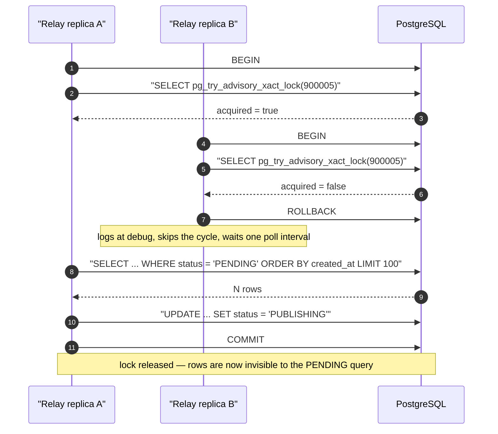

**What it shows.** Two mutually reinforcing mechanisms: the lock serialises the
_claim_, and the status flip makes the claim durable so exclusivity survives the
lock's release.

### When this hop fails

- **Another replica holds the lock.** Debug log, empty batch, retry in one second.
  Completely normal steady-state behaviour when replicas > 1.
- **The claim transaction throws.** Caught, logged at `error`, returns an empty array.
  The cycle does not propagate the error and the loop is not killed. Rows stay
  `PENDING` and are retried next tick. The observable signal is
  `acme_trading_outbox_lag_seconds` climbing.
- **The tenant filter disable is removed.** Every cycle throws in the `cond`, is
  swallowed by the same catch, and the relay silently publishes nothing. The only
  detector is the outbox-lag gauge.
- **The relay is not enabled at all.** `enableRelay` is a compile-time module option,
  not an environment flag. `EventBusModule.forRoot` logs a `warn` at boot —
  "OutboxRelay is DISABLED — events written to outbox will NOT be published to
  RabbitMQ" — and returns a module with no relay provider. Rows accumulate `PENDING`
  forever. **trading-service ships `enableRelay: false`.** Its own
  `OutboxLagObserver` is the detector, recomputing every 15 seconds:

  ```sql
  SELECT payload->>'tenantId' AS tenant,
         EXTRACT(EPOCH FROM (now() - min(created_at))) AS lag_seconds
    FROM platform_outbox.outbox_entry
   WHERE status = 'PENDING'
   GROUP BY payload->>'tenantId'
  ```

  and alerting at 60 s (warning) and 300 s (critical). A gauge that is permanently
  pegged for a service whose relay is switched off is the single loudest fact in this
  document.

---

## Hop 6 — Publish, with confirms, and the version gate

### What happens

Phase 2 iterates the claimed entries **outside any transaction**, because a broker
publish has side effects a database cannot roll back. Each entry is wrapped in its own
`try/catch`, so a single failure never aborts the batch:

```ts
for (const entry of claimed) {
  try {
    const exchange = this.deriveExchange(entry.eventType);
    await this.publishToChannel(channel, exchange, entry);
    results.push({ entry, success: true });
  } catch (error) {
    results.push({ entry, success: false, error });
  }
}
```

`deriveExchange` takes the first dotted segment of the event type: `trading.deal.locked`
→ `acme.trading`. An event type with no dot throws — the relay refuses to guess.

`publishToChannel` then runs a four-step decision:

1. **Resolve the version.** `entry.payload.version` absent or null defaults to `1` for
   backwards compatibility with producers older than ADR-0036. Anything that is not an
   integer ≥ 1 is a fault and goes to the dead-letter exchange.
2. **Validate version against routing key.** `validateVersionRoutingKeyMatch` parses
   the `\.v(\d+)$` suffix of `entry.routingKey` (absent implies version 1) and compares
   it to the envelope version. Disagreement is a programmer error, not a transient
   fault, and is dead-lettered.
3. **Publish to the bounded-context exchange** through `publishToBoth`, which derives
   the canonical routing key from `entry.eventType` and the version, and — only when
   `transitionVersion === version && version > 1` — also publishes to the un-suffixed
   base key.
4. **Publish the audit copy** to the `acme.audit-feed` fanout (hop 11).

Every publish uses **publisher confirms**. `publishConfirmed` wraps
`ConfirmChannel.publish` with `{ persistent: true, headers }` and resolves only when
the broker's confirm callback fires:

```ts
return new Promise((resolve, reject) => {
  const ok = channel.publish(
    exchange,
    routingKey,
    payload,
    { persistent: true, headers },
    (err) => {
      if (err) reject(err);
      else resolve();
    }
  );
  if (!ok) {
    /* channel buffer full — amqplib still queues; confirm settles the promise */
  }
});
```

The two publishes of a dual-publish are submitted through `Promise.allSettled`, not
sequentially. Sequential submission has a nasty failure mode: canonical confirms,
legacy fails, the entry is marked failed, the retry republishes canonical — duplicate
delivery on the canonical key. Submitting both into the confirm window first and only
then collecting results means any rejection fails the entry as a whole. A retry can
still duplicate the canonical key, which is accepted precisely because consumers are
required to be `eventId`-idempotent. The code carries a `TODO` for a per-entry publish
checkpoint column that would let a retry skip already-confirmed keys.

Every publish is additionally bounded by `withConfirmTimeout` (default 30 s). Without
it, an AMQP channel that TCP half-closes without invoking the confirm callback leaves
the promise pending forever — which stalls the cycle, and because `onModuleDestroy`
awaits the in-flight cycle, stalls `SIGTERM` handling too. The helper also attaches its
own `.catch` to the inner promise as defence in depth, so a late rejection arriving
after `Promise.race` has already settled cannot surface as an unhandled rejection.

W3C trace context is injected into the message headers from the active OpenTelemetry
span (`api.propagation.inject`), and `OutboxRelay.extractTraceContext` is the static
counterpart consumers use to continue the trace across the message boundary. Both
resolve `@opentelemetry/api` through a lazy `require` inside a `try`, so the library
stays an optional runtime dependency and its absence degrades to a debug log.

Phase 3 then writes the outcome. Results are chunked (default 10 per transaction, a
tenfold reduction in `BEGIN`/`COMMIT` round trips versus per-entry) and each row is
updated with an optimistic-lock predicate:

```ts
await txEm.nativeUpdate(
  OutboxEntry,
  { id: item.entry.id, status: item.snapshot.status }, // still PUBLISHING?
  item.target,
  { filters: { tenant: false } }
);
```

Three outcomes per row:

| Outcome            | Meaning                                                                                          | Relay behaviour                                                                                                 |
| ------------------ | ------------------------------------------------------------------------------------------------ | --------------------------------------------------------------------------------------------------------------- |
| `affected > 0`     | Normal                                                                                           | In-memory entity already matches the row                                                                        |
| `affected === 0`   | Optimistic lock lost — an admin, a recovery tool or the reaper moved the row out of `PUBLISHING` | Revert in memory, `warn`, do **not** retry — the external writer is authoritative                               |
| Transaction throws | Database error mid-chunk                                                                         | Revert all entries in the chunk, `error` per entry, increment `outbox_relay_stuck_publishing_total{event_type}` |

On success the row becomes `PUBLISHED` with `published_at` set, and — if the event type
has secret fields declared — its stored payload is rewritten with those fields
stripped, so a raw bearer token does not linger at rest in the outbox row it was
published from.

On failure `retry_count` is incremented and `last_error` recorded; the row returns to
`PENDING` if the retry budget survives, or flips to `FAILED` at `maxRetries` (5) with
an `error`-level log.

The crucial invariant of the whole phase split: **a Phase-3 failure leaves the row in
`PUBLISHING`, never back in `PENDING`.** An earlier design wrapped the entire cycle in
one transaction; a rollback after N successful publishes reverted N rows to `PENDING`
and the next cycle re-delivered every one of them. Leaving them stuck is the _safe_
state, because the claim query only sees `PENDING`. The cost of that safety is orphans,
which is what the reaper at hop 12 exists to surface.

**Expected duration.** A publisher confirm on a healthy channel settles in single-digit
milliseconds; `publishConfirmTimeoutMs` caps the wait at 30 s. A failed entry costs that
30 s plus one poll interval before its next attempt, so exhausting the retry budget of
five takes on the order of two and a half minutes from first attempt to `FAILED`.

### Diagram

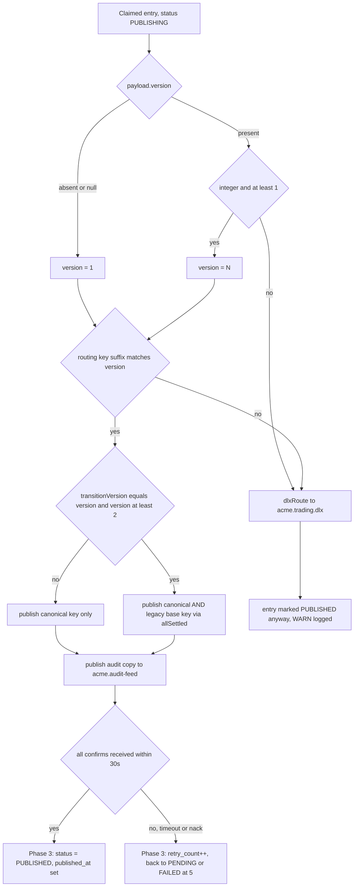

**What it shows.** A structural fault (bad version, mismatched key) is _not_ retried —
it is dead-lettered and the row is closed out, because retrying a programmer error a
further four times helps nobody. Only transport faults consume the retry budget.

### When this hop fails

- **Broker nack or channel closed.** The confirm callback receives an error, the entry
  is recorded as a failure, and Phase 3 returns it to `PENDING`. Next cycle retries.
  Fully recoverable.
- **Confirm never arrives.** The 30-second timeout fires and the entry is treated as a
  publish failure. `last_error` reads _"OutboxRelay publish confirm timeout after
  30000ms … AMQP channel did not invoke the confirm callback — likely a dropped
  connection. Entry will be retried via Phase 3 retry budget."_ During a dual-publish
  window the context label deliberately says the hang could be on either key, so an
  operator does not misattribute it to the stored routing key.
- **Confirm arrives _after_ the timeout.** The publish really did happen. The entry is
  retried anyway and the message is delivered twice. This is the concrete reason
  consumers must be idempotent — it is not a theoretical at-least-once hand-wave.
- **Phase 3 throws.** Up to `persistChunkSize` rows are stranded in `PUBLISHING`,
  each producing an `error` log naming the entry id, the publish outcome and the event
  type, plus one increment of `outbox_relay_stuck_publishing_total`. The messages were
  published; only the bookkeeping was lost.
- **Version/routing-key mismatch — and this is where the specimen dies.**
  `EventPublisher.publish` writes `routingKey = eventType`. `LockDealUseCase` writes
  `version: 2`. So for this event `validateVersionRoutingKeyMatch({ routingKey:
'trading.deal.locked', eventVersion: 2 })` finds no `\.v(\d+)$` suffix, infers
  `expectedVersion = 1`, and returns invalid. The relay dead-letters it to
  `acme.trading.dlx` with `reason: VERSION_BINDING_MISMATCH`, logs a `warn`, and marks
  the row `PUBLISHED` so it is never retried. **No bounded-context consumer would ever
  receive it.** Nothing in the outbox write path can produce a `.vN` suffix: all four
  assignment sites in the repository set `routingKey` to the event type or the job
  queue name, and `buildVersionedRoutingKey` — the only function that appends a suffix —
  is called exclusively from `publishToBoth`, which is _downstream_ of the validator.
  The relay's own test suite proves the behaviour: _"mismatch: routing key has no .v2
  suffix but payload claims version 2"_ asserts the DLX route. Because
  trading-service's relay is off, this fault is currently masked by the earlier one.
- **The dead-letter copy is not retained.** `dlxRoute` publishes with
  `routingKey = originalRoutingKey`, but the retention DLQ is bound to the DLX with the
  fixed key `dead-letter`. The message therefore reaches the exchange, matches no
  binding, and is dropped. The relay's own comment concedes this: _"`<exchange>.dlx` is
  declared but has no bound DLQ yet, so the published copy is not retained — the WARN
  log is the current forensic record."_ The original payload rides on the
  `x-acme-original-payload` header for a replay tool that does not yet have a queue to
  read from.

---

## Hop 7 — The exchange routes, the bindings select

### What happens

The message arrives at `acme.trading`, a **durable topic exchange**, which the publisher
does not declare. `charts/platform-rmq-bootstrap` declares all ten exchanges — nine
per-bounded-context topics plus the `acme.audit-feed` fanout — as RabbitMQ `Exchange`
custom resources at ArgoCD sync-wave −4, one wave after the vhost. (The topology
deep-dive covers the chart in full; what matters here is why it exists.)

Declaring them centrally removes a startup-ordering coupling. A consumer must bind to
an exchange owned by a _different_ bounded context, and bounded-context isolation
denies it `configure` permission on that exchange — so the consumer helper verifies the
source exchange **passively** with `checkExchange` (a passive declare, which needs no
`configure`) rather than actively asserting it. Passive verification only works if the
exchange already exists; the bootstrap guarantees that. Before this, an upstream
bounded context being down crash-looped its downstream consumers with
`403 ACCESS_REFUSED`.

Which queues would receive `trading.deal.locked`:

| Queue                        | Binding                                                                          | Receives base key `trading.deal.locked` | Receives canonical `…locked.v2` |
| ---------------------------- | -------------------------------------------------------------------------------- | --------------------------------------- | ------------------------------- |
| `inventory-service.trading`  | `trading.#`                                                                      | yes                                     | yes                             |
| `reporting-service.trading`  | `trading.#`                                                                      | yes                                     | yes                             |
| `commission-service.trading` | `trading.deal.locked`, `trading.deal.locked.v2`, `trading.credit-note.finalised` | yes                                     | yes                             |
| `accounting-service.trading` | six exact keys including `trading.deal.locked`                                   | yes                                     | **no**                          |
| `document-service.events`    | four exact `trading.*.confirmed` keys                                            | no                                      | no                              |
| `audit.events`               | fanout on `acme.audit-feed`                                                      | yes (separate lane)                     | yes (separate lane)             |

That table contains the whole point of ADR-0036 in one row. commission-service binds
_both_ keys — it is the service that is mid-migration, and its dispatch switch keys off
`msg.fields.routingKey` rather than `event.eventType`, because for v1 and v2 the event
type is identical and only the broker-side routing key discriminates:

```ts
const routingKey: string = msg.fields?.routingKey ?? event.eventType;
switch (routingKey) {
  case 'trading.deal.locked':    await this.calculateCommission.execute(...); break;
  case 'trading.deal.locked.v2': await this.calculateCommission.execute(...); break;
  case 'trading.credit-note.finalised': await this.applyAdjustment.execute(...); break;
}
```

accounting-service binds only the un-suffixed key. It dispatches on `event.eventType`,
so it _would_ handle a `.v2`-routed message — it simply never receives one. The only
reason accounting keeps working during the migration is the dual-publish window
configured in the trading bundle:

```yaml
# Event-bus migration window: trading.deal.locked v1 -> v2 (ADR-0036).
# REMOVE this block once:
#   1. commission-service is fully deployed on the v2 consumer, AND
#   2. the observation window (>=1 business day with zero v1 lag) has passed.
eventBus:
  transitionVersion: 2
```

Which means: **closing the transition window as instructed would silently cut
accounting-service off from `trading.deal.locked`.** The exit criteria name
commission-service only. accounting-service's binding would have to gain
`trading.deal.locked.v2` first, and nothing in the comment or the chart says so.

`charts/platform-base` renders `EVENT_BUS_TRANSITION_VERSION` into both the Deployment
and the Rollout templates, but only when the value is set; a helm-unittest asserts both
the present and the absent case.

### Diagram

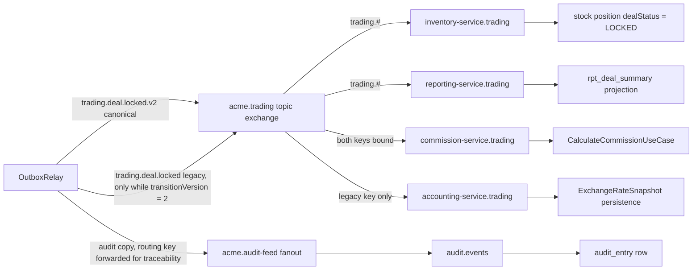

**What it shows.** Two lanes leave the relay for every single event: the
bounded-context topic lane, which is selective, and the audit fanout lane, which is
not. The wildcard binders (`trading.#`) are version-agnostic by accident; the exact
binders are version-sensitive by construction.

### When this hop fails

- **Exchange does not exist.** The publish fails with `NOT_FOUND` and the channel
  closes. The entry is recorded as a publish failure and retried. If the exchange is
  permanently absent the entry burns its five retries and lands in `FAILED`.
- **Message matches no binding.** RabbitMQ silently drops it. There is no `mandatory`
  flag set and no return listener registered anywhere in the relay, so an unroutable
  publish is still _confirmed_ and the entry is marked `PUBLISHED`. This is the single
  quietest failure in the entire pipeline: publisher confirms guarantee the broker
  accepted the message, not that anything will ever consume it.
- **Permission denied.** The service's RabbitMQ user has a `write` regex scoped to its
  own bounded context plus `acme.audit-feed`. Publishing to a foreign exchange yields
  `403 ACCESS_REFUSED` and closes the channel. This is what makes the shared-outbox
  design load-bearing: a relay only ever publishes events whose type prefix maps to an
  exchange it is permitted to write.

---

## Hop 8 — The broker persists and delivers

### What happens

Every consumer queue on the platform is declared the same way:

```ts
await channel.assertQueue(QUEUE_NAME, {
  durable: true,
  arguments: {
    "x-queue-type": "quorum",
    "x-dead-letter-exchange": DLX_NAME,
    "x-dead-letter-routing-key": "dead-letter",
  },
});
```

`x-queue-type: quorum` is pinned explicitly even though the broker's
`default_queue_type` is already `quorum`, because a redeclare against leftover
classic-queue state trips `PRECONDITION_FAILED` on inequivalent arguments. Quorum
queues are Raft-replicated and persist to disk; combined with `persistent: true` on
every publish, an accepted message survives a broker restart.

Declaration order matters and is enforced: the dead-letter exchange is asserted
_before_ the queue that references it, because some broker versions reject a quorum
queue whose `x-dead-letter-exchange` does not yet exist. Then the dead-letter _queue_
is asserted and bound to the DLX with the fixed key `dead-letter`, before the main
queue — so the DLX-to-DLQ path exists by the time any message can dead-letter. A DLX
with no bound queue is a black hole, and this ordering is the fix for having shipped
exactly that.

Every consumer sets `prefetch(1)`. That is a deliberate, uniform choice across
inventory, commission, accounting, reporting, document, notification and the shared
helper: one unacknowledged message per consumer at a time. It gives even distribution
across replicas and bounded memory per consumer, at the cost of throughput. For an
event that triggers a multi-row financial calculation, sequential processing is the
right trade.

One caveat on the durability story: the development broker runs `replicaCount: 1`, so
those quorum queues sit at replication factor one — a valid single-member quorum with
no high availability. That is a dev-environment sizing choice, not platform design.

### Diagram

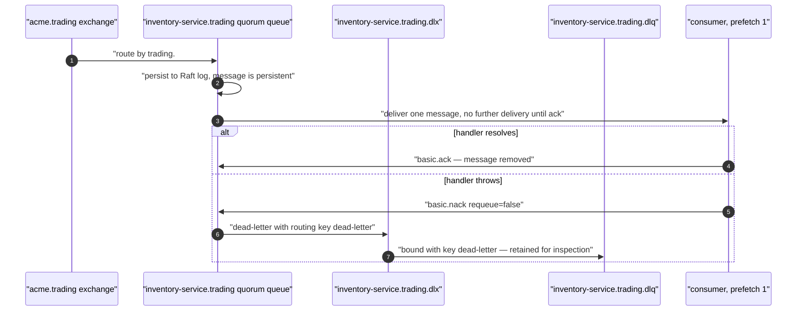

**What it shows.** `nack(msg, false, false)` — no multiple, no requeue — is the only
rejection form used anywhere. Nothing is ever requeued to the same queue, so a
poison message cannot spin.

### When this hop fails

- **Broker restarts.** Persistent messages in a durable quorum queue survive. Consumer
  channels close; each consumer's `close` handler schedules a reconnect with
  exponential backoff and jitter, capped and bounded by a maximum attempt count. The
  backoff exists specifically to prevent a synchronised retry storm when every replica
  reconnects at once.
- **Consumer dies mid-handler.** The message was never acked, so the broker redelivers
  it — to the same or a different replica. This is the primary source of duplicate
  delivery in practice, and it is what hop 9 exists to absorb.
- **Handler throws.** `nack` without requeue routes the message to the DLX and, via
  the `dead-letter` binding, into the retention DLQ. Reprocessing is a manual
  operation.
- **Reconnect budget exhausted.** The consumer logs _"Max reconnect attempts … reached
  for queue=… — manual intervention required"_ and stops. The failure counter is reset
  to zero after every successful setup, so a long-lived pod that survives many isolated
  blips never crosses the cap — only an unbroken failure streak does. `error` and
  `close` are handled asymmetrically on purpose: amqplib emits `error` then `close` for
  a server-side channel exception, so recovery is driven by `close` alone and `error`
  only logs, otherwise a single failure spawns two overlapping reconnect chains.

---

## Hop 9 — The consumer receives, and the inbox rejects a duplicate

### What happens

Take inventory-service as the reference consumer. Its message callback is:

```ts
const event: DomainEvent = JSON.parse(msg.content.toString());
const tenantId =
  (event.payload as { tenantId?: string })?.tenantId ?? event.tenantId;
if (!tenantId) {
  channel.nack(msg, false, false);
  return;
}
await TenantContext.run({ tenantId }, async () => {
  await this.dispatch(event);
});
channel.ack(msg);
```

Three things happen there that are easy to miss.

**Tenant is re-established from the message, not from a request.** An AMQP consumer
callback fires outside any request context, and `AsyncLocalStorage` does not propagate
into it — the `TenantContext` documentation lists RabbitMQ handlers explicitly among
the boundaries that require re-entry. Every consumer on the platform wraps its dispatch
in `TenantContext.run`. Skip it and the fail-closed tenant filter throws on the first
query.

**The payload's `tenantId` wins over the envelope's.** Both carry it and they are
expected to agree; the payload is preferred with the envelope as fallback.

**A missing tenant is a dead-letter, not a crash.** `error` log, `nack`, done.

`dispatch` then wraps routing in the inbox:

```ts
await withInbox(
  this.em.fork(),
  INVENTORY_TRADING_CONSUMER,
  event.eventId,
  event.eventType,
  () => this.routeToHandler(event)
);
```

and `withInbox` is eleven lines that encode a carefully-argued ordering:

```ts
const inbox = new MikroOrmProcessedEventRepository(em);
if (await inbox.hasProcessed(consumer, eventId)) {
  recordConsumerRedelivery(consumer, eventType);
  return false;
}
await apply();
await inbox.recordOnce(consumer, eventId);
return true;
```

The dedup key is `(consumer, eventId)`, and `INVENTORY_TRADING_CONSUMER` is a single
constant shared by all eight of the service's `trading.#` handlers — so one row
deduplicates a redelivered event across every handler that might have touched it.

**The inbox row is written _after_ `apply()`, never before.** That is the opposite of
the naive implementation and it is deliberate. Inventory's stock handlers persist
through per-operation forked EntityManagers — each repository `save()` is its own
transaction — so no single caller transaction can span both the inbox insert and every
stock write. Given that, there are two possible orderings and only one is safe:

- _Record first, then apply._ A crash between them marks the event processed while the
  state change never happened. The event is lost permanently and silently. This is the
  documented anti-pattern.
- _Apply, then record._ A crash between them re-runs `apply()` on redelivery, which is
  safe because every handler is independently idempotent — the per-effect guarantee is
  a `UNIQUE` index on `stock_movement.event_id`.

So the inbox is not the _only_ idempotency mechanism; it is the cheap outer layer over
a per-effect inner layer. The inbox turns a duplicate into a no-op costing one indexed
lookup; the unique index turns a duplicate that slips past the inbox into a rejected
insert.

`MikroOrmProcessedEventRepository.recordOnce` layers two more guarantees:

```ts
if (this.reserved.has(key)) return false; // synchronous, BEFORE the first await
this.reserved.add(key);
const existing = await this.em.findOne(
  ProcessedEvent,
  { consumer, eventId },
  { filters: false }
);
if (existing) return false;
const row = new ProcessedEvent();
row.consumer = consumer;
row.eventId = eventId;
this.em.persist(row);
try {
  await this.em.flush();
} catch (error) {
  if (error instanceof UniqueConstraintViolationException) return false; // benign
  throw error;
}
return true;
```

The `reserved` `Set` closes the in-process window between two concurrent calls on the
same key _before any `await`_ — the first caller reserves synchronously, so a sibling
short-circuits without racing on the read. Across processes the composite primary key
`(consumer, event_id)` is the arbiter, and a losing insert surfaces as a
`UniqueConstraintViolationException` that is caught and reported as a duplicate rather
than rethrown.

Note `{ filters: false }` on both reads. `ProcessedEvent` deliberately is **not** a
`TenantBaseEntity` — its identity is `(consumer, event_id)` and it holds no
tenant-owned data — but the production ORM registers the global fail-closed tenant
filter as `default: true`, so a tenant-exempt read must disable it explicitly. Both
columns are `text`, not `uuid`, because event ids are opaque strings and a `uuid`
column would reject a non-UUID id and break dedup outright.

Every dedup hit increments `acme_inventory_consumer_redeliveries_total{consumer,
event_type}` — a dependency-free in-process counter, because the platform services do
not yet vendor a Prometheus client.

### Diagram

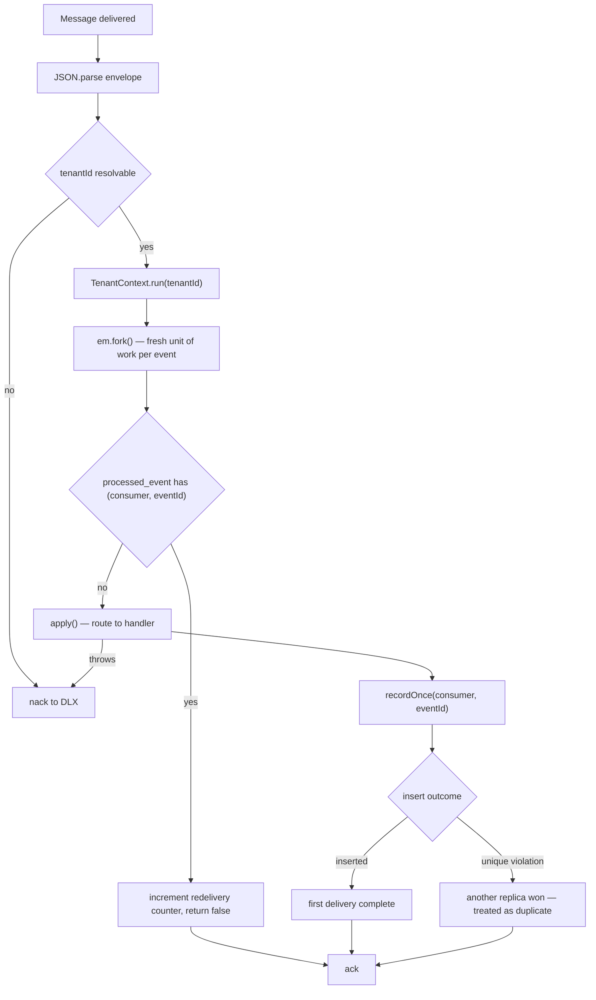

**What it shows.** Both the dedup-hit path and the first-delivery path converge on the
same `ack`. Only an exception escapes to the dead-letter route.

### When this hop fails

- **Duplicate arrives.** Absorbed. Counter increments, handler never runs, message
  acked. Nothing observable except the metric.
- **Crash between `apply()` and `recordOnce`.** The message is redelivered; `apply()`
  runs again; the per-effect unique index absorbs it. Costs one wasted handler
  execution.
- **Handler throws inside `apply()`.** The inbox row is _not_ written, so the message
  is genuinely unprocessed. It dead-letters, and a manual reprocess will re-run it
  cleanly.
- **The tenant filter disable is forgotten on an inbox read.** The filter's `cond`
  throws, the handler fails, and a perfectly good event dead-letters. The failure looks
  like a business error and is actually a plumbing error.
- **`event.eventId` is missing or reused.** The inbox key collapses. The contract that
  `eventId` is a fresh UUID v7 per emission is not enforced anywhere at runtime — it is
  a convention held by every producer.

---

## Hop 10 — The handler runs and the projection updates

### What happens

Each consumer does something different with the same message, and the differences are
instructive.

**inventory-service** — `DealLockedHandler`:

```ts
const positions = await this.positionRepository.findByDealId(payload.dealId);
if (positions.length > 0 && positions.every((p) => p.dealStatus === "LOCKED")) {
  this.logger.debug(
    `Duplicate event ${event.eventId} — positions already locked`
  );
  return;
}
for (const position of positions) {
  position.setDealStatus("LOCKED");
  await this.positionRepository.save(position);
}
```

Metadata-only: no `StockMovement` is created. The handler carries its _own_ idempotency
check (all positions already `LOCKED` ⇒ skip) independent of the inbox, and each
`save()` is a separate transaction. That last detail is exactly why the inbox records
after `apply()` — there is no single transaction to enlist in.

**commission-service** — `CalculateCommissionUseCase` is the heavyweight. Its
idempotency gate is a domain query, not an event-id lookup:

```ts
const existing = await this.calculationRepo.findByDealId(dealId);
if (existing.length > 0) {
  /* skip */ return;
}
```

Everything after that gate is domain calculation over the payload plus the tenant's own
configuration, persisted in bulk — and then, before returning, the handler publishes
`commission.commission.calculated` through _its own_ outbox. The chain continues.

**accounting-service** — `handleDealLocked` persists one `ExchangeRateSnapshot` per
unique currency on the deal, guarded by `count(ExchangeRateSnapshot, { _dealId })` and
a `UNIQUE (deal_id, currency_code, tenant_id)` constraint underneath.

**reporting-service** — upserts a `rpt_deal_summary` row keyed on
`{ _dealId: event.aggregateId!, tenantId: event.tenantId }`.

That last one is a defect. `aggregateId` is optional on `DomainEvent` and
`lock-deal.use-case.ts` never sets it. A repository-wide search finds exactly one
producer anywhere that populates `aggregateId` — accounting-service's month-open use
case. So the reporting projection would key on `undefined` for every `trading.deal.*`
event. The non-null assertion silences the compiler and defers the failure to runtime.

Notice what is _not_ guaranteed across these four handlers: ordering, atomicity, or
mutual consistency. Each consumer has its own queue, its own transaction boundaries,
its own idempotency strategy and its own failure mode. If commission succeeds and
accounting dead-letters, the system is in a legitimate intermediate state and stays
there until the dead-letter is reprocessed. Nothing is rolled back, because there is
nothing to roll back into — there is no distributed transaction anywhere in this
pipeline by design.

**Expected duration.** This is the one hop with no configured bound anywhere. No consumer
sets a delivery-acknowledgement timeout, and with `prefetch(1)` a message additionally
waits behind the previous message's handler on the same consumer. A commission
calculation over a large deal is therefore the dominant term in any end-to-end figure,
and the only ceiling is whatever the broker's default delivery-acknowledgement timeout
happens to be.

### Diagram

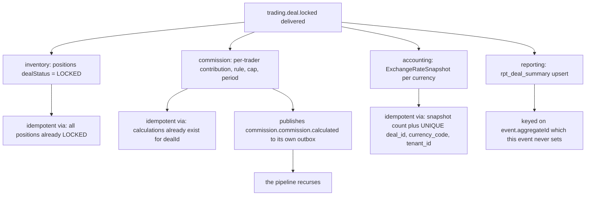

**What it shows.** Four consumers, four _different_ idempotency mechanisms, none of
which is the inbox. The inbox is a cheap first line; the durable guarantee is always a
domain-level uniqueness check.

### When this hop fails

- **One consumer fails, others succeed.** Expected and permitted. The failed message
  dead-letters; the others are unaffected. The system is eventually consistent, not
  transactionally consistent, and no compensation logic exists.
- **A handler is not idempotent.** Duplicate commission calculations, duplicate stock
  movements, duplicate audit rows. The unique constraints listed above are what stops
  this, and every one of them is a _domain_ constraint — the messaging layer contributes
  at-least-once and nothing stronger.
- **`aggregateId` is undefined.** For reporting, the upsert key degenerates. What you
  would observe is either a `NOT NULL` violation and a dead-letter, or a single
  collapsed projection row shared by every deal — depending on the column definition.
  **Unverified:** which, since the reporting entity's column nullability was not read.
- **A handler runs longer than the broker's consumer timeout.** With `prefetch(1)` and
  a long commission calculation this is a real risk on quorum queues under default
  delivery-acknowledgement timeouts. No explicit timeout is configured anywhere in the
  consumer code.

---

## Hop 11 — Ack, and the audit lane with its redaction

### What happens

`channel.ack(msg)` fires after `dispatch` returns. It is a bare ack, not `allUpTo`.

Meanwhile — and completely independently of everything in hops 7 through 10 — the same
relay cycle published a second copy of the event to `acme.audit-feed`, a durable fanout
exchange. Fanout ignores routing keys for delivery, but the relay forwards the
canonical key anyway so audit consumers can see the same key the bounded-context
binding saw:

```ts
const auditOptions = {
  persistent: true,
  contentType: "application/json",
  messageId: entry.id,
  headers,
};
const auditBuffer = this.buildAuditBuffer(entry, buffer);
await this.publishOnce(
  channel,
  AUDIT_FEED_EXCHANGE,
  entry.routingKey,
  auditBuffer,
  auditOptions
);
```

`buildAuditBuffer` is where field redaction lives, and its shape is worth studying
because it is a good example of a security control designed to be a strict no-op when
not configured:

```ts
const paths = this.config.auditSecretFields[entry.eventType];
if (!paths || paths.length === 0) {
  return bcBuffer; // same bytes, no clone, no allocation
}
const redacted = JSON.parse(JSON.stringify(entry.payload));
for (const path of paths) {
  deleteAtPath(redacted, path);
}
return Buffer.from(JSON.stringify(redacted));
```

The problem it solves: the relay dual-publishes every payload verbatim to _both_ lanes,
and audit-service persists the audit copy into `audit_entry.new_state`. A bearer secret
in a payload therefore lands unredacted, at rest, in the platform-wide audit store —
defeating a separate control whose entire purpose is that no usable token exists at
rest. The bounded-context lane must keep the field (notification-service reads the raw
invite token to build the email link), so the strip has to be lane-specific.

Two services configure it today, and both configure exactly one path:

```ts
// user-service
auditSecretFields: { 'platform.user.invited': ['payload.token'] }
// auth-service
auditSecretFields: { 'identity.password.reset-requested': ['payload.token'] }
```

The default is `{}`, so every other event type and every other relay produces a
byte-identical audit copy. `deleteAtPath` walks a dotted path and no-ops on a missing
intermediate segment; the paths come from static configuration, never user input.

The same denylist is reused in `scrubbedPublishedPayload`, which rewrites the _stored_
outbox payload at the moment the row transitions to `PUBLISHED` — so a field declared
secret is stripped from both the audit copy and the durable outbox row it came from.
The scrub runs only after a successful publish, since the bounded-context lane has
already carried the real token to the broker by then.

On the receiving side, `AuditEventConsumer` binds `audit.events` to the fanout and
persists one row per message. It flushes per message rather than per batch — the
comment is precise about why: _"the `channel.consume` ack happens after `handleEvent`
returns, so unpersisted entries in the buffer would be lost if the process crashed
between ack and the next batch flush."_ Ack semantics and persistence semantics are
deliberately aligned. Idempotency is a `UNIQUE` index on `source_event_id`; a `23505`
on a batch insert triggers a per-entry retry loop so one duplicate does not drop the
other 99.

There is a defect here too. The consumer builds its row with:

```ts
const entry = AuditEntry.create({ tenantId: event.tenantId, entityType, entityId: event.aggregateId!, ... });
```

and `AuditEntry._entityId` is declared `@Property({ type: 'varchar', fieldName: 'entity_id', nullable: false })`.
Since `trading.deal.locked` never sets `aggregateId`, the insert supplies `undefined`
for a `NOT NULL` column. The handler throws, the message is nacked to
`audit-service.events.dlx`, and the audit trail for deal locks is empty. The same
non-null assertion, the same missing field, in two different services.

### Diagram

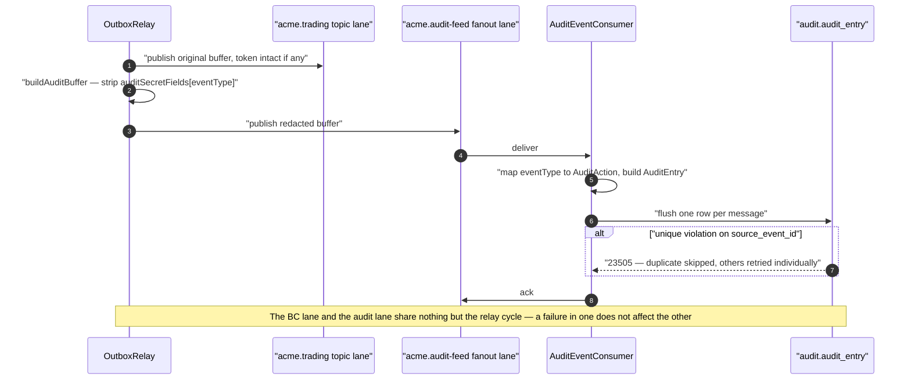

**What it shows.** The two lanes diverge inside a single relay iteration and never
rejoin. A redaction bug affects only the audit copy; a bounded-context consumer bug
affects only the topic lane.

### When this hop fails

- **Audit publish fails.** The whole entry is a publish failure — the bounded-context
  publish already succeeded, but Phase 3 records failure and the retry republishes
  _both_ lanes. Consumers on the topic lane see the duplicate; their inbox absorbs it.
- **Redaction is not configured for an event carrying a secret.** The token is written
  verbatim into `audit_entry.new_state` and stays there. The control is off by default,
  so this is the _normal_ state for every event type nobody has explicitly reviewed.
- **`aggregateId` missing.** As described: `NOT NULL` violation, message nacked, audit
  row never created. The audit lane fails closed and loudly, which is the correct
  direction, but the result is a gap in an audit trail whose purpose is to have no gaps.
- **Ack lost after successful persistence.** Broker redelivers; the `source_event_id`
  unique index turns it into a debug log.

---

## Hop 12 — The reaper, and what it does not do

### What happens

`OutboxReaper` runs only where the relay runs — co-locating it with a publish-only
service would have it racing a relay it cannot see. It is a `setInterval` loop with an
eager first tick after a short warm-up, so an incident that stranded rows surfaces
within seconds of a restart rather than one full interval later.

Defaults: `scanIntervalMs` 900 000 (15 min), `initialDelayMs` 5 000, `warnAfterMs`
900 000, `failAfterMs` 14 400 000 (4 h), `batchSize` 100, `statementTimeoutMs` 30 000,
`maxScanDurationMs` 90 % of the scan interval. Every one is validated in the
constructor — a typo'd `initialDelayMs` that would silently disable the reaper is
rejected by an explicit upper bound.

A scan does three things:

1. Find `PUBLISHING` rows older than `warnAfterMs`, oldest first, capped at
   `batchSize`, with the tenant filter disabled.
2. Independently `SELECT count(*)` of all `PUBLISHING` rows, via raw SQL (which
   bypasses filters entirely), so the backlog signal is accurate regardless of what
   this batch happened to contain.
3. For rows older than `failAfterMs`, flip `PUBLISHING → FAILED` with an explanatory
   marker.

The flip is a true top-level transaction per entry, with an optimistic-lock predicate
and a statement timeout:

```ts
return em.transactional(async (txEm) => {
  await txEm.execute(
    `SET LOCAL statement_timeout = ${this.config.statementTimeoutMs}`
  );
  const affected = await txEm.nativeUpdate(
    OutboxEntry,
    { id: entry.id, status: OutboxEntryStatus.PUBLISHING },
    { status: OutboxEntryStatus.FAILED, lastError },
    { filters: { tenant: false } }
  );
  return affected > 0 ? "flipped" : "race_lost";
});
```

`SET LOCAL` only binds to a top-level transaction, which is precisely why the scan does
_not_ wrap the per-entry flips in an outer transaction — inside one, each flip would be
a savepoint and the timeout would leak to the outer scope. Per-entry isolation is the
second reason: one flip failing must not roll back its peers.

The marker written into `lastError` is written for a human:

> `OutboxReaper: stuck in PUBLISHING since <timestamp> (> 14400000ms). Marker write was
lost mid-cycle; event may or may not have been delivered to RabbitMQ. Manual review
required.`

That sentence is the honest summary of the whole design: leaving rows in `PUBLISHING`
guarantees no duplicate delivery at the cost of an ambiguous row that only a human can
resolve.

`affected === 0` means the relay's Phase 3 (or another replica) won the race and the
row is no longer `PUBLISHING`. The reaper logs the lost race and moves on rather than
overwriting a legitimately `PUBLISHED` row.

**And now the part the name misleads you about.** The reaper does not prune anything.
It touches only rows in `PUBLISHING`. A `PUBLISHED` row lives forever. A search across
the services, the shared libraries and the charts finds no `DELETE FROM outbox_entry`,
no retention job, no partition rotation and no TTL. Every domain event ever published
by every relay-enabled service remains as a `jsonb` row in
`platform_outbox.outbox_entry` indefinitely. For a payload the size of
`DealLockedEventPayload` — a full deal snapshot with every line item — that is a
meaningful and unbounded growth rate on the shared outbox table.

Two smaller findings in the same file:

- **A stale class docstring.** It states that _"Multi-replica coordination uses
  `pg_try_advisory_xact_lock` … exactly one replica runs the scan body per interval"_.
  The implementation contains no advisory lock at all, and the `scan()` docstring forty
  lines below directly contradicts the class docstring: _"No outer-transaction wrapping
  … Multiple service replicas may scan concurrently."_ The test file confirms the
  advisory lock was removed in review. The behaviour is safe — the `WHERE status =
'PUBLISHING'` predicate is the real race protection — but a reader who trusts the
  class docstring will reason wrongly about replica behaviour.
- **`created_at` is a proxy for a column that does not exist.** There is no
  `publishing_since`. In steady state a `PENDING` row is claimed within about a second
  of creation, so `created_at` approximates it well; for a row that sat `PENDING` for
  an hour because the broker was down, the reaper's age arithmetic is wrong by that
  hour. The code names this trade-off explicitly and calls a real column future
  hardening.

**Expected duration.** The reaper's constants bound how long an ambiguous row stays
ambiguous, not how long delivery takes: the first scan runs `initialDelayMs` 5 s after
boot, then one every `scanIntervalMs` 15 min; a row is reported after `warnAfterMs`
15 min and closed out as `FAILED` after `failAfterMs` 4 h. None of that delivers
anything — the row was already stranded by the time the reaper found it.

### Diagram

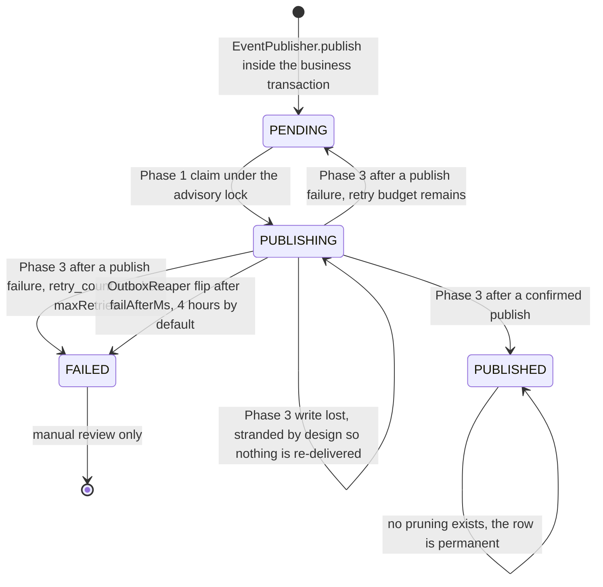

**What it shows.** `PENDING` is the only state the claim query can see, which is why
every failure path either returns a row to `PENDING` deliberately or strands it
deliberately. There is no automatic exit from `FAILED` and no exit at all from
`PUBLISHED`.

### When this hop fails

- **The scan hangs.** A watchdog rejects after `maxScanDurationMs` and releases the
  in-flight guard, so a stalled connection pool cannot wedge the loop silently. The
  watchdog's own late settlement is absorbed by a `.catch`, mirroring the publish-side
  timeout.
- **A flip fails.** Counted in `errorCount`, logged with the entry id and event type,
  and the loop continues. The row is retried on the next scan.
- **Backlog exceeds the batch.** The reaper warns explicitly that recovery scales with
  `scanIntervalMs × ceil(total / batchSize)` — with the defaults, a backlog of 1 000
  stranded rows takes ten scans, or 2.5 hours, to clear.
- **The reaper is not running.** It is only instantiated when `enableRelay` is true. In
  the eight services with the relay disabled, nothing ever inspects the outbox table at
  all.

---

## 13. Three places this event does not currently survive

Collected in one place, in the order they would bite, all verified from source on the
branch that was read:

1. **`OutboxEntry` is not registered in trading-service's MikroORM entity list**
   (`apps/platform/trading-service/src/app.module.ts`). `EventPublisher.publish` calls
   `em.persist(new OutboxEntry())`, which requires metadata the ORM does not have. The
   testcontainers harness registers the entity; production does not. The equivalent
   omission in another service shipped as a live incident whose symptom is recorded in
   that service's module comment.
2. **trading-service sets `enableRelay: false`.** Even with the entity registered, no
   relay polls `platform_outbox` on trading's database. Rows accumulate `PENDING`, and
   the service's own `OutboxLagObserver` gauge — with alert thresholds at 60 s and
   300 s — is pegged. The relay is enabled in four services only: auth, tenant, user
   and inventory.
3. **The stored routing key never carries a version suffix.**
   `EventPublisher.publish` sets `entry.routingKey = event.eventType`, and
   `LockDealUseCase` sets `version: 2`. The relay's own
   `validateVersionRoutingKeyMatch` therefore rejects the pair and dead-letters the
   entry with `VERSION_BINDING_MISMATCH`, marking the row `PUBLISHED` so it is never
   retried. And because the version-mismatch DLX publishes with the original routing
   key while the retention DLQ binds the fixed key `dead-letter`, the dead-lettered
   copy is dropped — leaving a `warn` log as the only record. This is the only event on
   the platform at version 2, so it is the only event this affects.

A fourth, adjacent finding that is not on the delivery path but is on the _consumption_
path: two consumers (`reporting-service` and `audit-service`) key on `event.aggregateId`
with a non-null assertion, and no trading producer sets it.

And two smaller drifts worth knowing before you trust a comment:

- The `OutboxEntry` entity docstring says the `status` column is `varchar(20)` and
  cites `Migration20260403000000_init`. That migration creates
  `notification.outbox_entry` — a _different, incompatible_ table with columns `type`
  and `retries` and no `routing_key`. The table the entity actually maps to,
  `platform_outbox.outbox_entry`, declares `status varchar(255)`, `entry_type`,
  `retry_count` and `routing_key`.
- ADR-0018 specifies an `IntegrationEvent` envelope with `aggregateType`, `occurredAt`
  and a nested `metadata` object, and a relay that marks `published_at`. The shipped
  `DomainEvent` is flat, uses `timestamp`, has no `aggregateType`, and the relay drives
  a four-value `status` enum the ADR never mentions.

---

## 14. What the reader now knows

If you followed one event through twelve hops, you have internalised the following —
and these generalise to every integration event on the platform, not just this one:

1. **Atomicity is bought exactly once, at one `COMMIT`.** Everything upstream of it is
   ordinary transactional programming. Everything downstream is at-least-once retry over
   durable state. The outbox row is what converts one into the other, and the _only_
   thing that makes it work is that the publisher takes the caller's EntityManager and
   never forks.
2. **Exclusivity across replicas is a two-part mechanism.** The advisory lock serialises
   the _claim_; the `PENDING → PUBLISHING` state flip makes exclusivity durable after
   the lock releases. Neither alone is sufficient.
3. **The safe state on ambiguity is "stuck", not "retry".** When the relay cannot
   record whether a publish succeeded, it leaves the row in `PUBLISHING` — invisible to
   the claim query, therefore never re-delivered. The cost is orphan rows and a
   human-resolved ambiguity; the benefit is that duplicate delivery is never
   _manufactured_ by the bookkeeping layer.
4. **Structural faults are not retried.** A bad version or a mismatched routing key is
   a programmer error, so it is dead-lettered and closed out rather than burning a retry
   budget. Only transport faults retry.
5. **At-least-once is a real, routine occurrence, not an edge case.** A late publisher
   confirm after the 30-second timeout, a redelivery after a consumer crash, and a
   retry that republishes both lanes of a dual-publish all produce genuine duplicates in
   normal operation. That is why every consumer needs _two_ layers: a cheap inbox
   lookup and a durable domain-level unique constraint.
6. **The inbox must be written after the effect, never before**, whenever the effect
   cannot share the inbox's transaction. Recording first converts a crash into
   permanent silent loss; recording after converts it into a replay that idempotency
   absorbs.
7. **Publisher confirms guarantee acceptance, not consumption.** An event published to
   an exchange with no matching binding is confirmed, marked `PUBLISHED`, and lost. No
   `mandatory` flag and no return listener exists anywhere in the relay.
8. **Versioning is enforced by the broker, not by the consumer.** The invariant is _no
   consumer ever receives a body whose shape it did not bind for_ — and the price is
   that a binding table and a transition-window flag are now correctness-critical
   configuration, in two different repositories' worth of files.
9. **Nothing in this pipeline is transactional across services.** Four consumers of the
   same event can be in four different states of progress indefinitely, and no
   compensation logic exists. Eventual consistency here means literally that: the
   states converge when the dead-letters are reprocessed, and not before.
10. **The pipeline is only as live as its configuration.** Two boolean-ish settings —
    an entity registration and an `enableRelay` flag — decide whether any of the above
    happens at all, and neither of them fails loudly at the point of use.

### The commit-to-effect budget

The constants are scattered across the hops above and never summed, which leaves the one
question an operator actually asks unanswered: _how long after the `COMMIT` does the
downstream row exist?_ Added up:

| Segment                           | Typical                                        | Worst case                                                                   |
| --------------------------------- | ---------------------------------------------- | ---------------------------------------------------------------------------- |
| `COMMIT` → relay claim            | 0–1 s, ~500 ms average (`pollIntervalMs` 1000) | unbounded while the relay is disabled or its claim query throws              |
| claim → publish confirmed         | single-digit milliseconds                      | 30 s (`publishConfirmTimeoutMs`), plus one poll interval per retry           |
| exchange → queued at the consumer | sub-millisecond routing                        | as long as the queue is backed up, because `prefetch(1)` serialises delivery |
| delivery → effect persisted       | handler time                                   | no configured bound — no consumer sets a delivery-acknowledgement timeout    |

On a healthy platform the downstream row therefore exists **about a second** after the
`COMMIT`, and the user's 200 was returned before any of it started. The tail is the
interesting part, not the median: five failed publish attempts at roughly 31 s each spend
about **two and a half minutes** before the row flips to `FAILED`, and a row stranded in
`PUBLISHING` waits `failAfterMs` — **four hours** — for the reaper to close it out.
Neither of those paths delivers anything. Every figure here is a _publish-side_ budget;
it says nothing about how long a consumer takes to act, which is the one hop with no
constant at all.

### The happy path, end to end

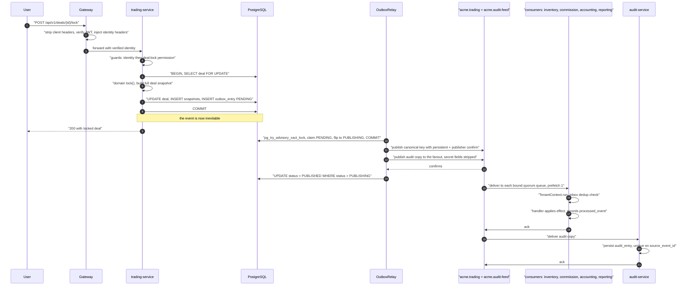

**What it shows.** The user's request completes at the `COMMIT`, three steps before
anything is published. Every subsequent hop is asynchronous, individually retryable,
and invisible to the caller — which is exactly what makes the outbox worth its
complexity, and exactly what makes a silently-disabled relay so hard to notice.

---

## Where this connects

- Survey doc for this area: [`../../platform/integration-patterns.md`](../../platform/integration-patterns.md) —
  the outbox, inbox, saga and projection patterns at a level above this narrative.
- Event taxonomy, envelope and routing grammar:
  [`../../platform/event-catalog.md`](../../platform/event-catalog.md)
- Broker topology, credentials and job queues:
  [`../../backend/05-messaging.md`](../../backend/05-messaging.md)
- Schema isolation, the shared `platform_outbox` schema and the tenant filter:
  [`../../backend/03-data-architecture.md`](../../backend/03-data-architecture.md)
- The guard chain and gateway header contract in full:
  [`../../backend/04-authn-authz.md`](../../backend/04-authn-authz.md)
- Sibling deep-dives in this series — this document is the narrative that threads them
  together, so read whichever one you need in mechanism-level detail:
  - [`./01-event-anatomy.md`](./01-event-anatomy.md) — the envelope, the outbox row and
    the publisher contract examined on their own terms.
  - [`./02-event-families.md`](./02-event-families.md) — the full taxonomy this one
    event was drawn from.
  - [`./04-event-evolution.md`](./04-event-evolution.md) — versioned routing keys,
    dual-publish windows and how the v1-to-v2 migration is supposed to end.
  - [`./05-choreography-decisions.md`](./05-choreography-decisions.md) — why the
    consumers at hop 10 are choreographed rather than orchestrated.
- Adjacent deep-dive series:
  - [`../multi-tenancy/01-tenant-model.md`](../multi-tenancy/01-tenant-model.md) and
    [`../multi-tenancy/02-resolution.md`](../multi-tenancy/02-resolution.md) — the
    tenant filter, its fail-closed `cond` and the RLS GUC referenced at hops 1 and 3.
  - [`../rabbitmq/01-topology.md`](../rabbitmq/01-topology.md) — exchanges, quorum
    queues and dead-letter topology referenced at hops 7 and 8.
  - [`../rabbitmq/03-consuming.md`](../rabbitmq/03-consuming.md) — consumer wiring,
    prefetch and reconnect discipline referenced at hops 8 and 9.
  - [`../rabbitmq/05-testing-the-broker.md`](../rabbitmq/05-testing-the-broker.md) —
    how the harness at hop 3 diverges from the production module wiring.
