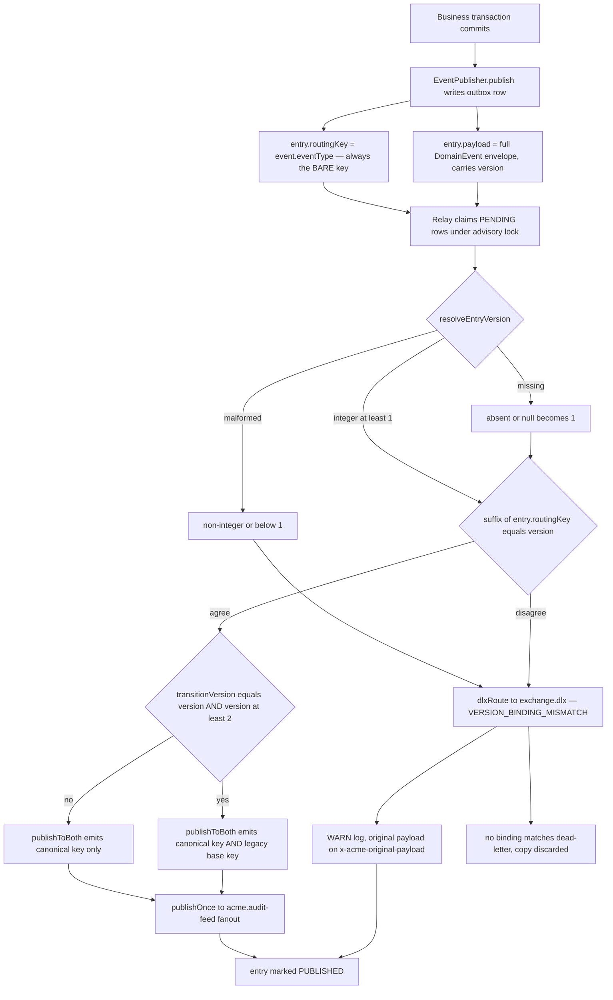
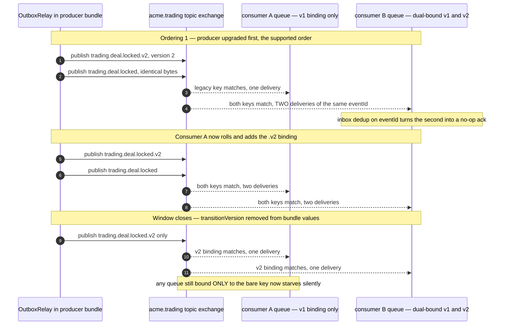
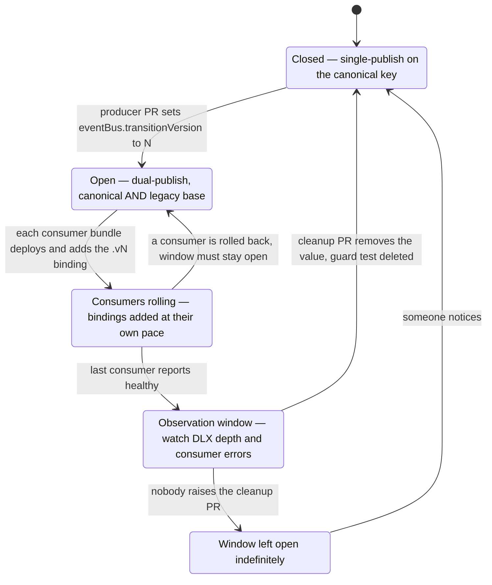
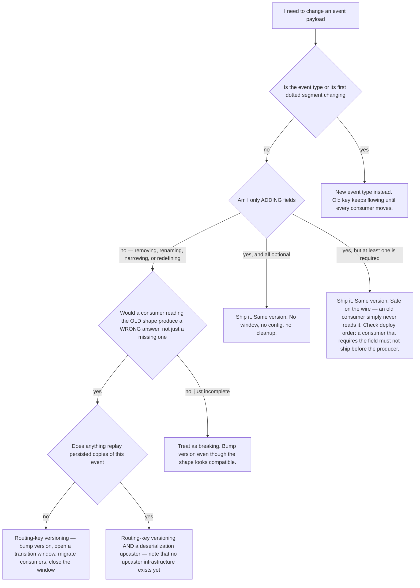

# Event Evolution — changing a contract without breaking a consumer

This document answers one narrow question in full mechanical detail: **when the shape of a
domain event has to change, what exactly happens in the code, the chart and the broker so
that no consumer receives a body it cannot read?** It covers the routing-key versioning
scheme, the dual-publish helper, the relay's validation gate and its dead-letter path, the
lifecycle of a transition window, the rules for deciding whether a change is additive or
breaking, and the tests that are supposed to catch a mistake. Read it if you are about to
change an event payload, if you are reviewing such a change, or if you are trying to work
out why a `VERSION_BINDING_MISMATCH` appeared in a relay log. It assumes you have already
read the survey material in [`platform/event-catalog.md`](../../platform/event-catalog.md)
and does not repeat the taxonomy or the broker topology.

---

## 1. Why the `version` field alone protects nothing

Every message on the bus is a `DomainEvent<T>` envelope. The declaration lives in
`libs/platform/event-contracts/src/index.ts`:

```typescript
export interface DomainEvent<T = unknown> {
  readonly eventId: string; // UUID v7 (time-ordered)
  readonly eventType: string; // e.g. 'trading.deal.locked'
  readonly version: number; // schema version for evolution
  readonly tenantId: TenantId;
  readonly userId: UserId;
  readonly correlationId: string;
  readonly causationId: string; // the event that caused this
  readonly timestamp: string; // ISO 8601
  readonly payload: T;
  readonly aggregateId?: string;
  // ...optional audit/notification metadata
}
```

The `version` field has existed since the first event was written. The platform's DDD
practice register states the rule plainly: _"Every event has version number (starts at 1).
Additive = same version, breaking = new version + upcaster."_

The problem is that nothing on the consumer side reads `version` and decides anything.
Both consumer code paths deserialize with a bare cast and no runtime schema check.

The generic path, in `libs/platform/event-bus/src/lib/setup-rabbit-consumer.ts` and again
in `event-handler-explorer.ts`:

```typescript
const event = JSON.parse(msg.content.toString()) as DomainEvent<TPayload>;
await handler(event);
channel.ack(msg);
```

The hand-rolled path, in commission-service's `TradingEventConsumer`:

```typescript
const event: DomainEvent<Record<string, unknown>> = JSON.parse(
  msg.content.toString()
);
```

There is no `class-validator` pipeline, no JSON Schema check, no discriminated union on
`version`. TypeScript's structural typing is erased at build time, so a v1 handler handed
a v2 body compiles, runs, reads the fields it knows about, and silently sees `undefined`
for anything it expects but the producer no longer sends. That is the exact failure mode
ADR-0036 was written to close, and its context section says so: _"v1 consumer receives v2
payload via the same routing key → silent corruption (TypeScript types only protect at
compile time; runtime deserialization has no guard)."_

The conclusion the platform drew is worth stating as a design principle, because it
determines everything below: **version filtering is delegated to the broker, not to the
consumer.** A topic exchange already filters by routing key at wire speed and requires no
code in any consumer. Putting the version into the routing key turns "did I get a shape I
understand?" from a runtime question every consumer must answer into a binding question
each consumer answers once, declaratively, at startup.

---

## 2. The deciding record: ADR-0036

The decision is recorded as **ADR-0036, _Versioned Event Routing Keys for Safe Rolling
Deploys_**, dated 2026-05-06. Two facts about that record matter when reading the code:

1. Its status is **"Proposed (POC-6 gated)"**, not Accepted. The ADR made itself
   conditional on a proof-of-concept that deployed a real producer and a real consumer
   partially and observed both versions flowing. The POC result file records
   **"GREEN (unit-level) / DEFERRED (integration-level)"** — the library was built and
   unit-tested, the service-level integration was pushed to the implementation phase.
2. It explicitly **does not replace** the upcaster pattern. The ADR's own framing is that
   routing-key versioning protects the _rolling-deploy window_ while an upcaster protects
   _persisted-event replay_, and that the two compose. See §10.3 for what actually exists.

The ADR's decision sentence is the contract the rest of this document unpacks:

> Adopt versioned routing keys with dual-publish during rolling-deploy transition windows.
> The producer dual-publishes to both `{topic}` and `{topic}.v{N}` for the duration of the
> window; consumers bind to a specific version routing key. Outbox relay enforces the
> `version` field matches the routing key at publish time; mismatch sends the event to DLX
> with a structured error.

---

## 3. The routing-key scheme

The whole scheme rests on one function, in
`libs/platform/event-bus/src/lib/routing-key-versioning.ts`:

```typescript
export function buildVersionedRoutingKey(
  topic: string,
  version: number
): string {
  if (!Number.isInteger(version) || version <= 0) {
    throw new Error(
      `buildVersionedRoutingKey: version must be a positive integer, got ${version}`
    );
  }
  return version === 1 ? topic : `${topic}.v${version}`;
}
```

And on one regular expression, used to read the key back:

```typescript
const VERSIONED_SUFFIX = /\.v(\d+)$/;
```

| Event type            | `version` | Canonical routing key    | Notes                                  |
| --------------------- | --------- | ------------------------ | -------------------------------------- |
| `trading.deal.locked` | 1         | `trading.deal.locked`    | No suffix — v1 is the unmarked default |
| `trading.deal.locked` | 2         | `trading.deal.locked.v2` | Suffix appended                        |
| `trading.deal.locked` | 3         | `trading.deal.locked.v3` | Suffix appended                        |
| `trading.deal.locked` | 0 or -1   | _throws_                 | Positive integers only                 |

The asymmetry — v1 has no suffix, v2 and above do — is deliberate and load-bearing. Every
event written before ADR-0036 existed carries no suffix and no explicit intent to be "v1".
By defining the unmarked key as v1, the scheme is retro-compatible: existing producers,
existing consumers and existing queue bindings all keep working with zero changes. The
price is that the _first_ migration of any event is the awkward one, because the base key
means two different things at different times (it is v1's canonical key, and it is also
the legacy key that v2 dual-publishes to during a window).

Note also the exchange is **not** part of the routing key. The exchange is derived
separately from the first dotted segment of the event type, in both the relay and the
consumer explorer:

```typescript
private deriveExchange(eventType: string): string {
  const dotIndex = eventType.indexOf('.');
  if (dotIndex <= 0) {
    throw new Error(`Invalid eventType format: '${eventType}' — expected 'bc.entity.action' pattern`);
  }
  return `acme.${eventType.substring(0, dotIndex)}`;
}
```

So `trading.deal.locked` version 2 publishes routing key `trading.deal.locked.v2` on
exchange `acme.trading`. ADR-0036 and the migration runbook both write the routing key as
`acme.trading.deal.locked.v2` — that is a documentation error, not a second convention;
see the drift table in §12.

---

## 4. `publishToBoth` — the dual-publish helper

The helper that actually emits messages during a transition has this signature:

```typescript
export async function publishToBoth(
  channel: ConfirmChannel,
  exchange: string,
  baseRoutingKey: string,
  version: number,
  transitionVersion: number | undefined,
  payload: Buffer,
  headers: Record<string, unknown>
): Promise<void>;
```

Its behaviour is decided by exactly two lines:

```typescript
const canonicalRoutingKey = buildVersionedRoutingKey(baseRoutingKey, version);
const isTransitionMatch = transitionVersion === version && version > 1;
```

**The canonical key always ships.** The legacy base key ships _only_ when the configured
transition version equals this message's version _and_ that version is at least 2. Four
consequences follow, each pinned by a named unit test:

| `version` | `transitionVersion` | Keys published                                         | Rationale                                                   |
| --------- | ------------------- | ------------------------------------------------------ | ----------------------------------------------------------- |
| 1         | unset               | `trading.deal.locked`                                  | Steady state before any migration                           |
| 2         | unset               | `trading.deal.locked.v2`                               | Steady state after the window closed                        |
| 2         | 2                   | `trading.deal.locked.v2` **and** `trading.deal.locked` | The window is open for this exact version                   |
| 3         | 2                   | `trading.deal.locked.v3`                               | Producer moved past the window's version — no legacy copy   |
| 1         | 2                   | `trading.deal.locked`                                  | This message is not the version being transitioned          |
| 1         | 1                   | `trading.deal.locked`                                  | Degenerate — canonical _is_ base, dual would be a duplicate |

The degenerate case is the interesting one. If the helper naively dual-published whenever
`transitionVersion` was set, a `transitionVersion: 1` would publish the same routing key
twice and every consumer would receive the event twice for no reason. The `version > 1`
guard makes that a single publish, and a test asserts it explicitly.

### 4.1 Ordering: canonical first, then legacy

```typescript
const publishPromises: Array<Promise<void>> = [
  publishConfirmed(channel, exchange, canonicalRoutingKey, payload, headers),
];
if (isTransitionMatch) {
  publishPromises.push(
    publishConfirmed(channel, exchange, baseRoutingKey, payload, headers)
  );
}
```

The canonical publish is submitted first. A unit test pins this — _"publishes canonical key
first, then legacy base key (preserves v2 consumer ordering)"_ — asserting
`_calls[0].routingKey === 'trading.deal.locked.v2'` and
`_calls[1].routingKey === 'trading.deal.locked'`. Since RabbitMQ preserves per-channel
publish order into a queue, a consumer bound to the new key sees the new-version copy
before any legacy copy that lands on the same queue.

### 4.2 Why `Promise.allSettled` and not sequential awaits

The two publishes are submitted to the broker's confirm window _before_ either is awaited:

```typescript
const results = await Promise.allSettled(publishPromises);
const rejected = results.filter(
  (r): r is PromiseRejectedResult => r.status === "rejected"
);
if (rejected.length > 0) {
  const reasons = rejected.map((r) => String(r.reason)).join("; ");
  throw new Error(
    `publishToBoth: ${rejected.length}/${results.length} publish(es) failed — ${reasons}`
  );
}
```

The code comment records the reasoning, and it is a genuinely subtle failure mode. With
sequential awaits, if the canonical publish confirmed and the legacy publish was NACKed,
the helper would throw, the relay would mark the outbox entry back to `PENDING`, and the
next relay cycle would republish **both** keys — delivering the canonical copy a second
time. Submitting both first means a partial failure is still a whole-entry failure, but
the retry-duplicate risk is the same for both keys rather than being systematically biased
toward the canonical one.

The residual duplicate risk on retry is accepted, not eliminated, and the accepted-risk
justification is that consumers are required to be `eventId`-idempotent anyway. The source
carries an explicit follow-up marker for the real fix:

```ts
// TODO (follow-up): implement a per-entry publish checkpoint column in
// outbox_entry to track which routing keys have been broker-confirmed. On
// retry the relay skips already-confirmed keys, eliminating duplicates.
```

That column does not exist in `OutboxEntry` on the branch that was read.

### 4.3 Durability and headers

Every publish sets `persistent: true` and forwards the caller's headers verbatim:

```typescript
channel.publish(exchange, routingKey, payload, { persistent: true, headers }, (err) => { ... });
```

Both are asserted by tests (_"sets persistent=true on every publish (outbox durability
invariant)"_, _"forwards headers verbatim to both publishes"_, _"forwards identical payload
buffer to both publishes"_). The identical-buffer assertion matters: RabbitMQ is
content-agnostic, so the two copies are byte-identical and a dual-bound queue receives the
same `eventId` twice. That is a feature of the design, not an accident, and it is why the
inbox pattern is a hard prerequisite rather than a nicety.

### 4.4 The dead sibling: `publishVersioned`

The same module exports a second, older function, `publishVersioned`, with different
semantics: it always publishes the base key and additionally publishes
`{base}.v{transitionVersion}` whenever `transitionVersion > 1` — keyed off the _transition_
version rather than the event's own version. It is exported from the package barrel and
covered by tests, but a repository-wide search finds **no non-test caller**. It is the
POC-era implementation that `publishToBoth` superseded, left in the barrel. Anyone reading
the module for the first time will find two functions that appear to do the same job with
subtly different rules; only `publishToBoth` is wired into the relay.

---

## 5. Relay-side enforcement and the DLX path

`OutboxRelay.publishToChannel()` is the single point where an outbox row becomes a broker
message, and it is where version enforcement lives. The order of operations is fixed:

1. Serialize `entry.payload` (the whole `DomainEvent` envelope) to a Buffer.
2. Build headers by injecting the W3C `traceparent` from the active OpenTelemetry span.
3. Resolve the version from `entry.payload.version`.
4. Validate the version against `entry.routingKey`.
5. On success, publish via `publishToBoth`, then publish an audit-lane copy.
6. On failure, publish a structured error to the dead-letter exchange and stop.

### 5.1 Version resolution

```typescript
private resolveEntryVersion(raw: unknown): number | null {
  if (raw === undefined || raw === null) {
    return 1;
  }
  if (typeof raw !== 'number' || !Number.isInteger(raw) || raw < 1) {
    return null;
  }
  return raw;
}
```

A missing version is **not** an error — it becomes 1, which is what keeps every
pre-ADR-0036 producer working. A version that is present but malformed (a string, a float,
zero, a negative) returns `null` and is treated as a fault. Note the asymmetry in the
error report for that branch: `expectedVersion` is hard-coded to `1` regardless of what
suffix the routing key actually carries, so a malformed version on a `.v2` key reports
`expectedVersion: 1`. That is cosmetic for triage, but it means the DLX body's
`expectedVersion` is only trustworthy on the mismatch branch, not the malformed branch.

### 5.2 The match check

```typescript
export function validateVersionRoutingKeyMatch(
  input: VersionRoutingKeyMatchInput
): VersionRoutingKeyMatchResult {
  const { routingKey, eventVersion, eventId } = input;
  const suffixMatch = routingKey.match(VERSIONED_SUFFIX);
  const expectedVersion = suffixMatch ? parseInt(suffixMatch[1], 10) : 1;

  if (expectedVersion === eventVersion) {
    return { valid: true };
  }
  // ...returns { valid: false, error: { originalRoutingKey, expectedVersion, actualVersion, eventId? } }
}
```

The check is symmetric and catches drift in both directions: a version-2 envelope on a
bare key, and a version-1 envelope on a `.v2` key. Both are programmer errors — the payload
shape and the wire address disagree — and both are fatal for that entry.

### 5.3 The dead-letter route

```typescript
private async dlxRoute(
  channel: OutboxRelayChannel,
  exchange: string,
  payload: VersionMismatchDlxPayload,
  originalPayload: Record<string, unknown>,
  eventId: string,
  rawVersion?: unknown
): Promise<void> {
  const dlxExchange = `${exchange}.dlx`;
  const dlxRoutingKey = payload.originalRoutingKey;
  const buffer = Buffer.from(JSON.stringify(payload));
  const headers: Record<string, unknown> = {
    ...this.injectTraceContext(),
    [DLX_ORIGINAL_PAYLOAD_HEADER]: JSON.stringify(originalPayload),
  };
  if (rawVersion !== undefined) {
    headers[DLX_ACTUAL_VERSION_RAW_HEADER] = String(rawVersion);
  }
  // persistent: true, contentType: application/json, messageId: eventId
  await this.publishOnce(channel, dlxExchange, dlxRoutingKey, buffer, options);
  this.logger.warn(/* structured WARN with all five fields */);
}
```

The message body is a fixed, documented envelope so a forensics consumer can rely on it:

```typescript
export interface VersionMismatchDlxPayload {
  readonly originalRoutingKey: string;
  readonly expectedVersion: number;
  readonly actualVersion: number;
  readonly eventId: string;
  readonly reason: typeof VERSION_BINDING_MISMATCH_REASON; // 'VERSION_BINDING_MISMATCH'
}
```

The **original payload is preserved on a header**, `x-acme-original-payload`, as a JSON
string, precisely so a recovery tool can replay the event verbatim once the producer bug is
fixed. A non-numeric raw version is stringified onto `x-acme-actual-version-raw`.

Three design choices in this path are worth calling out because they are counter-intuitive:

- **A dead-lettered entry is marked `PUBLISHED`, not `FAILED`.** The relay does not retry a
  structural fault. Retrying would loop forever on a bug that can only be fixed by changing
  producer code or bundle config, and would starve the rest of the batch. "Delivered" here
  means "delivered to the forensic lane."
- **The audit-feed copy is suppressed for dead-lettered entries.** The happy path publishes
  twice — once to the bounded-context exchange, once to the `acme.audit-feed` fanout. On the
  DLX path neither happens; the DLX message plus the WARN log is the record.
- **The DLX exchange is declared once at bootstrap, not lazily.** `EventBusModule` asserts
  `<exchangeName>.dlx` as a durable topic exchange when it wires the relay, with a comment
  recording why that is safe:

  ```ts
  // INVARIANT: this static `<exchangeName>.dlx` equals dlxRoute()'s runtime
  // target `<deriveExchange(eventType)>.dlx` because a relay-enabled service
  // only ever emits its own bounded context's events (one-BC-per-outbox).
  ```

  This was a real outage class: before that declaration existed, the _first_ version
  mismatch closed the AMQP channel with `NOT_FOUND` and halted the relay entirely.

### 5.4 Retention gap

`dlxRoute` publishes with `routingKey = originalRoutingKey`, but the retention dead-letter
queue is bound to the DLX with the fixed key `dead-letter`:

```typescript
await channel.assertQueue(config.dlq, {
  durable: true,
  arguments: { "x-queue-type": "quorum" },
});
await channel.bindQueue(config.dlq, dlx, "dead-letter");
```

A topic exchange with no matching binding discards the message. So a version-mismatch copy
reaches the DLX and is dropped; only the WARN log survives. The relay's own comment
concedes this: _"`<exchange>.dlx` is declared but has no bound DLQ yet, so the published
copy is not retained — the WARN log is the current forensic record. A bound retention DLQ
for version-mismatch events is a tracked follow-up."_ Messages that are dead-lettered by
the _broker_ (a consumer `nack`) do land in the DLQ, because the queue's
`x-dead-letter-routing-key` is set to `dead-letter`; it is only the relay's own
publish-time rejections that fall through.

### 5.5 The full write-to-broker path



The diagram deliberately starts one step earlier than the relay, at the outbox _write_,
because that is where the mechanism's most consequential gap lives — the subject of the
next section. Read the two nodes `PK` and `PV` together: the routing key is set from the
event type alone, while the version travels inside the payload. The relay then compares
those two independently-derived facts and rejects the entry when they disagree.

---

## 6. The write-side gap: no producer ever writes a versioned routing key

This is the single most important as-built fact in this document, and it is not visible
from the ADR, the runbook, or the survey.

`EventPublisher.publish` — the only way a domain event enters the outbox — sets the routing
key from the event type and nothing else:

```typescript
async publish<T>(em: EntityManager, event: DomainEvent<T>): Promise<void> {
  const entry = new OutboxEntry();
  entry.entryType = OutboxEntryType.DOMAIN_EVENT;
  entry.eventType = event.eventType;
  entry.payload = event as unknown as Record<string, unknown>;
  entry.routingKey = event.eventType;   // <-- always the bare key
  entry.status = OutboxEntryStatus.PENDING;
  em.persist(entry);
}
```

The entity's own docstring states the same convention: _"RabbitMQ routing key. For topic
exchange events, this matches the eventType."_ The two per-service outbox adapters
(tenant-service and user-service) each repeat `entry.routingKey = event.eventType`
verbatim. A repository-wide search finds no code anywhere that assigns a routing key
containing a `.vN` suffix — `buildVersionedRoutingKey` is called in exactly two places, and
neither is on the write path:

- inside `publishToBoth`, to derive the _canonical publish target_ at relay time; and
- inside `deriveConsumerWiring`, to derive a consumer's _binding_.

Now combine that with the one producer in the codebase that emits a version other than 1.
`lock-deal.use-case.ts` writes:

```typescript
const event: DomainEvent<DealLockedEventPayloadV2> = {
  eventId: v7(),
  eventType: "trading.deal.locked",
  version: 2,
  // ...
  payload: { ...snapshotPayload, idempotencyKey },
};
await this.eventPublisher.publish<DealLockedEventPayloadV2>(em, event);
```

The resulting outbox row has `routingKey = 'trading.deal.locked'` and
`payload.version = 2`. Run that through §5.2: the suffix is absent, so `expectedVersion` is
1, `actualVersion` is 2, they disagree, and the entry is dead-lettered with
`VERSION_BINDING_MISMATCH`. **Every version-2 event this producer writes is guaranteed to be
rejected by the relay, not published.** The relay's own unit suite pins that exact scenario
as correct behaviour:

```typescript
it("v=2 on base routing key routes to acme.trading.dlx with structured payload", async () => {
  const entry = makePendingEntry({
    // mismatch: routing key has no .v2 suffix but payload claims version 2
    routingKey: "trading.deal.locked",
    payload: {
      eventId: "evt-mm-1",
      eventType: "trading.deal.locked",
      version: 2,
    },
  });
  // ...expects exactly one publish to acme.trading.dlx and zero to acme.trading
});
```

Meanwhile the relay's _happy path_ tests construct their fixtures with
`routingKey: 'trading.deal.locked.v2'` — a shape no production code path can produce.

**Why this has not caused an incident.** trading-service is configured with
`enableRelay: false` in its `ServiceModule.forRoot()` options. `enableRelay` is a
compile-time module option, not an environment variable, and it is `true` in only four
services: inventory-, tenant-, user- and auth-service. None of those four emits a version
above 1. So the trading outbox accumulates `PENDING` rows that no process reads, and the
mismatch is never evaluated. The moment the trading relay is switched on — which is the
stated intent, the bundle already allocates the service an advisory lock id — every
`deal.locked` event will dead-letter, and because the DLX has no matching binding (§5.4),
the events will be _silently discarded_ with only a WARN line each.

**What a fix looks like.** Two candidate shapes, both small:

1. Make the write side version-aware:
   `entry.routingKey = buildVersionedRoutingKey(event.eventType, event.version)`. This makes
   the stored key the canonical key and the relay's comparison a genuine cross-check of two
   independently produced values.
2. Or make the relay validate against what it will actually publish — derive the expected
   key from `entry.eventType` plus `payload.version` and compare that to `entry.routingKey`
   only as a consistency assertion, treating `eventType` as authoritative.

Option 1 preserves the ADR's intent (the stored key _is_ the wire address). Option 2 makes
the check a defence rather than a gate. Either way the current arrangement — a validator
whose passing condition no producer can satisfy above v1 — is not a working control.

**A related latent divergence.** The relay reads two different fields for two different
purposes: it _validates_ `entry.routingKey`, but it _publishes_ using `entry.eventType` as
the base:

```typescript
await this.withConfirmTimeout(
  publishToBoth(channel, exchange, entry.eventType, version, transitionVersion, buffer, {...}),
  contextLabel
);
```

Today those are always equal, so the divergence is invisible. If a producer ever set a
routing key that differed from the event type — which the entity's shape permits — the
validator would check one string and the publisher would use another.

**And a comment that is already wrong.** The audit-lane publish carries the comment _"we
forward the canonical key for traceability so audit consumers see the same key the BC
binding saw"_, but the code passes `entry.routingKey`, the bare key. For any v≥2 event the
audit copy would be labelled with the legacy key while the bounded-context lane used the
`.vN` key. Moot while §6's gate rejects all v≥2 traffic, but it will surface the moment
that gate is fixed.

---

## 7. How a rolling deploy actually plays out

The ADR's claim is that dual-publish makes the deploy _order_ irrelevant: producer first or
consumer first, nothing is lost. That claim is worth checking against the binding rules
rather than taken on faith.

There are two independent moving parts — which routing keys the producer emits, and which
routing keys each consumer queue is bound to — and dual-publish exists to guarantee their
intersection is never empty.

| Producer state                               | Keys emitted                       | v1-bound queue | v2-bound queue | Dual-bound queue   |
| -------------------------------------------- | ---------------------------------- | -------------- | -------------- | ------------------ |
| v1, window closed                            | `…deal.locked`                     | receives       | starves        | receives once      |
| v2, **window open** (`transitionVersion: 2`) | `…deal.locked` + `…deal.locked.v2` | receives       | receives       | receives **twice** |
| v2, window closed                            | `…deal.locked.v2`                  | starves        | receives       | receives once      |

Read the middle row: it is the only state in which _both_ binding styles are fed, which is
why the window must be open across the whole rollout and not merely at its start.

**Producer upgraded first.** The producer bundle deploys with `transitionVersion` set. It
now emits both keys. Consumers that have not yet rolled are still v1-bound and keep
receiving the legacy copy; the `.v2` copies land on no binding and the exchange discards
them. As each consumer rolls, it adds (or switches to) the `.v2` binding and starts
receiving the new copy. At no instant is any consumer starved.

**Consumer upgraded first.** A consumer that switches to a `.v2`-only binding before the
producer emits v2 starves immediately: nothing publishes that key. This is the ordering the
mechanism does _not_ protect, which is why the migration runbook's step 3 (deploy producer)
precedes step 4 (deploy consumers) and why the runbook's failure table names it: _"Consumer
bound to v2 but producer not yet at Step 3 — v2 queue has no publisher; messages don't
arrive."_ The safe consumer-first move is to **add** the `.v2` binding while keeping v1,
not to switch.

That is exactly what the one live consumer does. commission-service's `TradingEventConsumer`
binds one queue to both keys, permanently:

```typescript
// Bind to all routing keys (v1 + v2 deal.locked for dual-publish transition — ADR-0036)
await channel.bindQueue(QUEUE_NAME, EXCHANGE_NAME, ROUTING_KEY_DEAL_LOCKED);
await channel.bindQueue(QUEUE_NAME, EXCHANGE_NAME, ROUTING_KEY_DEAL_LOCKED_V2);
await channel.bindQueue(
  QUEUE_NAME,
  EXCHANGE_NAME,
  ROUTING_KEY_CREDIT_NOTE_FINALISED
);
```

That converts the ordering problem into a duplicate-delivery problem: while the window is
open, one queue matches both keys and the same `eventId` is delivered twice. The consumer
dispatches on the AMQP routing key rather than the event type — necessarily, because v1 and
v2 share an `eventType`:

```typescript
const routingKey: string = msg.fields?.routingKey ?? event.eventType;
// ...
switch (routingKey) {
  case ROUTING_KEY_DEAL_LOCKED:    /* v1 */ await this.calculateCommission.execute(...); break;
  case ROUTING_KEY_DEAL_LOCKED_V2: /* v2 */ await this.calculateCommission.execute(...); break;
  case ROUTING_KEY_CREDIT_NOTE_FINALISED: await this.applyAdjustment.execute(...); break;
  default: this.logger.debug(`Ignoring routing key: ${routingKey}`);
}
```

Both branches call the **same use case** with the same argument, differing only in the
TypeScript cast. The duplicate is absorbed by that use case's own idempotency check, which
is a lookup on the deal id:

```typescript
const existing = await this.calculationRepo.findByDealId(dealId);
if (existing.length > 0) {
  /* skip */ return;
}
```

Note what that check is _not_: it is not a check on the `idempotencyKey` that the v2 payload
was introduced to carry. The v2 field is written by the producer and read by nobody — see
§10.4.

The generic, decorator-driven consumers behave differently again. `deriveConsumerWiring`
computes a binding from the `@EventHandler` metadata:

```typescript
const version = metadata.version ?? 1;
// ...
routingKeys = [buildVersionedRoutingKey(eventType, version)];
```

A search across every `@EventHandler` in the codebase finds **not one** that declares a
`version`. Every decorator-driven consumer is therefore bound to the bare key and is
permanently a v1 consumer, whatever the producer does. That is the safe default while
producers are at v1, and it becomes a silent starvation the moment a producer's window
closes on v2.



The diagram makes the cost of the as-built dual-bind explicit: for the entire duration of
the window, every dual-bound queue processes each event twice, and correctness depends
entirely on consumer-side idempotency. ADR-0036 assumed one queue per version binding,
which avoids the duplicate but doubles the queue count and makes drain-and-cut-over a
manual operation. The as-built choice trades broker simplicity for a hard dependency on the
inbox pattern.

---

## 8. The transition window: who opens it, what closes it, what if nobody does

The window is a single integer that travels from a values file to a process:

1. **Bundle values.** `charts/bundles/trading-bundle/values.yaml`:

   ```yaml
   # Event-bus migration window: trading.deal.locked v1 -> v2 (ADR-0036).
   # With transitionVersion=2 the producer dual-publishes on both v1 and v2
   # routing keys so existing v1 consumers continue receiving events while
   # commission-service completes its v2 consumer rollout.
   #
   # REMOVE this block once:
   #   1. commission-service is fully deployed on the v2 consumer, AND
   #   2. the observation window (>=1 business day with zero v1 lag) has passed.
   eventBus:
     transitionVersion: 2
   ```

2. **Chart plumbing.** `charts/platform-base` renders the value into the pod, in both the
   Deployment and the Argo Rollout template, and only when it is set:

   ```yaml
   {{- if .Values.eventBus.transitionVersion }}
   - name: EVENT_BUS_TRANSITION_VERSION
     value: {{ .Values.eventBus.transitionVersion | quote }}
   {{- end }}
   ```

   The values schema constrains it: `"type": "integer", "minimum": 1`, with
   `additionalProperties: false` on the `eventBus` object, so a typo or a float fails
   `helm template --strict` rather than reaching a cluster.

3. **Process config.** `EventBusModule.createOutboxRelay` parses the env var and
   **fails fast** on garbage rather than defaulting:

   ```typescript
   private static parseTransitionVersion(raw: string | undefined): number | undefined {
     if (raw === undefined || raw === '') return undefined;
     const parsed = Number.parseInt(raw, 10);
     if (!Number.isInteger(parsed) || parsed <= 0 || String(parsed) !== raw) {
       throw new Error(
         `Invalid EVENT_BUS_TRANSITION_VERSION: "${raw}" — must be a positive integer (1, 2, 3, ...)`
       );
     }
     return parsed;
   }
   ```

   The `String(parsed) !== raw` clause is doing real work: it rejects `"2.5"`, `"2abc"` and
   `" 2"`, all of which `parseInt` would otherwise happily reduce to `2`. Failing at module
   construction turns a misconfigured window into a CrashLoop the deploy gate can see,
   rather than a silent revert to single-publish.

This propagation was itself broken once. A RED-phase spec file records the defect in its
header: _"The Helm chart injects `EVENT_BUS_TRANSITION_VERSION` into the pod env but
`EventBusModule.createOutboxRelay` never reads it. Consequence: `OutboxRelay.config.
transitionVersion` is always null at runtime, `publishToBoth()` never dual-publishes, and
the ADR-0036 transition window is permanently unusable."_ Four tests pin the fixed
behaviour, including the fail-fast on a non-numeric value. The mechanism now works; the
episode is a good illustration of why an end-to-end chart-to-process test is worth writing
for any config knob whose absence is indistinguishable from its default.



**Who opens it.** The producer team, in a pull request against the producer bundle's values
file. Nothing else can open it — it is producer-side state and consumers cannot influence
it.

**What closes it.** A second pull request removing the block. Closing is a deliberate,
irreversible-in-practice act: the moment it merges and syncs, the legacy key stops being
published and any queue still bound only to that key goes silent with no error anywhere.
The runbook's own failure table names this: _"A consumer was missed and is still bound to
v1 — consumer stops receiving events silently. Re-add `transitionVersion` immediately."_

The repository also holds the window open with a test. The bundle ships a helm-unittest
suite whose first case asserts the env var **is** present with value `"2"`, and whose header
says:

```yaml
# Remove this test file when eventBus.transitionVersion is removed from
# values.yaml (see the comment block in values.yaml).
```

So closing the window requires deleting a green test as part of the same change. That is a
reasonable guard against an accidental revert, but it means a cleanup PR touches three
files (values, test, and the consumer's v1 binding) and cannot be a one-line change.

**What happens if it is never closed.** ADR-0036 anticipated this and listed a mitigation:

> **Operational discipline required.** The transition window must be explicitly opened and
> closed. Forgetting to close it leaves unnecessary dual-publish overhead. Mitigated by a
> per-bundle Grafana panel showing `transitionVersion` setting, alerting if set for > 7 days
> without a closing PR.

**That panel and that alert do not exist.** A search across the chart tree finds
`transitionVersion` only in the base chart's template, schema and comment, in the bundle's
values and tests, and in the relay's config type. Nothing in the monitoring configuration
references it. The migration runbook concedes as much: _"Until that panel exists, use a
calendar reminder."_

The as-built consequence is measurable. The bundle value and the version-2 producer both
landed on 2026-05-20, in two commits on the same day. On the branch read for this document
(2026-07-30) the window has been open for **71 days**, against a documented seven-day alert
threshold that was never built. The pilot migration task that owns the cleanup is still
open with all five of its acceptance criteria unchecked, including _"Transition window
closes by removing `eventBus.transitionVersion`."_

The practical cost right now is zero, for the accidental reason established in §6: the
producer's relay is disabled, so nothing dual-publishes and nothing is dead-lettered. The
window is open on paper only. That is the worst kind of quiet — the control is
mis-configured _and_ inert, so neither problem produces a signal.

---

## 9. Additive versus breaking: the rules, and what actually enforces them

The default position is that a change is **additive** and needs no version bump at all. The
migration runbook states it: _"For additive-only changes (new optional fields, extended
enums) the `version` field stays the same and no migration is needed — just deploy."_ The
rule table below makes that precise. The right-hand column is the important one, because in
a system with no schema registry and no runtime payload validation, most of these rules are
enforced by review and by the compiler alone.

| Change to a payload                                                      | Verdict                                 | Why                                                                                                                                                                                          | What catches a mistake                                                                                                              |
| ------------------------------------------------------------------------ | --------------------------------------- | -------------------------------------------------------------------------------------------------------------------------------------------------------------------------------------------- | ----------------------------------------------------------------------------------------------------------------------------------- |
| Add an **optional** field                                                | Safe, same version                      | Consumers deserialize with `JSON.parse` and a cast; unknown keys are retained and ignored. No consumer enumerates keys.                                                                      | Nothing needs to. Producer's own `tsc`.                                                                                             |
| Add a **required** field                                                 | Safe on the wire, breaking in intent    | Old consumers still parse fine and simply never read it. New consumers that _require_ it break only if an old producer is still running.                                                     | Nothing at runtime. Only a deploy-order review.                                                                                     |
| **Remove** a field                                                       | Breaking                                | Any consumer reading it now gets `undefined` and will either write a null, throw on a downstream `.toFixed`, or silently compute a wrong number.                                             | Consumer's `tsc` **only if** the consumer imports the shared payload type. A consumer using `Record<string, unknown>` sees nothing. |
| **Rename** a field                                                       | Breaking                                | Equivalent to remove-plus-add. The old name vanishes for every consumer simultaneously.                                                                                                      | Same as remove.                                                                                                                     |
| **Narrow** a type — widen-to-union, nullable to non-null, string to enum | Breaking for producers of the old shape | A consumer written against the narrow type will accept out-of-range values at runtime because nothing validates. The compile-time narrowing is a lie about the wire.                         | Nothing. This is the most dangerous row.                                                                                            |
| **Widen** a type — non-null to nullable, enum to string                  | Breaking for consumers                  | Every consumer's exhaustive `switch` or non-null assumption is now wrong, and the compiler only notices if the consumer imports the type.                                                    | Consumer's `tsc`, when the type is imported.                                                                                        |
| Change the **meaning** of a field without changing its shape             | Breaking and invisible                  | A decimal string that changes from gross to net, or a date that changes from lock date to invoice date, passes every check that exists.                                                      | Nothing at all. Requires a version bump by convention only.                                                                         |
| Change **numeric representation** — number to decimal string, or unit    | Breaking                                | The platform's convention is decimal _strings_ over the wire; a switch to `number` silently loses precision in the consumer's arithmetic.                                                    | Nothing at runtime.                                                                                                                 |
| Add a **new event type**                                                 | Safe                                    | New routing key, no existing binding matches, no existing consumer is affected. Exchange is derived from the new type's first segment.                                                       | The relay throws on an event type with no dot, which is the only structural check.                                                  |
| Change the **event type string**                                         | Breaking, and worse than it looks       | The event type determines the routing key _and_ the exchange (`deriveExchange` takes the first dotted segment). Changing the first segment moves the event to a different exchange entirely. | Nothing. Old bindings simply stop matching.                                                                                         |
| Bump `version` **without** changing the routing key                      | Fatal today                             | §6 — the relay compares the stored bare routing key against the payload version and dead-letters the mismatch.                                                                               | The relay, loudly, at publish time. This one _is_ enforced.                                                                         |
| Bump `version` **and** the routing key, window closed                    | Breaking for unmigrated consumers       | Old bindings starve silently.                                                                                                                                                                | Nothing. This is what the transition window exists for.                                                                             |

Two structural observations fall out of that table.

**The compiler is the only real gate, and it is porous.** A consumer that imports
`DealLockedEventPayload` from the shared contracts library gets a build error when the type
changes; a consumer that types its handler as `Record<string, unknown>` — as several
ai-service handlers do — gets nothing. The strength of the guard is a per-consumer choice.

**The rows with no enforcement at all are the semantic ones.** Changing what a field _means_
while keeping its type is undetectable by any mechanism in the system. ADR-0036
acknowledges this in its consequences: _"A proper schema registry (Avro, JSON Schema,
Pact-broker-as-registry) would catch v2 vs v1 incompatibilities at design time. This ADR
ships without it; defers to a future PRD."_ Until then, the version bump for a semantic
change is a matter of discipline, and the routing-key mechanism is the thing that makes
that discipline _enforceable at the broker_ once someone has exercised it.

---

## 10. Three tools, not one: payload versioning, routing-key versioning, upcasters

It is easy to reach for the heavy mechanism when a lighter one would do. The three tools
are genuinely different and solve different problems.

### 10.1 Payload versioning (same `version`, additive shape)

The default. Add optional fields to the existing interface, ship it, done. Costs one
deploy, no config, no window, no cleanup PR. Works because nothing validates the payload,
so an old consumer reading a new body simply ignores what it does not know. Every row in
§9's table marked "Safe, same version" is this tool.

### 10.2 Routing-key versioning (new `version`, `.vN` key, transition window)

The right tool when a consumer that reads the _old_ shape would produce a **wrong answer**
rather than an incomplete one — a removed field, a renamed field, a changed unit, a changed
meaning. The broker then physically prevents the old consumer from ever seeing the new
body. The price is the five-step migration ADR-0036 spells out, a window that someone must
remember to close, and (as built) doubled delivery to dual-bound queues for its duration.

### 10.3 Upcasters (replay of persisted events)

The DDD practice register mandates _"breaking = new version + upcaster"_, and ADR-0036 is
careful to say it does not supersede that: _"Composes with the upcaster pattern.
Routing-key versioning protects rolling-deploy windows; upcaster handles persisted-event
replay across versions."_

**No upcaster exists.** A repository-wide search for `upcaster` finds four hits in ADR-0036
and one in the practice register — all prose, none code. There is no transformer registry,
no per-version deserializer, nothing that reads a v1 row from `outbox_entry` or the audit
store and lifts it to a v2 shape. The relay does the opposite of upcasting: it refuses to
publish anything whose version and routing key disagree. In practice the platform has one
of the three tools implemented at the library level (routing-key versioning), one that
needs no implementation (additive payload versioning), and one that is documented policy
with no code behind it.

### 10.4 What the one live migration actually needed

The only migration ever attempted is `trading.deal.locked` v1 → v2. Its payload change is:

```typescript
/** trading.deal.locked v2 — adds idempotencyKey for consumer-side dedup (ADR-0036). */
export interface DealLockedEventPayloadV2 extends DealLockedEventPayload {
  readonly idempotencyKey: string;
}
```

It `extends` the v1 interface. It adds exactly one field. Nothing was removed, renamed,
narrowed or redefined. By the rules in §9 this is the _first_ row of the table — a purely
additive change that needed no version bump, no routing key suffix, no transition window
and no cleanup PR.

The evidence that it needed nothing is in the consumer. Both dispatch branches call the
same use case with the same argument; the only difference is a TypeScript cast that has no
runtime effect. And the field the whole migration exists to deliver, `idempotencyKey`
(computed by the producer as `${dealId}:${lockedAt}`), is **not read by the consumer at
all** — the use case dedupes on `findByDealId(dealId)`. The producer writes it, the wire
carries it, nothing consumes it.

This is not a criticism of building the mechanism; the mechanism is sound and the pilot was
explicitly a _pilot_, chosen for exactly that reason — the task brief asked for _"one
minimal, well-understood payload change… so the migration exercises the full mechanism
without entangling business-logic risk."_ It is a caution about reading the codebase: the
one live example of routing-key versioning is a rehearsal, not a case where the mechanism
was required, and it should not be taken as the pattern to copy for an additive change.

### 10.5 Choosing



The tree deliberately puts the event-type question first, because a change to the first
dotted segment silently relocates the event to a different exchange (§9) and no versioning
mechanism helps with that — it is a new event, and should be modelled as one. The `A5`
branch is the judgement call that most often goes wrong in review: a change that leaves the
old consumer merely _incomplete_ is still worth a version bump if the incompleteness is
financially material, because nothing downstream will notice a silently absent field.

---

## 11. Contract tests: what is actually enforced, and where

### 11.1 The pact suites

There are **twelve** pact spec files across the platform services. Every one of them uses
`PactV4` HTTP interactions; a search for `MessageConsumerPact`, `MessageProviderPact` or
asynchronous-message pacts returns nothing. Message-shaped contracts are modelled as HTTP
interactions against a synthetic path, and the file that does this states the trade-off in
its own header: _"PactV4 HTTP interactions modelling message-based events (payload SHAPE
verification, not transport mechanism testing)."_

The one event-shaped pact — trading-service as consumer of accounting-service's
`accounting.invoice.processed` — asserts the envelope like this:

```typescript
function eventEnvelopeMatchers(eventType: string) {
  return {
    eventId: like("..."),
    eventType: string(eventType),
    version: integer(1),
    tenantId: like("00000000-0000-0000-0000-000000000001"),
    userId: like("00000000-0000-0000-0000-000000000002"),
    correlationId: like("corr-002"),
    causationId: like("caus-002"),
    timestamp: like("2026-07-02T12:00:00.000Z"),
  };
}

function verifyEnvelopeShape(
  body: DomainEvent<unknown>,
  expectedEventType: string
) {
  expect(body).toHaveProperty("eventType", expectedEventType);
  expect(body).toHaveProperty("version");
  // ...eventId, tenantId, userId, correlationId, causationId, timestamp, payload
  expect(typeof body.version).toBe("number");
}
```

What that proves and what it does not:

- **Proves**: the envelope carries all nine required fields, `version` is a number, and the
  nested `payload` has the field names and types the consumer destructures.
- **Does not prove**: that the producer's _actual_ emitted version matches. `integer(1)` is
  a pact matcher meaning "some integer, example 1" — it constrains the type, not the value.
  A producer that started emitting version 2 with a different payload would still satisfy
  this contract for the fields that survived.
- **Does not touch the broker.** No exchange, no routing key, no binding. The routing-key
  versioning mechanism is entirely outside pact's view. Nothing in the pact suites would
  catch the §6 gap.

### 11.2 The hand-written envelope contract test

One test does verify a real producer path end to end, and its existence is a good record of
why this class of test is worth writing. `tenant-created-event.contract.spec.ts` drives the
actual use case through the actual publisher and asserts the captured wire event:

```typescript
const envelope = wire.payload as unknown as DomainEvent<TenantCreatedPayload>;
expect(envelope.eventType).toBe("platform.tenant.created");
expect(envelope.version).toBe(1);
expect(envelope.userId).toBe(SUPERADMIN_ID);
expect(envelope.userId).not.toBe("platform-admin");

const { tenantId, adminEmail, displayName } = envelope.payload; // the consumer's exact destructure
// regression guard: the fields must NOT sit flat on the envelope
expect(
  (envelope as unknown as Record<string, unknown>)["adminEmail"]
).toBeUndefined();
```

Its header explains the defect it was written for: an earlier version of the use case
published a **flat** payload rather than a `DomainEvent` envelope, so on the wire
`event.payload` was the whole body and `event.userId` was `undefined` — silently killing the
first-admin invitation in production. A shape test that drove the publisher in isolation
with a hand-rolled fixture had passed the whole time. This is the strongest form of event
contract test in the repository: real use case, real publisher, assertions written as the
consumer's own destructure.

There are exactly two tests of this kind. Everything else is either a pact HTTP shape test
or a library unit test.

### 11.3 The library's own suites

`libs/platform/event-bus` carries the versioning proof in two tiers.

**Unit** (`nx test platform-event-bus`, the `test` target): 15 assertions on `publishToBoth`
plus roughly a dozen on `buildVersionedRoutingKey` and `validateVersionRoutingKeyMatch`, and
a further set in `outbox-relay.spec.ts` covering the relay's happy and dead-letter paths.
This target hard-gates in the main CI job.

**Integration** (`nx test:integration platform-event-bus`): four Testcontainers scenarios
against a real RabbitMQ, verifying that a dual-published message lands on both a base-key
binding and a `.v2`-key binding, that a single-publish lands on exactly one, and that a
non-matching transition version lands only on the canonical key. This is the only proof
that the broker actually routes the way the design claims.

That integration suite is **not a blocking gate**. It runs in a job that is gated on
`inputs.run_integration` — set by a `run-integration` label on a pull request or a manual
dispatch — and the job is marked `continue-on-error: true`, with a comment explaining
exactly why:

```yaml
# continue-on-error is load-bearing: this job runs INSIDE the _ci.yml reusable,
# so without it a failure here makes the `ci` caller job conclude failure →
# GHA default-skips build-push → ALL platform image builds blocked.
```

So the broker-level proof of dual-publish is opt-in and advisory. The trade-off was made
deliberately — a Testcontainers flake used to wedge the entire image pipeline — but the
consequence is that a regression in routing behaviour reaches a cluster before it reaches a
red check.

### 11.4 A test-shape hazard worth knowing about

The versioning spec file loads its subject through a dynamic import inside a `try/catch`,
and every suite is wrapped in `describe.skipIf`:

```typescript
try {
  const mod = await import('../routing-key-versioning');
  publishToBoth = mod.publishToBoth;
  // ...
} catch {
  publishToBoth = null;
}

describe.skipIf(!publishToBoth)('publishToBoth — dual-publish during transition window', () => { ... });
```

This is a leftover of the red-phase workflow, where the spec was written before the module
existed. Its live consequence is that **if the module ever fails to import — a syntax error,
a broken barrel, a renamed export — every assertion in the file silently skips and the
suite reports green.** The comments in the file still describe the red phase (_"RED phase:
routing-key-versioning.ts does not exist"_) even though the module has existed since
2026-05-08. The tests are good tests; the guard around them converts an import failure from
a loud red into a quiet nothing.

### 11.5 Where the enforcement runs

| Gate                         | Runs                                                                                                        | Blocking?                          | What it covers                                                     |
| ---------------------------- | ----------------------------------------------------------------------------------------------------------- | ---------------------------------- | ------------------------------------------------------------------ |
| `test` (unit)                | Main CI job, every PR                                                                                       | Yes                                | Key derivation, dual-publish rules, relay DLX decisions            |
| `test:pact`                  | Dedicated job, `nx affected -t test:pact --parallel=1`, `NX_PARALLEL=1`, self-hosted with a hosted fallback | Yes — hard gate                    | Envelope field presence + payload shape per producer/consumer pair |
| `test:integration`           | Bootstrap-harness job, only when `run_integration` is set                                                   | **No** — `continue-on-error: true` | Real-broker dual-publish and binding behaviour                     |
| `helm unittest`              | Dedicated job on every PR touching charts                                                                   | Yes                                | Env-var injection present/absent per service                       |
| `helm template --strict`     | Chart validation job                                                                                        | Yes                                | `transitionVersion` is a positive integer                          |
| Editor hook, event contracts | Local `PostToolUse` hook on writes to event files                                                           | No — warning text only             | Missing `version`, missing `tenantId`, non-past-tense event names  |

The pact job's serialisation (`--parallel=1` plus `NX_PARALLEL: '1'`) is not incidental:
the suites were moved out of the unit target because competing pact native-binary spawns
crashed a parallel sweep, and for a period after the move **no job ran them at all**, so they
could rot undetected. The dedicated job exists to close that gap.

The local hook is worth a mention only to be clear about what it is not. It is a
heuristic shell script that greps a written file for the words `version` and `tenantId` and
checks event class names against a list of past-tense suffixes, then emits advisory text.
It runs in an editing session, not in CI, and it blocks nothing.

---

## 12. Documented behaviour versus as-built behaviour

Everything in this table was verified by reading both sides. It is here because the ADR and
the runbook are the first things an engineer reaches for, and several of their concrete
details will not match what is in the tree.

| Topic                       | What the documents say                                                                                                                                         | What the code does                                                                                                                                                                                                                                         |
| --------------------------- | -------------------------------------------------------------------------------------------------------------------------------------------------------------- | ---------------------------------------------------------------------------------------------------------------------------------------------------------------------------------------------------------------------------------------------------------- |
| Routing key format          | ADR-0036 and the runbook write `acme.trading.deal.locked.v2`                                                                                                   | The routing key is `trading.deal.locked.v2`; `acme.trading` is the _exchange_, derived separately from the event type's first segment                                                                                                                      |
| Where the value lives       | Runbook: `charts/values/{producer-service}.yaml`                                                                                                               | `charts/bundles/trading-bundle/values.yaml`, under `eventBus.transitionVersion`                                                                                                                                                                            |
| Consumer binding API        | ADR and runbook show `EventConsumerModule.register({ bindings: [...] })`                                                                                       | No such module exists. Bindings come from `@EventHandler` + `deriveConsumerWiring`, or from hand-rolled `channel.bindQueue` calls                                                                                                                          |
| Consumer migration step     | Runbook step 4: _switch_ the binding from v1 to v2                                                                                                             | commission-service _adds_ the v2 binding to the same queue and keeps v1, accepting duplicate delivery                                                                                                                                                      |
| Chart line reference        | Runbook cites `deployment.yaml` lines 183–186                                                                                                                  | The block is at lines 201–203 of the Deployment template and 195–197 of the Rollout template                                                                                                                                                               |
| POC artefact path           | ADR-0036 cites `poc-6-versioned-routing.md`                                                                                                                    | The file is `poc-6-result.md`; the cited name does not exist                                                                                                                                                                                               |
| Window monitoring           | ADR-0036: Grafana panel plus an alert if set for more than seven days                                                                                          | Neither exists. The runbook falls back to _"use a calendar reminder"_. The window has been open 71 days                                                                                                                                                    |
| Starvation direction        | ADR-0047 states _"bare-key receives messages under all producer states and never starves; a `.v2`-only binding starves whenever `transitionVersion` is unset"_ | Inverted relative to `publishToBoth`. With the window closed and version 2, only `.v2` is published — the bare-key binding is the one that starves. ADR-0047's own preceding sentence says exactly that, so the parenthetical contradicts its own analysis |
| Relay enforcement is a gate | ADR-0036: _"Outbox relay enforces the `version` field matches the routing key at publish time"_                                                                | True, and currently unsatisfiable above v1 — no producer writes a versioned routing key (§6)                                                                                                                                                               |
| Upcasters                   | Practice register: _"breaking = new version + upcaster"_; ADR-0036: the two compose                                                                            | No upcaster code exists anywhere                                                                                                                                                                                                                           |
| DLX retention               | ADR-0036: _"DLX captures programmer error… Forensics are precise"_                                                                                             | The DLX has no binding that matches the mismatch routing key, so the copy is discarded; the WARN log is the record (§5.4)                                                                                                                                  |

None of these is a reason to distrust the documents wholesale — the ADR's _reasoning_ is
sound and is the best available explanation of why the mechanism has the shape it does. But
where a document gives a path, a line number or an API name, verify it against the tree
before acting on it.

---

## 13. If you are about to change an event, do this

A condensed operational sequence, grounded in what the code actually enforces:

1. **Classify the change** against the table in §9. If it is purely additive, stop here —
   deploy it and do not touch `version`.
2. **If it is breaking**, add the new payload type to `libs/platform/event-contracts`
   alongside the old one. Do not modify or delete the v1 type; consumers still compile
   against it.
3. **Fix the write side first.** Until the routing key written to `outbox_entry` carries the
   `.vN` suffix, a version bump is a guaranteed dead-letter (§6). This is a prerequisite for
   any real migration, not an optional refinement.
4. **Open the window** in the producer bundle's values, with a comment naming both exit
   conditions, and add a helm-unittest case asserting the env var is present. Record the
   date — nothing else will.
5. **Deploy the producer first.** Verify `EVENT_BUS_TRANSITION_VERSION` is live in the pod
   and that no `VERSION_BINDING_MISMATCH` appears in the relay's WARN stream.
6. **Migrate consumers by adding the new binding, never by switching it.** If the consumer
   shares one queue across both keys, confirm its idempotency check keys on something the
   duplicate shares — `eventId` via the inbox, or a natural business key.
7. **Observe.** The runbook's guidance is 24 hours in the development cluster and seven days
   in production, extended to a full cycle for events that fire monthly. Watch DLX depth,
   the WARN stream, and consumer error logs.
8. **Close the window** in a single PR that removes the values block, deletes the guard
   test, and drops the now-dead v1 binding from every consumer. Confirm no queue is left
   bound only to the legacy key before merging.

---

## Where this connects

- [`platform/event-catalog.md`](../../platform/event-catalog.md) — the survey this deep-dive
  sits beneath: the envelope, the naming grammar, the full event taxonomy per bounded
  context, the broker topology, and the summary of versioned routing keys that §3–§8 here
  expand.
- [`platform/integration-patterns.md`](../../platform/integration-patterns.md) — the
  transactional outbox, and the inbox/idempotency pattern that dual-publish depends on for
  correctness during an open window.
- [`backend/05-messaging.md`](../../backend/05-messaging.md) — the messaging service
  anatomy: outbox entry lifecycle, relay publish decision tree, consumer reconnect
  discipline, and broker credentials and permissions.
- [`backend/03-data-architecture.md`](../../backend/03-data-architecture.md) — the
  `platform_outbox` schema the relay reads, and the per-bounded-context schema isolation
  that makes each service's outbox its own.
- [`devops/02-progressive-delivery.md`](../../devops/02-progressive-delivery.md) — the
  canary and rollout machinery whose pod-replacement window is precisely the interval the
  transition window has to cover.
- Sibling deep-dives in this folder — [`./01-event-anatomy.md`](./01-event-anatomy.md) for the
  envelope field by field and the sites that construct it,
  [`./02-event-families.md`](./02-event-families.md) for the payload and consumer roster of
  each bounded context, [`./03-the-life-of-one-event.md`](./03-the-life-of-one-event.md) for a
  single event traced hop by hop from commit to consumer effect, and
  [`./05-choreography-decisions.md`](./05-choreography-decisions.md) for why the platform
  chose choreography over orchestration and what that costs.
- Next door, [`../rabbitmq/01-topology.md`](../rabbitmq/01-topology.md) and
  [`../rabbitmq/04-failure-atlas.md`](../rabbitmq/04-failure-atlas.md) cover broker-level
  topology and dead-letter mechanics, and
  [`../multi-tenancy/04-enforcement.md`](../multi-tenancy/04-enforcement.md) covers the tenant
  filter the relay has to disable on its background poller.
- Deciding records worth reading alongside this one: the decision that introduced versioned
  routing keys and the dual-publish transition window (the subject of this document), and the
  records behind unified broker messaging, the transactional outbox for domain events, the
  audit fan-out exchange, bounded-context-aligned deploy bundles, and the signal-event
  taxonomy whose ground-truth paragraph on this mechanism is discussed in §12.
