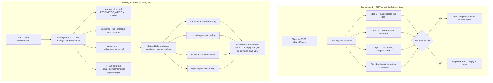
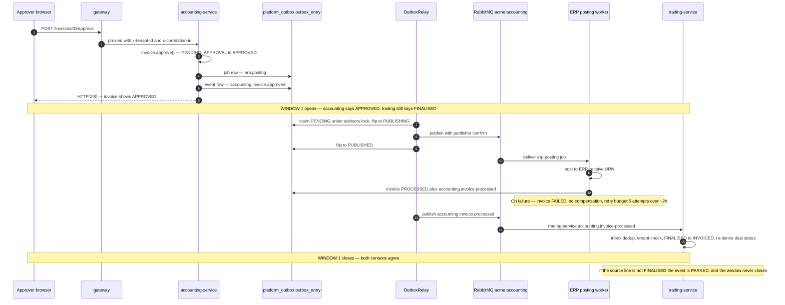
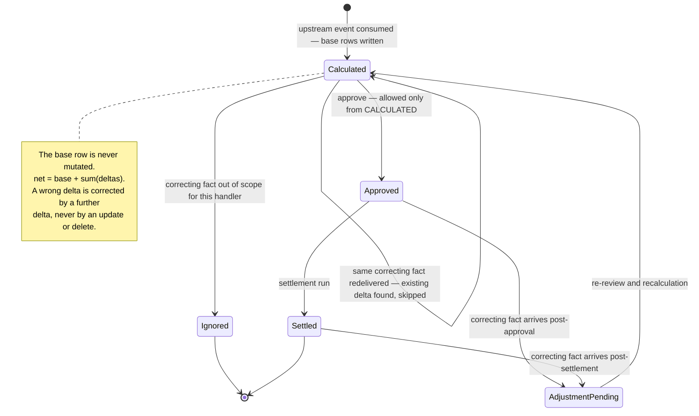
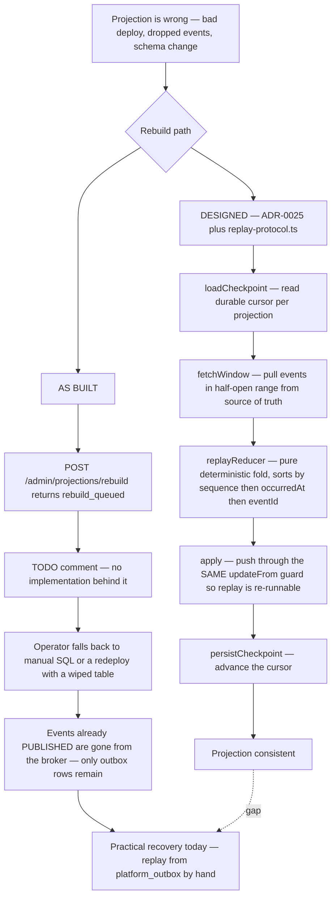

# Choreography, Sagas and the Cost of Eventual Consistency

This document answers one question: when a business operation spans several bounded contexts,
who is in charge? It establishes from the code and the ADRs that this platform is a pure
choreography — there is no orchestrator, no saga engine, and no process-manager class anywhere
in the Platform services — then argues that choice honestly, including the four multi-context flows
that exist, the one place a compensating action is actually modelled, the read models built from
events, and the places where the choreography is currently broken. Read this if you are about to
add a cross-context flow, if you are debugging why a downstream context has not caught up, or if
you are evaluating whether this design would survive your own workload.

---

## 1. What the platform chose, and where you can see it

The decision is visible in three places at once: an absence, a publish path, and a consumer wiring
convention.

### 1.1 The absence

There is no orchestration machinery in the repository. A search of `apps/platform` and `libs/platform`
for `saga`, `compensat`, `process-manager` and `orchestrat` returns only two categories of hit:
DDD docstrings of the form `@see DDD Practice #3 — Application service orchestrates aggregates`,
which describe orchestration _within_ one aggregate boundary, and one batch helper
(`lock-deal-batch.use-case.ts`) that loops over deals inside a single service. `@nestjs/cqrs` —
which ships a `Saga` primitive — is not a dependency. Temporal is mentioned exactly once in the
whole repository, in the consequences section of ADR-0017 (RabbitMQ Unified Messaging):

> Temporal.io evaluation deferred to M3 for complex sagas (e.g., invoice approval workflow)

That evaluation never happened. The invoice approval workflow, which ADR-0017 nominated as the
motivating example, shipped as a RabbitMQ work queue with a retry schedule and a terminal `FAILED`
state — described in §3.2 below.

### 1.2 The publish path

`EventPublisher.publish()` in `libs/platform/event-bus/src/lib/event-publisher.ts` is thirteen lines
of logic and takes no consumer list, no destination, and no acknowledgement:

```typescript
async publish<T>(em: EntityManager, event: DomainEvent<T>): Promise<void> {
  const entry = new OutboxEntry();
  entry.entryType = OutboxEntryType.DOMAIN_EVENT;
  entry.eventType = event.eventType;
  entry.payload = event as unknown as Record<string, unknown>;
  entry.routingKey = event.eventType;
  entry.status = OutboxEntryStatus.PENDING;
  em.persist(entry);
}
```

The producer's obligation ends at a row in `platform_outbox.outbox_entry`. `TradingEventPublisher`,
the service-level wrapper, states the consequence explicitly in its docstring: _"All events are
written to the outbox regardless of whether consumers exist."_ There is no request/reply, no
correlation of a response, and no place for a coordinator to hook in. A producer cannot fail
because a consumer failed, and cannot know that a consumer failed.

### 1.3 The consumer wiring convention

Every consumer declares its own queue, its own dead-letter exchange and its own dead-letter queue,
inside its own naming namespace, and _passively_ checks the source exchange rather than declaring
it. From `apps/platform/accounting-service/src/modules/events/trading-event-consumer.ts`:

```typescript
const EXCHANGE_NAME = 'acme.trading';                       // owned by trading-service
const QUEUE_NAME    = 'accounting-service.trading';         // owned by accounting-service
const DLX_NAME      = 'accounting-service.trading.dlx';
const DLQ_NAME      = 'accounting-service.trading.dlq';
...
await channel.checkExchange(EXCHANGE_NAME);   // passive — no `configure` needed
await channel.assertExchange(DLX_NAME, 'topic', { durable: true });
```

The comment above `checkExchange` is the architectural statement:

> The source exchange is owned by the PUBLISHING bounded context, not this consumer. Verify it
> exists PASSIVELY … this needs no `configure` permission — which BC-isolation correctly denies on
> a foreign exchange (an active `assertExchange` here yields
> `403 ACCESS_REFUSED - configure access to exchange '<x>' refused`).

This is choreography enforced by the broker's authorization model, not merely by convention. Each
service's RabbitMQ user in `charts/platform-rmq-bootstrap/values.yaml` carries a `configure` regex
scoped to `^(acme\.<own-bc>(\..*)?|<svc>-service\..*)$`. A service physically cannot create
topology inside another context's namespace, so it cannot install a coordinator queue there. The
`write` grants are equally narrow — `trading_user` may write only to `acme.trading`,
`acme.audit-feed` and `trading-service.*`. An orchestrator would need write access to every
context's exchange, and the permission model has no shape that would allow it.

### 1.4 The reasoning

Three decisions stack up to make choreography the only coherent option:

- **ADR-0014 (Microservices — Separate Binaries from Day One)** committed to one Docker image, one
  Helm values file and one ArgoCD Application per bounded context, before any service was written.
  The ADR is candid that this is a "distributed modular monolith" — separate processes, one
  PostgreSQL instance with per-context schemas — but the _deploy_ unit is per-context from day one.
- **ADR-0013 (Per-BC PostgreSQL Schema Isolation)** removed cross-context SQL joins, so a
  coordinator could not read another context's state cheaply anyway.
- **ADR-0017** made RabbitMQ the single asynchronous transport for both events and jobs, with
  per-context topic exchanges. Once the exchange is per-context and the permission model is
  per-context, the natural composition operator is "publish and let interested parties react".

The trade the platform accepted is stated most plainly in ADR-0063 (Invoice Generation from
Event-Carried Line-Item Snapshot), which rejected a synchronous cross-context call:

> Rejected: adds runtime cross-BC coupling + a failure mode, and no point-in-time guarantee;
> contradicts the event-driven posture.

and accepted the resulting duplication:

> Snapshot duplication (line data stored in both BCs) — accepted; it is the intended cost of BC
> autonomy and audit fidelity.

The following diagram contrasts what an orchestrated deal-lock would look like with what the code
actually does. The important structural difference is not the arrows: it is that in the
choreographed version, the only place a failure can roll anything back is the single PostgreSQL
transaction inside trading-service. Everything downstream of the outbox row is a separate,
independently-retried unit of work with its own failure handling.



Note the asymmetry in where the client's request ends. In the orchestrated shape the client waits
for the whole distributed operation. In the choreographed shape the HTTP 200 is returned when
trading-service's local transaction commits — before the outbox relay has even polled. Everything
after that point is the eventual-consistency window discussed in §6. The relay hop and the four
deliveries are drawn as designed, not as verified running — §8.1 and §8.2 explain why neither
currently happens.

---

## 2. The one place the platform nearly chose orchestration, and backed out

ADR-0012 (Stock Reservation via Saga Pattern, 2026-03-24) is the only ADR in the repository that
designs a saga. It was written in response to a genuine time-of-check-to-time-of-use race: two
concurrent `CreateSale` calls could both pass an availability check before either reservation was
written, overselling a purchase line. The ADR chose a command/reply saga over an
optimistic-plus-compensate design, and was explicit about why:

> Option A would accept the sale immediately and compensate (cancel + notify) if stock is
> insufficient. This creates a worse UX: the trader sees "sale created" then receives a
> cancellation notification. For a financial trading platform where deal accuracy is critical,
> immediate feedback is preferred over eventual correction.

That saga was never built. Searching the Platform services for `ReserveStock`, `StockReserved` or
`StockInsufficient` as a _command_ turns up nothing: there is a `StockInsufficientError` class in
trading-service, an `inventory.stock.reserved` _notification_ event, and no request/reply channel
between the two contexts.

What shipped instead is ADR-0070 (Trading stock-check serialization via `PESSIMISTIC_WRITE` on
purchase line items, 2026-07-02), which is the anti-saga: it solves the same race by making the
whole check-and-write local and transactional.

> Serialize the availability check and the sale write on the **purchase line item rows**
> themselves:
>
> 1. Inside the sale create/update transaction, load all referenced PLI rows with
>    `SELECT … FOR UPDATE` (MikroORM `LockMode.PESSIMISTIC_WRITE`), **sorted by PLI id** to
>    guarantee a deterministic lock order (deadlock avoidance for multi-line sales).

ADR-0070 does not pretend this is the end state. It records the saga as deferred, not rejected:

> **Accelerate the ADR-0012 reservation saga (synchronous RPC to inventory-service)** — the
> strongest long-term model, but cross-service scope, new failure modes (RPC timeouts gating sale
> commit), and contradicts this epic's reuse-first sizing. Deferred, not rejected — the saga
> remains the M3+ target.

and it reframes the residual debt precisely: _"the remaining debt is architectural placement
(trading-local vs inventory-owned), not correctness."_

The as-built consequence is that inventory-service is not a participant in a distributed decision
at all. Its `SaleCreatedHandler` consumes `trading.sale.created` _after_ the sale has already
committed, and its job is to project the consequence — create a `StockMovement`, create an
`ACTIVE StockReservation`, adjust the position — not to authorise it. If it finds no matching
position it logs and skips:

```typescript
const position = await this.positionRepository.findByPurchaseLineItemId(
  lineItem.purchaseLineItemId
);
if (!position) {
  this.logger.warn(
    `No stock position for purchaseLineItemId ${lineItem.purchaseLineItemId} — skipping`
  );
  continue;
}
```

That single `continue` is the whole architecture in miniature: a downstream context that cannot
apply an event drops it and carries on, because it has no authority to reverse the upstream
decision and no channel through which to ask.

---

## 3. The real multi-context flows, and what plays the role of a saga

There are four flows that cross a context boundary in a way that matters to the business. None of
them has a coordinator.

| Flow                                                | Contexts                             | Hops | Coordinating mechanism                    |
| --------------------------------------------------- | ------------------------------------ | ---- | ----------------------------------------- |
| Deal lock → commission calculation                  | trading → commission                 | 1    | Consumer-side "already calculated" guard  |
| Line finalised → invoice → ERP posting → write-back | trading → accounting → ERP → trading | 4    | Entity state machine + work queue + inbox |
| Sale created → stock reservation                    | trading → inventory                  | 1    | Per-effect UNIQUE index + inbox           |
| Credit note finalised → commission adjustment       | trading → commission                 | 1    | Append-only delta record                  |

### 3.1 Deal lock to commission

`CalculateCommissionUseCase.execute()` is invoked from a queue consumer, not a coordinator, and
its first act is a self-administered idempotency check:

```typescript
// 1. Idempotency: skip if commission already calculated for this deal
const existing = await this.calculationRepo.findByDealId(dealId);
if (existing.length > 0) {
  this.logger.debug(
    `Commission already calculated for deal ${dealNumber} (${dealId}) — skipping`
  );
  return;
}
```

Every subsequent guard is a `return` with a warning log: no commission rule set for the tenant, no
active rule, no traders on the deal. None of these produce a failure event, and none of them are
visible to trading-service. A deal can be locked, appear locked in the trading UI, and have no
commission rows forever, with only a `WARN` line as evidence. This is the single most important
behavioural property of choreography here: **a downstream context's inability to act is not an
error condition of the upstream operation.**

### 3.2 The long chain: finalise → invoice → ERP → write-back

This is the closest thing the platform has to a business process, and it is worth walking end to
end because it uses every mechanism the platform owns.

1. Trading finalises a line item and publishes `trading.line-item.finalised` carrying the full
   invoice-relevant snapshot (ADR-0063): line id, deal ref, quantity, unit price, currency and the
   FX rate snapshotted at confirmation.
2. Accounting's `TradingEventConsumer` persists an `InvoiceEligibility` row. Idempotency is a
   database constraint, not application logic:
   `UNIQUE(source_entity_id, source_entity_type, tenant_id)`.
3. An administrator calls `POST /api/v1/invoices/generate`. `GenerateInvoicesUseCase` groups the
   eligible rows into invoices, allocates each a sequential number, and publishes
   `accounting.invoice.created` — all inside one transaction, so a failure on invoice three of
   five persists none of them.
4. An approver calls the approve endpoint. `ApproveInvoiceUseCase` does three things in one
   transaction: transitions `PENDING_APPROVAL → APPROVED`, enqueues an ERP posting **job** through
   the same outbox table, and publishes `accounting.invoice.approved`. The job carries its own
   retry policy, which is where the platform's substitute for a saga's retry logic lives:

   ```typescript
   await this.jobEnqueuer.enqueue(txEm, {
     queue: ERP_POSTING_QUEUE,
     payload: { invoiceId: invoice.id, tenantId },
     deduplicationId: `erp-posting:${invoice.id}`,
     retryConfig: {
       maxRetries: 5,
       initialDelayMs: 60_000, // 1 minute
       maxDelayMs: 14_400_000, // 4 hours
       backoffMultiplier: 3, // 1m, 3m, 9m, 27m, 81m (capped at 4h)
     },
   });
   ```

5. The ERP posting worker transitions `APPROVED → PROCESSING`, checks for an existing successful
   posting audit row (its own idempotency), calls the ERP adapter, and on success writes a
   `ErpPostingAudit`, marks the invoice `PROCESSED` and publishes `accounting.invoice.processed`.
   On failure it writes a failure audit, marks the invoice `FAILED`, publishes
   `accounting.invoice.failed`, and re-throws so the message dead-letters.
6. Trading's `InvoiceProcessedConsumer` — the trading context's first and only inbound integration
   consumer — applies the write-back. `InvoiceProcessedHandler.handle()` performs five steps in a
   single transaction: record the inbox row, resolve the source entity, validate the event's tenant
   against the entity row, transition `FINALISED → INVOICED` through the entity's guarded method,
   re-derive the parent deal's status, and append a `deal_activity` projection row.

Two properties of step 6 are worth naming. First, the write-back **parks rather than fails**:

```typescript
// (3) State guard — only a FINALISED source may become INVOICED.
if (!resolved.isFinalised()) {
  await this.park(tx, event, "INVALID_STATE");
  return;
}
```

A validly-delivered event that cannot be applied is written to a `parked_message` row with a reason
and the payload, and acknowledged. It is not dead-lettered (the broker DLQ is reserved for poison
and transient failures) and it is not dropped. ADR-0072 draws that distinction deliberately: _"The
broker DLX remains the transport backstop for poison/transient failures; parking is the
domain-level quarantine."_

Second, the write-back's contract has already failed silently once in production, and the code
carries the scar tissue. From `apps/platform/accounting-service/src/modules/erp/infrastructure/erp-posting.worker.ts`:

> This publisher previously emitted an ad-hoc literal
> (`{ invoiceId, erpUrn, referenceNumber, type, idempotent }`) with `tenantId` only on the
> envelope: it silently omitted `sourceEntityType`, `sourceEntityId` and `processedAt`, so
> trading's write-back consumer resolved `undefined` for every real event and parked 100% of them —
> FINALISED never became INVOICED in production. Keep this return type; it is what stops that drift
> recurring.

That is the choreography tax rendered as a single paragraph. The producer compiled, the consumer
compiled, the queue was healthy, the messages were acknowledged, the metrics were green, and 100%
of the business outcome was quarantined. The fix was not a coordinator; it was typing the payload
builder against the shared `InvoiceProcessedEventPayload` contract so the compiler enforces the
wire shape. That is the platform's answer to cross-context coupling: a shared published-language
package (`libs/platform/event-contracts`) and per-pair contract tests, rather than a runtime authority.

The sequence below shows the flow with the two consistency windows marked. Each window is a period
in which two contexts hold different, individually-correct answers to the same business question.



### 3.3 What actually plays the saga's role

Since there is no saga engine, four mechanisms between them cover what a saga would have provided:

- **The aggregate state machine** provides the ordering guarantee. `INVOICED` is settable in
  exactly one place in trading-service — the entity's guarded `markInvoiced()`, called only from
  the write-back handler. The handler's docstring calls out that setting it anywhere else is
  architecture anti-pattern #4.
- **The work queue's retry config** provides bounded retry with backoff, per business step rather
  than per saga.
- **`parked_message`** provides the "stuck step" queue that a saga engine would render as a
  suspended workflow instance — with the advantage that it is a queryable SQL row with a reason
  code, and the disadvantage that nothing resumes it automatically.
- **The `processed_event` inbox** provides effectively-once processing, which is what lets every
  step be retried freely. ADR-0072: _"This upgrades at-least-once delivery to effectively-once
  processing."_

There is no timeout. Nothing anywhere notices that a step which should have completed in five
seconds has not completed in five hours. The nearest thing is the outbox-lag gauge (§7.4), which
measures the _relay's_ backlog, not any individual flow's progress.

---

## 4. Compensation, and its deliberate absence

Compensating transactions appear exactly once as a first-class domain concept, and are explicitly
refused in the one place a naive design would reach for them.

### 4.1 The one real compensating action: adjustment by delta

When a correcting fact arrives after a downstream context has already computed and persisted a
figure from the original one, that figure is now wrong. The platform does not recalculate and it
does not mutate. `ApplyAdjustmentUseCase` appends an immutable `CommissionAdjustment` child record
to each affected `CommissionCalculation`; the arithmetic that sizes the delta is domain policy and
lives in one calculator.

Idempotency is by business key rather than event id — the handler looks for an existing adjustment
carrying the same source id and skips if found. The original row is never touched; the net figure is
derived as base plus the sum of its deltas. This is the delta-record pattern recorded in ADR-008
(Commission Adjustments via Delta Records), and it is the right shape wherever the numbers are
auditable: the audit trail _is_ the sequence of deltas, and "compensation" is a new immutable fact
rather than an edit. Appending a delta to a row that has already been approved or settled is the one
case that does move status — the row drops into a re-review state rather than silently restating a
figure someone has already acted on.



### 4.2 The compensation that was refused

ADR-0059 is the platform saying no to a compensating transaction that a designer had already drawn.
A hi-fi prototype offered a one-click **Reverse** action on a record in a terminal state, plus a
ten-second client-side undo. The ADR rejects the whole shape:

> Porting the prototype's reverse as-is would invent lifecycle, event and accounting semantics
> across a BC boundary … INVOICED is terminal and invoices are owned by accounting-service; there is
> no client-side undo in the domain.

The as-built compromise is instructive. The frontend ships the Reverse button **disabled with an
accurate tooltip**, only the already-specified path is implemented, and the reversal is sequenced as
its own piece of work. The ADR is still `Proposed`. A visible, honestly-labelled gap in the UI was
judged cheaper than a cross-context compensation invented under deadline — and an affordance that
would have had one context author another context's lifecycle is a design smell, not a missing
feature.

### 4.3 Everywhere else, failure is terminal-plus-quarantine

The invoice state machine has no compensating path. `handlePostingFailure` writes an audit row,
marks the invoice `FAILED`, publishes `accounting.invoice.failed`, and re-throws to dead-letter the
job. Nothing un-approves the invoice, nothing releases the invoice number, nothing notifies trading
that the line will not become `INVOICED`. `notification-service` consumes `accounting.invoice.failed`
and emails somebody — which is the actual, human compensation mechanism.

The pattern generalises: where a distributed system textbook would put a compensating transaction,
this platform puts a durable quarantine row and a human. That is a legitimate choice at this scale
— the domain is financial, corrections must be auditable anyway, and an automatic compensation that
silently reverses a posted invoice would be worse than a stuck one. It is a bad choice at a scale
where nobody reads the quarantine.

---

## 5. CQRS projections: what is derived, who owns it, and how it rebuilds

Two independent projection systems exist, built for different reasons.

### 5.1 reporting-service — the cross-context read model

ADR-0025 (CQRS Read-Model Projections for Reporting) rejected REST fan-out at report time for four
reasons — availability coupling, cumulative latency, impossibility of cross-context SQL joins under
ADR-0013 schema isolation, and N+1 per report row — and built denormalised projections instead.

As built, `apps/platform/reporting-service` contains **eight** projection entities in the `reporting`
schema and **four** consumers, one per upstream context:

| Consumer                  | Queue                          | Binding        | Projections written                            |
| ------------------------- | ------------------------------ | -------------- | ---------------------------------------------- |
| `TradingEventConsumer`    | `reporting-service.trading`    | `trading.#`    | `rpt_deal_summary`, `rpt_line_item_summary`    |
| `AccountingEventConsumer` | `reporting-service.accounting` | `accounting.#` | `rpt_invoice_summary`, `rpt_accounting_period` |
| `CommissionEventConsumer` | `reporting-service.commission` | `commission.#` | `rpt_commission_summary`                       |
| `InventoryEventConsumer`  | `reporting-service.inventory`  | `inventory.#`  | `rpt_stock_position`                           |

That accounts for six of the eight tables. **`rpt_customer_summary` and `rpt_trader_summary` are
created by `Migration_001_create_projection_tables`, registered as MikroORM entities in
`app.module.ts`, whitelisted for custom reports, and written by nothing.** No consumer references
either class. Four of the fourteen pre-built report queries read exclusively from them —
`customer-analysis.query.ts` and `pnl-by-customer.query.ts` from `rpt_customer_summary`,
`trader-performance.query.ts` and `commission-summary.query.ts` from `rpt_trader_summary` — so those
four reports return zero rows in every environment, permanently, with no error.

Note also that ADR-0025 names the consumer groups `reporting.trading`, `reporting.accounting` and so
on. The code uses `reporting-service.trading`. That is not cosmetic: the comment in the consumer
explains that the ADR's names matched neither alternative of reporting's `configure` permission
regex `^(acme\.reporting(\..*)?|reporting-service\..*)$`, so the original names produced a 403 at
boot. The ADR was not updated.

### 5.2 The ordering guard, and what it cannot do

Every projection entity carries a `last_event_at` column and an `updateFrom` method with the same
shape. From `rpt-deal-summary.entity.ts`:

```typescript
updateFrom(
  data: Partial<{ status: string; counterpartyName: string; grossProfit: string; netProfit: string }>,
  eventAt: Date
): boolean {
  if (eventAt <= this._lastEventAt) return false;
  if (data.status !== undefined) this._status = data.status;
  ...
  this._lastEventAt = eventAt;
  return true;
}
```

`ProjectionService.upsert` calls it and treats `false` as a no-op:

```typescript
const existing = await fork.findOne(entityClass, findCriteria as never);
if (existing) {
  const updated = existing.updateFrom(updateData, eventTimestamp);
  if (!updated) {
    this.logger.debug(
      `Skipping stale event for ${entityClass.name} — event older than lastEventAt`
    );
    return;
  }
  await fork.flush();
} else {
  const entity = createFn();
  fork.persist(entity);
  await fork.flush();
}
```

This is last-writer-wins by producer wall-clock. It buys idempotency for free — a redelivered
message carries the same `timestamp`, fails the strict `>` comparison and is skipped — and it makes
out-of-order delivery within a single aggregate safe. It has three limits worth stating plainly:

- **It compares timestamps produced by different pods.** `DomainEvent.timestamp` is
  `new Date().toISOString()` on the producing service. Two events for the same aggregate emitted by
  two replicas with skewed clocks can be applied in the wrong order, or the later one silently
  dropped. There is no logical clock or sequence number on the envelope.
- **Equal timestamps lose.** Two genuinely distinct events with identical millisecond timestamps
  will see the second one skipped. UUID v7 event ids are time-ordered and would tie-break, but
  `updateFrom` does not look at them.
- **`upsert` is find-then-insert with no `ON CONFLICT`.** Two concurrent deliveries for a
  previously-unseen key can both take the `else` branch. There is no unique constraint violation
  handling here (contrast `SaleCreatedHandler`, which catches `UniqueConstraintViolationException`
  explicitly). Prefetch is 1 per consumer, which serialises within a replica but not across them.

### 5.3 Rebuild — designed, specified, and not wired

ADR-0025 states that _"An admin rebuild endpoint exists for schema evolution and corruption
recovery."_ The endpoint exists. It does nothing:

```typescript
@Post('rebuild')
async rebuild(@Req() req: { tenantId: string; userRole: UserRole }) {
  if (req.userRole !== 'SUPERADMIN' && req.userRole !== 'ADMIN') {
    throw new ForbiddenException('Admin access required');
  }
  // TODO: Trigger full rebuild from source services via REST seed
  return { status: 'rebuild_queued', tenantId: req.tenantId };
}
```

The sibling `GET /api/v1/admin/projections/status` endpoint is real: it returns row counts and
`MAX(last_event_at)` per table for the caller's tenant, which is the only lag signal a projection
operator has.

There is a designed replay protocol, in `src/bootstrap/replay-protocol.ts`, and it is deliberately
inert. Its header is unusually honest and worth quoting because it documents the seam that a real
rebuild cannot skip:

> **STATUS: REFERENCE IMPLEMENTATION — inert; NOT wired into DI** … This module is PURE: interfaces
>
> - pure functions ONLY … it performs NO I/O, reads NO clock, and holds NO mutable module state:
>   every function is a deterministic fold over its arguments.

and:

> `ReplayableEvent` is NOT directly assignable from a published `DomainEvent` … `sequence: number`
> ← the monotonic per-stream offset the live bootstrap reads from the outbox/event-store cursor. The
> `DomainEvent` envelope has NO `sequence` field of its own … Treating a `DomainEvent` as directly
> assignable would silently produce `NaN` sequences and `Invalid Date` checkpoints.

That is the crux of rebuild in this architecture. The projections' idempotency guard is
timestamp-based; a replay needs a monotonic cursor; the published envelope has no such field; and
the outbox table's `PUBLISHED` rows are the only candidate source, which makes the outbox an
accidental event store. Whether replay reads the per-context outbox or a dedicated event store is
listed as an unratified architectural question.



### 5.4 trading-service's own projection: `deal_activity`

ADR-0062 (Deal Activity Read-Model) added a second, quite different projection. The Deal Detail
screen's Activity tab needs a lifecycle history. The immutable audit trail lives in the Compliance
context (`audit-service`), fed by the one-way `acme.audit-feed` fan-out, and the ADR refuses to
reach back across that boundary:

> Query the Compliance audit-service from the FE/trading. **Rejected**: crosses the aggregate/BC
> boundary and the one-way Published-Language relationship; couples Trading to Compliance.

So trading projects its _own_ events into its _own_ table — but not from the message bus. The
projection happens synchronously at publish time, inside `TradingEventPublisher.publish()`, through
an optional port:

```typescript
await this.eventPublisher.publish(em, event);
if (!callerEm) {
  await em.flush();
}

// Best-effort deal-activity projection (ADR-0062). Runs in its own unit of work
// and swallows its own errors, so it never blocks or fails the authoritative
// outbox write above; the feed is eventually consistent and rebuildable.
await this.activityRecorder?.record(event);
```

`DealActivityRecorder.record()` catches everything and logs a warning. This is a different
consistency contract from the reporting projections: it is not fed by the broker, so it is immune
to relay and broker outages, but it is also _not_ rebuilt by them — an event whose projection throws
is lost from the activity feed until someone replays the outbox. The ADR is explicit that this is a
"convenience read-model", not the system of record, and that the boundary "must be documented so
future work doesn't conflate the two". The write-back handler in `invoice-processed.handler.ts`
appends to the same table from a _different_ code path, inside the write-back transaction — so
`deal_activity` has two writers with two different durability guarantees.

---

## 6. Where a user actually sees stale state

The eventual-consistency window is not theoretical here. These are the concrete places it surfaces.

**The dashboard is the widest window.** Every widget on the Platform dashboard reads
`reporting-service`, which reads projections. `DashboardController` sets `Cache-Control: max-age=30`
on each endpoint and the React Query hooks set `staleTime: 30_000`. So the displayed number can be
up to thirty seconds stale in the browser, on top of however far the projection lags, on top of the
relay poll interval. `openDeals` counts `rpt_deal_summary` rows where status is not `LOCKED` or
`CANCELLED`; if the trading projection is behind, a deal a trader just locked still counts as open.

**The deal list and deal detail are the narrowest.** They read trading-service directly. The batch
lock mutation invalidates every deal query on settle:

```typescript
export function useLockDealBatch() {
  const queryClient = useQueryClient();
  return useMutation({
    mutationFn: (dealIds: string[]) => tradingApi.lockDealBatch(dealIds),
    onSettled: () =>
      queryClient.invalidateQueries({ queryKey: dealKeys.all() }),
  });
}
```

Because the lock is committed in trading's own transaction before the HTTP response, this refetch
is read-your-writes correct. The platform's implicit rule — never stated in an ADR but consistently
followed — is: **operational screens read the owning service, analytical screens read projections.**
That is why the eventual-consistency window is mostly invisible during a trader's core loop and very
visible on the dashboard.

**Commission after a lock.** A trader locks a deal, the deal shows `LOCKED` immediately, and their
commission row does not exist yet. It appears when the relay publishes, the commission consumer
runs, and the trader refetches. There is no UI affordance for "commission pending" — the My
Commissions widget simply shows the pre-lock total, with `staleTime: 30_000`.

**Invoice status after approval.** Between approve and ERP posting there is a genuine multi-minute
window: the retry schedule is one minute, then three, nine, twenty-seven, eighty-one. During that
window accounting shows the invoice as `APPROVED` or `PROCESSING` while trading still shows the
source line as `FINALISED`. If the posting exhausts its budget the invoice sits at `FAILED` and the
trading line stays `FINALISED` forever, because nothing publishes a "will never be invoiced" event.

**Notifications.** The bell polls at `refetchInterval: 30_000` with `staleTime: 15_000`. Since the
notification itself is produced by a consumer of `commission.commission.calculated` or
`accounting.invoice.failed`, the end-to-end latency for "you have a new commission" is the outbox
poll plus the consumer plus up to thirty seconds of polling.

**The Activity tab.** Fed by `deal_activity`, which is written best-effort at publish time. A
projection failure is a permanently missing row in a history the user believes is complete. The tab
degrades gracefully in one respect worth noting — actor names are resolved from a workspace user
list and fall back rather than throwing — but there is no signal that a row is missing.

What the platform does about the window, concretely:

- Reads the authoritative service for anything transactional.
- Caps browser staleness with `Cache-Control` and `staleTime` rather than pushing invalidations.
- Instruments producer-side lag (§7.4) rather than consumer-side lag.

What it does not do: there is no ETag or version marker on projection responses, no "as of" stamp in
the UI, no stale badge, and no way for the frontend to tell that the projection it is reading is
five minutes behind the service it read a moment ago.

---

## 7. Debugging a choreographed flow

This is where choreography charges its highest recurring bill, and where the as-built state is
weakest.

### 7.1 correlationId — minted correctly, then discarded

The gateway is disciplined about correlation identity. `JwtValidationGuard` mints a fresh id per
request and never trusts an inbound one:

```typescript
// Always mint a fresh correlation id — never trust an inbound value, even
rawRequest.headers["x-correlation-id"] = randomUUID();
```

and `strip-gateway-headers.hook.ts` strips any client-supplied `x-correlation-id` before proxying,
with a regression test citing the correlation-spoofing issue that motivated it. Trading threads it
into `EventContext` and onto the envelope:

```typescript
correlationId: context?.correlationId ?? v7(),
```

The chain then breaks at the first downstream hop. `CalculateCommissionUseCase`, reacting to
`trading.deal.locked`, publishes its own event with:

```typescript
correlationId: dealId,
causationId: dealId,
```

`GenerateInvoicesUseCase` uses `correlationId: ctx.dealId`; the ERP worker uses
`correlationId: invoice.dealId ?? invoice.id`. None of them read the incoming event's
`correlationId`. So a request-scoped correlation id survives exactly one hop, and everything beyond
that is correlated by _business key_ instead. In practice `dealId` is a serviceable correlation key
for the trading/accounting/commission triangle — but it means you cannot ask "show me everything
that happened because of this HTTP request", only "show me everything that happened to this deal".

### 7.2 causationId — four different meanings

`DomainEvent.causationId` is documented in the contract as `// the event that caused this`. Four
distinct interpretations are shipped:

| Service                                                                  | Value assigned                                            | Matches the contract?              |
| ------------------------------------------------------------------------ | --------------------------------------------------------- | ---------------------------------- |
| inventory-service                                                        | `sourceEvent?.eventId ?? v7()`                            | Yes — the causing event's id       |
| trading-service (`TradingEventPublisher`)                                | `v7()` — a fresh random UUID                              | No — carries no information at all |
| trading-service (`lock-deal.use-case`), accounting, commission, document | the aggregate id (`dealId`, `invoice.id`, `creditNoteId`) | No — an entity id, not an event id |
| auth-service, user-service, tenant-service                               | `correlationId`                                           | No, and the code says so           |

The auth and OIDC publishers carry standing TODOs acknowledging it:

> `TODO(M2): All events in this file use correlationId === causationId (both uuidv4()). … set
causationId to the triggering command ID.`

The consequence is that `audit_entry.causationId` — which audit-service faithfully persists from the
envelope — cannot be used to reconstruct a causal chain, because for most producers it does not
point at an event. Only inventory-service's events form a walkable chain.

### 7.3 Distributed tracing — injected, never extracted

The relay injects W3C trace context into every published message:

```typescript
private injectTraceContext(): Record<string, string> {
  const api = require('@opentelemetry/api') as typeof import('@opentelemetry/api');
  const carrier: Record<string, string> = {};
  api.propagation.inject(api.context.active(), carrier);
  return carrier;
}
```

and provides the matching extractor as a static helper, complete with usage instructions:

```typescript
/**
 * Usage in consumers:
 *   const parentCtx = OutboxRelay.extractTraceContext(msg.properties.headers);
 *   api.context.with(parentCtx, () => { ... });
 */
static extractTraceContext(headers: Record<string, unknown> | undefined): unknown { ... }
```

**No consumer calls it.** A repository-wide search for `extractTraceContext` outside
`outbox-relay.ts` returns nothing. Every consumer parses `msg.content` and dispatches; the
`traceparent` header rides along and is dropped. So a distributed trace terminates at the relay's
publish span and a fresh, unparented trace begins in each consumer. The one piece of manual
correlation that does exist is in the trading write-back handler, which stamps tenant and deal onto
the current span:

```typescript
setTradingSpanAttributes({
  tenantId: resolved.tenantId,
  dealId: resolved.dealId,
});
```

which is a business-key correlation, again — not a trace link.

### 7.4 The outbox lag observer

The one real producer-side signal. `OutboxLagObserver` runs on a fifteen-second `setInterval`
(unref'd, so it never holds the event loop open) and recomputes a gauge from a single grouped query:

```sql
SELECT payload->>'tenantId' AS tenant,
       EXTRACT(EPOCH FROM (now() - min(created_at))) AS lag_seconds
  FROM platform_outbox.outbox_entry
 WHERE status = 'PENDING'
 GROUP BY payload->>'tenantId'
```

It is deliberately best-effort — a transient database error is logged at `debug` and retried on the
next tick, never thrown. It is also deliberately per-tenant, so one tenant's stall is visible rather
than averaged away. The observability chart's money-pipeline rule group defines five
PromQL rules over it and its siblings: outbox lag above 60s (warning, `for: 2m`), above 300s
(critical, `for: 1m`), any parked-message increase in five minutes (critical, `for: 0m`), any
message in a `trading-service.*dlq` (critical), and a sustained redelivery rate above 0.1/s
(warning, `for: 10m`).

Those rules have synthetic-trigger proofs (`promtool test rules` plus a standalone checker script),
which is unusually rigorous — and rigour about a rule is not the same thing as rigour about its
delivery. Where a GitOps root application enumerates its children explicitly rather than globbing a
directory, a rules file can be authored, reviewed and proven and still never be referenced by
anything that deploys. The generalisable point: an alert that is committed but not wired into a
deploy generator is a rule that exists in git and nowhere else, so the thing to assert in review is
the wiring, not the file.

Counter-based signals have a second version of the same gap. A metric incremented into an
in-process `Map`, in a service that vendors no Prometheus client and exposes no `/metrics` endpoint,
is a number the code knows and no operator can reach. Both are the same failure: a mechanism built
to the point where it looks finished, one wiring step short of producing a signal.

### 7.5 What is genuinely hard

Putting the above together, diagnosing a choreographed flow today means reasoning across five
substrates with no single join key:

1. Application logs, correlated by request-scoped `correlationId` for one hop and by business key
   thereafter.
2. `platform_outbox.outbox_entry` rows, which tell you whether the producer ever emitted and whether
   the relay ever published, but carry no consumer-side outcome.
3. RabbitMQ queue and DLQ depths, which tell you a message is stuck but not which business entity
   it concerns without inspecting payloads by hand.
4. `processed_event` and `parked_message` rows in each consuming service's own schema, which tell
   you whether a specific event id was applied, deduplicated or quarantined — but require you to
   already know the event id.
5. `audit_entry` in audit-service, which has _every_ event by virtue of the `acme.audit-feed`
   fan-out (ADR-0026) and is therefore the closest thing to a global event log — but whose
   `causationId` column is, per §7.2, not usable for causal reconstruction.

The three silent failure classes are the ones that cost the most:

- A relay-side version mismatch is published to `<exchange>.dlx` with `routingKey =
originalRoutingKey`, while the retention DLQ is bound with the literal key `dead-letter`. Nothing
  matches, the copy is dropped, and the outbox entry is marked `PUBLISHED`. The relay's own comment
  concedes the point: _"`<exchange>.dlx` is declared but has no bound DLQ yet, so the published copy
  is not retained — the WARN log is the current forensic record."_
- A parked message is a durable row and a metric increment — but an unwired alert and a quarantine
  with no replay tool leave the row itself as the only forensic record. Documenting a reprocess
  procedure in a runbook is not the same as shipping a tool that performs it.
- A projection `updateFrom` returning `false` logs at `debug` and returns. In production log levels
  that is invisible.

---

## 8. Where the choreography is currently broken

Everything in this section was verified by reading the code on the branch under review. These are
not hypotheticals, and they compound: several of them mask each other.

### 8.1 `trading.deal.locked` v2 is dead-lettered by its own relay

`LockDealUseCase` publishes with `version: 2` and `eventType: 'trading.deal.locked'`:

```typescript
const event: DomainEvent<DealLockedEventPayloadV2> = {
  eventId: v7(),
  eventType: 'trading.deal.locked',
  version: 2,
  ...
};
await this.eventPublisher.publish<DealLockedEventPayloadV2>(em, event);
```

`EventPublisher.publish()` sets `entry.routingKey = event.eventType` — the bare key, with no `.v2`
suffix. It is the only writer of `routingKey`; nothing anywhere calls `buildVersionedRoutingKey`
on the producer side.

The relay then validates the routing-key suffix against the payload version _before_ any
dual-publish logic runs:

```typescript
const validation = validateVersionRoutingKeyMatch({
  routingKey: entry.routingKey,   // 'trading.deal.locked'
  eventVersion: version,          // 2
  eventId: entry.id,
});
if (!validation.valid) {
  await this.dlxRoute(channel, exchange, { ..., reason: VERSION_BINDING_MISMATCH_REASON }, ...);
  return;   // no publish to the BC exchange, no publish to the audit feed
}
```

`validateVersionRoutingKeyMatch` derives `expectedVersion = 1` from a key with no `.vN` suffix, sees
`actualVersion = 2`, and returns invalid. The relay's own unit test locks in exactly this behaviour:

> `it('v=2 on base routing key routes to acme.trading.dlx with structured payload', ...)` — asserts
> one DLX call, and _"No publish to BC main exchange or audit-feed"_.

Meanwhile the tests that exercise the happy path hand-construct entries with
`routingKey: 'trading.deal.locked.v2'` — a value no producer ever writes. The bundle sets
`eventBus.transitionVersion: 2` on trading-service (with helm-unittest coverage asserting the env
var is rendered), but `transitionVersion` is only consulted _after_ validation passes, so it cannot
rescue this.

The net effect is that every `trading.deal.locked` event is DLX-routed to `acme.trading.dlx` — which
has no bound queue matching its key, per §7.5 — and the outbox entry is marked `PUBLISHED`.
Commission calculation, exchange-rate snapshotting in accounting, and the reporting deal projection
all sit downstream of an event that never arrives, and the outbox lag gauge reads zero because the
entry is not `PENDING`.

The contract is split across four artifacts — producer, publisher library, chart value and consumer
binding — and no test spans more than two of them. That is precisely the failure mode choreography
invites.

### 8.2 Eight of twelve services write to an outbox nothing drains

`enableRelay` is a compile-time module option, not an environment variable. It is `true` in
`auth-service`, `tenant-service`, `user-service` and `inventory-service`; it is `false` in
`trading-service`, `accounting-service`, `commission-service`, `notification-service`,
`document-service`, `reporting-service`, `ai-service` and `audit-service`. `EventBusModule` warns at
boot when the relay is off:

> `OutboxRelay is DISABLED — events written to outbox will NOT be published to RabbitMQ.`

Two facts make this more consequential than it first appears. `platform_outbox.outbox_entry` is a
**single shared table** — `charts/platform-pg-bootstrap/values.yaml` records `database: platform` with the
comment _"Shared database. Per-service isolation is via schemas (ADR-0013)"_, and the `OutboxEntry`
entity hard-codes `@Entity({ tableName: 'outbox_entry', schema: 'platform_outbox' })`, which
overrides each service's per-context default schema. Three services (auth, tenant, inventory) each
carry an `IF NOT EXISTS` migration for it, precisely because whichever runs first wins.

So the four running relays poll the _same_ rows, each holding a _different_ advisory lock id
(`OUTBOX_ADVISORY_LOCK_ID` is 900001–900013 per service), which means the mutual-exclusion the
advisory lock was designed to provide does not hold across them — it only serialises replicas of the
same service. And each relay publishes with its own AMQP credentials. `inventory_user`'s `write`
grant is `^(acme\.inventory(\..*)?|acme\.audit-feed(\..*)?|inventory-service\..*)$`; `auth_user`'s is
scoped to `acme.identity` and the audit feed. None of the four relaying services has `write` on
`acme.trading`, `acme.accounting` or `acme.commission`.

**Unverified:** this was not observed against a running cluster, so what a relay actually does with a
claimed `trading.*` entry in practice is not stated here — a `403 ACCESS_REFUSED` on publish closes
the AMQP channel, which would then trip the relay's reconnect path. What is verifiable from source is that
the table is shared, the lock ids differ, and no relaying service holds write permission on the
producing contexts' exchanges.

### 8.3 `OutboxEntry` is not registered with trading-service's MikroORM

`apps/platform/trading-service/src/app.module.ts` lists twenty-four entity classes. `OutboxEntry` is not
among them. The testcontainers harness (`test/testcontainers/setup.ts`) _does_ register it, with a
comment explaining that the lock flows write it in the same transaction — so integration tests
exercise a configuration production does not have.

This is the same defect class the inventory migration documents from an earlier incident:

> Without this table, registering `OutboxEntry` fixes the "Metadata for entity OutboxEntry not
> found" error but the relay then fails at the SQL level …

MikroORM requires an entity to be discovered before `em.persist()` will accept it. **Unverified:**
this was not run against a real database, so the runtime symptom is unconfirmed. The
static facts are that the production entity list omits the class, the test harness adds it back, and
`EventPublisher.publish()` calls `em.persist(new OutboxEntry())` on the caller's transactional
EntityManager.

### 8.4 `aggregateId` is never set by trading-service, and reporting asserts it

`DomainEvent.aggregateId` is optional in the contract. A repository search for `aggregateId` across
`apps/platform/trading-service/src` returns zero non-test hits — `TradingEventPublisher` does not set it
and neither does `lock-deal.use-case.ts`. reporting-service's trading consumer treats it as
guaranteed:

```typescript
if (event.eventType.startsWith('trading.deal.')) {
  await this.projectionService.upsert(
    RptDealSummary,
    { _dealId: event.aggregateId!, tenantId: event.tenantId },
    () => RptDealSummary.create({ tenantId: event.tenantId, dealId: event.aggregateId!, ... }),
    ...
```

`RptDealSummary._dealId` is `nullable: false`. On the create path this builds an entity with an
undefined non-nullable column. Because `setupRabbitConsumer` nacks-without-requeue on any handler
error, the message would dead-letter to `reporting-service.trading.dlq`. This defect is currently
masked by §8.1 and §8.2 — the events do not reach the exchange in the first place — which is exactly
why it has not been noticed.

### 8.5 The commission adjustment event is persisted into an EntityManager nobody flushes

`ApplyAdjustmentUseCase` writes each adjustment through the repository and then publishes on the
injected root EntityManager:

```typescript
await this.calculationRepo.save(calculation);          // TenantEntityManager: forks, persists, flushes
await this.eventPublisher.publish(this.em, { ... });   // persists into the ROOT em — no flush here
```

`TenantEntityManager.persist()` forks and flushes its own unit of work; `TenantEntityManager.flush()`
flushes the root `em`. So within the loop, iteration _N_'s queued outbox row happens to be flushed by
iteration _N+1_'s `save()`. After the final iteration there is no subsequent flush, and this use case
runs from a RabbitMQ consumer, not an HTTP request, so there is no request-scoped flush to rescue it.
This also violates the platform's stated outbox-atomicity convention — the caller's transactional EM
should carry both the state change and the event — which `calculate-commission.use-case.ts` follows
correctly with `em.transactional`.

### 8.6 ADR references in code point at the wrong number

`with-inbox.ts`, `invoice-processed.handler.ts` and several consumers cite the inbox/parked-message
decision as ADR-0072 in some places and `docs/adr/0068-platform-inbox-idempotency-parked-message-pg-tables.md`
in others. The file at 0068 is the wildcard-TLS decision; the inbox ADR is 0072. This is renumbering
drift from a merge, harmless in itself, and a useful reminder that in a choreographed system the
documentation _is_ part of the coupling surface.

---

## 9. The honest cost ledger

| Cost                                                 | Mitigation in place                                                                                                                                                     | Residual risk                                                                                                                                                                                                                |
| ---------------------------------------------------- | ----------------------------------------------------------------------------------------------------------------------------------------------------------------------- | ---------------------------------------------------------------------------------------------------------------------------------------------------------------------------------------------------------------------------- |
| A downstream context can silently not react          | `parked_message` rows with reason codes; `*_parked_messages_total` counter; DLQ per consumer                                                                            | A committed alert rule is not a deployed one; where the deploy generator enumerates its inputs, an unreferenced rules file pages nobody and a `WARN` log becomes the real detector.                                          |
| No global transaction across contexts                | Transactional outbox makes state change and intent atomic _within_ a context; inbox makes application effectively-once                                                  | Cross-context invariants are unenforceable by construction. A locked deal with no commission row is a legal database state.                                                                                                  |
| No timeout on a multi-step flow                      | ERP posting job has a bounded retry schedule (5 attempts, ~2h)                                                                                                          | Nothing notices a flow that stalls between steps. There is no per-flow SLA, only a relay-level lag gauge.                                                                                                                    |
| Contract drift between producer and consumer         | Shared published-language package `@acme/event-contracts`; typed payload builders; Pact tests on specific pairs                                                         | Typing catches shape drift only where the builder is typed — the invoice write-back incident (100% parked) predates that. The taxonomy as a whole has no schema registry; ADR-0036 defers one explicitly.                    |
| Version negotiation is per-message, not per-contract | Relay validates routing-key suffix against `payload.version` and DLXes mismatches; `publishToBoth` supports a rolling-deploy dual-publish window                        | No producer writes a versioned routing key, so the only shipped v2 event fails validation and is dropped (§8.1). The DLX has no bound retention queue, so the evidence is a log line.                                        |
| Causal debugging across contexts                     | Gateway mints and protects `correlationId`; relay injects W3C `traceparent`; audit fan-out captures every event                                                         | `correlationId` is overwritten with a business key at the first hop; `causationId` has four incompatible meanings; no consumer calls `extractTraceContext`, so traces do not span the broker.                                |
| Read models drift from sources                       | `last_event_at` guard on every projection; `GET /admin/projections/status` exposes row counts and max event time                                                        | Rebuild is a `TODO` stub; the designed replay protocol is inert and needs a monotonic `sequence` the envelope does not carry. Two of eight projections are never written at all, silently emptying four of fourteen reports. |
| Users see stale numbers                              | Operational screens read the owning service; analytical screens accept 30s cache plus 30s `staleTime`                                                                   | No freshness signal reaches the UI. A five-minute-stale dashboard is visually identical to a current one.                                                                                                                    |
| Duplicate delivery                                   | `processed_event` inbox keyed `(consumer, event_id)`; per-effect UNIQUE indexes such as `stock_movement.event_id`; `Idempotency-Key` interceptor on financial mutations | Adopted in trading and inventory (the reference implementations). Commission, accounting and notification consumers still rely on hand-rolled business-key guards, each of which must be re-proven per handler.              |
| Operational replay                                   | DLQs are durable quorum queues bound to each consumer's DLX; parked messages retain the full payload                                                                    | No committed reprocess tooling. Replay is a manual broker-admin procedure per the runbook. Version-mismatch envelopes are not retained at all.                                                                               |
| Four relays share one outbox table                   | Per-service `OUTBOX_ADVISORY_LOCK_ID` allocation; three-phase claim/publish/persist cycle that cannot roll back a successful publish                                    | The lock ids differ per service, so mutual exclusion holds within a service's replicas but not across services sharing the table (§8.2).                                                                                     |

### What this design buys, in exchange

It would be dishonest to list only costs. The choreography delivers three things that are visible in
the code:

- **Deployability.** ADR-0033 groups services into five bounded-context bundles that ship
  independently. Nothing in the event path requires a coordinated release, because nothing waits on
  anything. The one place that _did_ need coordination — a v2 event contract — got a dual-publish
  mechanism precisely so it would not.
- **Blast radius.** The write-back handler is deliberately dependency-free ("_so it is exercised
  directly by Testcontainers and contract specs_"), reads its EntityManager from a registry seam, and
  can be disabled by unbinding one queue. Its own docstring names the rollback:
  _"Rollback = unbind the queue — the service keeps running, simply stops receiving
  invoice.processed."_ No orchestrator would offer that.
- **Auditability for free.** Because every state change is an event and every event is fanned out to
  `acme.audit-feed` (ADR-0026), the audit trail is a byproduct rather than a feature. Adding a new
  bounded context adds it to the audit feed with zero binding changes — which is exactly the trap
  the ADR's rejected alternative (per-context wildcard bindings) would have set.

The reasonable conclusion is not that choreography was the wrong choice. It is that choreography
front-loads the design cost into _observability and contract discipline_, and this platform has
built the mechanisms (outbox, inbox, parked messages, versioned routing, audit fan-out, lag gauges,
promtool-proven alerts) considerably faster than it has wired them up. Most of §8 is not a design
flaw; it is the gap between a mechanism existing and a mechanism being switched on, which is the
characteristic failure mode of a system where no single component is responsible for the whole flow.

---

## Where this connects

**Survey doc for this area**

- [`platform/integration-patterns.md`](../../platform/integration-patterns.md) — the survey of the
  outbox, inbox, parked messages, stock reservation and CQRS projections as patterns. This document
  is the reasoning layer beneath it.

**Sibling deep-dives in this series**

- [`deep-dives/events/`](./) — the rest of the events series covers the relay's three-phase cycle,
  inbox and idempotency mechanics, and the event contract and versioning scheme in detail. This
  document assumes those mechanisms and asks what coordination style they add up to.
- [`../rabbitmq/01-topology.md`](../rabbitmq/01-topology.md) — broker topology, permissions and dead-letter mechanics
  referenced throughout §1.3, §7.5 and §8.2.
- [`../multi-tenancy/04-enforcement.md`](../multi-tenancy/04-enforcement.md) — the fail-closed tenant filter and
  `TenantEntityManager` fork semantics that §8.5 depends on.

**Related survey material**

- [`platform/event-catalog.md`](../../platform/event-catalog.md) — the envelope, naming grammar,
  per-context taxonomy and the ADR-0036 versioned-routing scheme, including its own verified-gaps
  list. Read §5.3 there alongside §8.1 here: the catalog documents the _intended_ v2 transition
  wiring, and this document traces what the producer actually writes.
- [`backend/05-messaging.md`](../../backend/05-messaging.md) — message lifecycle, outbox entry
  states, consumer reconnect discipline and the broker permission model.
- [`backend/03-data-architecture.md`](../../backend/03-data-architecture.md) — per-context schema
  isolation (ADR-0013) and the shared-database reality that makes `platform_outbox` a single table.
- [`backend/06-caching.md`](../../backend/06-caching.md) — the cache-only Redis constraint that
  forced the inbox, idempotency-key and parked-message stores into PostgreSQL (ADR-0072).
- [`backend/04-authn-authz.md`](../../backend/04-authn-authz.md) — gateway header minting and
  stripping, which is where `correlationId` identity begins (§7.1).
- [`frontend/03-state-and-data.md`](../../frontend/03-state-and-data.md) — the React Query
  `staleTime` and invalidation conventions that determine how much of the eventual-consistency
  window a user actually perceives (§6).

**Deciding ADRs cited here**

ADR-008 (commission adjustments via delta records), ADR-0011 (commission webhook consistency model —
the legacy-stack predecessor of this design), ADR-0012 (stock reservation saga, superseded in
practice), ADR-0013 (per-context schema isolation), ADR-0014 (separate binaries from day one),
ADR-0017 (RabbitMQ unified messaging, where the Temporal evaluation was deferred), ADR-0018
(transactional outbox), ADR-0025 (CQRS read-model projections), ADR-0026 (audit-feed fan-out),
ADR-0033 (context-aligned bundle deploy units), ADR-0036 (versioned event routing keys), ADR-0059
(deal reversal as a credit-note correction, still Proposed), ADR-0062 (deal-activity read model),
ADR-0063 (invoice generation from event-carried line items), ADR-0070 (stock-check serialization via
row locks), ADR-0072 (inbox, idempotency-key and parked-message tables).
