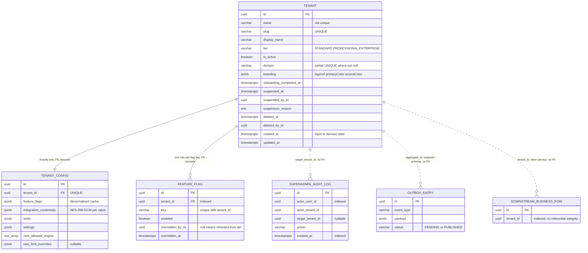
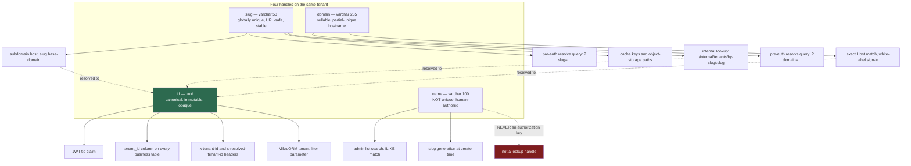
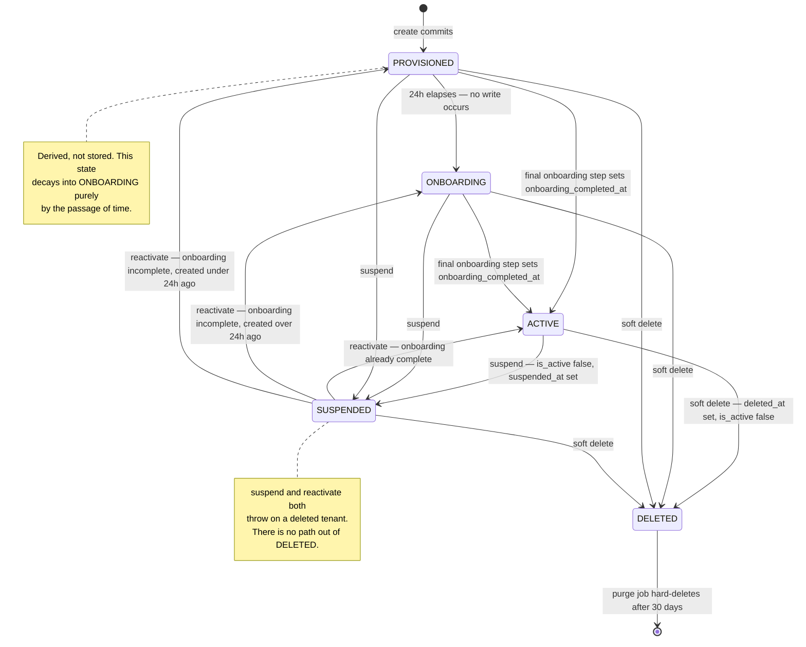
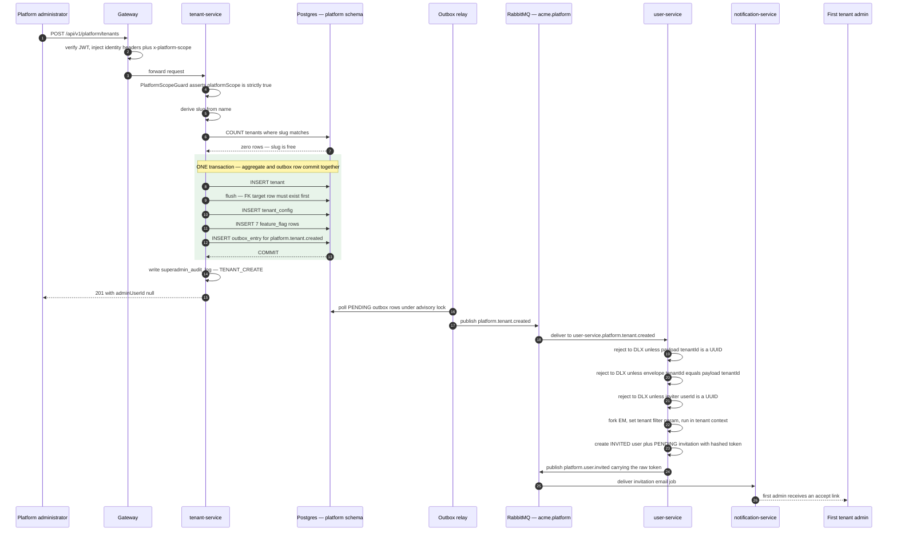

# The Tenant Model

This document answers a deliberately narrow question: in this platform, what _is_ a tenant —
concretely, as rows, columns, constraints and code paths? It covers the tenant aggregate field
by field, the four different handles that identify the same tenant, the lifecycle states (which
are derived, not stored), what provisioning actually creates, how per-tenant integration
credentials are encrypted and re-keyed, and the seed fixtures that make local development
multi-tenant. Read it if you are about to touch tenant provisioning, tenant resolution, the
`platform` schema, or anything that assumes a tenant has a stable identifier.

Everything below was read from the tenant-service source, its migrations, its seed, and the
consumers of its events. Where the written specification and the running code disagree, the
disagreement is called out inline rather than smoothed over — those divergences are the most
useful part of a document like this.

---

## The one-paragraph answer

A tenant is **one row in `platform.tenant`**, plus **exactly one row in `platform.tenant_config`**,
plus **N rows in `platform.feature_flag`** (N = 7 at creation time, one per standard flag key).
That is the whole physical footprint. There is no per-tenant database, no per-tenant schema, no
per-tenant database role, no per-tenant credential, no per-tenant queue, no per-tenant Kubernetes
object. Every other service in the platform knows a tenant only as a `tenant_id uuid` column on
its own tables, with **no foreign key** pointing back at `platform.tenant` — the schemas are
owned by different services and are treated as logically separate databases. Isolation is
therefore a _query-time_ property (a global ORM filter plus a session variable), not a _storage_
property.

That choice is what makes tenant provisioning cheap — a single database transaction — and it is
also what makes the tenant id the single most load-bearing value in the system. Get it wrong and
nothing else can be right.

---

## The tenant aggregate, field by field

The aggregate root lives at `apps/platform/tenant-service/src/modules/tenant/domain/entities/tenant.entity.ts`
and maps to `platform.tenant`. Every column is created in `Migration_001_initial`, except the
partial unique index on `domain`, which arrives in `Migration_005`.

The entity is unusual for this codebase in that it deliberately does **not** extend
`TenantBaseEntity` (the abstract base every tenant-scoped entity extends). It has no `tenant_id`
column, because it _is_ the tenant. It carries the `@TenantExempt()` marker for the same reason.

### `platform.tenant` — 16 columns

| Column                    | Type           | Constraint                              | What it means in business terms                                                                                                                                                                                                     |
| ------------------------- | -------------- | --------------------------------------- | ----------------------------------------------------------------------------------------------------------------------------------------------------------------------------------------------------------------------------------- |
| `id`                      | `uuid`         | PK, default `gen_random_uuid()`         | The canonical, permanently stable tenant identity. This is the value that appears as `tenant_id` on every business table in every other service, and as the `tid` claim in every access token. Never reused, never re-issued.       |
| `name`                    | `varchar(100)` | NOT NULL                                | Internal name used for logs, admin tooling and search. **Not unique.** Two tenants may legally share a name.                                                                                                                        |
| `slug`                    | `varchar(50)`  | NOT NULL, UNIQUE (`tenant_slug_unique`) | The URL-safe handle. Appears in subdomains, cache keys and storage paths. Globally unique and treated as immutable — there is no code path that changes it after creation.                                                          |
| `display_name`            | `varchar(150)` | NOT NULL                                | The human-facing label rendered in the UI header, on the sign-in page and in reports.                                                                                                                                               |
| `tier`                    | `varchar(20)`  | NOT NULL, default `'STANDARD'`          | Subscription tier — one of `STANDARD`, `PROFESSIONAL`, `ENTERPRISE`. Drives the default feature-flag set and the default resource limits. Stored as a varchar, not a Postgres enum, with the enum enforced only in the ORM mapping. |
| `is_active`               | `boolean`      | NOT NULL, default `true`                | The hard access switch. `false` means the gateway rejects every authenticated request for this tenant. Written `false` by both suspension and soft-delete.                                                                          |
| `domain`                  | `varchar(255)` | nullable, partial UNIQUE where NOT NULL | The tenant's own custom hostname for white-label access. Discussed in detail below.                                                                                                                                                 |
| `branding`                | `jsonb`        | nullable                                | `{ logoUrl, primaryColor, accentColor }`. Read by the pre-auth resolve endpoint to paint the tenant's sign-in page before any session exists.                                                                                       |
| `onboarding_completed_at` | `timestamptz`  | nullable                                | Set once the five-step onboarding checklist is complete. Null means the tenant is still in setup. This is the gate for "full access".                                                                                               |
| `suspended_at`            | `timestamptz`  | nullable                                | When a platform administrator suspended the tenant.                                                                                                                                                                                 |
| `suspended_by_id`         | `uuid`         | nullable                                | Which administrator suspended it. No FK — the user lives in another service's schema.                                                                                                                                               |
| `suspension_reason`       | `text`         | nullable                                | Free text. Deliberately **never** returned by the pre-auth resolve endpoint, so an anonymous caller cannot read it.                                                                                                                 |
| `deleted_at`              | `timestamptz`  | nullable                                | Soft-delete marker. Starts the 30-day retention clock.                                                                                                                                                                              |
| `deleted_by_id`           | `uuid`         | nullable                                | Which administrator initiated deletion. No FK.                                                                                                                                                                                      |
| `created_at`              | `timestamptz`  | NOT NULL, default `now()`               | Creation timestamp. Load-bearing: it is an _input to the derived lifecycle state_ (see below), not just an audit field.                                                                                                             |
| `updated_at`              | `timestamptz`  | NOT NULL, default `now()`               | Touched by the ORM on every update.                                                                                                                                                                                                 |

Two structural notes that are easy to miss:

**All mutable state is private with getters.** Every field except `id`, `createdAt` and
`updatedAt` is a private `_`-prefixed property with an explicit `fieldName` mapping and a public
getter. There are no public setters. State changes go exclusively through six domain methods:
`updateProfile`, `changeTier`, `suspend`, `reactivate`, `softDelete`, `completeOnboarding`. This
is what lets the entity hold its own invariants — for example, `suspend()` and `reactivate()`
both refuse outright on a deleted tenant:

```ts
suspend(byId: string, reason: string): void {
  if (this._deletedAt !== null) {
    throw new Error('Cannot suspend a deleted tenant');
  }
  this._isActive = false;
  this._suspendedAt = new Date();
  this._suspendedById = byId;
  this._suspensionReason = reason;
}
```

**There are two construction paths.** `Tenant.create(...)` is the validating factory used by the
API: it rejects a display name shorter than three characters and normalises/validates the custom
domain through the `TenantDomain` value object. `Tenant.fromTrusted(...)` skips hostname
validation and is used for ORM hydration, test fixtures, and the seed — but it still
lowercase-normalises the domain, on the grounds that a mixed-case row persisted before the value
object existed must still resolve.

### The satellite tables

`platform.tenant_config` (10 columns) holds everything that is per-tenant _configuration_ rather
than per-tenant _identity_:

| Column                      | Type          | Notes                                                                                                                                      |
| --------------------------- | ------------- | ------------------------------------------------------------------------------------------------------------------------------------------ |
| `id`                        | `uuid`        | PK                                                                                                                                         |
| `tenant_id`                 | `uuid`        | NOT NULL, UNIQUE, FK → `platform.tenant(id)` `ON DELETE CASCADE`. One config row per tenant, enforced by the database.                     |
| `feature_flags`             | `jsonb`       | NOT NULL default `{}`. A denormalised cache of the `feature_flag` rows. See the staleness defect below.                                    |
| `integration_credentials`   | `jsonb`       | NOT NULL default `{}`. Every top-level string value is an independently encrypted envelope.                                                |
| `limits`                    | `jsonb`       | NOT NULL default `{}`. `{ maxUsers, maxDeals, maxDealsPerMonth, storageQuotaMb }` plus optional usage counters.                            |
| `settings`                  | `jsonb`       | NOT NULL default `{}`. The catch-all: currency, timezone, date format, fiscal year start, company details, onboarding checklist, logo URL. |
| `cors_allowed_origins`      | `text[]`      | NOT NULL default `{}`. Wildcards are rejected at the application layer.                                                                    |
| `rate_limit_overrides`      | `jsonb`       | nullable. `{ tenantMax, userMax }`. Null means "use the global defaults".                                                                  |
| `created_at` / `updated_at` | `timestamptz` | NOT NULL                                                                                                                                   |

`platform.feature_flag` (8 columns) is the source of truth for feature availability: `id`,
`tenant_id` (FK, cascade delete, indexed), `key varchar(100)`, `enabled boolean`,
`overridden_by_id uuid`, `overridden_at timestamptz`, `created_at`, `updated_at`, with a composite
unique constraint on `(tenant_id, key)`. The `overridden_by_id` column is what distinguishes an
explicit administrator override from an inherited tier default — and that distinction is exactly
what makes a tier change safe, because the recalculation preserves overridden rows and rewrites
only the inherited ones.

Two further tables live in the same service but outside the tenant aggregate:
`platform.superadmin_audit_log` (created in `Migration_002`, indexed on `actor_user_id` and
`created_at`) and `platform_outbox.outbox_entry` (created in `Migration_003`, in its own schema,
with a partial index for pending rows). The outbox is what makes tenant lifecycle events
transactionally consistent with tenant writes.



The dotted relationships in that diagram are the interesting ones. `SUPERADMIN_AUDIT_LOG`,
`OUTBOX_ENTRY` and every downstream business row reference a tenant by id but carry **no foreign
key**. For the downstream rows that is a deliberate architectural constraint: each bounded context
owns its own schema and must never take a cross-schema dependency, so referential integrity for
`tenant_id` simply does not exist outside the `platform` schema. The practical consequence is that
a tenant hard-delete cannot cascade to business data — it has to be broadcast as an event and
honoured by each service independently.

### The `domain` column and its partial unique index

The custom-domain column is worth its own section because it is the only column with a
non-obvious constraint, and the constraint is load-bearing.

`Migration_005_add_tenant_domain_partial_unique_index` creates:

```sql
CREATE UNIQUE INDEX IF NOT EXISTS "tenant_domain_unique"
  ON "platform"."tenant" ("domain") WHERE "domain" IS NOT NULL;
```

The `WHERE "domain" IS NOT NULL` predicate is the whole point. The overwhelming majority of
tenants have no custom domain at all — they are reached on `{slug}.{platform-base-domain}` — so
the column is null for most rows. A plain `UNIQUE (domain)` would be semantically wrong for this
data shape: it would express "at most one tenant may have no custom domain", which is the exact
opposite of the intent. (Postgres happens to treat NULLs as distinct in a unique index, so a plain
unique constraint would not actually reject the second null row — but relying on that quirk to
express a business rule is how portability bugs are born. The partial predicate says what is meant.)

What breaks without the index? Custom-domain resolution is an **exact equality lookup**:

```ts
async findByDomain(domain: string): Promise<Tenant | null> {
  return this.em.findOne(
    Tenant,
    { _domain: TenantDomain.normalize(domain) } as never,
    NO_TENANT_FILTER
  );
}
```

`findOne` returns the first match. With two rows sharing a domain — which nothing else prevents,
since the entity mapping does not declare `unique: true` on the field — which tenant a given
browser reaches would depend on physical row order. That is a cross-tenant data exposure produced
purely by a duplicate configuration row, with no attacker involvement. The partial index makes the
duplicate impossible to insert in the first place.

The second half of the same guarantee is normalisation. `TenantDomain` lowercases and trims at
the write boundary, because DNS is case-insensitive while a `varchar` comparison is not. Without
that, a row stored as `Trading.CO-D.example` would never match a browser's lowercased
`trading.co-d.example` Host header — silent non-resolution, no error anywhere — _and_ two rows
differing only in case could coexist under the unique index. The value object enforces the
hostname shape as well: at least two dot-separated labels, each 1–63 characters of `[a-z0-9-]`
with no leading or trailing hyphen, total length ≤ 253.

There is a third method on the value object that exists specifically because validation and
lookup have different failure semantics:

```ts
/**
 * Normalize a raw domain to its canonical lookup form (trim + lowercase) WITHOUT
 * throwing. Used on the read/lookup boundary where an unknown host must resolve to a
 * 404, never a 400 — the resolve path classifies, it does not validate.
 */
static normalize(value: string): string {
  return value.trim().toLowerCase();
}
```

A write must reject a malformed hostname with a validation error. A _read_ must not: an arbitrary
Host header arriving at the gateway is untrusted input that should classify to "no tenant", not
produce a 400 that tells the caller their input was structurally interesting.

**Divergence worth knowing:** the written service documentation lists the custom domain as an
`ENTERPRISE`-tier feature. The code does not enforce that anywhere — `Tenant.create()` accepts a
domain regardless of tier, and the dev seed itself assigns a custom domain to a `STANDARD`-tier
tenant. Tier gating for custom domains exists in the tier feature-flag table (`custom_branding`)
but nothing reads that flag when setting `domain`.

---

## Four handles on one tenant

A tenant can be referred to by four different values, and they have genuinely different
properties. Confusing them is the single most common source of tenant bugs in this codebase — the
login flow has already been broken once by treating a slug as if it were an id.



**`id` is the only handle that authorises anything.** It is the value in the `tid` JWT claim, the
value the gateway injects as `x-tenant-id` after verifying that token, the value bound into the
ORM tenant filter, and the value written to every `tenant_id` column. It is safe to put in a URL
in the sense that it is opaque and non-enumerable, but it is not _meaningful_ to a user.

**`slug` is the user-visible, URL-safe handle**, and it is the one that appears in hostnames. Its
invariants are enforced by the `TenantSlug` value object: lowercase, 3–50 characters, alphanumerics
and hyphens only, no leading or trailing hyphen, and no consecutive hyphens. That last rule is not
cosmetic — it keeps `fromName` idempotent and keeps generated slugs from colliding in confusing
ways. The slug is globally unique across all tenants, which is what makes `{slug}.{base-domain}`
a workable addressing scheme, and it is treated as immutable: the update path exposes
`displayName`, `domain`, `branding` and `tier`, and nothing else.

Because the slug is unique and stable it doubles as a _cache key_ and a _storage path_ component.
That is convenient and also a constraint: renaming a slug would orphan cached resolve entries and
stored assets, which is a further practical reason nothing implements a rename.

**`name` is not a handle at all** in the lookup sense. It is not unique, and no code path resolves
a tenant by name. This matters because the pre-auth login payload field is called `tenantId` and
the resolver that reads it is documented in terms of "tenant name":

```ts
async resolve(identifier: string): Promise<string | null> {
  if (isUUID(identifier)) {
    return identifier;
  }
  const resolved = await this.tenantResolver.resolveSlug(identifier);
  return resolved?.tenantId ?? null;
}
```

The non-UUID branch resolves through `/internal/tenants/by-slug/:slug` — so what the code calls a
"tenant name" is in fact the **slug**. The naming is unfortunate; the behaviour is correct and
worth stating plainly, because a genuine `name` value ("CO-A Ltd") will never resolve.

This resolver exists to close a specific gap. Once hostname-based tenant resolution landed, the
front end began deriving the tenant from the hostname and sending the resolved _slug_ in the
pre-auth request. But `/auth/login` and `/auth/password/reset-request` are public routes with no
JWT, so the gateway's JWT-derived `x-tenant-id` resolution does not cover them. Without the
resolver, a hostname-derived slug arriving at password login produced a 500. Note also the
deliberate failure mode: an unresolvable identifier returns `null` rather than throwing, and each
caller decides how to fail without leaking tenant existence — login collapses to a generic invalid
credentials error, forgot-password to a silent no-op.

**`domain` is the fourth handle and the only optional one.** It resolves by exact equality only.
The resolve use case never falls back from a failed domain lookup to a slug lookup, which is a
security property rather than an optimisation: a host like `sub.trading.co-d.example` must not be
allowed to match the tenant that owns `trading.co-d.example`.

The gateway-side classifier that decides _which_ handle a Host header represents is pure and
I/O-free, and its comparison is anchored on a dot boundary rather than a raw suffix match:

```ts
const suffix = `.${normalizedBase}`;
if (normalizedHost.endsWith(suffix)) {
  const label = normalizedHost.slice(0, -suffix.length);
  if (label.length > 0 && !label.includes(".")) {
    return { kind: "subdomain", slug: label };
  }
}
```

A raw `endsWith(baseDomain)` would classify an attacker-registered `evilacme-platform.example` as
a subdomain of `acme-platform.example`. The leading dot closes that. The single-label check
(`!label.includes('.')`) closes the mirror-image case: `a.b.{base}` is not a tenant subdomain,
because slugs cannot contain dots. The classifier is also port-tolerant and strips a single
trailing FQDN dot, since browsers and proxies legitimately send both `host:5173` and
`host.example.` forms.

---

## The lifecycle is derived, not stored

There is no `status` column on `platform.tenant`. The lifecycle state is **computed from four
columns every time it is asked for**:

```ts
getState(): TenantState {
  if (this._deletedAt !== null) return TenantState.DELETED;
  if (this._suspendedAt !== null) return TenantState.SUSPENDED;
  if (this._isActive && this._onboardingCompletedAt !== null) return TenantState.ACTIVE;

  const twentyFourHoursAgo = new Date();
  twentyFourHoursAgo.setHours(twentyFourHoursAgo.getHours() - 24);
  if (this._isActive && this.createdAt > twentyFourHoursAgo) return TenantState.PROVISIONED;

  return TenantState.ONBOARDING;
}
```

The real states are `PROVISIONED`, `ONBOARDING`, `ACTIVE`, `SUSPENDED`, `DELETED` — plus the
terminal _absence_ of the row after purge. There is **no `archived` state** and no `created` state
distinct from `PROVISIONED`; if you were expecting a five-step `created → provisioned → active →
suspended → archived` machine, the code does not have one.



Three consequences of deriving rather than storing:

**A tenant changes state without anything being written.** The `PROVISIONED → ONBOARDING`
transition happens when the clock passes 24 hours after `created_at`. No update, no event, no
audit entry. If you are looking for a row that explains why a tenant "changed", there isn't one.
That is also why the onboarding-reminder cron re-derives eligibility from `created_at` rather
than reading a state column.

**`DELETED` is terminal in code, not just by convention.** `suspend()` and `reactivate()` both
throw on a non-null `deleted_at`, and the suspend/soft-delete use cases map a deleted tenant to a
not-found error before the entity is even touched. There is no undelete.

**One state combination is unreachable through the API but reachable in the database.** A row with
`is_active = false`, `suspended_at = null` and `deleted_at = null` falls through every branch and
is reported as `ONBOARDING`, even though the written specification requires `is_active = true`
for that state. Nothing in the API produces that combination — `is_active` is only set false by
suspend and soft-delete, both of which also set a timestamp — but a direct database edit or a
future migration could. Treat `getState()` as authoritative and the specification table as a
description of the reachable subset.

### What the outside world sees

The state does not leave the service verbatim. The pre-auth resolve endpoint collapses five states
into three:

```ts
private toStatus(state: TenantState): TenantPublicStatus {
  switch (state) {
    case TenantState.SUSPENDED: return 'suspended';
    case TenantState.ACTIVE:    return 'active';
    default:                    return 'onboarding';  // ONBOARDING / PROVISIONED
  }
}
```

`DELETED` never reaches this mapping — it is intercepted upstream and turned into a 404, so a
soft-deleted tenant is indistinguishable from a tenant that never existed. That is intentional:
a pre-auth caller must not be able to enumerate former tenants.

The authenticated path is cruder still. The gateway's tenant guard reads a cached status record
and only asks one question:

- unknown tenant → `403 TENANT_NOT_FOUND`
- `isActive === false` → `403 TENANT_SUSPENDED`
- status cache unreachable → `503 TENANT_CACHE_UNAVAILABLE`

That last branch is the notable one. The guard **fails closed** on a cache outage — it cannot
prove the tenant is active, so it refuses, with a deliberately generic client message so a probing
caller cannot fingerprint the dependency. Contrast that with the _pre-auth_ resolve path, which
fails **open** on a Redis outage (it degrades to a direct database read and logs a warning) on the
grounds that a cache outage must not take down the sign-in branding endpoint. Same infrastructure,
opposite posture, chosen per surface — pre-auth branding is not a security decision, tenant
activation is.

---

## Provisioning: what actually happens

Two entry points create a tenant, and they behave differently:

| Entry point                  | Guard stack                       | Slug                                 | Audited              |
| ---------------------------- | --------------------------------- | ------------------------------------ | -------------------- |
| Service-local create route   | gateway identity                  | derived from `name`                  | no                   |
| Platform-scoped create route | gateway identity + platform scope | **supplied but ignored** — see below | yes, `TENANT_CREATE` |

Both funnel into the same use case, which does six things in a fixed order:

1. Generate a slug from the name via `TenantSlug.fromName` — lowercase, non-alphanumerics
   collapsed to hyphens, leading/trailing hyphens trimmed, runs of hyphens collapsed, then
   validated by `TenantSlug.create`.
2. Check slug uniqueness with a `COUNT` query; a hit throws a duplicate-slug error mapped to 409.
3. Validate that the admin email contains an `@`. (That is the entire email validation on this
   path.)
4. Build the `Tenant` with tier defaults, validating display name and normalising any custom domain.
5. Build the `TenantConfig` with `TIER_LIMIT_DEFAULTS[tier]`, `TIER_FEATURE_DEFAULTS[tier]` and
   hard-coded settings (`GBP`, `Europe/London`, `DD/MM/YYYY`, fiscal year start `04-01`).
6. Inside **one** `em.transactional` block: persist tenant, config and the seven feature-flag rows,
   _and_ write the `platform.tenant.created` outbox row.

Step 6 is the important one. The outbox row commits if and only if the aggregate does. There is no
window in which a tenant exists without its creation event, or an event fires for a tenant whose
insert rolled back.

There is one ordering subtlety inside the repository that is invisible from the outside:

```ts
em.persist(tenant);
// Flush the FK-TARGET tenant row FIRST (still inside this transaction — so the whole
// aggregate is atomic). `tenant_config` and `feature_flag` both FK-reference
// `tenant.id`, but their `tenantId` is a plain column, not a modelled MikroORM
// relation, so the UnitOfWork can't derive the insert order...
await em.flush();
em.persist(config);
```

Because `TenantConfig.tenantId` and `FeatureFlag.tenantId` are plain uuid columns rather than
modelled ORM relations, the unit of work cannot infer that the tenant must be inserted first. An
early flush _inside_ the same transaction fixes the ordering without weakening atomicity. This is
a recurring cost of modelling tenant references as bare columns; it shows up again in the seed.



### What is created, and what is not

Created synchronously, in one transaction: **1 tenant row, 1 config row, 7 feature-flag rows, 1
outbox row**, plus one audit row on the platform route. That is all.

Created asynchronously, by event consumers: **1 invited user row and 1 pending invitation row** in
the user service, and an invitation email from the notification service.

**Not created at all:** no schema, no database, no database role, no per-tenant credential, no
per-tenant queue or exchange, no per-tenant storage container (tenant assets share one container
under a `tenants/<tenantId>/...` path prefix), and — significantly — **no reference data**. The
trading service's country, currency, unit and VAT-rate seed is gated to development
(`NODE_ENV === 'development'` **and** an explicit `SEED_ON_BOOTSTRAP=true`), so a tenant created
in a production-like environment has no currencies and no units until someone loads them. Nothing
in the creation path notices or reports that.

### Provisioning defects worth knowing

**The platform route's `slug` is silently discarded.** `CreatePlatformTenantBody` validates a
`slug` field (3–50 chars, `^[a-z0-9-]+$`), and there is a whole pre-auth
`GET /api/v1/public/tenants/slug-available` endpoint whose only purpose is to let the creation
wizard check that slug before submitting. But the service method that consumes the body builds the
inner request without it:

```ts
const tenant = await this.createTenantUseCase.execute(
  {
    name: request.name,
    displayName: request.name,
    tier: request.tier,
    adminEmail: request.adminEmail,
    adminName: request.adminEmail,
  },
  request.createdByUserId
);
```

The inner `CreateTenantRequest` DTO has no `slug` field at all, and the use case computes
`TenantSlug.fromName(request.name)`. So creating a tenant named `CO-A Trading Ltd` with the
requested slug `co-a` produces the slug `co-a-trading-ltd`. The availability check the wizard
performed was against a value that is never used.

**The uniqueness check is a check-then-insert race.** `slugExists` runs outside the transaction
that inserts. Two concurrent creates with the same derived slug both pass the check; the second is
stopped by `tenant_slug_unique` at the database, but as a raw constraint violation rather than the
mapped 409. The database is the real guard; the pre-check is a nicety that produces a friendly
error most of the time.

**An identity guard is not a role guard.** The easiest authorisation mistake to make in a service
shaped like this one is to stack a guard that _reads_ the gateway-injected identity headers and
treat it as though it also _checked_ something. It does not. It establishes that a caller is
authenticated; it says nothing about whether that caller is entitled to the operation, or whether
the tenant they are acting on is their own. Where authorisation attaches per controller rather than
as a module-level default-deny, the docstring that claims a platform-only role and the decorator
that enforces authentication only will drift apart silently — no test fails, because no code
refuses anyone, and an administrative CRUD surface is precisely the surface where that drift is
most expensive. Two habits close it: register a default-deny guard at the root of the service and
mark the deliberate exceptions explicitly, and treat any admin-shaped controller whose guard list
has exactly one entry as unfinished until proven otherwise.

**A type-only DTO import silently disables validation.** A controller that imports its request DTOs
with `import type`:

```ts
import type { CreateThingRequest, UpdateThingRequest } from "./dto/index";
```

loses them at compile time. The parameter-type metadata a global `ValidationPipe` reads then
resolves to `Object`, so the pipe skips the body entirely — including its
`whitelist`/`forbidNonWhitelisted` stripping. Nothing errors and nothing logs, and the endpoint
keeps its generated schema, so the surface still _looks_ validated. A DTO imported as a value, with
`class-validator` rules on its fields, behaves normally in the same file — which is what makes the
difference so hard to see by reading. Two rules follow: import request DTOs as values, and put at
least one `class-validator` rule on every one of them, so that a DTO carrying only documentation
decorators cannot be mistaken for a validated one.

**Two configuration values are validated and then never used.** `MAX_TENANTS` (default 100) and
`PURGE_RETENTION_DAYS` (default 30) are declared in the service's Zod config schema and asserted in
the config spec, but no other file reads either. There is no maximum-tenant enforcement anywhere,
and the retention window is hard-coded as `30` in the purge cron and again as
`30 * 24 * 60 * 60 * 1000` in the purge processor. Changing `PURGE_RETENTION_DAYS` changes nothing.

---

## Onboarding: five manual steps in a JSONB side-key

Onboarding is an explicit, ordered, **manual** checklist — the automation question was asked and
answered "manual" during design:

```ts
export const ONBOARDING_STEPS = [
  "company_details",
  "erp_config",
  "initial_products",
  "user_invitations",
  "review",
] as const;
```

(The second step is named after the ERP vendor in source; it is renamed here under this
repository's sanitisation rules.)

An administrator marks each step complete through the onboarding controller. The completion state
is **not** a column — it is stashed under a private `_onboarding` key inside the config's `settings`
JSONB:

```ts
private setOnboardingState(config: TenantConfig, state: Record<OnboardingStep, boolean>): void {
  (config.settings as unknown as Record<string, unknown>)['_onboarding'] = { ...state };
}
```

That is a pragmatic choice with a real cost: the strict `TenantSettings` interface does not
describe `_onboarding`, so the read and write both go through an `unknown` cast, and any code that
replaces `settings` wholesale rather than merging would erase the checklist. The config update
path merges (`{ ...config.settings, ...patch }`), so in practice it survives.

The step handler runs inside one transaction and does three things: mark the step, and if all five
are now true, call `tenant.completeOnboarding()` (which sets `onboarding_completed_at`) and write
the `platform.tenant.onboarding.completed` outbox row. Re-entry is blocked — once
`onboarding_completed_at` is non-null the handler throws a forbidden error, so the checklist cannot
be reopened.

The `isOnboardingComplete` helper exists for gating access, but the gateway's tenant guard does not
currently call it: the authenticated-path check is `isActive`, not onboarding completion. The
onboarding gate is enforced at the UI and pre-auth-status level (`status: "onboarding"`), not at the
edge.

---

## Encrypted per-tenant configuration

`tenant_config.integration_credentials` is the only genuinely sensitive per-tenant data in the
schema — ERP credentials, SMTP configuration, webhook secrets. It is encrypted at the application
layer, never by the database.

### What is encrypted, and at what granularity

Encryption is **per value, not per blob**. The config service walks the credentials object and
encrypts each top-level value independently:

```ts
for (const [key, value] of Object.entries(credentials)) {
  if (value === null || value === undefined) {
    encrypted[key] = value;
    continue;
  }
  if (typeof value === "object") {
    encrypted[key] = this.encryption.encrypt(JSON.stringify(value));
  } else {
    encrypted[key] = this.encryption.encrypt(String(value));
  }
}
```

So **keys are plaintext, values are ciphertext**, numbers and booleans are stringified before
encryption, nested objects are JSON-stringified first, and `null`/`undefined` pass through
untouched. At rest, every credential value is an encrypted string. That granularity is what lets
the re-encryption migration rewrite values one at a time without ever decoding the object as a
whole.

Reads are role-gated. A platform-scoped caller gets decrypted values; anyone else gets every value
replaced with `****`. A decryption failure does not throw — it logs and substitutes
`[DECRYPTION_FAILED]` for that key, so one unreadable credential does not make the whole config
endpoint fail.

### The envelope

The wire format is:

```text
v1:<kid>:<hex of IV(12) ‖ ciphertext ‖ authTag(16)>
```

Three deliberate properties:

- **`v1` is a non-hex sentinel.** The legacy format was pure lowercase hex with no prefix, so it
  always starts with a hex nibble. `v1:` cannot collide with it. Version detection is therefore a
  prefix test, not a heuristic.
- **`kid` is the first 8 hex characters of `SHA-256(derivedKeyBytes)`** — a fingerprint of the
  _derived key_, not of the secret. It is one-way, so persisting it alongside the ciphertext leaks
  nothing, and it is what lets `decrypt` pick the right key during a rotation window.
- **The trailing blob is unchanged from the legacy format**, which is why backward compatibility is
  a single branch rather than a parallel implementation.

Key derivation deserves a note because it is a place where two services in the same codebase
legitimately differ. This service's `ENCRYPTION_KEY` is a minimum-32-character **ASCII** secret,
not a 64-character hex string like the accounting service's ERP key. AES-256 needs exactly 32 raw
bytes, so the provider derives them with SHA-256 over the configured string rather than
`Buffer.from(key, 'hex')` — which would silently mis-key an ASCII secret. SHA-256 is deterministic,
needs no salt to manage, and yields exactly 32 bytes. The provider throws at construction on a
missing or short key rather than writing data nobody can read back.

The configuration schema makes the key non-optional with no default, so the service refuses to
start without it:

```ts
ENCRYPTION_KEY: z
  .string({ required_error: 'ENCRYPTION_KEY is required (min 32 chars)' })
  .min(32, 'ENCRYPTION_KEY must be at least 32 characters'),
```

An optional `ENCRYPTION_KEY_PREVIOUS` (also minimum 32 characters when set) is decrypt-only and
exists purely for the rotation window. A blank value is treated as absent so an empty environment
variable does not fail startup, and if both keys derive to the same `kid` the map simply holds one
entry.

### The rotation, and the migration that performs it

Rotation is a three-step operator procedure with a data migration in the middle:

1. Deploy with `ENCRYPTION_KEY` = the new secret and `ENCRYPTION_KEY_PREVIOUS` = the old one. New
   writes are stamped with the new key's `kid`; old rows still decrypt under the old key.
2. Run `Migration_004_reencrypt_credentials_under_current_key`.
3. Once no value references the old `kid`, drop `ENCRYPTION_KEY_PREVIOUS`.

The migration constructs _the same_ provider class the runtime uses — same derivation, same
envelope, same dual-key decrypt — rather than reimplementing the crypto, which is the only way the
two can be guaranteed to agree. It selects only rows with a non-empty credentials object, walks
each top-level string value, and rewrites the ones that are not already current:

```ts
if (provider.isAlreadyCurrent(value)) {
  next[key] = value; // already under the current key — keep byte-identical
  continue;
}
const plaintext = provider.decrypt(value);
next[key] = provider.encrypt(plaintext);
changed = true;
```

Four properties of this loop are worth internalising because they are the difference between a
safe re-key and a data-loss incident:

- **Idempotent.** A value already under the current key is left byte-identical. Re-encrypting it
  would mint a fresh random IV and produce a pointless write; skipping keeps re-runs free.
- **No write when nothing changed.** If every value in a row is already current, the row is not
  updated at all.
- **Fails loud, not silent.** A value whose `kid` matches neither key throws with the (non-secret)
  `kid` in the message. Corrupting it would be worse than stopping.
- **`isAlreadyCurrent` treats a malformed `v1:<kid>:` envelope with an empty payload as _not_
  current**, so the migration re-processes it — where decrypt fails loudly — instead of skipping
  it as if it were fine.

`down()` is intentionally a no-op. Re-encryption is not reversible (the prior IV is gone) and does
not need to be: a value under the current key is always readable by the current build.

Everything the provider surfaces is designed never to leak material — it never logs or throws key
bytes or plaintext, the `kid` is a one-way fingerprint, and a wrong-key decrypt is normalised to
`Invalid ciphertext: decryption failed (authTag mismatch or corruption)` rather than an opaque
OpenSSL error. There is even a guard for odd-length hex, because `Buffer.from(x, 'hex')` silently
drops a trailing nibble and would misalign the IV/ciphertext/tag slices.

---

## Company details are flat, and the ERP test-connection is platform-credentialed

Two related decisions shape how a tenant's business identity and its ERP integration are modelled.
Both went the simpler way on purpose.

### Flat company details, in `settings`, in plaintext

Company details are stored as a **flat** object under `settings.company_details`:

```ts
export interface CompanyDetailsInput {
  readonly legalName: string;
  readonly tradingName?: string;
  readonly companyNumber?: string;
  readonly vatNumber?: string;
  readonly registeredAddress: string;
  readonly erpCompanyId?: string;
}
```

`registeredAddress` is a plain string, not a structured address value object. `erpCompanyId` is a
plain identifier sitting flat alongside the rest, **not** nested inside an `erp_config` or
`apiCredentials` sub-object. And the whole thing is stored in plaintext, because none of these
fields is a secret — a company number and a VAT number are public register data. Encrypting them
would buy nothing and would put them in the same blast radius as the actual credentials.

The write path merges rather than replaces, twice over: the use case merges the incoming patch onto
any previously captured details, and the config service merges the resulting `company_details` key
onto the existing `settings` object. A partial update therefore cannot clobber either a previously
captured field or an unrelated setting.

The deliberate choice here is to **not** model company details as a per-tenant aggregate with its
own table, own entity and own lifecycle. A tenant has exactly one set of company details, they are
edited as a unit by one form, nothing queries across them, and no other service reads them. A
JSONB key on a row that already exists is the honest representation of that. The cost is that the
shape is outside the strict `TenantSettings` interface and reaches it through a cast — which the
code comments acknowledge rather than hide.

### Platform-credentialed connection testing

The ERP "test connection" action is the place where a per-tenant credential model would normally
appear — and it deliberately does not. The tenant supplies an ERP **company id**, and nothing else:

```ts
async execute(tenantId: string, erpCompanyId?: string): Promise<TestErpConnectionResult> {
  const effectiveId = erpCompanyId ?? (await this.readStoredErpCompanyId(tenantId));
  const checkedAt = new Date().toISOString();

  // No id supplied AND none stored → report not-connected without probing the ERP.
  if (!effectiveId) {
    return { connected: false, checkedAt };
  }

  const result = await this.tester.testConnection(effectiveId);
  return { connected: result.connected, checkedAt, ...(result.message !== undefined ? { message: result.message } : {}) };
}
```

Only that plain string crosses the port boundary. The actual ERP credential lives entirely behind
the adapter, held once at the platform level, and is never stored per tenant, never accepted from a
tenant administrator, and never passed through the domain layer. The tenant configuration surface
therefore has no way to _become_ a credential store by accident, which is the failure mode this
design is guarding against.

Two behavioural details follow from that: a failed probe is **reported** (`connected: false`) rather
than thrown, so a wrong company id is a normal answer rather than a 500; and when no company id is
available at all the use case returns not-connected **without invoking the tester**, so the ERP is
never probed with an empty identifier.

---

## Seeding for local and dev

The seed exists to make the local stack a faithful multi-tenant environment rather than a
single-tenant one, because single-tenant local environments hide exactly the bugs multi-tenancy
introduces.

### What the seed creates

`TENANT_SEEDS` defines five tenants, mirroring the shape of the real trading companies:

| Tenant                  | Slug      | Tier         | Custom domain     | Deterministic id                       |
| ----------------------- | --------- | ------------ | ----------------- | -------------------------------------- |
| FreshCo Produce Limited | `freshco` | `STANDARD`   | `freshco.example` | `00000000-0000-4000-8000-000000000001` |
| CO-A Ltd                | `co-a`    | `STANDARD`   | `co-a.example`    | `00000000-0000-4000-8000-000000000010` |
| CO-B Trading Ltd        | `co-b`    | `STANDARD`   | none              | random                                 |
| CO-C Ltd                | `co-c`    | `STANDARD`   | none              | random                                 |
| CO-D Commodities Ltd    | `co-d`    | `ENTERPRISE` | none              | random                                 |

Each gets a config row with tier-appropriate limits and flags, and each is marked
`completeOnboarding()` so it is immediately `ACTIVE`.

Two of the five have **pinned ids**, and that pinning is the whole reason the seed works at all.
The bootstrap seed is split per service — the tenant service seeds `platform.tenant`, the user
service seeds its own identity tables, the auth service seeds credentials and MFA config — and each
leg runs independently against what are logically separate databases. They can only agree on
cross-service references if those references are constants. Those constants live in a shared
contracts package:

```ts
export const DEV_BOOTSTRAP = {
  TENANT_ID: "00000000-0000-4000-8000-000000000001",
  TENANT_SLUG: "freshco",
  ADMIN_USER_ID: "00000000-0000-4000-8000-000000000002",
  ADMIN_EMAIL: "admin@freshco.test",
} as const;
```

The second pinned tenant exists specifically so both resolution paths are exercised locally: its
`slug` drives the subdomain path (`co-a.localhost`) and its `domain` drives the exact-Host
custom-domain path. There is also a fixture user whose **same email is active in two tenants** —
legal because the identity table's uniqueness is composite on `(tenant_id, email)` — which is how
the workspace-discovery flow gets tested without a production dataset.

The seed is idempotent by slug: it reads existing slugs with a raw query first and skips anything
already present.

It also flushes in **two phases**, for the same reason the create path flushes early:

```ts
// Phase 1 — create the tenants. `tenant_config.tenant_id` has a DB FK to `tenant`, but
// the TenantConfig entity stores a raw uuid (no @ManyToOne relation), so MikroORM cannot
// infer the insert order and may emit the config before its tenant.
```

The comment goes on to note _why this was found late_: the testcontainer suites build their schema
from entity metadata, which carries no foreign key, so the ordering bug was invisible in tests and
only surfaced against the real migrations at bootstrap. That is a useful general warning about
schema-from-metadata test setups.

### The gate is two-factor, and fails closed

```ts
useValue: nodeEnv === 'development' && seedOnBootstrap,
```

Both conditions are required, and the reasoning is spelled out in the module: `NODE_ENV` resolves
to `'development'` whenever the variable is unset (that is the shared config default), so gate 1
alone is **fail-open** in any environment that does not explicitly set it — which is most
containers. Gate 2 is an explicit `SEED_ON_BOOTSTRAP=true` opt-in set only by the local compose
overlay, so the conjunction can never fire outside local development. A seed failure is logged with
its stack and swallowed: a broken dev seed must not stop the service from starting.

### The non-UUID tenant id that crash-looped a service

This is the best worked example of why the tenant id's _type_ matters, and it comes from the
trading service rather than the tenant service.

Enabling bootstrap seeding for the trading service in a shared environment crash-looped the pod.
The bootstrap hook seeded `process.env.SEED_TENANT_ID ?? 'default-tenant'`. Every `tenant_id` column
in the trading schema is `uuid`. The literal string `default-tenant` is not a UUID, so the very
first read — a `findOne` scoped by tenant — produced `invalid input syntax for type uuid:
default-tenant` from Postgres. Because that happened inside `onApplicationBootstrap`, which runs
after module initialisation but _before_ the server starts listening, the throw was fatal: the
process exited, the rollout marked the deployment degraded, and the stable replica set scaled to
zero. A defaulted string in a seed took the service down.

The fix does not attempt to be clever. It refuses to seed unless the identifier is well-formed, and
it warns instead of throwing:

```ts
const SEED_TENANT_UUID_RE =
  /^[0-9a-f]{8}-[0-9a-f]{4}-[0-9a-f]{4}-[0-9a-f]{4}-[0-9a-f]{12}$/i;

const tenantId = process.env["SEED_TENANT_ID"];
if (!tenantId || !SEED_TENANT_UUID_RE.test(tenantId)) {
  this.logger.warn(
    `Trading seed enabled but SEED_TENANT_ID is ${
      tenantId ? `not a valid UUID ("${tenantId}")` : "unset"
    } — skipping reference-data seed. Set SEED_TENANT_ID to the target tenant UUID.`
  );
  return;
}
```

Three lessons generalise from this:

1. **A tenant identifier is a UUID everywhere or it is nothing.** There is no "default tenant"
   sentinel in this system, and inventing one at the edge of a subsystem produces a type error at
   the database, in a place where a type error is fatal.
2. **A bootstrap hook is a startup gate.** Anything that throws there is a crash loop, not a
   degraded feature. Seeds, warmups and cache primers in that phase must fail safe.
3. **The same discipline is now applied to the event path.** The `platform.tenant.created` consumer
   validates that the payload tenant id is a well-formed UUID, that the envelope tenant id
   _matches_ the payload tenant id, and that the inviter user id is a UUID — each failure
   dead-letters the message rather than writing rows scoped to a garbage tenant. The envelope
   cross-check is explicitly defence-in-depth: inter-service events are unsigned, so a publisher
   with write access to the platform exchange could otherwise forge a payload tenant id and inject
   an administrator into an arbitrary tenant.

The same incident also revealed that the trading seed had _never_ inserted currencies or units —
they were referenced only in a log line — so the deal-entry flow could not resolve reference data
for any tenant. That is the concrete evidence behind the "provisioning creates no reference data"
gap noted earlier.

---

## How other services see a tenant

Outside the `platform` schema, a tenant is a `uuid` column and nothing else:

```ts
@Entity({ abstract: true })
export abstract class TenantBaseEntity {
  @PrimaryKey({ type: "uuid" })
  id: string = v4();

  @Property({
    type: "uuid",
    nullable: false,
    index: true,
    fieldName: "tenant_id",
  })
  tenantId!: string;
  // createdAt / updatedAt
}
```

Indexed, non-null, no foreign key. Every tenant-scoped entity in every service extends this class.

Isolation is enforced by a **globally registered ORM filter** rather than per-entity decorators, and
that single-source-of-truth choice is explicit: MikroORM de-duplicates filters by name in
config → entity-manager → entity order, so a config-level filter always wins and any per-entity
`@Filter('tenant')` would be dead code implying a protection it does not provide.

The filter is registered with `default: true` and fails **closed**:

```ts
cond: (args?: Partial<TenantFilterArgs>) => {
  if (args?.platformScope === true) return {}; // platform-scope bypass
  if (args?.tenantId) return { tenantId: args.tenantId }; // normal tenant scope
  throw new Error(
    `MikroORM 'tenant' filter is active but no tenant context was provided. ...`
  );
};
```

The throw is the important branch. A filter that silently returned `{}` when it had no tenant
context would drop the `WHERE` clause and leak across tenants; a filter that threw a raw
`TypeError` (the historical behaviour) would be diagnosed as an ORM bug. The explicit error names
both escape hatches, so a caller either scopes the query or consciously disables the filter.

Note also that the platform-scope bypass is **not self-authorising**. The filter cannot verify that
the caller is genuinely privileged; the strict `=== true` comparison only blocks truthy-but-not-true
values. It must always be paired with a prior scope guard. The filter is the last line of defence,
not the only one.

### Tenant exemption is a per-query decision, not a decorator

This trips people up. `@TenantExempt()` exists and `Tenant` carries it — but it has **no runtime
effect on filtering**. It writes a reflection metadata flag that a helper can read; the filter
never consults it. The actual exemption is per query:

```ts
const NO_TENANT_FILTER = { filters: { tenant: false } } as const;

async findById(id: string, callerEm?: EntityManager): Promise<Tenant | null> {
  return (callerEm ?? this.em).findOne(Tenant, { id } as never, NO_TENANT_FILTER);
}
```

Every read in the tenant repository passes that option, because the global filter applies to
_every_ entity regardless of which entity manager is used. `TenantConfig` is described in comments
and in the exemption name-set as tenant-exempt but does **not** actually carry the decorator — its
repository disables the filter explicitly instead, and the comment there records exactly why:

```ts
// TenantConfig is TENANT_EXEMPT, but the global tenant filter is `default: true`
// (applies to EVERY entity unless disabled per-query). Left on, it injects a
// `{ tenantId }` condition — a property TenantConfig does NOT have (it maps
// `_tenantId`) — which throws "query by not existing property TenantConfig.tenantId"
```

The takeaway: **exemption is behavioural, expressed at every call site.** Treat the decorator and
the name-set as documentation, and grep for `filters: { tenant: false }` when you need to know what
is really exempt.

### The service-to-service surface

Four internal endpoints, none exposed through the gateway, all behind a shared-secret guard, form
the entire cross-service tenant lookup API:

| Endpoint                                | Returns                           | Primary caller                                            |
| --------------------------------------- | --------------------------------- | --------------------------------------------------------- |
| `GET /internal/tenants/by-slug/:slug`   | `{ tenantId }`                    | auth-service SSO path, gateway subdomain resolution       |
| `GET /internal/tenants/by-domain/:host` | `{ tenantId }`                    | gateway custom-domain resolution and host/JWT cross-check |
| `GET /internal/tenants/by-id/:id`       | `{ tenantId, slug, displayName }` | workspace discovery enrichment                            |
| `GET /internal/tenants/:id/config`      | `{ tenantId, settings }`          | trading service, for the restricted-trader flag           |

The shared secret guarding these is fail-closed by environment: in production and staging the
config schema rejects both its absence _and_ the well-known development sentinel; in development it
defaults to the sentinel so local calls work without provisioning.

One of these dependencies carries a deliberately harsh comment that is worth reproducing, because
it captures a whole class of outage:

> It used to default to `http://localhost:3001`; tenant-service listens on 3002, so when the chart
> omitted the var the call hit nothing inside its own pod → ECONNREFUSED. Because the adapter fails
> OPEN (correctly — no 503 on the sign-in branding path), that misconfiguration degraded into a
> permanent, _valid-looking_ `ssoEnabled:false` on HTTP 200 with zero log output, hiding the SSO
> button on every tenant. No health gate, rollout status or smoke test can detect that. A required
> cross-service dependency must never have a localhost default: fail loudly at boot instead of
> serving a plausible wrong answer forever.

The resulting rule — a required cross-service URL has **no default** and the service refuses to
start without it — is exactly the same rule the encryption key follows, for exactly the same
reason.

---

## Consolidated gaps and divergences

The list below collects the gaps and divergences the walkthrough surfaced, so the rest of the
document can read as description rather than as a defect list. Each is stated as the _shape_ that
produces it rather than as a status report, because every one of them recurs wherever a tenant
aggregate is modelled this way.

| #   | Pattern                                             | Why it arises                                                                                                                                              | Consequence                                                                                                                                          |
| --- | --------------------------------------------------- | ---------------------------------------------------------------------------------------------------------------------------------------------------------- | ---------------------------------------------------------------------------------------------------------------------------------------------------- |
| 1   | An identity guard mistaken for a role guard         | Authorisation attaches per controller instead of as a module-level default-deny, and a guard that reads identity headers looks like one that checks them   | The docstring claiming a privileged role and the decorator enforcing only authentication drift apart, with nothing that fails when they do           |
| 2   | Type-only DTO imports skip validation               | `import type` erases the parameter metadata a global validation pipe reads, and a DTO carrying only documentation decorators has no rule to enforce anyway | Request bodies reach the domain layer unvalidated on a surface whose generated schema still looks validated                                          |
| 3   | A field the outer DTO accepts and the inner drops   | The outer request object carries a field the inner command object does not declare, so it is silently discarded at the boundary                            | The created handle differs from the one a wizard validated and availability-checked                                                                  |
| 4   | A denormalised cache with no write-through          | Overrides write the authoritative row only; nothing — no trigger, no application write-through — keeps the cached copy in step                             | The cached copy diverges from the rows after any override, and only a full recalculation rebuilds it. Latent for exactly as long as nothing reads it |
| 5   | Documentation asserting a trigger that never landed | Prose and an entity docstring both describe the cache as trigger-maintained; no migration in the set contains a `CREATE TRIGGER`                           | A misleading mental model for anyone reasoning about consistency                                                                                     |
| 6   | One key written, a different key read               | An upload path writes into the settings blob while the consumer builds its payload from the dedicated branding column                                      | An uploaded asset never reaches the surface that was supposed to display it                                                                          |
| 7   | Validated-but-unread configuration                  | Variables are declared in the config schema and asserted in its spec, while the values they describe are hard-coded at the point of use                    | Changing the variable changes nothing, and the limit it implies does not exist                                                                       |
| 8   | A capped sweep with an in-memory filter             | A scheduled job pages over a broad predicate and narrows to the eligible rows only after fetching                                                          | Ineligible rows consume the page budget; past the page size, eligible ones can be starved indefinitely                                               |
| 9   | A cascade relied on but not intended                | The cleanup path leaves the dependent-row deletion as a TODO and depends on the FK cascade to do it                                                        | Correct in practice, but not by the code's own stated intent — the day the constraint changes, the intent is gone                                    |
| 10  | Tier gating that only the documentation enforces    | A capability is described as tier-restricted while the factory accepts it at any tier, and the seed itself assigns it to the lowest tier                   | The documented restriction is advisory only                                                                                                          |
| 11  | Provisioning that creates no reference data         | The reference-data seed is gated to development with an explicit opt-in, and the creation path neither loads it nor reports its absence                    | A tenant created outside development has no currencies or units until something else loads them, and nothing notices                                 |
| 12  | Placeholder counts in administrative summaries      | A cross-service join is deferred and the field is hard-coded to zero with a comment saying so                                                              | Listings show a placeholder rather than a real count — honestly labelled in code                                                                     |
| 13  | An async-provisioned id returned as `null`          | The first administrator is provisioned by an event consumer, so the creating response cannot carry the id yet                                              | Callers must poll or await the event rather than trusting the response. The code refuses to synthesise a plausible id                                |

Items 12 and 13 are on this list for completeness, not as criticism: both are places where the code
returns an honest placeholder instead of a fabricated value, with the reasoning written down. That
is the right call, and it is why they are visible at all.

---

## Where this connects

- **Survey document:** [Data architecture](../../backend/03-data-architecture.md) — the schema-per-context
  layout, the `tenant_id` convention, and where the `platform` schema sits among the others.
- **Identity and access:** [Authentication and authorization](../../backend/04-authn-authz.md) — how the
  `tid` claim is minted and verified, and how identity headers reach a service.
- **Events:** [Event catalog](../../platform/event-catalog.md) for the `platform.tenant.*` routing keys
  emitted by the lifecycle transitions described here, and
  [Integration patterns](../../platform/integration-patterns.md) for the transactional-outbox
  mechanism that makes those emissions atomic with the tenant write.
- **Messaging:** [Messaging](../../backend/05-messaging.md) — exchange topology, dead-letter
  routing, and the consumer contract the first-admin invitation depends on.
- **Caching:** [Caching](../../backend/06-caching.md) — the tenant-status cache the gateway guard
  consults (fail-closed) and the 60-second pre-auth resolve cache (fail-open).
- **Sibling deep-dives:** this document deliberately stops at _what a tenant is_ and leaves the rest
  to its four siblings in this folder:
  - [02-resolution.md](./02-resolution.md) — how an inbound request is mapped to a tenant: subdomain,
    custom domain, the pre-auth resolve endpoint, and the caches in front of it.
  - [03-propagation.md](./03-propagation.md) — the carriers that move a tenant id across a process
    boundary, and the conversions between them where it can be dropped or forged.
  - [04-enforcement.md](./04-enforcement.md) — how isolation is enforced at query time: the global
    ORM filter, the per-query exemptions, and the layers stacked behind it.
  - [05-isolation-threat-model.md](./05-isolation-threat-model.md) — the attacks that model is meant
    to stop, and which of its assumptions are load-bearing.
- **Related mechanism deep-dives:**
  [events/03-the-life-of-one-event.md](../events/03-the-life-of-one-event.md) traces a single event
  from commit to consumer effect, and
  [rabbitmq/04-failure-atlas.md](../rabbitmq/04-failure-atlas.md) catalogues how that transport
  fails. Both are the entry points to their folders.
