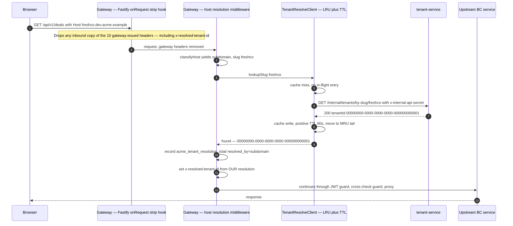
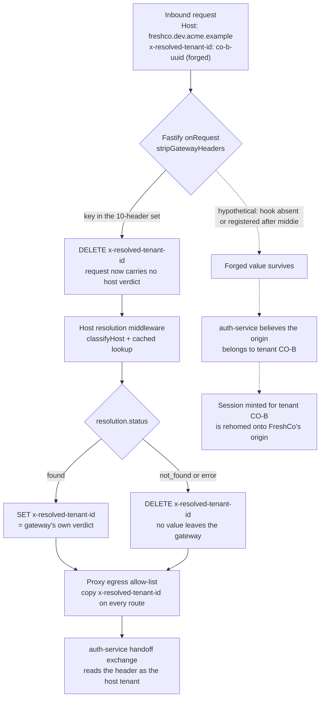
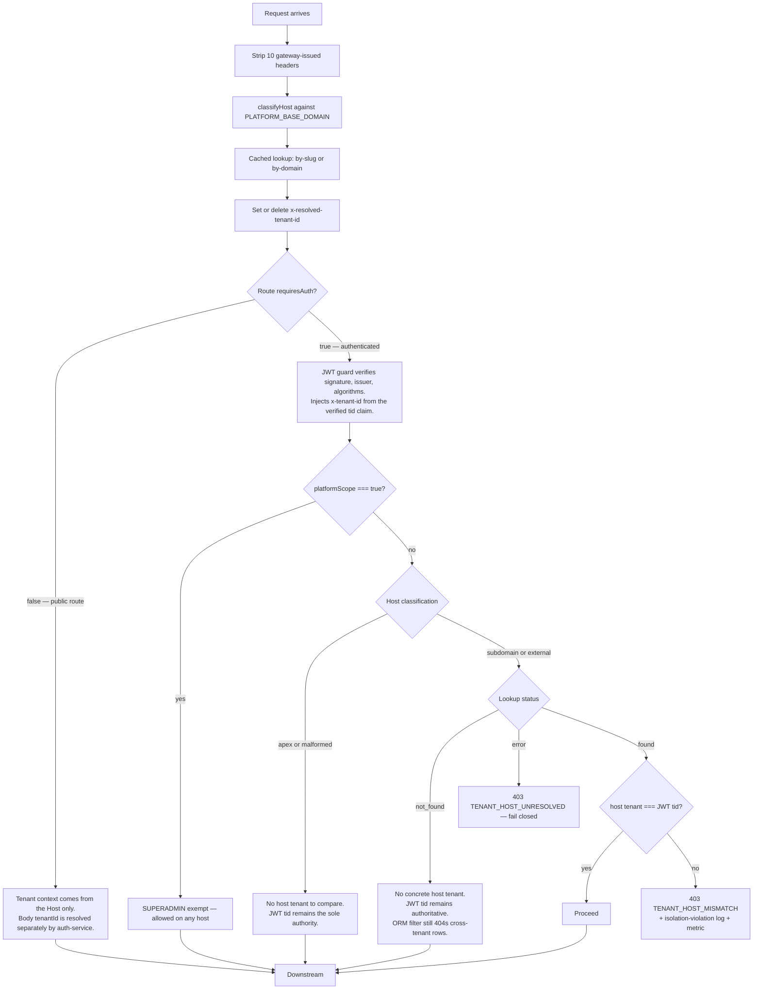
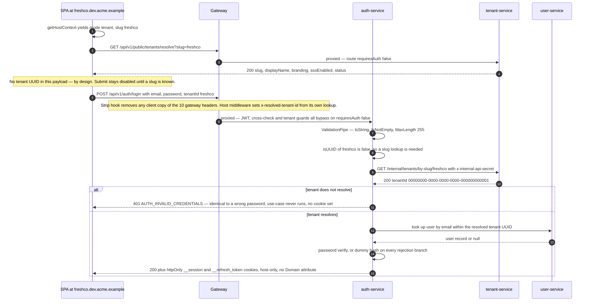

# Resolution — how a request finds its tenant

An anonymous HTTP request arrives at the edge with no session, no token and no identity.
Before authentication can even be attempted, the platform must decide which tenant the
request belongs to — because the sign-in form is branded per tenant, the credentials are
per tenant, and the session cookie is scoped to one origin. This document explains the
mechanism that answers that question: the exact classification of the `Host` header, the
lookup and cache behind it, the header the gateway sets and the one it strips, how the
login endpoint accepts a tenant _name_ as well as a UUID, and which source wins when the
host, the request body and the token claim disagree. Read it if you are changing the
gateway pipeline, the pre-auth auth-service routes, or the frontend host bootstrap.

---

## The entry-point problem

Post-authentication, tenancy is easy: the access token carries a `tid` claim, the gateway
verifies the signature, and every downstream service receives `x-tenant-id` derived from
that verified claim. Nothing about the URL or the headers is load-bearing. The
architecture decision record that settles hostname resolution states the rule plainly:
post-auth, tenant identity is cryptographically bound to the session and is never derived
from the request URL or headers.

Pre-authentication there is no session to bind to, and four things still need a tenant:

1. **Branding.** The sign-in page shows the workspace name, logo and accent colours, and
   decides whether to render a "Continue with single sign-on" button. All of that is a
   per-tenant lookup that happens before the user types anything.
2. **Credentials.** Accounts are per tenant. The same email address is a _different_
   account in two different tenants, with different passwords. A login attempt is
   meaningless without a tenant to scope the user lookup to.
3. **Cookie isolation.** The session cookie is host-only — the cookie options carry no
   `Domain` attribute — so the browser origin the user signs in on _is_ the isolation
   boundary. That origin has to be decided before the cookie is minted.
4. **Session-replay defence.** A valid session for tenant A, replayed against tenant B's
   origin, must be rejected. That requires knowing the host's tenant independently of the
   token.

The platform solves this by making the **hostname** the pre-auth tenant identity, with a
single precedence contract implemented twice — authoritatively in the gateway, and mirrored
by a pure function in the single-page app for rendering decisions only.

---

## Four seams, one contract

Resolution is not a single function call. It happens at four distinct seams, each with a
different trust level and a different consequence on failure.

| Seam                     | Where                  | Input                                  | Output                                          | Trust                                 |
| ------------------------ | ---------------------- | -------------------------------------- | ----------------------------------------------- | ------------------------------------- |
| Host classification      | Gateway, pure function | `Host` header + `PLATFORM_BASE_DOMAIN` | `apex` / `subdomain` / `external` / `malformed` | No I/O, no trust decision             |
| Host → tenant lookup     | Gateway, cached client | slug or full host                      | `found` / `not_found` / `error`                 | Internal, shared-secret authenticated |
| Pre-auth body identifier | auth-service           | `tenantId` body field (name or UUID)   | tenant UUID or `null`                           | Same internal lookup                  |
| Post-auth claim          | Gateway JWT guard      | verified `tid` claim                   | tenant UUID                                     | Cryptographic                         |

The gateway half is `apps/platform/gateway/src/modules/tenant-resolution/`; the frontend
mirror is `apps/platform-frontend/src/lib/tenant/`; the pre-auth body resolver lives in
auth-service. They share one written precedence spec and, deliberately, no code.

---

## Hostname classification: the pure function

The first step is structural and does no I/O at all. `classifyHost(host, baseDomain)`
returns a four-way discriminated union:

```ts
export type HostClassification =
  | { readonly kind: "apex" }
  | { readonly kind: "subdomain"; readonly slug: string }
  | { readonly kind: "external"; readonly host: string }
  | { readonly kind: "malformed" };
```

Normalisation happens first, in the order a DNS comparison requires: trim, lowercase, strip
a trailing `:port`, then strip a **single** trailing FQDN dot.

```ts
const normalizedHost = host
  .trim()
  .toLowerCase()
  .replace(PORT_SUFFIX_RE, "") //  /:\d+$/
  .replace(TRAILING_DOT_RE, ""); //  /\.$/
```

Each of those three transformations exists because a real `Host` header produced a wrong
answer without it:

- **Case folding** — DNS hostnames are case-insensitive, so `FreshCo.DEV.ACME.EXAMPLE`
  must classify identically to `freshco.dev.acme.example`.
- **Port stripping** — a `Host` header routinely carries `:443`, and local development
  runs on `http://freshco.localhost:5173`, where the configured base domain is the bare
  `localhost`.
- **Trailing-dot stripping** — a browser or proxy may send the absolute-root form
  `freshco.dev.acme.example.`. DNS treats that as identical to the dotless form, but a raw
  string suffix comparison does not, so without normalisation the host evades the
  subdomain match and mis-classifies as `external`.

The comparison itself is anchored on a **leading-label dot boundary**, never a raw suffix
match:

```ts
if (normalizedHost === normalizedBase) return { kind: "apex" };

const suffix = `.${normalizedBase}`;
if (normalizedHost.endsWith(suffix)) {
  const label = normalizedHost.slice(0, -suffix.length);
  if (label.length > 0 && !label.includes(".")) {
    return { kind: "subdomain", slug: label };
  }
}
return { kind: "external", host: normalizedHost };
```

This is the security-critical line in the whole file. If the check were
`normalizedHost.endsWith(normalizedBase)` without the leading dot, an attacker who
registered `evilacme.example` would be classified as a subdomain of `acme.example` and
trusted as tenant context. The unit suite pins that case explicitly: with a base domain of
`acme.example`, the host `evilacme.example` must classify as neither `subdomain` nor
`apex`.

The second guard is the single-label requirement. `a.b.dev.acme.example` has two labels
ahead of the base domain. A tenant slug forbids dots by its own value-object rule, so
`{ slug: 'a.b' }` can never be a real tenant — the host falls through to `external` rather
than being force-parsed into an invalid slug.

`external` is deliberately ambiguous. It covers both a genuine white-label custom domain
and a host nobody has ever configured. The pure function cannot tell them apart without a
database round-trip, so it does not try — it hands the caller a host and lets the lookup
decide. That ambiguity is what makes the function exhaustively unit-testable with no
database, cache or network.

| Host (base domain `dev.acme.example`) | Classification              | Carries a tenant?                         |
| ------------------------------------- | --------------------------- | ----------------------------------------- |
| `dev.acme.example`                    | `apex`                      | No — discovery and platform-admin sign-in |
| `freshco.dev.acme.example`            | `subdomain`, slug `freshco` | Yes, if the slug resolves                 |
| `FreshCo.DEV.ACME.EXAMPLE:443`        | `subdomain`, slug `freshco` | Yes                                       |
| `trading.co-b.example`                | `external`                  | Only if it is a registered custom domain  |
| `evil.example.com`                    | `external`                  | No — the lookup returns 404               |
| `a.b.dev.acme.example`                | `external`                  | Almost certainly not                      |
| `""` or `":443"`                      | `malformed`                 | No                                        |

---

## The lookup: internal endpoints, not the public one

A classification that carries a slug or a candidate custom domain is resolved to a tenant
UUID by `TenantResolveClient`, which calls one of two tenant-service endpoints:

```text
GET {TENANT_SERVICE_URL}/internal/tenants/by-slug/:slug    → { tenantId } | 404
GET {TENANT_SERVICE_URL}/internal/tenants/by-domain/:host  → { tenantId } | 404
```

Both live behind `InternalAuthGuard` and are never exposed through the gateway's routing
table. The caller presents a shared secret in `x-internal-api-secret`, and the guard
compares it with `crypto.timingSafeEqual`, including a same-buffer comparison on a length
mismatch so the rejection path does not leak the secret's length through timing.

There is also a **public** resolve endpoint,
`GET /api/v1/public/tenants/resolve?slug=…|domain=…`, and it is important to understand why
it cannot be used here. Its payload is a strict whitelist:

```ts
export interface TenantPublicResolveResult {
  readonly slug: string;
  readonly displayName: string;
  readonly branding: TenantBranding | null;
  readonly ssoEnabled: boolean;
  readonly ssoProviderLabel: string | null;
  readonly status: TenantPublicStatus; // 'active' | 'suspended' | 'onboarding'
}
```

The tenant UUID is deliberately absent. The result is built field by field from getters
rather than by spreading the entity, so no future column — a suspension reason, an
integration credential, a feature flag — can leak to an anonymous caller by accident. Since
the payload has no UUID, it cannot back an identifier-to-identifier cross-check, which is
exactly the job the gateway needs done. Hence the separate internal endpoints.

The domain path is exact-match only and never falls through to a slug lookup. A tenant
whose custom domain is `trading.co-b.example` must not be matched by
`sub.trading.co-b.example`, and a tenant whose _slug_ happens to equal another tenant's
_domain string_ must not collide. The public resolve cache namespaces its keys for the same
reason — `tenant-resolve:slug:{identifier}` and `tenant-resolve:domain:{identifier}` are
distinct key spaces.

---

## The cache: a bounded LRU with split TTLs

Host resolution runs on **every single request**, so it can never be a live network call on
the hot path. `TenantResolveClient` keeps an in-process cache with these defaults:

| Setting          | Value | Reasoning                                                      |
| ---------------- | ----- | -------------------------------------------------------------- |
| Positive TTL     | 60 s  | Aligned with the tenant-validate and public-resolve caches     |
| Negative TTL     | 10 s  | An unknown slug should re-check soon after a tenant is created |
| Per-call timeout | 2 s   | A slow tenant-service must not pin the request pipeline        |
| Max entries      | 5 000 | Hard bound on memory an adversary can pin                      |

Three design points are worth spelling out.

**The result is three-state, not two.** `found`, `not_found` and `error` are distinct:

```ts
export type TenantLookupResult =
  | { readonly status: "found"; readonly tenantId: string }
  | { readonly status: "not_found" }
  | { readonly status: "error" };
```

`not_found` is a definitive 404 — nobody owns this slug. `error` is a transport failure, a
timeout, or any non-404 non-2xx status: the answer is _unknown_. Collapsing the two into
`null` would force every caller to choose a single behaviour for both, and the correct
behaviours are opposite. An unknown slug means "no host tenant, carry on"; an
indeterminate lookup on a host that _should_ resolve means "refuse, we cannot prove
isolation holds". Only `found` and `not_found` are ever written to the cache; `error` is
transient by definition and caching it would extend an outage past its own duration.

**The cache is a hard-bounded LRU, not a plain map.** The `Map` preserves insertion order,
so the first key is the least recently used. A read hit deletes and re-inserts the entry to
move it to the tail; a write past capacity evicts the head. TTL is enforced lazily on read.
The earlier implementation used a plain `Map` that only evicted on a same-key re-read,
which meant an attacker cycling unique `{random}.dev.acme.example` subdomains against the
single ingress could grow the map without limit until the pod died. The bound is set well
above any realistic tenant count so legitimate traffic is effectively always a hit.

**Concurrent misses share one request.** A key's in-flight promise is stored in a second
map and returned to every concurrent caller, so a cold cache under load produces one
upstream call per key, not one per request:

```ts
const existing = this.inFlight.get(cacheKey);
if (existing) return existing;

const lookup = this.fetchAndCache(cacheKey, path).finally(() => {
  this.inFlight.delete(cacheKey);
});
this.inFlight.set(cacheKey, lookup);
return lookup;
```

### Cold-cache resolution, end to end

The following sequence shows the first request for a tenant subdomain after a gateway pod
restart — the only path that touches tenant-service. Every subsequent request for the same
host within the TTL window is served from the in-process map.



Note what the middleware does **not** do. It never throws — the whole body is wrapped in a
`try`/`catch` whose handler is empty except for a comment, and `next()` is called
unconditionally. It never makes an authorization decision. Its entire output is a metric,
one header, and a property attached to the request object for the guard that runs later.
That separation exists because NestJS middleware runs _before_ guards and therefore cannot
see the JWT-derived identity — a trap this codebase fell into once already, and which is
now documented in three separate file headers.

---

## The resolved-tenant header: set, and strip

The gateway is the **sole trusted setter** of `x-resolved-tenant-id`. Downstream services
— specifically the pre-auth single-sign-on handoff exchange — read it as the answer to
"which tenant does this request's origin belong to". That only holds if a client cannot
supply the header itself.

### The strip list

A Fastify `onRequest` hook deletes the ten gateway-issued headers — the identity set plus
`x-resolved-tenant-id` — from every inbound request before any NestJS middleware or guard
runs. The list itself, and why the hook iterates the request's actual header keys and
compares each lowercased rather than deleting ten known names, are set out in
[`03-propagation.md`](./03-propagation.md) under Carrier 1.

Two entries on that list are cross-tenant kill switches rather than mere identity hints.
`x-super-admin` is read by the data-layer tenant middleware to set `isSuperAdmin`, which
disables the ORM tenant filter outright. `x-platform-scope` grants cross-tenant platform
access under the platform-scope decision. If either were forgeable at ingress, an
unauthenticated caller could turn tenant isolation off end to end.

### Registration order is load-bearing

The strip hook must run **before** the middleware that sets the header, and getting this
backwards produced a real production failure. Fastify runs `onRequest` hooks in
registration order. NestJS registers its own `onRequest` hook — the one that runs the whole
middleware chain — while the application is being created. The hook was originally wired
_after_ `NestFactory.create()`, so the order became [middleware sets the header] → [strip
deletes it]. The gateway then forwarded the pre-auth handoff-exchange request to auth-service
with `x-resolved-tenant-id` absent, the exchange's host-to-tenant cross-check saw an
unresolvable host, and every single-sign-on login failed with a uniform
`HANDOFF_CODE_INVALID` — after every earlier hop had succeeded. The fix is one line of
ordering:

```ts
// Registered on the RAW Fastify instance BEFORE NestFactory.create() runs.
wireGatewayFastifyHooks(fastify);

const app = await NestFactory.create<NestFastifyApplication>(
  AppModule,
  adapter,
  {
    bodyParser: false,
  }
);
```

The uniform-401 anti-oracle contract is what made this expensive to diagnose: every
rejection path returned the same body. The remediation added a named server-side log line
to each gate, so "host unresolved" is now distinguishable from "code replayed" in the logs
while remaining indistinguishable in the response.

### Set-or-delete, then always forward

Having classified and resolved, the middleware writes the header only from its own verdict:

```ts
if (resolution.status === "found") {
  req.headers[RESOLVED_TENANT_HEADER] = resolution.tenantId;
} else {
  // Defence in depth — no stale or unresolved value survives downstream.
  delete req.headers[RESOLVED_TENANT_HEADER];
}
```

The `delete` in the else branch is redundant given the strip hook, and deliberately so: it
means an unresolved host cannot leave a value downstream even if the hook were ever
mis-registered or route-scoped.

At egress the proxy builds outbound headers from an allow-list — nothing is forwarded
implicitly — and `x-resolved-tenant-id` is copied on **every** route, authenticated or not:

```ts
// Resolved-tenant header ALWAYS: like x-forwarded-for, this is the gateway's OWN
// authoritative annotation, not client input.
copy(RESOLVED_TENANT_HEADER);
```

The identity headers proper (`x-tenant-id`, `x-user-id`, `x-user-roles`, `x-permissions`,
`x-ip-address`, `x-mfa-enabled`) are copied only when `route.requiresAuth` is true.
`x-platform-scope` is copied only when the _already-resolved_ route object carries
`platformScope: true` — gated off the same matcher that chose the upstream, so a
double-encoded traversal that routes to a business service cannot re-parse into a platform
path and leak the header.

### What would happen without the strip



The dashed path is the failure the hook prevents. The handoff exchange fails closed on an
absent header, so the danger is not omission but _substitution_: a caller who could set the
header would satisfy the exchange's host-to-tenant equality check with a tenant of their
choosing, and the one-time code's session would be planted as a cookie on an origin it was
never minted for.

### Honest note: these headers are trusted, not signed

The gateway-to-service identity contract is **plaintext and unsigned**. Downstream services
run `GatewayIdentityGuard`, which does no cryptography at all:

```ts
const userId = firstHeader(headers["x-user-id"]);
const tenantId = firstHeader(headers["x-tenant-id"]);
if (!userId || !tenantId) {
  throw new UnauthorizedException("Missing gateway identity headers");
}
```

Absence of the headers is treated as "did not transit the gateway" and rejected. Presence
is treated as proof. Any pod that can open a TCP connection to a bounded-context service's
port can therefore assert any identity, in any tenant.

The compensating control is a Kubernetes `NetworkPolicy`. The shared service chart renders
a default-deny ingress policy plus explicit allows, and a `crossNamespaceIngress: gateway`
setting narrows cross-namespace ingress on the application port to the gateway pod alone:

```yaml
# Restricted: ONLY the gateway pod may reach the app port cross-namespace.
- from:
    - namespaceSelector:
        matchLabels:
          kubernetes.io/metadata.name:
            { { .Values.networkPolicy.gatewayNamespace } }
      podSelector:
        matchLabels:
          app.kubernetes.io/name: { { .Values.networkPolicy.gatewayName } }
```

**The tightening is opt-in, and that is the hazard.** A chart that offers
`crossNamespaceIngress: gateway` as a per-service setting necessarily has a laxer default
behind it — typically "any pod carrying the platform's `part-of` label, in any namespace" —
and a service that never opts in silently keeps it. Where inter-service identity is an
unsigned header, the network policy _is_ the authentication boundary, so a partial rollout
reduces the whole platform to its weakest-configured service. The decision record that
proposes moving pre-auth resolution into the gateway treats exactly this as its gate:
unsigned identity headers are tolerable only while the network layer can prove a
bounded-context service is unreachable except through the gateway. Make the strict value
the chart default and let a service opt _out_ loudly, rather than the reverse.

Even where the policy is applied, note what it does _not_ cover: the same-namespace rule
(`podSelector: {}`) permits any pod in the service's own namespace to reach the app port.

---

## Precedence: which source wins

Three sources can carry a tenant, and they can disagree. The contract is not "most specific
wins" — it is **verified beats asserted**, with the host used as a cross-check rather than
an authority.



The rules that flowchart encodes, stated as prose:

**The verified token claim always wins for authorization.** The gateway's downstream
`x-tenant-id` is set from the JWT `tid` claim and nothing else. The host never overrides it,
never supplements it, and never supplies it. Services stay host-blind: they receive
`x-tenant-id` and have no idea what hostname the browser used.

**The host is a veto, not a source.** When the host resolves to a concrete tenant that
differs from the token's `tid`, the request is refused with `403 TENANT_HOST_MISMATCH`,
a structured `tenant isolation violation` warning, and an increment of
`acme_tenant_host_mismatch_total`. This is the replayed-session case: a genuine tenant-A
session presented at tenant-B's origin. The host does not _become_ the tenant — the request
simply dies.

**Platform scope is exempt, and is checked first.** A session whose verified JWT carries
`platformScope: true` short-circuits before any comparison, on any host. The exemption reads
`request.raw.user.platformScope`, which is set only from the verified claim by the JWT
guard, so its presence is authoritative rather than client-influenced.

**Hosts that cannot carry a tenant are not cross-checked.** Apex and malformed hosts are
allowed through with the JWT claim as the sole authority. A well-formed subdomain whose
slug is definitively unknown (a 404) is also allowed through — there is no concrete host
tenant to conflict with, and entity-level cross-tenant reads remain a 404 enforced by the
ORM tenant filter rather than being re-derived at the edge.

**Indeterminate resolution fails closed.** If the host _should_ resolve but the lookup
returned `error` — tenant-service down, timed out, or returning a 5xx — the guard raises
`403 TENANT_HOST_UNRESOLVED`. This is a separate error code from the mismatch on purpose:
it is a denial under uncertainty, not a proven isolation violation, so it must not inflate
the mismatch metric that alerts on confirmed cross-tenant attempts. It also means a
tenant-service outage degrades authenticated tenant traffic to 403 rather than silently
dropping the isolation check.

**The cross-check must be a guard, not middleware.** Middleware runs before guards and
cannot see `request.raw.user`, which the JWT guard writes. The cross-check is therefore
registered as the second global guard, immediately after JWT validation, and it reuses the
classification and resolution the middleware already attached to the request so a single
request never performs two lookups.

The registration order in the application module is the execution order:

```ts
{ provide: APP_GUARD, useClass: JwtValidationGuard },
{ provide: APP_GUARD, useClass: TenantHostCrossCheckGuard },
{ provide: APP_GUARD, useClass: TenantResolutionGuard },
```

> **Documentation vs code:** the module's own header comment lists a fourth guard,
> `RateLimitGuard`, as step 3c of the pipeline. It is not there. `RateLimitGuard` is
> provided and exported by its module but is registered as neither an `APP_GUARD` nor a
> route-level `@UseGuards`, so it does not execute on the gateway pipeline as documented.

---

## The chicken-and-egg of login

The login endpoint is public. The gateway's routing table marks `/api/v1/auth` with
`requiresAuth: false`, and the JWT guard, the cross-check guard and the tenant guard all
bypass on that flag using the same resolver the proxy uses. So the request reaches
auth-service with no verified tenant. It still needs one, because the user lookup is scoped
by tenant.

The frontend supplies it in the request body. Since hostname resolution shipped, the value
it sends is the hostname-derived **tenant name (slug)**, not a UUID. Two endpoints accept
it:

- `POST /api/v1/auth/login`
- `POST /api/v1/auth/password/reset-request`

### The resolver that normalises both forms

```ts
@Injectable()
export class TenantIdentifierResolver {
  constructor(
    @Inject(TENANT_RESOLVER) private readonly tenantResolver: ITenantResolver
  ) {}

  async resolve(identifier: string): Promise<string | null> {
    if (isUUID(identifier)) {
      return identifier;
    }
    const resolved = await this.tenantResolver.resolveSlug(identifier);
    return resolved?.tenantId ?? null;
  }
}
```

A UUID passes through untouched and makes **no network call** — that keeps every existing
UUID-sending caller working and keeps machine-to-machine traffic off the lookup path. A
name is resolved through the same `/internal/tenants/by-slug/:slug` endpoint the
single-sign-on route already uses for its URL-path tenant slug, so password login and SSO
resolve tenants through one seam rather than two.

Why accept both rather than picking one? Three reasons, in the order they mattered:

1. **Backwards compatibility.** Both endpoints previously validated `tenantId` as a UUID
   and callers existed that sent one.
2. **Uniformity with SSO.** The OIDC login URL has always carried a slug in the path and
   has always resolved it server-side. Making password login behave differently would put
   two tenant-binding models in one service.
3. **Refusing to leak the UUID.** The obvious alternative — have the frontend call the
   public resolve endpoint, read the UUID, and post the UUID — was rejected in the pre-auth
   resolution decision because it would add the internal tenant UUID to an anonymous,
   cached, rate-limited payload whose entire design point is to expose nothing but branding
   and status. It also converts a server-side binding into a client-trusted two-step, where
   a client could substitute a different UUID between the resolve call and the login call.

### Input constraints

Both DTOs relaxed from `@IsUUID()` to:

```ts
@IsString()
@IsNotEmpty()
@MaxLength(255)
readonly tenantId!: string;
```

The 255-character ceiling is the malformed-input guard that replaces the UUID shape check.
It bounds the string that ends up in a URL path segment on the internal lookup (which is
`encodeURIComponent`-escaped) and in the pre-resolution rate-limit key. An unknown or
garbage value fails closed at the resolver, which returns `null`.

One subtlety worth knowing: the DTO classes are imported as _values_, not with
`import type`. A type-only import is elided at compile time, the parameter metadata the
global validation pipe reads becomes `Object`, and validation is silently skipped — the
`MaxLength` bound and everything else would simply not run. The import in the controller
carries an explicit comment saying so, because this exact mistake has disabled validation on
other services in this codebase.

### The timing consideration

The tenant-resolution branch is **deliberately not timing-equalised**, and the reasoning is
written into the controller:

```ts
// An unknown tenant yields the SAME generic InvalidCredentials RESPONSE as a wrong
// password. This branch is deliberately NOT timing-equalised (no dummy hash): tenant
// existence is not a confidential fact — the SSO flow already discloses it for any slug,
// and slugs are effectively public (company subdomains). The secret that IS protected —
// email-within-a-valid-tenant enumeration — stays fully equalised inside LoginUseCase,
// which only runs once a tenant resolves.
```

An unknown tenant name skips the password hashing entirely and returns fast; a known tenant
with a wrong password runs a full hash. An attacker can therefore distinguish "this
workspace exists" from "it does not" by timing. That is accepted, because a tenant slug is
a public company subdomain — it is in DNS, it is in the URL bar, and the single-sign-on
initiation route discloses it for any slug by construction.

What _is_ protected is the secret one layer in: whether a given email address has an
account **within** a valid tenant. That branch is fully equalised inside the login use case,
which runs four separate dummy-hash calls so that the non-existent-user, deactivated-user,
SSO-only-account and wrong-password branches all perform the same work:

```ts
await this.passwordService.hash("dummy-password-for-timing");
```

The distinction is precise and worth copying: equalise the branch that guards a secret, and
do not pay for equalising a branch that guards a fact already published in DNS.

### The reset-request edge limiter

Password reset carries an extra defence the login path does not need. The per-tenant,
per-email rate limiter lives inside the use case, which only runs once a tenant has
_resolved_. A flood of requests carrying bogus tenant names would therefore never be bounded
and would drive an unbounded number of internal slug lookups. A coarser limiter runs at the
controller edge, **before** resolution, keyed on the raw pre-resolution identifier:

```ts
const edgeKey = `password-reset-edge:${
  body.tenantId
}:${body.email.toLowerCase()}`;
const attempts = await this.rateLimitStore.increment(edgeKey, 3600);
if (attempts <= PASSWORD_RESET_EDGE_RATE_LIMIT) {
  // 10 per hour
  const tenantId = await this.tenantIdentifierResolver.resolve(body.tenantId);
  if (tenantId !== null) {
    await this.requestPasswordResetUseCase.execute(body.email, tenantId);
  }
}
return {
  data: { message: "If the email exists, a password reset link has been sent" },
};
```

The edge limit is intentionally more generous than the inner one (10 per hour versus 3 per
hour per resolved tenant and email) so it never fires first on the legitimate path, and it
never changes the response — the endpoint returns the same body whether the bucket is
exhausted, the tenant is unknown, or the email does not exist. It only skips the downstream
work.

### Login with a tenant name, end to end



Note the two independent tenant signals in that flow. The gateway sets
`x-resolved-tenant-id` from the host on this request as it does on every request — but
auth-service's login path does not read it. It reads the body field. The pre-auth
resolution decision records this as an accepted interim: two resolution seams exist, the
gateway for authenticated traffic and auth-service for pre-auth, and the target end state
is for the gateway to inject a trusted resolved-tenant header on the pre-auth routes so
that both `TenantIdentifierResolver` and the DTO field can be retired. That move is gated
on the unsigned-header trust posture described above.

> **A decision record is not an inventory of what exists.** A design of this shape usually
> carries a companion cleanup — here, promoting the shared `ITenantResolver` interface and
> its injection token out of the single-sign-on module into a neutral port, so a non-SSO
> flow stops importing from an SSO module. Two things make that cleanup easy to believe has
> happened when it has not: decision records are conventionally written in the present
> tense, and a record still in `Proposed` reads identically to one in `Accepted` unless the
> reader checks the status field. When a document describes a move and the code still has
> the old import, the code is the fact. Read the status field first, and treat a port
> location asserted in prose as a claim to verify, not a landmark to navigate by.

---

## The frontend mirror

The single-page app determines its own tenant from the browser hostname, using a pure
function that mirrors the gateway's precedence. The mirror exists for **rendering
decisions only** — which page set to mount, which branding to fetch, whether to show the
single-sign-on button. It is never an authorization input.

Two rules keep it honest:

**Exactly one place reads `window.location.hostname`.** `host-context.ts` is that boundary:

```ts
export function getHostContext(): TenantResolution {
  return resolveTenantSlug(window.location.hostname, getPlatformBaseDomain());
}
```

Every page and component receives the resolved context as a prop rather than re-reading the
hostname or re-implementing precedence. That is what makes `resolveTenantSlug` a pure
function of two strings and therefore exhaustively unit-testable.

**There is no `'default'` fallback anywhere in the contract.** The previous model read
`?tenant=` from the query string and fell back to the literal tenant `'default'` when it was
absent. That fallback is the defect the whole redesign replaces: it silently bound requests
to the wrong tenant whenever the parameter was lost by a bookmark, a redirect or a referrer
strip.

### Where the mirror deliberately differs from the gateway

The two implementations are not identical, and the differences are intentional. Reading
them side by side is the fastest way to understand what each side is for.

| Aspect                        | Gateway `classifyHost`                              | Frontend `resolveTenantSlug`                                   |
| ----------------------------- | --------------------------------------------------- | -------------------------------------------------------------- |
| Return shape                  | 4-way: `apex`, `subdomain`, `external`, `malformed` | 3-way: `apex`, `tenant`, `unknown`                             |
| Unrelated host                | `external` — caller must look it up                 | `tenant` with **no** slug — the page resolves by full hostname |
| Slug character validation     | None — any dot-free label is a slug candidate       | `^[a-z0-9-]+$`, no leading or trailing hyphen                  |
| Empty host                    | `malformed`                                         | `unknown`                                                      |
| Port handling                 | Strips `:port` from the header                      | Not needed — `window.location.hostname` is port-less           |
| Trailing FQDN dot             | Stripped                                            | Not stripped                                                   |
| Consequence of a wrong answer | A 403, or a spoofable tenant binding                | A wrong page renders                                           |

The frontend collapses "custom domain" and "unknown host" into `tenant` **without** a slug,
because it cannot confirm a custom domain without a network call. The page then resolves by
the full hostname through the public endpoint, and a 404 renders the workspace-not-found
page. The gateway keeps them separate at the metric level, labelling a resolved external
host `custom_domain` and an unresolved one `unknown`, because folding all external hosts
into `custom_domain` made a scanner probing random hostnames look like legitimate
white-label traffic.

The frontend validates the slug charset because it uses the label to _construct_ URLs —
`workspaceOriginUrl(slug)` builds a cross-origin navigation target — whereas the gateway
only uses the label as a lookup key that a 404 will reject anyway.

### The bug: a frontend-supplied name met a UUID validator

When hostname resolution shipped, the frontend switched from sending a UUID to sending the
hostname-derived slug. Both pre-auth DTOs still validated `tenantId` with `@IsUUID()`.
Every tenant-mode password login and every password-reset request broke on the day the
frontend change deployed. Both failure modes are worth recording precisely: with the
validator in place a slug is rejected at the validation boundary as a 400, and _without_ it
the slug flows into user-service's UUID-typed lookup by email and surfaces as a 500. The
root cause of the escape is stated just as plainly — no test exercised the integrated
slug-to-login path, so the change shipped the regression undetected.

The fix added `TenantIdentifierResolver` and relaxed the DTOs, and it added the missing
integrated test. That test is worth reading as a specification of the whole contract:

```ts
it(
  "accepts a hostname slug in the login body, resolves it to a UUID, and issues a session"
);
it("passes a UUID tenantId straight through without a slug lookup");
it(
  "rejects an unknown tenant slug as a generic 401 and never reaches the login use-case"
);
```

The third assertion is the enumeration guard: status 401, error code
`AUTH_INVALID_CREDENTIALS`, the login use case never invoked, and no `set-cookie` header on
the response.

### The legacy query-parameter shim

One deprecation bridge remains. `maybeRedirectLegacyTenantParam()` runs once at application
bootstrap and is the only place in the frontend permitted to read a `tenant` or `tenantId`
query parameter. When one is present it does exactly two things, in order: fire a
deprecation beacon, then `location.replace` to the canonical subdomain URL with the legacy
parameters stripped so the redirect cannot loop.

```ts
const base = getPlatformBaseDomain();
// A syntactically valid slug maps to its subdomain; anything else (empty/garbage)
// goes to the apex WITHOUT tenant context so it can never leak into a tenant.
const targetHost = isTenantSlugLabel(slug) ? `${slug}.${base}` : base;
window.location.replace(`https://${targetHost}${path}`);
```

The shim never establishes tenant context and never calls login or single sign-on. It only
redirects. A garbage value goes to the apex, where the discovery surface lives, so an
attacker-supplied string can never become a tenant binding.

> **Known gap:** the beacon posts to `/api/v1/public/telemetry/tenant-resolution-fallback`.
> No such route exists. The gateway's routing table declares `/api/v1/public/tenants` and
> `/api/v1/public/auth` and nothing else under `/api/v1/public`, so route resolution returns
> `undefined`, the JWT guard does not see `requiresAuth: false`, and an anonymous beacon is
> answered `401` before it ever reaches a controller. No controller for that path exists in
> any service either. The shim's removal criterion is "the metric reads 0 for 7 days" —
> which it does, but because nothing is ever recorded, not because the legacy parameter is
> unused.
>
> Relatedly, the metric label vocabulary declares a `query_param_fallback` value for
> `acme_tenant_resolution_total`, and no code path emits it.

---

## Unknown, ambiguous and suspended

The precedence rules above cover the happy paths. The edge cases are where the design shows
its shape, and each produces a specific status code.

| Situation                                            | Where decided                    | Result                                                                          |
| ---------------------------------------------------- | -------------------------------- | ------------------------------------------------------------------------------- |
| Host is the bare base domain                         | Gateway classifier               | `apex` — no tenant, discovery and platform-admin sign-in                        |
| Host header empty or port-only                       | Gateway classifier               | `malformed` — no tenant, request proceeds unauthenticated                       |
| Subdomain slug unknown (404)                         | Cached lookup, negative TTL 10 s | No header set; authenticated requests still allowed, JWT `tid` authoritative    |
| Custom domain unknown (404)                          | Cached lookup                    | Same as above; the SPA renders workspace-not-found                              |
| Lookup indeterminate (5xx, timeout, transport)       | Cross-check guard                | `403 TENANT_HOST_UNRESOLVED` — fail closed, mismatch metric **not** incremented |
| Host tenant ≠ JWT `tid`                              | Cross-check guard                | `403 TENANT_HOST_MISMATCH` + isolation log + `acme_tenant_host_mismatch_total`  |
| Public resolve, unknown slug or domain               | tenant-service use case          | `404`                                                                           |
| Public resolve, soft-deleted tenant                  | tenant-service use case          | `404` — indistinguishable from never having existed                             |
| Public resolve, suspended tenant                     | tenant-service use case          | `200` with `status: "suspended"` — the SPA renders the suspended page           |
| Public resolve, onboarding or provisioned            | tenant-service use case          | `200` with `status: "onboarding"`                                               |
| Public resolve, both `slug` and `domain`, or neither | Controller, strict XOR           | `400`                                                                           |
| Public resolve, over 60 requests per IP per 60 s     | Fixed-window limiter             | `429`                                                                           |
| Public resolve, Redis unreachable                    | Limiter and cache                | Fail **open** to a direct repository read, with a warning log                   |
| Pre-auth login, tenant name unknown                  | auth-service controller          | `401 AUTH_INVALID_CREDENTIALS`, use case never runs                             |
| Pre-auth reset, tenant name unknown                  | auth-service controller          | `200` with the generic message, silent no-op                                    |

A deliberate asymmetry runs through that table. The **public** resolve path fails _open_ —
a Redis outage degrades to a direct database read rather than 503-ing the branding path,
because a sign-in page that cannot render its logo is better than a sign-in page that
cannot render. The **authenticated** cross-check path fails _closed_ — an indeterminate
lookup is a 403, because the alternative is letting a possibly-replayed session through
during an outage. Fail-open is chosen where the failure costs cosmetics; fail-closed where
it costs isolation.

The fail-open branches are also required to be _loud_. The rate limiter's catch block
warns explicitly that the pre-auth throttle was skipped for that request, because a silent
degradation here means the workspace-guessing throttle is effectively disabled and nothing
in the response reveals it.

> **A guard is only as real as the implementation bound behind it.** The suspension gate
> in this design is a guard that reads the JWT-derived tenant, asks a tenant-status cache,
> and is written to raise `403 TENANT_SUSPENDED`, `403 TENANT_NOT_FOUND` and
> `503 TENANT_CACHE_UNAVAILABLE`. Those outcomes are reachable only if the cache token
> resolves to a real implementation. A permissive scaffold — one that answers "active" for
> every tenant id — bound as the only implementation of that interface is indistinguishable
> from a working control at every layer above it: the guard is registered, its unit tests
> pass, the status codes are documented, and nothing is ever refused. Two habits close it.
> Bind a **fail-closed** stub, so an unwired dependency denies rather than permits. And
> assert the _wiring_ in a test — resolve the token from the running module and check what
> came back — because no test of the guard in isolation can see what it was given.
>
> Note also that suspension is enforced independently before authentication: the public
> resolve endpoint returns `status: "suspended"` and the sign-in page short-circuits to the
> suspended-workspace page, so a suspended tenant cannot obtain a _new_ session through the
> UI. One state with two enforcement points needs two proofs; the pre-auth half passing
> says nothing about the post-auth half.

### Suspended, in the frontend

The sign-in page short-circuits on the resolve payload's status before rendering any form:

```tsx
if (branding.data?.status === "suspended") {
  return <WorkspaceSuspendedPage workspaceName={branding.data.displayName} />;
}
if (branding.data?.status === "onboarding" && !continueSetup) {
  return <OnboardingIncompletePage workspaceName={branding.data.displayName} />;
}
if (!hasResolvedTenant && branding.isError) {
  return <WorkspaceNotFoundPage host={ws.hostname} />;
}
```

Note the ordering of the last condition. A **slug-bearing** host whose resolve call fails
still renders the un-branded sign-in form, because the slug alone is enough to attempt a
login. A **slug-less custom-domain** host whose resolve call 404s has no tenant identity at
all, so it renders workspace-not-found rather than a form that could only ever post an
empty tenant. The submit handler carries the matching guard —
`if (!hasResolvedTenant) return;` — and the button is disabled in the same window, so an
empty tenant is never posted.

---

## Observability

Every request emits exactly one resolution outcome, labelled by how the tenant was found:

| Metric                            | Emitted when                              | Labels                                                                                                |
| --------------------------------- | ----------------------------------------- | ----------------------------------------------------------------------------------------------------- |
| `acme_tenant_resolution_total`    | Every request, in the host middleware     | `resolved_by`: `subdomain`, `apex`, `custom_domain`, `unknown` (and an unused `query_param_fallback`) |
| `acme_tenant_host_mismatch_total` | Confirmed host-versus-claim mismatch only | none                                                                                                  |
| `acme_cors_origin_rejected_total` | Soft-rejected cross-origin request        | none                                                                                                  |

The label is derived from the _outcome_, not the classification alone:

```ts
case 'external':
  return resolution.status === 'found' ? 'custom_domain' : 'unknown';
```

That distinction is what makes the `unknown` series usable as a probing signal. The
mismatch counter is deliberately incremented only on a _proven_ cross-tenant hit — the
fail-closed `TENANT_HOST_UNRESOLVED` path logs a warning and raises a 403 but does not
touch the counter, so a tenant-service outage cannot masquerade as an isolation-violation
alert storm.

Metrics degrade silently. The meter is resolved through a lazy `require` of the
OpenTelemetry API, and when the package or SDK is absent every counter is `undefined` and
every emit is a no-op via optional chaining. The concrete meter is injected rather than
looked up inside the class, which keeps the metrics class pure and unit-testable against a
fake.

Attacker-controllable values that reach a log line are CR/LF-sanitised before they get
there, so a crafted `Host` header cannot forge extra log records:

```ts
function sanitiseLogValue(value: string): string {
  return value.replace(/[\r\n]/g, " ");
}
```

---

## Configuration

The base domain is configuration, never a constant. The gateway validates it at boot with
a Zod schema:

```ts
PLATFORM_BASE_DOMAIN: z.string().min(1).default('localhost'),
```

The default is `localhost`, which is what makes local development work: the browser resolves
`freshco.localhost` without any DNS or hosts-file entry, and the classifier's port stripping
handles the dev server's port. The deployed value is injected by the chart and must equal
the environment's ingress host, or the classifier will treat the real apex as an external
host and every tenant subdomain as unrelated.

The frontend takes the same value from `VITE_PLATFORM_BASE_DOMAIN` through an environment
helper rather than reading `import.meta.env` directly, so the two implementations of
precedence read one configured value in each runtime.

Wildcard DNS and a wildcard TLS certificate are prerequisites of the whole scheme — every
tenant subdomain must terminate TLS on the same ingress. The hostname-resolution decision
lists that as an explicit cost, alongside the cost of maintaining two implementations of
precedence in lockstep.

---

## Why it is built this way

Four alternatives were considered and rejected when hostname resolution was decided, and
the reasoning is worth preserving because each rejection is really a statement about what
tenancy _is_ here.

**Keep query-parameter resolution.** Rejected: the parameter is tamperable, leaks into logs
and referrers, breaks bookmarks and deep links, and blocks per-tenant branding, cookie
isolation and per-tenant cross-origin rules. Its `'default'` fallback was an active source
of wrong-tenant bindings.

**Path-based tenancy** (`/t/{slug}/…`). Rejected: one origin serves every tenant, so there
is no cookie isolation and no per-tenant cross-origin policy, white-label domains become
awkward, and every URL in the application needs rewriting.

**Post-authentication tenant selection** — a central login, then pick a workspace.
Rejected as impossible by construction: credentials are per tenant, so there is no
tenant-less identity to authenticate first. It would also centralise every tenant's session
cookie on one origin, which is the isolation property the design is trying to obtain.

**On-page membership lookup at the apex** — type an email, see your workspaces. Rejected
as a user-enumeration oracle. The replacement is discovery by email: the apex accepts an
email address and always answers `202 {"status":"accepted"}` with a byte-identical body,
and the membership list is revealed only inside the recipient's mailbox.

The through-line: the hostname is the only pre-auth tenant signal that is simultaneously
visible to the browser (so cookies and origins can be scoped), visible to the gateway (so it
can be cross-checked), and _not_ supplied by the request body (so it cannot be substituted
by the caller without also changing the origin the browser will accept a cookie on).

---

## Gaps this design shape invites

Collected here so they are not buried in the prose above. None of them is exotic; each is
what a resolution pipeline of this shape tends to grow, and each is worth checking for
directly rather than waiting for it to surface.

1. **A control whose only bound implementation is a permissive scaffold.** Guards that
   consult an injected cache or client are registered, tested and documented long before
   the real implementation lands. Bind fail-closed placeholders and assert the wiring, or
   the declared refusal codes are unreachable and nothing says so.
2. **Unsigned identity headers with an opt-in network control.** When the receiving side
   treats header presence as proof, the network policy is the authentication boundary — so
   its default must be the strict value, and its coverage is a property to test, not to
   assume.
3. **A deprecation beacon pointed at a route that does not exist.** A shim whose retirement
   criterion is "the metric reads zero" retires on silence, and silence is exactly what a
   missing endpoint produces. Assert that the beacon is received, not merely sent.
4. **A metric label value declared in the vocabulary and never emitted.** A dashboard filter
   built on it looks healthy for the same reason: the series is empty because nothing writes
   it, not because nothing happens.
5. **A guard that is provided but never registered.** Being exported by a module is not
   being in the request path. Pipeline documentation drifts from the guard array silently,
   because neither a unit test nor a compile step compares them.
6. **A shared port left in the module that first needed it.** Once a second, unrelated flow
   depends on an interface, the token's location becomes a coupling; a planned promotion to
   a neutral home is easy to describe and easy to leave undone.
7. **Two resolution seams for one question.** The gateway resolves the host on every request
   while the pre-auth endpoints resolve a body field themselves. That is a defensible
   interim — but it is two contracts to keep in step, and collapsing it onto the gateway
   header is gated on item 2.

---

## Where this connects

This deep-dive sits under the multi-tenancy survey and expands the pre-auth half of it. Its
four siblings:

- [`01-tenant-model.md`](./01-tenant-model.md) — what a tenant _is_: the entity, its states
  and the lifecycle that a resolved tenant id ultimately points at.
- [`03-propagation.md`](./03-propagation.md) — the carriers a tenant id travels on, and the
  canonical treatment of the gateway header strip list this document only summarises.
- [`04-enforcement.md`](./04-enforcement.md) — the data-layer filter that turns a resolved
  tenant into a constraint on every query.
- [`05-isolation-threat-model.md`](./05-isolation-threat-model.md) — the isolation model
  attack by attack, and where each compensating control actually sits.

The survey documents this one goes beneath:

- [`backend/04-authn-authz.md`](../../backend/04-authn-authz.md) — the login, multi-factor,
  refresh-family and single-sign-on flows this document's resolution step feeds into, plus
  the JWT and JWKS contract that makes `tid` authoritative post-auth.
- [`backend/03-data-architecture.md`](../../backend/03-data-architecture.md) — the
  fail-closed ORM tenant filter that turns a resolved tenant into row-level enforcement, and
  the 404-not-403 data contract that the host cross-check deliberately does not duplicate.
- [`backend/06-caching.md`](../../backend/06-caching.md) — the wider Redis key and TTL
  strategy that the 60-second resolve cache and the per-IP resolve limiter belong to.
- [`backend/02-api-architecture.md`](../../backend/02-api-architecture.md) — the error
  envelope and status-code taxonomy the resolution error codes conform to.
- [`00-system-context.md`](../../00-system-context.md) — where the trust boundaries this
  document polices sit in the system as a whole.
- [`platform/integration-patterns.md`](../../platform/integration-patterns.md) and
  [`platform/event-catalog.md`](../../platform/event-catalog.md) — the asynchronous side of
  the platform, where tenancy travels in the event envelope rather than in a header.

Decisions this document rests on, described by what they settle rather than by record
number: making the hostname the pre-auth tenant identity; letting the pre-auth login and
reset endpoints accept a tenant name rather than an internal UUID; exempting a verified
platform-scoped session from the host cross-check; handing a single-sign-on session across
origins with a one-time code; terminating every tenant subdomain on one wildcard
certificate; and soft-rejecting disallowed cross-origin requests instead of failing them
hard.
