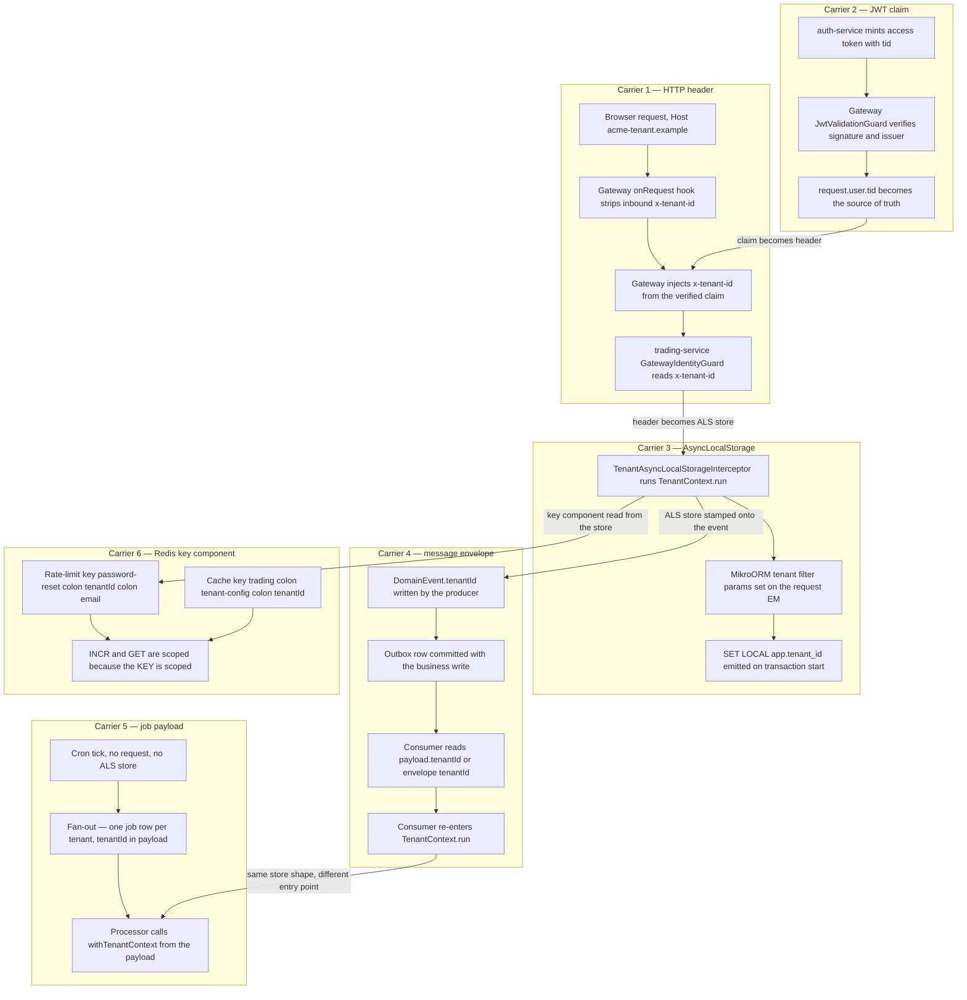
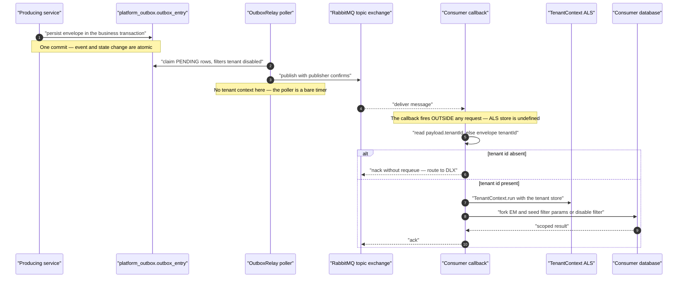
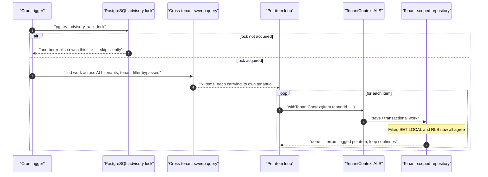
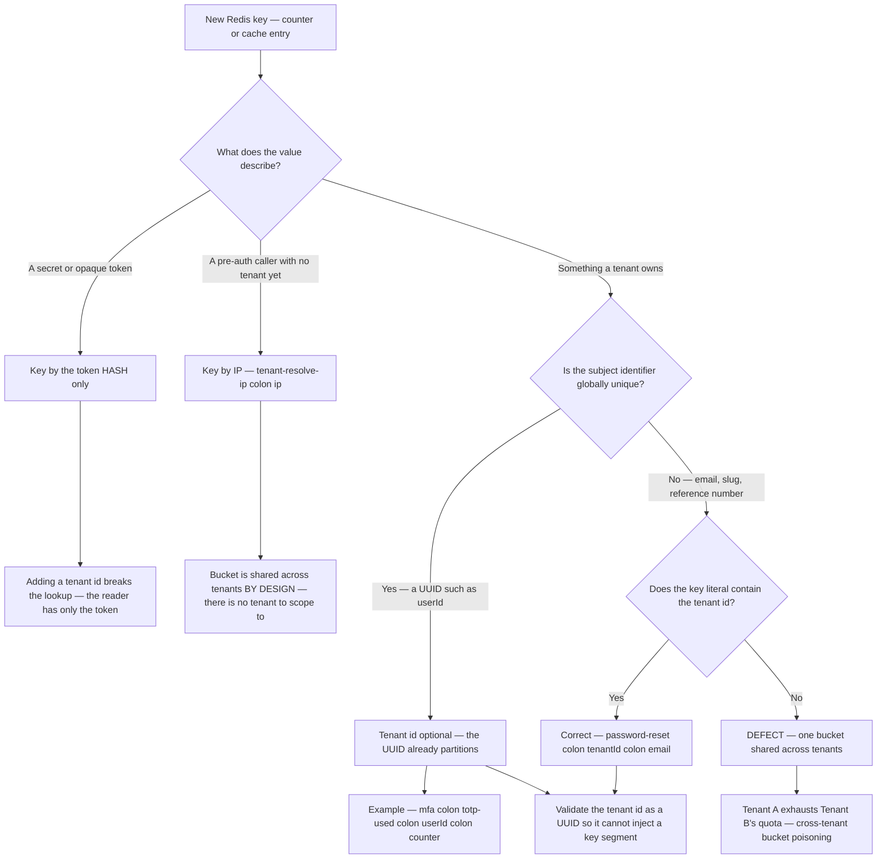

# Propagation — carrying tenant context through six mediums

Resolution answers _which tenant is this_. Propagation answers the harder question: _how does
that answer survive every subsequent hop_, including the hops where there is no HTTP request at
all — a message consumer woken by the broker, a cron tick, a Redis `INCR`. This document
enumerates the six carriers the platform actually uses, and for each one establishes the exact
field name, who writes it, who reads it, what happens when it is absent, and whether the reader
trusts it or re-derives it. Read it before you write any code that runs outside a controller,
and before you add any counter, cache entry, event or job.

---

## The one-paragraph answer

Tenant context is not one mechanism. It is six, and they must all agree. A signed **JWT claim**
(`tid`) is the root of trust. The gateway converts that claim into a plaintext **HTTP header**
(`x-tenant-id`) for the in-cluster hop, having first stripped any client-supplied copy. Inside a
service, an **AsyncLocalStorage** store carries the tenant across `await` boundaries so no
function signature has to thread it. When work leaves the request — into RabbitMQ — the tenant
travels as a field on the **message envelope**, and the consumer must explicitly re-enter
AsyncLocalStorage from it. Work that never had a request at all — cron, schedulers, workers —
carries the tenant in the **job payload** and re-enters scope the same way. And every **Redis
key** that counts or caches anything tenant-owned must include the tenant id as a mandatory key
component, because a shared key is a shared bucket.

Each carrier has a different trust posture, a different failure mode when missing, and a
different set of people who forget about it.

---

## The six carriers, side by side

The diagram below puts the six carriers side by side and shows the conversions between them —
each cross-lane arrow is a point where the tenant id changes hands.



Read the cross-links, not just the lanes. Every arrow between subgraphs is a **conversion**, and
every conversion is a place where the value can be dropped, forged, or silently defaulted. The
rest of this document walks each lane and each conversion.

A compact reference:

| #   | Carrier           | Field / key                                   | Written by                   | Read by                                           | Missing behaviour             | Trust                                 |
| --- | ----------------- | --------------------------------------------- | ---------------------------- | ------------------------------------------------- | ----------------------------- | ------------------------------------- |
| 1   | HTTP header       | `x-tenant-id`                                 | Gateway JWT guard            | BC service guard / middleware                     | 401 at the BC                 | Trusted only because ingress-stripped |
| 2   | JWT claim         | `tid`                                         | auth-service                 | Gateway JWT guard                                 | 401 `AUTH_UNAUTHORIZED`       | Signed — authoritative                |
| 3   | AsyncLocalStorage | `TenantStore.tenantId`                        | Interceptor / consumer / job | ORM filter, RLS subscriber, `TenantEntityManager` | Throws — fail closed          | Derived from 1 or 4                   |
| 4   | Event envelope    | `DomainEvent.tenantId` (+ `payload.tenantId`) | Producing service            | Consumer dispatch                                 | `nack` without requeue → DLX  | Unsigned — see caveat                 |
| 5   | Job payload       | `payload.tenantId`                            | Enqueuer / cron fan-out      | Processor / worker                                | Job cannot run correctly      | Unsigned, internal only               |
| 6   | Redis key         | key _component_                               | The call site                | Same call site                                    | Cross-tenant bucket collision | N/A — structural                      |

---

## Carrier 1 — the HTTP header, and the trust-boundary question

### The header set

The gateway mints six identity headers from the verified token and forwards a subset of them to
upstream services. From `jwt-validation.guard.ts`:

```ts
rawRequest.headers["x-tenant-id"] = sanitiseHeader(String(payload.tid));
rawRequest.headers["x-user-id"] = sanitiseHeader(String(payload.sub));
rawRequest.headers["x-user-roles"] = roles.map(sanitiseHeader).join(",");
rawRequest.headers["x-permissions"] = permissions.map(sanitiseHeader).join(",");
```

`sanitiseHeader` strips carriage return, line feed and NUL — so even a compromised token issuer
cannot inject additional headers through a claim value.

Three additional headers are conditional. `x-mfa-enabled` is emitted only when the token carries
the `mfaEnabled` claim (absence means _unknown_, and downstream defaults to false).
`x-platform-scope` is emitted only when the token carries `platformScope === true`.
`x-resolved-tenant-id` is not derived from the token at all — it is the gateway's own annotation
of the request `Host`, covered in the resolution deep-dive.

### The strip is the whole trust argument

A plaintext header is worthless as a security control unless the receiving side can prove the
client did not write it. The gateway proves that with a Fastify `onRequest` hook that runs before
any NestJS middleware, guard or interceptor, and deletes every one of these header names from the
inbound request:

```ts
export const GATEWAY_INJECTED_HEADERS: ReadonlySet<string> = new Set([
  "x-tenant-id",
  "x-user-id",
  "x-user-roles",
  "x-permissions",
  "x-ip-address",
  "x-correlation-id",
  "x-super-admin",
  "x-platform-scope",
  "x-mfa-enabled",
  "x-resolved-tenant-id",
]);
```

The loop lowercases each _actual_ inbound header key before comparison rather than deleting the
ten known keys directly, so a recased survivor such as `X-Tenant-Id` from a non-conforming
upstream proxy is still removed. Node's HTTP parser normalises header names to lowercase, so the
recase scenario is theoretical — the comment in the source says so explicitly — but the loop
removes an implicit invariant from the threat model for the cost of one `toLowerCase()` per
header.

Two entries in that list deserve particular attention because they are _privilege_ headers rather
than _identity_ headers:

- **`x-super-admin`** is read by the legacy data-layer `TenantMiddleware` in `@acme/mikro-orm` to
  set `isSuperAdmin` on the tenant store. If a service that imports the shared MikroORM module
  were ever reachable without transiting the gateway, an unauthenticated caller supplying
  `x-super-admin: true` would disable the ORM tenant filter end to end. The strip closes that at
  the edge. It is also **never forwarded** — it is a strip-only name, deliberately absent from the
  egress allow-list.
- **`x-platform-scope`** grants cross-tenant access under ADR-0029. It is stripped at ingress _and_
  gated at egress (below).

### Egress is an allow-list, not a pass-through

The proxy builds outbound headers from an explicit allow-list; nothing is forwarded implicitly.
The rules, in the order they are applied in `buildOutboundHeaders`:

1. `content-type`, `accept`, `accept-language` — always.
2. `x-correlation-id` — always, including on public routes, because tracing must be end to end.
3. The identity set (`x-tenant-id`, `x-user-id`, `x-user-roles`, `x-permissions`, `x-ip-address`,
   `x-mfa-enabled`) — **only when the resolved route is authenticated**.
4. `x-platform-scope` — only when the route is authenticated **and** the already-resolved
   `ServiceRoute.platformScope` flag is true.
5. `x-resolved-tenant-id` — always, including on unauthenticated routes.
6. `authorization` and `cookie` — only for routes that explicitly opt in.

Point 4 is subtle and worth stating precisely, because it encodes a real security lesson. The JWT
guard writes `x-platform-scope` on _every_ route when the claim is present. If the egress gate
re-parsed the request path to decide whether the route was a platform route, a double-encoded
traversal could route to a business service while re-parsing to a platform path, leaking the
cross-tenant header to a bounded-context service. The gate therefore keys off the _same route
object the router already produced_, so the header decision cannot disagree with the upstream
choice. Belt and braces: a separate `StripPlatformScopeMiddleware` also removes the header on
non-platform routes, and the source explicitly warns that it is a hint, not the authoritative
scope.

Point 5 is the exception that proves the rule. `x-resolved-tenant-id` is the gateway's own
authoritative annotation of the request host — structurally the same class of value as
`x-forwarded-for`. It must reach unauthenticated upstreams because the single-sign-on handoff
exchange, an unauthenticated route, fail-closes its host-versus-session cross-check on it.
Dropping it made that exchange fail deterministically while every earlier hop in the flow
succeeded.

### What the receiving service does

Two different mechanisms consume the header downstream, and they are not equivalent.

**`GatewayIdentityGuard`** in `@acme/auth-client` is the modern path. It reads `x-user-id` and
`x-tenant-id`, and if _either_ is absent it throws `UnauthorizedException('Missing gateway
identity headers')`. That is the entire direct-traffic defence: a request that did not transit the
gateway carries no identity headers, so it is rejected as unauthenticated. Note what the guard
does _not_ do — it does not verify a JWT. Verification happened once, at the edge.

The platform-scope surfacing is deliberately strict:

```ts
...(firstHeader(headers['x-platform-scope']) === 'true' ? { platformScope: true } : {}),
```

Strict string equality with `'true'`, so `'1'`, `'TRUE'` and any other truthy-looking value do not
elevate. The property is _omitted_ rather than set to `false` when absent, mirroring the JWT
payload shape so a tenant-scoped request carries no `platformScope` key at all.

**`TenantMiddleware`** in `@acme/mikro-orm` is the older path, applied to `'*'` by
`MikroOrmBaseModule`. It reads `x-tenant-id` and `x-super-admin`, and enters the AsyncLocalStorage
scope directly:

```ts
if (tenantId || isSuperAdmin) {
  const store: TenantStore = { tenantId: tenantId ?? '', isSuperAdmin };
  const existingStore = (req as ...).__tenantStore as TenantStore | undefined;
  TenantContext.run(existingStore ?? store, () => next());
} else {
  next();
}
```

Two honest observations. First, when `x-super-admin` is present but `x-tenant-id` is not, the
store is entered with `tenantId: ''` — an empty string. That is why the write path in
`TenantEntityManager.persist()` explicitly refuses an empty-string tenant with
`InvalidTenantWriteError` rather than stamping a row that the fail-closed read filter could never
return. Second, the middleware trusts `x-super-admin` from the header, which is exactly why the
gateway strip list includes it and why the source file itself records the intended hardening:
derive `isSuperAdmin` exclusively from the token-driven store.

### Failure behaviour, in one line each

| Condition                                                     | Result                                                               |
| ------------------------------------------------------------- | -------------------------------------------------------------------- |
| Client supplies `x-tenant-id`                                 | Deleted at the gateway ingress hook before anything reads it         |
| Header absent at a BC service using `GatewayIdentityGuard`    | `401` — request did not transit the gateway                          |
| Header absent at a service relying only on `TenantMiddleware` | No ALS store entered; the first ORM query then throws (fail closed)  |
| Header present but the route is unauthenticated               | Not forwarded at all — identity headers are authenticated-route-only |

---

## Carrier 2 — the JWT claim, signed and therefore authoritative

### The claim set

The access token payload is fully typed. The tenant lives in `tid`:

```ts
export interface JwtPayload {
  readonly sub: string; // user id (UUID)
  readonly tid: string; // tenant id (UUID)
  readonly roles: readonly UserRole[];
  readonly permissions: readonly string[];
  readonly sessionId: string; // ties to the refresh-token family
  readonly jti: string; // unique token id, for revocation
  readonly iat: number;
  readonly exp: number;
  readonly iss: string;
  readonly platformScope?: boolean; // SUPERADMIN cross-tenant (ADR-0029)
  readonly aud?: string;
  readonly mfaEnabled?: boolean;
}
```

Verification pins the algorithm list and the issuer, and pins the audience when configured.
Pinning `algorithms` forecloses the classic RS256-to-HS256 algorithm-confusion swap; pinning
`issuer` makes the `iss` claim mandatory and forecloses cross-issuer token replay. RS256 with a
JWKS endpoint is the deployed shape (ADR-0053); the key provider returns either raw key material
or a `jose` remote-JWKS resolver function, and the guard narrows on `typeof key` because the two
`jwtVerify` overloads do not accept a union.

### Why the claim, not the header, is the source of truth

`TenantResolutionGuard` at the gateway deliberately reads `request.raw.user.tid` and _not_
`x-tenant-id`, with the reason recorded inline:

```ts
// Source of truth: the JWT payload the JWT guard already verified and
// attached to `request.user`. Falling back to `x-tenant-id` would re-open
// the spoofing surface the strip hook closes — even though defence in
// depth from the strip + JWT injection chain mitigates it.
```

This ordering is why the tenant check is a **guard** and not middleware. NestJS runs middleware
before guards, so any middleware reading `x-tenant-id` sees the pre-authentication state — the
header the JWT guard has not written yet. The gateway module comment names this as the trap that
motivated moving the whole tenant pipeline from middleware to a guard-plus-interceptor pair.

The same reasoning explains `isSuperAdmin`:

```ts
// SUPERADMIN: only the JWT-issued `platformScope` claim grants this —
// never derived from headers or any client-controllable value.
isSuperAdmin: user?.platformScope === true,
```

### The staleness window

A signed claim is trustworthy but not _fresh_. `JWT_ACCESS_TOKEN_TTL` defaults to **900 seconds**
(15 minutes). Everything encoded in the token — the tenant, the roles, the permission list, the
MFA-enrolment flag — is a snapshot taken at mint time. If an administrator moves a user, changes
their roles, or suspends the tenant, the already-issued token keeps asserting the old facts until
it expires.

The platform mitigates this in three places, and each mitigation has a documented gap:

1. **Revocation denylist.** The guard checks both `revoked:jti:{jti}` (this token) and
   `revoked:session:{sessionId}` (the whole session, used by force-logout). If the revocation
   store is unreachable the guard fails **closed** with a 503 `AUTH_REVOCATION_UNAVAILABLE`
   rather than admitting an unverifiable token. The revocation timeout is injected, and the
   timeout branch of the `Promise.race` returns a sentinel symbol so "store timed out" is
   distinguishable from "store said not revoked".
2. **Tenant-status check.** `TenantResolutionGuard` calls `tenantCache.getStatus(tenantId)` on
   every authenticated request and returns 403 `TENANT_SUSPENDED` or 403 `TENANT_NOT_FOUND`, and
   503 `TENANT_CACHE_UNAVAILABLE` on a cache outage. **The bound implementation is still
   `MockTenantCacheService`, which unconditionally returns `{ isActive: true, tier: 'STANDARD' }`**
   — so suspension is not actually enforced at the gateway today. The resolution deep-dive covers
   this defect in detail; it is repeated here only because it is the mitigation the staleness
   argument depends on.
3. **Host cross-check.** `TenantHostCrossCheckGuard` compares the gateway-resolved host tenant
   against the token's `tid` and rejects a session replayed on another tenant's origin with 403
   `TENANT_HOST_MISMATCH`. SUPERADMIN is exempt.

The practical rule that falls out: **never cache a decision derived from a claim for longer than
the claim's own lifetime**, and never treat `tid` as evidence that the tenant still exists — only
as evidence of which tenant the session was issued for.

---

## Carrier 3 — AsyncLocalStorage, and the async-boundary hazard

### Two stores, not one

There are two distinct `AsyncLocalStorage` instances in play, and conflating them causes real
bugs.

The **data-layer** store lives in `@acme/mikro-orm` and is intentionally minimal:

```ts
export interface TenantStore {
  tenantId: string;
  isSuperAdmin?: boolean;
}
```

The **gateway-local** store carries a user-interface-facing tier that the data layer has no use
for:

```ts
export interface TenantContext {
  readonly tenantId: string;
  readonly isActive: boolean;
  readonly tier: TenantTier;
  readonly isSuperAdmin: boolean;
}
```

`TenantAsyncLocalStorageInterceptor` enters **both**, nested, and the file header is explicit that
forgetting to forward `isSuperAdmin` into the data-layer store "silently downgrades every
SUPERADMIN call to a regular tenant-scoped query" — a bug the review board caught.

### Why an interceptor and not a guard

Guards return `boolean`. They cannot wrap downstream execution in
`AsyncLocalStorage.run(...)`. Interceptors run after guards and naturally wrap the handler via
`next.handle()`. So the guard _resolves_ and stashes the context on the request under
`__tenantContext`, and the interceptor _binds_ it:

```ts
return new Observable((subscriber) => {
  let subscription: { unsubscribe: () => void } | undefined;
  tenantStorage.run(tenantContext, () => {
    MikroOrmTenantContext.run(
      {
        tenantId: tenantContext.tenantId,
        isSuperAdmin: tenantContext.isSuperAdmin,
      },
      () => {
        subscription = next.handle().subscribe({
          /* … */
        });
      }
    );
  });
  return () => subscription?.unsubscribe();
});
```

The subscription handle is held _outside_ the `run(...)` so the outer observable's teardown can
cancel the inner stream when the client disconnects — without that, the subscription leaks. The
ALS scope is captured by the **synchronous** `subscribe()` call, which is why RxJS emissions
that happen much later still see the store: RxJS streams are push-based, and propagation comes
from the synchronous subscribe, not from a promise chain.

### The propagation contract

The `TenantContext` file carries a documented contract, and there is a dedicated chaos test suite
proving it. Summarised:

**Propagates automatically** — `await` and promise chains including `.catch` recovery paths;
`setTimeout` / `setImmediate` / `setInterval`, including handles that have been `unref()`ed;
`process.nextTick` and `queueMicrotask`; file and network input/output callbacks through libuv;
NestJS interceptor chains; and `EntityManager.fork()`, because the fork is a synchronous object
construction inside the calling async frame.

**Does not propagate** — `worker_threads`, which have their own ALS instance; child processes and
cluster workers; native callbacks invoked outside `async_hooks`; scheduler and cron callbacks;
and RabbitMQ message handlers, because the consumer is a long-lived subscriber whose per-message
callback fires outside any request.

**`EventEmitter` is the subtle one.** `emit()` is synchronous and listeners run inline in the
emitter's async frame, so a plain listener sees the **emit-time** store, not the
registration-time store. The test suite asserts all three cases:

| Registration site                        | Emit site                                 | Listener sees              |
| ---------------------------------------- | ----------------------------------------- | -------------------------- |
| Outside any context                      | Inside `run({ tenantId: 'tenant-emit' })` | `'tenant-emit'`            |
| Inside `run({ tenantId: 'tenant-reg' })` | Outside any context                       | `undefined`                |
| Outside any context                      | Two different `run(...)` blocks           | A different store per emit |

The practical consequence stated in the source: a long-lived singleton subscriber registered at
boot and fired later from a cron, consumer or worker sees whatever context the **emit** site is
in. If you need a guarantee, wrap the emit site, not the registration site.

### Entering the scope from outside a request

The convenience wrapper exists precisely for the non-request entry points:

```ts
export async function withTenantContext<T>(
  storeOrTenantId: TenantStore | string,
  fn: () => T | Promise<T>
): Promise<T> {
  const store: TenantStore =
    typeof storeOrTenantId === "string"
      ? { tenantId: storeOrTenantId }
      : storeOrTenantId;
  return TenantContext.run<T | Promise<T>>(store, fn);
}
```

It accepts a bare tenant id for the common case, or a full store for the rare background task
that also needs `isSuperAdmin`. It always returns a promise regardless of whether the callback is
synchronous.

### What "missing" means at the data layer

A missing store is not a silent no-op. Four independent layers turn it into a loud failure:

1. `TenantContext.requireTenantId()` throws `MissingTenantContextError`.
2. `TenantEntityManager.persist()` throws `MissingTenantContextError` before touching the
   database, and throws `InvalidTenantWriteError` if the store's `tenantId` is empty or
   whitespace.
3. The global MikroORM filter is registered `default: true` and its `cond` **throws** when
   invoked with no arguments, rather than returning `{}` and silently dropping the `WHERE`
   clause:

   ```ts
   throw new Error(
     `MikroORM '${TENANT_FILTER_NAME}' filter is active but no tenant context was provided. ` +
       `Disable it for a system/cross-tenant query with ` +
       `{ filters: { ${TENANT_FILTER_NAME}: false } }, or provide { tenantId } / ` +
       `{ platformScope: true }.`
   );
   ```

4. `TenantSetLocalSubscriber` skips `SET LOCAL app.tenant_id` when there is no store, so
   PostgreSQL row-level-security sees a `NULL` GUC and the `USING` clause evaluates to `NULL` —
   which RLS treats as deny.

### The hazard nobody expects: ALS is not the ORM filter

This is the single most expensive misunderstanding in the codebase, so it gets its own statement.

**Entering `TenantContext.run(...)` does not scope any query.** The AsyncLocalStorage store is
read by `TenantEntityManager`, by `TenantSetLocalSubscriber`, and by `TenantFilterInterceptor` —
but a _plain_ `em.find()` on a forked EntityManager consults MikroORM's **filter parameters**,
which are a completely separate piece of state. Filter parameters are seeded in exactly three
request-scoped places: `TenantGuard`, `TenantEntityManager`, and `TenantFilterInterceptor`
(registered globally as an `APP_INTERCEPTOR` by the shared service bootstrap).

A consumer that enters ALS and then forks a raw EntityManager has an ALS store and **no filter
params**. The first `find` or `findOne` on that fork throws the fail-closed error above, the
transaction rejects, the message is nacked, and the feature is dead in production while every
unit test passes.

The two correct remedies differ by entity kind, and choosing wrong is itself a bug:

- **Tenant-scoped entity** — seed the params:
  `em.setFilterParams(TENANT_FILTER_NAME, { tenantId })`. Do _not_ disable the filter; that would
  drop scoping on a scoped table.
- **Tenant-exempt / platform entity** — disable the filter per query:
  `{ filters: { tenant: false } }`. The inbox adapter does this with the blanket
  `{ filters: false }` form, which also disables any other default-on filter on that entity —
  see the caveat in `04-enforcement.md` §3 — with the reason inline:

  ```ts
  // `ProcessedEvent` carries no tenant_id (deliberately not a TenantBaseEntity),
  // but the production ORM registers a fail-closed global tenant filter
  // (default: true) that throws when it runs with no tenant context.
  const existing = await this.em.findOne(
    ProcessedEvent,
    { consumer, eventId },
    { filters: false }
  );
  ```

Two further facts make this trap sharper. MikroORM v6 applies registered filters to
`nativeUpdate` and `nativeDelete`, not only to `find` — so a fix applied to a read without the
matching write leaves the write throwing. And **inserts are not filtered**, which is why
audit-service, whose consumer only ever calls `fork.persist(entry)` and `fork.flush()` with an
explicit `tenantId` taken from the envelope, works correctly _without_ entering ALS at all,
while reporting-service, whose projection service does `fork.findOne(...)` first, does not.

---

## Carrier 4 — the message envelope

### The field

`DomainEvent` in `@acme/event-contracts` is the published language. Tenant is a first-class,
required envelope field:

```ts
export interface DomainEvent<T = unknown> {
  readonly eventId: string; // UUID v7 — time-ordered
  readonly eventType: string; // e.g. 'trading.deal.locked'
  readonly version: number;
  readonly tenantId: TenantId;
  readonly userId: UserId;
  readonly correlationId: string;
  readonly causationId: string;
  readonly timestamp: string; // ISO 8601
  readonly payload: T;
  readonly aggregateId?: string;
  // …optional audit/notification metadata
}
```

In practice most payload types _also_ carry `tenantId`, so the tenant appears twice in the same
message — once on the envelope, once inside `payload`. That redundancy is the source of the
precedence rule below.

### Who writes it

The producing service constructs the envelope from its own tenant context and persists it into
the transactional outbox in the **same database transaction** as the business write. From the
tenant-service publisher:

```ts
const event: DomainEvent<T> = {
  eventId: v7(),
  eventType,
  version: 1,
  tenantId: tenantId as TenantId,
  userId: userId as UserId,
  correlationId,
  causationId: correlationId,
  timestamp: new Date().toISOString(),
  payload,
};
```

Critically, the **outbox row itself has no tenant column**. `OutboxEntry` lives in the
platform-level `platform_outbox` schema and is documented as "NOT tenant-scoped — the outbox is a
platform-level infrastructure table". The tenant survives only _inside the serialised JSON
payload_. That has a direct consequence for the relay: because the fail-closed tenant filter is
registered `default: true` and applies to every entity, the relay must disable it explicitly on
both its claim `find` and its Phase-3 status-writeback `nativeUpdate`:

```ts
const NO_TENANT_FILTER = { filters: { tenant: false } } as const;
```

Omitting it on the write half is not benign: entries publish but never mark `PUBLISHED`, which
means infinite duplicate delivery.

### Who reads it, and in what order

The consumer dispatch is nearly identical across services. The canonical form:

```ts
const event: DomainEvent = JSON.parse(msg.content.toString());
const tenantId =
  (event.payload as { tenantId?: string })?.tenantId ?? event.tenantId;

if (!tenantId) {
  this.logger.error(
    `Event ${event.eventId ?? "unknown"} missing tenantId — rejecting to DLX`
  );
  channel.nack(msg, false, false);
  return;
}

await TenantContext.run({ tenantId }, async () => {
  await this.dispatch(event);
});
channel.ack(msg);
```

Note the precedence: **payload first, envelope as fallback**. Six consumers use exactly this
`??` shape — inventory-service, accounting-service, commission-service, document-service,
trading-service's invoice-processed consumer, and notification-service (which adds a
platform-event exception). A seventh, in user-service, takes the payload value only and
additionally requires the envelope to agree with it. Seven consumers in total restore tenant
scope from the envelope.

That precedence ordering is worth flagging honestly. Inter-service events are **unsigned** — any
publisher holding write permission on an exchange can set both fields — and preferring the
payload copy over the envelope copy means the less-structured field wins. Exactly one consumer,
in user-service, refuses to accept the divergence:

```ts
if (event.tenantId !== payloadTenantId) {
  throw new Error(
    `platform.tenant.created tenantId mismatch (envelope=${
      event.tenantId ?? "none"
    }, ` +
      `payload=${payloadTenantId}, eventId=${
        event.eventId ?? "unknown"
      }) — rejecting to DLX`
  );
}
```

The reason is spelled out in the source: this event provisions the first administrator of a new
tenant, so a forged `payload.tenantId` would inject a rogue admin into an arbitrary tenant. That
consumer additionally validates the value against a UUID regular expression before scoping any
write to it. **The other six consumers do not perform the cross-check.** For a
security-consequential handler, copy the user-service shape, not the common one.

### Crossing the async boundary



The diagram makes the essential point visible: there is a gap between the relay and the consumer
where **no tenant context exists anywhere**. The relay does not have one and does not want one —
the outbox is platform-level. The consumer callback does not inherit one, because the AMQP
subscription was established at boot. The envelope field is the only thing bridging that gap, and
re-entering `TenantContext.run` is the only thing that restores the data layer's assumptions.

### The most complete consumer

notification-service's consumer is the best worked example, because it handles both tenant-scoped
and genuinely platform-scoped events and does _both_ halves of the scope restoration:

```ts
const tenantId =
  (event.payload?.tenantId as string | undefined) ?? event.tenantId;
const isPlatformEvent = PLATFORM_EVENT_TYPES.has(event.eventType);

if (!tenantId && !isPlatformEvent) {
  channel.nack(msg, false, false); // unroutable → DLX
  return;
}

const em = this.em.fork(); // never touch the global EM in a consumer
const effectiveTenantId = tenantId ?? PLATFORM_TENANT_ID; // nil-UUID sentinel

if (!isPlatformEvent) {
  em.setFilterParams(TENANT_FILTER_NAME, { tenantId: effectiveTenantId });
}

await TenantContext.run({ tenantId: effectiveTenantId }, async () => {
  await this.dispatchEvent(event, em, effectiveTenantId, isPlatformEvent);
});
```

Three things to take from it. The fork happens **once per message** and is threaded through every
handler, because MikroORM forbids the injected global EntityManager for context-specific
operations when `allowGlobalContext: false`. The filter params and the ALS store are set
_separately_ — that is the two-mechanism reality of carrier 3 made explicit. And a genuinely
tenantless platform event (workspace discovery for an email that belongs to no tenant) falls back
to a nil-UUID sentinel, `00000000-0000-0000-0000-000000000000`, so writes still carry a valid
non-null `tenant_id`, rather than running with a null tenant.

### Consumers that deliberately do not re-enter

Five consumers do not enter tenant scope at all — four in reporting-service and one in
audit-service. They pass `event.tenantId` explicitly as a query criterion or an entity field:

```ts
await this.projectionService.upsert(
  RptDealSummary,
  { _dealId: event.aggregateId!, tenantId: event.tenantId },
  () => RptDealSummary.create({ tenantId: event.tenantId /* … */ }),
  payload,
  eventAt
);
```

For audit-service this is sound: the consumer only ever persists, and inserts are not affected by
MikroORM filters. For reporting-service it is **not** sound: `ProjectionService.upsert` calls
`fork.findOne(entityClass, findCriteria)` with no filter params and no `{ filters: false }`, and
`RptDealSummary` extends `TenantBaseEntity`, and reporting-service registers the shared
fail-closed filter through `createMikroOrmConfig`. On the evidence in the repository, the first
projection read in production throws, the handler rejects, and `setupRabbitConsumer` nacks the
message to the dead-letter exchange.

**Unverified:** this was established by reading the code paths, not by running the service against
a real broker and database. The shared consumer helper `setupRabbitConsumer` also does not wrap the
handler in `TenantContext.run` — it is a topology-and-ack helper only — so any new consumer built
on it inherits the responsibility to restore scope itself.

---

## Carrier 5 — the background job payload

### There is no request to inherit from

A cron tick, a scheduler timer and a work-queue message all originate outside any HTTP request.
None of them inherit an ALS store, and — per the propagation contract — none of them ever will.
The tenant must therefore be _data_ in the job, and the processor must re-enter scope from it.

### Fan-out is per tenant, by construction

The tenant-service cron registrations show the intended shape. A cron handler runs **once**,
cross-tenant, to select work; then it enqueues **one job per tenant**, each carrying that
tenant's id in its payload, each in its own transaction:

```ts
for (const tenant of eligibleTenants) {
  // one transaction per tenant so a single failed enqueue doesn't roll back the batch
  await this.em.transactional(async (em) => {
    await this.eventPublisher.publish(
      {
        eventType: "jobs.tenant.cleanup",
        payload: {
          tenantId: tenant.id,
          deletedAt: tenant.deletedAt!.toISOString(),
        },
      },
      em
    );
  });
}
```

Three cron jobs are registered by tenant-service, each with a globally unique PostgreSQL advisory
lock id from a reserved per-service range so only one replica executes a given tick:

| Job                        | Schedule    | Advisory lock | Target queue             |
| -------------------------- | ----------- | ------------- | ------------------------ |
| `purge-deleted-tenant`     | `0 2 * * *` | 800001        | `jobs.tenant.cleanup`    |
| `calculate-usage-metrics`  | `0 * * * *` | 800002        | `jobs.tenant.usage`      |
| `send-onboarding-reminder` | `0 9 * * *` | 800003        | `jobs.tenant.onboarding` |

### The scheduler pattern, in full

The clearest production example of the pattern is the accounting-service ERP token-refresh
scheduler. Its file header is unusually explicit about _why_ each half matters:

```ts
for (const token of tokens) {
  // …skip rejected tokens and tokens far from expiry…
  await withTenantContext(token.tenantId, () => this.refreshToken(token));
}
```

The cross-tenant sweep — `findAllActiveAcrossTenants()` — is contractually required to bypass the
global tenant filter, and is documented as such on the repository interface, with an explicit
instruction _not_ to implement it on `TenantEntityManager`. Then each per-token body re-enters
scope so that the filter, the `SET LOCAL app.tenant_id` subscriber, and the RLS policies all see
the right tenant.

The header also draws the distinction between _safe_ and _correct_, which is the sentence worth
memorising:

> Without per-token wrapping the per-iteration MikroORM calls would fall through to the platform's
> layered tenant fail-safe … Those make a missing context **SAFE**; the wrap is what makes the
> queries correctly **SCOPED**.



Note the per-item error handling: a failure on one tenant's item is caught, logged with its
`tenantId`, and the loop continues. A cross-tenant sweep that aborts on the first failure would
let one tenant's bad data stall every other tenant's maintenance.

### The worker variant

A queue worker receives its tenant purely as job data — there is no envelope, no headers, nothing
else:

```ts
const job = JSON.parse(msg.content.toString()) as {
  documentId: string;
  tenantId: string;
};

await TenantContext.run({ tenantId: job.tenantId }, async () => {
  await this.processJob(job.documentId, job.tenantId);
});
```

Observe that the tenant is passed **both** ways — into the ALS store _and_ as an explicit
parameter. That belt-and-braces style is common in the codebase and is a reasonable default: the
ALS store serves the ORM layer, the explicit parameter serves readability and any call that
bypasses the ORM.

### Running deliberately unscoped

Not every background job should have a tenant. notification-service's retention sweep deletes
aged rows across all tenants, and its file header explains at length why `em.fork()` — not
`TenantEntityManager` — is correct there, and records the consequence: with no tenant context,
`SET LOCAL app.tenant_id` is not emitted, so the retention transaction must run as a PostgreSQL
role exempt from the RLS policy. The comment also states the condition under which the decision
must be revisited — per-tenant retention windows would force it to iterate tenants and call
`TenantContext.run(...)` per tenant.

That is the right way to leave an intentional exemption: name it, justify it, and record the
trigger that invalidates the justification.

### Two honest gaps in the job machinery

Reading the queue library end to end turns up two divergences between the documented design and
the shipped code. Both are worth knowing before you build on it.

**The `JobDefinition` contract has no tenant field.**

```ts
export interface JobDefinition<T> {
  readonly queue: string;
  readonly payload: T;
  readonly retryConfig?: RetryConfig;
  readonly deduplicationId?: string;
  readonly delayMs?: number;
}
```

Nothing in the type system requires a tenant. `JobEnqueuer.enqueue` writes the definition into an
`OutboxEntry` that likewise has no tenant column. The tenant is a _convention_ inside `payload`,
enforced by nothing. A job enqueued without one will reach a processor that has no way to scope
itself, and will fail at the first ORM call rather than at enqueue time.

**`CronScheduler` registers but does not schedule.** `register()` validates uniqueness and stores
the configuration in a `Map`; `getRegisteredJobs()` lists them; `executeNow()` runs one, bypassing
the advisory lock and explicitly marked for non-production use. There is no timer, and
`QueueModule.forRoot` provides only `JobEnqueuer` and `CronScheduler` — it wires neither
`@nestjs/schedule` nor any binding from `BaseProcessor` subclasses to queues. The class docstring
concedes this: "This is a registration API. The actual `@nestjs/schedule` integration … is wired
in the QueueModule." It is not.

**Relatedly, the job exchange does not exist.** `OutboxRelay.deriveExchange` takes the first dotted
segment of the event type, so an entry with `eventType: 'jobs.tenant.cleanup'` would publish to an
exchange named `acme.jobs`. The RabbitMQ bootstrap chart declares ten exchanges — `acme.identity`,
`acme.platform`, `acme.inventory`, `acme.trading`, `acme.ai`, `acme.reporting`, `acme.accounting`,
`acme.communication`, `acme.commission` and the `acme.audit-feed` fanout — and **`acme.jobs` is not
among them**.

Taken together: the cron fan-out code exists and is well shaped, but on the evidence in the
repository the scheduled path does not currently run end to end. Treat the fan-out as the design
to follow, not as a subsystem you can assume is live.

---

## Carrier 6 — cache and rate-limit keys

### The rule, stated absolutely

> **A Redis key that counts or caches anything a tenant owns must include the tenant id as a
> mandatory key component. A counter key that omits the tenant id lets one tenant exhaust
> another tenant's quota.**

This is not a guideline. It is structural: Redis has no notion of tenancy, no filter, no
row-level security, and no interceptor. The _key_ is the only isolation mechanism there is. If
two tenants compute the same key, they share the value — full stop.

### The password-reset defect

The password-reset limiter was originally keyed by email alone:

```text
password-reset:{email}                     ← the bug
```

`IRateLimitStore.increment(key, windowSeconds)` is an `INCR` plus a first-hit `EXPIRE`, and the
default budget is three requests per hour. With an email-only key, the same email address
registered in two tenants shared a single bucket. The attack is trivial and requires no
credentials: an attacker who knows a target's email address signs up (or already has an account)
in _their own_ tenant, fires three password-reset requests against that email, and the target's
reset quota in an entirely different tenant is exhausted for the next hour. It is a denial of
service on account recovery, mounted across a tenant boundary, using a public unauthenticated
endpoint.

The fix inserted the resolved tenant id as a key segment:

```ts
// Rate limit check (3/hour per tenant+email). The tenantId is part of the key so
// that an email registered in two tenants gets an independent bucket per tenant —
// otherwise one tenant's traffic could exhaust another tenant's user's reset quota.
const key = `password-reset:${tenantId}:${email.toLowerCase()}`;
const count = await this.rateLimitStore.increment(key, 3600);

if (count > this.config.passwordResetRateLimit) {
  throw new TooManyRequestsException(3600);
}
```

Three details in that four-line fix matter:

1. **The tenant id comes first, immediately after the namespace.** Prefix ordering makes the
   namespace scannable and makes an accidentally-unscoped key visually obvious in a `KEYS`
   listing or a monitoring dashboard.
2. **The email is lowercased at the key-construction site.** Without normalisation,
   `Alice@example.test` and `alice@example.test` are two buckets and the limit is trivially
   doubled.
3. **The tenant id is validated as a UUID at the DTO boundary.** A UUID contains no colon, so it
   cannot inject an extra key segment, cannot collide with a neighbouring namespace, and cannot
   blow up key cardinality. Input validation is part of the key-safety argument, not separate
   from it.

The accepted trade-off is explicit and deliberate: an email registered in N tenants now receives
up to N × 3 reset emails per hour to one inbox. That is correct behaviour — the alternative is
cross-tenant griefing.

The token store is a **different namespace** and must be left alone. `password-reset:{tokenHash}`
is a single-use `GET`-and-`DEL` entry keyed by a SHA-256 hash; adding a tenant id there would
break a lookup that by construction has only the token.

### The decision procedure



The middle branch is the one people get wrong in both directions. A **globally unique** subject
identifier — a user UUID — already partitions the keyspace, which is why
`mfa:totp-used:{userId}:{counter}` is correct without a tenant segment. A **tenant-relative**
identifier — an email address, a slug, a human-facing reference number — does not, and must
carry the tenant id.

The pre-auth branch is a genuine exemption, not an oversight. The workspace-discovery endpoint
maps an email address to the set of tenants it belongs to; it _cannot_ be tenant-scoped, because
determining the tenant is the endpoint's entire purpose. It is limited by
`discovery-ip:{ipAddress}` at ten per minute and `discovery:{email}` at three per hour, with the
per-IP check applied **first** so an attacker cannot use the per-email limiter itself as an
enumeration oracle. The public tenant-resolve endpoint is likewise limited by
`tenant-resolve-ip:{ip}` at sixty per sixty seconds.

### Where the composition happens

There is one architectural rule underneath all of this: **the call site composes the key; the
adapter is dumb.**

```ts
export class RedisRateLimitStore implements IRateLimitStore {
  constructor(private readonly redis: Redis) {}

  async increment(key: string, windowSeconds: number): Promise<number> {
    const count = await this.redis.incr(key);
    if (count === 1) {
      // Set the window TTL only on the first hit so the window does not slide.
      await this.redis.expire(key, windowSeconds);
    }
    return count;
  }
}
```

The adapter adds no prefix, validates nothing, and knows nothing about tenancy. That is a
deliberate design choice with a real cost: **there is no central place that can enforce the
tenant-scoping rule.** Every new limiter is a fresh opportunity to get it wrong, and the only
defences are code review and the convention documented here. The alternative — a
tenant-aware key builder that reads the ALS store — was not adopted, and the source does not
record why; a key builder would also not work for the pre-auth cases, where there is no store.

Cache keys follow the same discipline, with an explicit namespace prefix:

```ts
/** Cache-key namespace so the tenant-config cache never collides with other stores. */
const KEY_PREFIX = 'trading:tenant-config:';

private key(tenantId: string): string {
  return `${KEY_PREFIX}${tenantId}`;
}
```

Service prefix, concern, tenant id. And the pre-auth resolve cache namespaces by _host class_ as
well as identifier — `tenant-resolve:{slug|domain}:{identifier}` — so a custom domain that happens
to equal another tenant's slug can never alias into the same entry. That is the same failure mode
as an unscoped counter, one level up: two distinct subjects computing one key.

### The gateway's in-process tiers are a partial exception

The gateway's own `RateLimitGuard` is not Redis-backed at all. It uses three in-memory
`SlidingWindowCounter` instances backed by a `Map`, which means the limits are **per replica**,
not per cluster, and reset on restart. Its three tiers:

```ts
const userId = request.headers["x-user-id"] ?? `anon:${clientIp}`;
const tenantId = request.headers["x-tenant-id"] ?? `anon:${clientIp}`;

this.perUserCounter.hit(`user:${userId}`, nowMs);
this.perTenantCounter.hit(`tenant:${tenantId}`, nowMs);
this.perEndpointCounter.hit(`endpoint:${method}:${path}:${userId}`, nowMs);
```

Assessed against the rule: the per-user tier is keyed by a globally unique user UUID and the
per-tenant tier is keyed by the tenant id, so both are correctly partitioned for authenticated
traffic. The per-endpoint tier includes `userId` but not `tenantId` — acceptable for the same
reason, since the user UUID is globally unique.

The unauthenticated path is where it degrades. When the identity headers are absent, **all three**
tiers fall back to `anon:{clientIp}`, so every unauthenticated caller behind one shared egress
address — a corporate network address translator, a mobile carrier gateway — shares one per-user
bucket, one per-tenant bucket, and one per-endpoint bucket, across tenants. The blast radius is
bounded (the per-tenant default is 10,000 requests per minute) and unauthenticated routes are few,
but it is the same structural pattern as the password-reset defect and is worth recording as a
known limitation rather than a design.

---

## Where the six must agree

The carriers are not independent. A single request converts between them four times, and a
disagreement at any conversion is a defect with a different signature:

| Conversion                 | Disagreement symptom                                                                                                              |
| -------------------------- | --------------------------------------------------------------------------------------------------------------------------------- |
| Claim → header             | Impossible by construction — the header is written _from_ the verified claim, and any inbound copy was stripped                   |
| Header → ALS store         | No store entered; the first ORM query throws the fail-closed filter error                                                         |
| ALS store → filter params  | Store present, params absent → fail-closed throw on the first `find` on a forked EM                                               |
| ALS store → event envelope | Event published with a wrong or absent `tenantId`; every downstream consumer nacks it to the dead-letter exchange                 |
| Envelope → consumer ALS    | Consumer reads the tenant but never enters scope; reads throw, writes land unfiltered but with an explicit tenant                 |
| ALS store → Redis key      | Silent. No error, no log, no alert — just a shared bucket. **This is the only conversion whose failure is invisible at runtime.** |

That last row is the reason carrier 6 gets an absolute rule rather than a guideline. Every other
carrier fails loudly, by design: the ORM filter throws, the guard 401s, the consumer nacks. A
mis-keyed Redis counter produces a perfectly healthy-looking system that leaks quota across a
tenant boundary until somebody reports that their password reset stopped working.

---

## Rules for new code

1. **Never read `x-tenant-id` at the gateway to make a decision.** Read the verified claim
   (`request.user.tid`). The header exists for the hop _after_ the gateway.
2. **Any new gateway-injected header must be added to the ingress strip set.** A header downstream
   trusts, that a client can also set, is a forgery primitive.
3. **Any header that grants cross-tenant privilege must be gated at egress off the resolved route
   object**, never off a re-parsed path.
4. **Every entry point that originates work outside a request must wrap its unit of work in
   `TenantContext.run(...)` or `withTenantContext(...)` before any ORM call.** That includes
   schedulers, cron handlers, message consumers, queue workers, and any handler fired by a
   long-lived subscriber.
5. **Entering ALS is half the job on a forked EntityManager.** Also seed
   `em.setFilterParams('tenant', { tenantId })` for tenant-scoped reads, or pass
   `{ filters: { tenant: false } }` for tenant-exempt and platform reads. Choose by entity kind,
   not by convenience.
6. **When you fix the fail-closed filter on one query, grep the whole file for every other
   `find` / `findOne` / `count` / `nativeUpdate` / `nativeDelete` on the same entity.** This class
   of bug travels in read-write pairs and in sibling components. Raw `em.execute` SQL bypasses
   filters entirely and needs no change.
7. **Populate `DomainEvent.tenantId` on every event, and keep `payload.tenantId` in agreement with
   it.** For security-consequential events, cross-check the two and reject on mismatch — the
   transport is unsigned.
8. **A consumer that cannot determine a tenant must `nack(msg, false, false)`**, never requeue and
   never run unscoped. Requeueing an unroutable message is an infinite loop.
9. **Carry the tenant id explicitly in every job payload**, and re-enter scope from it in the
   processor. The `JobDefinition` type will not remind you.
10. **A cron job that touches tenant data fans out one job per tenant.** A single cross-tenant
    sweep is only for _selecting_ the work, and must explicitly bypass the tenant filter with a
    documented repository contract.
11. **Every Redis key for a tenant-owned counter or cache entry includes the tenant id.** Validate
    it as a UUID at the boundary. Token-hash keys and pre-auth IP keys are the two documented
    exemptions.
12. **When you deliberately run unscoped, say so in the file, justify it, and name the condition
    that would invalidate the justification.** The retention job is the model.

---

## Verified gaps and divergences

Recorded honestly, from reading the source. Each is either a shipped defect or a divergence
between a document and the code.

1. **The gateway tenant-status cache is a mock.** `TENANT_CACHE_SERVICE` is bound to
   `MockTenantCacheService`, which returns `{ isActive: true, tier: 'STANDARD' }` for every tenant
   id. The suspension and not-found paths in `TenantResolutionGuard` are therefore unreachable in
   the deployed configuration. Covered in the resolution deep-dive; repeated here because the
   staleness argument for carrier 2 depends on it.
2. **Six of seven scope-restoring consumers prefer `payload.tenantId` over the envelope without
   cross-checking them.** Only user-service's `platform.tenant.created` handler rejects a
   mismatch. Since the transport is unsigned, the other six accept whichever value the payload
   carries.
3. **reporting-service's projection consumers do not enter tenant scope and its projection service
   reads before writing.** `ProjectionService.upsert` calls `fork.findOne(...)` with neither
   filter params nor `{ filters: false }`, against entities extending `TenantBaseEntity`, in a
   service that registers the fail-closed filter. On code reading this throws on the first read
   and dead-letters the message. **Unverified** against a running deployment.
4. **`CronScheduler` does not schedule anything.** It is a registration map with no timer;
   `QueueModule.forRoot` wires neither `@nestjs/schedule` nor `BaseProcessor`-to-queue bindings.
   Its own docstring says the integration "is wired in the QueueModule", and it is not.
5. **No `acme.jobs` exchange exists.** `OutboxRelay.deriveExchange('jobs.tenant.cleanup')` yields
   `acme.jobs`, which is absent from the ten exchanges declared by the messaging bootstrap chart.
6. **`JobDefinition` has no tenant field and `OutboxEntry` has no tenant column.** Tenancy in the
   job path is convention only, unenforced by types or schema.
7. **`TenantMiddleware` still trusts `x-super-admin` from the header.** The gateway strips it and
   never forwards it, so the exposure requires a service to be reachable without transiting the
   gateway, but the source itself records that deriving `isSuperAdmin` exclusively from the
   token-driven store remains outstanding.
8. **The gateway's rate-limit tiers are in-process, per replica, and collapse to `anon:{clientIp}`
   on unauthenticated routes** — a shared bucket across tenants for callers behind a common
   egress address.
9. **`TenantSetLocalSubscriber` skips `SET LOCAL` entirely for SUPERADMIN**, because the
   row-level-security fixture has no empty-string bypass branch and would deny every row. Database-
   side SUPERADMIN therefore depends on a role grant that is tracked as outstanding design work,
   not on the subscriber.
10. **There is no central enforcement point for the Redis key rule.** The adapters take keys
    verbatim; correctness rests entirely on the call site and on review.

---

## Where this connects

This deep-dive sits beneath the multi-tenancy material and expands the _post_-resolution half of
it. Its siblings in [this folder](./) cover what a tenant is and how a request is mapped to one:

- [`01-tenant-model.md`](./01-tenant-model.md) — the tenant aggregate, its lifecycle, the four
  handles (id, slug, domain, name) that carriers 1, 2 and 6 all ultimately reference, and the
  per-tenant configuration this document's cache keys point at.
- [`02-resolution.md`](./02-resolution.md) — how the request `Host` becomes a tenant id, the
  `x-resolved-tenant-id` set-and-strip contract, the pre-auth resolve cache and its per-IP
  limiter, and the mock tenant-status cache referenced above.

The survey documents this one goes beneath:

- [`backend/04-authn-authz.md`](../../backend/04-authn-authz.md) — the login, multi-factor and
  single-sign-on flows that mint the `tid` claim of carrier 2, plus the JWKS contract and the
  revocation denylist.
- [`backend/03-data-architecture.md`](../../backend/03-data-architecture.md) — the fail-closed ORM
  tenant filter, the `TenantBaseEntity` convention, and the row-level-security GUC that carrier 3
  ultimately drives.
- [`backend/05-messaging.md`](../../backend/05-messaging.md) — exchange topology, the
  dead-letter contract that an absent envelope tenant triggers, and quorum-queue configuration.
- [`backend/06-caching.md`](../../backend/06-caching.md) — the full Redis key namespace inventory,
  the Redis 6.0 command ceiling that forces the Lua `GET`-and-`DEL` pattern, and the
  fail-open-versus-fail-closed matrix that carrier 6 keys belong to.
- [`platform/integration-patterns.md`](../../platform/integration-patterns.md) and
  [`platform/event-catalog.md`](../../platform/event-catalog.md) — the transactional-outbox
  mechanism behind carrier 4 and the routing-key catalogue its envelopes are published under.

Sibling mechanism deep-dives:

- [`../rabbitmq/03-consuming.md`](../rabbitmq/03-consuming.md) — the consumer lifecycle,
  reconnect-with-backoff helper, prefetch and acknowledgement semantics that the carrier-4
  sequence assumes, and the inbox idempotency ledger the scope-restoration wraps.

Decisions cited: **ADR-0029** _SUPERADMIN Platform Scope_, **ADR-0018** _Transactional Outbox for
Domain Events_, **ADR-0017** _RabbitMQ Unified Messaging_, **ADR-0026** _Audit-Feed Fanout
Exchange_, **ADR-0036** _Versioned Event Routing Keys_, **ADR-0053** _JWT RS256 with JWKS_,
**ADR-0054** _Current-User Read Model_, **ADR-0066** _Hostname-Based Tenant Resolution_,
**ADR-0067** _SSO Session Handoff via One-Time Code_, **ADR-0072** _Inbox Idempotency with
Parked-Message PostgreSQL Tables_, **ADR-0013** _Per-Bounded-Context PostgreSQL Schema Isolation_.
