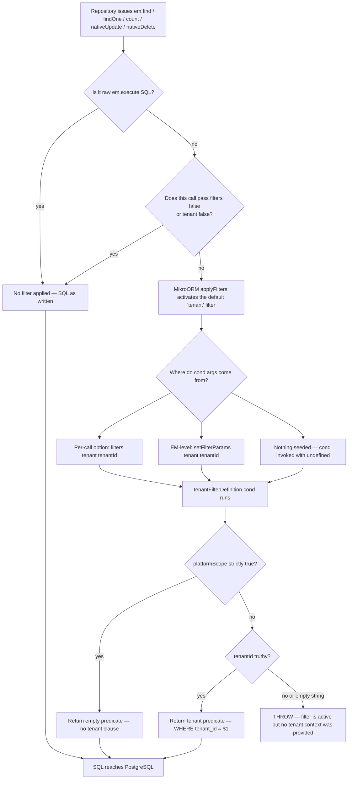
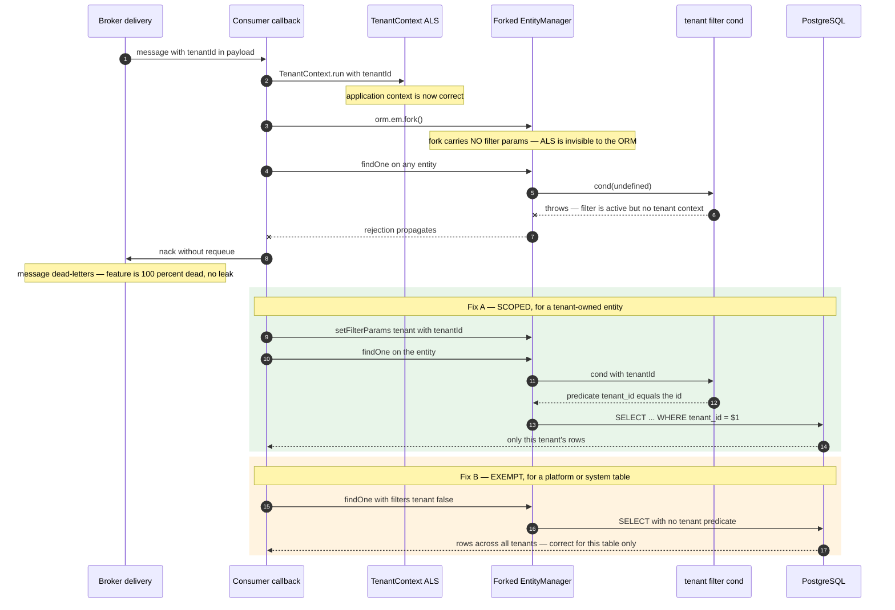
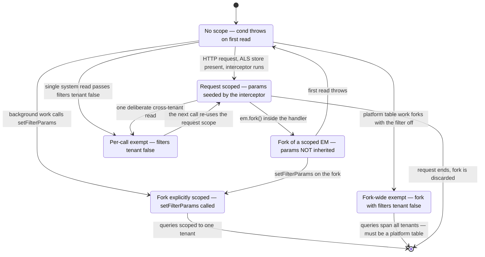
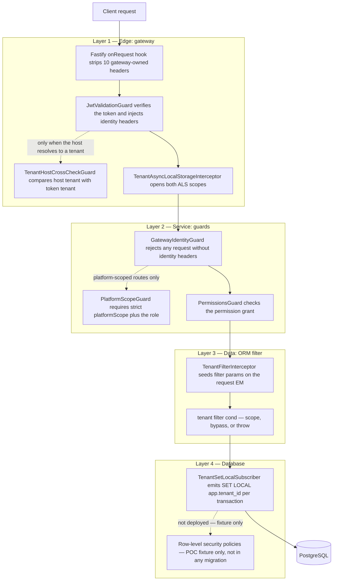

# Enforcement — the fail-closed filter and layered defence

This document answers one question in mechanical detail: when a query for tenant-owned data
reaches the database, what stops it returning another tenant's rows — and what happens when
that machinery is asked to run somewhere it was never designed for. It covers the global ORM
filter line by line, the three places that seed its parameters, the forked-entity-manager
failure that every service has hit at least once, each of the exemptions argued individually,
and an honest accounting of which layers are held up by an executing test versus by convention
and review. Read it before you write a message consumer, a scheduled job, a seeder, a
migration script, or any repository method that reaches for the escape hatch.

Everything below was read from the enforcement library, its twelve test files, the per-service
adapters that consume it, and the gateway that feeds it. Where a decision record describes
behaviour the code does not have, or a test asserts an interface the code does not expose, that
is stated inline.

---

## The one-paragraph answer

Isolation is enforced by a **single MikroORM filter named `tenant`**, registered once in the
shared ORM configuration with `default: true`, which means it applies to every entity in every
query unless a caller explicitly turns it off. Its condition function has exactly three
outcomes: return an empty predicate (platform scope), return `{ tenantId }` (the normal case),
or **throw**. There is no fourth outcome, and in particular there is no "no context, so no
predicate" outcome — that is the whole design. Three components seed the filter's parameters
and all three are HTTP-request-scoped, so anything that is not an HTTP request (a consumer, a
cron, a seeder, a background poller) gets the throw unless it deliberately establishes scope or
deliberately opts out. Around that filter sit three other layers — the gateway's header
contract, the per-service identity guard, and a database session variable — none of which is
trusted alone, and one of which is currently inert.

---

## 1. The filter, in full

The whole enforcement primitive is under eighty lines. Here is the operative part, verbatim
from `libs/platform/mikro-orm/src/lib/tenant-filter.ts`:

```ts
export const TENANT_FILTER_NAME = "tenant";

export interface TenantFilterArgs {
  tenantId: string;
  platformScope?: boolean;
}

export const tenantFilterDefinition = {
  name: TENANT_FILTER_NAME,
  cond: (args?: Partial<TenantFilterArgs>) => {
    // SUPERADMIN bypass — platformScope must be strictly true (ADR-0029).
    if (args?.platformScope === true) {
      return {};
    }
    if (args?.tenantId) {
      return { tenantId: args.tenantId };
    }
    // Active filter, no tenant context → fail CLOSED with an actionable error.
    throw new Error(
      `MikroORM '${TENANT_FILTER_NAME}' filter is active but no tenant context was provided. ` +
        `Disable it for a system/cross-tenant query with ` +
        `{ filters: { ${TENANT_FILTER_NAME}: false } }, or provide { tenantId } / ` +
        `{ platformScope: true }.`
    );
  },
  default: true,
  args: false as const,
};
```

Four properties of that object each carry weight.

**`default: true`** is what makes the filter an enforcement mechanism rather than a helper.
MikroORM applies a default filter to every entity query that does not explicitly disable it,
regardless of which `EntityManager` issued it and regardless of whether the entity has a
`tenant_id` column at all. The filter is not restricted to a set of entities, so it fires for
platform tables — the outbox, the inbox, roles, permissions — exactly as it fires for a deal or
an invoice. This is the single most consequential fact in the whole document, and section 4 is
about what it costs.

**The throw is the third branch, and it is deliberate.** An empty predicate returned on a
missing context would compile, pass every type check, produce a syntactically valid `SELECT`,
and silently return every tenant's rows. The failure would be invisible: no exception, no log
line, no metric, just a list that is too long. Throwing converts that class of bug into a loud,
greppable, stack-traced error at the first query. The error message is written to be actionable
— it names both escape hatches, so the engineer who hits it at 2 a.m. does not have to read the
library to find out what to do. An earlier revision of this code produced a bare
`TypeError: Cannot read properties of undefined (reading 'platformScope')`, which told the
reader nothing about tenancy at all.

**An empty-string `tenantId` falls through to the throw**, because `args?.tenantId` is a
truthiness test. `WHERE tenant_id = ''` is never a valid scope: no tenant has that identifier,
so the query would return zero rows and look like "no data" rather than "no scope". The
distinction matters because there is a real code path that can produce an empty string — the
data-tier middleware constructs `{ tenantId: tenantId ?? '', isSuperAdmin }` when only the
super-admin header is present. Failing closed on empty string turns that into an error instead
of a silent empty result set.

**`platformScope: true` is not self-authorising.** The filter has no way to verify that the
caller is genuinely a platform-scoped super-admin; it only reads a parameter that some earlier
code supplied. The comment in the source states the contract plainly: it must always be paired
with a prior `PlatformScopeGuard` check, which performs the same strict `=== true` comparison
so that a truthy-but-not-`true` value (`1`, `'true'`, `'yes'`) cannot bypass either. The filter
is described in its own source as "the last line of defense, not the only one" — an unusually
honest thing for an enforcement primitive to say about itself, and the reason this document has
a section on layers.

### Why fail-open is the catastrophic default

It is worth being explicit about the asymmetry, because "return everything when unscoped" is
what almost every ORM filter implementation does by accident.

A fail-open filter fails **silently, permanently, and in the direction of disclosure**. The
first request after the bug ships returns another tenant's rows to a real user; nothing in the
system distinguishes that response from a correct one; the data is now in a browser, a cache, a
CSV export, an email. There is no rollback for a read.

A fail-closed filter fails **loudly, immediately, and in the direction of unavailability**. The
first request after the bug ships throws, the endpoint returns a 500, the error is in the logs
with the filter's name in the message, and an engineer fixes it. The cost is an outage of one
feature. The evidence in this codebase is that this is exactly how it plays out: every
confirmed instance of the forked-EM bug in section 4 manifested as a dead feature — messages
dead-lettering, a poller publishing nothing, a pod crash-looping — and every one was found and
fixed. None of them leaked a row.

### The entity-level filter that was deliberately deleted

`TenantBaseEntity` carries the `tenantId` column but deliberately carries **no**
`@Filter('tenant')` decorator. The reason is recorded in the class docstring and proved by a
test:

> MikroORM's `applyFilters` dedupes filters by name in the order config → EM → entity (see
> `@mikro-orm/core` `EntityManager.applyFilters`, which pushes `config.filters` first and skips
> later same-named filters via its `active` Set), so the config-level filter always wins and
> any entity-level `@Filter('tenant')` would be permanently dead code that implies protection
> it does not provide.

The corresponding test reads the decorator metadata directly and asserts absence:

```ts
const meta = MetadataStorage.getMetadataFromDecorator(TenantBaseEntity);
expect(meta.filters?.[TENANT_FILTER_NAME]).toBeUndefined();
```

This is a good instinct generalised: a security control that is inert but present is worse than
absent, because a reviewer sees the decorator and stops reading. Section 6 describes a second
piece of tenancy metadata in the same library that has **not** yet been held to this standard.

### What the filter protects

The filter applies to **every** entity, because it is registered `default: true`. What
inheritance from `TenantBaseEntity` defines is the _convention_ for a tenant-scoped table — it
supplies the primary key, the tenant column and the timestamps in one place. The distinction
matters: fourteen entities, `User` among them, declare `tenant_id` directly without inheriting
it, and they are just as scoped as the ones that do:

```ts
@Entity({ abstract: true })
export abstract class TenantBaseEntity {
  @PrimaryKey({ type: "uuid" })
  id: string = v4();

  @Property({
    type: "uuid",
    nullable: false,
    index: true,
    fieldName: "tenant_id",
  })
  tenantId!: string;
  // createdAt / updatedAt omitted
}
```

Counted across the services: **76 concrete entity classes** inherit it — 27 directly, and 49
through one of **6 abstract base classes** (trading 20, accounting 14 directly plus 4 more
through the abstract single-table-inheritance invoice root, commission 6, notification 3,
document 2). The trading base adds a soft-delete column and its
own default-on `softDelete` filter using the identical "single base plus global default-on
filter" shape, which is why a trading query can need `{ filters: false }` for reasons that have
nothing to do with tenancy.

Note the property is **public and writable**. That is not an accident of laziness; it is a
requirement. The filter condition returns `{ tenantId: args.tenantId }`, which MikroORM
resolves against the entity's _mapped property name_. An entity that maps the column to a
private `_tenantId` with a getter-only `tenantId` breaks the filter at runtime with
`Trying to query by not existing property Entity.tenantId` under strict mode — a real failure
that had to be fixed across several entities before their per-service enforcement tests could
go green. The base entity's own TODO acknowledges the encapsulation cost of this trade.

---

## 2. The query path, end to end

The filter is a pure function. Something has to call it, and something else has to supply its
arguments. This diagram traces one query from a repository call down to SQL, showing every
point at which the outcome can change.



Three things in that diagram are easy to get wrong and worth stating in prose.

**Raw SQL is entirely outside the mechanism.** `em.execute('SELECT …')` never passes through
`applyFilters`, so it needs no disable — and gets no protection. The outbox relay's advisory
lock and backlog count deliberately use raw SQL for exactly this reason, and their source says
so. If you write raw SQL against a tenant-scoped table, the `WHERE tenant_id = $1` is yours to
write and nothing will remind you.

**Native writes are inside it.** MikroORM v6 applies registered filters to `nativeUpdate` and
`nativeDelete`, not only to reads. This is the single most expensive detail in the whole
system, because it means fixing a filter bug on a `find` while leaving the paired
`nativeUpdate` untouched produces the worst possible outcome: rows are read and acted on, but
the status write-back throws, so the work repeats forever. Section 5 has the concrete instance.

**`persist()` and `flush()` are outside it.** Filters do not apply to inserts through the unit
of work. A seeder or a test fixture can construct entities with an explicit `tenantId`, persist
and flush them with no tenant context at all, and it works. Every per-service enforcement test
relies on this: they seed rows through a bare `orm.em.fork()` and only then start driving the
request simulation.

### The three seeders, and their differences

Only three components in the codebase call `setFilterParams(TENANT_FILTER_NAME, …)` on the
request path, and their differences matter.

| Component                 | Where it runs                         | What it does                                                                         | Wired today                                                       |
| ------------------------- | ------------------------------------- | ------------------------------------------------------------------------------------ | ----------------------------------------------------------------- |
| `TenantFilterInterceptor` | NestJS `APP_INTERCEPTOR`, every route | Reads the ALS store, seeds params on the request-scoped EM, delegates to the handler | **Yes** — registered by the shared service bootstrap, 12 services |
| `TenantGuard`             | NestJS guard                          | Resolves and validates the tenant via cache and lookup, then seeds params            | **No** — exported, never referenced by any service                |
| `TenantEntityManager`     | Injected wrapper, per operation       | Forks, seeds params on the fork, and _also_ passes the per-call `filters` option     | **Yes** — provided by the shared service bootstrap                |

The interceptor is the load-bearing one, and its own header explains why it is an interceptor
rather than a guard or middleware:

```ts
intercept(_context: ExecutionContext, next: CallHandler): Observable<unknown> {
  const store = TenantContext.getStore();

  // Set request-scoped params only for a real tenant-scoped store. SUPERADMIN
  // and "no context" intentionally leave the EM untouched (see file header).
  if (store && !store.isSuperAdmin && store.tenantId) {
    this.em.setFilterParams(TENANT_FILTER_NAME, { tenantId: store.tenantId });
  }

  return next.handle();
}
```

Guards return a boolean and cannot wrap downstream execution; middleware runs _before_ the ORM
has created its per-request `EntityManager` fork. The NestJS lifecycle is middleware, then
guard, then interceptor, then handler — and the ORM's own request middleware has established
the contextual fork by the time an interceptor runs, so `this.em` resolves to the fork that the
handler will actually query through. Setting params anywhere earlier would set them on the
wrong object.

Two of its branches are silent by design. For a super-admin store it sets nothing, because
setting `platformScope` here would make the filter self-bypassing without any guard having
authorised it. For a request with no tenant context at all — a public route — it also sets
nothing, so a public route that later issues a tenant-scoped query fails closed rather than
succeeding unscoped.

`TenantGuard` deserves a note because it is the most complete-looking component in the library
and is not used. It resolves the tenant through a cache with a 60-second TTL, rejects an unknown
tenant with 401, rejects a suspended tenant with 403 `TENANT_SUSPENDED`, and stashes the
resolved store on the request for the middleware to pick up. It has 11 unit tests plus coverage
in the isolation suite. A repository-wide search finds it exported from the library index and
referenced by nothing but its own tests and four unrelated docstrings. Its tests also construct
it with **four** constructor arguments — cache, lookup, entity manager, and a mock reflector —
while the class declares **three**; JavaScript discards the extra argument, so the tests pass
while asserting an interface (route-level metadata via a reflector) that the implementation
does not have. Tenant suspension enforcement, which this guard is the only implementation of,
therefore does not run in any service today.

---

## 3. The disable syntax, and why it exists at all

Every enforcement mechanism that is on by default needs a documented way to be off, or
engineers will invent an undocumented one. In MikroORM v6 the supported forms are:

| Form                                      | Effect                                                                    |
| ----------------------------------------- | ------------------------------------------------------------------------- |
| `{ filters: false }`                      | Disables **all** filters for that call                                    |
| `{ filters: { tenant: false } }`          | Disables the named `tenant` filter only                                   |
| `{ filters: { tenant: { tenantId } } }`   | Supplies arguments for that call without touching EM-level params         |
| `em.fork({ filters: { tenant: false } })` | Disables it for every query issued through that fork                      |
| `qb.applyFilters({ tenant: false })`      | The QueryBuilder equivalent — `applyFilters` is async and must be awaited |

The codebase converges on a one-line constant at the top of any file that needs it, which makes
the exemptions greppable:

```ts
const NO_TENANT_FILTER = { filters: { tenant: false } } as const;
```

There are **17 such declarations** in non-test source (an 18th sits in a testcontainers spec). That number is the real exemption
inventory, and section 5 argues them.

The distinction between `{ filters: false }` and `{ filters: { tenant: false } }` is not
cosmetic in trading-service, where `TradingBaseEntity` also registers a default-on `softDelete`
filter. `{ filters: false }` there disables tenancy _and_ resurrects tombstoned rows. Several
trading tests rely on precisely that, which is correct for a test and would be a defect in a
handler.

### One trap worth memorising

The obvious-looking API is wrong, and its failure mode is a runtime crash rather than a compile
error. From the `TenantEntityManager` source:

> `addFilter(TENANT_FILTER_NAME, false)` does NOT disable the filter — it registers a NEW filter
> with `cond = false` and crashes at runtime with "No arguments provided for filter 'tenant'".
> The correct v6 disable is the `{ [name]: false }` form passed to `applyFilters`.

The QueryBuilder path had a second, subtler problem: `applyFilters` is asynchronous, so a caller
who built a query builder and forgot to await the activation shipped a silently unfiltered
query. The fix was to make the wrapper's `createQueryBuilder` itself async and do the activation
inside it, so the caller cannot forget:

```ts
const qb = (fork as SqlEntityManager).createQueryBuilder(entityName, alias);
await qb.applyFilters({ [TENANT_FILTER_NAME]: !store.isSuperAdmin });
return qb;
```

Note the expression in the argument. The same call both activates the filter for a tenant
context and disables it for a super-admin one — symmetric with the `find`/`findOne` path, which
passes either `{ tenant: { tenantId } }` or `{ tenant: false }`. Two unit tests assert each
branch explicitly, including that no filter parameters are seeded on the super-admin path.

---

## 4. The forked-entity-manager problem

This is the part that reads like a bug report and is actually the design working. It has cost
more engineering time than anything else in the tenancy layer, and it recurs because the mental
model that causes it is reasonable.

### The crux: two different pieces of state

There are two independent notions of "the current tenant" and they are stored in different
places:

1. **The AsyncLocalStorage store** — `TenantContext`, a Node `async_hooks` store carrying
   `{ tenantId, isSuperAdmin? }`. This is what application code reads.
2. **The ORM filter parameters** — set with `em.setFilterParams('tenant', { tenantId })` on a
   specific `EntityManager` instance. This is what the filter reads.

Nothing in the ORM knows about the first. Wrapping work in `TenantContext.run({ tenantId }, …)`
establishes the _application's_ tenant context and does absolutely nothing to the ORM. Only the
three seeders in section 2 bridge the gap, and all three are HTTP-request-scoped.

So: a message consumer that dutifully wraps its handler in `TenantContext.run(...)` and then
forks an entity manager has an entity manager with **no filter parameters**. The first query
against any entity — tenant-scoped or not — invokes `cond(undefined)` and throws.

The propagation contract in `tenant-context.ts` is explicit about which boundaries carry the ALS
store and which do not. It propagates across `await`, promise chains, `setTimeout`,
`setImmediate`, `process.nextTick`, `queueMicrotask`, libuv I/O callbacks, and NestJS
interceptor chains. It does **not** propagate into worker threads, child processes, scheduler
and cron callbacks, or AMQP message handlers, because those originate outside any request. It
also carries a paragraph on `EventEmitter` that is worth reading twice: listeners run inline in
the _emit_ caller's async frame, so a plain listener sees the **emit-time** store, not the
registration-time one. The practical rule it derives — "if you need a guarantee, wrap the emit
site, not the registration site" — is backed by three tests that pin each of the three
combinations.

But even a perfectly propagated ALS store does not seed filter parameters. That is the trap.

### What it looks like from the outside



Three lanes, and only the first is a bug. The unwrapped path throws inside the filter, so the
consumer nacks and the message dead-letters: the feature is completely dead, loudly, and no row
leaks. Fix A is the **scoped** resolution — seed the filter parameters for the tenant the work
belongs to, and every query stays constrained. Fix B is the **exempt** resolution — turn the
filter off for a table that genuinely has no tenant dimension. Choosing between them is not a
matter of taste, and the rule below is what decides it.

### The decision rule

The rule is short, and choosing the wrong branch is a real defect in both directions.

> **Is the entity tenant-scoped — does it have a `tenant_id` column, whether inherited from
> `TenantBaseEntity` or declared directly on the class?**
>
> - **Yes** → establish scope. Fork, then call `em.setFilterParams('tenant', { tenantId })` > **before the first read**. Never `{ filters: false }`: that removes real protection from a
>   table that needs it.
> - **No** — a platform or system table with no `tenant_id` column → disable the filter for that
>   call with `{ filters: { tenant: false } }`. Never seed a `tenantId`: the predicate would
>   reference a column that does not exist.
>
> Then, before you close the file: **grep the whole file and directory for every `find`,
> `findOne`, `count`, `nativeUpdate` and `nativeDelete` on the same entity, and check the
> sibling component.** This bug class travels in read/write pairs and in component pairs.

The seeder case is the clean illustration of getting it right. A trading-service seeder running
in `onApplicationBootstrap` reads reference data — `Country`, `Currency`, `Unit` — which are
tenant-**scoped**. The fix was not to disable the filter:

```ts
// Fork a context-bound EM: the bootstrap hook runs outside any request
// context, and MikroORM v6 forbids the global instance for identity-map work.
const em = this.em.fork();

// Supply the tenant context the global (fail-closed) `tenant` filter requires.
// Without it every TenantBaseEntity read throws instead of scoping to the seed
// tenant. Same call the request-path interceptor and tenant-guard make.
em.setFilterParams(TENANT_FILTER_NAME, { tenantId });
```

Before that fix the service crash-looped on boot with two errors in sequence: first the ORM's
ban on using the global entity manager for identity-map work, then the filter throw on the first
`Country` read. Because the gateway routes through this service, the whole local stack failed to
come up. Both errors are the fail-closed design doing its job at boot instead of at request
time.

### The lifecycle of an entity manager's tenant scope



The transition to watch is `ReqScoped → ForkUnscoped`. Filter parameters live on an
`EntityManager` instance and are **not** inherited by a fork of it. Code inside a perfectly
scoped request handler that calls `em.fork()` — a common pattern for isolating a unit of work —
lands back in the unscoped state. The per-service enforcement tests encode this in a comment
that is easy to skim past and load-bearing:

> `work` must query via `orm.em` (NOT `orm.em.fork()`) so it shares the request fork the
> interceptor scoped.

`TenantEntityManager` sidesteps the whole issue by forking _and_ seeding on every single
operation, in a private helper:

```ts
private prepareFork(): { fork: EntityManager; filterOptions: Record<string, unknown> } {
  const store = TenantContext.getStore();
  if (!store) {
    throw new MissingTenantContextError();
  }
  const fork = this.em.fork();
  const filterOptions = store.isSuperAdmin
    ? { [TENANT_FILTER_NAME]: false }
    : { [TENANT_FILTER_NAME]: { tenantId: store.tenantId } };
  if (!store.isSuperAdmin) {
    fork.setFilterParams(TENANT_FILTER_NAME, { tenantId: store.tenantId });
  }
  return { fork, filterOptions };
}
```

Note that it does both: seeds EM-level parameters _and_ passes per-call filter options. That is
belt and braces — either alone would work — and it means the wrapper is safe regardless of which
mechanism a future ORM upgrade changes.

---

## 5. The exemptions, argued one at a time

An exemption list is only trustworthy if each entry was argued rather than granted. Here are the
live ones, with the case for each.

### Inbox deduplication — justified

The inventory and trading inboxes record `(consumer, event_id)` pairs in a `processed_event`
table so a redelivered message is a no-op. That table deliberately has **no** `tenant_id`
column: its primary key is the composite `(consumer, event_id)`, and its columns carry no
tenant-owned data. It is a per-service delivery ledger, not business data.

The argument for exemption is therefore structural, not convenience-driven: there is no column
to filter on. Seeding a `tenantId` would produce a predicate against a non-existent property.

```ts
// `ProcessedEvent` carries no tenant_id (deliberately not a TenantBaseEntity),
// but the production ORM registers a fail-closed global tenant filter
// (default: true) that throws when it runs with no tenant context. The RMQ
// consumer path forks a raw EM and never seeds filter params, so this inbox
// read must disable the filter.
const existing = await this.em.findOne(
  ProcessedEvent,
  { consumer, eventId },
  { filters: false }
);
```

The residual risk is that the inbox is now a cross-tenant namespace: two tenants processing the
same event id would collide. In practice event ids are UUIDs minted per publish, so this is
theoretical. It is nonetheless the thing to check if the id scheme ever changes.

Before this was fixed, the failure was total and silent from the outside: the first inbox read
threw, the transaction rejected, the message was nacked without requeue, and the feature was one
hundred percent dead in the deployed environment while every test was green.

### Outbox relay — justified, and the read/write pair is the lesson

`OutboxEntry` lives in a dedicated `platform_outbox` schema and is a platform table by design:
one relay drains one service's outbox regardless of which tenant produced each entry. The relay
polls on a background timer with no request context.

Its exemption comment is the most instructive one in the codebase because it names the pairing:

```ts
/**
 * ... MikroORM v6 applies filters to `find`/`findOne` AND `nativeUpdate`/`nativeDelete`,
 * so both the Phase-1 claim `find` and the Phase-3 status-writeback `nativeUpdate`
 * pass this.
 */
const NO_TENANT_FILTER = { filters: { tenant: false } } as const;
```

The failure mode when only the read was fixed is worth spelling out. The relay claims a batch,
publishes it to the broker, then flips each entry's status to `PUBLISHED`. If the claim query
works and the status write-back throws, the entries publish successfully and are never marked
— so the next poll claims them again, publishes them again, and does so forever. Fixing half of
a filter bug converts a dead feature into an infinite duplicate-delivery loop, which is strictly
worse. The relay's advisory-lock and backlog-count queries use raw `em.execute` and correctly
carry no disable, because raw SQL never reaches `applyFilters`.

### Outbox reaper — justified, and it is why "check the sibling" is a rule

The reaper is the relay's safety net: it scans for entries stuck in `PUBLISHING` beyond a
threshold and flips them to `FAILED`. It is co-wired with the relay, under the same
configuration flag, on the same entity manager — and it had the **identical** defect at its own
two sites (the scan `find` and the flip `nativeUpdate`). The relay-only fix left the safety net
silently defeated on every service that had the relay enabled, and an adversarial review caught
it rather than a test.

Its exemption comment ends with the sentence that generalises the whole class:

> ... so without this the reaper's ORM `find` (scan) and `nativeUpdate` (flip) throw, are
> swallowed by the per-scan/per-entry catch, and the stuck-entry safety net silently never
> fires.

Note "swallowed by the per-scan catch". A background component that catches and logs its own
errors converts a fail-closed throw back into a silent failure. Fail-closed only produces a loud
error if nobody is muffling it.

### Platform-lane notification events — justified, with a sentinel

Notification-service consumes some events that are genuinely platform-wide. Workspace discovery
is dispatched for every email address, including one that maps to zero workspaces, so there is
no tenant to scope to. The consumer keeps an explicit allow-list rather than inferring from a
missing field:

```ts
const PLATFORM_EVENT_TYPES: ReadonlySet<string> = new Set([
  "identity.workspace.discovery-requested",
]);

const PLATFORM_TENANT_ID = "00000000-0000-0000-0000-000000000000";
const PLATFORM_READ_FILTER = { [TENANT_FILTER_NAME]: false } as const;
```

The dispatch then branches once, at the top:

```ts
if (!isPlatformEvent) {
  // Tenant-scoped: activate the global tenant filter on the fork so a plain
  // read is auto-scoped (mirrors the request-time TenantFilterInterceptor).
  em.setFilterParams(TENANT_FILTER_NAME, { tenantId: effectiveTenantId });
}
// Platform events set NO filter params; their reads pass PLATFORM_READ_FILTER.
```

This is the decision rule applied per message rather than per file, and it is the right shape:
the exemption is named, enumerable, and reviewable, and everything not on the list takes the
scoped path. The nil-UUID sentinel exists so that _writes_ still carry a valid non-null
`tenant_id` — a platform event still produces a delivery row, and the column is `NOT NULL`.

### Seeding — mostly justified, and split by entity

Seeders run at bootstrap with no request. Where the seeded entity is platform-level — roles,
permissions, an admin bootstrap — they disable the filter, which is correct. Where the seeded
entity is tenant-scoped — trading reference data — they seed parameters instead, as shown in
section 4. The same service can legitimately do both, and the deciding question is only ever
"does this entity have a `tenant_id` column, whether inherited from `TenantBaseEntity` or
declared directly on the class".

### The by-primary-key exemption — this one does not survive the argument

The last shape in the set is a repository that disables the tenant filter on an entity that **is**
tenant-scoped, and argues the exemption from three properties of its own methods: a `findById` is
a by-primary-key lookup, so the row is unique anyway; a `findByEmail` is handed an explicit tenant
id by the port and applies it in the predicate; and several methods run outside a request context
— seeding, background jobs — where the fail-closed filter would otherwise throw. This exemption
is common wherever a port/adapter split moves the tenant id into the method signature, because
the tenant then looks like it is being handled at every call site that has one.

Two of those three justifications hold. A finder given an explicit tenant id does scope its
predicate. The context-free background paths genuinely have no tenant to scope to.

The first does not. "It is a by-PK lookup" is a statement about uniqueness, not about
authorisation, and the two are different questions. The shape that causes the problem looks
like this:

```ts
// illustrative: a by-primary-key read that opts out of the tenant filter
async findById(id: string, callerEm?: EntityManager): Promise<Entity | null> {
  return (callerEm ?? this.tem.getEntityManager()).findOne(Entity, { id } as never, NO_TENANT_FILTER);
}
```

There is no tenant predicate anywhere in that query. Any route that reaches such a method with an
identifier taken from a path parameter is one where an authenticated caller in one tenant could
name another tenant's row and be handed it. That is the classic broken-object-level-authorisation
shape: the identifier is unguessable, and unguessability is not an access control.

A repository that disables the tenant filter and justifies it with "this is a by-PK lookup" has
confused uniqueness with authorisation. That is the whole argument for the decision rule in
section 4 existing in writing: the value of a fail-closed filter is undone by a single method
that opts out of it on a tenant-scoped entity, and nothing about the opt-out is visible at the
call site — the caller sees a perfectly ordinary `findById`.

### Summary

| Exemption                         | Entity               | Column exists? | Verdict                                             |
| --------------------------------- | -------------------- | -------------- | --------------------------------------------------- |
| Inbox `recordOnce`/`hasProcessed` | `ProcessedEvent`     | No             | Justified — structural, nothing to filter on        |
| Outbox relay claim + write-back   | `OutboxEntry`        | No             | Justified — platform table, both sites needed       |
| Outbox reaper scan + flip         | `OutboxEntry`        | No             | Justified — same table, sibling of the relay        |
| Notification platform lane        | delivery entities    | Yes            | Justified — explicit allow-list plus nil sentinel   |
| Role / permission repositories    | `Role`, `Permission` | No             | Justified — neither inherits the tenant base entity |
| Trading reference-data seeder     | `Country` and others | Yes            | **Not** exempt — correctly seeds parameters instead |

Every exemption that survives the decision rule has one of two shapes: the entity has no
`tenant_id` column to filter on at all, or the exemption is an enumerated allow-list a reviewer
can read in one screen. The by-primary-key exemption above has neither, which is why it is the
one that fails.

---

## 6. The exemption marker that enforces nothing

The library ships a declarative marker for exempt entities:

```ts
export const TENANT_EXEMPT_KEY = Symbol("TENANT_EXEMPT");

export function TenantExempt(): ClassDecorator {
  return (target: object) => {
    Reflect.defineMetadata(TENANT_EXEMPT_KEY, true, target);
  };
}

export const TENANT_EXEMPT_ENTITY_NAMES: ReadonlySet<string> = new Set([
  "Tenant",
  "TenantConfig",
  "SuperadminAuditLog",
  "PlatformSetting",
  "Role",
  "Permission",
]);
```

It has 8 unit tests plus two scenarios in the isolation suite. All of them assert that the
decorator sets metadata and that the name set contains the expected six names. None of them
assert that anything _reads_ it — and nothing does. A repository-wide search for
`isTenantExempt`, `TENANT_EXEMPT_KEY` and `TENANT_EXEMPT_ENTITY_NAMES` outside the defining file
and its tests finds only the three re-exports in the library index. No filter, no guard, no
interceptor, no repository consults either the decorator or the name set at runtime.

The gap between the marker and reality is measurable:

- **2 entity classes** actually carry `@TenantExempt()`.
- **6 names** are in the set.
- **`PlatformSetting` does not exist** as an entity anywhere in the codebase, yet a test asserts
  its presence in the set and another asserts the set's size is exactly 6.
- `Role`, `Permission` and `TenantConfig` are genuinely exempt — they do not inherit
  `TenantBaseEntity` — but carry no decorator.

Actual exemption is achieved entirely by per-query `{ filters: { tenant: false } }`. The
decorator is documentation that looks like enforcement, which is precisely the failure mode the
project already identified and fixed for the entity-level `@Filter('tenant')` in section 1. The
same reasoning applied consistently would either wire this metadata into the filter's
`entity` restriction or delete it.

---

## 7. Write-side enforcement

Reads are the interesting half, but `TenantEntityManager` also refuses several classes of bad
write, and the reasoning is worth recording because each rule was added after a real incident
shape.

`persist()` validates the tenant **value**, not just the presence of a context, and it does so
before touching the entity:

- **No ALS store at all** → `MissingTenantContextError`. A background caller must establish
  context first.
- **Super-admin context, entity has no explicit `tenantId`** → `InvalidTenantWriteError`. The
  super-admin path deliberately does not auto-assign, because assigning the super-admin's home
  tenant would silently misfile the row; refusing forces the caller to say which tenant they
  meant.
- **Tenant context whose `tenantId` is empty or whitespace** → `InvalidTenantWriteError`. The
  error message calls the result "a write-only orphan the fail-closed read filter can't return",
  which is exactly right: a row written with `tenant_id = ''` can never be read back by any
  scoped query.
- **Entity already carries a different, non-empty `tenantId`** → `CrossTenantWriteError`. The
  alternative — silently re-stamping the row to the current tenant — would turn an attempted
  cross-tenant write into a successful data move. This is explicitly described as symmetric with
  `remove()`, which has always rejected cross-tenant removal.
- **Otherwise** → stamp the context's tenant onto the entity and flush.

The stamping step itself has a three-branch resolution order that exists to degrade gracefully
rather than crash cryptically: a `setTenantId(value)` mutator if the entity exposes one, then a
writable or setter-backed `tenantId` property, and otherwise an actionable throw naming the
entity. Settability is feature-detected by walking the prototype chain for a property descriptor
— a getter-only accessor has `set === undefined` and is correctly treated as not settable. The
docstring is honest that only the middle branch executes in production today; the other two are
guards for entities that do not yet exist. Six unit tests pin the branches, including one that
asserts nothing is persisted or flushed when the assignment is refused.

`remove()` is simpler and stricter: no store, or an entity whose `tenantId` differs from the
context, both throw. It then removes by reference rather than by the passed instance, so a
detached entity cannot smuggle in stale state.

---

## 8. Layered defence

No single layer is trusted, and each catches something the others structurally cannot.



### Layer 1 — the edge

The gateway owns a set of headers and enforces that ownership in both directions. On the way in,
a Fastify `onRequest` hook deletes any client-supplied copy of ten headers before any NestJS
middleware or guard runs: `x-tenant-id`, `x-user-id`, `x-user-roles`, `x-permissions`,
`x-ip-address`, `x-correlation-id`, `x-super-admin`, `x-platform-scope`, `x-mfa-enabled`, and
`x-resolved-tenant-id`. The strip iterates the request's actual header keys with a lowercase
comparison, so a recased survivor from a non-conforming upstream proxy is still removed — the
source notes that Node normalises header case anyway, and that the loop exists to remove an
implicit invariant from the threat model rather than to fix an observed bug. That is the right
instinct for a control at a trust boundary.

On the way out it sets those headers from the verified token, and only from the verified token.
Ordering is load-bearing and documented at the module level: middleware runs before guards and
therefore cannot see the token-derived identity, which is why the host-versus-token cross-check
had to become a guard registered _after_ the JWT guard rather than middleware.

**What only this layer catches:** header forgery from outside the cluster, and a session
replayed on a different tenant's origin.

### Layer 2 — the service guards

`GatewayIdentityGuard` is a header-**trust** guard, not a verification guard. It reads
`x-user-id` and `x-tenant-id`, and if either is missing it throws `UnauthorizedException`
("Missing gateway identity headers"), on the reasoning that their absence means the request did
not transit the gateway. It builds `request.user` from the headers, splitting the CSV role and
permission lists, and surfaces platform scope only on strict string equality:

```ts
...(firstHeader(headers['x-platform-scope']) === 'true' ? { platformScope: true } : {}),
```

The claim is **omitted** rather than set to `false` when absent, mirroring the token payload
shape so that a tenant-scoped request carries no platform scope key at all. `PlatformScopeGuard`
then requires all three of: a user object, `platformScope === true`, and `SUPERADMIN` in the
roles array — a role check the source annotates as preventing privilege escalation via a crafted
token.

**What only this layer catches:** direct service-to-service traffic that bypassed the gateway,
and a platform-scoped operation attempted by a non-super-admin.

**Where it is not applied:** these guards are attached per controller, not globally — so roughly
half of all controllers reference them, and the rest do not. Many of those are legitimately
unguarded: health and JWKS endpoints, pre-auth login and discovery routes, internal
service-to-service controllers, the gateway's own proxy. The problem is that this list cannot be
derived from the code. A reference-data handler that never extracts a tenant id at all, relying
entirely on layer 3 for isolation, is indistinguishable from one that forgot to. **Where
authorisation is opt-in per controller, a deliberate omission and a forgotten one look identical,
so no audit of the source can say which is which** — which is the argument for making the guard
global with an explicit opt-out, so the exceptions become a reviewable list.

### Layer 3 — the ORM filter

Sections 1 through 4. This is the only layer applied uniformly to every query in every service
regardless of controller wiring, which is exactly why it must fail closed: it is the layer that
catches the case where layers 1 and 2 were never attached.

**What only this layer catches:** a handler that forgets to scope its query, a controller
without a guard, a repository method that takes an id from a path parameter, and any future code
path nobody has thought of. It is also the only layer that operates on data rather than on
identity.

### Layer 4 — the database

`TenantSetLocalSubscriber` is registered as a default ORM `EventSubscriber` by the shared
configuration factory, merged with any service-supplied subscribers so a service cannot silently
drop it — a property with its own unit test. On `afterTransactionStart` it emits:

```ts
const SET_LOCAL_SQL = "SET LOCAL app.tenant_id = ?";
```

Three details are recorded in its header and each is a real constraint. It must run _after_
transaction start because `SET LOCAL` is rejected outside a transaction. The value is
interpolated client-side rather than bound, because PostgreSQL's `SET` command does not accept
bind parameters in the extended-query protocol; the ORM's `execute(sql, params)` performs the
escaping, and `set_config('app.tenant_id', $1, true)` is named as the true parameterised
equivalent if wire-level binding is ever needed. And `SET LOCAL` specifically — never plain
`SET` — because a session-level GUC survives the connection pooler's reset and the next request
on that backend reads with the previous tenant's identity. That last point is not a guess: it
was proved empirically in a six-cell behaviour matrix against PostgreSQL 16 behind a transaction-
mode pooler, and recorded as a hard contract in an amendment to the data-tier decision record.

Two skip branches: super-admin (setting the GUC to an empty string would block every row rather
than bypass, since the policy has no empty-string branch) and empty or whitespace tenant id
(rather than emit a value that binds the transaction to a non-existent tenant).

**What only this layer would catch:** raw SQL that bypasses the ORM entirely, and a compromised
or buggy application process.

**Honest state:** it does not catch anything today. Searching all **51 service migration files**,
plus the Helm charts, finds **no** `ENABLE ROW LEVEL SECURITY` and **no** `CREATE POLICY`. The
only such statements in the repository are in the proof-of-concept fixture. The application half
of the contract is live and correct — every transaction sets the GUC — but nothing in production
reads it. Layer 4 is a correctly-built socket with nothing plugged in. Until a migration enables
RLS, the fail-closed filter is not one of two independent enforcement mechanisms; it is the only
one.

### The super-admin bypass is also currently unreachable

Two of the three branches of the filter's `cond` are never taken by production code:

- **`platformScope === true`** requires that something calls `setFilterParams` with a
  `platformScope` key. Every production `setFilterParams` call site passes only `{ tenantId }`.
- **`isSuperAdmin` in the ALS store** would flow from the data-tier middleware reading
  `x-super-admin`. That header is **strip-only**: the gateway deletes any inbound copy and never
  sets it — its proxy configuration and forwarding code both say so explicitly. No production
  code constructs a `TenantStore` with `isSuperAdmin: true`.

So the super-admin machinery in `TenantEntityManager`, `TenantFilterInterceptor` and
`TenantSetLocalSubscriber` — all of it individually tested — is currently dead in production.
Actual cross-tenant super-admin access is achieved a different way: `x-platform-scope` reaches
`PlatformScopeGuard`, and the platform controllers' repositories disable the filter explicitly.
That is arguably the safer of the two designs, because the bypass is per query and visible in
the diff rather than ambient in a context object. It is worth knowing that the code path
described by the decision record and the code path that runs are not the same one.

### What each layer uniquely covers

| Threat                                             | L1 edge | L2 guards | L3 filter | L4 database  |
| -------------------------------------------------- | ------- | --------- | --------- | ------------ |
| Forged identity header from an external client     | **Yes** | No        | No        | No           |
| Session replayed on another tenant's hostname      | **Yes** | No        | No        | No           |
| Request reaching a service without the gateway     | No      | **Yes**   | No        | No           |
| Non-super-admin invoking a platform route          | Partial | **Yes**   | No        | No           |
| Handler forgets to scope its own query             | No      | No        | **Yes**   | Would be     |
| Controller shipped with no guard attached          | No      | No        | **Yes**   | Would be     |
| Background job with no tenant context              | No      | No        | **Yes**   | Would be     |
| Raw SQL that bypasses the ORM                      | No      | No        | No        | **Would be** |
| Repository that opts out of the filter (section 5) | No      | Partial   | No        | **Would be** |

The last row is the argument for layer 4 in one line. The only defence against a repository that
deliberately disables the application-level filter is an enforcement mechanism the application
cannot disable.

---

## 9. The test-setup hazard

This is the most important operational point in the document, because it explains why every one
of the confirmed defects in section 5 was found by a human reviewer or by production rather than
by the test suite.

Every testcontainer `setup.ts` file boots the ORM with a **replacement** filter:

```ts
filters: {
  tenant: {
    cond: () => ({}),
    default: false,
  },
},
```

That is a filter with the same name, an always-empty condition, and default-off. It is the exact
inverse of production on both axes. The rationale given in the comments is reasonable in
isolation — "tests manage tenant context manually via explicit WHERE clauses" — and the
consequence is severe: **a green integration run proves nothing about tenant isolation.** Any
query that would throw in production returns rows in the harness. Any repository that forgot a
filter disable passes. Any consumer that forgot to seed parameters passes.

The failure mode generalises beyond this codebase: **a fixture that neuters a default-on security
control converts the entire suite from a detector into a blindfold**, and does so invisibly,
because the tests still exercise the business logic they were written for and still pass.

### What the correct fixture looks like

Where a service has one, the dedicated spec boots a **second** ORM with the genuine production
configuration and drives the real request stack. The helper is the interesting part:

```ts
async function runUnderRequest<T>(
  store: TenantStore,
  work: () => Promise<T>
): Promise<T> {
  const handler: CallHandler<T> = {
    handle: () => of(undefined).pipe(switchMap(() => from(work()))),
  };
  return RequestContext.create(orm.em, () =>
    TenantContext.run(store, () =>
      firstValueFrom(
        interceptor.intercept(makeContext(), handler) as Observable<T>
      )
    )
  );
}
```

Three nested scopes, in the same order as production: the ORM's `RequestContext.create` (what
the ORM's own request middleware does, giving this "request" its contextual fork), then
`TenantContext.run` (what the data-tier middleware does from the gateway-injected header), then
the interceptor wrapping the handler. The work then queries through `orm.em` — not a fork — so
it shares the fork the interceptor scoped.

The scenarios each spec asserts are the right four:

1. A plain `find` under tenant A's request returns only tenant A's rows, and vice versa.
2. A fetch by direct id of tenant B's row, from tenant A's request, returns `null`.
3. A system query still spans tenants **only** when it explicitly disables the filter.
4. Without the interceptor, a plain query **throws**:

```ts
const fork = orm.em.fork();
await expect(fork.find(FeatureFlag, {})).rejects.toThrow(
  new RegExp(`'${TENANT_FILTER_NAME}' filter is active but no tenant context`)
);
```

That fourth assertion is the one that would have caught every defect in section 5, because it
pins the production behaviour that the shared setup file erases.

### Why the second fixture spreads badly

A spec of that shape is opt-in per service, and opt-in coverage of a cross-cutting property
converges slowly: the services that get one are the ones where somebody was already thinking
about isolation, which are the least likely to be wrong. The consequence is the point worth
carrying: a service can carry an argued, reviewed filter exemption and still have no test that
exercises the production filter configuration, because the suite that guards the exemption runs
against the neutered one. A test written against a disabled filter proves that the code compiles
and that the query returns rows. It cannot prove isolation, and it passes in exactly the same way
whether isolation works or not.

The structural fix is to move the production filter configuration into the shared test bootstrap
rather than to add a second spec per service — a fixture that differs from production is a
per-service decision until it is a shared one.

---

## 10. Honest gap analysis

### Enforced by a test that runs

| Property                                                                          | Where it is pinned                                |
| --------------------------------------------------------------------------------- | ------------------------------------------------- |
| The filter throws on undefined args, empty args, and empty-string tenant id       | 4 cases in the filter's own spec                  |
| The error message names both escape hatches                                       | 1 case asserting both substrings                  |
| `platformScope` bypasses only on strict `true`                                    | 3 cases covering `true`, `false`, `undefined`     |
| `TenantBaseEntity` carries no dead entity-level filter                            | Decorator-metadata assertion                      |
| The config registers the filter and exactly one transaction subscriber            | 6 cases in the config spec                        |
| Service-supplied subscribers merge rather than replace the default                | 1 case                                            |
| The interceptor seeds params only for a real tenant store                         | 4 cases covering tenant, super-admin, none, empty |
| `TenantEntityManager` seeds params on all read paths and disables for super-admin | 26 cases                                          |
| Write refusal: null, empty, whitespace, cross-tenant, getter-only property        | 6 cases with fail-closed assertions               |
| The transaction subscriber emits `SET LOCAL` and skips the three cases            | 8 cases                                           |
| ALS propagation across timers, ticks, emitters, rejections                        | 14 cases                                          |
| End-to-end request-scoped isolation against real PostgreSQL                       | The per-service enforcement specs of section 9    |
| Gateway strips all client-supplied gateway-owned headers                          | Dedicated hook spec                               |

### Held up by convention and review only

Everything above is pinned by an assertion that fails when the property breaks. The rest of this
layer's guarantees are held by habit, and each has a recognisable shape that is worth being able
to name in any codebase:

1. **Uniqueness is not authorisation.** A by-primary-key read that opts out of the tenant filter
   on a tenant-scoped entity is broken object-level authorisation as soon as the primary key can
   arrive from a route parameter. Neither the type system nor the call site reveals the opt-out,
   so the reviewer who would catch it has to already know the method disables the filter.
2. **A tested control is not an enforced one.** A guard with passing unit tests but no DI
   registration is a component, not a control; the suite proves it behaves correctly when
   constructed, and nothing constructs it. The variant that is worse: a test that builds the
   class with a constructor argument the class does not declare asserts an interface that does
   not exist, and is green for that reason.
3. **A comment is not a check.** The rule that a filter disable on a `find` needs the sibling
   disable on the matching `nativeUpdate`/`nativeDelete` lives in prose, so nothing prevents the
   next fix from doing half of it — and half of that fix is worse than none, as section 5 shows.
   A lint rule over ORM call sites would convert the most expensive recurring bug class in this
   layer from a review property into a build property; that is the general move, and it applies
   to every rule in this list that is currently a paragraph.

Two secondary properties fall out of the same reasoning. A control's coverage is a review
property wherever attachment is opt-in per unit — making it global with an explicit opt-out turns
the exceptions into a reviewable list, which is the only form in which they can be audited at
all. And a branch that is unit-tested but never taken in production is not warm: if the
conditions that reach it are ever reconnected, they are reconnected cold, against code whose only
evidence is its own spec.

### Where the code and the records disagree

- The decision record for platform-scope authentication shows the filter as a per-entity
  `@Filter({ name: 'tenant', cond })` decorator with two branches and no throw. The running code
  registers it at configuration level with three branches, and a test explicitly asserts the
  per-entity decorator's _absence_. The code is more correct; the record has not been amended.
- The same record states that "existing exempt entities remain exempt. No changes needed",
  implying the exempt marker is operative. It is not — see section 6.
- The library docstrings still describe a functional follow-up in which the filter would "flip
  to allow args". That has since happened via `setFilterParams`, and the note reads as
  outstanding when it is not.

---

## Where this connects

- [`../../backend/03-data-architecture.md`](../../backend/03-data-architecture.md) — the survey
  this deep-dive sits beneath: the per-bounded-context schema layout, the tenant-scoped entity
  contract, the unit-of-work and fork-per-operation choice, and the summarised versions of the
  filter, the RLS position and the forked-EM hazard that sections 1 through 9 here expand.
- [`../../backend/04-authn-authz.md`](../../backend/04-authn-authz.md) — the identity half of
  layer 1 and layer 2: token verification, the gateway identity-header contract, role and
  permission evaluation, and the pre-auth versus post-auth tenant sources.
- [`../../backend/06-caching.md`](../../backend/06-caching.md) — cache key construction, which
  has the same tenant-scoping obligation as a query and none of the filter's protection.
- [`./01-tenant-model.md`](./01-tenant-model.md) — what a tenant physically is: the rows, the
  four identifying handles, and why isolation had to be a query-time property rather than a
  storage one.
- [`./02-resolution.md`](./02-resolution.md) — how a request acquires the tenant identity that
  this document then enforces, including the header the gateway sets and the one it strips.
- Sibling deep-dives in this folder — [`./`](./) for the rest of the multi-tenancy series;
  [`../rabbitmq/02-publishing.md`](../rabbitmq/02-publishing.md) and
  [`../rabbitmq/03-consuming.md`](../rabbitmq/03-consuming.md) for the outbox relay and inbox
  components whose filter exemptions are argued in section 5.
- Deciding records: **ADR-0029** _SUPERADMIN Platform Scope Authentication_ (the strict-`true`
  contract and the deliberate rejection of a null tenant id as the bypass signal), **ADR-0013**
  _Per-Bounded-Context PostgreSQL Schema Isolation_, **ADR-0037 Amendment 1** _B1 outcome — KEEP
  RLS_ (the empirical `SET LOCAL` contract under transaction-mode pooling), **ADR-0066**
  _Hostname-Based Tenant Resolution_, and **ADR-0072** _Inbox, Idempotency and Parked Messages_
  (the inbox whose exemption is argued in section 5).
