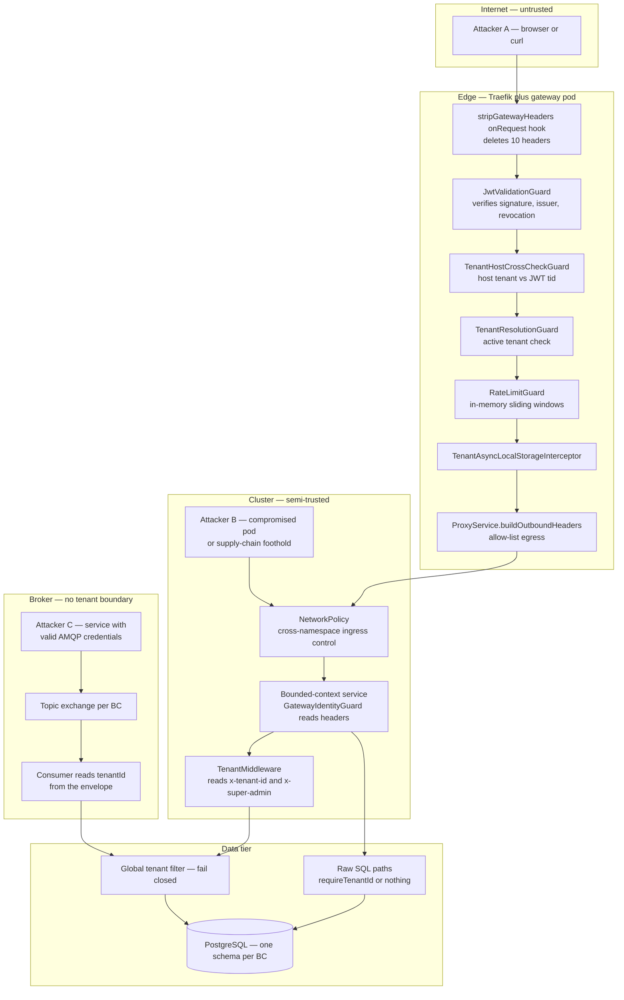
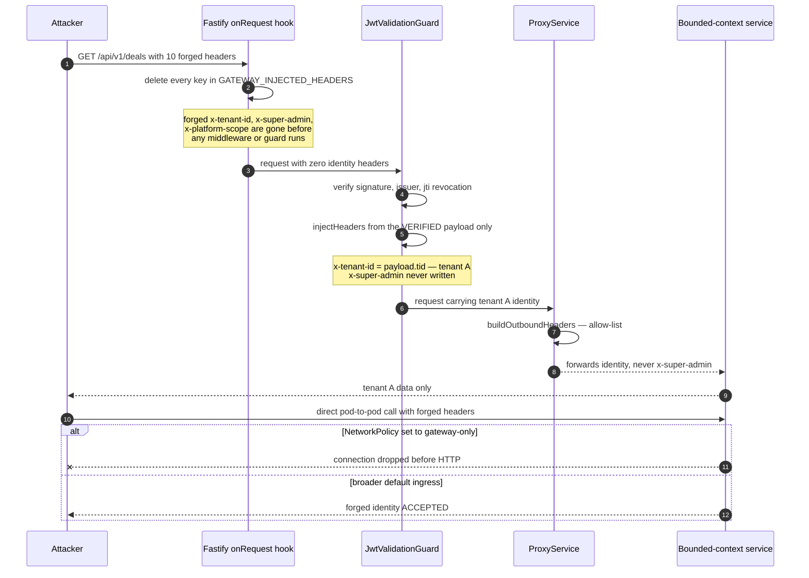
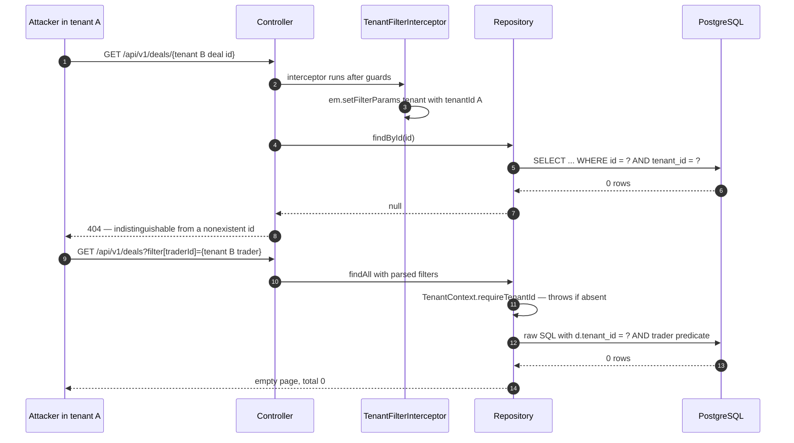
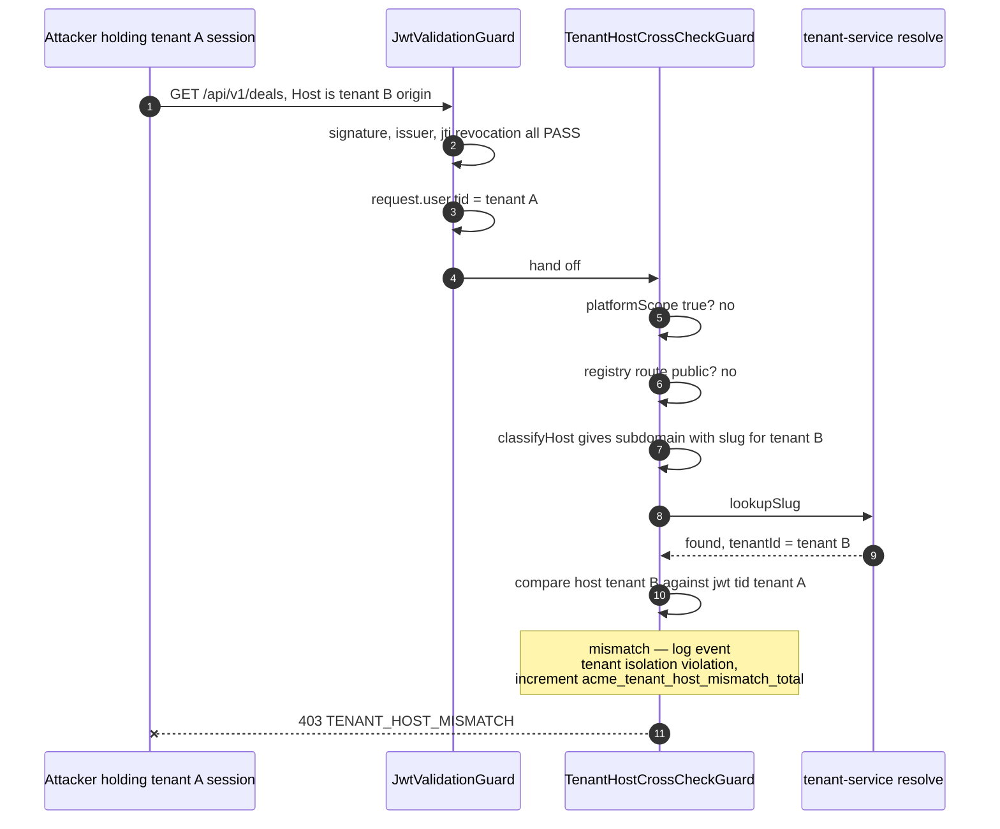
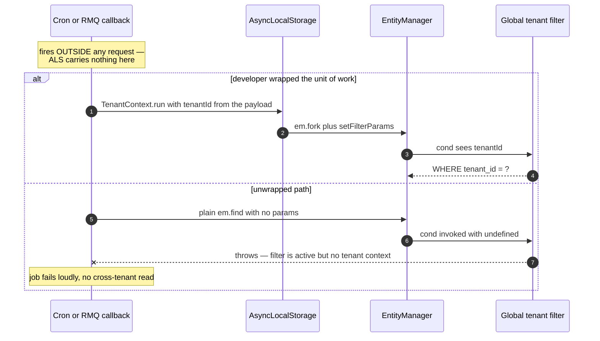
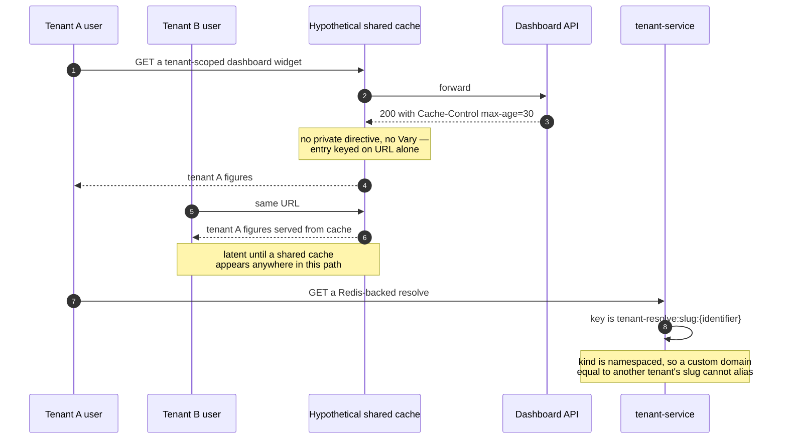
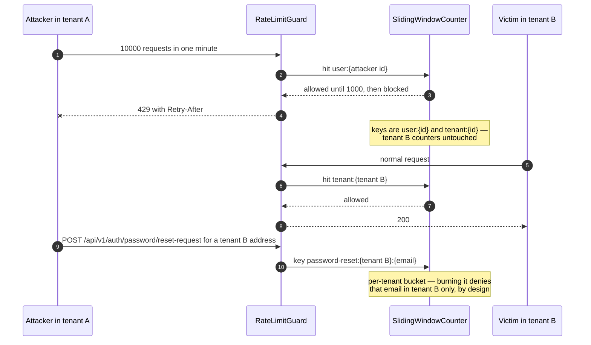
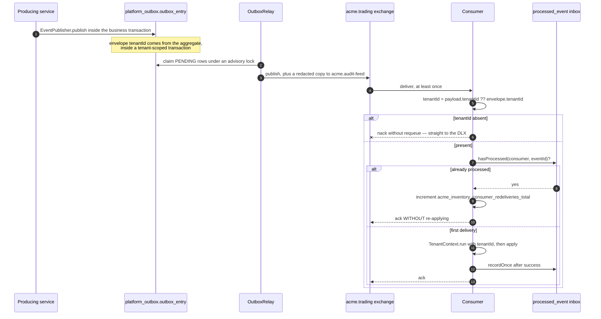
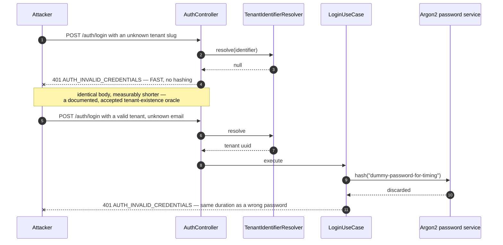
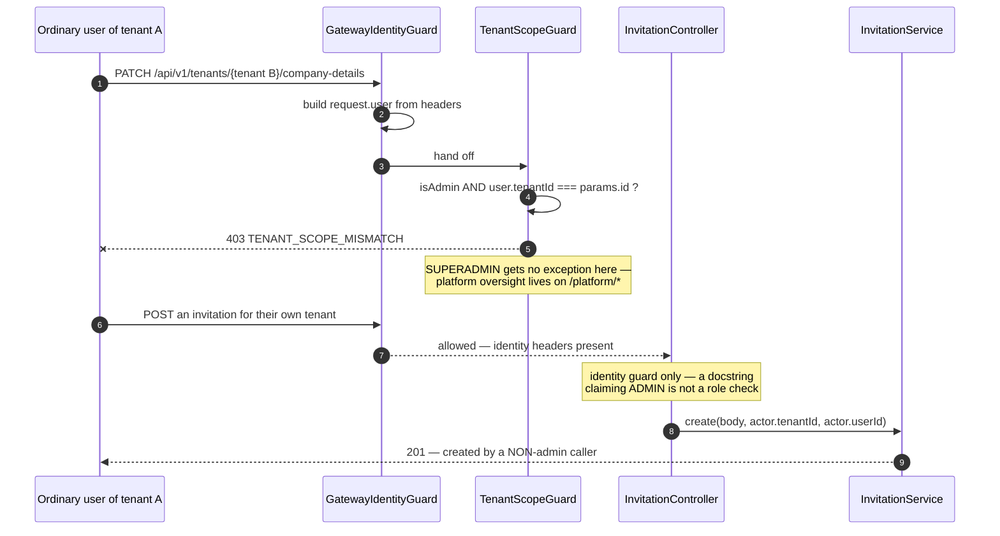

# Isolation Threat Model — the attacker's-eye view

This document answers one question: if you were trying to read or corrupt another tenant's
data in this platform, what would you actually try, and precisely where would it fail? It
walks nine concrete attack paths from the outside in, names the specific file and mechanism
that stops each one, and names the test that proves the control exists — or says plainly
that no such test exists. Read it if you are reviewing a change to the gateway, a guard, a
repository, a consumer, or a NetworkPolicy, and you want to know which line you are about to
move.

Everything below was read from source. Where a control is asserted only by a mock-based test,
or only by a rendered-template assertion, that is said out loud, because an untested control
is a claim rather than a defence. The closing sections state what is genuinely not defended
today — a threat model that concludes everything is fine is a bad threat model.

---

## The map: where the trust boundaries actually are

There are four boundaries that matter, and they are not equally strong.

The **internet edge** is the strongest. Every request arriving at the gateway passes a Fastify
`onRequest` hook that deletes ten specific headers before any framework code runs, then a JWT
guard that re-mints those headers from a cryptographically verified token, then a host-versus-
claim cross-check, then a tenant-status check, then a rate limiter, then an AsyncLocalStorage
interceptor that binds the tenant for the rest of the request.

The **service ingress** is the weakest. A bounded-context service does not verify a JWT. It
reads `x-user-id` and `x-tenant-id` as plaintext, unsigned headers and believes them. The
only thing standing between a rogue in-cluster pod and a full identity forgery is a Kubernetes
NetworkPolicy.

The **data tier** is the last line, and it is genuinely fail-closed: the ORM's global `tenant`
filter throws rather than dropping its `WHERE` clause when no tenant context is present.

The **broker** has no tenant boundary at all. One topic exchange per bounded context carries
every tenant's events; tenancy travels as a field in the event envelope, and RabbitMQ user
permissions are scoped per bounded context, never per tenant.



Three attacker positions are marked. Attacker A is the ordinary case: a signed-up user of
tenant A trying to reach tenant B. Attacker B has already achieved code execution somewhere in
the cluster and is now trying to move laterally between tenants. Attacker C holds one service's
AMQP credentials. The sections below are ordered roughly by how cheap the attempt is.

Each attack path is written the same way: **the goal**, **the attempt**, **what stops it**, and
**the proof**.

---

## Attack 1 — Header forgery

### The goal

Become tenant B by simply asserting it, without ever holding a credential for tenant B.

### The attempt

The identity contract downstream of the gateway is a set of plaintext headers. So the first
thing to try is sending them yourself:

```http
GET /api/v1/deals HTTP/1.1
Host: freshco.acme.example
Authorization: Bearer <valid token for tenant A>
x-tenant-id: 00000000-0000-0000-0000-000000000002
x-user-id: 00000000-0000-0000-0000-00000000000a
x-user-roles: ADMIN,SUPERADMIN
x-permissions: deal:read,deal:update
x-platform-scope: true
x-super-admin: true
x-resolved-tenant-id: 00000000-0000-0000-0000-000000000002
```

Every one of those headers is load-bearing somewhere. `x-tenant-id` seeds the AsyncLocalStorage
scope that the ORM filter reads. `x-super-admin` is read by `TenantMiddleware` in
`libs/platform/mikro-orm/src/lib/mikro-orm.module.ts` and sets `isSuperAdmin` on the tenant store,
which makes `TenantEntityManager` disable the tenant filter outright. `x-platform-scope`
becomes `request.user.platformScope`, which the filter treats as a cross-tenant bypass.

### What stops it

A Fastify `onRequest` hook, registered once in
`apps/platform/gateway/src/fastify/wire-fastify-hooks.ts`, deletes all ten of them — the
`GATEWAY_INJECTED_HEADERS` set — before any NestJS middleware or guard runs. The membership of
that set, and why the strip compares lowercased keys so that a re-cased `X-Tenant-Id` from a
non-conforming upstream proxy is removed too, are set out once in
[`03-propagation.md`](./03-propagation.md) under Carrier 1.

Ordering is the whole control. NestJS runs Fastify hooks before middleware, middleware before
guards, guards before interceptors. `TenantHostResolutionMiddleware` reads the `Host` header and
would happily bind the request to a tenant if a spoofed `x-resolved-tenant-id` had survived; the
hook runs first, so it never sees one.

After the strip, `JwtValidationGuard.injectHeaders` writes the same header names back onto
`request.raw.headers` from the verified JWT payload. Two details matter. First, every value is
`String()`-coerced and passed through a CR/LF/NUL scrubber, so a doctored claim cannot inject an
extra header downstream. Second, `x-correlation-id` is always freshly minted with `randomUUID()`
rather than copied, which removes the "the strip hook must be global, never route-scoped"
invariant from that call site.

`x-platform-scope` is only written when the verified JWT carries `platformScope === true`, as
the fixed literal `'true'`. `x-super-admin` is never written at all.

The final gate is egress. `ProxyService.buildOutboundHeaders` builds the upstream header set
from an allow-list — nothing is forwarded implicitly — and `x-super-admin` is deliberately
absent from every list. `x-platform-scope` is forwarded only when the _already-resolved_
`ServiceRoute` carries `platformScope: true`. That gating detail is the interesting one: the
decision is taken off the same route object that chose the upstream, not off a separately
re-normalised path, so a double-encoded traversal that routes to a business service but
re-parses to a platform path cannot leak the cross-tenant header.

There is a second, weaker variant of this attack: skip the gateway entirely and speak HTTP to a
service pod. `GatewayIdentityGuard` does not verify anything — it reads `x-user-id` and
`x-tenant-id`, throws 401 if either is absent, and otherwise builds `request.user` from whatever
arrived. The compensating control is a Kubernetes NetworkPolicy, and the trust model it encodes
belongs in the template's own comment, where the next person to widen it will read it:

```yaml
# Restricted: ONLY the gateway pod may reach the app port cross-namespace.
# Pod-to-pod forgery hardening — GatewayIdentityGuard trusts gateway-injected
# identity headers without a signature, so non-gateway peers must not reach the
# API. Enable only where the gateway is the sole cross-namespace HTTP caller.
```

That restriction is opt-in per service, and the generalisable hazard is the shape of the chart
rather than any one value. Where inter-service identity is an unsigned header, a Helm value that
ships a broad cross-namespace default and narrows to "gateway pod only" only when a deployer
remembers to set it has turned the authentication boundary into a deployment-time decision.



### The proof

`apps/platform/gateway/src/modules/auth/__tests__/strip-gateway-headers.hook.spec.ts` holds ten
cases, including one per historically-added header and — most usefully — a set-equality
assertion on `GATEWAY_INJECTED_HEADERS` that fails on both shrinkage and unintended additions.
`apps/platform/gateway/test/strip-gateway-headers.integration.spec.ts` wires the real hook through
a real Fastify instance and asserts _"strips BEFORE the JWT guard runs — protected route sees
the JWT-derived tenant, never the spoofed one"_. That integration test exists precisely because
the hook was previously registered inline in `main.ts`, which is never invoked in test mode:
deleting the registration line would have passed every test in the repository.

`apps/platform/gateway/src/modules/proxy/__tests__/proxy.service.spec.ts` covers the egress side
with _"never forwards x-super-admin"_, _"does NOT forward x-platform-scope on a non-platform
route"_, and _"withholds x-platform-scope when a platform-LOOKING path resolved to a
NON-platform route"_.

The NetworkPolicy is covered by a Helm unit test on the gateway-only branch — and that test
asserts the _rendered YAML_. A rendered policy is not an enforced policy: enforcement depends on
the CNI, on namespace labels being present, and on nobody having added a broader rule elsewhere.
Unless something starts a non-gateway pod and proves the connection is actually refused, the
pod-to-pod control is verified as configuration, not as behaviour.

---

## Attack 2 — Insecure direct object reference, in four flavours

### The goal

Read or mutate a specific row belonging to tenant B by naming its identifier, while
authenticated as tenant A.

### The attempt

Four shapes, because four different code paths answer them.

**Path parameter.** `GET /api/v1/deals/<a deal id belonging to tenant B>`. Deal identifiers are
UUID v4 and not guessable, but they leak: into exported CSVs, into event payloads that a
partner integration might see, into support tickets.

**Query filter.** `GET /api/v1/deals?filter[traderId]=<a trader id from tenant B>`. If the
filter is applied without the tenant predicate, this is a cross-tenant search.

**Nested include.** `GET /api/v1/deals/<own deal id>` where the response populates purchases,
sales, line items, haulages, overheads and credit notes. If the filter applies to the root
entity but not to the populated collections, a crafted foreign key would pull foreign rows into
an owned aggregate.

**Bulk endpoint.** `POST /api/v1/deals/lock` with an array mixing owned and foreign deal
identifiers, hoping the batch orchestrator establishes tenant scope once and then loses it, or
reports per-item outcomes precisely enough to confirm the foreign identifiers exist.

### What stops it

For the ORM paths, one mechanism: the global `tenant` filter defined in
`libs/platform/mikro-orm/src/lib/tenant-filter.ts`, registered with `default: true` so MikroORM
applies it to every entity query that does not explicitly disable it. Its `cond` has exactly
three branches and the third is the important one:

```ts
cond: (args?: Partial<TenantFilterArgs>) => {
  if (args?.platformScope === true) return {};
  if (args?.tenantId) return { tenantId: args.tenantId };
  throw new Error(
    `MikroORM 'tenant' filter is active but no tenant context was provided. ` +
      `Disable it for a system/cross-tenant query with { filters: { tenant: false } }, ` +
      `or provide { tenantId } / { platformScope: true }.`
  );
};
```

An empty-string `tenantId` is falsy and falls through to the throw, so `WHERE tenant_id = ''` is
never emitted. The alternative — returning `{}` on missing context — would silently drop the
`WHERE` clause and turn every unscoped query into a cross-tenant read. This is the difference
between a filter that is safe and a filter that is merely present.

Being safe is not the same as enforcing. Something has to set the filter's parameters, and that
is `TenantFilterInterceptor` (`libs/platform/mikro-orm/src/lib/tenant-filter-interceptor.ts`),
registered as a global `APP_INTERCEPTOR` by `ServiceModule.forRoot` whenever MikroORM is
configured — which is all twelve bounded-context services. It reads the per-request
`TenantContext` and calls `em.setFilterParams('tenant', { tenantId })` on the request-scoped
EntityManager. From then on a plain `em.find()` carries `WHERE tenant_id = :tenantId`
automatically. Isolation is the default, not an opt-in.

For a **path parameter**, that means `findOne(Deal, { id })` produces
`WHERE id = ? AND tenant_id = ?` and returns `null` for a foreign identifier. The API then
answers 404, not 403 — an intentional data contract, since 403 would confirm the row exists.

For a **query filter**, the deal list drops out of the entity DSL into raw SQL, because the
derived `LOCKABLE` status needs child-status aggregation the DSL cannot express. Raw SQL bypasses
the ORM filter entirely, so `MikroOrmDealRepository.buildWhere` re-establishes the gate by hand
and fails closed:

```ts
const tenantId = TenantContext.requireTenantId();
conds.push("d.tenant_id = ?");
whereParams.push(tenantId);
conds.push("d.deleted_at IS NULL");
```

`requireTenantId()` throws `MissingTenantContextError` rather than degrading to an unscoped
query, and it treats an empty string as missing. Every user-supplied filter value is then bound
as a positional parameter — `applyTraderFilter`, `applyCustomerFilter`, `applyProductFilter`
each push `?` placeholders — so a foreign `traderId` simply matches nothing. The correlated
sub-queries (`EXISTS (SELECT 1 FROM trading.purchase p WHERE p.deal_id = d.id AND ...)`) do not
repeat the tenant predicate, which is sound because they are correlated to a deal row already
constrained by `d.tenant_id = ?`; it is worth knowing that the safety of those sub-queries is
inherited rather than independent.

There is one deliberate filter-disable on that path. After the raw query produces the page's
identifiers, the entities are hydrated with `{ filters: { tenant: false } }`. The comment states
the reasoning: the identifiers can only have come from the fail-closed query above, and the
`softDelete` filter is deliberately left active as defence in depth so that a regression in the
raw `WHERE` still could not hydrate deleted rows.

For a **nested include**, `findByIdWithChildren` populates seven relation paths through
`TenantEntityManager.findOne`, which forks the EntityManager, seeds the filter parameters, and
passes `filters: { tenant: { tenantId } }`. Because the filter is registered globally with
`default: true` and every child entity extends `TenantBaseEntity`, the same predicate applies to
the populated collections. **Unverified:** no test in the repository specifically asserts that a
populated relation is tenant-scoped; the guarantee follows from the filter being global and
`default: true`, not from a dedicated assertion.

For the **bulk endpoint**, `LockDealBatchUseCase` is explicit about being a non-HTTP
orchestrator and re-establishes the ALS scope for the whole batch:

```ts
return TenantContext.run({ tenantId }, async () => {
  for (const dealId of dealIds) {
    /* per-deal lock, each its own transaction */
  }
});
```

Oversized batches are rejected as a whole _before_ any deal is locked. Per-deal failures are
returned as `{ dealId, status: 'FAILED', errorCode }` — which is an information channel, but the
error code for a foreign identifier is the same not-found code as for a genuinely absent one,
because the repository lookup was tenant-scoped and returned nothing.



### The proof

The strongest evidence is Testcontainers-backed, against real PostgreSQL, and exists in three
services. `apps/platform/trading-service/test/testcontainers/tenant-filter-enforcement.tc.spec.ts`
boots a second ORM configured with the _real_ `tenantFilterDefinition` via `createMikroOrmConfig`
— exactly as the service does at runtime — reproduces the full per-request stack
(`RequestContext.create` then `TenantContext.run` then `interceptor.intercept`) and asserts four
things: tenant A's normal query cannot read tenant B's rows; a cross-tenant fetch **by direct
id** returns `null` under the wrong tenant; a system query reads across tenants only when it
explicitly disables the filter; and, without the interceptor, a plain query **fails closed**
rather than leaking. `apps/platform/auth-service/test/testcontainers/tenant-filter-enforcement.tc.spec.ts`
carries the same four assertions for `Session`, and tenant-service has its own copy.

`libs/platform/mikro-orm/src/lib/__tests__/tenant-filter.integration.spec.ts` covers the `cond`
function's branches directly, including three fail-closed cases: undefined arguments, empty
arguments, and empty-string `tenantId`.

One honest caveat. `libs/platform/mikro-orm/src/lib/__tests__/tenant-isolation.integration.spec.ts`
is named "integration" but its own header says it uses "the real AsyncLocalStorage-based
TenantContext and **mock EntityManagers**". Its nineteen scenarios assert that the right
methods are called with the right filter arguments — a contract test, not a database test. The
`.tc.spec.ts` files above are the ones that actually touch PostgreSQL.

For the bulk path, `apps/platform/trading-service/test/testcontainers/deal-batch-lock.tc.spec.ts`
exercises the batch orchestrator against a real database.

---

## Attack 3 — Token replay across tenants

### The goal

Take a legitimately issued, unexpired, unrevoked session for tenant A and use it against tenant
B's origin — the "borrowed session" attack that hostname-per-tenant designs invite.

### The attempt

Sign in normally at `https://tenant-a.acme.example`, capture the `__session` cookie or bearer
token, then replay it:

```http
GET /api/v1/deals HTTP/1.1
Host: freshco.acme.example
Cookie: __session=<valid, unexpired token minted for tenant A>
```

The token verifies. The signature is good, the issuer matches, the `jti` is not revoked. The
only thing that is wrong is the `Host`.

### What stops it

`TenantHostCrossCheckGuard`
(`apps/platform/gateway/src/modules/tenant-resolution/tenant-host-crosscheck.guard.ts`), registered
as the second global `APP_GUARD`, immediately after `JwtValidationGuard`. It must be a guard and
not middleware: NestJS middleware runs before guards and therefore cannot read the JWT-derived
`request.raw.user.tid` that the JWT guard writes. The codebase already fell into that trap once,
and the file says so.

The decision table it implements:

| Host classification                           | Resolution outcome          | Guard decision                                               |
| --------------------------------------------- | --------------------------- | ------------------------------------------------------------ |
| Any, with `platformScope === true` on the JWT | not consulted               | allowed — checked first, before any comparison               |
| Registry route with `requiresAuth: false`     | not consulted               | allowed — pre-auth, nothing to cross-check                   |
| `apex` or `malformed`                         | no host tenant              | allowed — the JWT `tid` stays the sole source                |
| `subdomain` or `external`                     | `not_found`                 | allowed — no concrete tenant to conflict with                |
| `subdomain` or `external`                     | `error`                     | **403 `TENANT_HOST_UNRESOLVED`** — fail closed               |
| `subdomain` or `external`                     | `found`, differs from `tid` | **403 `TENANT_HOST_MISMATCH`** plus security log plus metric |

The `error` row is the subtle one. When the host _should_ resolve but tenant-service is down or
timing out, the guard denies rather than allowing. Denying during an outage is what prevents a
replayed cross-tenant session slipping through exactly when observability is worst. It uses a
distinct error code and deliberately does **not** increment the mismatch counter, so a
tenant-service outage cannot masquerade as an isolation-violation alert storm.

The mismatch branch emits a structured log with the literal event name `tenant isolation
violation`, the resolved host tenant, the JWT tenant, and the user id, then increments
`acme_tenant_host_mismatch_total`. The attacker-controllable host descriptor is CR/LF-scrubbed
first, so a crafted `Host` cannot forge additional log lines.

Note what the guard deliberately does _not_ do: it never rewrites the downstream `x-tenant-id`.
That header stays sourced from the verified JWT. The guard only compares and rejects, which
keeps services host-blind.

The pre-auth variant of the same attack is the single-sign-on handoff. A one-time code minted at
the apex is redeemed at a tenant origin via `POST /api/v1/auth/handoff/exchange`, a route flagged
`requiresAuth: false` — so the cross-check guard skips it. `ExchangeHandoffCodeUseCase` performs
its own equivalent check: it atomically consumes the code with a Lua `EVAL` (the managed Redis 6.0
offering has no `GETDEL`), then re-reads the session's tenant from the authoritative session record — not
from the code payload — and compares it against the tenant the gateway resolved from the `Host`,
delivered in `x-resolved-tenant-id`. Every failure path throws the identical
`401 HANDOFF_CODE_INVALID` _before a single cookie is built_, so there is no oracle. The cookies
it does build carry no `Domain` attribute, so they are host-only by construction — a
parent-domain session cookie would defeat the whole design.



### The proof

`apps/platform/gateway/src/modules/tenant-resolution/__tests__/tenant-host-crosscheck.guard.spec.ts`
holds ten cases against the real guard, covering every row of the table above: the subdomain
mismatch with its log and metric, the custom-domain mismatch, the matching pair, the SUPERADMIN
exemption on any host, the public-route bypass, the unknown-domain allow, and both fail-closed
`TENANT_HOST_UNRESOLVED` branches (slug resolution error and custom-domain resolution error).

`apps/platform/auth-service/src/modules/auth/use-cases/__tests__/exchange-handoff-code.use-case.spec.ts`
covers the handoff cross-check.

---

## Attack 4 — Background-job leakage

### The goal

Get work to run outside any request, where the AsyncLocalStorage tenant scope is absent, so the
filter is inert and a query reads every tenant.

### The attempt

There is no single HTTP request for this. The attack is to find — or introduce — a code path
that reaches the ORM without a tenant scope, and then get data through it. Candidate paths, all
real in this codebase: a `@nestjs/schedule` cron, a RabbitMQ consumer callback, a queue worker,
an `EventEmitter` listener registered at boot, a `worker_thread`.

### What stops it

The primary control is that the filter's failure mode is a throw, not a silent pass. A
background path that reaches a plain `em.find()` with no filter parameters set does not read
every tenant — it raises the actionable error quoted in Attack 2 and the job fails loudly.

The secondary control is the propagation contract documented at length on `TenantContext`
(`libs/platform/mikro-orm/src/lib/tenant-context.ts`). It enumerates, with sources, exactly what
AsyncLocalStorage carries and what it does not. Propagates: `await` and promise chains, timers,
`process.nextTick`, `queueMicrotask`, libuv I/O callbacks, NestJS interceptor chains, and
`EntityManager.fork()` — the fork is a synchronous object creation inside the calling async
frame, so the store persists across subsequent awaits on it. Does **not** propagate:
`worker_threads` (their own ALS instance), child processes, native callbacks invoked outside
`async_hooks`, scheduler and cron callbacks, and RabbitMQ message handlers, because the consumer
is a long-lived subscriber whose per-message callback fires outside any context.

The `EventEmitter` case is called out because it is routinely misunderstood: `emit()` is
synchronous and listeners run inline in the _emitter's_ async frame, so a plain listener sees the
**emit-time** store, not the registration-time store. A singleton subscriber registered at boot
and fired later from a cron sees whatever context the emit site is in. The stated rule is to wrap
the emit site, not the registration site.

The practical rule the code follows is that every non-request entry point wraps its unit of work.
Verified instances:

| Path                                            | Wrapper                                                             |
| ----------------------------------------------- | ------------------------------------------------------------------- |
| ERP token refresh scheduler, accounting-service | `withTenantContext(token.tenantId, () => this.refreshToken(token))` |
| Trading event consumer, inventory-service       | `TenantContext.run({ tenantId }, ...)` per message                  |
| Trading event consumer, accounting-service      | `TenantContext.run({ tenantId }, ...)` per message                  |
| Trading event consumer, commission-service      | `TenantContext.run({ tenantId }, ...)` per message                  |
| Notification event consumer                     | `TenantContext.run` plus explicit `em.setFilterParams` on the fork  |
| User event consumer, user-service               | `TenantContext.run({ tenantId }, ...)`                              |
| Document generation worker                      | `TenantContext.run({ tenantId: job.tenantId }, ...)`                |
| Invoice-processed consumer, trading-service     | `TenantContext.run({ tenantId }, ...)`                              |
| Batch deal lock orchestrator                    | `TenantContext.run({ tenantId }, ...)` for the whole batch          |

No service currently uses `worker_threads`, which is why the ALS gap there is documented but not
mitigated.

The write side has its own guards, added because a fail-closed _read_ filter cannot help a row
that was written unscoped. `TenantEntityManager.persist` throws `MissingTenantContextError`
without a store at all, `InvalidTenantWriteError` when the context's `tenantId` is empty or
whitespace or when a super-admin write omits an explicit `tenantId`, and `CrossTenantWriteError`
when the entity already carries a _different_ non-empty `tenantId` — a cross-tenant write is
refused rather than silently re-stamped to the current tenant. `remove()` is symmetric.

The database-side control is `TenantSetLocalSubscriber`, which emits
`SET LOCAL app.tenant_id = '<uuid>'` on every transaction start so PostgreSQL row-level-security
policies evaluate against a transaction-scoped setting. It no-ops outside a tenant context, which
means the setting stays NULL and RLS-protected tables become inaccessible — the safe default. It
also no-ops for SUPERADMIN, and the reason is worth recording: the proof-of-concept RLS policy
uses `USING (tenant_id::text = current_setting('app.tenant_id', true))` with no empty-string
bypass branch, so setting the value to `''` would _block_ every row rather than bypass. A
SUPERADMIN end-to-end path therefore still needs either an RLS role grant or a connection role
excluded from RLS. That is captured as an open design item, not shipped.



### The proof

`libs/platform/mikro-orm/src/lib/__tests__/tenant-context-propagation.spec.ts` asserts the
propagation contract itself, including the counter-intuitive `EventEmitter` cases.
`tenant-entity-manager.spec.ts` covers the three write-side error types.
`tenant-set-local.subscriber.spec.ts` covers the transaction-start emission and its no-op
branches. The fail-closed behaviour is proved against real PostgreSQL by the fourth case in each
`tenant-filter-enforcement.tc.spec.ts`: _"WITHOUT the interceptor (no params), a plain query
FAILS CLOSED (throws)"_.

What is **not** proved: there is no repository-wide static check that every scheduler, consumer
or worker entry point is wrapped. The table above was assembled by grep, and a newly added
consumer that forgets `TenantContext.run` would be caught only by the runtime throw — which is a
correctness failure, not a leak, but is caught in production rather than in CI.

---

## Attack 5 — Cache-key collision

### The goal

Get a cached artefact computed for tenant A served to tenant B.

### The attempt

Two shapes. Find a server-side cache whose key omits the tenant, and race to populate it. Or
find a response marked cacheable by a shared intermediary without a tenant-varying key, and
poison it.

### What stops it

Every server-side cache key that was found in source embeds the discriminator:

| Store                       | Key shape                                             | File                                                                       |
| --------------------------- | ----------------------------------------------------- | -------------------------------------------------------------------------- |
| Gateway tenant-status cache | `tenant:{tenantId}`, 60 s TTL                         | `libs/platform/mikro-orm/src/lib/tenant-guard.ts`                          |
| Public tenant resolve cache | `tenant-resolve:{kind}:{identifier}`, 60 s TTL        | `apps/platform/tenant-service/.../resolve-tenant-public.ports.ts`          |
| Trading tenant-config cache | `trading:tenant-config:{tenantId}`                    | `apps/platform/trading-service/.../redis-cached-tenant-config-provider.ts` |
| Password-reset throttle     | `password-reset:{tenantId}:{email}`, 3600 s window    | `apps/platform/auth-service/.../request-password-reset.use-case.ts`        |
| Password-reset token        | `password-reset:{sha256 of token}`                    | same file                                                                  |
| Token revocation denylist   | `revoked:jti:{jti}` and `revoked:session:{sessionId}` | `libs/platform/platform-contracts/src/index.ts`                            |
| Trading idempotency keys    | `UNIQUE (tenant_id, endpoint, key)` in PostgreSQL     | `apps/platform/trading-service/src/common/idempotency/`                    |

Two of these deserve comment. The resolve cache **namespaces by kind**, so a custom domain that
happens to equal another tenant's slug cannot alias into the same entry — the comment in
`resolve-tenant-public.ports.ts` says exactly that. And the revocation keys are _not_
tenant-scoped, which is correct rather than an oversight: `jti` and `sessionId` are UUIDs from a
single global namespace, so there is nothing to collide with.

The idempotency store is the one that would hurt most if it were wrong, because a collision there
would return tenant A's cached _response body_ to tenant B. The table carries an explicit
`tenant_id` column and a three-column unique constraint, and the store pins `tenant_id` in every
`WHERE` clause while passing `{ filters: false }` — the filter is disabled deliberately because
the store must work from a request interceptor, a cross-tenant purge cron, and a test harness
alike, and isolation is guaranteed by the pinned column instead.

The second shape — a shared intermediary — is the one that stays latent right up until it is not.
A tenant-scoped dashboard endpoint that marks its own response cacheable is easy to write and
easy to review past:

```ts
@Get('open-deals')
@Header('Cache-Control', 'max-age=30')
```

`max-age` without `private` licenses a shared cache to store the response, and there is no `Vary`
naming any tenant-discriminating header, so the entry is keyed on the URL alone. Nothing goes
wrong while no shared HTTP cache sits in that path — a reverse proxy that does not cache by
default, or a service with no public route, will both hide it indefinitely. The day someone
inserts a caching proxy or a CDN in front of that service the header converts a private figure
into a cross-tenant read, and the change that caused it lives in a different repository from the
bug. The correct header on any tenant-scoped response is `private, max-age=30`.



### The proof

`apps/platform/trading-service/test/testcontainers/idempotency-key.tc.spec.ts` exercises the
idempotency store against real PostgreSQL, and the entity carries the composite unique constraint
`idempotency_key_scope_unique` on `(tenantId, endpoint, key)`, so the database itself enforces it.
The resolve cache namespacing is covered by the tenant-service resolve tests.

There is **no** test asserting the absence of a tenant-agnostic cache key anywhere, and **no**
test asserting that tenant-specific responses are not marked publicly cacheable. Both of those
are grep-and-review controls today.

---

## Attack 6 — Rate-limit starvation

### The goal

Deny service to another tenant by exhausting a counter you share with them.

### The attempt

Find a limiter whose key omits the tenant and hammer it. The two most attractive targets are
password reset (exhaust a victim's quota so they cannot recover an account) and any per-endpoint
counter (exhaust a hot endpoint for everyone).

### What stops it

The gateway limiter in `apps/platform/gateway/src/modules/rate-limit/rate-limit.guard.ts` runs three
tiers, in order, all with the discriminator in the key:

```ts
const userResult = this.perUserCounter.hit(`user:${userId}`, nowMs);
const tenantResult = this.perTenantCounter.hit(`tenant:${tenantId}`, nowMs);
const endpointKey = `endpoint:${method}:${path}:${userId}`;
```

Defaults are 1 000 per user per minute, 10 000 per tenant per minute, 100 per endpoint per user
per minute. The per-endpoint key includes `userId`, so it is per-user-per-endpoint and cannot be
exhausted on someone else's behalf. Unauthenticated callers fall back to `anon:{clientIp}` for
both the user and tenant identity, which keeps anonymous traffic out of any real tenant's bucket.

Ordering matters here too: the guard is registered after `JwtValidationGuard` and
`TenantResolutionGuard`, so `x-user-id` and `x-tenant-id` are the JWT-derived values by the time
it reads them, not client-supplied ones. If it ran first it would be keying off forged headers.

The password-reset limiter was made tenant-scoped deliberately, and the comment records the exact
reasoning:

```ts
// Rate limit check (3/hour per tenant+email). The tenantId is part of the key so
// that an email registered in two tenants gets an independent bucket per tenant —
// otherwise one tenant's traffic could exhaust another tenant's user's reset quota.
const key = `password-reset:${tenantId}:${email.toLowerCase()}`;
```

Two limiters are genuinely global by design, and both are apex-scoped pre-auth surfaces where a
tenant does not yet exist. Workspace discovery uses `discovery-ip:{ip}` at 10 per minute and
`discovery:{email}` at 3 per hour; the public tenant resolve and the slug-availability check use
`tenant-resolve-ip:{ip}` and `slug-available-ip:{ip}`, both 60 per 60 seconds. The
`discovery:{email}` bucket is a real cross-tenant denial vector: an attacker who knows a victim's
address can burn all three hourly slots and prevent that person receiving their workspace links,
regardless of which tenants they belong to. That is an accepted trade — the alternative, keying
by tenant, is impossible on a route whose whole purpose is "I do not know which tenant I am in".

The counters are **in-memory**, per pod. `SlidingWindowCounter` is a `Map` of key to timestamp
array, pruned lazily on every `hit()` and swept every two windows by an `unref`'d interval. Two
consequences follow directly. The effective limit is the configured limit multiplied by the pod
count, since a load balancer spreads a burst across replicas. And a rolling restart resets every
window to zero.

The pre-auth limiters that _are_ Redis-backed fail **open**. `ResolveTenantPublicUseCase` catches
any limiter error, logs a warning, and proceeds:

```ts
} catch (error) {
  // Fail-open — degrade to a direct read, never 503.
  this.logger.warn(`resolve rate limiter unreachable — failing OPEN ...`);
  return;
}
```

That is a deliberate availability choice — a Redis blip must not 503 the sign-in branding path —
and the warning exists because the previous silent version hid a real incident. During a Redis
outage the only abuse control on those pre-auth routes is absent.



### The proof

`apps/platform/gateway/src/modules/rate-limit/__tests__/rate-limit.guard.spec.ts` has ten cases,
including the 1 001st per-user request, the 10 001st per-tenant request, the 101st per-endpoint
request, and — the isolation-relevant one — _"Per-endpoint rate limit — counter is isolated per
endpoint"_. There is **no** test asserting that tenant A's traffic cannot exhaust tenant B's
bucket; that property follows from reading the key construction, not from an assertion. There is
also no test covering the multi-pod behaviour, because the counter is per-process by
construction.

---

## Attack 7 — Event-consumer cross-delivery

### The goal

Get a consumer to apply an event carrying tenant A's data to tenant B's rows.

### The attempt

Publish an event whose envelope and payload disagree about the tenant, or replay a captured event
against a consumer, or flood a queue so that redelivery re-applies effects.

### What stops it

Start with what does _not_ stop it: the broker. There is one topic exchange per bounded context —
`acme.trading`, `acme.identity`, `acme.platform`, `acme.inventory`, and so on — plus a
cross-cutting `acme.audit-feed` fanout. There is no per-tenant exchange, queue, vhost or routing
key. RabbitMQ permissions in `charts/platform-rmq-bootstrap/values.yaml` are per bounded context and
per service user, expressed as regular expressions:

```yaml
- name: trading
  username: trading_user
  permissions:
    configure: '^(acme\.trading(\..*)?|trading-service\..*)$'
    write: '^(acme\.trading(\..*)?|acme\.audit-feed(\..*)?|trading-service\..*)$'
    read: '^(acme\.(trading|platform|identity|accounting)(\..*)?|trading-service\..*)$'
```

Those constrain _which exchanges_ a service may touch. They say nothing about which tenant an
event may claim. A service that can write to `acme.trading` can publish a `trading.deal.locked`
event naming any tenant it likes.

What stops the attack at the boundary is that no external party can publish. Domain events are
never published directly — `EventPublisher.publish` only writes an `OutboxEntry` row inside the
caller's transaction, and a separate `OutboxRelay` polls `platform_outbox.outbox_entry` and
publishes. The `tenantId` in the envelope therefore originates from the aggregate that produced
it, inside a tenant-scoped transaction. Reaching the broker requires either AMQP credentials or
code execution inside a service.

On the consuming side, every consumer establishes tenant scope from the message before touching
the ORM. The inventory consumer is representative:

```ts
const event: DomainEvent = JSON.parse(msg.content.toString());
const tenantId =
  (event.payload as { tenantId?: string })?.tenantId ?? event.tenantId;

if (!tenantId) {
  this.logger.error(
    `Event ${event.eventId ?? "unknown"} missing tenantId — rejecting to DLX`
  );
  channel.nack(msg, false, false);
  return;
}

await TenantContext.run({ tenantId }, async () => {
  await this.dispatch(event);
});
channel.ack(msg);
```

A tenant-less message is dead-lettered rather than processed, which is the right fail-closed
behaviour. But note the precedence: **`payload.tenantId` wins over `event.tenantId`**, and nothing
compares the two. The accounting, commission and document consumers use the identical expression.
If a producer ever emitted an envelope tenant that disagreed with its payload tenant, the consumer
would silently follow the payload. That is a defence-in-depth gap rather than an exploitable one
today, because both fields are written by the same trusted producer — but it is a gap, and a
one-line equality check would close it.

Replay and redelivery are handled by the inbox. `withInbox`
(`apps/platform/inventory-service/src/stock/inbox/with-inbox.ts`) keys a dedup ledger on
`(consumer, eventId)` and records the row **after** a successful `apply()`, never before:

```ts
if (await inbox.hasProcessed(consumer, eventId)) {
  recordConsumerRedelivery(consumer, eventType);
  return false;
}
await apply();
await inbox.recordOnce(consumer, eventId);
```

The ordering is deliberate and documented. Because inventory's handlers persist through
per-operation forked EntityManagers, a single transaction cannot span both the inbox insert and
every stock write, so recording after success keeps the ledger a truthful "already applied"
record. A crash between the two simply re-runs `apply()`, which is safe because every handler is
independently idempotent — the `stock_movement.event_id` unique index is the per-effect dedup.
Recording _before_ would be the classic "mark processed, then lose the state change" hazard.

`MikroOrmProcessedEventRepository` gives exactly-one-winner semantics through two independent
layers: a synchronous in-process reservation `Set` that closes the window between two concurrent
calls _before any await_, and the database composite primary key, whose violation is caught and
reported as a duplicate rather than rethrown.

`ProcessedEvent` is deliberately **not** a `TenantBaseEntity` — its identity is
`(consumer, event_id)` and it carries no tenant-owned data. That forces both of its reads to pass
`{ filters: false }`, because the consumer path forks a raw EntityManager and never seeds filter
parameters, so the fail-closed filter would otherwise throw. This is a legitimate, documented
exemption; it is also exactly the kind of exemption that must be reviewed whenever it is copied.



### The proof

`apps/platform/inventory-service/test/testcontainers/consumer-inbox-redelivery.tc.spec.ts` proves the
dedup behaviour against real PostgreSQL. `libs/platform/event-bus/test/outbox-relay.tc.spec.ts`
covers the relay's claim-and-publish cycle, and
`libs/platform/event-bus/test/routing-key-versioning.tc.spec.ts` covers versioned routing.

What is **not** tested: nothing asserts that `payload.tenantId` and `event.tenantId` agree, and
nothing asserts that a consumer refuses an event whose tenant does not exist or is suspended. A
message naming a valid-looking but foreign tenant would be processed under that tenant's scope.
The control that makes this acceptable is that only trusted services can publish — which is a
network and credential control, not a message-level one.

---

## Attack 8 — Enumeration via error and timing differences

### The goal

Learn which tenants exist, and which email addresses exist inside them, without holding a single
valid credential.

### The attempt

Send login attempts and reset requests with varied tenant identifiers and email addresses, and
measure two channels: the response body and status, and the elapsed time.

```http
POST /api/v1/auth/login
{ "tenantId": "freshco", "email": "someone@initech.example", "password": "x" }
```

Vary `tenantId` over a wordlist. Then, having found a tenant that behaves differently, vary
`email`.

### What stops it — and what deliberately does not

The **email-within-a-tenant** channel is closed hard. `LoginUseCase` runs a dummy Argon2 hash on
every rejection branch so that timing does not distinguish them:

| Branch                                                | Response                  | Timing equalised? |
| ----------------------------------------------------- | ------------------------- | ----------------- |
| No such user                                          | `InvalidCredentialsError` | yes — dummy hash  |
| User exists but `isActive` false                      | `InvalidCredentialsError` | yes — dummy hash  |
| User exists but has no password (single-sign-on only) | `InvalidCredentialsError` | yes — dummy hash  |
| Credential row missing                                | `InvalidCredentialsError` | yes — dummy hash  |
| Wrong password                                        | `InvalidCredentialsError` | real hash verify  |
| Account locked                                        | `AccountLockedError`      | no                |

The single-sign-on-only branch is the subtle one: without the equaliser, "this address exists but
authenticates elsewhere" would be distinguishable from "this address does not exist". The account
-locked branch is intentionally distinguishable, because a user who has locked themselves out
needs to be told.

Password reset closes the same channel by construction: the use case always returns the same
shape, whether or not the address resolves.

Workspace discovery is the most carefully built of the three. `DiscoverWorkspacesUseCase` returns
the byte-identical `{ status: 'accepted' }` for every input, and its ordering is described in the
source as load-bearing: rate limits are evaluated **first**, before any membership lookup, so a
throttled request never touches — and never times differently against — the membership store.
Then a constant-work tail always calls the lookup exactly once and the notifier exactly once, for
zero, one or many memberships. There is no early return and no existence branch; the notifier
fires even for an empty list. The mailbox is the only channel that ever reveals membership.

The **tenant-existence** channel is deliberately left open, and the code says so:

```ts
// An unknown tenant yields the SAME generic InvalidCredentials RESPONSE as a wrong password.
// This branch is deliberately NOT timing-equalised (no dummy hash): tenant existence is not a
// confidential fact — the SSO flow already discloses it for any slug, and slugs are effectively
// public (company subdomains). The secret that IS protected — email-within-a-valid-tenant
// enumeration — stays fully equalised inside LoginUseCase, which only runs once a tenant resolves.
const tenantId = await this.tenantIdentifierResolver.resolve(body.tenantId);
if (tenantId === null) throw new InvalidCredentialsError();
```

So: the _response_ is identical, but an unknown tenant short-circuits before any Argon2 work,
which makes it measurably faster. This is a documented, reasoned acceptance rather than an
oversight — but it is an oracle, and it should be recorded as one.

Two endpoints disclose tenant existence outright, by design, with throttling as the only control.
`GET /api/v1/public/tenants/resolve` returns a strict whitelist for a known slug or domain — slug,
display name, three branding fields, an SSO-enabled boolean, an SSO provider label, and a status —
and 404 for an unknown or soft-deleted one. The whitelist is built field by field from getters,
never by spreading the entity, so no future column can silently ride along, and a `DELETED` tenant
is indistinguishable from a nonexistent one. `GET /api/v1/public/tenants/slug-available` returns
exactly `{ slug, available }` and nothing else; the source calls out that any additional field
would turn it into a tenant-existence oracle. Both are limited to 60 requests per 60 seconds per
IP, and both fail **open** if Redis is unreachable.



### The proof

`apps/platform/auth-service/test/auth.integration.spec.ts` contains _"SSO-only user attempting
password login is rejected with the generic InvalidCredentialsError (no enumeration oracle)"_.
`apps/platform/auth-service/test/tenant-slug-login.spec.ts` contains _"rejects an unknown tenant slug
as a generic 401 and never reaches the login use-case"_ and _"is a silent no-op on password
reset-request for an unknown tenant (same 200, no leak)"_.
`discover-workspaces.use-case.spec.ts` has a dedicated block _"enumeration safety — unregistered
email is indistinguishable from registered"_, including a timing-envelope case that compares
medians rather than asserting absolute wall-clock.

There is **no** unit test for `LoginUseCase` itself — no file matching that name exists under
`use-cases/__tests__/`. Its branches are covered indirectly through the integration spec and the
single-sign-on mandate spec. The dummy-hash timing equaliser on the "no such user", "inactive
user" and "missing credential" branches is therefore asserted only for the single-sign-on branch;
the other three are code-review controls today. There is likewise **no** test asserting that the
unknown-tenant path is faster — that is the accepted oracle, so nothing guards against it being
accidentally closed or widened.

---

## Attack 9 — Provisioning-flow abuse

### The goal

Get an account inside a tenant you were never invited to, or manipulate another tenant's
onboarding.

### The attempt

Three shapes. Accept an invitation token you did not receive. Call an admin-only invitation
endpoint as an ordinary user of the same tenant. Call a tenant-scoped configuration or onboarding
endpoint with someone else's tenant identifier in the path:

```http
PATCH /api/v1/tenants/00000000-0000-0000-0000-000000000002/company-details
x-tenant-id: 00000000-0000-0000-0000-000000000001
x-user-roles: ADMIN
```

### What stops it

The **path-identifier** shape is closed by `OwnTenantAdminGuard`
(`apps/platform/tenant-service/src/common/guards/own-tenant-admin.guard.ts`), whose rule is stated in
one line of code and one line of comment:

```ts
const isAdmin = roles.includes("ADMIN");
// Session tenant vs URL tenant — the URL `:id` is never the auth source.
const ownsTenant = user.tenantId === request.params.id;
if (isAdmin && ownsTenant) return true;
throw new ForbiddenException(this.denialCode);
```

Three properties are worth naming. Role matching is case-sensitive, so a crafted lowercase
`admin` does not satisfy it. There is **no** cross-tenant exception for SUPERADMIN — a
platform-scoped session acting on a foreign tenant through these routes is denied exactly like
anyone else, because platform oversight lives on `/api/v1/platform/*` behind `PlatformScopeGuard`.
And the denial code is a stable, internal-detail-free string. Two subclasses exist solely to carry
different codes — `TenantScopeGuard` with `TENANT_SCOPE_MISMATCH` for the configuration routes and
`OnboardingAccessGuard` with `ONBOARDING_ACCESS_DENIED` for onboarding — so the authorization
logic is defined once.

The **invitation-token** shape is closed by the token itself. Tokens are `randomUUID()` values;
only their SHA-256 hex is persisted in `identity.invitation.token` and only the hash is ever
queried, so a database read never exposes a usable token. `POST /api/v1/invitations/accept` is
public by design — an invited user has no session yet — and the registry entry for it precedes the
general `/api/v1/invitations` entry so that only `/accept` is opened while list, create, resend and
revoke stay authenticated. Acceptance validates expiry (72 hours) and status inside a single
transaction, and the tenant is taken from the invitation record, never from the request.

`MikroOrmInvitationRepository` is worth pausing on, because it disables the tenant filter on
_every_ read:

```ts
const NO_TENANT_FILTER = { filters: { tenant: false } } as const;

async findById(id: string, callerEm?: EntityManager): Promise<Invitation | null> {
  return (callerEm ?? this.tem.getEntityManager()).findOne(Invitation, { id } as never, NO_TENANT_FILTER);
}
```

That is necessary — `findByToken` runs on a public route with no tenant context, and
`findExpiredPending` is a deliberate cross-tenant sweep for the expiry job — but it means the data
tier provides **no** isolation for invitations. The compensating control is an explicit ownership
check in the application layer, present in both mutating paths:

```ts
const invitation = await this.invitationRepo.findById(invitationId, em);
if (!invitation || invitation.tenantId !== tenantId) {
  throw new ValidationException("Invitation not found", {
    errorCode: "INVITATION_NOT_FOUND",
  });
}
```

The two failure modes collapse to one message and one code, so a foreign identifier is
indistinguishable from a nonexistent one. This is the correct pattern, and it is also fragile: any
new method added to that repository inherits the disabled filter and must remember to re-check
ownership by hand.

The **first-admin** invitation, created from the `platform.tenant.created` event, is the most
interesting path because it runs outside a request. The consumer forks an EntityManager, sets the
tenant filter parameters, runs under `TenantContext.run`, and threads that fork through as
`callerEm`. It resolves the first-admin role **by name**, always `ADMIN`, never `SUPERADMIN`, and
bypasses the `maxUsers` gate because the first seat of a new tenant is always allowed. Idempotency
is two-layered: a read-side check-then-act fast path, plus a partial unique index on
`(tenant_id, email) WHERE status = 'PENDING'` that closes the race at commit — the loser's unique
violation is caught and returns `null` rather than dead-lettering the message or producing a
duplicate invited user.

`InvitationService.create` also refuses to assign `SUPERADMIN` through an invitation, throwing
`SUPERADMIN_NOT_ASSIGNABLE`.

Now the failure mode this shape invites. A controller docstring that says "Auth: ADMIN role
required" is not a control. Where authorization attaches per controller rather than through a
global default-deny guard, "the comment says ADMIN" and "the code enforces ADMIN" drift apart
silently: an identity guard that establishes only _who_ the caller is reads, at a glance, exactly
like one that establishes _what they may do_, and no test fails, because no code refuses anyone.
On an invitation surface the blast radius of that drift is _within-tenant_ privilege escalation
rather than an isolation failure — the ownership checks above still confine every path to the
caller's own tenant — but it is still a way to hand yourself an ADMIN-role colleague.



### The proof

`apps/platform/tenant-service/src/modules/tenant/guards/__tests__/tenant-scope.guard.spec.ts` has nine
cases including _"denies a SUPERADMIN acting on a foreign tenant"_, _"matches roles
case-sensitively"_ and _"denies an authenticated user with no roles at all (403), not a 500"_.
`onboarding-access.guard.spec.ts` has eleven cases, including the core regression guard _"ADMIN of tenant
A cannot complete a step for tenant B"_ and _"`:id` is never trusted as the authorization
source"_.

For an absent roles check there is, by construction, nothing to cite. A negative — "a non-admin is
refused" — can only be asserted where some code does the refusing, so the missing control produces
no failing test, no red line in coverage and no gap in the suite. That asymmetry is precisely why
missing authorization survives a test-coverage review, and why the search that finds it is a search
for guard registrations rather than a test run.

---

## Residual risk

Stated without euphemism.

**Inter-service identity headers are unsigned.** A gateway that mints identity and passes it
downstream as request headers — caller identity, tenant, roles, permissions, platform scope —
sends all of it as plaintext with no signature, MAC or mutual TLS, and the service-side identity
guard has no way to do anything but believe it. The decision record that introduced the last of
those headers states the dependency in its own trust note: the headers are trusted _because_ the
network policy makes the gateway the only pod that may reach a bounded-context service, with
signing or mesh mTLS recorded as the durable follow-on. Writing the dependency down where the
decision lives is what stops it being rediscovered later as a surprise.

**The compensating network control is only as good as its rollout.** Where inter-service identity
is an unsigned header, the network policy _is_ the authentication boundary — so a policy applied
per namespace, per chart or per service is a boundary that can be partially present, and a partial
rollout silently reduces the platform to its weakest-configured service. A control whose scope is
a deployment property and whose failure is silent needs a behavioural test, not a manifest review.

**A forgeable header can survive at the data tier after the edge strips it.** Where the gateway
deletes a privilege-asserting header at ingress and never forwards it, that header is unreachable
from outside — but a middleware deeper in the stack that still reads the same name keeps a second,
weaker path to the same privilege, and its safety is now a property of a layer it does not import.
Derive privilege from the verified token, never from a header that some other layer happens to
strip: defence in depth must not mean two half-controls, one of which is weaker than the other.

**Guard attachment is opt-in per controller.** Some controllers are deliberately pre-auth, public
or internal. Others lean entirely on the ALS tenant scope for isolation and perform no per-user
authorization: isolation between tenants holds on those routes, and authorization within a tenant
does not exist on them. The two groups cannot be told apart by reading the code — where
authorization is opt-in per controller, a deliberate omission and a forgotten one look identical,
so no audit of the source can say which is which. That is the argument for a global guard with an
explicit, decorated opt-out: it does not add a control, it converts the exceptions into a list.

**Per-method permission decorators leave reads unguarded by default.** Where a permission decorator
is attached method by method to mutating endpoints only — usually to avoid disturbing the behaviour
of existing reads — every read endpoint on that controller stays readable by any authenticated user
of the tenant, whatever their role. The omission is deliberate at the time and indistinguishable
from an oversight a year later.

**Consumers do not cross-check the envelope tenant against the payload tenant.** Both are producer-
controlled, and payload wins. A producer bug that disagreed with itself would be applied silently.

**The broker has no tenant dimension.** Broker permissions are granted per bounded context,
because that is the granularity an exchange-per-context topology offers. Tenancy lives in the
message body, so publish rights on an exchange are rights to name any tenant on it — the broker
cannot enforce a dimension it cannot see.

**A tenant-scoped response marked publicly cacheable is latent cross-tenant disclosure.** A
`max-age` with no `private` and no `Vary` licenses any shared cache to hand one tenant's figures to
the next caller of the same URL. The hazard arrives with the first proxy or CDN placed in front of
the service, not with the header — which is what makes it a trap rather than a bug.

**A pipeline that reads request properties nothing populates is fail-closed only by accident.**
Where a controller reads `req.tenantId`, `req.userId` or `req.userRole` but its service registers
no middleware and no guards to set them, the likely runtime outcome is a 403 from a role check
comparing against `undefined`, or a `NOT NULL` violation at the database on write. Both refuse the
request, and neither is a control: an accident can be fixed by someone tidying up the very code
that was holding the door shut.

**A rate limiter backed by a shared cache fails open.** A pre-auth limiter that keeps its counters
in Redis has to decide what to do when Redis errors, and the availability-preserving answer — let
the request through, log a warning — means the abuse control on the pre-auth surface is a function
of cache health. It is a defensible choice, but it should be made explicitly and monitored, not
inherited from a `catch` block: the outage that removes the limiter is also the outage during
which somebody is most likely to be probing.

**Tenant existence is enumerable, by design.** Any surface that answers "does this tenant exist"
before authentication — resolution, availability checks, federated sign-in, and the timing
difference between a login against a known and an unknown tenant — is an enumeration oracle. The
reasoning for accepting it, that tenant slugs are effectively public subdomains, is recorded in
source and is sound. It is worth accepting deliberately rather than by omission, and the timing
difference is the part of it an auditor will flag, because it is the one nobody chose.

**A `SET LOCAL` with no policy behind it is an emitted variable, not a control.**
`TenantSetLocalSubscriber` emits the session setting on every tenant-scoped transaction, but a
super-admin path that deliberately skips it, combined with a policy carrying no role-based bypass,
would deny a platform-scoped connection every row rather than grant it. Count only the layers you
have proved: the database tier is enforcement once a policy exists, is migrated, and has a bypass
story for the roles that legitimately cross tenants — and not before.

**A suite named "integration" can still be mock-based.** The isolation suite that reads like the
headline proof asserts that the right methods were called with the right filter arguments — a
contract test. The real proof lives in the Testcontainers specs that touch PostgreSQL, and those
exist for some services and not others. A name is not a guarantee about what a test touches.

**Populated relations are not explicitly tested for tenant scoping.** The guarantee follows from
the filter being global with `default: true`; no assertion pins it.

---

## If you are hardening this next

In a platform of this shape — a gateway that mints identity, services that trust it, one global
ORM filter underneath, and a broker with no tenant dimension at all — the same handful of
questions decide whether the model holds. None of them is ordered above the others, because which
one bites first depends entirely on which control your deployment happens to be missing.

**Assert refusal behaviourally, not by rendered YAML.** A NetworkPolicy unit test proves the
manifest says what you meant. Enforcement depends on the CNI, on namespace labels being present,
and on nobody having added a broader rule elsewhere. A smoke test that curls a service port from a
non-gateway pod and expects a timeout converts a configuration claim into a behavioural one, and
it is the only kind of test that notices when the boundary quietly stops existing.

**Derive super-admin from the verified token, never from a header.** If a privilege can be
asserted by a header, then every layer that forwards or fails to strip that header is part of the
control. Reading it once, from the token, at the point where the request's identity is
established, collapses that surface to a single place — and makes the network policy a second line
of defence rather than the only one.

**Sign the identity headers, or adopt mesh mutual TLS.** This is the durable fix for the trust
model the network control merely fences off. It costs more than a values-file change and buys
something the values file cannot: a receiving service that can prove for itself that the caller was
the gateway. Everything else on this list is a way of surviving until that exists.

**Cross-check the envelope tenant against the payload tenant in every consumer.** One equality
check, in one shared helper, applied wherever a message carries tenancy in two places. It converts
a producer bug from a silent cross-tenant write into a dead-lettered message, and it closes the
only point in the event path where two sources of tenancy are free to disagree.

**Lint the deliberate filter-disables, and pin the populated relations with an assertion.** Every
`{ filters: false }` in a healthy codebase is justified in a comment; a rule that requires an
accompanying explicit tenant predicate, or an inline exemption marker, keeps it that way as the
codebase grows and catches the by-primary-key repository pattern being copied without its
compensating ownership check. The relation case is the same argument in test form: a guarantee
that follows from a filter being global and default-on is a guarantee no assertion currently pins.

---

## Where this connects

This deep-dive is the adversarial reading of the multi-tenancy model. Its siblings in
[this folder](./) describe the same machinery constructively — what it is and how it resolves —
where this one asks only what breaks it.

- [`01-tenant-model.md`](./01-tenant-model.md) — what a tenant _is_ as rows and columns, the four
  handles that identify one, the tenant-exempt entity set, and the provisioning paths that
  Attack 9 probes.
- [`02-resolution.md`](./02-resolution.md) — how a request finds its tenant: host classification,
  the resolve cache, the `x-resolved-tenant-id` set-and-strip contract, and the precedence rules
  that Attacks 1 and 3 attempt to subvert.

The survey documents this one goes beneath:

- [`backend/04-authn-authz.md`](../../backend/04-authn-authz.md) — the JWT, JWKS, revocation and
  multi-factor flows whose guarantees Attacks 1, 3 and 8 assume and test.
- [`backend/03-data-architecture.md`](../../backend/03-data-architecture.md) — the fail-closed ORM
  filter, the tenant-exempt entities, and the 404-not-403 data contract that Attack 2 relies on.
- [`backend/06-caching.md`](../../backend/06-caching.md) — the Redis key and TTL strategy behind
  Attack 5's key table.
- [`backend/05-messaging.md`](../../backend/05-messaging.md) — the outbox, relay and consumer
  machinery that Attack 7 walks.
- [`backend/01-service-anatomy.md`](../../backend/01-service-anatomy.md) — the `ServiceModule`
  bootstrap that registers `TenantFilterInterceptor` globally, and the guard-per-controller pattern
  whose gaps the residual-risk section names.
- [`platform/integration-patterns.md`](../../platform/integration-patterns.md) and
  [`platform/event-catalog.md`](../../platform/event-catalog.md) — the asynchronous surface where
  tenancy travels in an envelope field rather than a header.
- [`00-system-context.md`](../../00-system-context.md) and
  [`01-container-view.md`](../../01-container-view.md) — where the four trust boundaries sit in the
  system as a whole.

Adjacent deep-dives worth reading alongside Attack 7:
[`../events/03-the-life-of-one-event.md`](../events/03-the-life-of-one-event.md),
[`../rabbitmq/01-topology.md`](../rabbitmq/01-topology.md) and
[`../rabbitmq/03-consuming.md`](../rabbitmq/03-consuming.md).

The decisions this reading leans on, cited by what they decided rather than by number: the
platform-scope claim, its header-propagation invariants and its note that identity headers are
unsigned and trusted via the network boundary; hostname-based tenant resolution, which is what
makes a host-versus-claim cross-check necessary in the first place; single-sign-on session handoff
through a one-time code, the source of the pre-auth cross-check and the host-only cookies;
pre-auth tenant-slug resolution, which defines the login tenant-identifier path and its accepted
existence oracle; the inbox, idempotency-key and parked-message tables that give consumers their
dedup ledger; and the current-user read model, which is why a multi-factor header sits in the strip
set at all.
