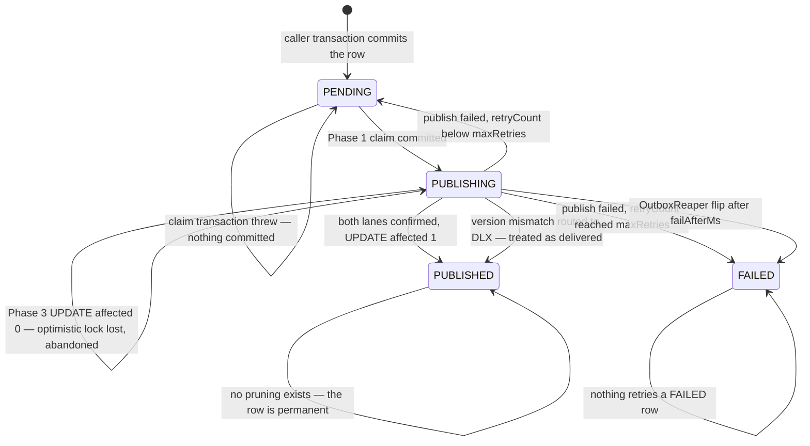
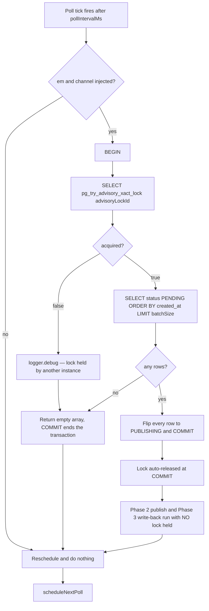
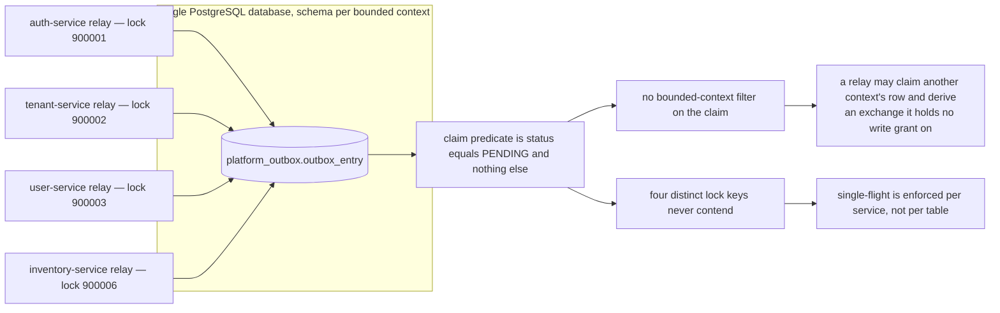
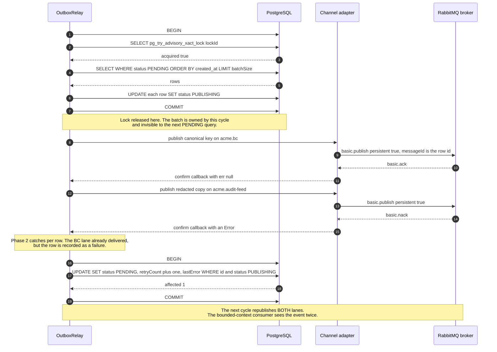
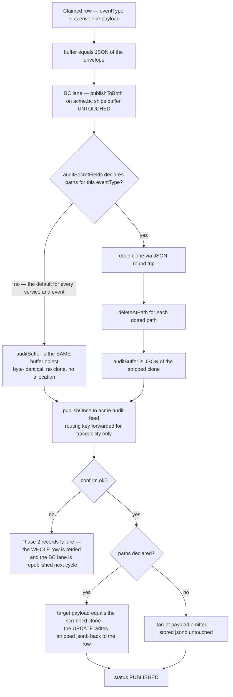

# Publishing — the outbox relay in depth

This page answers one question at mechanism level: **what exactly happens between the moment a
use case decides to emit an integration event and the moment a broker acknowledges it — and what
exactly happens at every point where that can go wrong.** It documents the caller-owned
transaction convention, the three-phase relay cycle, the PostgreSQL advisory lock, publisher
confirms and their timeout, the retry budget, the audit-feed dual-publish and the token-redaction
hardening that was bolted onto it, the real ordering guarantees, and the reaper. Read it if you
are adding a producer, debugging a stuck or duplicated event, or reviewing anything that touches
`platform_outbox.outbox_entry`. It assumes you have already read the messaging survey — the shape
is not repeated here, only the machinery.

Everything below was read out of `libs/platform/event-bus/src/lib/` (relay, reaper, entity,
publisher, connection, routing-key versioning, module) and its ninety-six relay-and-reaper unit
tests, the four per-service outbox adapters, the outbox migrations, and the Helm chart values that
configure it. Where a doc, an ADR or a code comment disagrees with shipped behaviour, the
disagreement is stated rather than smoothed over.

---

## 1. What a row is

The outbox is one table, `platform_outbox.outbox_entry`, described by a single shared MikroORM
entity in `@acme/event-bus`:

```ts
@Entity({ tableName: "outbox_entry", schema: "platform_outbox" })
@Index({ properties: ["status", "createdAt"], name: "idx_outbox_pending" })
export class OutboxEntry {
  id: string = v7(); // uuid PK, time-ordered, minted in app code
  entryType!: OutboxEntryType; // entry_type   — DOMAIN_EVENT | JOB
  eventType!: string; // event_type   varchar(255)
  payload!: Record<string, unknown>; // payload      jsonb — the FULL DomainEvent envelope
  routingKey!: string; // routing_key  varchar(255)
  status = OutboxEntryStatus.PENDING; // status       — PENDING | PUBLISHING | PUBLISHED | FAILED
  retryCount = 0; // retry_count  int, default 0
  lastError: string | null = null; // last_error   text, nullable
  createdAt = new Date(); // created_at   timestamptz, onCreate in JS
  publishedAt: Date | null = null; // published_at timestamptz, nullable
}
```

Seven things about that declaration carry the rest of this page.

1. **`id` is a UUID v7**, minted in application code. It is time-ordered, and it becomes the AMQP
   `messageId` on every publish, so a consumer's idempotency key is the outbox row id.
2. **`payload` is the whole `DomainEvent` envelope**, not the domain payload. `EventPublisher`
   assigns `entry.payload = event`, so the jsonb column holds `eventId`, `eventType`, `version`,
   `tenantId`, `userId`, `correlationId`, `causationId`, `timestamp` and a nested `payload`. A
   unit test in `user-service` pins this explicitly — `expect(persistedPayload['roleName']).toBeUndefined()`
   asserts the row is not the bare payload flattened.
3. **`routingKey` is initialised to `eventType`** by every writer in the repository, but it is a
   separate column, so a producer _can_ diverge them — which is why the relay validates them.
4. **`status` has no `CHECK` constraint** — the column is a `varchar`, so new states can be added
   in TypeScript without a migration. The trade is that the database will happily store a typo.
5. **`createdAt` is set in JavaScript**, at millisecond resolution, not by the database default.
   That is the entire basis of relay ordering; section 8 explains why it is not enough.
6. **The only index is `(status, created_at)`**, named `idx_outbox_pending`, with `status`
   leading. This is exactly the shape of the claim query, so the claim seeks rather than scans.
7. **The entity hard-codes `schema: 'platform_outbox'`**, which in MikroORM overrides the global
   per-bounded-context `schema` setting. A service configured with `schema: 'inventory'` still
   writes and reads outbox rows in `platform_outbox`. Section 4 shows what that costs.

`OutboxEntryType` discriminates `DOMAIN_EVENT` from `JOB`. `EventPublisher` writes the former;
`JobEnqueuer` in `@acme/queue` writes the latter with `eventType` set to the queue name. The relay
does **not** branch on `entryType` — it derives an exchange from the dotted prefix of `eventType`
for every row it claims, which means a `JOB` row whose queue is `jobs.accounting.erp-posting`
derives the exchange `acme.jobs`. No such exchange is declared in the broker bootstrap and no
service holds a `write` grant on it. The job lane of the outbox is, as shipped, not relayable.

### Schema drift between the migrations that create it

Four services carry a migration that creates the same table, each guarded `IF NOT EXISTS`, because
whichever service migrates first on a fresh database wins. They do not agree:

| Column             | `tenant-service` / `auth-service` | `inventory-service`                 | Entity docstring |
| ------------------ | --------------------------------- | ----------------------------------- | ---------------- |
| `entry_type`       | `varchar(255)`                    | `varchar(20)`                       | `varchar(20)`    |
| `status`           | `varchar(255)`                    | `varchar(20)`                       | `varchar(20)`    |
| `id` default       | none                              | `gen_random_uuid()`                 | supplied by app  |
| PK constraint name | `outbox_entry_pkey`               | `platform_outbox_outbox_entry_pkey` | —                |

Because of the `IF NOT EXISTS` guards, the shape you actually get depends on migration order. The
entity docstring cites a `varchar(20)` init migration that does not exist for this table in any
outbox-owning service; the two `varchar(20)` occurrences of that filename in the repository belong
to `notification-service` and `document-service`, neither of which owns an outbox migration. This
is cosmetic today — no writer approaches 20 characters — but it means "the outbox schema" is not a
single artefact you can point at.

---

## 2. The caller-owned-transaction convention

The entire value of an outbox is that the event row and the state change commit or roll back
together. That is not achieved by anything clever; it is achieved by a single rule that every
publisher must obey:

> **The publisher takes the caller's `EntityManager`, calls `persist`, and returns. It never
> forks. It never flushes.**

The shared implementation is four lines of substance:

```ts
async publish<T>(em: EntityManager, event: DomainEvent<T>): Promise<void> {
  const entry = new OutboxEntry();
  entry.entryType = OutboxEntryType.DOMAIN_EVENT;
  entry.eventType = event.eventType;
  entry.payload = event as unknown as Record<string, unknown>;
  entry.routingKey = event.eventType;
  entry.status = OutboxEntryStatus.PENDING;

  em.persist(entry);        // no fork, no flush — the caller's UoW owns the commit
}
```

The per-service port makes the requirement explicit rather than optional. `tenant-service`
declares:

```ts
export interface IEventPublisher {
  publish(
    event: { eventType: string; payload: Record<string, unknown> },
    em: EntityManager // REQUIRED — not optional, not defaulted
  ): Promise<void>;
}
```

and its adapter is the same shape as the shared publisher, with the rule restated in the comment:
_"Enlist in the caller's transaction — no fork, no flush."_ `user-service` ships a
character-for-character equivalent. Both were rewritten to this shape under the same review, and the
`user-service` unit test enforces it by sabotage — the stand-in `EntityManager` throws if either
forbidden method is touched:

```ts
fork:  vi.fn(() => { throw new Error('adapter must not fork'); }),
flush: vi.fn(() => { throw new Error('adapter must not flush'); }),
```

### The correct call site

A use case opens exactly one transaction and threads the same `em` into the repository read, the
repository write and the publish. From `SuspendTenantUseCase`:

```ts
const tenant = await this.em.transactional(async (em) => {
  const found = await this.tenantRepo.findById(id, em); // read on the tx em
  // ... domain guards ...
  found.suspend(suspendedById, reason);
  await this.tenantRepo.save(found, em); // write on the tx em
  await this.eventPublisher.publish(
    { eventType: "platform.tenant.suspended", payload: envelope },
    em // outbox row on the SAME tx em
  );
  return found;
});
```

Note that the _read_ also takes `em`. MikroORM keeps a per-EntityManager identity map: an entity
loaded on manager A and then persisted through a forked manager B is a different object graph, and
B will attempt an `INSERT` for a row that already exists. Threading `em` through the read is not
stylistic.

### The incorrect shape, and exactly what it costs

```ts
// ANTI-PATTERN — do not copy
async publish(event: DomainEvent, callerEm?: EntityManager): Promise<void> {
  const em = callerEm ?? this.em.fork();   // ← a second, independent unit of work
  await this.eventPublisher.publish(em, event);
  if (!callerEm) {
    await em.flush();                      // ← commits on its own, in its own transaction
  }
}
```

A fork is a new `EntityManager` with its own identity map and its own connection lease. Its
`flush()` opens and commits its **own** transaction. That produces two failure directions, and
both are real:

- **Lost event.** The caller's transaction commits the state change, the process dies, and the
  fork never flushes. The aggregate is durably suspended and no `platform.tenant.suspended` event
  ever exists. Nothing in the system can detect this — the outbox has no row to be stuck on, no
  reaper to find, no lag metric to move. This is the direction that motivated the rewrite.
- **Phantom event.** The fork flushes first, the caller's transaction then rolls back. The outbox
  now holds a `PENDING` row describing a state change that never happened, and the relay will
  publish it within a second. Consumers act on a fact that is not true. Idempotency does not help
  — the event is unique, it is just wrong.

The integration test that pins the guarantee runs against a real PostgreSQL 16 container and
checks both tables in one assertion:

```ts
it('rolls back the Tenant row AND the outbox event together when the tx fails', async () => {
  await expect(
    infra.orm.em.fork().transactional(async (em) => {
      em.persist(tenant);
      await adapter.publish({ eventType: 'platform.tenant.created', payload: {...} }, em);
      throw new Error('domain write failed after publish');
    })
  ).rejects.toThrow('domain write failed after publish');

  expect(await readTenants()).toHaveLength(0);
  expect(await readOutbox()).toHaveLength(0);
});
```

### Two producers that do not follow the convention

**`trading-service` still ships the fork fallback.** `TradingEventPublisher.publish` opens with
`const em = callerEm ?? this.em.fork();` and closes with `if (!callerEm) { await em.flush(); }` —
the exact anti-pattern above, preserved as an opt-in escape hatch. Its own docstring advertises
the escape hatch as a feature: _"Accepts a caller-provided EntityManager for transactional
consistency, or falls back to a forked EM for independent writes."_ Every call site that omits the
argument is publishing non-atomically. The publisher is referenced from seventeen non-test files in
that service.

**Two services write outbox rows without registering the entity.** `createMikroOrmConfig` passes
the caller's `entities` array straight through — there is no discovery glob, so an entity that is
not in the list is not discovered:

```ts
entities: options.entities as never[],
```

`trading-service`'s `entities` array contains twenty-four classes and `OutboxEntry` is not among
them; the only import of `OutboxEntry` anywhere in that project is in its Testcontainers
`setup.ts`. `accounting-service`'s array contains nineteen entities and likewise omits it, while its
`ApproveInvoiceUseCase` calls both `jobEnqueuer.enqueue(txEm, …)` and `eventPublisher.publish(txEm, …)`
inside one transaction. In MikroORM 6.6, `EntityManager.persist` validates discovery and throws
`ValidationError.notDiscoveredEntity` — _"Trying to persist not discovered entity of type
OutboxEntry"_ — for any instance whose class was never discovered.

**Unverified:** this is a static reading — not observed against a running database, so it cannot be
stated that the exception is actually thrown at runtime, only that the code path, the ORM version and
the validation branch all line up for it. What _is_ directly verifiable is that `trading-service`
simultaneously ships an observability job that reads
`platform_outbox.outbox_entry` by raw SQL to compute `acme_trading_outbox_lag_seconds`, so the
service clearly expects its rows to be there.

---

## 3. The relay cycle

### Startup and scheduling

`EventBusModule.forRoot({ enableRelay: true })` constructs an `OutboxRelay` and, separately, waits
on the AMQP connection before handing it dependencies:

```ts
rabbitMqConnection.whenReady().then(async () => {
  await rabbitMqConnection.checkExchange(AUDIT_FEED_EXCHANGE);          // passive — no configure grant needed
  await rabbitMqConnection.assertExchange(`${exchangeName}.dlx`, 'topic', { durable: true });
  relay.setDependencies(em, { publish: (…) => { … ; return true; }, once: () => {} });
});
```

`setDependencies` is what starts polling. Until the broker is reachable the relay object exists,
logs its configuration in `onModuleInit`, and does nothing. If `whenReady()` never resolves — the
promise is resolved once, on first successful connect — the relay never polls at all, and the
failure is a single `logger.warn`, not a crash.

The loop is a self-rescheduling `setTimeout`, deliberately not a `setInterval`:

```ts
this.pollingTimer = setTimeout(async () => {
  if (this.em && this.channel) {
    try {
      this.inFlightPromise = this.pollAndPublish(this.em, this.channel);
      await this.inFlightPromise;
    } catch (error) { this.logger.error('OutboxRelay poll cycle failed', …); }
    finally { this.inFlightPromise = null; }
  }
  this.scheduleNextPoll();          // recurse only after the cycle settles
}, this.config.pollIntervalMs);
```

The next tick is scheduled only after the current cycle settles, so cycles never overlap within a
process. `pollIntervalMs` is therefore a _gap_ between cycles, not a period: a cycle that takes
four seconds under a 1 000 ms interval yields a five-second cadence. The `finally` that nulls
`inFlightPromise` is there because `onModuleDestroy` guards on `if (this.inFlightPromise)`; without
it the field held a stale resolved promise forever and the guard was permanently truthy, which
masked regressions where a genuinely in-flight cycle was not awaited on SIGTERM.

### Configuration surface and its validation gap

| Option                    | Default  | Validated in the constructor?         |
| ------------------------- | -------- | ------------------------------------- |
| `pollIntervalMs`          | `1000`   | no                                    |
| `batchSize`               | `100`    | no                                    |
| `maxRetries`              | `5`      | no                                    |
| `advisoryLockId`          | `900001` | no (only the env-var path is checked) |
| `transitionVersion`       | `null`   | no                                    |
| `publishConfirmTimeoutMs` | `30000`  | no                                    |
| `persistChunkSize`        | `10`     | **yes** — must be a positive integer  |
| `auditSecretFields`       | `{}`     | no                                    |

Only `persistChunkSize` is guarded. `new OutboxRelay({ batchSize: -1 })` constructs happily. The
sibling `OutboxReaper` validates all seven of its options; the relay validates one of eight. The
asymmetry is not deliberate design, it is the residue of the review that added chunking.

### Three phases, and why the boundaries are where they are

```ts
async pollAndPublish(em, channel): Promise<void> {
  const claimed = await this.claimPendingEntries(em);   // Phase 1 — one short transaction
  if (claimed.length === 0) return;
  const results = await this.publishClaimedEntries(channel, claimed);  // Phase 2 — no transaction
  await this.persistEntryResults(em, results);          // Phase 3 — one transaction per chunk
}
```

The shape exists because an earlier version wrapped the whole cycle in one transaction. A publish
has an effect a database cannot roll back; when the wrapping transaction aborted after N
successful publishes, all N rows reverted to `PENDING` and were delivered a second time on the next
cycle. Splitting publish out of any transaction removes that class entirely.

**Phase 1 — claim.** Inside one transaction: take the advisory lock, select, flip, commit.

```ts
return await em.transactional(async (txEm) => {
  const lockResult = await txEm.execute(
    `SELECT pg_try_advisory_xact_lock(${Number(lockId)}) AS acquired`
  );
  if (!(lockResult[0]?.acquired ?? false)) {
    this.logger.debug(
      "OutboxRelay: advisory lock held by another instance, skipping cycle"
    );
    return [];
  }
  const entries = await txEm.find(
    OutboxEntry,
    { status: OutboxEntryStatus.PENDING },
    {
      orderBy: { createdAt: "ASC" },
      limit: this.config.batchSize,
      ...NO_TENANT_FILTER,
    }
  );
  if (entries.length === 0) return [];
  for (const entry of entries) entry.status = OutboxEntryStatus.PUBLISHING;
  await txEm.flush();
  return entries;
});
```

Note what is _not_ there: no `FOR UPDATE SKIP LOCKED`, and the flush emits plain
`UPDATE … WHERE id = ?` with no status predicate. Mutual exclusion is delegated entirely to the
advisory lock. Section 4 is about what happens when that delegation does not hold.

`NO_TENANT_FILTER` is `{ filters: { tenant: false } }`. The platform registers a global MikroORM
filter named `tenant` with `default: true`, and its condition **throws** when no tenant context is
bound. The relay is a background poller with no request context, and `OutboxEntry` is not
tenant-scoped, so every relay query must opt out. MikroORM 6 applies registered filters to
`nativeUpdate` as well as `find`, so the opt-out is needed on the Phase 3 write-back too —
omitting it there was a real defect that left every entry stranded in `PUBLISHING`.

A thrown claim transaction is caught, logged at `error`, and returns an empty array. Nothing is
retried within the tick; the loop simply waits for the next one. Because the flip never committed,
the rows are still `PENDING` — a regression test asserts exactly that ("claim transaction failure
leaves entries PENDING for next cycle, no orphan PUBLISHING").

**Phase 2 — publish.** A plain sequential `for` loop with a per-entry `try`/`catch`. One row's
failure never aborts the batch, and nothing is parallelised:

```ts
for (const entry of claimed) {
  try {
    const exchange = this.deriveExchange(entry.eventType);
    await this.publishToChannel(channel, exchange, entry);
    results.push({ entry, success: true });
  } catch (error) {
    results.push({ entry, success: false, error });
  }
}
```

`deriveExchange` is the whole routing rule: the exchange is `acme.` plus the first dotted segment
of `eventType`. `trading.deal.locked` goes to `acme.trading`; `identity.user.login` goes to
`acme.identity`. An `eventType` with no dot, or with a leading dot, throws — which lands the row in
the failure branch and burns retry budget rather than crashing the relay. The module's configured
`exchangeName` is **not** used for publishing at all; it is used only to assert the bounded
context's dead-letter exchange at startup.

**Phase 3 — persist.** Results are sliced into `persistChunkSize` groups, and each group is one
transaction. Before the transaction opens, each entry is mutated in memory to its target state and
its previous state is snapshotted:

```ts
export function captureMutableState(
  entry: OutboxEntry
): OutboxEntryMutableState {
  const { status, retryCount, lastError, publishedAt } = entry;
  return { status, retryCount, lastError, publishedAt };
}
```

The snapshot type is a `Pick<OutboxEntry, …>`, so adding a new relay-mutable column is one edit
that the compiler forces you to complete. The revert is `Object.assign(entry, snapshot)`, which
picks up new fields automatically.

The write itself is an atomic `UPDATE` with an optimistic predicate — not an entity flush:

```ts
counts.push(
  await txEm.nativeUpdate(
    OutboxEntry,
    { id: item.entry.id, status: item.snapshot.status }, // ← still PUBLISHING?
    item.target,
    NO_TENANT_FILTER
  )
);
```

Three outcomes per row:

| `nativeUpdate` result           | In-memory entity     | Database row                     | Signal                                                                                                                        |
| ------------------------------- | -------------------- | -------------------------------- | ----------------------------------------------------------------------------------------------------------------------------- |
| throws (whole chunk rolls back) | reverted to snapshot | stays `PUBLISHING`               | `logger.error` "stuck in PUBLISHING" per row, plus one increment of `outbox_relay_stuck_publishing_total{event_type}` per row |
| returns `0`                     | reverted to snapshot | whatever the external writer set | `logger.warn` "optimistic-lock lost" — **no retry**                                                                           |
| returns `> 0`                   | already correct      | new state                        | none                                                                                                                          |

The zero-rows case means an admin, a recovery tool, the reaper or a peer replica changed the row
between Phase 2 and Phase 3. The relay treats the external writer as authoritative and walks away.
This is the one branch where the relay knowingly abandons a row it has already published.

The chunk trade-off is explicit: with the default `batchSize: 100` and `persistChunkSize: 10`, a
cycle costs ten `BEGIN`/`COMMIT` round trips instead of a hundred, at the cost that one throw
strands up to ten rows rather than one. `persistChunkSize: 1` buys back strict per-row isolation.
Crucially, a chunk rollback leaves rows `PUBLISHING`, never `PENDING`, so the no-duplicate-delivery
invariant survives the optimisation.

### The row lifecycle, including every failure edge



Two edges deserve emphasis because they are counter-intuitive. A **version-mismatched entry ends
`PUBLISHED`**, not `FAILED` — the relay considers a structured envelope on the dead-letter exchange
to be delivery, and deliberately does not re-attempt a message that is broken at the producer.
And **stranding in `PUBLISHING` is the designed safe state**: the claim query filters on
`status = PENDING`, so a stranded row is never republished. The reaper exists only because that
safety has a cost.

---

## 4. The advisory lock

### What it is

```sql
SELECT pg_try_advisory_xact_lock(900001) AS acquired
```

Transaction-scoped (`_xact_`) and non-blocking (`_try_`). Transaction-scoped means PostgreSQL
releases it at `COMMIT` or `ROLLBACK`, so a relay that dies mid-cycle, or whose connection is
severed, cannot leak the lock — there is no `pg_advisory_unlock` anywhere in the relay, and a test
asserts its absence. Non-blocking means a losing replica returns immediately rather than queueing:
it logs at `debug`, returns an empty array, the cycle ends, and the next tick tries again a second
later. There is no backoff and no jitter on lock contention; a losing replica polls the lock at
exactly `pollIntervalMs` forever.

The lock covers **only Phase 1**. By the time the first `basic.publish` leaves the process the
lock is already gone, released by the claim commit. That is intentional — holding a database lock
across network I/O to a broker would couple lock-hold time to broker latency — and it is why the
claim must be a durable state flip rather than an in-memory reservation. The flip _is_ the lease;
the lock only serialises the act of taking it.



The Testcontainers suite proves the single-flight property directly, and its setup is instructive
about what the property actually depends on. Two `OutboxRelay` instances are constructed with the
**same** `advisoryLockId: 900098`, wired to two separate ORM instances so they hold separate
PostgreSQL connections — the comment explains that a single connection inside a transaction always
sees its own lock as acquired — and both are run concurrently against one `PENDING` row. The
assertion is `expect(received).toHaveLength(1)`: exactly one AMQP message, one `PUBLISHED` row.

### The lock id is per service, and the table is shared

Here is where design intent and deployed topology diverge.

ADR-0022 places every service's schema on **one PostgreSQL instance, in one database**. The outbox
migrations restate this in their own comments: _"`platform_outbox.outbox_entry` is a SHARED,
platform-level table (single DB per ADR-0022): auth/tenant/inventory each carry a migration that
ensures it."_ The shared-ownership problem was real enough to need a dedicated fix — a `NOLOGIN`
group role that owns the schema and every table in it, so any service can run the shared DDL,
because PostgreSQL checks table ownership _before_ honouring `IF NOT EXISTS`.

PostgreSQL advisory locks are scoped to the database. Four services currently set
`enableRelay: true` — auth, tenant, user and inventory — and each is allocated a **different** lock
id. Four different keys in one lock space never contend.



Two consequences follow from code that is directly readable:

- **The claim query has no bounded-context predicate.** It is `{ status: PENDING }`, full stop. Any
  relay can claim any row. `deriveExchange` then targets the _row's_ bounded context, not the
  relay's, so `user_user` can be asked to publish to `acme.trading`. The broker permission regexes
  are per service and deny that — `user_user`'s `write` grant is
  `^(acme\.platform(\..*)?|acme\.audit-feed(\..*)?|user-service\..*)$`. The publish fails, the row
  burns retry budget, and after five cycles it is `FAILED`. The owning service's relay never sees
  it again.
- **The `EventBusModule` comment states the opposite as an invariant.** It justifies asserting a
  single static `${exchangeName}.dlx` at startup with: _"this static `<exchangeName>.dlx` equals
  dlxRoute()'s runtime target because a relay-enabled service only ever emits its own bounded
  context's events (one-BC-per-outbox)."_ That is true of what a service _writes_. It is not true
  of what its relay _reads_.

**Unverified:** whether a concurrent double-claim has actually occurred. The
mechanism is legible — two relays with different lock keys both `SELECT` the same `PENDING` rows
under `READ COMMITTED`, both issue `UPDATE … WHERE id = ?` with no status predicate, the second
blocks on the row lock, then succeeds against the re-read row version because its predicate still
matches — but there is no test at that scope and it was not observed running. The single-relay unit
suite and the same-lock-id integration test both exercise the case where the guard works.

The blunt reading: the per-service lock-id registry is correct for a future where each service owns
its own database, and actively defeats the guarantee in the topology that is deployed today. The
registry documents the future; the table implements the present.

### Three registries, and three guards that do not watch the deployed path

The lock id reaches the process through `OUTBOX_ADVISORY_LOCK_ID`, parsed with a strict fail-fast:

```ts
private static parseAdvisoryLockId(raw: string | undefined): number | undefined {
  if (raw === undefined || raw === '') return undefined;
  const parsed = Number.parseInt(raw, 10);
  if (!Number.isInteger(parsed) || parsed <= 0 || String(parsed) !== raw) {
    throw new Error(`Invalid OUTBOX_ADVISORY_LOCK_ID: "${raw}" — must be a positive integer …`);
  }
  return parsed;
}
```

The `String(parsed) !== raw` round-trip is what rejects `900002abc`; a bare `parseInt` would have
accepted it as `900002`. Six unit tests pin the branches: `not-a-number`, `0`, `-1`,
`900002abc` all throw; `900002` propagates; unset falls back to `900001`. Note the last one — an
**unset** variable is not an error. The declared registry values disagree across three places:

| Service              | Code default (`*.config.ts`) | `charts/values/<svc>.yaml` | Actually deployed |
| -------------------- | ---------------------------- | -------------------------- | ----------------- |
| auth-service         | 900001                       | 900001                     | 900001            |
| tenant-service       | 900002                       | 900002                     | 900002            |
| user-service         | 900003                       | 900003                     | 900003            |
| trading-service      | 900005                       | 900005                     | 900005            |
| inventory-service    | 900006                       | 900006                     | 900006            |
| accounting-service   | 900007                       | 900007                     | **900010**        |
| commission-service   | 900008                       | 900008                     | **900012**        |
| document-service     | 900009                       | 900009                     | **900040**        |
| notification-service | 900010                       | 900010                     | **900050**        |
| audit-service        | 900011                       | 900011                     | **900022**        |
| reporting-service    | 900012                       | 900012                     | **900023**        |
| ai-service           | **900007**                   | 900013                     | 900013            |

"Actually deployed" is what the ArgoCD `ApplicationSet` renders. Five of the seven Applications are
bundles pointing at `charts/bundles/<name>-bundle`, and only two — `gateway` and `ai` — read
`charts/values/*.yaml`. Nine services therefore take their lock id from a bundle values file,
and the identity bundle is the only one that uses the chart's `outboxAdvisoryLockId` key; the
other four bundles inject a literal `OUTBOX_ADVISORY_LOCK_ID` env entry instead.

The deployed set is pairwise unique, so nothing collides at runtime today. What is broken is the
enforcement:

1. **`scripts/platform/check-outbox-lock-ids.sh`** compares `charts/services.yaml` against
   `charts/values/<svc>.yaml`. Neither file is on the deployed path for nine of the eleven
   relay-capable services.
2. **The Helm guard** (`validateOutboxLockId`) fails a render when `hasRabbitMQ` is true and
   `outboxAdvisoryLockId` is unset. `hasRabbitMQ` appears **only** in `charts/values/*.yaml` — no
   bundle values file sets it — so for every bundle-deployed service the guard's condition is
   falsy and it never fires. Its rationale sentence is also inverted: it warns that "multiple
   instances of a service would fall back to `900001` and starve each other", but replicas of one
   service sharing a lock id is exactly the intended single-flight behaviour. Cross-_service_
   sharing is what would serialise unrelated relays.
3. **The parity spec is switched off, on purpose, because it is red.** `test/outbox-lock-id-registry.spec.ts`
   asserts code-default ↔ chart-value parity, bundle ↔ chart-value parity, global uniqueness and
   range. The unit vitest config includes only `src/**/*.spec.ts`, and the integration config only
   `test/**/*.tc.spec.ts`, so this file matches neither. The config says so in a comment:

   > `test/outbox-lock-id-registry.spec.ts` … matches no include here and runs NOWHERE — a
   > pre-existing gap. It is deliberately left out for now: enabling it surfaces a real
   > advisory-lock-ID drift (ai-service code default 900007 ≠ helm 900013, and 900007 collides with
   > accounting; #638 fixed helm but missed the code default) that would hard-fail this gate.

   Even if it were enabled, its bundle check reads a nested `outboxAdvisoryLockId:` key and would
   see `null` for the eight services that use the env-entry form — so eight of nine deployed
   values would be skipped.

Finally, the architecture registry claims a guard that does not exist: _"Two `EventBusModule.forRoot()`
calls in the same process with the same ID also throw (collision guard)"_, naming a
`__resetAdvisoryLockRegistryForTests` escape hatch. A repository-wide search for that identifier,
for `advisoryLockRegistry`, and for any collision check in the event-bus library returns nothing.
The same paragraph claims a missing lock id is a startup failure enforced by the `OutboxRelay`
constructor; the constructor silently defaults to `900001`.

---

## 5. Publisher confirms

### The channel is real, the interface is not

`RabbitMqConnection.connect()` creates a **confirm** channel immediately after the AMQP connection
opens (`await conn.createConfirmChannel()`), so every publish through this connection is in confirm
mode. The relay, however, never touches amqplib directly. `EventBusModule` hands it a two-method
adapter:

```ts
relay.setDependencies(em, {
  publish: (exchange, routingKey, content, opts, cb) => {
    rabbitMqConnection
      .publish(exchange, routingKey, content, opts)
      .then(() => cb(null))
      .catch((err: Error) => cb(err));
    return true; // ← always true
  },
  once: () => {
    /* no-op */
  }, // ← connection events handled elsewhere
});
```

Two details matter. The adapter **always returns `true`**, discarding amqplib's real backpressure
signal, and `once` is a no-op. The relay contains a backpressure branch —

```ts
if (!written) {
  channel.once("drain", () => {
    this.logger?.debug?.("Channel drain event received …");
  });
}
```

— that in production is unreachable, because `written` is always `true` and the `once` it would
register does nothing. The relay never observes a full write buffer. It is not clear this matters
at current volume; it is worth knowing that the code reads as if flow control is handled and is not.

The adapter also re-resolves `rabbitMqConnection.channel` on every call, which is what makes
reconnection transparent: `setDependencies` runs once, on first ready, and never needs re-wiring
because the closure looks the channel up lazily. If the channel is `null` at that moment,
`RabbitMqConnection.publish` throws `No channel available — call connect() first`, the `.catch`
converts it to a callback error, and the row is treated as a normal publish failure.

### Awaiting a confirm

Every publish is one promise settled by amqplib's confirm callback, wrapped in a timeout:

```ts
private publishOnce(channel, exchange, routingKey, buffer, options): Promise<void> {
  const innerPublish = new Promise<void>((resolve, reject) => {
    const written = channel.publish(exchange, routingKey, buffer, options, (err: Error | null) => {
      if (err) reject(err); else resolve();
    });
    if (!written) { /* drain branch, unreachable in production */ }
  });
  return this.withConfirmTimeout(innerPublish, `exchange=${exchange}, routingKey=${routingKey}`);
}
```

The bounded-context lane goes through `publishToBoth`, which submits both routing keys before
awaiting either:

```ts
const publishPromises = [
  publishConfirmed(channel, exchange, canonicalRoutingKey, payload, headers),
];
if (isTransitionMatch) {
  publishPromises.push(
    publishConfirmed(channel, exchange, baseRoutingKey, payload, headers)
  );
}
const results = await Promise.allSettled(publishPromises);
const rejected = results.filter((r) => r.status === "rejected");
if (rejected.length > 0) {
  throw new Error(
    `publishToBoth: ${rejected.length}/${results.length} publish(es) failed — ${reasons}`
  );
}
```

`Promise.allSettled` rather than sequential awaits, because the sequential version had a
duplicate-delivery mode: canonical confirms, legacy fails, the row returns to `PENDING`, and the
next cycle republishes canonical. Submitting both into the confirm window first collapses that.
The residual duplicate risk on retry is accepted on the explicit condition that consumers are
event-id idempotent, with a per-lane checkpoint column tracked as a follow-up.

### What each failure does to the row

| Event on the wire                                             | Where it surfaces                                            | Row transition                                                                                 |
| ------------------------------------------------------------- | ------------------------------------------------------------ | ---------------------------------------------------------------------------------------------- |
| broker `basic.nack`                                           | confirm callback receives an `Error` → promise rejects       | Phase 2 catch → `retryCount + 1`, `PUBLISHING → PENDING` (or `FAILED` at budget)               |
| channel closed mid-flight, amqplib errors the pending confirm | same path as a nack                                          | identical                                                                                      |
| channel closed mid-flight, confirm never settles              | `withConfirmTimeout` rejects after `publishConfirmTimeoutMs` | identical                                                                                      |
| BC lane confirmed, audit lane nacked                          | Phase 2 catch, after the BC lane already delivered           | row treated as failed → **both lanes republished next cycle**                                  |
| version/routing-key mismatch                                  | `dlxRoute` publishes an envelope, then returns               | `PUBLISHING → PUBLISHED` — deliberately not retried                                            |
| version mismatch **and** the DLX publish fails                | `dlxRoute` throws out of `publishToChannel`                  | `retryCount + 1`, back to `PENDING`; a test asserts `lastError` contains the DLX exchange name |

The timeout wrapper is worth reading in full because of a subtlety it handles:

```ts
private withConfirmTimeout<T>(inner: Promise<T>, contextLabel: string): Promise<T> {
  inner.catch((lateErr) => {                       // late-rejection sink
    this.logger?.debug?.(`Late publish confirm settled after timeout (${contextLabel}): …`);
  });
  let timer;
  const timeoutPromise = new Promise<T>((_, reject) => {
    timer = setTimeout(() => reject(new Error(
      `OutboxRelay publish confirm timeout after ${timeoutMs}ms (${contextLabel}). ` +
      `AMQP channel did not invoke the confirm callback …`)), timeoutMs);
  });
  return Promise.race([inner, timeoutPromise]).finally(() => clearTimeout(timer));
}
```

`Promise.race` does not cancel the loser. If the broker eventually rejects the inner promise after
the timeout already fired, that rejection needs an observer or Node may report an unhandled
rejection; the explicit `.catch` attached before the race is defence in depth, and there is a test
named "absorbs late inner-publish rejection without UnhandledPromiseRejection". The other cost is
retention: the inner closure survives until amqplib closes the channel, so a stalled channel holds
roughly one closure per claimed row — about a hundred at the default batch size, for at most thirty
seconds.

The `contextLabel` is deliberately different during a dual-publish window, because the hang could
be on either routing key:

```ts
const contextLabel = dualPublish
  ? `exchange=${exchange}, eventType=${entry.eventType}, dual-publish window v${version} (canonical OR legacy may have hung)`
  : `exchange=${exchange}, eventType=${entry.eventType}, canonical routingKey=${entry.routingKey}`;
```

That string lands in `last_error`. An operator reading a stuck row must not misattribute a hang to
the stored `routing_key` alone.

### The cycle, with a nack on the audit lane



The last note is the honest cost of the two-lane design: **there is no per-lane checkpoint.** An
audit-lane failure republishes the bounded-context lane. Consumers must be idempotent on
`eventId` — not as a nicety, but because the relay's own success criterion is "both lanes
confirmed".

---

## 6. Retry, backoff, and the poison row

There is no backoff. This is the single most operationally significant fact on this page.

A failed row goes straight back to `PENDING` with `retryCount + 1`. It carries its original
`created_at`, so the `ORDER BY created_at ASC` claim puts it at the **front** of the very next
batch, one poll interval later. With the defaults — `pollIntervalMs: 1000`, `maxRetries: 5` — a row
exhausts its budget in roughly **five seconds**:

```ts
entry.retryCount++;
entry.lastError =
  result.error instanceof Error ? result.error.message : String(result.error);
if (entry.retryCount >= this.config.maxRetries) {
  entry.status = OutboxEntryStatus.FAILED;
  this.logger.error(
    `Outbox entry ${entry.id} permanently FAILED after ${this.config.maxRetries} retries: ${entry.lastError}`
  );
} else {
  entry.status = OutboxEntryStatus.PENDING;
}
```

Five consequences worth stating plainly:

1. **A short broker outage fails the backlog.** RabbitMQ unreachable for six seconds is enough to
   drive every `PENDING` row to `FAILED`, because each row is retried once per second. The claim
   still succeeds — PostgreSQL is fine — so the relay keeps consuming budget as fast as it can.
   The one integration test for broker unavailability asserts only the _first_ attempt
   (`status === PENDING`, `retryCount === 1`); nothing exercises budget exhaustion under a
   sustained outage.
2. **`retryCount` never resets.** A row that fails four times, succeeds, and is later re-driven has
   no fresh budget. In practice a successful row is terminal, so this only bites recovery tooling
   that flips `FAILED` rows back to `PENDING`.
3. **`FAILED` is terminal.** Nothing in the codebase moves a row out of `FAILED`. The reaper only
   reads `PUBLISHING`. There is no committed replay tool. Recovery is manual SQL.
4. **A poison row is cheap but silent-ish.** A malformed `eventType` — no dot, leading dot, empty —
   throws inside `deriveExchange` on every attempt and reaches `FAILED` in five cycles. Each
   attempt emits an entry in `last_error`, and the final one an `error`-level log. There is no
   dedicated metric for `FAILED` growth; the only relay counter is
   `outbox_relay_stuck_publishing_total`, which covers the _stranded_ case, not this one.
5. **The retry budget is per row, not per broker health.** There is no circuit breaker, no global
   pause, no distinction between "this message is bad" and "the broker is down". The same five
   attempts serve both.

The counter is resolved lazily and degrades to nothing if OpenTelemetry is absent:

```ts
const api = require("@opentelemetry/api");
const meter = api.metrics.getMeter("platform.event-bus", "1.0.0");
this.otelStuckCounter = meter.createCounter(
  "outbox_relay_stuck_publishing_total",
  {
    description:
      "OutboxEntry rows left stuck in PUBLISHING after a Phase 3 status-update failure",
  }
);
```

Its only label is `event_type` — deliberately low cardinality, with a comment explaining that entry
id was rejected as a label. The structured `error` log still fires when the API is unavailable, so
the signal is not lost, only un-dashboardable. Three tests cover the counter: it increments on
chunk rollback, it does **not** increment on optimistic-lock-lost, and it degrades silently when
the package cannot be required.

---

## 7. The audit dual-publish, and the token-at-rest hardening

### The design

ADR-0026 introduced a single `acme.audit-feed` **fanout** exchange so the audit service needs no
per-bounded-context bindings. The relay publishes every claimed row twice: once to the
context topic exchange, once to the fanout.

```ts
await this.withConfirmTimeout(
  publishToBoth(
    channel,
    exchange,
    entry.eventType,
    version,
    transitionVersion,
    buffer,
    { ...headers, contentType: "application/json", messageId: entry.id }
  ),
  contextLabel
);

const auditOptions = {
  persistent: true,
  contentType: "application/json",
  messageId: entry.id,
  headers,
};
const auditBuffer = this.buildAuditBuffer(entry, buffer);
await this.publishOnce(
  channel,
  AUDIT_FEED_EXCHANGE,
  entry.routingKey,
  auditBuffer,
  auditOptions
);
```

The routing key on the fanout lane is forwarded purely for traceability — a fanout ignores it for
delivery — so an audit consumer sees the same key the bounded-context binding saw. The exchange is
verified **passively** at bootstrap (`checkExchange`, an AMQP passive declare) rather than asserted,
because the fanout is owned by the broker bootstrap chart, not by any producer, and an active
declare on a foreign exchange is refused with `403 ACCESS_REFUSED` under bounded-context isolation.

### The leak

The audit consumer persists the inner payload verbatim:

```ts
const entry = AuditEntry.create({
  tenantId: event.tenantId,
  entityType,
  entityId: event.aggregateId!,
  action,
  newState: event.payload,        // ← straight into audit_entry.new_state, a NOT NULL jsonb
  sourceEventType: eventType,
  sourceEventId: eventId,
  …
});
```

The audit database is fanout-fed and platform-wide: one store, all tenants, all bounded contexts.
So any raw secret carried in an event payload lands unredacted, at rest, in the most widely
readable database on the platform.

That became concrete when the first-admin invite pipeline shipped. `platform.user.invited` carries
the **raw** invitation accept token, because the notification service builds the email link from
it. `identity.password.reset-requested` carries the raw reset token for the same reason. Both are
bearer credentials: anyone with `SELECT` on the audit store — a DBA, an operator, a log shipper —
could read one within its TTL and complete the flow. For the invite that means becoming an `ADMIN`
of the tenant. It directly defeated the "a database read never exposes a usable token" control the
token-revocation work had just established.

The producer-side comment is candid that this is a compromise rather than a design:

```ts
// The RAW token travels in the payload so notification-service can build the reset
// link (mirrors platform.user.invited). It is a bearer credential: the relay's
// `auditSecretFields` (app.module) strips `payload.token` from the acme.audit-feed
// copy, and notification redacts it from the delivered body after send.
// Strategic follow-up: deliver via a dedicated notification port (no secret in events).
```

### The fix, and its exact semantics

`OutboxRelayConfig.auditSecretFields` is a per-`eventType` denylist of **dotted paths into the
envelope**, applied to the audit copy only:

```ts
readonly auditSecretFields?: Readonly<Record<string, readonly string[]>>;
```

It is **off by default** — `config?.auditSecretFields ?? {}` — and the off path is a genuine no-op,
not a cheap clone:

```ts
private buildAuditBuffer(entry: OutboxEntry, bcBuffer: Buffer): Buffer {
  const paths = this.config.auditSecretFields[entry.eventType];
  if (!paths || paths.length === 0) {
    return bcBuffer;                                    // same object, byte-identical
  }
  const redacted = JSON.parse(JSON.stringify(entry.payload));
  for (const path of paths) deleteAtPath(redacted, path);
  return Buffer.from(JSON.stringify(redacted));
}
```

`deleteAtPath` walks dotted segments and `delete`s the leaf, treating a missing or non-object
intermediate as a silent no-op. The clone is a JSON round trip, which is exact for this data
because the payload came out of a `jsonb` column — the same assumption `buffer` itself rests on.

Two services declare paths, and each declares exactly one:

```ts
// user-service
relay: { auditSecretFields: { 'platform.user.invited': ['payload.token'] } }

// auth-service
relay: { auditSecretFields: { 'identity.password.reset-requested': ['payload.token'] } }
```

The path is `payload.token` — the outer segment is the envelope's nested domain payload, which is
precisely the object the audit consumer assigns to `new_state`. The redaction target and the
persistence target line up exactly.

A follow-up reused the same denylist to scrub the **stored outbox row**, because a
`PUBLISHED` row otherwise kept the raw token in its jsonb forever:

```ts
if (success) {
  const scrubbed = this.scrubbedPublishedPayload(entry);
  if (scrubbed !== undefined) {
    target.payload = scrubbed; // added to the SET clause of the PUBLISHED write-back
  }
}
```

Returning `undefined` when no paths are configured means the `SET` clause simply omits `payload` —
a true no-op for every other event type and every other service.



Five tests pin the behaviour: the bounded-context lane keeps the token while the audit lane loses
it; with no configuration the two buffers are `Buffer.equals`-identical; the persisted `PUBLISHED`
payload is scrubbed; an unconfigured event type gets no payload rewrite at all; and a denylist for
one event type does not affect another.

### What remains open

This is a real hardening story with a real perimeter, and the perimeter has holes. Every item below
is readable in the shipped code.

1. **Only the `PUBLISHED` transition scrubs.** `prepareChunkItem` sets `target.payload` inside
   `if (success)`. A row that fails, or that is stranded in `PUBLISHING`, keeps the raw token in its
   jsonb indefinitely — and by section 6, a six-second broker outage puts the whole backlog in
   `FAILED`.
2. **The reaper does not scrub.** `flipToFailed` writes `status`, `lastError` and conditionally
   `publishedAt`. A row it flips from stranded-`PUBLISHING` to `FAILED` carries its payload,
   untouched, into a terminal state that nothing ever revisits.
3. **The dead-letter header carries the whole original.** `dlxRoute` sets
   `x-acme-original-payload` to `JSON.stringify(originalPayload)` — the entire unredacted envelope,
   deliberately, so replay tooling can reconstruct it. It only fires on a version/routing-key
   mismatch, which cannot occur for the v1 invite and reset events today, but it is an unredacted
   copy on a path the denylist does not touch.
4. **The bounded-context lane is untouched by design.** The raw token is delivered to
   `acme.platform` / `acme.identity` and sits in a durable queue until the consumer drains it. The
   notification service redacts the rendered body only _after_ a `DELIVERED` send; a `FAILED` send
   retains it for retry. The relay-side control shortens the exposure, it does not remove it.
5. **It is opt-in with nothing enforcing it.** Nothing links `@acme/event-contracts` payload types
   to `auditSecretFields`. A new secret-bearing event leaks by default, silently, until someone
   remembers to add a line to that service's `app.module.ts`. There is no lint rule, no contract
   test, no naming convention that a checker could enforce.

The recorded strategic direction is to stop putting secrets in events at all — publish a token
_reference_ and mint the credential out of band, which is what the auth flows already do elsewhere.
The denylist is explicitly a containment measure, not the destination.

---

## 8. Ordering guarantees, and their honest limits

### What is ordered

Within a **single relay cycle**, on a **single relay instance**, rows are claimed
`ORDER BY created_at ASC` and published by a sequential `for` loop that `await`s each confirm before
starting the next. So within one batch, publish submission order equals `created_at` order, and
AMQP preserves per-channel ordering to a given exchange and routing key. For two events from the
same aggregate written in the same transaction and claimed in the same batch, a single consumer on
a single queue will see them in the right order.

That is the whole guarantee. Everything below breaks it.

### What is not ordered

- **Millisecond ties.** `created_at` is a JavaScript `Date` at millisecond resolution and there is
  no secondary sort key. Two rows written in the same millisecond — trivially common inside one
  transaction — are ordered by whatever PostgreSQL returns. The primary key is a time-ordered UUID
  v7 and would have made a natural tie-break; it is not in the `ORDER BY`.
- **Retry reorders across batches.** A failed row returns to `PENDING` with its **original**
  `created_at`. Meanwhile later rows may have published successfully. On the next cycle the failed
  row is claimed first and published _after_ events that logically follow it. A single transient
  nack is enough to invert a pair.
- **Chunk rollback reorders the same way.** Rows stranded in `PUBLISHING` by a Phase 3 throw were
  already published; but their _neighbours_ in later chunks may still be `PENDING` and will publish
  on a subsequent cycle.
- **Dual-publish submits concurrently.** During a transition window `Promise.allSettled` submits
  canonical and legacy keys together. They are different routing keys, so relative order between
  the two lanes is not defined.
- **The two lanes are not synchronised.** Bounded-context publish completes before the audit
  publish begins for a given row, but across rows the interleaving on the fanout is
  publish-submission order and nothing stronger.
- **Multiple relays destroy any global order.** Four relays claim from one table with four
  non-contending lock keys (section 4). There is no cross-relay sequencing at all.
- **Consumer-side concurrency finishes the job.** Competing consumers on one queue, non-unity
  prefetch, and requeue-on-nack each independently reorder delivery.

### The rule that follows

A consumer must never infer state from arrival order. It must be idempotent on `eventId` — which is
also the AMQP `messageId`, which is also the outbox row's UUID v7 — and it must tolerate an older
event arriving after a newer one. The inbox/idempotency pattern that implements this is the subject
of the consuming deep-dive; the relay guarantees at-least-once delivery in approximately causal
order, and nothing more.

---

## 9. The reaper — and what it does not prune

`OutboxReaper` exists solely because "stranded in `PUBLISHING`" is the relay's designed safe state.
Without it, every Phase 3 failure leaves a row that nothing will ever look at again. It is
instantiated only when `enableRelay: true`, and co-located with the relay for a stated reason: a
publish-only service running the reaper would scan a table it cannot consistently update and would
race the real relay's status writes.

### Configuration, all of it validated

| Option               | Default                                  | Meaning                                                         |
| -------------------- | ---------------------------------------- | --------------------------------------------------------------- |
| `scanIntervalMs`     | `900000` (15 min)                        | cadence of the scan                                             |
| `initialDelayMs`     | `5000`                                   | delay before the first scan, so the pool warms up               |
| `warnAfterMs`        | `900000` (15 min)                        | age past which a `PUBLISHING` row is logged                     |
| `failAfterMs`        | `14400000` (4 h)                         | age past which it is flipped to `FAILED`; `0` disables flipping |
| `batchSize`          | `100`                                    | rows inspected per scan                                         |
| `statementTimeoutMs` | `30000`                                  | `SET LOCAL statement_timeout` inside each per-row transaction   |
| `maxScanDurationMs`  | `floor(scanIntervalMs * 0.9)` = `270000` | watchdog that releases a wedged scan                            |

All seven are validated in the constructor with four distinct assertions — positive-finite,
non-negative-finite, positive-integer, and a bounded non-negative that rejects a typo like
`initialDelayMs: 600_000_000` which would silently disable the reaper.

### The scan

```ts
const stuck = await effectiveEm.find<OutboxEntry>(
  OutboxEntry,
  { status: OutboxEntryStatus.PUBLISHING, createdAt: { $lt: warnThreshold } },
  {
    orderBy: { createdAt: "ASC" },
    limit: this.config.batchSize,
    ...NO_TENANT_FILTER,
  }
);
```

`created_at` stands in for a `publishing_since` column that does not exist. In steady state a
`PENDING` row is claimed within about a second of creation, so the proxy is accurate for nearly
every stranded row; a dedicated column is acknowledged as future hardening.

A second, independent query gives the true backlog regardless of thresholds or batch size, and its
failure is explicitly non-fatal:

```sql
SELECT count(*)::bigint AS total FROM platform_outbox.outbox_entry WHERE status = $1
```

The flip is atomic, race-safe against the relay's Phase 3, and runs as a **true top-level**
transaction — the scan deliberately does not wrap it, because a nested transaction would become a
savepoint and `SET LOCAL statement_timeout` would then bound the outer transaction rather than this
statement:

```ts
return em.transactional(async (txEm) => {
  await txEm.execute(
    `SET LOCAL statement_timeout = ${this.config.statementTimeoutMs}`
  );
  const data = { status: OutboxEntryStatus.FAILED, lastError };
  if (entry.publishedAt !== null) data["publishedAt"] = null;
  const affected = await txEm.nativeUpdate(
    OutboxEntry,
    { id: entry.id, status: OutboxEntryStatus.PUBLISHING }, // ← relay may have won
    data,
    NO_TENANT_FILTER
  );
  return affected > 0 ? "flipped" : "race_lost";
});
```

The timeout literal is interpolated rather than parameterised because PostgreSQL requires
`SET LOCAL` to take a planning-time literal; safety comes from the constructor's positive-integer
assertion, which guarantees the interpolated text has no SQL meaning. Each scan returns
`{ stuckCount, failedCount, raceLostCount, errorCount, publishingTotal }`, and per-row failures
increment `errorCount` and continue rather than aborting the batch.

Concurrency is handled by ticket, not by lock. `tick()` coalesces overlapping ticks through
`inFlightScan`, and races the scan against a watchdog so a stalled connection pool cannot wedge the
loop silently:

```ts
this.inFlightScan = Promise.race([scanPromise, watchdog])
  .catch((err) => this.logger.error(`OutboxReaper scan failed: …`))
  .finally(() => {
    clearTimeout(watchdogTimer);
    this.inFlightScan = null;
  });
```

### A contradiction inside one file

The class docstring says:

> Multi-replica coordination uses `pg_try_advisory_xact_lock` (review finding M3): exactly one
> replica runs the scan body per interval. Other replicas no-op.

The `scan()` docstring, forty lines below, says the opposite:

> **No outer-transaction wrapping** (review C1–C3). Multiple service replicas may scan
> concurrently; race protection is the `WHERE status='PUBLISHING'` predicate inside the per-entry
> `nativeUpdate`.

The implementation matches the second. There is no `pg_try_advisory_xact_lock` anywhere in
`outbox-reaper.ts` — the only occurrence of the word "advisory" in the file is in that stale class
docstring. The spec file's header confirms the removal: _"The third-round review removed the
advisory-lock + outer-transactional wrap."_ Concurrent replicas therefore produce duplicate
find-traffic and `race_lost` log noise, but no corruption.

### What it prunes: nothing

The question "what does the reaper prune, and what is the retention window" has a short answer:
**it prunes nothing, and there is no retention window.**

The reaper's only write is a status flip. A repository-wide search finds no `nativeDelete`, no
`DELETE FROM platform_outbox`, no cron, no `CronJob` manifest, no migration and no maintenance
script that removes outbox rows. Every row ever written — `PUBLISHED`, `FAILED` or stranded —
remains in `platform_outbox.outbox_entry` permanently. Other tables in the platform have retention
jobs (`notification-retention.job.ts` deletes in-app notifications; an idempotency-key purge job
deletes expired keys); the outbox has none.

Three consequences: unbounded table growth in a single shared table across every bounded context;
an index (`status, created_at`) whose `PUBLISHED` partition grows without limit while only the
`PENDING` and `PUBLISHING` partitions are ever queried; and — combined with section 7 item 1 — any
event payload that was never successfully published keeps its contents at rest forever.

---

## 10. Verified drift and open defects

Every row below was confirmed by reading the source named, not inferred from documentation.

| #   | Finding                                                                                                                                                                                                            | Evidence                                                                                                                                                                       |
| --- | ------------------------------------------------------------------------------------------------------------------------------------------------------------------------------------------------------------------ | ------------------------------------------------------------------------------------------------------------------------------------------------------------------------------ |
| 1   | Four relays share one outbox table with four non-contending lock keys, so single-flight is enforced per service rather than per table                                                                              | ADR-0022 single database; migration comments; four `enableRelay: true` app modules with lock ids 900001/2/3/6; claim predicate is `{ status: PENDING }`                        |
| 2   | The claim query has no bounded-context predicate, so a relay can claim and attempt to publish another context's row                                                                                                | `claimPendingEntries`; `deriveExchange`; per-service `write` regexes in the broker bootstrap values                                                                            |
| 3   | The `EventBusModule` "one-BC-per-outbox" invariant comment is contradicted by the shared table                                                                                                                     | comment in `createOutboxRelay` versus the shared-table migrations                                                                                                              |
| 4   | The lock-id parity spec runs nowhere, deliberately, because it is red                                                                                                                                              | `vitest.config.ts` include list plus its own explanatory comment naming the ai-service drift                                                                                   |
| 5   | The Helm lock-id guard never fires on the deployed path — `hasRabbitMQ` is set only in `charts/values/*.yaml`, which nine of eleven services do not use                                                            | `_helpers.tpl` `validateOutboxLockId`; bundle values files; the `ApplicationSet` generators                                                                                    |
| 6   | The shell lock-id checker compares two files that are not on the deployed path for nine services                                                                                                                   | `check-outbox-lock-ids.sh` reads `charts/services.yaml` and `charts/values/` only                                                                                              |
| 7   | Six services' deployed lock ids differ from `charts/services.yaml` and `charts/values/*.yaml`; ai-service's code default (900007) collides with accounting-service's                                               | table in section 4                                                                                                                                                             |
| 8   | The architecture registry claims an in-process collision guard and a fail-fast on a missing lock id; neither exists                                                                                                | no `advisoryLockRegistry` or `__resetAdvisoryLockRegistryForTests` in the library; `parseAdvisoryLockId(undefined)` returns `undefined` and the constructor defaults to 900001 |
| 9   | The reaper's class docstring claims an advisory lock the implementation does not have                                                                                                                              | `outbox-reaper.ts` line 123 versus `scan()`; spec header confirms removal                                                                                                      |
| 10  | No outbox retention exists — rows are never deleted                                                                                                                                                                | no delete/purge/cron anywhere for `platform_outbox.outbox_entry`                                                                                                               |
| 11  | There is no publish backoff; five retries at a one-second poll interval means a ~5 s broker outage can fail an entire backlog                                                                                      | `prepareChunkItem`; `scheduleNextPoll`; defaults                                                                                                                               |
| 12  | An audit-lane failure republishes the bounded-context lane — no per-lane checkpoint                                                                                                                                | `publishToChannel` ordering; the "does NOT mark entry as PUBLISHED if audit-feed publish fails" test; the per-lane checkpoint TODO                                             |
| 13  | Token scrubbing covers only the `PUBLISHED` transition; `FAILED` and stranded rows, and the DLX original-payload header, keep the raw secret                                                                       | `prepareChunkItem` `if (success)`; `flipToFailed`; `dlxRoute`                                                                                                                  |
| 14  | `auditSecretFields` is opt-in with no enforcement linking it to event contracts                                                                                                                                    | two `app.module.ts` declarations; no lint rule or contract test                                                                                                                |
| 15  | `trading-service`'s event publisher retains the fork-and-flush fallback the identity services were hardened away from                                                                                              | `TradingEventPublisher.publish`                                                                                                                                                |
| 16  | `trading-service` and `accounting-service` write outbox rows without registering `OutboxEntry`; MikroORM 6.6 throws on persisting an undiscovered entity                                                           | both `entities` arrays; `createMikroOrmConfig` (no discovery glob); `ValidationError.notDiscoveredEntity`                                                                      |
| 17  | `JOB` outbox rows are not relayable — `deriveExchange` maps `jobs.accounting.erp-posting` to `acme.jobs`, which is neither declared nor granted                                                                    | `JobEnqueuer`; `deriveExchange`; the broker bootstrap exchange list                                                                                                            |
| 18  | The relay's backpressure branch is unreachable in production — the channel adapter always returns `true` and its `once` is a no-op                                                                                 | `createOutboxRelay` adapter versus `publishOnce`                                                                                                                               |
| 19  | The relay validates one of eight config options; the reaper validates all seven of its own                                                                                                                         | both constructors                                                                                                                                                              |
| 20  | The four outbox migrations declare different column widths, defaults and primary-key names for the same shared table                                                                                               | `tenant-service` Migration 003, `auth-service` Migration 002, `inventory-service` Migration 002                                                                                |
| 21  | ADR-0018's documented outbox record (`published_at` null until sent, no status column) and its `IntegrationEvent` envelope do not match the shipped `OutboxEntry` four-state machine or the `DomainEvent` envelope | ADR-0018 versus `outbox-entry.entity.ts` and `@acme/event-contracts`                                                                                                           |
| 22  | The zero-static-credentials audit is six `it.todo` placeholders — an acceptance criterion that has never executed                                                                                                  | `zero-static-credentials.spec.ts`                                                                                                                                              |

Test counts, for calibration on what is and is not covered: `outbox-relay.spec.ts` has 56 tests,
`outbox-reaper.spec.ts` 40, `outbox-advisory-lock-id.spec.ts` 6, `routing-key-versioning.spec.ts`
30, `rabbitmq-connection.spec.ts` 12. The Testcontainers relay suite has 11. None of them exercise
two relays with _different_ lock ids against one table, a sustained broker outage across the retry
budget, or a `JOB`-type row.

---

## Where this connects

- **Survey doc** — [`../../backend/05-messaging.md`](../../backend/05-messaging.md) is the parent
  page: broker topology, naming grammar, permissions, the message lifecycle end to end, and the
  drift table this page extends.
- **Sibling deep-dives in this folder** — [`./01-topology.md`](./01-topology.md) for exchanges,
  queues, bindings and the topology operator; [`./03-consuming.md`](./03-consuming.md) for the
  consumer side of the guarantees described in section 8 — inbox tables, `eventId` idempotency,
  redelivery metrics and dead-letter handling.
- **Event catalogue** — [`../../platform/event-catalog.md`](../../platform/event-catalog.md) for
  the envelope shape, per-context event inventory and version history that the relay's
  version/routing-key validator enforces at publish time.
- **Integration patterns** — [`../../platform/integration-patterns.md`](../../platform/integration-patterns.md)
  for where the outbox sits among the other cross-context mechanisms.
- **Data architecture** — [`../../backend/03-data-architecture.md`](../../backend/03-data-architecture.md)
  for the single-instance, schema-per-context decision (ADR-0022) that makes
  `platform_outbox.outbox_entry` a shared table, and for MikroORM transaction and identity-map
  semantics underpinning section 2.
- **Authn/authz** — [`../../backend/04-authn-authz.md`](../../backend/04-authn-authz.md) for the
  token lifecycle and the "no usable token at rest" control that section 7 both serves and
  partially fails to reach.
- **Multi-tenancy deep-dives** — [`../multi-tenancy/04-enforcement.md`](../multi-tenancy/04-enforcement.md) for the global fail-closed
  `tenant` filter that every relay and reaper query must explicitly disable, and why it throws
  rather than returning nothing.
- **Events deep-dives** — [`../events/04-event-evolution.md`](../events/04-event-evolution.md) for event versioning, the `.vN` routing-key
  transition window, and contract evolution.
