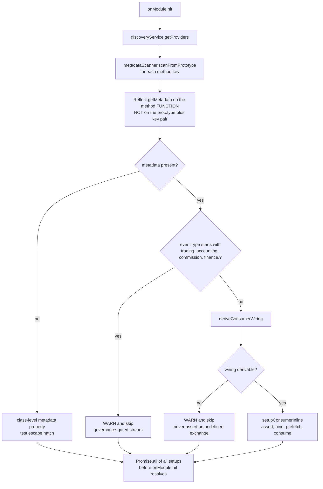
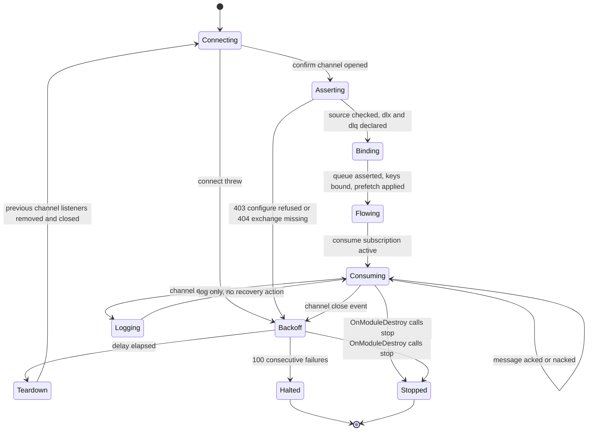
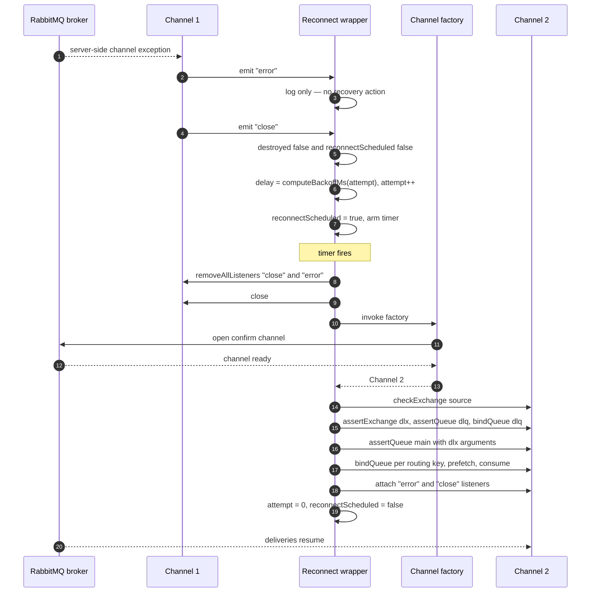
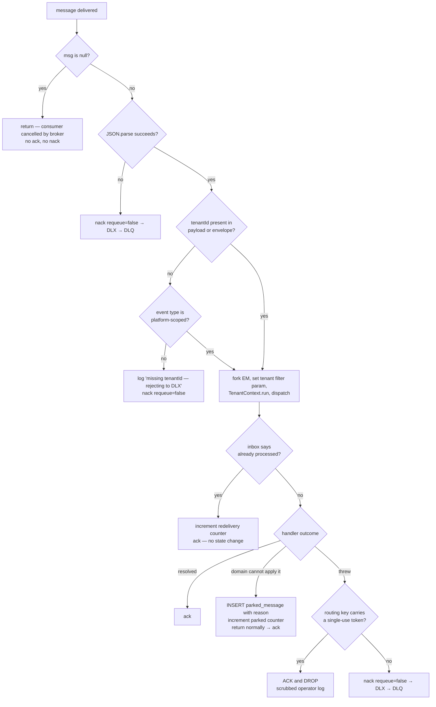
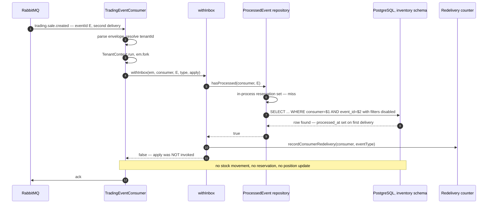

# Consuming — lifecycle, reconnection and idempotency

This document answers what actually happens between a message arriving on a queue and the
side effect it causes becoming durable: how a handler gets attached to a queue, what the
consumer asserts on the broker before it will accept anything, what happens when the channel
dies underneath it, and how the same message arriving twice is prevented from being applied
twice. Read it if you are writing a new consumer, debugging one that stopped consuming
silently, or trying to work out why a message ended up in a dead-letter queue instead of being
retried. It goes below [`backend/05-messaging.md`](../../backend/05-messaging.md) and
[`platform/integration-patterns.md`](../../platform/integration-patterns.md), which give the
shape; this gives the mechanism, the exact ordering, and the bugs each guard was added to fix.

---

## 1. The consumer census, and why there are four tiers of it

There is a shared library helper for wiring a consumer, and most consumers do not use it. That
is the single most important fact about consumption in this codebase, and every other
observation follows from it. Consumer wiring falls into four tiers with materially different
failure behaviour, and the tier is a property of when the class was written rather than of what
it consumes.

| Tier | Mechanism                                     | Shape in the file                                                    | Reconnects on channel close?            | Bounded?              | Clean shutdown?                                       |
| ---- | --------------------------------------------- | -------------------------------------------------------------------- | --------------------------------------- | --------------------- | ----------------------------------------------------- |
| A    | `setupRabbitConsumerWithReconnect` (library)  | One call in `onModuleInit`; the returned handle is kept for teardown | Yes                                     | Yes, 100 attempts    | Yes, via the returned handle                          |
| B    | Hand-rolled, hardened, copied shape           | ~120 lines of assert / consume / close-handler per class             | Yes                                     | Yes, 100 attempts    | Yes, `OnModuleDestroy`                                |
| C    | `setupRabbitConsumer` (library, no reconnect) | Bind once at `onModuleInit`, no `channel.on('close')` subscription   | **No**                                  | n/a                   | Partial at best — a buffer drain with no channel close |
| D    | Raw `setTimeout(setup, 5000)`                 | The pre-hardening reconnect, preserved by copy-paste                 | Yes, but unbounded and without teardown | **No**                | **No**                                                |

Tier B is a set of near-identical copies of the same 120 lines. That duplication is not an
accident of laziness — it predates the library helper. The library gained reconnect only
after the hand-rolled consumers already had it, and they were never migrated back onto it.
The library and the copies agree on every guard (see §4), which makes the duplication
currently benign and permanently fragile: a new property added to the helper has to be
hand-applied once per copy, and nothing fails if it is not.

Tier C is the real exposure, and it is the one worth being able to recognise on sight. A
consumer that binds its queue once at `onModuleInit` and never subscribes to
`channel.on('close')` stops consuming permanently the first time a broker restart or a network
partition closes the channel: the `consume` subscription dies with the channel, and the class
sits there for the lifetime of the pod with no error, no metric and no failing health check.
The underlying connection wrapper does auto-reconnect the _connection_
(`rabbitmq-connection.ts`, `onConnectionClose` → `scheduleReconnect`), which makes the
situation worse rather than better: the pod's `rabbitmq` health check goes back to `ok` while
the consumers behind it remain dead. **A liveness signal that reports the transport rather than
the subscription is worse than no signal, because it actively contradicts the symptom.**

Tier D is the pre-hardening pattern preserved in amber: `setTimeout(setupConsumer, 5000)`
scheduled from the close handler with no backoff, no jitter, no attempt cap, no re-entrancy
guard and no teardown of the previous channel — the exact code shape the reconnect hardening
described in §4 was raised to eliminate. Every reconnect leaks a channel and a close listener,
and each leaked listener re-fires on the next drop, so the retry rate compounds geometrically
against a broker that is already struggling.

---

## 2. Handler registration: the decorator, the explorer, and the gap between them

### 2.1 The decorator is metadata and nothing else

`@EventHandler` is a thin `SetMetadata` wrapper. It stores three fields and performs no
wiring:

```ts
export const EVENT_HANDLER_METADATA = "EVENT_HANDLER_METADATA";

export interface EventHandlerOptions {
  readonly eventType: string; // e.g. 'identity.user.login'
  readonly version?: number; // schema version; omitted means "all versions"
  readonly queue?: string; // consumer-group queue; auto-derived when absent
}

export const EventHandler = (options: EventHandlerOptions): MethodDecorator =>
  SetMetadata(EVENT_HANDLER_METADATA, options);
```

Note what the decorator deliberately does _not_ carry: no exchange, no routing key, no
dead-letter exchange. Those are derived, not authored, so that a handler author cannot bind a
queue to the wrong bounded context's exchange by typo. The JSDoc on the decorator states the
consumption contract in one sentence — _"Handlers MUST be idempotent — RabbitMQ guarantees
at-least-once delivery, so the same event may be delivered more than once"_ — which is the
policy §7 makes enforceable.

### 2.2 The explorer derives the whole wiring from the event type

`EventHandlerExplorer` is constructed with a Nest `DiscoveryService` and a `MetadataScanner`
plus either a live AMQP channel or a substitute setup function. At `onModuleInit` it walks
every provider instance, scans the prototype's methods, and for each method that carries the
metadata it derives a full `RabbitConsumerConfig`:



The derivation rules, from `deriveConsumerWiring`, are mechanical:

| Field                       | Rule                                                                                           | Example for `inventory.stock.reserved`             |
| --------------------------- | ---------------------------------------------------------------------------------------------- | -------------------------------------------------- |
| exchange                    | `acme.` + first dotted segment of `eventType`                                                  | `acme.inventory`                                   |
| routing key                 | `buildVersionedRoutingKey(eventType, version ?? 1)` — v1 is the bare type, v≥2 appends `.v<n>` | `inventory.stock.reserved`                         |
| queue                       | explicit `queue` option, else `<exchange>.consumer.<eventType>`                                | `acme.inventory.consumer.inventory.stock.reserved` |
| dead-letter exchange        | `<exchange>.dlx`                                                                               | `acme.inventory.dlx`                               |
| retention dead-letter queue | `<exchange>.dlq`                                                                               | `acme.inventory.dlq`                               |

Three details in that derivation are load-bearing. First, `deriveExchangeFromEventType`
returns `undefined` for a malformed type (empty, no dot, leading dot) and the caller warns and
skips rather than calling `assertExchange(undefined)` — asserting an undefined exchange name
is how a single typo takes a whole service's startup down. Second, the derived names must
match the Helm chart's RabbitMQ CRDs exactly (`dlx-exchange.yaml`, `dlq-queue.yaml`,
`dlq-binding.yaml` in the broker bootstrap chart), because a runtime `assertQueue` against a
pre-existing CRD-declared queue with different arguments closes the channel with
`PRECONDITION_FAILED`. The chart iterates `exchanges[]` and emits `<exchange>.dlx` and
`<exchange>.dlq` for exactly this reason. Third, the sensitive-stream gate: the explorer
refuses to wire any handler whose `eventType` begins with `trading.`, `accounting.`,
`commission.` or `finance.`, because ingesting those streams into a general-purpose consumer
requires an explicit data-governance approval first. The gate is at bounded-context-prefix
granularity rather than per-event, deliberately over-blocking, because over-blocking is the
safe direction for a data class you are not yet cleared to hold.

### 2.3 The bug that made the decorator a no-op, and the one that still does

Nest's `SetMetadata` on a _method_ stores the metadata on the method **function object**
(`Reflect.defineMetadata(key, value, descriptor.value)`), not on the `(prototype,
propertyKey)` pair. An explorer that reads `Reflect.getMetadata(KEY, proto, methodKey)` — the
obvious spelling — gets `undefined` every time. That was the original defect: the decorator
existed, handlers were annotated, and nothing was ever wired. The fix is visible in the
source as an explicit comment and the corrected read target:

```ts
const methodFn = (proto as Record<string, unknown>)?.[methodKey];
let metadata =
  typeof methodFn === "function"
    ? normalizeMetadata(Reflect.getMetadata(EVENT_HANDLER_METADATA, methodFn))
    : undefined;
```

The larger problem is not fixed. **`EventHandlerExplorer` is never instantiated in any
production module.** A repository-wide search finds it in the library barrel export, in its
own unit spec, and in a Testcontainers integration spec — and nowhere else. No `AppModule`,
no `EventBusModule` provider, no service bootstrap constructs it. `EventBusModule.forRoot`
provides `EventPublisher`, `RabbitMqConnection`, and conditionally `OutboxRelay` and
`OutboxReaper`; there is no explorer provider and no `DiscoveryModule` import.

The consequence is that **all 17 `@EventHandler` decorations in production code are inert**:
eleven in ai-service, two each in tenant-service, user-service and auth-service. The
user-service source says so in its own class doc — _"the `@EventHandler` decorator is a dead
no-op in production (no `EventHandlerExplorer` is ever instantiated), so relying on it left
user-service NEVER declaring/binding its queue and the first-admin invite never fired"_ — and
that service's response was to hand-roll a consumer for the one event it actually needed
(`platform.tenant.created`) and leave its two decorated handlers dead. The other two
decorated user-service handlers, `identity.user.login` and `platform.tenant.suspended`, are
fully implemented, carefully idempotent, and never invoked.

This is worth stating plainly because the decorator reads like a working registration
mechanism and is not one. Every consumer that works in this platform works because someone
wrote `channel.consume` by hand or called `setupRabbitConsumer` directly.

---

## 3. Consumer lifecycle: connect, assert, bind, consume, shut down

### 3.1 The declaration sequence, and why the order cannot be shuffled

`setupRabbitConsumer` is the canonical sequence. Reading it top to bottom is the fastest way
to understand what a healthy consumer has asserted before it accepts its first message:

```ts
await channel.checkExchange(config.exchange); // 1 passive
await channel.assertExchange(config.dlx, config.exchangeType, {
  durable: true,
}); // 2
if (config.dlq) {
  // 3
  await channel.assertQueue(config.dlq, {
    durable: true,
    arguments: { "x-queue-type": "quorum" },
  });
  await channel.bindQueue(config.dlq, config.dlx, "dead-letter"); // 4
}
await channel.assertQueue(config.queue, {
  // 5
  durable: true,
  arguments: {
    "x-queue-type": "quorum",
    "x-dead-letter-exchange": config.dlx,
    "x-dead-letter-routing-key": "dead-letter",
  },
});
for (const rk of routingKeys)
  await channel.bindQueue(config.queue, config.exchange, rk); // 6
await channel.prefetch(config.prefetch ?? 1); // 7
await channel.consume(config.queue, handler); // 8
```

Each step earns its position:

1. **The source exchange is checked passively, never asserted.** `checkExchange` issues
   `exchange.declare` with `passive=true`, which requires no `configure` permission — only
   that the exchange already exists. The source exchange belongs to the _publishing_ bounded
   context, and the broker ACLs deny `configure` on a foreign exchange, so an active
   `assertExchange` here returns `403 ACCESS_REFUSED - configure access to exchange '<x>'
refused` and crash-loops the pod. If the exchange genuinely does not exist yet, the
   passive check fails with a 404 that closes the channel, and the reconnect layer retries
   until the owning context or the bootstrap chart declares it.
2. **The dead-letter exchange is asserted before the queue that references it.** A quorum
   queue whose `x-dead-letter-exchange` names an undeclared exchange is rejected on some
   broker versions. It lives in the consumer's own `configure` namespace, so asserting it is
   permitted.
3. **The retention dead-letter queue is declared before the main queue.** A dead-letter
   exchange with no bound queue is a black hole: nacked messages route to it and are silently
   discarded. Declaring the DLQ _before_ the main queue guarantees the `dead-letter` binding
   exists by the time any message can possibly dead-letter.
4. **The binding key is the fixed string `dead-letter`,** matching the main queue's
   `x-dead-letter-routing-key` and the chart's `dlq-binding.yaml`. The DLX is typed `topic`
   but with a single fixed key it behaves as a direct exchange for this one route.
5. **`x-queue-type: quorum` is pinned explicitly** rather than inherited from the broker's
   `default_queue_type`, so that a redeclare never trips `PRECONDITION_FAILED` on inequivalent
   arguments against leftover classic-queue state.
6. **Bindings are per routing key.** A fanout source gets the empty key `''` — the code
   substitutes `['']` when `routingKeys` is absent or empty, which is what audit-service
   relies on for the audit-feed fanout.
7. **Prefetch before consume,** so the first delivery is already flow-controlled.
8. **`consume` last.** Nothing can be delivered until every assertion has succeeded.

### 3.2 The state machine



The two states worth dwelling on are `Logging` and `Halted`. `Logging` exists because amqplib
emits `error` and _then_ `close` for a single server-side channel exception; the `error`
listener must exist (an unhandled `error` event on an `EventEmitter` terminates the Node
process) but must not itself trigger recovery, or one failure produces two overlapping
recovery chains. `Halted` is a terminal state reached only after 100 _consecutive_ failures
and is deliberately loud: the log line reads `Max reconnect attempts (100) reached for
queue=<q> — manual intervention required`. It is the only place in the consumer path where
the platform gives up.

### 3.3 Shutdown

Clean shutdown is three actions in a fixed order: set the shutdown flag so nothing re-arms,
clear any pending reconnect timer, then tear down the live channel. In the hand-rolled tier
that is `onModuleDestroy` directly; in the library tier it is `handle.stop()`. Teardown itself
removes the `close` and `error` listeners _before_ closing, so the close it is about to cause
does not re-enter `scheduleReconnect`, and it swallows close errors at `debug` level because a
channel that is already gone is the expected case:

```ts
async function teardownCurrentChannel(): Promise<void> {
  const previous = currentChannel;
  currentChannel = null; // null FIRST — re-entrancy safety
  if (!previous) return;
  try {
    previous.removeAllListeners?.("close");
    previous.removeAllListeners?.("error");
    await previous.close?.();
  } catch (err) {
    logger.debug(
      `teardown: close error ignored (channel likely already closed): ...`
    );
  }
}
```

Two consumers have shutdown behaviour worth knowing about. Audit-service implements
`onModuleDestroy` only to `drain()` its in-memory buffer — it never closes the channel,
because it has no reconnect loop to stop. Notification-service resets its in-process
serialisation lock at the _start_ of every setup, not at teardown, because a reconnect that
chained new deliveries onto the previous channel's lock could ack a new channel's delivery tag
against the old, closed channel.

---

## 4. The hardened reconnect helper

Before the hardening work the library's consumer had no reconnect at all: a broker restart
or a network partition closed the channel and the consumer stopped, permanently and silently,
with the pod still passing its health checks. `setupRabbitConsumerWithReconnect` is the fix,
and each of its properties maps to a specific way the naive version was wrong. It takes a
channel _factory_ rather than a channel — that is what makes reconnect possible at all, since
each attempt must open a fresh channel from the (independently self-healing) connection.

### 4.1 Property one — the backoff counter resets on success

```ts
async function setup(): Promise<void> {
  await teardownCurrentChannel();
  const channel = await Promise.resolve(channelFactory());
  currentChannel = channel;
  await setupRabbitConsumer(channel, config, handler);
  channel.on('error', (err?: Error) => { logger.error(...); });      // log only
  channel.on('close', () => { if (destroyed) return; scheduleReconnect(); });
  attempt = 0;                                                        // <— the reset
}
```

**The bug it fixes.** If `attempt` counted cumulatively over the pod's lifetime, a long-lived
pod that survived a hundred isolated, individually-recovered blips over several weeks would
cross `DEFAULT_MAX_RECONNECT_ATTEMPTS` and stop consuming — reproducing exactly the silent-stop
failure the reconnect exists to prevent, just slower. Resetting on every successful setup means
the cap bounds an _unbroken failure streak_, which is the thing you actually want to give up
on. The source comment flags the reset as the guard against precisely that slow-motion
recurrence.

### 4.2 Property two — concurrent reconnect attempts are deduplicated

```ts
function scheduleReconnect(): void {
  if (destroyed || reconnectScheduled) return;      // <— the dedup
  if (attempt >= DEFAULT_MAX_RECONNECT_ATTEMPTS) { logger.error(...); return; }
  const delayMs = computeBackoffMs(attempt, { baseMs: 10, capMs: 30000, jitterMs: 5 });
  attempt++;
  reconnectScheduled = true;
  reconnectTimer = setTimeout(() => { /* ... */ }, delayMs);
}
```

**The bug it fixes.** amqplib emits `error` then `close` for one server-side channel
exception. If both events scheduled a reconnect you would get two independent backoff chains
racing: two channels opened, two `consume` subscriptions on the same queue, and one of the two
channels leaked with its listeners still attached. The platform closes this two ways at once —
recovery is driven from `close` **only** (`error` is log-only), _and_ `reconnectScheduled`
collapses duplicates even if a future change makes something else call `scheduleReconnect`.
Belt and braces, deliberately, because the failure mode is invisible until you notice every
message being handled twice.

### 4.3 Property three — the previous channel is torn down before a new one replaces it

`setup()` calls `teardownCurrentChannel()` as its very first statement, before the factory is
invoked. **The bug it fixes:** without it, N reconnects leak N amqplib channels and N `close`
listeners, and every leaked listener re-fires on the next drop — so reconnect attempts
multiply geometrically against a broker that is already in trouble — exactly what the Tier D
shape still does.

### 4.4 Property four — an explicit stop handle, and the adopter contract

```ts
export interface RabbitReconnectHandle {
  stop(): Promise<void>;
}
```

`setupRabbitConsumerWithReconnect` returns this handle. **The adopter contract is not
optional and is not enforced by the type system:**

> A caller **MUST** assign the returned handle to a field and **MUST** call `stop()` from
> `OnModuleDestroy`. A caller that ignores the return value has a consumer that survives its
> own module: during shutdown the backoff loop keeps calling the channel factory against a
> closing connection, producing an error-spam loop that impedes clean shutdown, and under a
> hot reload the previous consumer keeps its subscription while the new one binds alongside
> it — so every message is handled twice by two generations of the same handler.

`stop()` sets `destroyed = true` (so no `close` handler and no timer callback re-arms), clears
the pending timer, and tears down the live channel. The one adopter, user-service, does this
correctly:

```ts
private consumerHandle?: RabbitReconnectHandle;

async onModuleInit(): Promise<void> {
  this.consumerHandle = await setupRabbitConsumerWithReconnect<Record<string, unknown>>(
    () => this.rabbitMqConnection.createConfirmChannel(),   // factory, not a channel
    { exchange: 'acme.platform', exchangeType: 'topic',
      queue: 'user-service.platform.tenant.created',
      dlx: 'acme.platform.dlx', dlq: 'acme.platform.dlq',
      routingKeys: ['platform.tenant.created'], prefetch: 1,
      loggerLabel: 'user-service.platform.tenant.created' },
    (event) => this.handleTenantCreated(event)
  );
}

async onModuleDestroy(): Promise<void> {
  await this.consumerHandle?.stop();
}
```

### 4.5 Property five — a failed setup re-arms itself

The subtlest guard. When the delayed `setup()` rejects — broker still down, `checkExchange`
404s — nothing else will ever retry, because a failed setup never got as far as attaching a
`close` listener to the new channel. So the catch path re-arms explicitly:

```ts
setup()
  .then(() => {
    reconnectScheduled = false;
  })
  .catch((err: Error) => {
    reconnectScheduled = false;
    logger.error(
      `Reconnect setup failed for queue=${config.queue}: ${err.message} — retrying`
    );
    scheduleReconnect(); // a failed setup never attached a 'close' handler
  });
```

Note the ordering: `reconnectScheduled` is cleared _before_ `scheduleReconnect()` is called,
or the dedup guard would swallow the re-arm and the consumer would stop.

### 4.6 The backoff function

```ts
delayMs = min(baseMs · 2^attempt, capMs) + floor(random() · jitterMs)
```

`computeBackoffMs` throws on a non-integer or negative attempt, and clamps the `2^attempt`
overflow (which becomes `Infinity` on V8 at attempt ≥ 1024) down to `capMs` so no `NaN`
reaches `setTimeout`. Jitter is the point of the whole exercise: without it, every replica of
every service reconnects on the same schedule after a broker restart and re-storms it in
lockstep. The library defaults are 5 s base, 5 min cap, 1 s jitter, and
`DEFAULT_MAX_RECONNECT_ATTEMPTS = 100` — roughly eight hours of retrying at the cap.

**A real inconsistency:** the six hand-rolled Tier B consumers call `computeBackoffMs(attempt)`
with those defaults, while the library wrapper passes `{ baseMs: 10, capMs: 30000, jitterMs: 5 }` —
a 10-millisecond first delay and a 5-millisecond jitter window. Ten milliseconds is a
tight-loop retry against a broker that has just gone away, and 5 ms of jitter across replicas
is effectively no jitter at all. The values were introduced in the same commit that added the
wrapper's hardening tests, which run under fake timers and advance 500 ms; no comment in
source justifies them as a production choice. **Unverified:** whether these values are a
deliberate "recover fast, the connection layer absorbs the pressure" decision or test-tuned
constants that leaked into the production path. Treat the divergence as a live question, not
a documented design.

### 4.7 How it is tested

`setup-rabbit-consumer-reconnect.spec.ts` proves each property against a mock channel that is
a real `EventEmitter` substitute (a `listeners` map plus an `emit` helper), so the tests drive
the actual amqplib event contract rather than calling the reconnect function directly. The
three hardening regressions use **fake timers**, which is the only way to assert on a backoff
loop deterministically:

| Test                                                              | Technique                                                               | What it proves                                                                                                   |
| ----------------------------------------------------------------- | ----------------------------------------------------------------------- | ---------------------------------------------------------------------------------------------------------------- |
| collapses the `error`→`close` double-emit into a SINGLE reconnect | `vi.useFakeTimers()`, emit both events, `advanceTimersByTimeAsync(500)` | `channelFactory` called exactly twice (initial + one), not three times                                           |
| tears down the old channel before reconnecting                    | real timers, `vi.waitFor`                                               | `removeAllListeners('close')`, `removeAllListeners('error')` and `close()` each called once on the first channel |
| `stop()` ends the loop and closes the live channel                | fake timers, `stop()` then emit `close`, advance 500 ms                 | `channelFactory` still called exactly once — no reconnect after shutdown                                         |

`advanceTimersByTimeAsync` matters more than `advanceTimersByTime` here: the reconnect body is
`setTimeout(() => setup().then(...).catch(...))`, so firing the timer is not enough — the
microtask queue from the async `setup()` has to drain inside the same advance for the
assertion to see the second channel.

### 4.8 A reconnect, end to end



The sequence makes two things visible that the prose cannot. First, the `error` event
produces a log line and nothing else — the whole recovery hangs off `close`. Second, teardown
of channel 1 happens _inside_ the timer callback, after the delay, not at the moment the close
was observed; the wrapper holds the dead channel reference for the duration of the backoff so
that `stop()` arriving mid-backoff still has something to close.

---

## 5. Prefetch and concurrency

**Every consumer in the platform uses `prefetch(1)`.** There is no exception and no
configuration override in any deployed service — `RabbitConsumerConfig.prefetch` defaults to 1
and the only caller that sets it explicitly (user-service) sets it to 1.

The trade-off being made is throughput for three properties:

1. **Even distribution across replicas.** With prefetch 1 the broker hands a replica one
   message and waits for the ack before handing it another, so a slow message on one pod does
   not starve the others of work. With a high prefetch the broker front-loads a batch to
   whichever consumer connects first, and a pod that is mid-GC sits on a queue of unstarted
   messages while its siblings idle.
2. **Bounded memory per consumer.** Each unacked message is held in the client. Some payloads
   here are large — `trading.deal.locked` carries snapshots of every purchase, sale, haulage
   and overhead line on the deal — so a prefetch of 100 is a real memory commitment.
3. **Handler-level serialisation for free.** MikroORM's identity map is not concurrency-safe,
   and these handlers fork an `EntityManager` per message. Prefetch 1 means one in-flight
   message per consumer, which is the simplest available guarantee.

The third property is where it gets interesting, because prefetch 1 is _per consumer_, not per
channel, and notification-service opens **one** channel and calls `channel.consume` five times
on it — one per source bounded context (`communication`, `commission`, `accounting`,
`identity`, `platform`). Five consumers × prefetch 1 = up to five messages in flight on one
channel and one identity map.

The obvious fix is AMQP's channel-wide QoS, `basic.qos` with `global=true`. That was the
original implementation and it does not work here: **quorum queues reject channel-wide QoS
with `NOT_IMPLEMENTED`**, and every queue in this platform is a quorum queue. The failure
surfaced on integration boot. The replacement is an in-process promise chain:

```ts
private handlerLock: Promise<void> = Promise.resolve();

private async processMessage(channel: any, msg: any): Promise<void> {
  const myTurn = this.handlerLock.then(() => this.handleOne(channel, msg));
  this.handlerLock = myTurn.catch(() => undefined);   // a failure must not poison the chain
  await myTurn;
}
```

Two subtleties. The `.catch(() => undefined)` on the _stored_ chain — not on the awaited
promise — means one failing message rejects to its own caller (which nacks it) without turning
every subsequent link into a rejected promise. And `handlerLock` is reset to
`Promise.resolve()` at the top of `setupConsumer`, because after a reconnect the new channel's
deliveries must not queue behind an in-flight handler holding a delivery tag from the old,
closed channel.

**What tuning prefetch upward would cost.** Raising it is safe only for a consumer whose
handler holds no shared mutable state and whose per-message work is genuinely independent —
the reporting-service projection consumers are the plausible candidates. For any consumer
using the inbox (§7) it is safe from a correctness standpoint but increases the concurrent-race
rate, pushing more deliveries down the `UniqueConstraintViolationException` path instead of the
cheap probe path. For notification-service it would require raising the in-process lock's
concurrency too, at which point the identity-map guarantee has to be re-established some other
way. Nobody has needed the throughput yet, which is why the value is 1 everywhere.

---

## 6. Ack strategies

### 6.1 The three outcomes, and the one that is never used

| Outcome             | Call                              | When                                                                    | Message ends up                                                            |
| ------------------- | --------------------------------- | ----------------------------------------------------------------------- | -------------------------------------------------------------------------- |
| Ack                 | `channel.ack(msg)`                | handler resolved, or the inbox deduplicated it, or the domain parked it | consumed, gone                                                             |
| Nack to dead-letter | `channel.nack(msg, false, false)` | handler threw, JSON unparseable, tenant missing                         | `<queue>` → `x-dead-letter-exchange` → `<exchange>.dlx` → `<exchange>.dlq` |
| Nack with requeue   | `channel.nack(msg, false, true)`  | **never**                                                               | back on the head of the same queue                                         |

Every one of the 14 `nack` call sites in production code passes `requeue = false`. There is no
requeue anywhere in this platform, and that is a policy, not an oversight.

**The infinite-redelivery trap.** `nack(msg, false, true)` returns the message to the front of
the queue, where the same consumer immediately picks it up, fails the same way, and requeues
it again. AMQP has no delivery counter that stops this and no built-in backoff. With
prefetch 1 the result is a single consumer spinning on one message at full CPU, blocking every
other message on that queue indefinitely — a total outage of one bounded context's event
consumption, caused by one malformed payload. Because the failure is a hot loop rather than a
crash, the pod stays "healthy" and the queue depth stays flat, so it is genuinely hard to
spot. The platform's answer is that a message either succeeds, is quarantined in a domain
table, or is dead-lettered — but it is never handed back to the same code that just rejected
it.

One documentation artefact contradicts this. ai-service's `kill-switch.service.ts` states in
its JSDoc that _"RabbitMQ consumers check this flag and nack with requeue"_. No such code
exists; the mismatch is already recorded as defect (d) in ADR-0047. ai-service's consumers are
inert regardless (they are decorator-only, per §2.3), so nothing depends on the claim.

### 6.2 The decision tree



Reading the tree bottom-up gives the four decision rules.

**Ack when the handler resolved.** The default. Note that the ack happens _after_ the handler
returns, not before — the audit-service consumer flushes its buffer per message precisely so
that "acked" and "persisted" mean the same thing, with an explanatory comment saying batching
can return later with explicit delivery-tag tracking.

**Ack when the inbox deduplicated.** A redelivery of an already-applied event is a success,
not a failure. Acking it is the whole point of the inbox.

**Ack when the domain parked it.** A validly-delivered event the domain cannot apply — an
invoice-processed event for a source entity that is not `FINALISED`, or one whose entity
cannot be resolved — is recorded in `parked_message` and the handler returns _normally_, so
the message acks. Dead-lettering it would be wrong: the message is not poison, the domain
state is simply not ready, and a DLQ payload is a far worse operational surface than a
queryable row with a reason column.

**Ack and drop when the payload carries a live credential.** The one genuinely surprising
rule. Notification-service's invite and password-reset events carry a raw, single-use token in
the body. A pre-send failure on one of those would normally nack to
`notification-service.platform.dlq` — where the raw token then sits at rest until someone
reprocesses the queue, defeating the "no usable token at rest" guarantee the token-hashing
work established. So those two routing keys are acked and dropped, with a **scrubbed** operator
log (routing key and cause only, never `msg.content`):

```ts
const TOKEN_BEARING_ROUTING_KEYS: ReadonlySet<string> = new Set([
  "platform.user.invited",
  "identity.password.reset-requested",
]);
// ...
if (TOKEN_BEARING_ROUTING_KEYS.has(routingKey)) {
  this.logger.error(
    `Pre-send failure on token-bearing event ${routingKey} — ACKED (not dead-lettered) ` +
      `to avoid retaining the raw token at rest; resend to retry. Cause: ${message}`
  );
  channel.ack(msg);
  return;
}
```

The decision is made from `msg.fields.routingKey` rather than the parsed body, deliberately —
it has to be reliable even when the body is what failed to parse. Recovery is a human resend,
which mints a fresh token; the dropped message is not recoverable and is not meant to be.

**Nack without requeue for everything else.** Unparseable JSON, a missing or forged tenant
identifier, and any handler exception. The message goes to the bounded context's dead-letter
exchange and is retained in the bound quorum DLQ for inspection.

### 6.3 The tenant guard is part of the ack decision

Every hand-rolled consumer validates the tenant before dispatching, and rejects to the
dead-letter exchange if it cannot. User-service goes furthest, and its three checks are worth
copying:

```ts
if (!payloadTenantId || !UUID_REGEX.test(payloadTenantId))
  throw new Error(
    `... payload.tenantId missing or not a UUID ... — rejecting to DLX`
  );

if (event.tenantId !== payloadTenantId)
  // envelope/payload cross-check
  throw new Error(
    `... tenantId mismatch (envelope=..., payload=...) — rejecting to DLX`
  );

if (!event.userId || !UUID_REGEX.test(event.userId))
  throw new Error(
    `... missing or non-UUID userId (inviter) — rejecting to DLX`
  );
```

The middle check is a security control, not a data-quality one. Inter-service events are
unsigned, so any principal holding `write` on `acme.platform` could forge `payload.tenantId`
and have user-service provision a rogue administrator into an arbitrary tenant. The envelope
`tenantId` is set by the publisher from the aggregate identifier; requiring the two to agree
raises the bar from "can publish" to "can publish a self-consistent forgery", and the mismatch
dead-letters rather than being silently corrected. The check is per handler, though, which is
the weakness of the design: a consumer that reads `event.tenantId` straight from the envelope
into the row it persists inherits nothing from the handler next door that cross-checks. A
guard that has to be written out in each handler is a convention, and §4's argument about
copied code applies to security controls with more force than it does to reconnect logic.

---

## 7. The inbox pattern

### 7.1 Why it is platform policy rather than per-service taste

At-least-once delivery is not a theoretical concern here. Three independent mechanisms produce
duplicates: the transactional outbox re-publishes on crash recovery, the broker redelivers on
an unacked channel close, and a consumer that times out mid-handler has its message returned
to the queue. Before ADR-0072 **no** consumer deduplicated, and the concrete consequence was
that inventory-service's eight `trading.#` handlers would double-apply stock movements and
reservations on redelivery — silently corrupting stock positions in a way that only a
reconciliation job would ever notice.

The obvious alternative, "make every handler naturally idempotent", was rejected explicitly in
the ADR because natural idempotency must be re-proven for every handler forever, gives no
transactional guarantee, and has no observable signal when it fails. Redis was not available
either: it is cache-only in this platform by an earlier decision, and dedup has to be
transactional with the state change it guards.

> **ADR-0072 — Platform inbox, idempotency-key, and parked-message stores as per-service
> PostgreSQL tables** (Accepted, platform-wide convention; trading and inventory are the
> reference implementations). Three small tables per service, in that service's own schema:
> `processed_event` (the inbox), `idempotency_key` (HTTP retry dedup), `parked_message`
> (domain quarantine). "This upgrades at-least-once delivery to **effectively-once
> processing**."

Per-service tables rather than a shared store is itself a decision: a shared dedup service
cannot participate in the consuming service's transaction, and crossing schemas would break
the per-context schema isolation that ADR-0013 establishes.

### 7.2 The table

Both reference implementations declare the identical shape. The inventory migration:

```sql
create table "inventory"."processed_event" (
  "consumer"     text        not null,
  "event_id"     text        not null,
  "processed_at" timestamptz not null,
  constraint "processed_event_pkey" primary key ("consumer", "event_id")
);
```

Four properties of that four-line table carry the whole design:

1. **The primary key is composite `(consumer, event_id)`,** not `event_id` alone. Two logical
   consumers of the same event are independent dedup namespaces — inventory's
   `inventory-trading-event-consumer` and trading's `trading-invoice-processed-consumer` can
   both process event `E` exactly once each. The consumer identity is a module-level constant,
   exported from the inbox barrel, so it cannot drift per call site.
2. **Both key columns are `text`, not `uuid`.** Event identifiers are opaque strings by
   contract. The envelope documents `eventId` as a UUID v7, but the contract does not
   _enforce_ it, and the test fixtures use ids like `evt-200`. A `uuid` column would reject
   those and break dedup for anything that ever publishes a non-UUID id.
3. **There is no surrogate id and no tenant column,** and the entity is deliberately _not_ a
   tenant base entity. The dedup identity carries no tenant-owned data.
4. **There is no index beyond the primary key,** because the only access path is an exact
   lookup on the full key.

The absence of a tenant column has a consequence that bit both implementations. The production
ORM registers a global, **fail-closed** tenant filter that throws when it runs without tenant
context — and the RabbitMQ consumer path forks a raw EntityManager without seeding filter
params. So every inbox read must disable the filter explicitly:

```ts
const existing = await this.em.findOne(
  ProcessedEvent,
  { consumer, eventId },
  { filters: false } // NO_FILTER — tenant-exempt row, fail-closed filter would throw
);
```

Forgetting this does not produce a wrong answer; it produces a thrown exception from a filter
that has no tenant to scope by, which the consumer then nacks to the dead-letter queue. It is
a loud failure, which is the correct trade for a fail-closed control.

### 7.3 The two legal orderings, and why there are exactly two

The ADR says the inbox row is "inserted **in the same transaction** as the state change". One
of the two reference implementations does that. The other cannot, and the reason is worth
understanding because it decides which ordering _any_ new consumer must use.

**Trading-service — record then apply, one transaction.** Every write in
`InvoiceProcessedHandler` goes through the same transactional EntityManager, so the whole unit
of work is atomic:

```ts
await em.transactional(async (tx) => {
  const inbox = new MikroOrmProcessedEventRepository(tx);
  const firstDelivery = await inbox.recordOnce(
    INVOICE_PROCESSED_CONSUMER,
    event.eventId
  );
  if (!firstDelivery) {
    TradingMetrics.recordConsumerRedelivery(
      INVOICE_PROCESSED_CONSUMER,
      event.eventType
    );
    return; // duplicate — no state change, transaction commits empty
  }
  // resolve source, validate tenant, guard state, transition, re-derive, project
});
```

The inbox insert, the `FINALISED → INVOICED` transition, the deal-status re-derivation and the
activity projection row all commit or all roll back. Recording first is safe _because_ of the
shared transaction: if anything downstream throws, the inbox row rolls back with it and the
redelivery re-runs cleanly.

**Inventory-service — apply then record, no shared transaction.** Inventory's stock
repositories persist through per-operation forked EntityManagers — each `save()` is its own
transaction — so no caller transaction can span the inbox insert and every stock write. Given
that, recording first would be the ADR's own named anti-pattern: mark the event processed, then
lose the state change to a crash, and the redelivery is deduplicated into a permanent no-op.
So `withInbox` inverts the order:

```ts
export async function withInbox(
  em: EntityManager,
  consumer: string,
  eventId: string,
  eventType: string,
  apply: () => Promise<void>
): Promise<boolean> {
  const inbox = new MikroOrmProcessedEventRepository(em);

  if (await inbox.hasProcessed(consumer, eventId)) {
    recordConsumerRedelivery(consumer, eventType);
    return false; // deduplicated redelivery
  }

  await apply(); // side effects FIRST
  await inbox.recordOnce(consumer, eventId); // then the ledger entry
  return true;
}
```

A crash between `apply()` and `recordOnce` simply re-runs `apply()` on redelivery, which is
safe **only because every inventory handler is independently idempotent** at the effect level:
`stock_movement.event_id` is a `UNIQUE` index keyed `{eventId}:{lineItemId}`, so the second
attempt loses the movement INSERT and is caught as a benign duplicate before any reservation
or position write happens.

**The rule this yields.** Record-then-apply requires one transaction spanning both. If your
persistence topology cannot give you that, you must apply first _and_ have per-effect
idempotency underneath. What you may never do is record first without a shared transaction.
The two orderings are decided by persistence topology, not preference.

### 7.4 Duplicate rejection, step by step



The important negative space in that diagram is between `withInbox` returning `false` and the
ack: nothing happened. No handler ran, no row changed, no event was published. The delivery is
consumed and the counter increments — which is the only externally visible trace that a
redelivery occurred at all.

### 7.5 The concurrency layers

`recordOnce` in inventory defends against duplicates at three levels, in order:

```ts
async recordOnce(consumer: string, eventId: string): Promise<boolean> {
  const key = MikroOrmProcessedEventRepository.key(consumer, eventId);

  // (1) SYNCHRONOUS in-process reservation — before the first await
  if (this.reserved.has(key)) return false;
  this.reserved.add(key);

  // (2) already durably recorded by another EM or a prior run?
  const existing = await this.em.findOne(ProcessedEvent, { consumer, eventId }, { filters: false });
  if (existing) return false;

  const row = new ProcessedEvent();
  row.consumer = consumer; row.eventId = eventId;
  this.em.persist(row);
  try {
    await this.em.flush();
  } catch (error) {
    // (3) cross-instance race lost on the composite PK — benign duplicate
    if (error instanceof UniqueConstraintViolationException) return false;
    throw error;
  }
  return true;
}
```

Layer 1 is subtle and easy to get wrong: the reservation set must be mutated **before the
first `await`**, because that is the only point at which JavaScript guarantees two concurrent
calls cannot interleave. Once you `await`, a sibling call on the same instance can run its own
check against unchanged state. The key is `consumer + "\0" + eventId` — a NUL separator so
no consumer name containing a dot or colon can collide with an event id.

Layer 2 is the cheap common case. Layer 3 is the only _guarantee_: the composite primary key.
Catching `UniqueConstraintViolationException` and reporting `false` rather than re-throwing is
what turns a lost race into an ack instead of a dead-letter — without it, the losing delivery
of a concurrent redelivery pair would crash out of the handler and be nacked as poison.

**The trading implementation omits layer 1.** Its `recordOnce` has no `reserved` set,
relying entirely on the database read and the primary key. That is correct — its handler runs
inside `em.transactional`, so two concurrent deliveries are two database transactions and the
primary key arbitrates — but it means the two "same table shape" reference implementations are
not the same code, and a reader who assumes symmetry will be surprised.

### 7.6 The redelivery metric

Every deduplicated redelivery increments a counter labelled by consumer and event type:

| Service   | Metric                                       | Where                                       |
| --------- | -------------------------------------------- | ------------------------------------------- |
| inventory | `acme_inventory_consumer_redeliveries_total` | `stock/inbox/consumer-redelivery.metric.ts` |
| trading   | `acme_trading_consumer_redeliveries_total`   | `observability/trading-metrics.ts`          |

Both are deliberately dependency-free: the Platform services do not vendor a Prometheus client,
so each is a `Map<labelKey, number>` with `record`, `get`, `snapshot` and a test-only `reset`.
Trading's is read each collection cycle by an OpenTelemetry bridge and published through the
platform's existing OTLP exporter; inventory's has a `snapshotConsumerRedeliveries()` waiting
for the same treatment. Inventory's file states the exposition endpoint is future work.

The metric is not decoration. A redelivery counter that climbs steadily means the broker or
the outbox is producing duplicates faster than expected — a signal you cannot get from queue
depth, because deduplicated messages ack normally and leave no backlog. Inventory also
increments it from _inside_ `SaleCreatedHandler` when the per-effect `UNIQUE` index catches a
duplicate, so both the inbox path and the per-effect path are visible under the same name.

---

## 8. Poison messages

### 8.1 How one is recognised

A poison message is defined operationally rather than structurally: it is any message whose
processing throws, at any point, that is not one of the two recognised non-failures
(deduplicated redelivery, domain-parked event). In practice the categories are:

| Category                                                         | Recognised by                                       | Retryable?                              |
| ---------------------------------------------------------------- | --------------------------------------------------- | --------------------------------------- |
| Malformed envelope                                               | `JSON.parse` throws in the consume callback         | No                                      |
| Missing or non-UUID tenant identifier                            | explicit guard before dispatch                      | No                                      |
| Envelope/payload tenant mismatch                                 | explicit cross-check                                | No — treated as a forgery attempt       |
| Unknown or unmapped event type                                   | falls through the dispatch switch to `logger.debug` | n/a — acked, not an error               |
| Handler exception, transient (database down, downstream timeout) | anything else thrown                                | Yes, but the platform does not retry it |
| Handler exception, permanent (schema drift, impossible state)    | anything else thrown                                | No                                      |

The platform makes **no attempt to distinguish transient from permanent** at the consumer
boundary. Every throw takes the same exit. Exactly one place in the codebase tries to
classify, and it does so by string matching on the failure reason:

```ts
// document-generation-worker.ts
const isPermanent =
  reason.includes("not found") ||
  reason.includes("cannot be empty") ||
  reason.includes("validation");
if (!isPermanent) {
  throw error; // re-throw so the outer catch nacks to the DLX
}
```

Permanent failures are swallowed (the document row is already marked failed and an event
published), transient ones are re-thrown to dead-letter. Matching on substrings of an error
message is fragile — a reworded exception silently flips a message from one path to the other
— and it is the only classification logic of its kind in the platform.

### 8.2 The path a poison message takes

```text
consumer queue                          (nack requeue=false)
  └─ x-dead-letter-exchange: <exchange>.dlx
     x-dead-letter-routing-key: dead-letter
        └─ <exchange>.dlx  (topic, durable, declared by chart CRD and asserted at startup)
             └─ binding routingKey = "dead-letter"
                  └─ <exchange>.dlq  (quorum, durable — terminal retention)
```

The dead-letter queue is **terminal**. There is no message TTL on any queue in this platform —
a repository-wide search for `x-message-ttl` in charts and application code returns nothing —
so there is no automatic path from the dead-letter queue back to the main queue. A message
that dead-letters sits in the retention queue until an operator does something about it.

This directly contradicts ADR-0072's own Context section, which asserts that _"DLX+TTL
re-queue already exists as transport-level retry"_. It does not exist. The dead-letter chain
declared by `dlq-queue.yaml` and `dlq-binding.yaml` is retention only. The consequence is that
a transient failure — the database briefly unavailable, a downstream call timing out — is not
retried at all: the message dead-letters on the first attempt and requires manual reprocessing.
That is a meaningful gap between the documented design and the as-built behaviour, and it is
the strongest argument for the parked-message table, which at least gives the _domain-level_
failures a queryable, replayable home.

Reprocessing is operator-driven and, per the operational notes, non-trivial: dispatch is keyed
on the body's `eventType`, and re-publishing from within a pod requires a temporary
`<service>.reprocess` exchange because the broker ACLs refuse both the default exchange and
the owning context's exchange to a consumer principal. Confirm-then-ack is used so a failed
re-publish does not lose the dead-lettered copy.

### 8.3 Parked messages are not poison

The distinction is easy to lose and matters operationally:

|                   | Dead-letter queue                 | `parked_message` table                                                                |
| ----------------- | --------------------------------- | ------------------------------------------------------------------------------------- |
| What put it there | the message **failed** to process | the message processed fine and **cannot be applied**                                  |
| Where it lives    | AMQP queue, opaque binary payload | PostgreSQL row in the service's own schema                                            |
| Reason recorded   | none                              | `INVALID_STATE` or `UNRESOLVABLE_ENTITY`                                              |
| Queryable         | only by draining the queue        | `SELECT ... FROM <schema>.parked_message WHERE event_id = ...`, indexed on `event_id` |
| Signal            | queue depth                       | `acme_<service>_parked_messages_total`, labelled consumer / event type / reason       |
| The message was   | nacked                            | **acked**                                                                             |

The parked row captures tenant, consumer, event id, event type, source entity type and id,
the full payload as `jsonb`, the reason and a timestamp, with an index on `event_id`. The
table has no uniqueness constraint — it is an append-only quarantine journal, so the same
event parked twice for two different reasons leaves both rows. And critically, parking happens
_inside the same transaction as the inbox insert_ in the trading implementation, so a parked
event is recorded as processed and will not be re-parked on redelivery.

---

## 9. Verified drift — what source says versus what source does

Documenting these honestly is the point of a reference. Every item below was confirmed by
reading both sides.

1. **`@EventHandler` is inert in production.** `EventHandlerExplorer` exists, is exported, is
   unit-tested and Testcontainer-tested, and is instantiated by no production module. 17
   decorations across ai-service (11), tenant-service (2), user-service (2) and auth-service
   (2) wire nothing. User-service documents this in its own source and works around it.

2. **The no-reconnect tier still exists.** Consumers wired with `setupRabbitConsumer` (no
   reconnect wrapper) never subscribe to `channel.on('close')`. A channel drop stops them
   permanently while the pod's `rabbitmq` health check — driven by the auto-recovering
   _connection_ — continues to report `ok`. The library offering two setup functions whose
   names differ by a suffix is the root cause: the weaker one is the shorter name and the
   older import.

3. **The pre-hardening reconnect survives in the codebase.** A bare
   `setTimeout(setupConsumer, 5000)` with no backoff, no cap, no dedup guard, no teardown and
   no shutdown flag is still reachable — the exact pattern the reconnect hardening was raised
   to remove, and in one case in the same service whose _other_ consumer was migrated. A
   hardening pass that migrates by grep finds the call sites that match the grep.

4. **The library wrapper's backoff constants diverge sharply from every other caller.**
   `setupRabbitConsumerWithReconnect` passes `{ baseMs: 10, capMs: 30000, jitterMs: 5 }`; the
   six hand-rolled consumers use the library defaults of 5000 / 300000 / 1000. **Unverified:**
   whether the 10 ms base is deliberate or test-tuned.

5. **ADR-0072's Context claims a DLX+TTL re-queue retry that does not exist.** No queue in any
   chart or any consumer sets `x-message-ttl`. The dead-letter queue is terminal retention,
   so transient failures get no automatic retry at all.

6. **A stale ADR cross-reference.** `InvoiceProcessedHandler`'s JSDoc cites
   `docs/adr/0068-platform-inbox-idempotency-parked-message-pg-tables.md`. ADR-0068 is the
   wildcard-TLS decision; the inbox ADR is **0072**. Every other reference in the same file
   says 0072.

7. **The two "same table shape" inbox implementations are not the same code.** Inventory's
   repository has a synchronous in-process reservation set; trading's does not. Inventory
   records the inbox row _after_ `apply()`; trading records it _before_, inside one
   transaction. Both are correct for their persistence topology, and the ADR describes only
   the trading ordering.

8. **`setupRabbitConsumer`'s JSDoc promises a return value it does not produce.** It states
   `@returns the consumer tag returned by channel.consume`; the signature is
   `Promise<void>` and the consumer tag is discarded. Nothing can cancel an individual
   consumer by tag as a result.

9. **A documented nack-with-requeue contract that no code implements.**
   `kill-switch.service.ts` says consumers "nack with requeue"; all 14 production nack sites
   pass `requeue = false`. Already recorded as defect (d) in ADR-0047, and moot while
   ai-service's consumers are inert.

10. **Prefetch is 1 everywhere, uniformly, and the channel-wide alternative is unavailable.**
    Quorum queues reject `basic.qos` with `global=true` (`NOT_IMPLEMENTED`), which is why
    notification-service enforces single-flight in process with a promise chain rather than at
    the AMQP layer.

---

## Where this connects

**Survey documents this deep-dive sits below.** Read these first if you want the shape rather
than the mechanism — this document deliberately does not repeat their content.

- [`backend/05-messaging.md`](../../backend/05-messaging.md) — broker topology, the naming
  grammar, the message lifecycle end to end, credentials and permission regexes, and the
  reconnect state machine in summary form. §7 there is the one-screen version of §4 here.
- [`platform/integration-patterns.md`](../../platform/integration-patterns.md) — the
  transactional outbox, the three ADR-0072 tables side by side, the two legal inbox orderings,
  HTTP idempotency keys, and dead-letter replay. §2 there is the summary of §7 here.
- [`platform/event-catalog.md`](../../platform/event-catalog.md) — the envelope fields this
  document parses, the per-context event taxonomy, and the versioned routing-key scheme that
  `buildVersionedRoutingKey` implements in §2.2.
- [`backend/03-data-architecture.md`](../../backend/03-data-architecture.md) — the fail-closed
  global tenant filter and the forked-EntityManager convention that force every inbox read to
  pass `{ filters: false }` (§7.2) and every consumer to fork per message (§6.2).

**Sibling deep-dives.** The other four documents in this folder cover the rest of the broker
story.

- [`01-topology.md`](./01-topology.md) — the vhost, exchanges, queues and bindings this
  document asserts against, and the chart that declares them ahead of any consumer.
- [`02-publishing.md`](./02-publishing.md) — the publish and outbox-relay path this document
  is the mirror of, including the duplicate sources §7.1 has to defend against.
- [`04-failure-atlas.md`](./04-failure-atlas.md) — dead-letter operations, and the
  symptom-to-cause sheets for every failure §3, §6 and §8 describe.
- [`05-testing-the-broker.md`](./05-testing-the-broker.md) — what the reconnect and inbox
  tests in §4.7 and §7 actually prove, and which tiers of the suite gate a merge.

Two related deep-dive sets sit alongside this folder: the event-contract series, which starts
at [`../events/01-event-anatomy.md`](../events/01-event-anatomy.md), and the tenancy series,
where the fail-closed tenant filter and the `TenantContext` mechanics referenced throughout §6
and §7 are developed properly — see
[`../multi-tenancy/03-propagation.md`](../multi-tenancy/03-propagation.md) and
[`../multi-tenancy/04-enforcement.md`](../multi-tenancy/04-enforcement.md).

**Decisions cited here.**

| ADR      | Title                                                                             | Used in                                         |
| -------- | --------------------------------------------------------------------------------- | ----------------------------------------------- |
| ADR-0013 | Per-bounded-context database schemas                                              | §7.1 — why the inbox is per service             |
| ADR-0017 | RabbitMQ for unified inter-service messaging                                      | §1, §3                                          |
| ADR-0026 | Audit-feed fanout exchange                                                        | §3.1, §6                                        |
| ADR-0036 | Versioned routing keys                                                            | §2.2                                            |
| ADR-0047 | AI signal event taxonomy                                                          | §2.2 financial gate, §6.1 requeue contradiction |
| ADR-0072 | Inbox, idempotency-key and parked-message stores as per-service PostgreSQL tables | §7, §8                                          |
