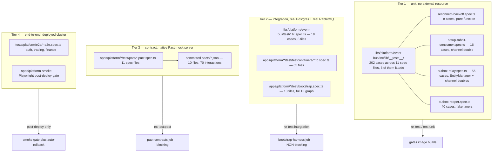
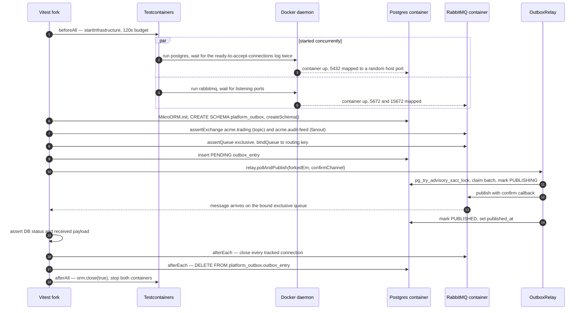
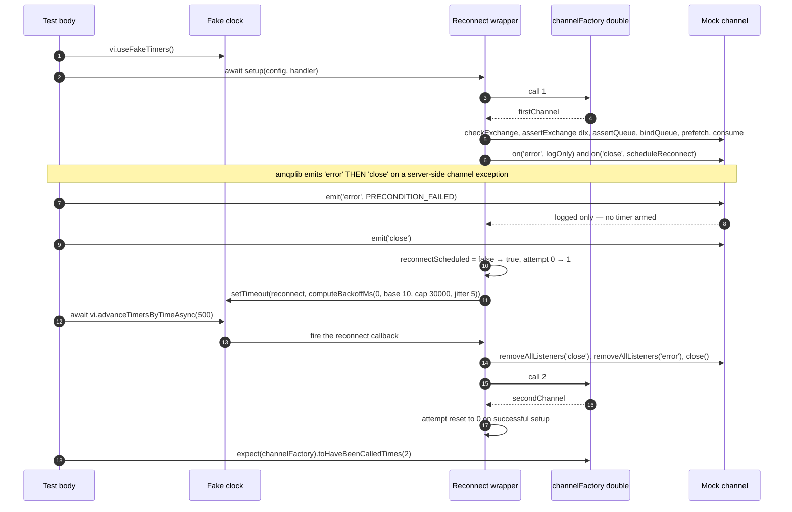

# Testing the Broker

This document answers a narrow, uncomfortable question: for a platform whose correctness
depends on asynchronous messaging, what is actually _proved_ before a commit reaches a
cluster, and what is merely hoped for? It walks the four test tiers that exist here — pure
unit, real-broker integration via Testcontainers, Pact contract, and end-to-end — naming the
real suite files, the exact Vitest and Nx configuration that runs them, the CI jobs that gate
(or fail to gate) on them, and the specific places where a suite passes for the wrong reason
or does not run at all. Read it if you are about to change the outbox relay, a consumer
reconnect loop, an event payload, or a CI workflow, and you want to know what your safety net
is really made of.

The companion survey [`backend/05-messaging.md`](../../backend/05-messaging.md) describes the
broker topology itself; this page is about the harness around it.

---

## 1. The pyramid as it actually exists

There are four tiers, and they are separated not by testing philosophy but by _what resource
they contend for_. Unit specs contend for nothing and run six-wide. Testcontainers specs each
spawn a Postgres and a RabbitMQ container and must be serialised. Pact specs each spawn a
native mock-server binary and must be serialised for a different reason. End-to-end specs need
a deployed cluster and therefore cannot run before merge at all.

That contention, not taxonomy, is why each tier has its own Nx target and its own Vitest
config file.



The shape is deliberately not a clean triangle. Tier 1 is broad and blocking. Tier 2 is broad
but explicitly **non-blocking** (see §6). Tier 3 is narrow, blocking, and — as §5 argues —
proves considerably less than its name suggests. Tier 4 asserts nothing at all about the
broker.

The mechanical separation is expressed in one shared factory,
`libs/platform/service-bootstrap/src/testing/vitest-config.ts`, which every service's Vitest
config reduces to three lines. It takes a `mode` and derives the include glob, the pool, the
timeouts, the retry budget and whether coverage is collected:

| Mode             | Include glob                                                                              | Pool                                       | Timeout | Retry in CI | Coverage |
| ---------------- | ----------------------------------------------------------------------------------------- | ------------------------------------------ | ------- | ----------- | -------- |
| `unit` (default) | `src/**/*.spec.ts`, `test/**/*.spec.ts` minus bootstrap, `*.tc.spec.ts`, `*.pact.spec.ts` | forks, `singleFork: true`, `isolate: true` | 30 s    | 0           | v8, lcov |
| `integration`    | `test/bootstrap.spec.ts`, `test/**/*.tc.spec.ts`                                          | forks, `singleFork: true`                  | 120 s   | 0           | none     |
| `pact`           | `test/**/*.pact.spec.ts`                                                                  | forks, `singleFork: true`                  | 120 s   | **4**       | none     |

Two of those numbers are scar tissue and the config says so. The 30-second unit timeout is
headroom for "the timer-heavy outbox-relay / outbox-reaper specs … [which] lose vitest's
DEFAULT 5s wall-clock race under CI CPU contention". The `singleFork: true` on the _unit_
mode is stranger and more interesting: it exists so that total test concurrency equals
`NX_PARALLEL` rather than exceeding it. With per-file forks, six services multiplied by N
files produced dozens of Node processes on an eight-core runner, and the timer-heavy reconnect
specs then lost their wall-clock race on a different lottery-winning service every run.

The `isolate: true` flag alongside it addresses the other half of the same problem: with
Vitest's default `threads` pool, one process is shared across files, so any spec that calls
`vi.useFakeTimers()` or spies on a Node intrinsic can leak that mutation into a sibling file.
Forks cost roughly ten to twenty per cent extra start-up and buy a dedicated V8 isolate per
file. For a codebase this dependent on fake timers, that is a good trade.

---

## 2. Tier 1 — what a channel double can and cannot prove

### 2.1 Pure functions: the backoff schedule

`libs/platform/event-bus/src/lib/reconnect-backoff.ts` exports a single pure function. Its
entire contract is:

```text
delayMs = min(baseMs * 2^attempt, capMs) + uniformRandom(0..jitterMs)
```

The function takes an optional `random: () => number` injection point whose doc comment says
"Production callers should never set this". That one parameter is what makes the schedule
testable without a clock at all — the eight cases in `reconnect-backoff.spec.ts` are ordinary
arithmetic assertions:

```ts
it("doubles with each attempt up to the cap", () => {
  const fixed = { baseMs: 1000, capMs: 60000, jitterMs: 0, random: () => 0 };
  expect(computeBackoffMs(0, fixed)).toBe(1000);
  expect(computeBackoffMs(6, fixed)).toBe(60000); // capped (64000 > 60000)
});

it("does not overflow at large attempt counts", () => {
  const fixed = { baseMs: 5000, capMs: 300000, jitterMs: 0, random: () => 0 };
  expect(computeBackoffMs(2000, fixed)).toBe(300000);
});
```

The overflow case is not padding. `Math.pow(2, attempt)` reaches `Infinity` on V8 at attempt
1024, and the implementation comment states that `Math.min` is what collapses it back to
`capMs` "so we never end up with NaN downstream". A reconnect loop that has been failing for
hours is exactly the situation where a `NaN` delay would turn a slow retry into a tight spin.

**Verified drift worth knowing before you trust this suite.** The unit tests pin the _default_
schedule (5 s base, 5 min cap, 1 s jitter) and the six inline service consumers —
notification, accounting, trading's invoice consumer, commission, document, inventory — all
call `computeBackoffMs(this.reconnectAttempt)` with no options, so they get those defaults.
But the shared wrapper `setupRabbitConsumerWithReconnect` overrides them:

```ts
const delayMs = computeBackoffMs(attempt, {
  baseMs: 10,
  capMs: 30000,
  jitterMs: 5,
});
```

That is a 10-millisecond first retry, not 5 seconds, and a 30-second ceiling, not five
minutes. Only one production consumer uses the wrapper (`user-service`'s user-event consumer),
so the platform runs two materially different reconnect schedules — and **no test asserts the
wrapper's schedule at all**. The reconnect specs advance the fake clock by 500 ms and assert
only channel-factory call counts, which passes for any base delay under 500 ms. If someone
changed `baseMs: 10` to `baseMs: 10_000`, every test would stay green.

### 2.2 Channel doubles: declaration order is the assertion

`setup-rabbit-consumer.spec.ts` holds 16 cases against a plain object with `vi.fn()` methods.
Nothing about a real broker is exercised — and that is the point, because what these tests
protect is _ordering_, which a real broker would only reveal by failing intermittently.

Three of the sixteen assert order explicitly, and each corresponds to a production incident
encoded in the source comments:

- `checkExchange` (passive) rather than `assertExchange` on the **source** exchange, because
  the exchange is owned by the publishing bounded context and an active declare yields
  `403 ACCESS_REFUSED - configure access to exchange '<x>' refused` under the per-context AMQP
  ACL.
- The DLX exchange is asserted **before** the queue that references it, because a quorum queue
  naming an undeclared `x-dead-letter-exchange` is rejected on some broker versions.
- The retention DLQ is asserted **after** the DLX it binds to, so the `DLX → DLQ` binding
  exists before any message can dead-letter.

A double proves ordering cheaply and deterministically. A real broker proves it only when the
race loses, which is precisely the flake class you cannot debug from a CI log.

The suite also pins `x-queue-type: quorum` on every declared queue. The comment explains this
is not a preference but a guard: the broker's `default_queue_type` is `quorum`, and a redeclare
against leftover classic-queue state throws `PRECONDITION_FAILED`.

### 2.3 The relay's doubles

`outbox-relay.spec.ts` is 56 cases and roughly 2,000 lines against a hand-rolled
`EntityManager` double whose `execute` inspects the SQL string:

```ts
execute: vi.fn(async (sql: string) => {
  executeCalls.push(sql);
  if (sql.includes('pg_try_advisory_xact_lock')) {
    return [{ acquired: overrides.advisoryLockResult ?? true }];
  }
  return [];
}),
transactional: vi.fn(async (cb) => cb(em)),  // same EM — mimics connection pinning
```

This is honest about its own limits. `transactional` returning the _same_ mock EM mimics
MikroORM pinning a transaction to one connection, which is enough to test the relay's phase
sequencing but says nothing about whether `pg_try_advisory_xact_lock` actually excludes a
second process. That claim is only ever proved in Tier 2 (§3.4), and the integration test
that proves it has to open a **second ORM with `pool: { max: 1 }`** to guarantee a distinct
connection — because a transaction always sees its own lock as acquired.

### 2.4 The silent-skip hazard

`routing-key-versioning.spec.ts` (30 cases) loads the module under test through a dynamic
import wrapped in `try/catch`, a holdover from its RED-scaffold origins:

```ts
try {
  const mod = await import('../routing-key-versioning');
  publishToBoth = mod.publishToBoth;
} catch {
  publishToBoth = null;
}
...
describe.skipIf(!publishToBoth)('publishToBoth — dual-publish during transition window', ...)
```

If an export is renamed, or a transitive import throws at module load, all four `describe`
blocks skip and **the suite reports green**. Thirty assertions about versioned routing-key
construction and dead-letter routing would vanish with no signal beyond a "skipped" count that
nothing checks. The sibling `rabbitmq-connection.spec.ts` uses the same dynamic-import idiom
but is safer by accident: it asserts `expect(RabbitMqConnection).not.toBeNull()` inside each
test, so a load failure fails rather than skips.

`zero-static-credentials.spec.ts` is the honest version of the same situation — six `it.todo`
entries with a comment explaining that the audit implementation is deferred because it would
currently fail. A `todo` is visible in the reporter; a `skipIf` on a null import is not.

---

## 3. Tier 2 — the real broker

### 3.1 The fixture

`libs/platform/testing/src/lib/rabbitmq-test-helper.ts` is 131 lines and does exactly one thing:
start `rabbitmq:3-management-alpine`, map 5672 and 15672 to random host ports, wait for the
ports to listen, and hand back a connection descriptor.

```ts
this.container = await new GenericContainer(this.image)
  .withExposedPorts(5672, 15672)
  .withEnvironment({
    RABBITMQ_DEFAULT_USER: this.username,
    RABBITMQ_DEFAULT_PASS: this.password, // image default dev account, <REDACTED>
  })
  .withWaitStrategy(Wait.forListeningPorts())
  .start();
```

The URI it returns has the shape `amqp://<user>:<REDACTED>@<host>:<mapped-port>`. There is no
reuse flag, no shared container, no `withReuse()` — every spec file that wants a broker
cold-starts one. The helper's own doc puts that at 30–60 seconds on first pull and 10–20
seconds afterwards, which is why every `beforeAll` that uses it carries an explicit
`120_000` timeout.

Notably, the helper declares **no topology**. It hands you an empty broker. Topology comes
from one of two places depending on which kind of integration test you are writing.

### 3.2 Topology for whole-service tests: the bootstrap harness

`libs/platform/service-bootstrap/src/testing/bootstrap-harness.ts` boots a service's entire
NestJS DI graph against ephemeral Postgres and (opt-in) RabbitMQ. Before the app module is
even imported, it pre-declares the full bounded-context exchange catalogue:

```ts
export const PLATFORM_BC_EXCHANGE_CATALOGUE: ReadonlyArray<BcExchange> = [
  { name: "acme.identity", type: "topic" },
  { name: "acme.platform", type: "topic" },
  { name: "acme.inventory", type: "topic" },
  { name: "acme.trading", type: "topic" },
  { name: "acme.ai", type: "topic" },
  { name: "acme.reporting", type: "topic" },
  { name: "acme.accounting", type: "topic" },
  { name: "acme.communication", type: "topic" },
  { name: "acme.commission", type: "topic" },
  { name: "acme.audit-feed", type: "fanout" },
];
```

This exists because of the passive-`checkExchange` discipline from §2.2. In production the
messaging-topology-operator renders these from `charts/platform-rmq-bootstrap/values.yaml` as
`rabbitmq.com/v1beta1` `Exchange` CRDs. In the harness there is no operator, so a consumer's
passive check would 404 against an empty broker and the service would fail to boot for a
reason that has nothing to do with the code under test.

The harness's own doc comment states the risk plainly: _"If this drifts from the chart, the
harness will pre-declare a stale subset and CI will silently mask real BC-isolation
regressions."_ A direct comparison of the two lists shows them **matching exactly — ten
entries, same names, same types.** There is, however, **no automated parity check**. A
repository-wide search for `PLATFORM_BC_EXCHANGE_CATALOGUE` returns three hits, all inside the
harness and its barrel export — no spec asserts it against the chart. The known-hazard comment
is the only guard.

The harness also enforces one non-obvious contract: the app module must be passed as a
callback returning a dynamic `import()`, never a static import, because the harness sets
environment variables _before_ module resolution and every service calls `validateConfig()` at
module scope. It then deliberately deletes `SKIP_BOOTSTRAP_MIGRATIONS` so real migrations
always run — the comment says the harness "exists to catch migration bugs in 30s instead of 90
minutes".

### 3.3 Topology for library-level tests: declared inline

The event-bus library's three `.tc.spec.ts` files skip the harness and drive `amqplib`
directly. Each test declares the exchanges it needs and gets an isolated queue by asking the
broker for an exclusive one:

```ts
const { queue } = await consumerChannel.assertQueue(queueName, {
  exclusive: true,
});
await consumerChannel.bindQueue(queue, EXCHANGE, routingKey);
```

Exclusive queues are deleted when their declaring connection closes, so isolation is a
consequence of connection lifecycle rather than of naming. The suites reinforce it with three
mechanisms:

1. **A tracked connection registry.** Every `amqplib.connect` result is pushed onto a
   module-level `openConnections` array, and `afterEach` closes all of them and truncates the
   array. The comment explains why: without it, lingering connections produce "Unexpected
   close" errors when the container stops.
2. **Table truncation.** `afterEach` also runs
   `DELETE FROM platform_outbox.outbox_entry` so the next test starts from an empty outbox.
3. **Distinct queue names per test.** Names are hardcoded literals (`q-639-dlx-mismatch`,
   `test-dedup-queue`, `q-publishToBoth-v1-binding`) rather than randomised. This works because
   they are unique by construction, but it is a convention, not an enforced invariant.

Each spec file runs its own `beforeAll`, so the event-bus integration target starts **three
separate broker containers sequentially** — one per file — even though `singleFork: true` puts
them all in one Node process.

### 3.4 What the real broker proves that doubles cannot



Four things in the eleven event-bus integration cases are only provable this way:

**Routing is real.** `routing-key-versioning.tc.spec.ts` binds two consumers to
`trading.deal.locked` and `trading.deal.locked.v2` on the same topic exchange, publishes once
via `publishToBoth`, and asserts _both_ receive identical payload bytes and identical headers.
The negative cases matter more than the positive one: with `transitionVersion` unset and
`version = 2`, only the `.v2` binding receives and the base binding receives nothing. A double
can assert that `publish` was called twice with two routing keys; only a broker can assert that
a topic exchange _routes_ them to the right bindings.

**Advisory locks actually exclude.** The duplicate-processing test constructs a second
`MikroORM` instance against the same container with `pool: { min: 1, max: 1 }`, forks an EM
from each, and runs both relays under `Promise.all`. The assertion is a message count of
exactly one. The comment spells out the trap: `pg_try_advisory_xact_lock` is transaction-
scoped, so "a connection within a transaction will always see its own lock as acquired" — the
test would be vacuous on a single pooled connection.

**Dead-letter envelopes carry forensics.** The version-mismatch case seeds an entry whose
`routingKey` is `trading.deal.locked.v2` but whose payload declares `version: 3`, binds a
consumer to `acme.trading.dlx` with `#`, and asserts the DLX message body:

```ts
expect(dlxBody).toMatchObject({
  originalRoutingKey: "trading.deal.locked.v2",
  expectedVersion: 2,
  actualVersion: 3,
  reason: VERSION_BINDING_MISMATCH_REASON,
});
const preserved = JSON.parse(String(headers[DLX_ORIGINAL_PAYLOAD_HEADER]));
expect(preserved.version).toBe(3);
```

It also asserts the canonical exchange received _nothing_, and that the outbox entry still
reached `PUBLISHED` — delivery to the DLX counts as successful delivery.

**Fail-closed filters do not strangle background pollers.** Two cases are pure integration
wins. The `tenant` MikroORM filter is registered `default: true` and its `cond` _throws_ when
no tenant context is present. The outbox relay and the outbox reaper both run on
background pollers with no request context, and both query the platform-level
`outbox_entry` table. Before the fix, the relay's claim-phase `find` threw, the cycle was
caught and skipped, and **no events ever published**. The tests spin a second ORM with the real
filter registered, fork an EM _without_ setting any tenant context, and assert the entry
reaches `PUBLISHED` (relay) and `FAILED` (reaper). Because MikroORM v6 applies filters to
`nativeUpdate` too, a single assertion covers both the read and the write-back site: fix only
the `find` and the entry gets stuck in `PUBLISHING` forever.

### 3.5 Where the integration fixtures lie

Two cases deserve to be called out, because a reader who trusts the suite names would draw the
wrong conclusion.

**Service Testcontainers setups disable the very filter §3.4 exists to protect.** Every
service-level `test/testcontainers/setup.ts` (inventory and trading verified directly) neuters
the fail-closed tenant filter:

```ts
filters: {
  tenant: {
    cond: () => ({}),
    default: false,
  },
},
```

The comment says tests "manage tenant context manually via explicit WHERE clauses". The
practical consequence is that a tenant-isolation regression inside a _service_ consumer is
invisible to that service's integration suite. The event-bus suite catches it for the relay and
reaper only because it deliberately builds a second, unneutered ORM.

**One RED assertion now passes for a different reason than it was written for.**
`apps/platform/inventory-service/test/testcontainers/consumer-inbox-redelivery.tc.spec.ts` ends
with:

```ts
// RED: ... the processed_event inbox table does not exist yet
await expect(
  conn.execute(`SELECT 1 FROM inventory.processed_event WHERE event_id = $1`, [
    "evt-201",
  ])
).rejects.toThrow();
```

The inbox _has since shipped_ — `apps/platform/inventory-service/src/stock/inbox/` contains
`with-inbox.ts`, `processed-event.entity.ts`, a MikroORM repository and a redelivery counter,
all per ADR-0072. The assertion still passes only because the Testcontainers setup registers
three entities (`StockPosition`, `StockMovement`, `StockReservation`) and _not_
`ProcessedEvent`, so the schema generator never creates the table. The test's stated intent is
now false, its assertion is now a statement about the fixture rather than about the product,
and nothing flags the contradiction. This is the archetypal way a RED scaffold rots into a
green lie.

The concurrency half of the same file is genuinely valuable and does still mean what it says:
it dispatches the same `trading.sale.created` event twice under `Promise.allSettled` against a
real Postgres and asserts zero rejections and exactly one reservation — a true TOCTOU probe
that no mock can reproduce.

---

## 4. Fake-timer testing of reconnect and backoff

This is the most technically delicate area in the whole harness, and the place where a careless
edit most often produces a test that hangs for thirty seconds and then fails with no
explanation.

### 4.1 Why real timers are banned outright

A reconnect loop is defined by delays. Testing it with real timers means either sleeping for
the real backoff — turning a suite into minutes of wall-clock — or shrinking the delays to
values so small that the test no longer describes production behaviour, and then racing the CI
scheduler for the outcome.

The codebase forbids the idiom at lint level. `.eslintrc.platform.json` installs a
`no-restricted-syntax` rule whose selector matches the literal sleep pattern, with a message
that names the failure mode:

> Real-timer sleep (`await new Promise(r => setTimeout(r, ms))`) in a Platform unit spec re-creates
> the 2-core OOM/flake the suite was serialised to stop. Use `vi.useFakeTimers()`
>
> - `vi.advanceTimersByTimeAsync(ms)` in a try/finally … Integration/testcontainer specs
>   (`test/**`, `*.integration.spec.ts`, `*.tc.spec.ts`) are exempt — they wait on real infra.

The rule is honest about its own blind spots — it does not match a `sleep()` helper
indirection or an aliased `node:timers` import, and it deliberately does not flag
`Promise.race` watchdogs or lifecycle timers such as `this.reconnectTimer = setTimeout(...)`.

Because ESLint config here is opted into per project, a _second_ CI job
(`platform-sleep-guard-lint`) enforces that every project actually extends the guard. Its comment
explains the reasoning: the original rollout to **34 Platform projects** was point-in-time, and a
new project scaffolded by `nx generate` would silently escape it with lint staying green. The
checker self-tests its own pure core with `node --test` first, so a broken checker fails
distinguishably from a real finding. The count was verified: 34 project `.eslintrc.json` files
under `apps/platform`, `apps/platform-frontend`, `libs/platform` and `test/` extend the guard config.

Production code is under a parallel version of the same rule, with an explicit carve-out
comment required at each intentional sleep. The reconnect scheduler carries one:

```ts
// Intentional exponential backoff between AMQP reconnect attempts:
// the throttle that prevents a synchronized retry storm across replicas after a
// broker restart, not an ambient wait.
// eslint-disable-next-line no-restricted-syntax -- exponential reconnect backoff
reconnectTimer = setTimeout(() => { ... }, delayMs);
```

### 4.2 The pattern

The canonical shape is `beforeEach` installs the fake clock, the test drives it forward with
`await vi.advanceTimersByTimeAsync(ms)`, and `afterEach` **drains then restores**:

```ts
beforeEach(() => vi.useFakeTimers());
afterEach(async () => {
  // Drain any timers that the test left armed (e.g. a reconnect timer that
  // was not explicitly advanced). This prevents a fake-timer callback from
  // firing AFTER vi.useRealTimers() restores real scheduling and attempting
  // a real amqp connection against an unavailable broker.
  await vi.runAllTimersAsync();
  vi.useRealTimers();
});
```

The drain-before-restore ordering is the subtle part and the comment explains exactly why it
matters: an armed fake timer that survives into real-timer context will eventually fire, and in
a reconnect suite what it fires is `amqplib.connect` against a broker that does not exist. The
symptom is a failure in a _different_ test file.

The alternative discipline, used where only one test in a file needs a fake clock, is a
`try/finally` scoped to that test:

```ts
it("collapses the amqplib error→close double-emit into a SINGLE reconnect", async () => {
  vi.useFakeTimers();
  try {
    await setupRabbitConsumerWithReconnect(
      channelFactory,
      CONFIG,
      async () => undefined
    );
    firstChannel.emit("error", new Error("PRECONDITION_FAILED"));
    firstChannel.emit("close");
    await vi.advanceTimersByTimeAsync(500);
    expect(channelFactory).toHaveBeenCalledTimes(2); // initial + exactly one reconnect
  } finally {
    vi.useRealTimers();
  }
});
```

### 4.3 What the fake clock actually lets you assert



Seven cases in `setup-rabbit-consumer-reconnect.spec.ts` and four in
`trading-event-consumer-reconnect.spec.ts` between them pin four behaviours that are otherwise
untestable:

1. **Double-emit collapse.** amqplib fires `error` then `close` on a server-side channel
   exception. If both scheduled a reconnect you would get two overlapping chains — a leaked
   channel and a doubled consumer. The implementation makes `error` log-only and lets `close`
   schedule, guarded by a `reconnectScheduled` boolean. The test's assertion is
   `toHaveBeenCalledTimes(2)` and its comment names the failing value: "NOT two chains (would
   be 3)".
2. **Teardown before re-open.** `expect(firstChannel.removeAllListeners).toHaveBeenCalledWith('close')`,
   the same for `'error'`, and `expect(firstChannel.close).toHaveBeenCalledTimes(1)`.
3. **Shutdown wins.** `await handle.stop()` then `firstChannel.emit('close')` then
   `advanceTimersByTimeAsync(500)` must still show `toHaveBeenCalledTimes(1)`. Without the
   `destroyed` guard the loop keeps opening channels on a closing connection.
4. **A failed reconnect re-arms.** The commission-service variant injects a factory that
   rejects on call 2, runs `vi.runAllTimersAsync()`, and asserts call 3 happened — and that
   the internal `reconnectAttempt` counter reset to 0 after the eventual success. That reset
   matters operationally: without it, a long-lived pod that survives 100 isolated blips over
   months would cross `DEFAULT_MAX_RECONNECT_ATTEMPTS` and stop silently.
5. **The cap gives up loudly.** The last commission case sets `reconnectAttempt` to
   `DEFAULT_MAX_RECONNECT_ATTEMPTS` (100) directly, calls the private `scheduleReconnect`, and
   asserts the logger emitted `"manual intervention required"` and that no timer was armed.

### 4.4 The trap: an await that never resolves under a frozen clock

The failure mode that costs the most time is this. Under `vi.useFakeTimers()`, `await`-ing a
promise whose resolution depends on a timer will hang, because nothing advances the clock while
you are awaiting. The test does not fail with "timer never fired"; it fails with Vitest's
generic timeout, thirty or a hundred and twenty seconds later, pointing at the wrong line.

The suites here avoid it in three distinct ways, and each is worth recognising.

**Advance first, await second.** The publish-confirm-timeout tests start the cycle _without_
awaiting it, advance the clock in two steps to prove the boundary, and only then await:

```ts
const cyclePromise = relay.pollAndPublish(em, channel); // NOT awaited

// The cycle must not resolve before the timeout fires.
await vi.advanceTimersByTimeAsync(4_999);

// Advance past the timeout — the publish promise now rejects, Phase 2
// captures it as a publish failure, Phase 3 increments retryCount and
// reverts status to PENDING. The cycle resolves.
await vi.advanceTimersByTimeAsync(2);
await cyclePromise;

expect(entry.retryCount).toBe(1);
expect(entry.status).toBe(OutboxEntryStatus.PENDING);
expect(entry.lastError).toContain("publish confirm timeout");
```

Reverse the last two statements and the test hangs forever. Note also the `4_999` / `2` split:
it proves the timeout is a _boundary_, not merely that something eventually happened. A third
case repeats the trick without configuring `publishConfirmTimeoutMs` at all, advancing 29,999
then 2, and asserting the message reads `publish confirm timeout after 30000ms` — the default
verified by behaviour rather than by probing a config field.

**Gate the async work on an external promise you control.** Testing that
`onModuleDestroy` awaits an in-flight cycle needs the cycle to be _held_ mid-flight. The test
wires an EM whose `transactional` blocks on a promise the test owns:

```ts
let releaseClaim: (() => void) | undefined;
const claimGate = new Promise<void>((resolve) => {
  releaseClaim = resolve;
});
baseEm.transactional = vi.fn(async (cb) => {
  await claimGate;
  return cb(baseEm);
});

await vi.advanceTimersByTimeAsync(501); // first cycle starts, blocks on the gate
let destroyResolved = false;
const destroyPromise = relay.onModuleDestroy().then(() => {
  destroyResolved = true;
});

await vi.advanceTimersByTimeAsync(50); // let microtasks settle
expect(destroyResolved).toBe(false); // still waiting — this is the assertion

releaseClaim?.(); // MUST come before the await
await destroyPromise;
expect(destroyResolved).toBe(true);
```

The `.then(() => { destroyResolved = true })` indirection instead of an `await` is what makes
the negative assertion possible at all: you cannot assert "this promise has not resolved" by
awaiting it. The outbox reaper's `stop()` test uses the identical shape with a captured
`findResolve`.

**Use `advanceTimersByTimeAsync`, not `vi.waitFor`, while the clock is frozen.**
`setup-rabbit-consumer-reconnect.spec.ts` contains both idioms, and the split is instructive:
the four original cases run on **real** timers and use `await vi.waitFor(() => expect(channelFactory).toHaveBeenCalledTimes(2))`
— safe, because the wrapper's first backoff is 10–14 ms, so a real wait is trivial. The three
later hardening cases install fake timers and use `advanceTimersByTimeAsync(500)` instead.
Mixing them — `vi.waitFor` under a frozen clock — is the hang.

One more variant appears in the reaper suite: a test that asserts a timer _did not_ leak by
advancing time and catching the error that firing an already-settled promise would produce:

```ts
try {
  await vi.advanceTimersByTimeAsync(20_000);
} catch {
  timerStillScheduled = true;
}
expect(timerStillScheduled).toBe(false);
```

### 4.5 What fake timers still cannot prove

They prove _scheduling_, not _effect_. Nothing in these suites establishes that a real broker
restart produces a channel `close` event on the timeline the tests assume, that a Kubernetes
rolling restart of the broker StatefulSet does not instead sever the TCP connection (a
different event, handled by a different code path in `rabbitmq-connection.ts`), or that a
consumer which reconnects after 100 attempts still holds a valid AMQP credential. And, as §2.1
established, they do not pin the wrapper's actual delay constants.

---

## 5. Tier 3 — contract tests, and what they really assert

### 5.1 The mechanism

Six services carry a `test:pact` target: accounting, auth, commission, inventory, trading and
user. Eleven `*.pact.spec.ts` files exist. Every one of them uses `PactV4` HTTP interactions to
model _message_ contracts — there is no message pact, no queue, no broker anywhere in the
tier. A spec declares a `provider`/`consumer` pair, builds a response body out of `MatchersV3`,
starts an ephemeral mock HTTP server, `fetch`es it, and asserts on the shape that comes back:

```ts
const provider = new PactV4({
  consumer: "trading-service",
  provider: "accounting-service",
  dir: path.resolve(__dirname, "pacts"),
  logLevel: "warn",
});

await provider
  .addInteraction()
  .given(
    "a SALE_LINE_ITEM invoice is processed by the ERP for a deal in tenant freshco"
  )
  .uponReceiving(
    "an accounting.invoice.processed event consumed by trading-service"
  )
  .withRequest("POST", "/pact-events/accounting.invoice.processed")
  .willRespondWith(200, (builder) => {
    builder.jsonBody({
      ...eventEnvelopeMatchers(eventType),
      payload: {
        invoiceId: like(payload.invoiceId),
        sourceEntityType: like(payload.sourceEntityType),
        erpUrn: like(payload.erpUrn),
        // ...
      },
    });
  })
  .executeTest(async (mockServer) => {
    /* fetch + assert shape */
  });
```

The payload objects are typed against the real interfaces in `@acme/event-contracts`, so a
field rename in the contract library breaks compilation of every pact spec that uses it. That
is the tier's genuine value: it is a **typed, executable inventory of every cross-context event
payload**, and it fails loudly when the shared contract library changes.

The shared config factory is unusually candid about the limit. Its comment on the retry budget
says: _"The assertions here are tautological (the mock echoes the `builder.jsonBody(...)` shape
the test declared)"_. That is accurate. A test that declares a shape, receives that shape back
from a mock it configured, and asserts the shape, proves that the declared shape is internally
consistent — nothing about the producer's runtime behaviour.

### 5.2 Where the artifacts live, and the drift between them

Generated pacts are written to `apps/platform/<service>/test/pact/pacts/` and **committed to
git**. There is no Pact Broker; one spec header states it plainly: _"dir points to
`test/pact/pacts/` (local — no Pact Broker in M3)"_. A repository-wide search for
`can-i-deploy`, `pactBroker` or `publishVerificationResult` returns nothing. There is likewise
**no provider verification anywhere** — no `Verifier` is instantiated in any spec.

That absence has a measurable consequence. Two files describe the _same_ contract pair from
opposite ends:

| File                                                          | Declared `consumer` → `provider`    | Output pact                                                        | Interactions |
| ------------------------------------------------------------- | ----------------------------------- | ------------------------------------------------------------------ | ------------ |
| `inventory-service/test/pact/inventory-consumer.pact.spec.ts` | inventory-service → trading-service | `inventory-service/…/pacts/inventory-service-trading-service.json` | **9**        |
| `trading-service/test/pact/trading-provider.pact.spec.ts`     | inventory-service → trading-service | `trading-service/…/pacts/inventory-service-trading-service.json`   | **8**        |

Both declare `consumer: 'inventory-service', provider: 'trading-service'`. Both write a file
with the same name to different directories. A diff of the two shows they are **not** identical. The
consumer-side file covers nine events; the provider-side file covers eight — it omits
`trading.purchase.created`, which the consumer explicitly lists as "ignore (no stock position
created)". Every interaction description also differs (`"… consumed by inventory-service"`
versus `"… from trading-service"`), so even if a broker existed it would treat them as disjoint
interaction sets rather than reconciling them.

The file named `trading-provider.pact.spec.ts` is, mechanically, a second consumer-side pact.
It never runs against trading-service. Calling it "provider verification" in its header is the
single most misleading label in the test suite.

Across all six services the committed artifacts total **10 pact files and 70 interactions**,
all at Pact specification 4.0.

### 5.3 How they gate CI

`test:pact` runs in a dedicated job in the reusable CI workflow with `NX_PARALLEL: '1'` and
`--parallel=1`, on top of the config's `singleFork: true`. Three layers of serialisation for
one reason, recorded in the config comment: each `executeTest` spawns a
`@pact-foundation/pact-core` native binary, and six concurrent spawns under `NX_PARALLEL=6`
crashed Vitest workers with zero assertion output.

Two jobs exist — `pact-contracts` on the self-hosted eight-vCPU runner and
`pact-contracts-fallback` on `ubuntu-latest` — gated on `ensure-runner` so exactly one runs per
dispatch. The migration to the bigger runner was itself a flake fix: the two-core
hosted runner starved the mock server's spawn/bind/ready handshake.

The retry budget is the most explicit acknowledgement of environmental flakiness in the
repository:

```ts
retry: isPact && process.env.CI ? 4 : 0,
```

Its comment records the empirical reasoning: the spawn flake is independent per attempt so
exhausting the budget scales roughly as `p^(n+1)`; a budget of 2 still lost all attempts on one
run and blocked image builds, forcing a break-glass rebuild; 4 drops that tail by about `p²`.
And crucially — because the assertions are tautological, a retry **can only** mask the
environmental flake, while a real contract mismatch fails all five attempts and stays visible.
That reasoning only holds _because_ the tier is tautological. It would be indefensible for a
tier that tested behaviour.

### 5.4 Two pact specs that run nowhere

`document-service` and `notification-service` each contain
`test/pact/finance-ui-consumer.pact.spec.ts`. Neither service has a `vitest.pact.config.ts`,
and neither has a `test:pact` target — both declare only `test`, `test:unit`, `test:integration`
plus build/lint/typecheck. Their `test:unit` uses the shared factory in default `unit` mode,
whose exclude list is `[bootstrap.spec.ts, **/*.tc.spec.ts, **/*.pact.spec.ts]`. Their
`test:integration` includes only `bootstrap.spec.ts` and `test/**/*.tc.spec.ts`.

So those two files match no include glob in any target. The confirming evidence is on disk:
`pacts/` output directories exist for exactly the six services with a `test:pact` target and
for neither of these two. They have never executed.

---

## 6. CI reality — which suite runs on which trigger

A pull request, a push to `main` and a manual dispatch all enter through the same `resolve`
job, which decides whether any Platform project is affected and whether `run_integration` is
set; the test work itself then happens inside one reusable CI workflow. The conclusion of every
job in it that is not marked `continue-on-error` rolls up into a single required status check,
and only a green check releases the per-service image builds. So the question "does this suite
block a merge?" reduces to "does its job reach that gate?" — and two classes of job never do:
one the `resolve` step skipped, and one marked `continue-on-error`. The workflow wiring itself
— dispatcher, fallback runners, the job graph — is the subject of
[`devops/03-ci-pipeline.md`](../../devops/03-ci-pipeline.md). What matters here is the
tier-by-tier consequence:

| Suite                                                    | Runs on a PR?                             | Blocks merge?                      | Notes                                  |
| -------------------------------------------------------- | ----------------------------------------- | ---------------------------------- | -------------------------------------- |
| Platform service `test:unit`                             | yes, if the service is affected           | yes, via the `test_results` map    | a red service holds only its own image |
| Platform lib `test` (incl. `platform-event-bus` unit)    | yes, if affected                          | **yes, hard fail**                 | a broken shared lib blocks every image |
| `helm-unittest` (incl. RabbitMQ DLX/DLQ topology suites) | yes, always                               | yes                                | standalone job, no runner dependency   |
| `test:pact`                                              | yes, if affected                          | yes                                | serialised, 5 attempts in CI           |
| `test:integration` (Testcontainers)                      | **only with the `run-integration` label** | **no — `continue-on-error: true`** | see below                              |
| `platform-event-bus:test:integration`                    | same gate as above                        | **no**                             | broker integration lives here          |
| Vitest e2e against the cluster                           | no                                        | no                                 | post-deploy only                       |
| Playwright smoke                                         | no                                        | no                                 | post-deploy, triggers auto-rollback    |

### 6.1 The integration tier is deliberately invisible

`bootstrap-harness` — the only job that starts a real broker in CI — carries three separate
weakening conditions, all deliberate and all documented:

```yaml
bootstrap-harness:
  needs: [ci, ci-fallback]
  if: ${{ inputs.run_integration && (needs.ci.result == 'success' || needs.ci-fallback.result == 'success') }}
  continue-on-error: true
  runs-on: ubuntu-latest
  timeout-minutes: 55
  env:
    NX_PARALLEL: "1"
```

1. **`run_integration` is false by default on pull requests.** The `resolve` job sets it true
   on pushes to `main`, on manual dispatch with the flag, or when the PR carries the
   `run-integration` label. An unlabelled PR that rewrites the outbox relay runs zero
   integration tests.
2. **`continue-on-error: true` is load-bearing.** The comment states the reasoning: the job
   runs inside the reusable workflow, so without it a Testcontainers flake makes the caller
   `ci` job conclude failure, which default-skips `build-push`, which blocks **all** Platform
   image builds. Marking it non-blocking was the fix. Failures still surface as
   `::error::` annotations and a `failed[]` summary — nobody is _prevented_ from seeing them —
   but nothing stops a merge.
3. **`ubuntu-latest` is mandatory.** Testcontainers needs a Docker daemon per service
   (Postgres plus RabbitMQ), which the rootless in-cluster runner pods cannot host. This is
   explicitly not a candidate for the ARC migration.

The job discovers services by enumerating `apps/platform/*/project.json` rather than by
`nx affected` — a deliberate choice, since "an explicit per-service loop with auto-enumeration
gives the same exhaustiveness without the maintenance burden" and avoids the silent-skip class
where a new service is added without updating a hardcoded list. It skips services with no
`test:integration` target (`ai-service` and `gateway`, legitimately). A second step then runs
the two integration suites that live outside `apps/platform/`: `platform-event-bus:test:integration`
and the cross-cluster harness.

The net effect: **on a normal PR, no test in this repository ever talks to a real message
broker.** The compensating controls named in the workflow comment are the post-deploy e2e gate
and the deploy smoke suite — and, as §7.4 shows, neither of those asserts anything about
messaging either.

### 6.2 Affected-gating and the rot it enables

`test:pact` runs via `npx nx affected -t test:pact` with `nrwl/nx-set-shas` resolving the base
to the last successful run. That is efficient and correct for source changes — a change to
`@acme/event-contracts` marks every dependent service affected. It is _not_ correct for
environmental changes: a chart edit, a broker image bump or a runner change affects no Nx
project, so the entire pact tier is skipped.

Both `test:integration` and `test:pact` are `cache: true` in `nx.json` / project targets, with
`inputs: ["default", "^production"]`. `default` is `{projectRoot}/**/*` plus `sharedGlobals`,
so a source edit does invalidate. But an unchanged service replays a cached green from the Nx
remote cache without ever starting a container. The suite's _result_ is cached; its
_environment_ is not.

There is one further asymmetry worth knowing. Every service's `test:integration` and
`test:pact` target sets `passWithNoTests: true` at the executor level, so a glob that matches
nothing is a green no-op. The event-bus library's two Vitest configs deliberately do the
opposite, and say so:

```ts
// passWithNoTests intentionally NOT set (defaults to false): a Platform CI run
// that matches zero specs must FAIL, not silently pass. The Nx cache can only
// ever replay a real, executed result — never a "no tests" no-op.
```

The same fail-loud-on-zero-tests instinct appears in the `helm-unittest` job, which greps the
plugin's own output for `No test suites found` and `^Tests:\s+0 .*total` and fails the step —
because `helm unittest` exits 0 for a chart with no discoverable suite, the exact "phantom
suite" mode that had let a Grafana alert suite protect nothing for weeks.

---

## 7. Suites that run nowhere, and one that lies

Four gaps are worth naming precisely, because each is invisible from a green CI run.

### 7.1 The advisory-lock registry parity spec

`libs/platform/event-bus/test/outbox-lock-id-registry.spec.ts` (4 cases) asserts a three-layer
invariant: every service's Zod config default for `OUTBOX_ADVISORY_LOCK_ID` matches
`charts/values/<svc>.yaml`, every bundle value matches it too, and all IDs are globally unique.
Drift there means either two services deadlocking on a shared advisory lock — silent starvation
of one outbox relay — or a service running with a stale env value.

It matches **no include glob**. The library's unit config includes `src/**/*.spec.ts`; its
integration config includes `test/**/*.tc.spec.ts`. This file is `test/*.spec.ts`. The unit
config even documents the omission:

> NB: `test/outbox-lock-id-registry.spec.ts` (a non-container parity spec) matches no include
> here and runs NOWHERE — a pre-existing gap. It is deliberately left out for now: enabling it
> surfaces a real advisory-lock-ID drift (ai-service code default 900007 ≠ helm 900013, and
> 900007 collides with accounting; the helm side was fixed but the code default was missed)
> that would hard-fail this gate.

The drift is verified. `apps/platform/ai-service/src/config/ai-service.config.ts` declares
`OUTBOX_ADVISORY_LOCK_ID: z.coerce.number().int().default(900007)`, while
`charts/values/ai-service.yaml` sets `outboxAdvisoryLockId: 900013` — and
`charts/values/accounting-service.yaml` sets `900007`. The code default and the accounting
service's canonical allocation genuinely collide. In deployment this is masked because the
Helm chart injects the env var, and a separate `helm-unittest` suite
(`outbox_lock_id_guard_test.yaml`) _fails the template render_ if a service declares
`hasRabbitMQ: true` without an `outboxAdvisoryLockId`. So the chart layer is guarded; the code
default behind it is not, and would apply to any path that boots the service without the chart.

### 7.2 The orphaned pact specs

Covered in §5.4: two `finance-ui-consumer.pact.spec.ts` files in `document-service` and
`notification-service` match no target's include glob and have never produced a pact artifact.

### 7.3 RabbitMQ operational drills

`scripts/drills/` contains three broker-specific drill drivers with paired contract tests:
`rabbitmq-drain-gate`, `rabbitmq-operator-migration` and `credential-rotation-no-403`. The
drain gate asserts, across every queue of a bounded context, that
`messages_ready + messages_unacknowledged == 0`, that consumers have settled, and that depth
_stays_ zero across a configurable quiet period — the three conditions that make a context
safe to decommission.

Only five drill scripts are wired into CI, and every workflow reference resolves to one of
them: three ArgoCD drills plus an image-build-identity drill, invoked from the `helm-unittest`
and adjacent jobs.
**None of the RabbitMQ drills runs in CI.** They are manual procedures with a dry-run mode,
executed by an operator against a live broker.

### 7.4 The e2e gate is dormant, and e2e says nothing about messaging

`platform-e2e-gate.yml` exists as a pre-merge gate for the Vitest e2e suite, but it has no
automatic trigger and is additionally guarded behind a repository variable. Its header records
why in detail: an in-cluster runner pod has no ambient `kubectl` access — no Kubernetes RBAC on
the runner ServiceAccount, a default-deny NetworkPolicy with no apiserver egress, and a runner
image shipping neither `kubectl` nor `kubelogin`.

Separately, and more importantly for this document: a search of `tests/platform/` and
`apps/platform-smoke/` for any reference to RabbitMQ, AMQP, outbox, DLQ or queue turns up a
single hit, in a markdown spike note. **Neither the post-deploy e2e suite nor the Playwright
smoke gate asserts anything about the message bus.** The claim in the `bootstrap-harness`
comment that "a genuine integration regression is caught by the e2e gate + deploy smoke" is not
supported by the contents of either suite — they exercise HTTP surfaces only. Messaging
regressions are caught, in practice, by someone noticing.

---

## 8. Known flakiness and its documented causes

Every flake class here has been root-caused in a comment rather than papered over with a
blanket retry. That is worth preserving as a practice.

**Native mock-server spawn races (Pact).** Each `executeTest` cycle spawns a `pact-core` native
HTTP mock server; the spawn, port-bind and ready handshake lose a timing race on a constrained
runner. The observed symptom is `"The following request was expected but not received"`, and
the victim suite _varies run to run_ — accounting one run, auth the next — while every suite is
deterministically green locally. That variability is the signature that distinguishes an
environmental flake from a real mismatch. Mitigations, in order of application: move to the
`test:pact` target (out of the `NX_PARALLEL=6` unit sweep), `singleFork: true`, `--parallel=1`,
`NX_PARALLEL=1`, retry 2 → 4, and finally a move to the eight-vCPU self-hosted runner.

**Testcontainers under parallel load.** Running the container-backed suites inside the
`NX_PARALLEL=6` unit sweep produced contention and out-of-memory failures that skipped **all**
Platform image builds. The fix was structural rather than a retry: split them into
`test:integration`, run them in the serial lane, and mark the job `continue-on-error`. The
event-bus integration config additionally forces `singleFork: true` because Vitest would
otherwise spawn one fork per spec file, each booting its own Postgres and RabbitMQ — three
containers where one would do.

**Timer-heavy specs losing a wall-clock race.** Specs driving `vi.useFakeTimers()` plus
`runAllTimersAsync()` over long real-microtask chains still consume real wall-clock while
draining microtasks. Under CPU contention they exceeded Vitest's default 5-second timeout on a
lottery-winning service each run. Raising `testTimeout` to 30 seconds alone did not fix it; the
fix was bounding total concurrency to `NX_PARALLEL` via `singleFork: true`.

**The reporter blindfold.** The Nx Vite executor otherwise runs Vitest with only its silent
internal reporter, reading success purely from `process.exitCode`. A failing isolated suite
therefore failed with **zero** diagnostic output. The shared factory now sets
`reporters: ['default']` explicitly for exactly this reason, and the comment names the two
incidents it cost.

**Fake-timer leakage across files.** Addressed by `pool: 'forks'` with `isolate: true`, plus
the `afterEach` drain discipline of §4.2. The specific hazard is a fake-timer callback firing
after `useRealTimers()` and attempting a real AMQP connection.

---

## 9. What only a deployed environment can prove

Everything above runs against a broker the test itself created and configured. Five properties
survive none of that translation.

**Real topology reconcile.** In CI, exchanges are declared imperatively — by the bootstrap
harness's ten-entry catalogue or by an `assertExchange` call in the spec. In the cluster they
are `rabbitmq.com/v1beta1` `Exchange`, `Queue`, `Binding`, `User` and `Permission` custom
resources reconciled by the messaging-topology-operator from `charts/platform-rmq-bootstrap`. The
`helm-unittest` suites (`02-exchange_test.yaml`, `03-dlx-dlq-topology_test.yaml`) assert the
_rendered manifests_ — ten DLX exchanges, ten retention DLQs, correct vhost, durable, topic
type. They cannot assert that the operator successfully applied them, that a CRD change
converged, or that the operator's idea of a queue's arguments matches what the queue already
has. A `PRECONDITION_FAILED` from an inequivalent redeclare only ever appears against a broker
with history.

**Real credential rotation.** Passwords are Terraform-generated, stored in a secret vault,
synced to Kubernetes by the external-secrets operator on its refresh interval, and pushed into
the broker by the topology operator's `User` CR. The critical, non-obvious step — that the
operator does **not** re-push a changed password on Secret content change alone, and the
sanctioned re-sync is deleting the `User` CR so it is recreated — is captured in a drill script
and a runbook, not in any automated test. The failure mode is a `403 ACCESS_REFUSED` at AMQP
handshake, which no unit or integration test can produce because the test broker's credentials
never rotate.

**Real DLQ behaviour under load.** The integration tests prove that a single nacked message
reaches a bound DLQ and that a version-mismatch envelope reaches the DLX with its forensic
headers. They do not exercise queue depth, quorum-queue leader election, memory alarms,
consumer utilisation under backlog, or what happens when a DLQ itself fills. The drain-gate
drill's three conditions — zero depth, settled consumers, depth _stays_ zero across a quiet
period — are only meaningful against a broker with traffic.

**Real ordering under concurrency.** The inventory redelivery test drives genuine concurrency
against real Postgres (two `Promise.allSettled` dispatches, a real unique index on
`stock_movement.event_id`), which is the strongest concurrency assertion in the suite. But it
is single-process concurrency inside one Node fork. Multiple replicas consuming the same quorum
queue with `prefetch: 1`, interleaved with a rolling deploy, is a different problem. The
inbox wrapper's ordering choice — record the inbox row **after** a successful `apply()`, never
before, so a crash in between simply re-runs an independently idempotent handler rather than
marking a lost state change as processed — is reasoned about in the source and proved only for
the single-process case.

**Real relay behaviour against a real connection.** The publish-confirm timeout is proved with
a channel double that never invokes its callback. Whether a genuine TCP half-close manifests as
a lost confirm rather than a channel `close` event, and therefore which of the two recovery
paths actually engages, is unverified by any test here.

---

## 10. Summary of verified gaps

Each of these was checked against source while writing this page, not inferred.

| #   | Finding                                                                                                                                                                                                      | Evidence                                                                                                     |
| --- | ------------------------------------------------------------------------------------------------------------------------------------------------------------------------------------------------------------ | ------------------------------------------------------------------------------------------------------------ |
| 1   | No test on a pull request ever talks to a real broker unless the PR is labelled `run-integration`; even then the job is `continue-on-error`.                                                                 | the `bootstrap-harness` job guard and the dispatcher's `resolve` step                                        |
| 2   | `outbox-lock-id-registry.spec.ts` matches no include glob and runs nowhere; the drift it would catch is real (ai-service code default `900007` vs chart `900013`, colliding with accounting's `900007`).     | `vitest.config.ts` comment; the two values files; the service config schema                                  |
| 3   | Two pact specs (`document-service`, `notification-service`) have no `test:pact` target and have never executed — confirmed by the absence of their `pacts/` output directories.                              | project.json target lists; shared factory exclude globs; on-disk artifacts                                   |
| 4   | No provider verification exists anywhere. `trading-provider.pact.spec.ts` is a second consumer-side pact, and it has already drifted from its counterpart (8 interactions vs 9, all descriptions differing). | absence of `Verifier`; direct diff of the two same-named pact files                                          |
| 5   | The shared reconnect wrapper overrides the backoff to 10 ms base / 30 s cap, and no test asserts that schedule; the six inline consumers use the tested defaults instead.                                    | `setup-rabbit-consumer.ts` line 266 vs the six `computeBackoffMs(this.reconnectAttempt)` call sites          |
| 6   | `routing-key-versioning.spec.ts` guards all four `describe` blocks with `skipIf(!import)`, so a broken import silently skips 30 assertions and reports green.                                                | the try/catch dynamic import and the four `describe.skipIf` calls                                            |
| 7   | The inventory redelivery spec's inbox assertion still passes only because `ProcessedEvent` is absent from the Testcontainers entity list — the inbox itself shipped.                                         | `test/testcontainers/setup.ts` `INVENTORY_ENTITIES`; the populated `src/stock/inbox/` directory              |
| 8   | Service-level Testcontainers setups replace the fail-closed tenant filter with `cond: () => ({})`, `default: false`, hiding the exact class of bug the event-bus suite exists to catch.                      | inventory and trading `setup.ts` filter blocks                                                               |
| 9   | The bootstrap harness's exchange catalogue duplicates the chart's `exchanges:` list with no parity test. They currently match (10 entries), and the harness comment names the risk.                          | `PLATFORM_BC_EXCHANGE_CATALOGUE` (3 references, all internal) vs `charts/platform-rmq-bootstrap/values.yaml` |
| 10  | The RabbitMQ drills (drain gate, operator migration, credential rotation) run in no workflow.                                                                                                                | every `scripts/drills/` reference in `.github/workflows/` is an ArgoCD or image-identity drill               |
| 11  | Neither the post-deploy e2e suite nor the Playwright smoke gate asserts anything about messaging, despite a CI comment naming them as the compensating control.                                              | keyword search over `tests/platform/` and `apps/platform-smoke/` returns one markdown note                   |
| 12  | The pre-merge e2e gate is dormant and blocked on in-cluster runner RBAC, NetworkPolicy egress and runner-image tooling.                                                                                      | `platform-e2e-gate.yml` header and `if:` guard                                                               |

None of these is an argument for abandoning the tiers. Tier 1 catches declaration-order and
lifecycle bugs cheaply and deterministically. Tier 2 has caught at least one total-outage
class (the fail-closed filter starving the relay) that nothing else could. Tier 3 is a typed
inventory of event payloads that fails loudly when the shared contract library moves. The
argument is only that each tier should be described by what it proves, not by its name — and
that a suite which cannot run is worse than no suite, because it looks like coverage.

---

## Where this connects

- **Survey doc** — [`backend/05-messaging.md`](../../backend/05-messaging.md): exchange and
  queue topology, the dead-letter chain, message lifecycle, credentials and permissions. Read
  it for _what_ the broker looks like; this page covers _how any of it is verified_.
- **Sibling deep-dives** — [`01-topology.md`](./01-topology.md) for exchanges, queues,
  bindings and the order in which a service declares them;
  [`02-publishing.md`](./02-publishing.md) for the outbox relay internals and its advisory-lock
  single-flight; [`03-consuming.md`](./03-consuming.md) for consumer wiring, the inbox and
  reconnect discipline; [`04-failure-atlas.md`](./04-failure-atlas.md) for the failure modes
  these suites do and do not catch.
- **Related deep-dive tracks** — [`../events/01-event-anatomy.md`](../events/01-event-anatomy.md)
  for the envelope the Pact specs enumerate and
  [`../events/04-event-evolution.md`](../events/04-event-evolution.md) for versioned routing
  keys; [`../multi-tenancy/04-enforcement.md`](../multi-tenancy/04-enforcement.md) for the
  fail-closed tenant filter whose interaction with the background relay §3.4 describes, and
  [`../multi-tenancy/05-isolation-threat-model.md`](../multi-tenancy/05-isolation-threat-model.md)
  for what a neutered filter in a test fixture leaves unproved.
- **Platform context** — [`platform/event-catalog.md`](../../platform/event-catalog.md) for the
  event taxonomy the Pact specs enumerate, and
  [`platform/integration-patterns.md`](../../platform/integration-patterns.md) for the outbox
  and inbox patterns whose tests are dissected here.
- **Data and identity** — [`backend/03-data-architecture.md`](../../backend/03-data-architecture.md)
  for the MikroORM unit-of-work and tenant filter mechanics the integration tests exercise;
  [`backend/04-authn-authz.md`](../../backend/04-authn-authz.md) for the identity events that
  the auth-to-user pact pair describes.
- **Pipeline** — [`devops/03-ci-pipeline.md`](../../devops/03-ci-pipeline.md) for the
  dispatcher, runner topology and required-check model that §6 depends on.
- **Deciding ADRs** — ADR-0022 (database instance hardening, advisory-lock registry), ADR-0026
  (audit-feed fanout exchange), ADR-0036 (versioned event routing keys), ADR-0072 (inbox
  idempotency and parked-message tables).
