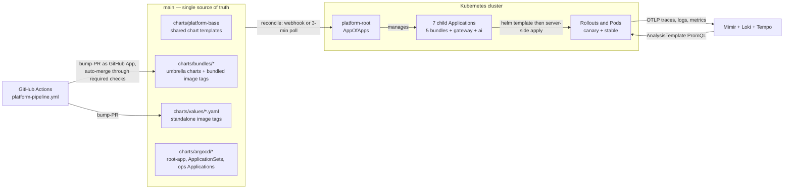
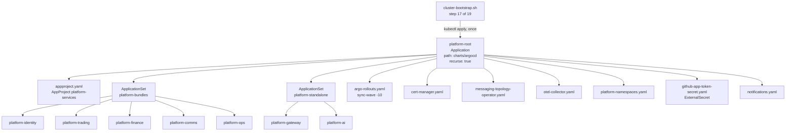
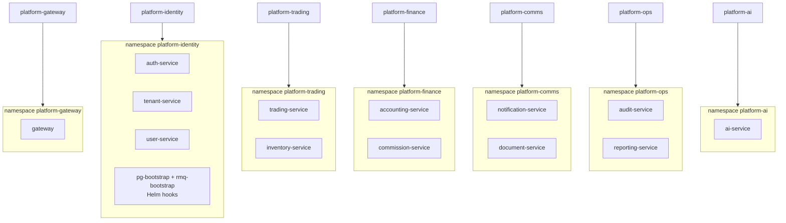
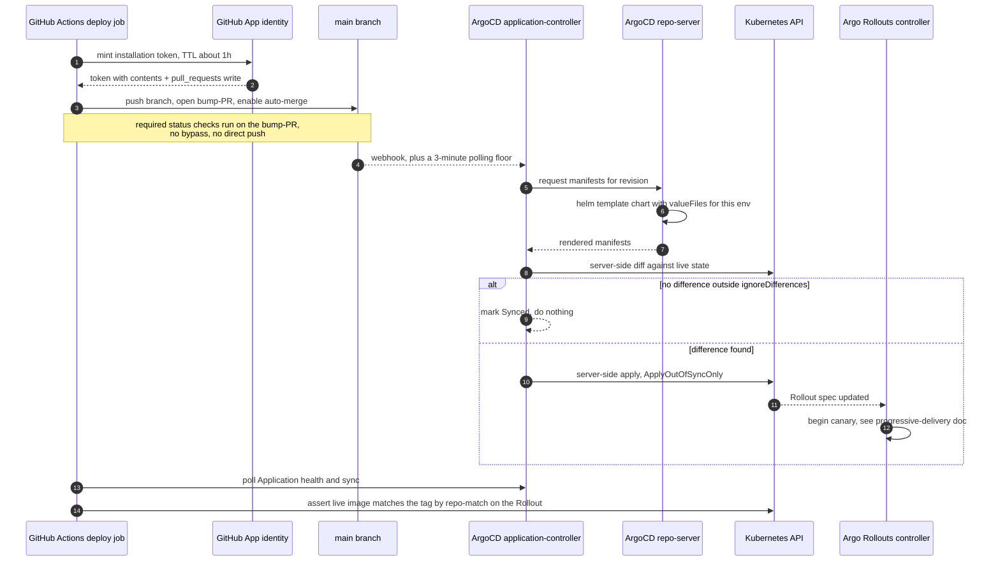
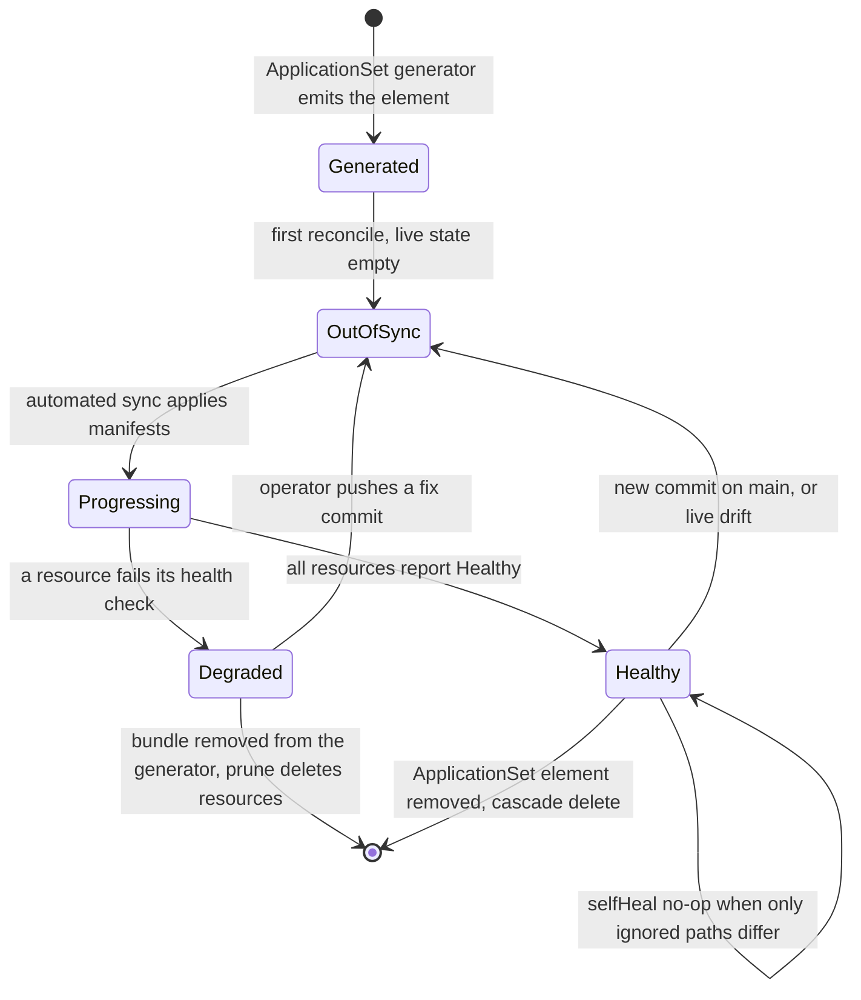

# GitOps Topology — Single Branch, One Root Application, Seven Children

What this covers: how a commit on `main` becomes a running pod on the Acme Platform
cluster. The chain is deliberately short — one git branch holds templates, image tags and
ArgoCD manifests; one root `Application` is applied by hand exactly once and thereafter
reconciles the whole `charts/argocd/` directory including itself-adjacent siblings; two
`ApplicationSet`s generate the seven child Applications that map 1:1 onto bounded-context
deploy units. Everything below was read out of the chart manifests, the deploy workflow and
ADRs 0032/0033; where the repository disagrees with itself the disagreement is called out
rather than smoothed over.

Deciding ADRs: **ADR-0032 Single-Branch GitOps with AppOfApps**, **ADR-0033
Bounded-Context-Aligned Bundle Deploy Units**, **ADR-0034 Argo Rollouts with SLO-Driven
AnalysisTemplate** (progressive delivery is in
[`02-progressive-delivery.md`](./02-progressive-delivery.md)), **ADR-0035 Workload Identity
End-to-End**, **ADR-0014 Microservices, Separate Binaries Day One**.

---

## 1. The one-page mental model



**Takeaways**

1. There is exactly **one** git branch in the deploy path. The predecessor two-branch model
   (`main` for templates, `gitops/dev` for image tags) was decommissioned; ADR-0032 records
   six consecutive deploy timeouts caused by a values file that existed on one branch and
   not the other, plus a standing cherry-pick tax on every template change.
2. CI never talks to the cluster to deploy. It talks to **git**. The only cluster
   credentials the pipeline holds are read-only verification credentials used _after_ the
   write lands.
3. The verification loop closes **inside** the cluster: pod metrics reach Mimir, the
   Rollouts controller queries Mimir, and the controller — not the workflow — decides
   whether to promote or abort.
4. The edge is _not_ in this loop. Ingress (Traefik) is a standalone Helm release upgraded
   out-of-band; ArgoCD does not reconcile its configuration. That is a deliberate, and
   somewhat sharp, exception.

**Invariant**: _the cluster's desired state is a pure function of the `main` tree._ Anything
you can only reproduce with `kubectl apply` is drift, and `selfHeal: true` will delete it.

---

## 2. Repository layout

The layout is load-bearing: ArgoCD's `directory.recurse` walk and the ApplicationSet
`valueFiles` lists are both path-driven, so a file's location determines whether it is
deployed.

```
charts/
├── argocd/                          # everything here is reconciled by platform-root
│   ├── root-app.yaml                #   ← the ONLY manifest applied by hand (excluded from its own walk)
│   ├── appproject.yaml              #   AppProject "platform-services" + sync windows
│   ├── applicationset.yaml          #   two ApplicationSets → 7 child Applications
│   ├── argo-rollouts.yaml           #   controller + CRDs      (sync-wave -10)
│   ├── cert-manager.yaml            #   needed by the RMQ topology-operator webhook
│   ├── messaging-topology-operator.yaml, otel-collector.yaml, notifications.yaml,
│   ├── platform-namespaces.yaml     #   namespaces + the labels NetworkPolicies select on
│   ├── github-app-token-secret.yaml #   ESO ExternalSecret: App PEM + id → argocd ns
│   ├── templates/                   #   auto-included by the recursive walk
│   ├── policies/                    #   EXCLUDED — owned by a dedicated Application
│   ├── poc-2/                       #   EXCLUDED — separately-managed POC AppOfApps
│   └── tests/                       #   EXCLUDED — helm-unittest fixtures, not manifests
│
├── platform-base/                   # the chart every service is an instance of
│   ├── templates/{rollout,deployment,service,hpa,pdb,networkpolicy,external-secret,
│   │              secretstore,serviceaccount,analysistemplate,traefikservice,...}.yaml
│   └── values.yaml, values.schema.json   # schema bounds every knob; --strict gate in CI
│
├── bundles/{identity,trading,finance,comms,ops}-bundle/
│   ├── Chart.yaml                   # N aliased deps on platform-base + bootstrap subcharts
│   ├── values.yaml                  # ← AUTHORITATIVE image tag for bundled services
│   └── tests/                       # helm-unittest, one suite per structural invariant
│
├── values/{service}.yaml            # authoritative tag for STANDALONE services only
├── overlays/dev/{common,identity,trading,finance,comms,ops,gateway,ai}.yaml
├── overlays/production/{common.yaml,<bc>/common.yaml}
└── services.yaml                    # service registry: ports, BC, outbox lock ids
```

**Takeaways**

- `root-app.yaml` excludes itself. A change to the root Application's _own_ spec is
  therefore **not** self-reconciled and needs the same one-time `kubectl apply` as the
  initial bootstrap. This surprises people during incident response.
- `tests/**` and `Chart.yaml` are excluded because they are helm-unittest scaffolding; a
  `Chart.yaml` applied as a Kubernetes resource is a sync error, not a no-op.
- The staged **production** ApplicationSet manifest deliberately lives _outside_
  `charts/argocd/` (under `docs/platform/operations/staged/`) so neither the recursive walk
  nor a careless `kubectl apply -f charts/argocd/` can activate it. That hardening was added
  after an accidental apply deleted dev namespaces.

**Invariant**: _presence in `charts/argocd/` is the activation switch._ Activating
production is a `git mv` back into that directory; deactivating is a `git mv` out. No flag,
no annotation.

---

## 3. Root Application self-management

The bootstrap script (19 steps: install controllers, then hand the cluster to ArgoCD)
performs exactly one ArgoCD-level apply at step 17:

```bash
kubectl apply -f charts/argocd/root-app.yaml -n argocd
```



**Takeaways**

1. `argo-rollouts.yaml` carries `sync-wave: -10` so the `Rollout`/`AnalysisTemplate`/
   `AnalysisRun`/`Experiment` CRDs exist before any child Application tries to render a
   `Rollout`. Without the negative wave the first bootstrap races and fails on unknown kinds.
2. Two ApplicationSets, not one, because the two classes render **different chart paths**:
   bundles point at `charts/bundles/<bc>-bundle`, standalone services point at
   `charts/platform-base` directly with a per-service values file prepended.
3. The bootstrap **self-tests**: step 18 polls for the AppProject + ApplicationSets within
   2 minutes; step 19 polls for all 7 children `Healthy/Synced` within 10 minutes. A failing
   poll fails the bootstrap — the script does not exit green on a half-built cluster.
4. `syncOptions: CreateNamespace=false` everywhere. Namespaces are a managed manifest with
   the labels NetworkPolicies select on; letting ArgoCD auto-create bare namespaces would
   silently produce label-less namespaces that every `namespaceSelector` misses.

**Invariant**: _`kubectl apply` against anything in `charts/argocd/` other than
`root-app.yaml` is drift and will be reverted within one reconcile interval._ The root
Application runs `automated: {prune: true, selfHeal: true}`.

### 3.1 The `ignoreDifferences` guard that keeps the root Application quiet

The root Application manages two `ExternalSecret` resources. The External-Secrets
admission webhook fills in optional defaults the git manifests legitimately omit, and
ArgoCD reports those server-applied defaults as drift — so `selfHeal` re-syncs in a
no-op loop roughly every 2.5 minutes and the Application never settles on `Synced`.

```yaml
syncPolicy:
  syncOptions:
    - ServerSideApply=true
    - ServerSideDiff=true
    - RespectIgnoreDifferences=true # extends the ignore to the APPLY phase
ignoreDifferences:
  - group: external-secrets.io
    kind: ExternalSecret
    jqPathExpressions:
      - ".spec.data[].remoteRef.conversionStrategy"
      - ".spec.data[].remoteRef.decodingStrategy"
      - ".spec.data[].remoteRef.metadataPolicy"
      - ".spec.target.deletionPolicy"
      - ".spec.target.template.engineVersion"
      - ".spec.target.template.mergePolicy"
```

`ServerSideApply=true` alone is insufficient — it governs the apply path while the diff
stays client-side. Even with `ServerSideDiff=true` the defaults inside the **atomic**
`.spec.data` list were not neutralised in practice, so the deterministic fix is to strip the
defaulted paths from both desired and live state before comparison. The same pairing
(`ignoreDifferences` + `RespectIgnoreDifferences`) recurs on the runner chart's Application
for API-server-applied CRD defaults, and on the standalone ApplicationSet for
Rollouts-written traffic weights (see
[`02-progressive-delivery.md` §4](./02-progressive-delivery.md)).

Diagnostic note worth keeping: plain `kubectl diff` **misleads** here because it runs as a
different field manager. Reproduce ArgoCD's own view with
`kubectl diff --server-side --force-conflicts --field-manager=argocd-controller -f <manifest>`.

---

## 4. Seven Applications, twelve services

Twelve services collapse into seven deploy units along bounded-context lines (ADR-0033).
The driver was empirical, not aesthetic: a majority of recent fix-class PRs already touched
multiple services inside one bounded context, so twelve independent Applications were
ceremony around what was in practice a coordinated deploy — at a team size of one to three
engineers.

| Application         | Type       | Services                | Namespace           | Chart path                       | Wave |
| ------------------- | ---------- | ----------------------- | ------------------- | -------------------------------- | ---- |
| `platform-gateway`  | standalone | gateway                 | `platform-gateway`  | `charts/platform-base`           | 0    |
| `platform-ai`       | standalone | ai-service              | `platform-ai`       | `charts/platform-base`           | 0    |
| `platform-identity` | bundle     | auth + tenant + user    | `platform-identity` | `charts/bundles/identity-bundle` | 1    |
| `platform-trading`  | bundle     | trading + inventory     | `platform-trading`  | `charts/bundles/trading-bundle`  | 1    |
| `platform-finance`  | bundle     | accounting + commission | `platform-finance`  | `charts/bundles/finance-bundle`  | 2    |
| `platform-comms`    | bundle     | notification + document | `platform-comms`    | `charts/bundles/comms-bundle`    | 2    |
| `platform-ops`      | bundle     | audit + reporting       | `platform-ops`      | `charts/bundles/ops-bundle`      | 2    |



**How a bundle is built.** Each bundle `Chart.yaml` declares _N_ aliased dependencies on the
same `platform-base` chart — one alias per service — plus the two bootstrap subcharts:

```
# charts/bundles/identity-bundle/Chart.yaml
dependencies:
  - name: platform-base   alias: auth-service     version: 0.2.1   repository: file://../../platform-base
  - name: platform-base   alias: tenant-service   version: 0.2.1   repository: file://../../platform-base
  - name: platform-base   alias: user-service     version: 0.2.1   repository: file://../../platform-base
  - name: platform-pg-bootstrap    version: 0.1.4  repository: file://../../platform-pg-bootstrap
  - name: platform-rmq-bootstrap   version: 0.1.6  repository: file://../../platform-rmq-bootstrap

# charts/bundles/identity-bundle/values.yaml — values keyed per alias
auth-service:
  image:                { repository: developmentacmeacr.azurecr.io/auth-service, tag: sha-0000000 }
  outboxAdvisoryLockId: 900001
  networkPolicy:        { crossNamespaceIngress: gateway }
tenant-service: { ... }
user-service:   { ... }
```

(Field alignment above is illustrative; the real files are ordinary block YAML.) The alias is
the _service_ name, not the BC name, so every rendered object lands under a
`<release>-<service>` prefix and resource-name uniqueness scales linearly.

**Takeaways**

1. **Bundling is a deploy concept, not a process concept.** Each alias still renders its own
   `Rollout`/`Deployment`, `Service`, `HPA`, `PDB`, `NetworkPolicy`, `ExternalSecret`,
   `SecretStore`, `ResourceQuota` and `LimitRange`. Separate binaries and per-BC PostgreSQL
   schemas (ADR-0013) are untouched; so are the per-service outbox advisory lock ids
   (ADR-0022) — the chart _fails the template_ if a service with `hasRabbitMQ: true` has no
   `outboxAdvisoryLockId`.
2. **The cost is version granularity.** You cannot run `auth-service@v1.2` beside
   `tenant-service@v1.3` inside one bundle without splitting the bundle — which ADR-0033
   deliberately keeps to a one-PR change, so the decision is reversible.
3. **Gateway stays standalone** because it is the ingress and must be ready before backend
   traffic flows, and it is the only service that opts into weighted traffic routing.
   **ai-service stays standalone** because it is batch-shaped with no synchronous coupling.
4. **Sync waves order the fleet**: gateway/ai (0) → identity/trading (1) → finance/comms/ops
   (2). ADR-0033's table describes ai as "independent"; the implemented ApplicationSet gives
   it wave `0`. The manifest is the truth.

**Invariant**: _the deploy unit equals the bounded context._ A change that must ship
atomically across services is a change inside one bundle; if it spans bundles, that is a
signal about the context map, not about the pipeline.

### 4.1 Where the image tag lives — the trap

The two service classes resolve their tag from **different files**, because ArgoCD renders
them with different `valueFiles` lists:

- **Standalone** (`gateway`, `ai`): the ApplicationSet passes
  `charts/values/<service>.yaml`, so the top-level `.image.tag` there is effective.
- **Bundled** (the other eleven): the ApplicationSet passes only
  `overlays/<env>/common.yaml` and `overlays/<env>/<bc>.yaml`. `charts/values/<service>.yaml`
  is **not in that list and is never read by ArgoCD**. The authoritative tag is the
  per-alias `.["<service>"].image.tag` inside `charts/bundles/<bc>-bundle/values.yaml`.

Historically the deploy workflow wrote _only_ to `charts/values/<service>.yaml`. For the
eleven bundled services that made a normal deploy a **silent no-op**: the image built, the
tag bumped, ArgoCD reported `Synced`, and the pods kept running the old image for roughly
ten days before anyone noticed. The fix (issue #1051) resolves the target per service class
and hard-fails when the file or the existing tag key is absent, so a wrong service→bundle
mapping can no longer quietly create a stray key:

```bash
declare -A SVC_BUNDLE=(
  [auth-service]=identity [tenant-service]=identity [user-service]=identity
  [trading-service]=trading [inventory-service]=trading
  [accounting-service]=finance [commission-service]=finance
  [document-service]=comms [notification-service]=comms
  [audit-service]=ops [reporting-service]=ops
)
declare -A STANDALONE=([gateway]=1 [ai-service]=1 [acme-frontend]=1)
# bundle   → charts/bundles/${bundle}-bundle/values.yaml  ::  .["${svc}"].image.tag
# standalone → charts/values/${svc}.yaml                  ::  .image.tag
# neither  → hard error; never guess
```

**Verified inconsistency worth knowing**: `charts/services.yaml` still records the
_pre-consolidation_ namespaces (`platform-auth`, `platform-platform`, `platform-inventory`,
…) for services that now deploy into their bundle namespace. That field is not read by the
deploy path — the registry is consumed for ports, bounded context and outbox lock ids — but
it will mislead anyone treating it as the namespace source of truth.

---

## 5. The reconcile loop



**Takeaways**

1. **CI's write is a pull request, not a push.** Classic branch protection has no per-actor
   status-check bypass and rejects direct pushes to `main`, including a GitHub App's — the
   earlier design assumed otherwise and was blocked with `GH006`. The bump-PR lands _through_
   the checks in about six minutes, inside the workflow's twenty-minute wait deadline.
2. **The App identity is repo-wide, not path-scoped.** GitHub App permissions cannot be
   restricted to path patterns; ADR-0032 carries an explicit erratum retracting that claim.
   The residual control is that the writeback must pass `main`'s required checks and the App
   is non-admin — but a compromised App key is repo-wide `contents: write`.
3. **The verification is deliberately paranoid.** The post-deploy check polls the real
   `platform-<bundle>` Application (not a `platform-<service>` Application that does not
   exist) and asserts the live image by repo-match across the `Rollout` — not
   `kubectl rollout status deployment/...`, which reports nothing useful when the workload is
   a `Rollout`.
4. **`ApplyOutOfSyncOnly=true`** keeps a bundle sync from touching thirteen healthy objects
   to change one.

**Invariant**: _a deploy is a merge._ If a tag reached the cluster without a commit on
`main`, either someone used the break-glass path or the cluster is drifting — both are
incident-worthy.

---

## 6. Application lifecycle states



**Takeaways**

- `selfHeal: true` is what makes drift transient — and what makes an un-guarded
  server-applied default an infinite no-op sync loop (§3.1).
- `prune: true` plus the cascade behaviour of the ApplicationSet is the deactivation
  mechanism: removing a generator element deletes the generated Application, which prunes
  its namespace contents. This is exactly why the staged production manifest is kept out of
  the reconciled directory.
- The `resources-finalizer.argocd.argoproj.io` finalizer on the root Application means
  deleting `platform-root` cascades to the AppProject, both ApplicationSets and all seven
  children. It is a single-command teardown of the entire platform. Treat accordingly.

---

## 7. Sync windows: production has business hours, dev does not

The `platform-services` AppProject defines three sync windows, **all scoped to
`platform-prod-*`**:

| Kind  | Schedule       | Duration | Applications      | `manualSync` |
| ----- | -------------- | -------- | ----------------- | ------------ |
| allow | `0 6 * * 1-5`  | 16h      | `platform-prod-*` | `true`       |
| deny  | `0 22 * * 1-5` | 8h       | `platform-prod-*` | `true`       |
| deny  | `0 0 * * 0,6`  | 24h      | `platform-prod-*` | `true`       |

Because the dev Applications match **no** window, ArgoCD's "no matching window means all
syncs allowed" rule gives dev continuous deploy.

Two things were learned the hard way and are encoded here:

1. Scoping all three windows to `*` also caught dev, so weekend/overnight commits piled up
   un-synced and the deploy pipeline's sync-wait timed out.
2. `manualSync: false` on a **deny** window blocks manual syncs too — sync windows gate
   automated _and_ manual syncs, and `manualSync` is the override toggle, not a
   restriction. During one weekend recovery the out-of-sync bundles refused to hand-sync for
   exactly this reason. All deny windows now set `manualSync: true` so on-call retains
   break-glass.

**Invariant**: _deny windows constrain the robot, never the human on call._

---

## 8. Credentials in the deploy path

Summarised because it constrains the topology; the full chain is ADR-0035's subject. CI
writes to `main` as a GitHub App whose PEM lives in Key Vault and reaches the cluster through
an ESO `ExternalSecret`; the minted installation token has a ~1 h TTL. Pods read secrets from
Key Vault through a per-namespace `SecretStore` federated to a per-service ServiceAccount.
Image pulls use the cluster's attached managed identity, so `imagePullSecrets` is empty
everywhere.

**Invariant**: _no static long-lived credential exists in the deploy path._ The only
long-lived artefact is the App's PEM, watched by an expiry CronJob that alerts fourteen days
ahead of expiry.

---

## 9. What this topology does **not** cover

Stated explicitly so nobody infers coverage that is not there:

- **Ingress and public TLS are outside GitOps.** Traefik is a standalone Helm release in its
  own namespace, configured from a values file that ArgoCD does not reconcile. TLS is
  Traefik's built-in HTTP-01 ACME resolver, not cert-manager (cert-manager exists only to
  back the messaging-topology-operator's admission webhook). Config changes require a manual
  `helm upgrade`, and a failed certificate `obtain` is not retried automatically — the pod
  must be restarted.
- **Public reachability additionally depends on a subnet NSG rule** that the cloud
  controller does not manage. The LoadBalancer allow rule it writes lands on the
  node/NIC-level security group only; a Terraform-owned subnet NSG with a default deny will
  black-hole 80/443 invisibly to every in-cluster health gate.
- **Production is staged, not active.** Seven `platform-prod-*` Applications exist as a
  manifest held outside the reconciled directory, with per-bundle production overlays. They
  have never been applied to a cluster. Activation is gated on a stakeholder sign-off issue.
- **Database migrations are not rolled back by any of this.** See
  [`02-progressive-delivery.md` §7](./02-progressive-delivery.md).

---

## 10. ADR index for this document

| ADR      | Title                                          | Why it matters here                                            |
| -------- | ---------------------------------------------- | -------------------------------------------------------------- |
| ADR-0032 | Single-Branch GitOps with AppOfApps            | one branch, one root Application, App writeback                |
| ADR-0033 | Bounded-Context-Aligned Bundle Deploy Units    | 12 services → 7 Applications; per-service primitives preserved |
| ADR-0034 | Argo Rollouts with SLO-Driven AnalysisTemplate | why child Applications render `Rollout`, not `Deployment`      |
| ADR-0035 | Workload Identity End-to-End                   | removes static credentials from the deploy path                |
| ADR-0036 | Versioned Event Routing Keys                   | makes a rolling bundle deploy safe for consumers               |
| ADR-0014 | Microservices, Separate Binaries Day One       | bundles refine the _deploy_ unit, not the binary               |
| ADR-0013 | Per-BC PostgreSQL Schema Isolation             | unaffected by bundling                                         |
| ADR-0022 | Database Instance Hardening Strategy           | per-service outbox advisory lock ids survive bundling          |
| ADR-0020 | External Secrets Operator + SOPS               | the ExternalSecret defaults that forced §3.1                   |
| ADR-0027 | Container Registry for Runtime Image Pulls     | pull identity, no imagePullSecrets                             |
| ADR-0038 | pg-bootstrap via Kubernetes Job (amendment)    | why bootstrap subcharts live inside a bundle                   |
