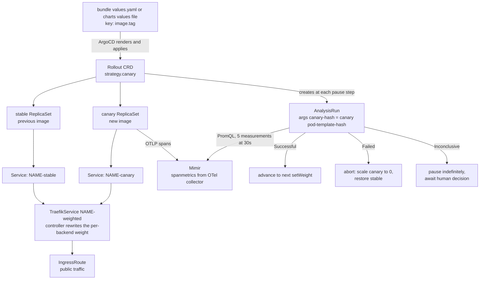
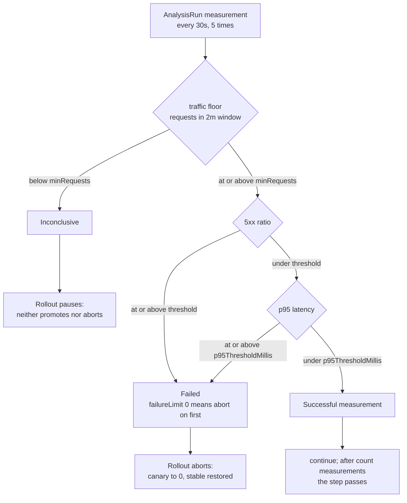
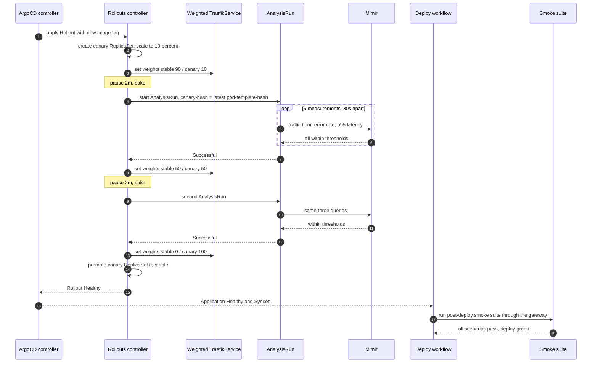
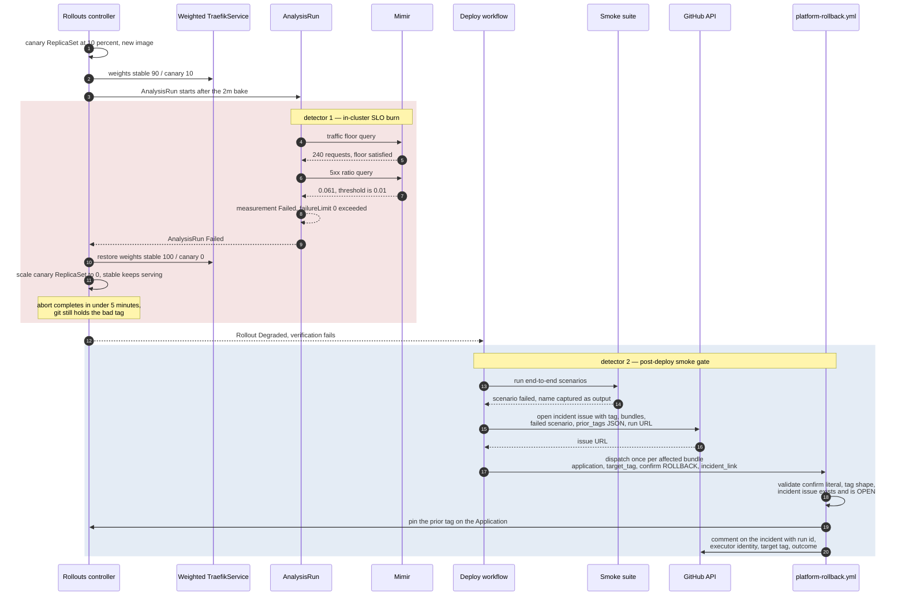

# Progressive Delivery — Canary, SLO Analysis, Automatic Rollback

What this covers: what happens after ArgoCD applies a new image tag. Every service renders
an Argo Rollouts `Rollout` instead of a `Deployment`; the gateway additionally splits real
traffic through a weighted Traefik service and gates each canary step on PromQL queries
against Mimir scoped to the canary ReplicaSet. A failing query aborts the rollout back to
the previous stable ReplicaSet **inside the cluster**, without GitHub Actions in the loop.
This document traces the good path, the bad path, and the several places where the
implemented behaviour is narrower than the ADR that motivated it.

Deciding ADRs: **ADR-0034 Argo Rollouts with SLO-Driven AnalysisTemplate** (plus its
amendment aligning metric names to **ADR-0050 Prometheus Operator alongside Mimir**),
**ADR-0015 Kubernetes Deployment Zero-Downtime**, **ADR-0019 OpenTelemetry + Grafana
Observability**, **ADR-0033 Bounded-Context-Aligned Bundle Deploy Units**.

---

## 1. Why the decision moved into the cluster

The deploy verification chain had been rewritten three times in thirty days, each rewrite
reactive to a newly discovered edge case in a polling loop, a rollback semantic, or a
verification gate. The failure pattern was structural, not incidental:

- a mismatch check emitted `::warning::` rather than `::error::`, so failures were invisible
  to anyone scanning the run UI;
- six deploy timeouts on a 300-second ArgoCD poll had **no** automatic rollback path — the
  workflow exited red and an operator hand-patched;
- the rollback workflow used `kubectl patch` on the Application CRD, which the next
  automated deploy overwrote by pushing to git, so rollback had no durable effect;
- there was no post-deploy smoke test at all.

The conclusion recorded in ADR-0034 is one sentence: **the cluster has the runtime data
needed to decide whether a deploy is healthy, and the workflow does not.** Request rate,
error ratio and latency per ReplicaSet exist in Mimir; a GitHub Actions job can only
approximate them.

---

## 2. Anatomy of a Rollout



**Takeaways**

1. The `Rollout` is a drop-in replacement for `Deployment` in the shared chart, guarded by
   `rollout.enabled`. Both templates exist; `deployment.yaml` renders only when
   `rollout.enabled` is false, so exactly one workload object is produced. Both carry the
   same fail-fast guards — no image tag, a database-backed service without migrations
   enabled, a `secrets` map without an `ExternalSecret`, or a missing outbox advisory lock
   id all fail `helm template`, not runtime.
2. **`canaryService` / `stableService` / `trafficRouting` render only when
   `traefikRouting.enabled` is true**, which today is **gateway only**. For every other
   service the `setWeight` steps control the _replica proportion_ between the two
   ReplicaSets — there is no request-level traffic split. This is a real and frequently
   misread limitation.
3. HPA and PDB continue to work: the HPA targets the `Rollout`, which proxies scaling to the
   canary and stable ReplicaSets.
4. `AnalysisRun` args are injected, not hardcoded: the step supplies
   `canary-hash` via `valueFrom.podTemplateHashValue: Latest`. The `AnalysisTemplate`
   declares the arg with **no default**, so a Rollout that references the template without
   supplying the arg is rejected as `InvalidSpec` and creates **zero pods**. That failure
   mode looks like a stuck deploy, not a config error.

**Invariant**: _every query in the analysis is scoped to the canary cohort by
`argo_rollouts_pod_template_hash`._ Stable-pod traffic can never mask a bad canary, and a
canary with no traffic can never be judged on the stable pods' numbers.

---

## 3. The canary schedule

Chart defaults (`charts/platform-base/values.yaml`):

```yaml
rollout:
  enabled: false # opted in per service via overlay
  canary:
    maxSurge: 1 # one extra pod per step
    maxUnavailable: 0 # no pod removed until its replacement is Ready
    steps:
      - setWeight: 10
      - pause: { duration: 2m }
      - setWeight: 50
      - pause: { duration: 2m }
      - setWeight: 100
    analysisTemplate:
      enabled: false
      name: ""
      prometheusAddress: "" # template FAILS if empty while enabled
      interval: 30s
      count: 5 # 5 x 30s = 2.5 min per metric cycle
      trafficFloor: { minRequests: 10, failureLimit: 3 }
      errorRate: { threshold: 0.01, failureLimit: 0 }
      latency: { p95ThresholdMillis: 300, failureLimit: 0 }
```

When `analysisTemplate.enabled` is true, the chart **injects an `analysis` step after every
`pause` step** rather than requiring authors to interleave them by hand. The rendered list
becomes:

```
step 0  setWeight: 10
step 1  pause: 2m                       ← bake
step 2  analysis: <release>-slo-canary  ← 3 metrics x 5 measurements x 30s
step 3  setWeight: 50
step 4  pause: 2m                       ← bake
step 5  analysis: <release>-slo-canary
step 6  setWeight: 100
```

The template name defaults to `<release>-slo-canary`, mirroring the `AnalysisTemplate`
metadata default. That symmetry is required for bundles: _N_ aliased services share one
namespace, each gets a uniquely-named template, and each `Rollout` references its own. An
explicit `analysisTemplate.name` still wins — the gateway pins `platform-slo-canary`.

`maxSurge: 1 / maxUnavailable: 0` is the ADR-0015 zero-downtime policy: no pod is removed
until its replacement is Ready.

---

## 4. The three metrics

All three are PromQL against the in-cluster Mimir query endpoint. Metric names come from the
**spanmetrics connector**, not OpenTelemetry semantic conventions — the ADR-0034 amendment
switched them because the semconv metrics were never emitted into Mimir at all (the metrics
SDK package was absent from the dependency tree), while dashboards and alert rules already
consumed the spanmetrics names.

```promql
# 1. Traffic floor — requests in the 2-minute window, must be >= minRequests
sum(rate(calls_total{argo_rollouts_pod_template_hash="{{args.canary-hash}}"}[2m])) * 120
  or on() vector(0)

# 2. Error rate — 5xx ratio, must be < 0.01
(
  sum(rate(calls_total{http_status_code=~"5..",argo_rollouts_pod_template_hash="{{args.canary-hash}}"}[2m]))
  /
  (sum(rate(calls_total{argo_rollouts_pod_template_hash="{{args.canary-hash}}"}[2m])) > 0)
)
  or on() vector(0)

# 3. P95 latency — milliseconds, must be < p95ThresholdMillis
(
  histogram_quantile(0.95,
    sum(rate(duration_milliseconds_bucket{argo_rollouts_pod_template_hash="{{args.canary-hash}}"}[2m])) by (le)
  )
  and on()
  (sum(rate(calls_total{argo_rollouts_pod_template_hash="{{args.canary-hash}}"}[2m])) > 0)
)
  or on() vector(0)
```



**Takeaways**

1. **The traffic floor is the arbiter of "is there enough data to judge this".** Below the
   floor the run is `Inconclusive`, and Argo Rollouts **pauses** on `Inconclusive` — it does
   not promote and does not abort. A quiet service is therefore never rolled back for being
   quiet.
2. The `or on() vector(0)` fallbacks on the error-rate and latency metrics exist **only** so
   they cannot override that `Inconclusive` with a spurious `Failed` under `failureLimit: 0`.
   This does not fail open: a real regression with real traffic produces a real non-empty
   value, so the fallback is inert; the 5xx numerator is a label-subset of the denominator,
   so the denominator can never be empty while the numerator is not; and if the metrics
   pipeline breaks mid-canary the traffic-floor metric also reads no-data, yielding
   `Inconclusive` → pause, not auto-promote.
3. `(denominator > 0)` in the error-rate query is what turns a zero-traffic `0/0 = NaN` into
   an _empty_ result that the `or vector(0)` can then default. Same idea in the latency
   query with `and on() (count > 0)` suppressing a `histogram_quantile` NaN.
4. `failureLimit: 0` on error rate and latency means **the first bad measurement aborts** —
   roughly 30 seconds into a 2.5-minute analysis cycle.

**Invariant**: _no-data is never treated as good news._ Every no-data path terminates in
`Inconclusive` → pause, never in an automatic promotion.

### 4.1 Two discrepancies found in the chart

Reported rather than papered over:

- **`p95ThresholdMillis` versus its comment.** The values-file comment reads "P95 request
  duration in seconds. Must be < 300ms (0.300s)". The key is named `…Millis`, the metric is
  `duration_milliseconds_bucket`, and the rendered condition is `result < 300`. The
  implementation is milliseconds and is correct; the comment is stale from before the
  metric-name amendment.
- **Traffic-floor `failureLimit: 3`.** The comment states the intent as "allow 3
  Inconclusive measurements before aborting", but Argo Rollouts counts inconclusive
  measurements against a separate `inconclusiveLimit` key, which this template does not set.
  Whether three low-traffic measurements are tolerated as intended could not be confirmed
  from the repository alone — it needs a live AnalysisRun to settle.

---

## 5. A good deploy



Total wall clock for the default schedule is roughly four to six minutes of canary plus the
smoke suite.

**Takeaway**: the workflow's role after the merge is purely _observational_ — poll the
Application, assert the live image, run smoke. It has no promote authority. That is the
whole point of ADR-0034.

---

## 6. A bad deploy — detection and rollback

Two independent detectors exist, at different depths. The in-cluster one is faster and
narrower; the smoke gate is slower and end-to-end.



**Takeaways**

1. **The in-cluster abort does not change git.** Argo Rollouts restores the stable
   ReplicaSet, but `main` still carries the bad tag, so the Application is now `Degraded`
   and out of step with its desired state. The durable fix is a `git revert`; the abort is
   damage control that buys time.
2. **`prior_tags` is captured before `yq` mutates anything**, per service, and serialised
   with `jq` so a value containing a quote or backslash cannot produce invalid JSON. The
   rollback dispatcher parses it with `jq` rather than `grep`, because `grep` would
   cross-match `auth` against `auth-service`.
3. **The break-glass workflow refuses to run casually.** It requires the literal string
   `ROLLBACK`, an image tag matching `sha-<7-40 hex>` or semver, and an incident issue URL
   that it verifies is **open**. It then posts its own audit comment. ADR-0034 classifies
   `kubectl patch` on an Application as an anti-pattern precisely because the next automated
   deploy overwrites it — hence the incident-ticket requirement.
4. **Rollback preference order** is: `git revert` (reconciles cleanly, re-canaries against
   the prior tag with the same gates) → automatic smoke-triggered rollback → break-glass
   workflow.

**Invariant**: _every automated rollback leaves a written trail._ Issue, run id, executor,
target tag, failed scenario. No silent reverts.

---

## 7. What rollback does not undo: database migrations

Rolling an image back does **not** roll a schema back. Old code then runs against the new
schema, so every migration must survive two consecutive deploys:

| Class                    | Operations                                                                   | Deploys needed |
| ------------------------ | ---------------------------------------------------------------------------- | -------------- |
| Safe                     | `ADD COLUMN … DEFAULT` / `NULL`, `CREATE TABLE`, `CREATE INDEX CONCURRENTLY` | 1              |
| Requires expand-contract | `DROP COLUMN`, `RENAME COLUMN`, `ALTER COLUMN TYPE`                          | 2              |

If a non-backward-compatible migration shipped and the rollback breaks, the remedy is a
**compensating forward migration**, applied by hand. `migration:down` is not run in
production.

Migrations execute as init containers ahead of the application container in the same pod
template, preceded by a `wait-for-db` init container that polls the database endpoint up to
thirty times at two-second intervals. A canary therefore cannot start serving before its
schema is in place — but it also means a bad migration blocks the canary at pod start rather
than at the analysis step, which surfaces as `Progressing` → `Degraded`, not as an
`AnalysisRun` failure.

---

## 8. Environment divergence — what actually runs where

This is the section most likely to mislead if skimmed. The base chart describes the
_production_ policy; the dev overlays override it substantially.

| Knob                               | Base / production       | Dev overlay                                               |
| ---------------------------------- | ----------------------- | --------------------------------------------------------- |
| `rollout.enabled`                  | opt-in per service      | `true` for all bundle aliases and gateway/ai              |
| `canary.maxSurge / maxUnavailable` | `1 / 0` (zero-downtime) | `0 / 1` for the five bundles; gateway and ai keep `1 / 0` |
| `analysisTemplate.enabled`         | `true` for gateway only | `false` — including gateway                               |
| `traefikRouting.enabled`           | gateway only            | gateway only                                              |
| `replicaCount` / `autoscaling`     | per-service, HPA on     | `1` / HPA off                                             |
| Sync windows                       | Mon–Fri 06:00–22:00 UTC | none — continuous deploy                                  |

Why dev diverges:

- **Capacity.** The shared dev cluster runs a single 4-vCPU user node sitting near 99 % of
  CPU _requests_ at rest. A surge ReplicaSet has nowhere to schedule, so canaries wedge with
  old and new ReplicaSets both alive. `maxSurge: 0 / maxUnavailable: 1` means replace in
  place. The chart's `values.schema.json` bounds were widened (`maxSurge` minimum 1→0,
  `maxUnavailable` maximum 0→1) _solely_ to permit this opt-out; base defaults and the
  production overlays are unchanged.
- **Traffic.** The SLO analysis needs at least ten requests per window. Dev cannot meet the
  floor, so a live analysis step would sit `Inconclusive` and wedge the canary indefinitely.
  Dev keeps the `setWeight` and timed-pause steps — Traefik still splits real requests for
  the gateway even at one replica — and auto-promotes on the pause timers.
- **Gateway and ai keep `maxSurge: 1`** because a traffic-routed canary cannot replace in
  place: there must be a canary pod for the weighted service to point at. The gateway's
  surge pod requests 50 m and fits the node's headroom.

**Consequence for release validation, stated plainly**: a green canary in dev **does not
exercise the SLO auto-abort path at all**. That path is validated by a dedicated chaos test
with synthetic load and injected 5xx responses, and runs live only where
`analysisTemplate.enabled` stays true. Treat "it canaried fine in dev" as evidence about
pod startup and manifest correctness, not about the rollback machinery.

---

## 9. Two controller-level gotchas that silently wedge canaries

Both were live incidents; both are one-line configuration facts.

**Traefik API group.** The Rollouts controller's built-in Traefik router defaults to the
legacy `traefik.containo.us` group (Traefik v2), while the cluster runs Traefik v3, which
exposes only `traefik.io/v1alpha1`. Without an override every canary reconcile fails with
`TrafficRoutingError: the server could not find the requested resource` and the rollout
wedges at step 0. There is **no availability impact** — the stable ReplicaSet keeps serving —
so nothing pages, and the new revision simply never ships. The fix is controller args:

```yaml
controller:
  extraArgs:
    - --traefik-api-group=traefik.io
    - --traefik-api-version=traefik.io/v1alpha1
```

**ArgoCD fighting the controller over weights.** Git holds the cold-start weights
(`stable=100, canary=0`); the Rollouts controller rewrites
`spec.weighted.services[].weight` as the canary advances. Without a guard ArgoCD flags the
Application `OutOfSync` on the live weight and `selfHeal` snaps traffic off the canary
mid-rollout. Both ApplicationSets therefore carry:

```yaml
ignoreDifferences:
  - group: traefik.io
    kind: TraefikService
    jqPathExpressions:
      - ".spec.weighted.services[].weight"
syncPolicy:
  syncOptions:
    - RespectIgnoreDifferences=true
```

`ignoreDifferences` alone removes the weight from the **diff**;
`RespectIgnoreDifferences=true` extends that to the **apply**, so a sync triggered
mid-canary for an unrelated reason — such as the deploy workflow landing a new image tag,
which is itself what starts canaries — does not re-assert git's cold-start weights. On the
bundles ApplicationSet this is currently a no-op (no bundle service enables traffic
routing) and is kept as forward-proofing. Same pattern as the root Application's
ExternalSecret guard in [`01-gitops-topology.md` §3.1](./01-gitops-topology.md).

**Invariant**: _when a controller owns a field at runtime, git must stop asserting it — in
both the diff and the apply phase._ Half the guard is worse than none, because it fails only
under concurrency.

---

## 10. Layered failure detection

| Layer               | Where                                   | Detects                                                    | Latency |
| ------------------- | --------------------------------------- | ---------------------------------------------------------- | ------- |
| Canary SLO analysis | `AnalysisRun` per Rollout step          | canary-cohort 5xx ratio, p95 latency, traffic floor breach | ~30 s   |
| Post-deploy smoke   | Playwright suite through the gateway    | end-to-end happy-path failure across gateway and backends  | minutes |
| Blackbox probes     | scraper probing every service `/health` | endpoint unreachable, certificate failure, sustained 5xx   | ~1 min  |

The blackbox layer is the **silent-failure detector**: it catches a service that stops
responding _after_ Rollouts already promoted, which neither of the other two layers can see.
Traces reach Tempo, logs Loki, metrics Mimir; correlation ids propagate on an
`X-Correlation-ID` header and on each domain event's `correlationId` / `causationId` fields
(ADR-0019).

**Verified gap**: the SLO analysis currently guards **one** service — the gateway — and only
where the environment leaves it enabled. Eleven bundled services run Rollouts with timed
pauses and replica-proportion canaries but no metric gate. That is a deliberate consequence
of the traffic floor, not an oversight, and it is the reason the blackbox layer exists.

---

## 11. ADR index for this document

| ADR      | Title                                          | Why it matters here                                          |
| -------- | ---------------------------------------------- | ------------------------------------------------------------ |
| ADR-0034 | Argo Rollouts with SLO-Driven AnalysisTemplate | the canary schedule, the three metrics, auto-rollback        |
| ADR-0050 | Prometheus Operator alongside Mimir            | RED metric naming; the amendment that renamed the queries    |
| ADR-0015 | Kubernetes Deployment Zero-Downtime            | `maxSurge: 1 / maxUnavailable: 0` and migration safety rules |
| ADR-0019 | OpenTelemetry + Grafana Observability          | the Mimir the AnalysisTemplate queries                       |
| ADR-0033 | Bounded-Context-Aligned Bundle Deploy Units    | per-alias template names; bundle-level rollback targets      |
| ADR-0032 | Single-Branch GitOps with AppOfApps            | why `git revert` is the preferred rollback                   |
| ADR-0022 | Database Instance Hardening Strategy           | migration and outbox constraints during a rolling deploy     |
| ADR-0036 | Versioned Event Routing Keys                   | keeps consumers safe while a bundle is mid-canary            |
