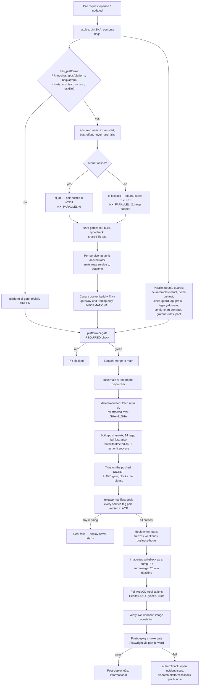
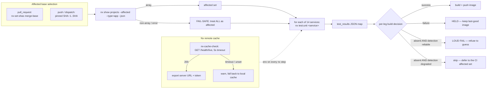
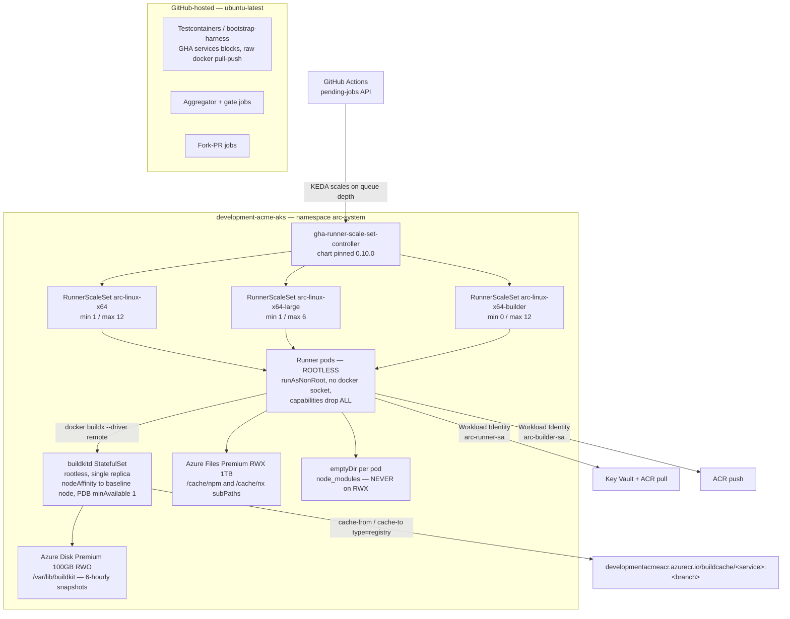
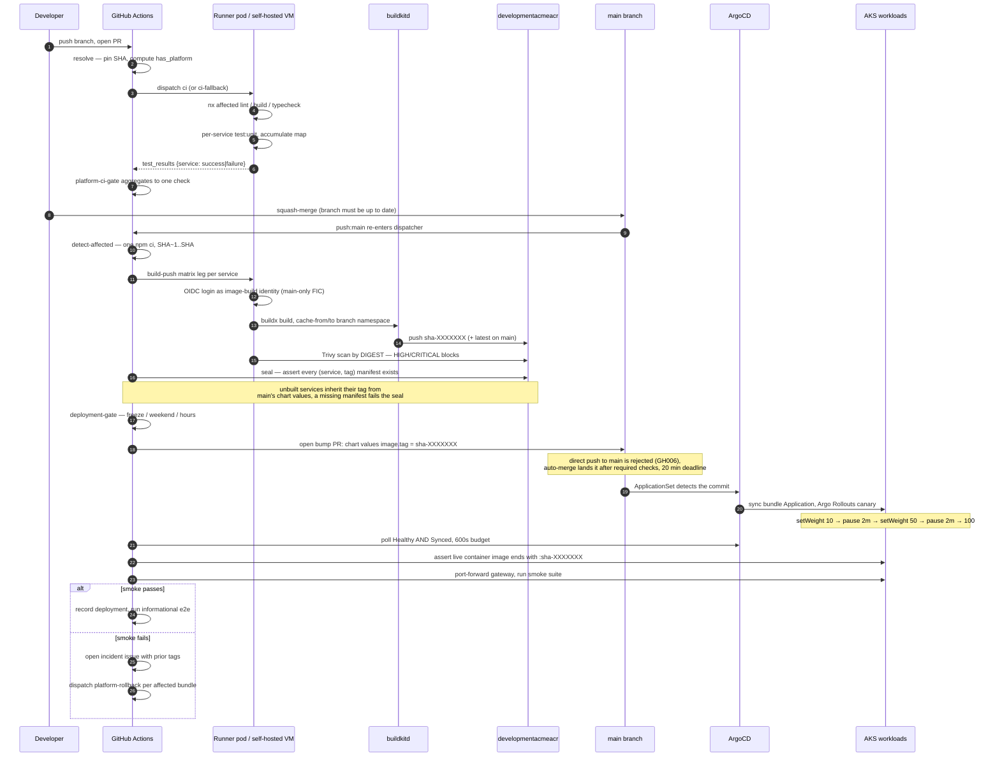
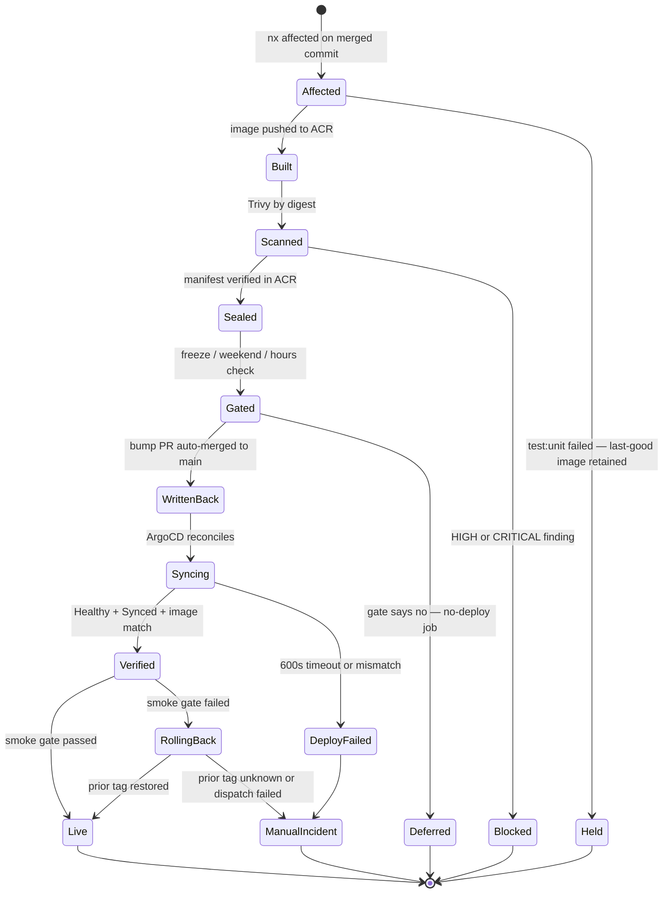

# CI/CD Pipeline — PR to Running Pod

What this covers: the end-to-end delivery path for the **Platform** stack (NestJS services on
AKS) in the Acme monorepo — how a pull request is validated, which checks are required versus
informational, how Nx affected-only computation and the remote build cache keep wall-clock down,
where the work physically runs (Actions Runner Controller pods on Kubernetes, a shared BuildKit
daemon, an RWX workspace cache, plus a GitHub-hosted fallback), how images are built, scanned and
sealed, and how the GitOps writeback → ArgoCD sync → smoke gate → auto-rollback loop closes. The
legacy stack (`legacy-api` and `legacy-web` on Azure App Service; only `domain-api` is containerised) runs a separate, older workflow
graph; it is referenced only where the two share runners, cache or branch protection.

Deciding ADRs: **ADR-0021 Platform CI Runner Strategy**, **ADR-0039 Actions Runner Controller on
AKS for Self-Hosted CI Runners**, **ADR-0040 Shared Rootless BuildKit Daemon for Docker Matrix
Builds**, **ADR-0041 Azure Files RWX + Azure Disk Premium Cache Layering for Ephemeral ARC
Runners**, **ADR-0042 Testcontainers / Docker-Daemon Class Stays on `ubuntu-latest`**. Deploy-side
context: **ADR-0032 Single-Branch GitOps + AppOfApps**, **ADR-0033 BC-Aligned Bundle Deploy
Units**, **ADR-0034 Argo Rollouts SLO Analysis**, **ADR-0035 Workload Identity End-to-End**.

---

## 1. Workflow file layout

The pipeline is a **single dispatcher calling three reusable workflows**. This shape exists to kill
a specific failure class: the previous `workflow_run`-coupled chain re-resolved
`workflow_run.head_sha` at every stage, so CI, build and deploy could each act on a _different_
commit (symptom: Trivy `MANIFEST_UNKNOWN` against a tag that was never pushed). The dispatcher
resolves the SHA **once** and passes it as an explicit `workflow_call` input; every reusable checks
out `inputs.sha`.

```
.github/
├── workflows/
│   ├── platform-pipeline.yml     ← THE dispatcher (push:main | pull_request | dispatch)
│   │     ├── resolve             ← resolves sha, run_build_push, run_deploy,
│   │     │                          run_integration, has_platform (once, at the top)
│   │     ├── ci            → uses ./.github/workflows/_ci.yml
│   │     ├── build-push    → uses ./.github/workflows/_build-push.yml
│   │     ├── deploy        → uses ./.github/workflows/_deploy.yml
│   │     └── platform-ci-gate    ← aggregates the per-service test map into ONE check
│   ├── _ci.yml                   ← workflow_call only: lint/build/typecheck/test + guards
│   ├── _build-push.yml           ← workflow_call only: 14-leg matrix + release-manifest seal
│   ├── _deploy.yml               ← workflow_call only: gate → writeback → sync → smoke → rollback
│   ├── ci.yml                    ← legacy stack CI (required check: `CI / ci-gate`)
│   ├── ci-v2.yml                 ← ARC-parallelised legacy CI, shadow mode (`ci-v2-gate`)
│   ├── platform-rollback.yml     ← BREAK-GLASS bundle rollback (workflow_dispatch only)
│   ├── platform-e2e-gate.yml     ← DORMANT pre-merge e2e scaffold (see §7)
│   └── terraform-validate.yml    ← required check: `Validate Terraform`
└── actions/                      ← composites
    ├── setup-node-npm            ← node toolchain + npm cache + `npm ci`
    ├── nx-cache-check            ← probes the remote cache, emits URL+token or blanks
    ├── arc-setup-workspace       ← ARC-only: verify /cache mounts, npm ci --prefer-offline
    ├── arc-compute-affected      ← ARC-only: affected set + fork-PR guard
    ├── azure-login-oidc          ← federated Azure auth (no stored credentials)
    └── mint-github-app-token     ← GitOps push identity via GitHub App
```

`_ci.yml`, `_build-push.yml` and `_deploy.yml` carry `on: workflow_call` **only** — they cannot be
triggered by push or PR. The invariant: _there is exactly one entry point, and the commit under
test is an explicit parameter, never an ambient context value._

---

## 2. Pipeline flowchart



**Takeaways**

1. **Two independent skip paths keep non-Platform PRs fast.** `has_platform=false` skips the whole
   heavy `ci` reusable and the gate still reports green — this is what allows the gate to be a
   _required_ check without wedging docs-only or legacy-only PRs. A path-filtered required check
   would sit permanently in "Expected" and block every non-matching PR; the PR trigger therefore
   carries only `paths-ignore` (docs, markdown, `.gitignore`, `LICENSE`) and the filtering happens
   _inside_ the job graph.
2. **The runner is best-effort, the pipeline is not.** `ensure-runner` never hard-fails; a dead VM
   routes to a byte-identical `ci-fallback` on `ubuntu-latest` with parallelism and heap retuned
   for 2 cores. Exactly one of `ci` / `ci-fallback` runs, and the reusable workflow's output is
   coalesced from whichever did.
3. **A red service holds only its own image.** A per-service failure does _not_ fail the `ci` job —
   the JSON map is the signal, and it must survive the `workflow_call` boundary (GitHub drops the
   outputs of a _failed_ reusable workflow). The gate job turns a red map entry back into one red
   check.
4. **Trivy is informational pre-merge and a hard gate at release.** A CVE-of-the-day in a
   transitive dependency must not red a required check on a PR that did not introduce it; the same
   scan, run against the pushed digest, does block the deploy.
5. **Invariant encoded:** _nothing reaches the cluster that was not linted, typechecked,
   unit-tested, image-scanned and proven present in the registry — and the artefact identity is a
   digest, not a tag._

---

## 3. Nx affected, the remote cache, and the per-service gate map

Every heavy step is `nx affected`, never `run-many`. Scope exclusion is by tag
(`--exclude='tag:scope:backend,tag:scope:frontend,tag:scope:domain,tag:scope:shared,tag:scope:infra'`)
so Platform CI never runs legacy projects and vice versa.



**Takeaways**

1. **The affected base is pinned differently on the two paths, deliberately.** `nx-set-shas`
   resolves the base to the _last green run_, which on a re-dispatch of an already-green SHA
   collapses to the SHA itself → empty affected set → empty map → the build gate would false-red a
   legitimate rebuild. On push/dispatch the base is hard-pinned to `SHA~1..SHA`, which on a
   squash-merge branch is exactly the merged PR's change set — and, critically, is the _same_ base
   `detect-affected` uses, so the CI map is provably a superset of what build-push attempts.
2. **The two fail-safes point in opposite directions, on purpose.** Affected _detection_ failing
   means "build everything" (a wrong skip is a stale-image deploy — the worst outcome). Test
   _outcome_ being unconfirmed means "do not build" (stale-but-working beats new-but-broken).
3. **Nx cannot see the Docker build context.** `.dockerignore` and the shared
   `apps/platform/Dockerfile` are not Nx inputs and belong to no project, so a change to either is
   routed into the same build-everything fail-safe, and both are listed on the pipeline's push
   `paths:` filter. `.github/ci-cache-version.txt` is the sanctioned Docker-layer cache-bust knob,
   read on the runner and passed as `--build-arg` (it cannot be `COPY`ed — `.github` is excluded
   from the build context).
4. **The remote cache is never load-bearing.** A health probe with a 5-second timeout decides
   whether to export `NX_SELF_HOSTED_REMOTE_CACHE_*`; a miss degrades to the local cache with a
   warning rather than failing the job. Read tokens are available to all branches, write tokens
   only on main pushes — cache poisoning from a PR is structurally impossible.
5. **Invariant encoded:** _the set of services whose tests ran is always a superset of the set of
   services whose images are rebuilt._

---

## 4. Where the work runs — ARC on Kubernetes

ADR-0021 originally chose a **single always-warm self-hosted VM with no fallback**, on the grounds
that the GitHub-hosted fallback could not run Docker (no Testcontainers, no BuildKit cache) and so
gave false confidence. ADR-0039 supersedes the _capacity_ half of that decision: measured CI
wall-clock was 8 min on a clean queue but **55–57 min when the single runner was busy**, and a
declared 12-way build matrix serialised to ~75 min because every leg wanted the same label.



**Takeaways**

1. **Rootless pods force the build daemon out of the pod.** ARC pods drop all capabilities and
   mount no Docker socket, so `docker/build-push-action` has nothing to talk to. ADR-0040 chooses a
   _shared_ `buildkitd` over per-pod Docker-in-Docker precisely because the 14 services share one
   base image: DinD would re-pull ~250 MB of `node:22-slim` + distroless layers once per leg.
   Cache is namespaced per branch (`buildcache/<service>:<branch>`), so a poisoned PR layer can
   never be consumed by a `main` build.
2. **Three storage primitives, matched to three access patterns (ADR-0041).** npm tarball cache and
   Nx cache are read-heavy and write-once-per-hash → RWX Azure Files. `node_modules` is thousands
   of concurrent small writes during `npm ci` → guaranteed RWX corruption, so it is per-pod
   `emptyDir`. The BuildKit layer cache is single-writer, latency-sensitive → RWO Premium Disk.
   `arc-setup-workspace` refuses to proceed unless `/cache/npm` and `/cache/nx` are _real,
   writable_ mountpoints — a silent fallback to pod-local storage would look like a cache that
   simply never warms.
3. **Cache integrity is enforced by tooling, not trust.** `npm ci --prefer-offline` validates every
   tarball against the lockfile integrity field, so an RWX poisoning attempt fails at verification.
   Fork PRs never mount `/cache` at all — they fall through to `ubuntu-latest` siblings, and every
   ARC job carries a `head.repo.fork == false` guard.
4. **ADR-0042 draws a hard line: anything needing a Docker _daemon_ stays on `ubuntu-latest`.**
   Testcontainers requires the runner itself to spawn arbitrary containers; remote BuildKit does
   not provide that. `bootstrap-harness` and the `test:integration` class are therefore permanently
   hosted, and the ARC contract's `used_for` list was reduced to `[ci-build, ci-test-backend]` to
   remove a silent contradiction between two spec documents.
5. **Known SPOF, consciously accepted.** Single-replica `buildkitd` means a node drain or OOM fails
   all matrix legs at once; mitigations are node affinity to the always-warm baseline node, a
   PodDisruptionBudget, 6-hourly disk snapshots and a documented ≤15 min recovery. A 2-replica
   sharded-cache design was rejected as +£25/mo and +20% operational surface for a short window.

**Verified caveat — dev sizing does not match the ADR.** ADR-0040 Amendment 1 records that the
development subscription has zero quota in two VM families and a regional 10 vCPU cap, so
`arc-pool` runs **1 × 2-vCPU node**. `--max-parallelism=12` is configured but effective concurrency
is ~2. The 12-service matrix benchmark that gates ADR-0039/0040 out of _Proposed_ status **has not
been executed** in any environment I could verify from the repository.

---

## 5. PR to running pod



**Takeaways**

1. **The CI→CD handoff is a git commit, not a `kubectl apply`.** CI's terminal act is bumping
   `image.tag` in the chart values that ArgoCD reads; the cluster is never touched imperatively on
   the happy path (ADR-0032). CI holds no kubeconfig secret — it federates via OIDC only to _read_
   Application status and verify the rolled-out image.
2. **Writeback is a PR, not a push.** Branch protection has no per-actor bypass under classic
   rules, so a direct `git push origin main` returns GH006. The deploy job opens a one-commit bump
   branch, enables auto-merge, and polls: `BEHIND` triggers `update-branch`, `DIRTY` fails fast,
   `BLOCKED` is the _normal_ waiting state and only fails once a required check actually reports
   failure. The push identity is a GitHub App with three-tier degradation (repo secrets → in-cluster
   secret → `GITHUB_TOKEN`), and the App token is scrubbed from the git remote in an `always()`
   step.
3. **The write target differs by deploy unit, and guessing is refused.** Standalone services
   (gateway, ai, frontend) carry `.image.tag` in `charts/values/<svc>.yaml`; bundle services carry
   `.["<svc>"].image.tag` inside their bundle chart's `values.yaml` (ADR-0033). A shadow
   `charts/values/<svc>.yaml` exists for bundle services, so a wrong target is a _silent_ no-op for
   ArgoCD — the resolver therefore hard-fails on any service present in neither map, and refuses to
   create a missing key.
4. **The sync poll must outlast the canary.** The base rollout spends 240 s in mandatory pauses
   before reaching 100%; the poll budget is 600 s to cover that plus image pull, DB wait and
   migration init. Bundle services share one Application, so the distinct Application set is polled
   rather than one poll per service — an earlier revision polled `platform-<service>`, which does
   not exist for bundled services.
5. **Invariant encoded:** _the running container image is asserted equal to the sealed tag before
   the deploy is recorded — with the tag anchored at end-of-string so `sha-abc123` cannot validate
   against a pod running `sha-abc1234`._

---

## 6. Required versus informational checks

| Check (context name)         | Source workflow          | Status                 | Notes                                                                                       |
| ---------------------------- | ------------------------ | ---------------------- | ------------------------------------------------------------------------------------------- |
| `Validate Terraform`         | `terraform-validate.yml` | **Required**           | Always reports; the model the other gates copy                                              |
| `CI / ci-gate`               | `ci.yml`                 | **Required**           | Legacy-stack aggregator                                                                     |
| `platform-ci-gate`           | `platform-pipeline.yml`  | **Required**           | Green trivially when `has_platform=false`                                                   |
| `ci-v2-gate`                 | `ci-v2.yml`              | Informational          | ARC shadow of legacy CI; name deliberately overridden so it does not collide with `ci-gate` |
| Trivy (PR-time canary)       | `_ci.yml`                | Informational          | `continue-on-error`, findings still surfaced                                                |
| Trivy (post-push, by digest) | `_build-push.yml`        | **Blocking**           | Not a PR check — it blocks the release                                                      |
| `helm-template-strict`       | `_ci.yml`                | **Blocking within CI** | Dev tuples + missing values file hard-fail; production tuples advisory                      |
| Storybook build              | `_ci.yml`                | Informational          | `continue-on-error`, self-hosted only                                                       |
| Post-deploy e2e              | `_deploy.yml`            | Informational          | `continue-on-error` until ≥10 consecutive green runs                                        |
| Post-deploy smoke            | `_deploy.yml`            | **Blocking**           | Hard gate; overridable only by `force-deploy` with a documented incident                    |

Two structural rules govern this table:

- **Branch protection matches check runs by _name_, across all workflows.** Two jobs named
  `ci-gate` in different files collide and both become required. This is why the shadow gate is
  renamed at the job level (`name: ci-v2-gate`) while keeping its job id, and why the Platform gate
  is `platform-ci-gate` rather than `ci-gate`.
- **A required check must report on _every_ PR.** Hence no `paths:` allowlist on the PR trigger and
  an internal `has_platform` guard that exits green. A path-filtered required check reports nothing
  on non-matching PRs and leaves them permanently "Expected — Waiting".

Additional CI-time guards that run on hosted runners in parallel with the main job:
`helm-unittest`, a sleep-guard lint (no fixed sleeps in Platform source), an API-prefix guard, a
legacy-domain guard, a config⊆chart contract checker, a Grafana alert-rules guard, and Pact
contract verification (self-hosted with hosted twin). Changes to `scripts/ci/**` are on the
pipeline's path filter for a reason: a broken checker that lands green turns every subsequent PR
red.

**Verified drift:** the repository's own `CLAUDE.md` states the required set is `main (CI)` and
`Validate Terraform`. The workflow files show `ci.yml`'s aggregator job is `ci-gate` (added at the
runner cutover) and that `platform-ci-gate` was built explicitly to become required. Branch
protection settings are not in the repository, so **the live required-check list could not be
verified from source** — treat the table above as the intent expressed in the workflows.

---

## 7. Release lifecycle and rollback



**Takeaways**

1. **Prior tags are captured before mutation.** The deploy job reads each service's existing
   `image.tag` into a `jq`-built JSON object _before_ `yq` rewrites the file — that object is the
   rollback target. Values are shell-escaped through `jq` rather than `printf`, because a stray
   quote silently produced invalid JSON in an earlier revision.
2. **Auto-rollback is bundle-granular, not service-granular.** Deployed services are mapped to
   their bundle Application (7 of them per ADR-0033), deduplicated, and one rollback dispatch is
   issued per bundle with that bundle's representative service's prior tag. Drift between this map
   and the live ApplicationSet is asserted by a dedicated workflow.
3. **Rollback validates aggressively before acting.** The target tag must match `sha-<hex>` or
   semver; the confirmation input must be the literal `ROLLBACK`; the incident link must resolve to
   an **open** issue; production rollbacks are refused from any ref other than `main`. The incident
   issue is opened _first_, so the rollback workflow always has something to validate against and
   comment on.
4. **The declared primary rollback path is `git revert` on chart values** — ArgoCD reconciles
   automatically. `platform-rollback.yml` is break-glass, for when revert is too slow or the values
   file is not the bug (e.g. the cluster is on a different SHA than git claims).
5. **Invariant encoded:** _every automated cluster mutation leaves an auditable trail — a
   deployment record, an incident issue, or a merged PR. Nothing changes the cluster anonymously._

**Dormant, not missing:** `platform-e2e-gate.yml` is the intended _pre-merge_ e2e gate. It is
deliberately inert (no auto-trigger, guarded by a repo variable) because an ARC pod has no ambient
`kubectl` access to the dev cluster: the runner ServiceAccount has no in-cluster RBAC, the ARC
NetworkPolicy is default-deny for the apiserver CIDR, and the runner image ships neither `kubectl`
nor `kubelogin`. Activation is blocked on those three platform prerequisites plus ≥10 consecutive
green runs of the post-deploy twin — the current file keeps the working OIDC + `az aks
get-credentials` + port-forward path rather than assuming in-cluster access it does not have.

---

## 8. What could not be verified from source

- **Live branch-protection configuration** — not in the repository (see §6).
- **The 12-service matrix benchmark** gating ADR-0039/0040 out of _Proposed_: dev capacity (one
  2-vCPU node) cannot execute it, and no production ARC environment exists in the repo.
- **Cache hit rates and P50 PR feedback.** ADR-0039 predicts 3–12 min (from 8–55 min); ADR-0041
  predicts `npm ci` at ~30 s warm (from ~3 min). Design targets, not measurements.
- **Whether the ARC cutover has completed.** `_ci.yml`'s main job still targets a self-hosted VM
  label with an `ubuntu-latest` twin and `ci-v2.yml` still calls itself a shadow — so ARC labels
  are live for the legacy shadow graph, but the Platform pipeline had not been flipped onto them
  at the commit read.
