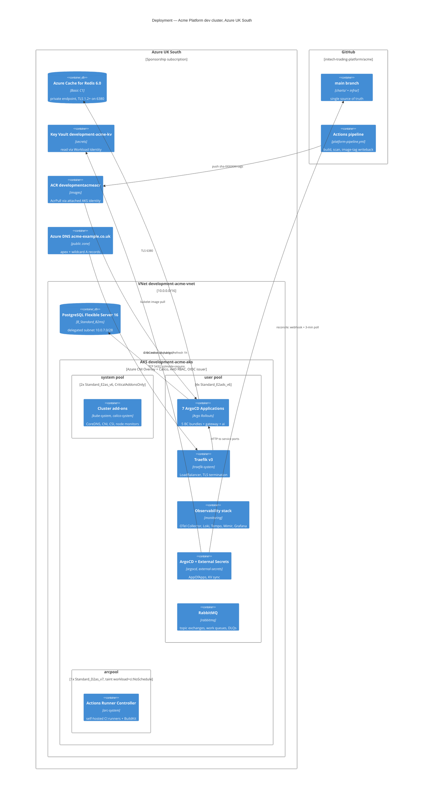
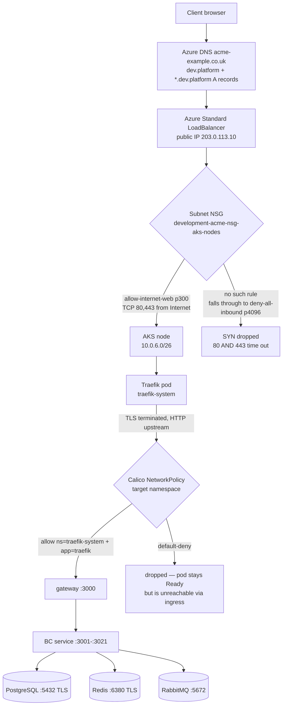
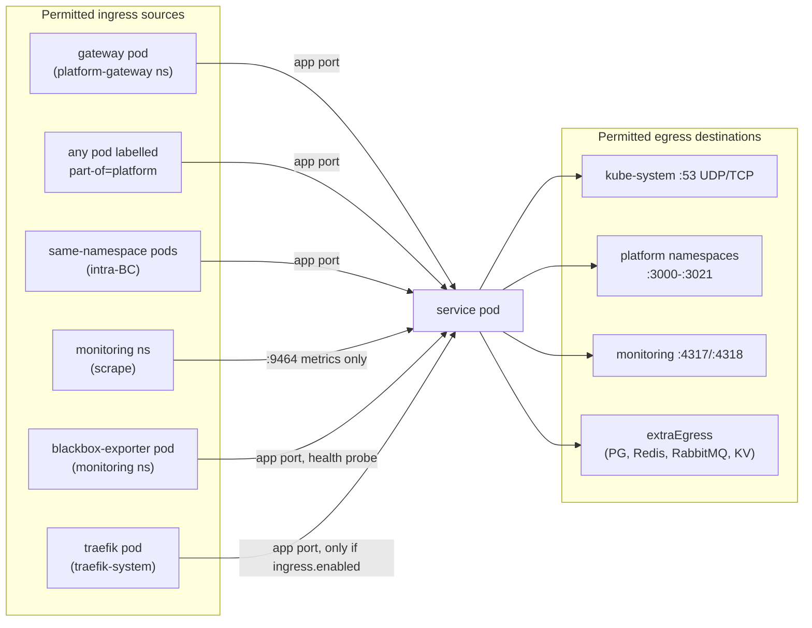
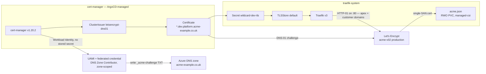
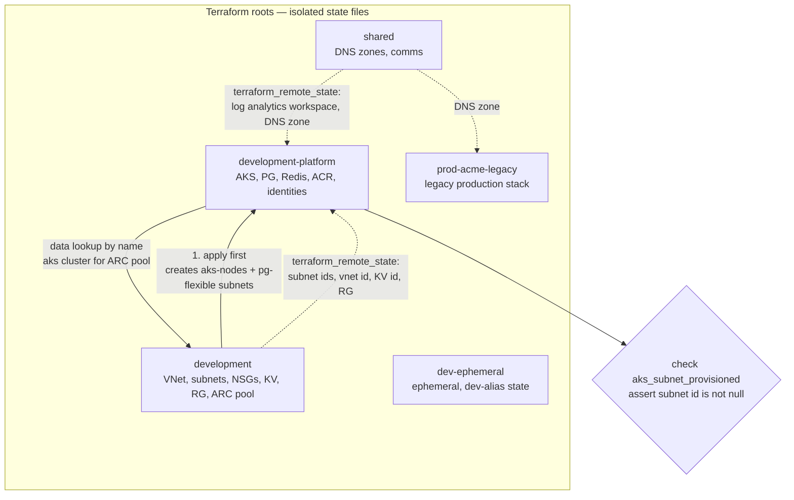

# Infrastructure — the Kubernetes substrate

What this covers: the AKS cluster that runs the Acme **Platform** stack — node pools and why
they are sized the way they are, the namespace layout, the ingress + TLS path (including the
one NSG rule without which nothing on the internet reaches the cluster), the NetworkPolicy
posture, storage classes, and the Terraform module/state layout that provisions all of it.
Everything here is read out of the Terraform under `infra/` and the Helm/ArgoCD manifests
under `charts/`. Where the running cluster and the declared code disagree, that is called out
rather than smoothed over. Environment-by-environment differences live in
[07-environments.md](07-environments.md).

---

## 1. Deployment topology



Takeaways:

1. **One cluster, three node pools, one purpose each** — system add-ons, platform workloads,
   CI runners. The CI pool is tainted so nothing else can land on it.
2. **The data tier is managed, not in-cluster.** PostgreSQL Flexible Server and Azure Cache
   for Redis are Azure PaaS reached over the VNet; only RabbitMQ runs inside the cluster.
   In-cluster CloudNativePG and per-BC Redis Sentinel exist in `charts/` as **inert values
   files that no Application references** (ADR-0037 — POC-gated CNPG per-BC data tier);
   committing them deploys nothing.
3. **No static credentials in the runtime path.** Pods reach Key Vault through per-namespace
   Workload Identity federation; the kubelet pulls from ACR via the cluster's attached
   managed identity, so `imagePullSecrets` is empty (ADR-0035 — Workload Identity end-to-end).
4. **GitHub holds desired state; the cluster converges on it.** CI never `kubectl apply`s
   workloads — it writes an image tag to `main` and ArgoCD does the rest
   (ADR-0032 — single-branch GitOps with AppOfApps).

**Invariant:** the cluster is disposable, the git repo is not. Every namespace, Application,
policy and issuer is declared under `charts/`; a cold rebuild is `terraform apply` plus one
`kubectl apply -f charts/argocd/root-app.yaml`.

---

## 2. Node pools

| Pool      | SKU (declared)      | Count              | vCPU / RAM | Role                                         |
| --------- | ------------------- | ------------------ | ---------- | -------------------------------------------- |
| `system`  | `Standard_E2as_v6`  | min=max=2          | 4 / 32 GiB | K8s system components, `CriticalAddonsOnly`  |
| `user`    | `Standard_E2ads_v6` | min=max=4          | 8 / 64 GiB | Platform services + infra components         |
| `arcpool` | `Standard_D2as_v7`  | 1 (autoscale 1..1) | 2 / 8 GiB  | CI runners, tainted `workload=ci:NoSchedule` |

Declared in `infra/modules/aks/` with explicit overrides in
`infra/environments/development-platform/main.tf`; the CI pool comes from `infra/modules/arc/`
invoked from `infra/environments/development/main.tf`.

The SKU choice is not a performance decision, it is a **quota** decision, and the reasoning is
worth carrying forward because it is the kind of constraint that silently invalidates a design:

- Azure enforces **two independent vCPU quotas** — a regional `cores` pool and a **per-VM-family
  cap**. The regional pool was self-service raised (20 → 30); the per-family caps were not.
- The original HA design put both pools on one `D*as_v7` family and computed its budget against
  the **regional** quota. The binding limit was the family cap of 10, so the 16-vCPU end-state
  was never fittable. Azure declined the family raise and backlogged it with no ETA.
- ADR-0055 (Platform dev AKS node-pool HA topology — multi-family E-series floor) resolves it
  by spreading the two pools across **two distinct families that each sit at 0/10**, and by
  choosing memory-optimised E-series: the cap is denominated in vCPU, so RAM is effectively free
  against it. 2 vCPU / 16 GiB per node fixes the memory-failover blocker that a same-vCPU D2
  could not (measured live user-pool load was ~2,885m CPU / ~9,820 MiB against a D2's ~6.5 GiB
  allocatable).
- **Both** unattended upgrade paths are disabled — `automatic_upgrade_channel = "none"` _and_
  `node_os_upgrade_channel = "None"`. Four user nodes plus one upgrade surge node is exactly
  10/10 on that family; an unattended node-image reimage would breach the cap. The cost is no
  automatic CVE patching on dev, mitigated by an operator patch SLA.

**Verification gap:** the platform's own infrastructure document still records a _live_ cluster
of 2× `Standard_D4as_v5`, captured before the pivot; the Terraform above is the declared target
and the user-pool move requires a manual blue/green (a `vm_size` change is ForceNew and the
provider's own rotation would breach the family cap mid-flight). Treat the table as **declared**,
not as observed, unless you have just run `kubectl get nodes`.

---

## 3. Network layout

```
+------------------------------------------------------------------------+
| VNet: development-acme-vnet (10.0.0.0/16)                              |
|                                                                        |
|  +----------------------+  +----------------------+                    |
|  | postgres             |  | legacy-api           |                    |
|  | 10.0.1.0/24  (251)   |  | 10.0.2.0/24  (251)   |                    |
|  | legacy PostgreSQL    |  | legacy App Service   |                    |
|  +----------------------+  +----------------------+                    |
|                                                                        |
|  +----------------------+  +----------------------+                    |
|  | github-runner        |  | domain-api           |                    |
|  | 10.0.3.0/28   (11)   |  | 10.0.4.0/23  (507)   |                    |
|  | CI VM                |  | Container Apps       |                    |
|  +----------------------+  +----------------------+                    |
|                                                                        |
|  +----------------------+  +----------------------+                    |
|  | aks-nodes            |  | pg-flexible          |                    |
|  | 10.0.6.0/26   (62)   |  | 10.0.7.0/28   (11)   |                    |
|  | AKS node VMs         |  | delegated to PG      |                    |
|  +----------------------+  +----------------------+                    |
|                                                                        |
|  Pod network:  Azure CNI Overlay  172.16.0.0/16                        |
|  Service CIDR: 10.1.0.0/24        DNS service IP: 10.1.0.10            |
|  Traefik LB public IP: 203.0.113.10                                    |
+------------------------------------------------------------------------+
```

The legacy stack (legacy-api App Service, legacy-web, domain-api Container Apps, legacy
PostgreSQL) shares the VNet with the new cluster. That is deliberate: it keeps the migration
path private-network-internal, and it is why the AKS subnet is a **narrow /26** carved out of an
address plan that predates it.

### 3.1 North-south path, and the rule that is easy to miss



Takeaways:

1. **Public ingress needs an explicit rule on the Terraform-owned subnet NSG.** AKS's
   cloud-controller writes the LoadBalancer allow only into the NSG _it_ manages (the
   `MC_…` agentpool/NIC NSG). It never touches a custom subnet NSG. The rule is
   `allow-internet-web`, priority 300, `Internet → TCP 80,443`, gated behind
   `enable_public_web_ingress` (default **off**; `true` only for the dev environment).
2. **The failure mode is invisible to every health gate.** Client source IPs survive the LB, so
   they match neither `AzureLoadBalancer` nor `VirtualNetwork` and fall through to
   `deny-all-inbound` at priority 4096. Both 80 and 443 time out with no SYN-ACK, while
   kubelet probes (node-local) and ArgoCD sync status stay green.
3. **Port 80 is not optional.** It carries the Let's Encrypt HTTP-01 challenge (validated from
   arbitrary source IPs) plus the permanent 80→443 redirect.
4. **Egress is default-deny too.** `deny-all-outbound` at 4096, with narrow allows: 443 to
   specific service tags, VNet-internal any, and SMB 445 / NFS 2049 scoped to
   `Storage.UKSouth` — the regional tag, not the global `Storage` tag, so a compromised node
   cannot mount a storage account in another region.

**Invariant:** any environment that faces the internet must set `enable_public_web_ingress`
_and_ keep the deny-all rules; the NSG is the only place where "reachable from the internet" is
expressed, and nothing in Kubernetes will tell you it is missing.

### 3.2 East-west: NetworkPolicy posture

Every service rendered by `charts/platform-base` gets a default-deny ingress policy plus an
explicit allow set (`charts/platform-base/templates/networkpolicy.yaml`).



Takeaways:

1. **Two modes of cross-namespace ingress**, selected by `networkPolicy.crossNamespaceIngress`:
   the default `platform` mode admits any pod labelled `part-of=platform`; the hardened
   `gateway` mode admits only the gateway pod. The hardened mode exists because the gateway
   injects identity headers that downstream guards trust **without a signature** — so any pod
   able to reach the app port directly can forge identity. Use `gateway` wherever the gateway is
   the sole cross-namespace HTTP caller.
2. **Scraping is port-scoped.** The monitoring namespace is allowed to `:9464` only; a separate,
   pod-scoped rule lets the blackbox exporter hit the app port for `/health`. Without that second
   rule the default-deny silently drops probes and every "service down" alert fires falsely.
3. **Traefik's allow is coupled to `ingress.enabled`.** A service that renders an IngressRoute
   always renders the matching allow — you cannot ship a routed service that is policy-blocked.
4. **Namespaces are PSA-labelled `restricted`** (enforce/audit/warn), matching the chart's
   `runAsNonRoot`, `drop: ["ALL"]`, `readOnlyRootFilesystem`, `seccompProfile: RuntimeDefault`
   defaults. Only `/tmp` is writable, via emptyDir.

---

## 4. Namespaces

| Namespace                                                                                     | Owner                       | Contents                                    |
| --------------------------------------------------------------------------------------------- | --------------------------- | ------------------------------------------- |
| `platform-gateway`, `platform-ai`                                                             | ApplicationSet (standalone) | one service each                            |
| `platform-identity`, `platform-trading`, `platform-finance`, `platform-comms`, `platform-ops` | ApplicationSet (bundles)    | 2–3 services per BC bundle                  |
| `platform-frontend`                                                                           | dedicated Application       | the SPA served same-origin                  |
| `argocd`, `argo-rollouts`, `external-secrets`, `cert-manager`, `reloader`                     | root AppOfApps              | GitOps + secrets + certs control plane      |
| `traefik-system`                                                                              | **standalone Helm**         | edge proxy — _not_ ArgoCD-reconciled        |
| `rabbitmq`, `rabbitmq-system`                                                                 | manifests / operator        | broker + topology operator                  |
| `monitoring`                                                                                  | AppOfApps                   | OTel Collector, Loki, Tempo, Mimir, Grafana |
| `arc-system`                                                                                  | AppOfApps                   | CI runners + BuildKit                       |
| `kube-system`, `calico-system`, `tigera-operator`                                             | AKS / operator              | platform system                             |

The seven workload namespaces are **declared as manifests in git**
(`charts/argocd/platform-namespaces.yaml`) rather than created by ArgoCD's
`CreateNamespace=true`. Two annotations carry the whole rationale:

- `sync-wave: '-1'` — namespaces must exist before the bundle ApplicationSets target them.
- `sync-options: Prune=false` — a namespace deletion takes every workload in it with it, so it
  must never be cascade-pruned. This file exists because six namespaces once vanished when a
  staged production ApplicationSet was accidentally applied to the dev cluster, and deletion
  wedged on message-broker topology finalizers.

Per-namespace `ResourceQuota` and `LimitRange` are rendered by the chart
(`resourcequota.yaml`, `limitrange.yaml`) and sized per environment overlay.

**Verification gap:** `openbao` appears in the manifest set but I could not confirm from the
repository whether it is deployed on the live cluster; ADR-0051 (cloud-native provider-neutral
secrets and identity) treats it as the forward path, ESO + Key Vault as today's.

---

## 5. Ingress and TLS

Traefik is a **standalone Helm release** (`traefik/traefik` v39 in `traefik-system`, values at
`charts/infrastructure/traefik-values.yaml`). It is deliberately _not_ an AppOfApps child, which
means config changes require a manual `helm upgrade` — the single most common source of "I
changed it in git and nothing happened" on this platform.

Two ACME owners share the edge, with non-overlapping responsibilities (ADR-0068 — wildcard TLS
via cert-manager DNS-01 with Azure DNS Workload Identity):



Takeaways:

1. **Wildcards require DNS-01.** Let's Encrypt will not issue `*.dev.platform.acme-example.co.uk`
   over HTTP-01, and tenant-subdomain routing (ADR-0066 — hostname-based tenant resolution)
   needs a wildcard or every new tenant pays a cold ACME round-trip against a 50-cert/week
   registered-domain limit.
2. **Credentials never enter the edge proxy.** cert-manager authenticates to Azure DNS via a
   user-assigned managed identity federated to its ServiceAccount, scoped to one zone. The
   alternative — Traefik's embedded `azuredns` provider — would put zone credentials in the
   internet-facing pod's environment. Rejected on security placement.
3. **Customer-owned domains stay on HTTP-01.** A domain like `trading.partner-example.co.uk`
   is outside the managed zone, so DNS-01 is impossible; a per-domain router with
   `certResolver: letsencrypt` handles it with no delegation required.
4. **Traefik does not retry a failed `obtain`.** The pod must be restarted to trigger another
   attempt — a real operational quirk, and part of why wildcard renewal was moved to
   cert-manager, whose renewals are controller-driven and alertable on
   `certmanager_certificate_expiration_timestamp_seconds`.
5. **DNS is Terraform-managed but cross-subscription.** Both the apex and wildcard A records
   point at the same LB IP and are declared with a `shared_dns` provider alias; neither carries
   `prevent_destroy`, because destroying the dev cluster _should_ remove the records that point
   at it. The zone itself is protected in the `shared` state.

Per-service routing is rendered by `charts/platform-base/templates/ingress.yaml` (a Traefik
IngressRoute) together with three middlewares in the same chart: `compress`, `ratelimit`,
`security-headers`.

---

## 6. Storage

| Class                   | Backing                   | Used by                                                           |
| ----------------------- | ------------------------- | ----------------------------------------------------------------- |
| `managed-csi`           | Azure Disk (standard)     | Traefik `acme.json`, RabbitMQ 20Gi, Tempo, in-cluster Redis values |
| `managed-csi-premium`   | Azure Disk (premium)      | BuildKit layer cache; CloudNativePG POC clusters                  |
| `azurefile-csi-premium` | Azure Files Premium (SMB) | ARC shared npm/Nx cache, 1 TiB (ADR-0041)                         |

Two constraints follow from these choices and are worth stating explicitly:

- **Azure Disk is ReadWriteOnce.** Traefik's `acme.json` lives on an RWO PVC, so the Traefik
  deployment cannot roll with surge — a second pod cannot attach the same disk. This is the
  structural reason a shared cert store scales badly and another reason wildcard issuance moved
  to a Kubernetes Secret.
- **Azure Files needs SMB egress.** The RWX CI cache mounts over port 445, which the default-deny
  egress rule blocks until `allow-egress-storage-smb` (priority 140, `Storage.UKSouth`) is
  present. The symptom is `mount error(115): Operation now in progress` — not an obvious
  networking error.

---

## 7. Terraform layout

```
infra/
├── environments/                 # one remote state file per directory
│   ├── shared/                   # DNS zones, communication services (cross-subscription)
│   ├── development/              # VNet, subnets, NSGs, Key Vault, RG, legacy apps, ARC pool
│   ├── development-platform/     # AKS, PG Flexible, Redis, ACR, managed identities, DNS records
│   ├── prod-acme-legacy/       # legacy production: App Service, Container Apps, PG, Front Door
│   └── dev-ephemeral/             # ephemeral per-developer stack (dev-{alias} state)
├── modules/                      # ~40 modules; every module: main.tf, variables.tf, outputs.tf
│   ├── aks/                      # cluster, node pools, upgrade channels, diagnostics
│   ├── network/                  # VNet, subnets, NSGs (incl. enable_public_web_ingress)
│   ├── postgres-flexible/        # PG 16, VNet delegation, prevent_destroy
│   ├── redis/                    # Azure Cache for Redis, private endpoint + private DNS zone
│   ├── arc/                      # CI node pool, Azure Files cache, runner identities
│   ├── platform-cert-manager-dns/# UAMI + federated credential for DNS-01
│   ├── platform-key-vault-secrets/
│   ├── github-app/               # deploy identity (PEM stored in Key Vault)
│   └── ...
└── .terraform-version
```



Takeaways:

1. **State isolation is a blast-radius decision.** AKS provisioning takes 30+ minutes and is
   non-atomic; a failed apply must not be able to lock or corrupt the state that holds the
   legacy production platform.
2. **Apply order is enforced in code, not documentation.** `development` must apply before
   `development-platform`, and a `check` block asserts the subnet id is non-null with an error
   message naming the exact fix. Preconditions like this convert a confusing mid-apply failure
   into a one-line diagnosis.
3. **There is a circular _reference_ but not a circular _dependency_.** `development-platform`
   creates the AKS cluster; `development` attaches the CI node pool to it via a `data` lookup by
   name. That is why the CI pool lives in the other root.
4. **`-target` hygiene matters here.** Modules that need the cluster's OIDC issuer read it from
   a **data source**, not from `module.aks.oidc_issuer_url`, specifically so a targeted apply
   does not drag the whole cluster resource into the plan.
5. **The CI service principal is `Contributor`, not `Owner`.** It cannot create
   `azurerm_management_lock` or `azurerm_role_assignment`. Those — and the cross-subscription
   DNS Zone Contributor grant for cert-manager — are created out of band by an operator, and the
   Terraform records the exact command in the module header rather than pretending it is
   automated.

**Invariant:** anything Terraform cannot create because of a permission boundary is represented
in code as a gated variable plus an output that feeds the manual command (for example
`manage_role_assignments = false` with `principal_id` / `dns_zone_id` outputs). The gap is
declared, not hidden.

---

## 8. Deciding ADRs

| ADR      | Title                                                                | What it fixes here                       |
| -------- | -------------------------------------------------------------------- | ---------------------------------------- |
| ADR-0013 | Per-BC PostgreSQL schema isolation                                   | one database, schema per bounded context |
| ADR-0015 | Zero-downtime deploys — rolling update + init container + PDB        | probe/drain contract                     |
| ADR-0017 | RabbitMQ unified messaging, Redis cache-only                         | broker in-cluster, Redis is disposable   |
| ADR-0019 | OpenTelemetry + Grafana stack                                        | `monitoring` namespace contents          |
| ADR-0020 | External Secrets Operator + SOPS for secrets                         | Key Vault → K8s Secret path              |
| ADR-0032 | Single-branch GitOps with AppOfApps                                  | one `main`, no `gitops/*` branches       |
| ADR-0033 | BC-aligned bundle deploy units                                       | 7 Applications, 7 namespaces             |
| ADR-0034 | Argo Rollouts canary with SLO analysis                               | in-cluster auto-rollback                 |
| ADR-0035 | Workload Identity end-to-end                                         | no static credentials in the deploy path |
| ADR-0037 | POC-gated CloudNativePG per-BC data tier                             | why `charts/databases/` is inert         |
| ADR-0039 | ARC on AKS for self-hosted runners                                   | `arcpool`, taints, labels                |
| ADR-0041 | Azure Files RWX cache for ARC runners                                | SMB egress rule, premium file share      |
| ADR-0043 | Platform dev cluster vendor selection (+ amendment: stay on Azure)   | why the cluster did not move             |
| ADR-0051 | Cloud-native, provider-neutral secrets and identity                  | forward path off Azure-coupled secrets   |
| ADR-0055 | Platform dev AKS node-pool HA topology — multi-family E-series floor | the node pool table above                |
| ADR-0066 | Hostname-based tenant resolution                                     | why a wildcard host is needed            |
| ADR-0068 | Wildcard TLS via cert-manager DNS-01 (Azure DNS Workload Identity)   | the two-ACME-owner split                 |
