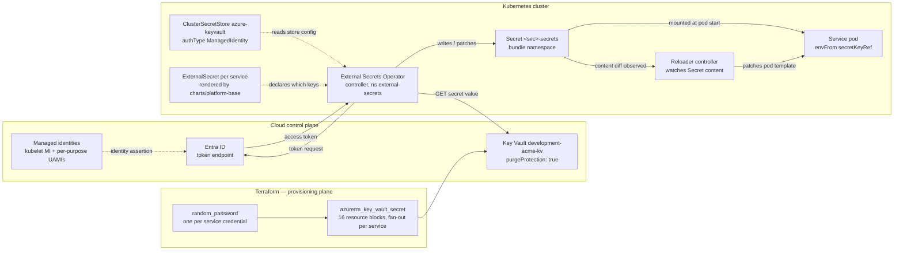
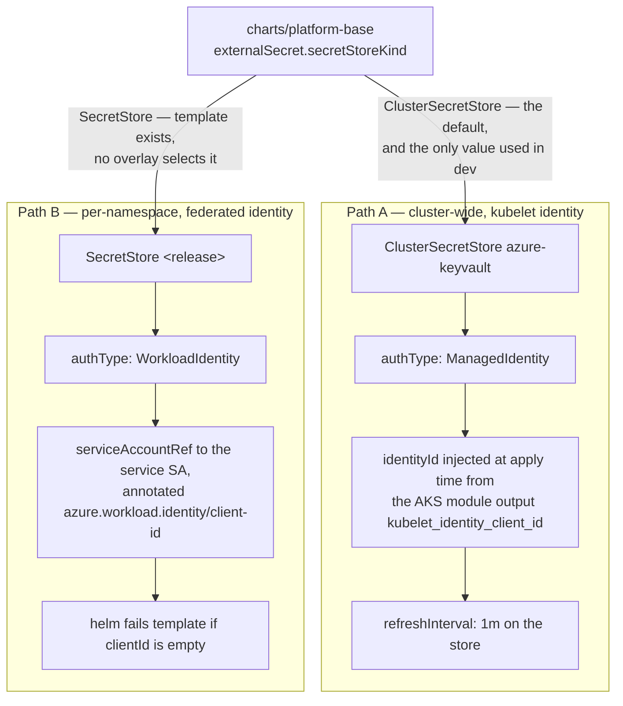
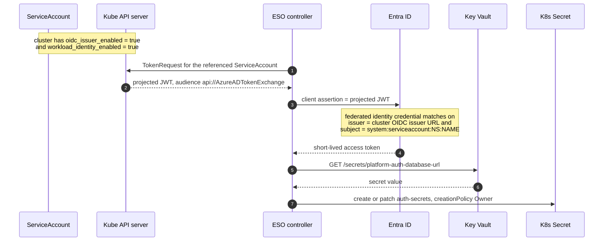
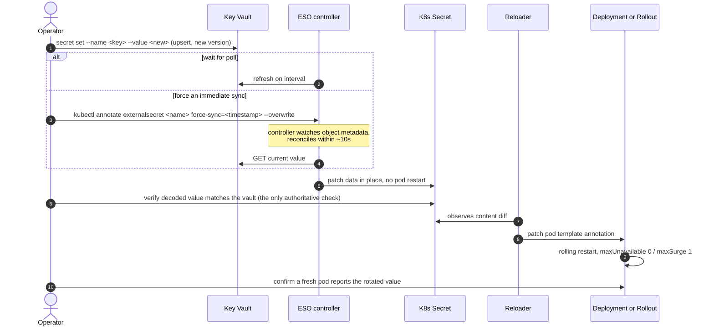
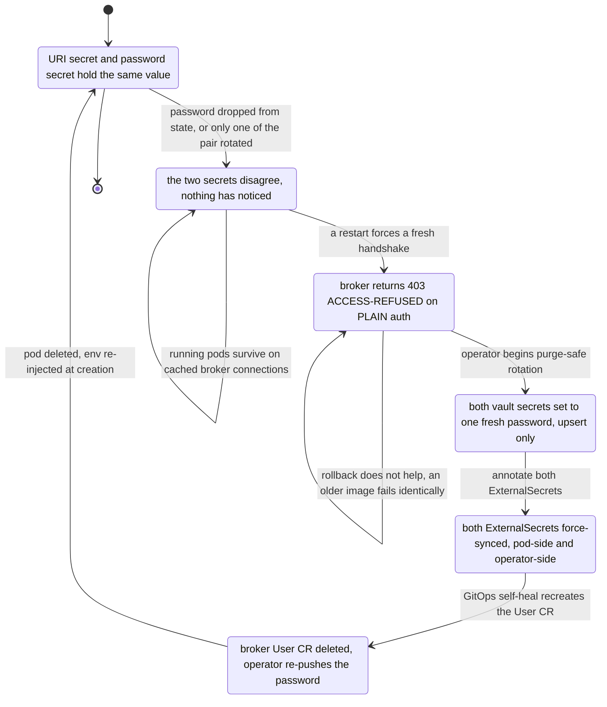
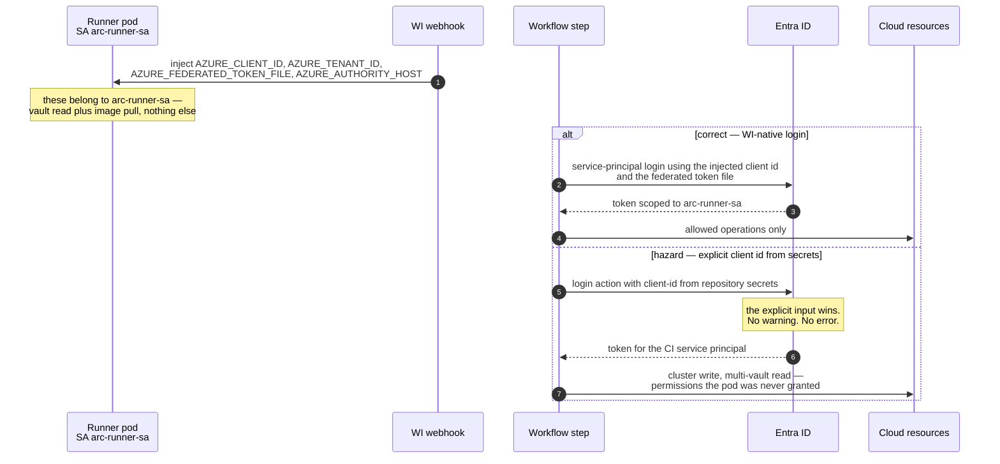

# Secrets and Identity — Key Vault to Pod, Without a Static Credential

What this covers: the full credential chain for the Acme Platform cluster — how a value
provisioned by Terraform into a cloud key vault becomes an environment variable inside a
distroless pod, who authenticates to whom at each hop, and what breaks. It also covers the
rotation runbook (including the automatic-restart mechanism that makes rotation
propagate), the drift failure mode that silently 403s a service days after the drift
happened, and the confused-deputy hazard that lets a CI step on a Workload-Identity pod
authenticate as a much broader identity without any error. Everything below was read out
of the chart templates, the Terraform module, the runbooks and the ADRs; where the
implemented state diverges from the ADR that mandated it, the divergence is stated rather
than smoothed over.

Deciding ADRs: **ADR-0020 External Secrets Operator + SOPS**, **ADR-0020-amendment ESO
Refresh Interval and Secret-Rotation Drill (POC A3)**, **ADR-0035 Workload Identity
End-to-End**, **ADR-0035-amendment Platform Image-Build Identity — main-only federated-credential scope**,
**ADR-0038 Service Credentials and Key-Vault Secret Provisioning**, **ADR-0049 RabbitMQ
Cluster Operator Adoption**, **ADR-0051 Cloud-Native Provider-Neutral Secrets and
Identity**, **ADR-0053 RS256 JWT with JWKS**.

---

## 1. The chain, end to end



**Takeaways**

1. **The application pod never authenticates to the key vault.** It reads a plain
   Kubernetes `Secret` mounted by `envFrom`/`secretKeyRef`. Every cloud call happens in the
   ESO controller. This is the property that makes ADR-0051's store swap a
   one-`ClusterSecretStore` change rather than an application rewrite.
2. **Terraform writes values once and then stops.** Fifteen of the sixteen
   `azurerm_key_vault_secret` blocks carry `lifecycle { ignore_changes = [value] }`, so a
   later `apply` never reconciles a rotated value. That makes operator rotation safe and
   makes state loss catastrophic (§6).
3. **The vault has `purgeProtection: true`.** A deleted secret name cannot be re-created
   for the soft-delete retention window. Every rotation procedure is therefore an _upsert_
   (`secret set`, which adds a new version) — never delete-and-recreate.
4. **Two authentication paths exist in the chart; only one is live.** The cluster-wide
   `ClusterSecretStore` uses `authType: ManagedIdentity` (the AKS kubelet identity). The
   per-namespace `SecretStore` template uses `authType: WorkloadIdentity` with a
   `serviceAccountRef`. No environment overlay in the repository sets
   `externalSecret.secretStoreKind: SecretStore`, so the WIF path is built but unused.
5. **Invariant:** no plaintext credential may exist in `charts/**`. ADR-0035 extends
   `validate-helm-charts.sh` to fail on `password:` / `cookie:` / `secret:` keys outside
   the ESO `secrets:` map — a gate added precisely because a broker password and Erlang
   cookie _were_ committed in `charts/infrastructure/rabbitmq-values.yaml`.

---

## 2. The two store paths, and which one the cluster actually runs



**Takeaways**

1. Path A's `identityId` used to be a hard-coded GUID in the chart
   (`00000000-0000-0000-0000-000000000001`). Re-provisioning the cluster produced a new
   kubelet identity and **every ESO sync in every namespace failed simultaneously** until
   someone edited the chart. ADR-0035 moved it to an `envsubst` placeholder substituted by
   `charts/infrastructure/apply-eso-secretstore.sh` from the Terraform output — identity
   rotation is now an infra operation, not a chart commit.
2. Path A's blast radius is the whole cluster by construction: one store, one identity,
   every namespace. Path B trades that for a per-service identity but requires one federated
   identity credential per service.
3. `charts/platform-base/templates/serviceaccount.yaml` contains an explicit
   `{{- fail ... }}` when Path B is selected without a `workloadIdentity.clientId`. A
   mis-wired identity is a template error, not a runtime `403` an hour later — the failure
   is moved left by design.
4. **Unverified / at-risk:** ADR-0035's title claims Workload Identity _end-to-end_.
   ADR-0051 §Context states the live `ClusterSecretStore` runs `authType=ManagedIdentity`,
   and no overlay in the repo selects Path B. Treat "WIF end-to-end for secrets" as the
   intent, not the deployed state.

---

## 3. Federation mechanics — how a projected token becomes a vault read



**Takeaways**

1. The federation contract is a **string match on `subject`**. Terraform writes
   `subject = "system:serviceaccount:<namespace>:<serviceaccount>"` against
   `issuer = <cluster OIDC issuer URL>`. Rename the namespace or the ServiceAccount and the
   assertion stops matching — the symptom is an authentication failure, not a
   Kubernetes error.
2. Nothing long-lived crosses the boundary. The projected token has a short TTL and the
   exchanged access token is shorter still. There is no secret to rotate on this hop, which
   is the entire point of ADR-0035.
3. The same federation shape is used outside the secret path: the CI runner pool federates
   `system:serviceaccount:arc-system:arc-runner-sa`, `…:arc-builder-sa` and
   `…:arc-buildkitd-sa` to three separate user-assigned identities so a build step cannot
   borrow the runner's permissions.
4. **Invariant:** one identity per ServiceAccount, one ServiceAccount per trust boundary.
   Sharing a ServiceAccount across two workloads silently merges their permission sets.

---

## 4. What the chart renders — the `secrets:` map contract

The `platform-base` chart takes a single map and derives both halves of the wiring, so a
key can never exist in one and not the other:

```
charts/bundles/identity-bundle/values.yaml
└── auth-service:
      externalSecret:
        enabled: true
        targetName: auth-secrets            # decouples Secret name from release name
        data:
          - secretKey: database-url         → remoteRef.key: platform-auth-database-url
          - secretKey: redis-url            → remoteRef.key: platform-auth-redis-url
          - secretKey: revocation-redis-url → remoteRef.key: platform-revocation-redis-url
          - secretKey: rabbitmq-password    → remoteRef.key: platform-auth-rabbitmq-password
          - secretKey: recovery-code-hmac-key
          - secretKey: encryption-key

         renders  ─────────────────────────────────────────────┐
                                                               │
  ExternalSecret/auth-secrets                                  │  Deployment env:
    spec.refreshInterval: <externalSecret.refreshInterval>     │    - name: DATABASE_URL
    spec.secretStoreRef: {name: azure-keyvault,                │      valueFrom:
                          kind: ClusterSecretStore}            │        secretKeyRef:
    spec.target: {name: auth-secrets, creationPolicy: Owner}   │          name: auth-secrets
    spec.data[]: secretKey → remoteRef.key                     │          key: database-url
```

Key-Vault naming taxonomy actually emitted by `infra/modules/platform-key-vault-secrets`:

```
<prefix>-<service>-database-url                 per service, ignore_changes on value
<prefix>-<service>-pg-password                  per service
<prefix>-<service>-rabbitmq-password            per service, ignore_changes REMOVED (task 1185 / AC-6)
<prefix>-<service>-rabbitmq-uri                 per service, full amqp:// URI  ← the drift pair
<prefix>-<service>-redis-url                    per service
<prefix>-<service>-erp-token-encryption-key     per service that talks to the ERP
<prefix>-<service>-storage-connection-string    per service that writes blobs
<prefix>-rabbitmq-admin-pass                    singleton
<prefix>-revocation-redis-url                   singleton, gateway + auth share it
<prefix>-gateway-jwt-secret                     singleton (HMAC era)
<prefix>-auth-jwt-secret                        singleton (HMAC era)
<prefix>-auth-recovery-code-hmac-key            singleton
<prefix>-auth-encryption-key                    singleton, column encryption
<prefix>-tenant-encryption-key                  singleton, column encryption
<prefix>-internal-api-secret                    singleton, service-to-service
<prefix>-<service>-secret-rotation-state        optional, ISO-8601 last-rotation stamp
```

**Takeaways**

1. `targetName` deliberately decouples the Kubernetes `Secret` name from the Helm release
   name, so a bundle rename does not orphan a `Secret` that pods already reference.
2. **A single missing remote key fails the whole target `Secret`.** The RS256 JWT keypair
   entries (ADR-0053) are therefore gated behind `jwtKeys.provisioned` with `required`
   guards on both `remoteRef` values: rendering them before an operator seeds the vault
   would take running pods down, which is exactly what happened in the incident the guard
   references.
3. The `-secret-rotation-state` entry stores the last successful rotation timestamp _in the
   vault_, not in a ConfigMap, so the audit trail is as tamper-evident as the secrets it
   describes; an alert can then fire when a credential's age exceeds the policy window.
4. **Invariant:** `creationPolicy: Owner` means ESO owns the `Secret`. Editing it with
   `kubectl` is reverted on the next refresh — the only supported write path is the vault.

---

## 5. Rotation runbook — the propagation chain



**Takeaways**

1. **The timing argument is the decision.** POC A3 measured the worst-case per-pod rolling
   window from the chart's own probe settings — startup `5 + 10x5 = 55s`, readiness `5x3 =
15s`, `preStop 5s`, `terminationGracePeriod 30s` ≈ **105s per pod, ~210s for two
   replicas**. Rounded to a ≤300s window, and `refreshInterval: 1m` gives a 5x margin, so a
   pod that starts mid-rotation cannot read a stale value. The number is asserted by a
   committed spec constant, so changing the interval breaks a test rather than a cluster.
2. **`force-sync` updates the `Secret` in place and does not restart anything.** That is
   what makes it safe: a malformed value is visible in step "verify" _before_ any pod is
   replaced. The runbook's dry-run mode exists for the same reason — a syntactically valid
   but semantically wrong value syncs happily and then fails `startupProbe` on the next
   restart.
3. **Reloader closes the last gap.** The chart previously carried a `checksum/secrets`
   annotation that hashed _Helm values_, not live `Secret` content — so vault rotations
   landed in the `Secret` and pods were never rolled. That annotation was removed and
   replaced by `secret.reloader.stakater.com/auto: "true"`, emitted on both the
   `Deployment` and `Rollout` templates. Reloader is installed as its own Application at
   sync-wave `-12` so the controller is watching before the first ESO-synced `Secret`
   lands.
4. Services that read a secret only on an admin path opt out with `reloader.autoRestart:
false`; Reloader treats anything other than the literal string `"true"` as opt-out.
5. **Constraint:** environment variables are injected at pod creation. Nothing short of a
   pod replacement changes what a running process sees — Reloader automates the
   replacement, it does not avoid it.

---

## 6. The drift failure mode — two vault secrets that must agree

Per-service broker credentials are stored as **two** vault secrets derived from **one**
`random_password`: the full `amqp://<svc>_user:<pw>@…/acme` URI that the _pod_ connects
with, and the raw password that the messaging topology operator pushes into the _broker_.
Because the value is written once and then ignored by Terraform, the two can diverge.



**Takeaways**

1. **The diagnosis signature is a false green.** The broker `User` custom resource reports
   `Ready=True` because that reflects the last _create_, not a broker-to-secret sync — while
   the pod is refused with `403 ACCESS-REFUSED … PLAIN`. A `terraform plan` shows the
   credential resources as _to add_: present in the live vault, absent from state.
2. **The topology operator does not re-push on secret-content change.** Rotation therefore
   _requires_ deleting the `User` CR and letting GitOps self-heal recreate it. Skipping that
   step leaves the broker on the old password no matter how many times the `Secret` is
   force-synced.
3. **Rollback is not a mitigation** for this class. The failure is in the credential pair,
   not the image; an older revision reconnects fresh and fails identically.
4. The durable fix is to re-import the dropped resources so Terraform manages them again.
   The `-rabbitmq-password` block has already had `ignore_changes` removed with a pre-apply
   divergence guard, which restores reconciliation for that one surface.
5. **Invariant to enforce anywhere this pattern appears:** if two stored artefacts must
   carry the same value, either derive both from one source at read time, or add a check
   that compares them — never rely on both being written correctly once.

---

## 7. The confused-deputy hazard

The Workload-Identity webhook injects four variables into any pod whose ServiceAccount is
annotated for federation: `AZURE_CLIENT_ID`, `AZURE_TENANT_ID`,
`AZURE_FEDERATED_TOKEN_FILE`, `AZURE_AUTHORITY_HOST`. They describe the _pod's_ bound
identity. A workflow step that logs in with an **explicit** client id from repository
secrets overrides them — and the login succeeds, silently, as the far broader CI principal.



**Takeaways**

1. The failure is **silent and successful**. Nothing in the logs distinguishes the two
   branches except which identity appears in the cloud audit trail after the fact.
2. It defeats the entire reason for per-label ServiceAccount isolation: three separate
   identities for runner, builder and BuildKit daemon are pointless if any step can opt
   back into the broad principal.
3. **Rule:** on a Workload-Identity pod, authenticate from the injected variables only. If a
   step genuinely needs a _different, broader_ identity, run it on a hosted runner instead —
   do not override federation on an isolated pod.
4. Never use instance-metadata login on a pod: the metadata endpoint is unreachable from a
   pod network namespace, so it fails in a way that invites exactly the wrong workaround.
5. The same class shows up elsewhere as configuration drift — an imperative CLI write that
   diverges from the declarative source, with no error at the moment of divergence.

---

## 8. Detecting failures in the chain

| Detector                                           | Fires on                                                 | Source of the series                         | Window  |
| -------------------------------------------------- | -------------------------------------------------------- | -------------------------------------------- | ------- |
| `platform-eso-sync-failed` (critical)              | any `ExternalSecret` with `Ready=False`                  | `externalsecret_status_condition`            | 5m      |
| `platform-kv-imminent-expiry` (warning)            | `time_to_expiry_days` ≤ 14                               | `kv-expiry-checker` CronJob, daily 08:00 UTC | instant |
| `platform-wildcard-cert-imminent-expiry` (warning) | wildcard TLS expiry ≤ 14 days                            | probe/cert exporter                          | instant |
| Blackbox `probe_class="infra-dependency"`          | ESO webhook, registry, broker management API unreachable | blackbox scraper                             | 1m      |

The expiry checker deserves a note because its shape is unusual: it is a CronJob that
authenticates via the _kubelet_ managed identity (the same identity the `ClusterSecretStore`
uses, so no extra federation is required), writes Prometheus exposition lines to a small
Pushgateway that persists between runs, and is scraped by an OpenTelemetry collector rather
than by a `ServiceMonitor` — the cluster has no Prometheus Operator running, so the
`ServiceMonitor` that once shipped in that file was inert and was deleted. It also emits
`kv_secret_no_expiry_total`, counting secrets with **no expiry attribute at all** — the
irreducible "rotate-or-document" set that the 14-day alert can never see.

**Constraint this encodes:** an alert on a metric nobody emits is indistinguishable from
health. Both the deleted `ServiceMonitor` and the counter for expiry-less secrets exist
because someone checked whether the detector had a source. See
[`06-observability.md`](./06-observability.md) §6 for the general treatment.

---

## 9. Where this is going — the provider-neutral target

ADR-0051 supersedes ADR-0035 and ADR-0038 with a directive: secret management must not be
coupled to one cloud. The chosen replacement keeps ESO as the swappable abstraction and
changes only what sits behind it.

| Layer                | Today                                            | ADR-0051 target                                                  |
| -------------------- | ------------------------------------------------ | ---------------------------------------------------------------- |
| Secret store         | cloud key vault, `provider.azurekv`              | OpenBao (CNCF Vault fork) with Raft storage, `provider.vault`    |
| Workload identity    | kubelet managed identity / federated credentials | OpenBao Kubernetes auth: projected SA JWT → TokenReview → policy |
| Git-resident secrets | SOPS + age (unchanged)                           | SOPS + age (unchanged)                                           |
| Provisioning module  | `azurerm_key_vault_secret`                       | `openbao_kv_secret_v2`                                           |
| Application contract | `ExternalSecret` CRs                             | **identical** — no app or schema change                          |

Three things in that table are load-bearing:

1. **Blast radius ≈ one `ClusterSecretStore`, one Terraform module, a handful of chart
   files, and zero application code.** That is the return on having pods read only a
   Kubernetes `Secret` (§1 takeaway 1).
2. **The mandatory pre-migration audit is the highest-risk step.** Because
   `ignore_changes = [value]` means Terraform state holds _initial_, not current, values,
   live values must be exported from the vault before any destroy. The drift incident in §6
   is the confirmed example of state and reality disagreeing.
3. **The dev unseal mechanism is explicitly not production-grade.** Shamir shares in an
   RBAC-restricted Kubernetes `Secret`, read after the daily node-pool restart, produce a
   2–3 minute window where ESO reports sync errors. ADR-0051 accepts that for dev and
   requires a redesign before any production environment.
4. **A detector dies in the migration.** The expiry checker is vault-specific; ADR-0051
   flags replacing it with a store-agnostic credential-age alert — which is what the
   `-secret-rotation-state` secret from §4 was designed to feed.

---

## 10. Honest gaps

- **"Workload Identity end-to-end" is aspirational for the secret path.** The live store
  authenticates as the kubelet managed identity; the per-namespace federated path is
  implemented in the chart but selected by no overlay.
- **The GitHub App scope claim in ADR-0035 is withdrawn by its own erratum.** App repository
  permissions are repo-wide; there is no path-scoping. A compromised installation token is
  not bounded to `charts/**`. The real gate on writes to the default branch is required
  status checks.
- **Reloader coverage is partial by design.** It rolls workloads on `Secret` content
  change; it cannot re-push a credential into an external system such as a message broker
  (§6 step "delete the User CR").
- **One singleton secret is provisioned out of band.** The internal service-to-service
  secret must exist in the vault before staging or production sync, or services that fail
  closed on it will not start. This is tracked, not automated.
- I did not find a committed automated check that the two halves of the broker credential
  pair hold the same value; the pre-apply guard covers the password resource only.

---

Related: [`01-gitops-topology.md`](./01-gitops-topology.md) for how chart changes reach the
cluster, [`03-ci-pipeline.md`](./03-ci-pipeline.md) for the runner identities named in §3
and §7, [`06-observability.md`](./06-observability.md) for the alerting substrate the
detectors in §8 run on.
