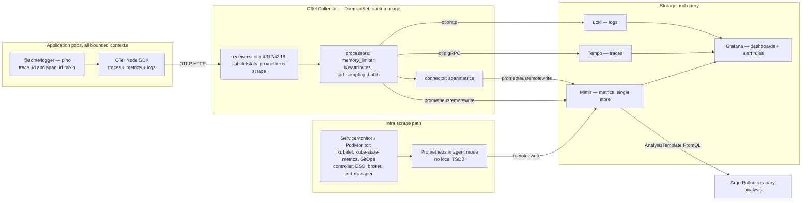
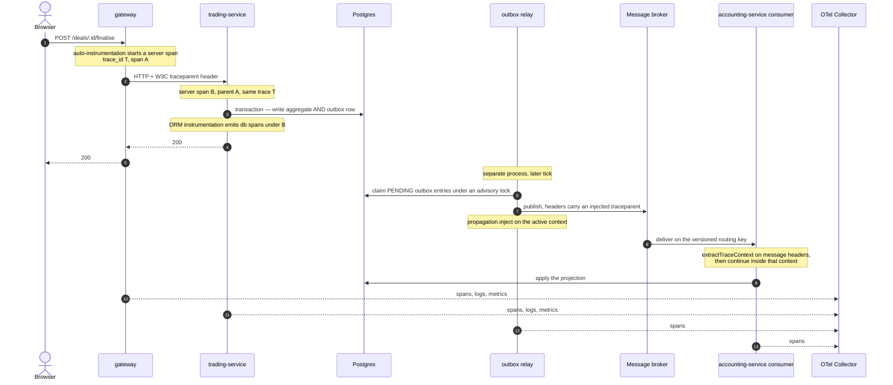
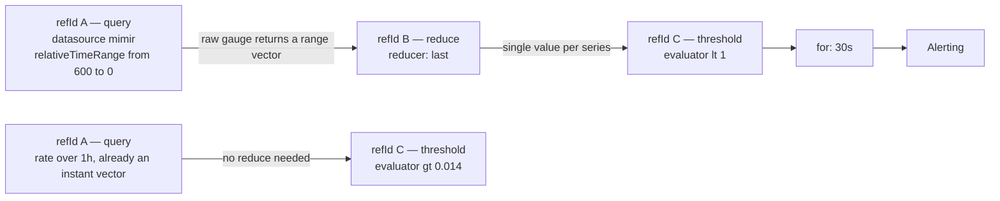
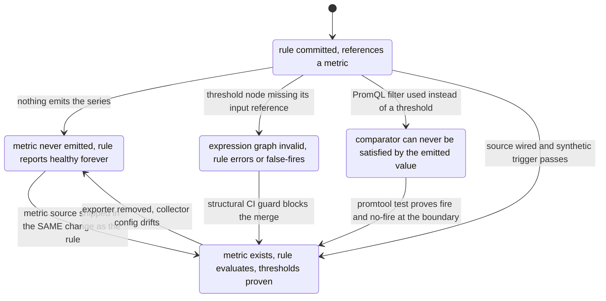

# Observability — Three Signals, One Store, and Detectors That Actually Fire

What this covers: how traces, logs and metrics leave an Acme Platform service, what the
OpenTelemetry collector does to them on the way, where each signal lands (Loki, Tempo,
Mimir), and how alert rules are evaluated and routed. The second half is about the failure
mode this platform has actually suffered — **detectors that look healthy because their
metric does not exist** — and the guards now in place against it. A single request is
traced end to end across the gateway, a service, the transactional outbox, the message bus
and a downstream consumer, because that hop is where naive instrumentation loses the trace.

Deciding ADRs: **ADR-0019 OpenTelemetry + Grafana Observability Stack**, **ADR-0048
Platform Observability Layer-2 Completion and DLQ Deployment-Integrity**, **ADR-0050
Prometheus Operator alongside Mimir, scrape-and-forward, plus RED metric naming**,
**ADR-0034 Argo Rollouts with SLO-Driven AnalysisTemplate**, **ADR-0018 Transactional
Outbox for Domain Events**, **ADR-0049 RabbitMQ Cluster Operator Adoption** (the broker
Prometheus plugin that gives the broker ServiceMonitor a target).

---

## 1. Topology — two ingestion paths, one store



**Takeaways**

1. **Two ingestion paths, deliberately non-overlapping.** Applications _push_ OTLP to the
   collector; infrastructure is _pulled_ by a Prometheus agent through `ServiceMonitor` and
   `PodMonitor` CRs. ADR-0050 chose this over a single path because the OTel collector has
   no good story for scraping dozens of cluster components, and the Prometheus Operator has
   no good story for OTLP push. If the collector is ever pointed at `/metrics` endpoints
   too, the operator's node exporter must be disabled or the same series arrives twice.
2. **Mimir is the only metric store.** Its ruler evaluates rules and its alertmanager
   routes them; the bundled alertmanager and Grafana in the Prometheus Operator chart are
   disabled. One store, one alerting path.
3. **Everything is an Application in the GitOps tree.** The imperative bootstrap script
   that used to install the stack was deleted, because under it the running collector had
   drifted to a config with no kubelet-stats receiver and no spanmetrics connector — the
   direct cause of roughly 47 dead alert rules.
4. **Provider neutrality is a hard requirement here.** Every component is CNCF; the stack
   ports to any conformant cluster unchanged, which is what makes the exit path in
   [`05-secrets-and-identity.md`](./05-secrets-and-identity.md) §9 credible.
5. **Invariant:** the canary analysis loop closes _inside_ the cluster — pod metrics reach
   Mimir, the Rollouts controller queries Mimir, and the controller decides. No CI job is in
   that loop.

---

## 2. Inside the collector

```
receivers
  otlp                4317 gRPC / 4318 HTTP, hostPort on every node
  kubeletstats        30s, endpoint ${env:NODE_IP}:10250, groups node|pod|container
                      NODE_IP comes from the downward API — the chart supplies
                      OTEL_K8S_NODE_IP instead, so without the extra env the
                      endpoint resolves to ":10250" and the receiver emits nothing
processors
  memory_limiter      limit 200 MiB, spike 50 MiB, check 5s
  k8sattributes       pod name/uid, namespace, node, deployment;
                      labels → app.kubernetes.io/name,
                               acme-example.co.uk/bounded-context,
                               rollouts-pod-template-hash
  tail_sampling       decision_wait 10s, 50k traces
                        keep-errors       status_code = ERROR      → 100%
                        keep-slow         latency > 1000ms         → 100%
                        sample-the-rest   probabilistic            → 10%
  batch               1024 / max 2048 / 5s
connectors
  spanmetrics         explicit buckets 5ms … 10s, exemplars on, flush 15s
                      dimensions: http.method, http.status_code
                      service.name is an IMPLICIT default — declaring it
                      explicitly fails config validation as a duplicate
exporters
  otlphttp/loki       loki:3100/otlp
  otlp/tempo          tempo:4317
  prometheusremotewrite/mimir
                      mimir-gateway/api/v1/push
                      resource_to_telemetry_conversion: enabled  ← load-bearing
pipelines
  traces   otlp → memory_limiter, k8sattributes, tail_sampling, batch → tempo, spanmetrics
  metrics  otlp + spanmetrics + kubeletstats → memory_limiter, k8sattributes, batch → mimir
  logs     otlp → memory_limiter, k8sattributes, batch → loki
```

**Takeaways**

1. **`tail_sampling` must precede `batch`.** A sampling decision needs the whole trace;
   batching first shuffles span order and can split a trace across batches. The pipeline
   order in the values file is a correctness constraint, not a style choice.
2. **Tail sampling replaced head sampling for a specific reason.** A head-based
   probabilistic sampler dropped 90% of _error_ traces before they reached Tempo — which
   defeats the point of tracing errors. The current policy keeps 100% of error and slow
   traces and samples the remainder.
3. **`resource_to_telemetry_conversion: enabled` is the difference between usable and
   useless metrics.** Without it the remote-write exporter parks resource attributes in a
   separate `target_info` series and writes the kubelet-stats metrics label-less — every
   per-pod and per-node series collapses into one. It was verified post-cutover that
   `count(k8s_pod_memory_working_set_bytes)` returned **1** across four nodes and dozens of
   pods. Every detector that groups by pod, namespace or node was unusable until this flag
   was set.
4. **The collector's RBAC is part of the data model.** `nodes/stats` is a distinct
   subresource from `nodes` — without it the kubelet-stats receiver 403s silently. And
   `replicasets` in the `apps` group is required for the attributes processor to walk
   pod → replicaset → deployment; without it the deployment label is never set and the
   conversion above has nothing to promote.
5. The collector runs with a dedicated priority class so it can preempt a priority-0
   application pod on a request-packed node — losing per-node telemetry exactly when a node
   is saturated is the worst possible time to lose it.

---

## 3. One request, five hops, one trace



**Takeaways**

1. **HTTP hops are free; the bus hop is not.** Auto-instrumentation propagates
   `traceparent` over HTTP without any application code. Across the broker it is explicit:
   the relay calls `propagation.inject` on the active context into an ordinary header map,
   and the consumer side calls the matching extract helper and runs the handler inside the
   returned context.
2. **Both helpers degrade to a no-op rather than throwing.** They resolve the OTel API
   through a guarded dynamic require; if it is unavailable the injector returns an empty
   header map and the extractor returns undefined. Telemetry never takes down the money
   pipeline. The cost is that a mis-packaged build loses trace continuity _silently_ — see
   §6.
3. **Header hygiene matters.** Broker headers can be buffers or numbers; the extractor
   filters the carrier to string values only before handing it to the propagator.
4. **The trace is not one continuous timeline.** The outbox deliberately breaks
   request-time and publish-time apart (ADR-0018), so the relay's spans attach to the
   originating trace but arrive later. Reading such a trace requires knowing that the gap
   between the service span and the relay span _is the outbox lag_ — which is why that lag
   is also a first-class metric (§4).
5. **Correlation across signals** is carried by the logger: a pino mixin reads the active
   span and stamps `trace_id` and `span_id` onto every line, so a Loki query pivots to the
   exact Tempo trace. Sensitive fields are masked at the logging layer.
6. **Unverified:** I found the extract helper defined and documented on the relay, but no
   call site for it elsewhere in the repository. Treat consumer-side continuation as
   available-but-not-obviously-adopted; the producer-side injection is definitely wired.

---

## 4. The metric vocabulary

| Family                  | Emitted by                                    | Canonical names                                                                                                                                                               | Consumed by                                  |
| ----------------------- | --------------------------------------------- | ----------------------------------------------------------------------------------------------------------------------------------------------------------------------------- | -------------------------------------------- |
| RED                     | spanmetrics connector, from spans             | `calls_total`, `duration_milliseconds_bucket`                                                                                                                                 | dashboards, burn-rate rules, canary analysis |
| Node and pod            | kubelet-stats receiver                        | `k8s_pod_memory_working_set`, `k8s_container_restarts_total`                                                                                                                  | capacity and restart detectors               |
| Synthetic reachability  | blackbox scraper via OTel prometheus receiver | `probe_success{probe_class,instance}`                                                                                                                                         | service-down and dependency-down rules       |
| Credential lifecycle    | expiry-checker CronJob → Pushgateway          | `time_to_expiry_days`, `kv_secret_no_expiry_total`                                                                                                                            | imminent-expiry warning                      |
| Domain — money pipeline | application code                              | `acme_trading_outbox_lag_seconds`, `…_parked_messages_total`, `…_consumer_redeliveries_total`, `…_deal_locks_total`, `…_stock_rejections_total`, `…_invoice_writebacks_total` | money-pipeline dashboard and alerts          |
| Broker                  | broker Prometheus plugin                      | `rabbitmq_queue_messages`                                                                                                                                                     | queue-depth and DLQ rules                    |

**Takeaways**

1. **There was a naming schism and it was resolved by decree.** Dashboards and alerts
   queried the spanmetrics names while the canary AnalysisTemplate queried the OTel
   semantic-convention names — meaning one of the two sets was _always empty_. ADR-0050
   makes the spanmetrics names canonical and amends the AnalysisTemplate, at zero dashboard
   migration cost.
2. **`service_name` is the join key and it is easy to get wrong.** The Helm fullname is
   release-prefixed, so a bundled service renders as `platform-identity-auth-service`,
   which does not match the rules' `platform-<svc>-service` pattern. Each service therefore
   pins `otel.serviceName` explicitly in its values file.
3. **The domain metrics carry `tenantId` and `dealId` as span attributes too**, so an
   alert on a parked message pivots straight to the offending tenant and deal in Tempo
   rather than to a service-level aggregate.
4. **Every domain metric maps to an operator action**, not just a number: outbox lag →
   check the relay pod holds its advisory lock and the broker is reachable; parked messages
   → query the quarantine table, where `INVALID_STATE` means the source entity was not
   finalised and `UNRESOLVABLE_ENTITY` means a missing or cross-tenant reference;
   write-backs dropping to zero while invoicing continues → the consumer stalled.
5. **Invariant:** any dead-letter queue depth above zero is critical, not a warning. A
   message reached a dead-letter exchange, and in a money pipeline that means state is
   diverging.

---

## 5. Alert-rule anatomy and routing

Grafana-managed rules are a small expression graph, not a single PromQL string. The shape
is the bug surface.



```
routing
  contactPoints:  platform-oncall  →  email only
                  Slack and PagerDuty receivers were REMOVED — unconfigured in dev,
                  and the broken Slack contact point failed Grafana's ATOMIC
                  alerting-provisioning reload with HTTP 500, freezing every rule
  policies:       group_by [alertname, service_name]
  provisioning:   files rendered into a ConfigMap by a Helm chart, reconciled by a
                  GitOps Application; the Grafana sidecar hot-loads ConfigMaps
                  labelled grafana_alert=1 in the monitoring namespace
                  → alert edits land by pull request, never by kubectl
```

Multi-window, multi-burn-rate SLO rules, one set per bundle plus the gateway and the AI
service — 4 rules × 7 surfaces = 28 of the 52 rules in the file:

| Window | Burn rate | Threshold at a 99.9% SLO | Severity | Role         |
| ------ | --------- | ------------------------ | -------- | ------------ |
| 1h     | 14x       | 0.014                    | critical | fast page    |
| 1h     | 6x        | 0.006                    | critical | slow page    |
| 5m     | 14x       | 0.014                    | warning  | fast confirm |
| 5m     | 6x        | 0.006                    | warning  | slow confirm |

**Takeaways**

1. **A raw-gauge query over a window must pass through a `reduce` node.** A threshold node
   cannot consume a multi-point range vector — Grafana's expression engine rejects it with
   "only reduced data or number literals are supported". Queries already wrapped in
   `rate()`, `increase()` or `histogram_quantile()` return an instant vector and need no
   reduce.
2. **Write the comparison as a threshold, not as a PromQL filter.** `probe_success == 0`
   emits the _value_ 0 for a down probe, so a `gt 0` threshold on it never fires. The
   correct rule reads the raw gauge and thresholds `lt 1`: 0 fires, 1 stays silent. This
   inversion is the single most common way these rules rot.
3. **`execErrState` defaults to `Alerting`.** A rule that fails to parse does not go
   quiet — it _fires_. Every rule must pin `execErrState: Error` and `noDataState: OK`, or a
   broken rule pages the on-call and an absent metric does too.
4. **Alerting provisioning is atomic.** One malformed contact point returned HTTP 500 on
   reload and froze _every_ rule in the org. The dev configuration was reduced to a single
   email receiver for exactly this reason. Adding a channel means adding real credentials,
   not a placeholder.
5. The paging hierarchy is deliberate: burn-rate rules page, per-service RED rules warn at
   1% 5xx over 5m, and the aggregate error-rate rule is `info` with a 15m window — it exists
   as a _label-gap canary_, not as a page.

---

## 6. Silent-failure detection — the three ways a detector dies

This platform has hit all three. Each now has a named guard.



**How each class was found and what stops it now**

| Class               | How it manifested                                                                                                                                                                                                            | Guard                                                                                                                                                                                                                                                                                                     |
| ------------------- | ---------------------------------------------------------------------------------------------------------------------------------------------------------------------------------------------------------------------------- | --------------------------------------------------------------------------------------------------------------------------------------------------------------------------------------------------------------------------------------------------------------------------------------------------------- |
| No source           | The store held **25 metric names**, all probe and scrape metadata. Roughly 40–46 of ~50 rules referenced series that were never emitted. They reported `health=ok` **because** the metric was absent — no-data cannot error. | ADR-0050 wires the sources; ADR-0048 D5 requires each metric source to ship in the **same pull request** as its rules' fixes, so a metric is never wired while a latent bad rule sits behind it.                                                                                                          |
| Malformed graph     | Every one of 50 rules silently false-fired for weeks: the threshold nodes carried no `expression:` reference, the parser failed the rule, and the default `execErrState: Alerting` turned each parse failure into a page.    | `scripts/ci/check-grafana-alert-rules.mjs` — a dependency-free indentation scan asserting every rule has `execErrState` **and** `noDataState`, and every `threshold`/`reduce`/`math` node has an `expression:` sibling. Fails if zero rules are discovered, so a broken parse cannot pass as "all clear". |
| Inverted comparator | `up{job=~"platform-.*"}` matched only the scraper's self-scrape, a constant 1 — the rule could never fire on a real outage. It was deleted rather than fixed, and replaced by blackbox `probe_success` rules.                | Synthetic-trigger proof: `promtool test rules` over committed input series, plus a no-dependency harness that parses each rule's committed `expr`, feeds a value just above the threshold (must fire) and one exactly at it (must stay silent — proving the comparator is strict).                        |

**Takeaways**

1. **"Alert is green" and "alert is blind" are the same observation** unless you have
   proved the detector can fire. Both proof mechanisms above test the _committed_ rule text,
   so a threshold edit that breaks the semantics fails CI.
2. **The structural guard deliberately does not check semantics.** It runs in under a
   second with no `node_modules`, mirroring the other repo-root guards. Semantics are the
   promtool suite's job. Two cheap guards beat one expensive one that nobody runs.
3. **One dispute is recorded as unresolved rather than guessed.** Whether windowed `rate()`
   and `histogram_quantile()` rules _also_ need a reduce node was left open pending an
   empirical check, because adding `reduce(last)` to a rate rule silently changes its
   meaning. The CI guard takes the conservative side and flags only the raw-gauge pattern.
   That is the correct handling of an unknown in a detector.
4. **A rule directory that is not referenced by any Application deploys nothing.** The root
   Application uses explicit list generators with no directory glob, so several committed
   rule files under `charts/observability/` are _candidates_ — real YAML, applyable by hand,
   inert until a task wires them in. Their headers say so explicitly. Committing an alert is
   not deploying an alert.
5. **The canary AnalysisTemplate stays disabled until its label is confirmed present**, so
   it can never silently return Inconclusive and wave a bad canary through. Disabled and
   honest beats enabled and blind.

---

## 7. Dashboards

```
charts/infrastructure/grafana-dashboards/
├── health-overview.json          single pane, all services
├── red-metrics.json              aggregate Rate / Error / Duration
├── k8s-cluster.json              pod CPU, memory, restarts
├── loki-logs.json  tempo-traces.json  rabbitmq.json
├── gateway.json                  per-service: latency, error rate, memory, request count
├── auth-service.json  tenant-service.json  user-service.json
├── trading-service.json  inventory-service.json
├── accounting-service.json  commission-service.json
├── notification-service.json  document-service.json
├── audit-service.json  reporting-service.json  ai-service.json
└── *-bundle-red.json             one RED view per bundle: identity, trading,
                                  finance, comms, ops  (+ gateway, ai-service)

charts/observability/grafana-dashboards/
├── trading-money-pipeline.json   outbox lag, parked messages, DLQ depth,
│                                 deal locks, stock rejections, write-backs
├── ci-baseline.json
└── ci-arc-operator.json  ci-arc-developer.json
```

**Takeaways**

1. Dashboards are provisioned as code — JSON models in the repository, rendered into
   ConfigMaps and hot-loaded by the Grafana sidecar. There is no "edit in the UI and hope"
   path that survives a reconcile.
2. The per-bundle RED dashboards mirror the burn-rate rule surfaces exactly, so a firing
   `platform-<bundle>-burn-*` alert has an obvious landing page.
3. The money-pipeline dashboard lives in a different directory from the rest because it
   ships with the domain metrics it visualises rather than with the platform stack.

---

## 8. Escalation and runbook coupling

Every alert carries a `runbook` annotation pointing at the section of the monitoring
runbook that owns it, so the alert body is the entry point, not a starting guess. The
escalation ladder is L1 on-call (resolve within 15 minutes using the runbook) → L2
engineering lead (multiple services, or L1 stuck) → L3 platform (cluster, database or
broker) → management (production down beyond 30 minutes, or financial data at risk).

Two operational reference points that recur in investigations:

- **Connection-pool ceiling.** At maximum horizontal scale across all services the platform
  opens **205** database connections (pool max 5 per pod), so the managed server's
  `max_connections` must be ≥ 250. A latency alert that correlates with a scale-up is very
  often this.
- **Service-specific shapes.** The AI service scales on queue depth rather than CPU and has
  a dedicated dead-letter queue per consumer queue; the gateway holds a minimum of two
  replicas and has no database; the reporting service is memory-heavy and spikes during
  report generation. None of these are anomalies when they appear on a dashboard.

---

## 9. Honest gaps

- **The application-to-collector endpoint is not obviously correct.** The dev overlay sets
  `otel.exporterEndpoint` to a short service name in the monitoring namespace, while the
  collector Application deploys the upstream chart under a release whose DaemonSet is named
  `otel-collector-opentelemetry-collector-agent` — implying a service name that does not
  match. ADR-0048 D4 explicitly requires a ClusterIP service and its fully-qualified name,
  because the egress NetworkPolicy allows only a namespace selector on the monitoring
  namespace, so a node-IP host-port target is dropped. I could not verify from the
  repository that a service answering the configured short name exists. This is the single
  highest-value thing to check against a live cluster.
- **Prometheus Operator deployment is capacity-gated.** The Application exists in the tree
  but its rollout was gated on a node-pool capacity change, so the infra-metrics half of §1
  may not be live.
- **Producer-side dead-letter exchanges may have no bound queue.** ADR-0048 records that the
  consumer-side fix bound dead-letter queues to consumer exchanges, but the relay's own
  per-context dead-letter exchange is declared with nothing bound — a version-mismatch event
  published there is not retained, and the warning log is the only forensic record.
- **Mimir storage.** ADR-0050 requires migrating off filesystem storage to object storage
  because a persistent volume carries a zone-affinity hazard on node replacement; the values
  block for that was still marked draft.
- I did not verify live cardinality, retention settings, or the sampling rate's effect on
  Tempo storage; those are cluster observations, not repository facts.

---

Related: [`01-gitops-topology.md`](./01-gitops-topology.md) for how the observability
Applications are reconciled, [`02-progressive-delivery.md`](./02-progressive-delivery.md)
for the canary analysis that consumes the RED metrics named in §4, and
[`05-secrets-and-identity.md`](./05-secrets-and-identity.md) §8 for the credential-chain
detectors that run on this substrate.
