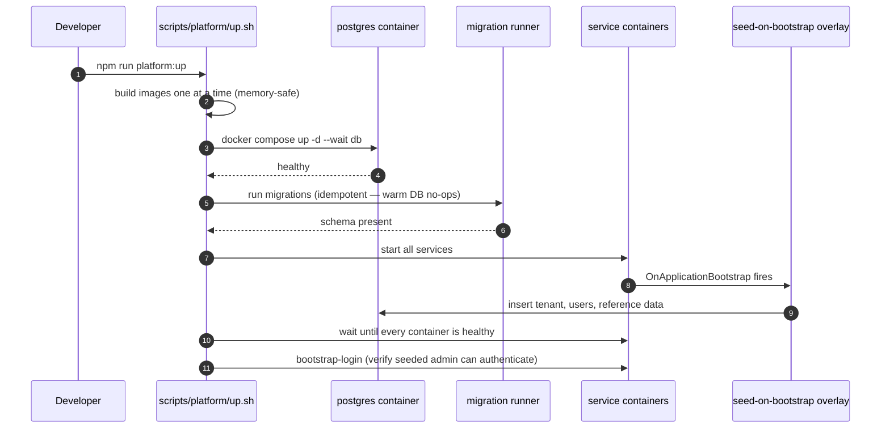
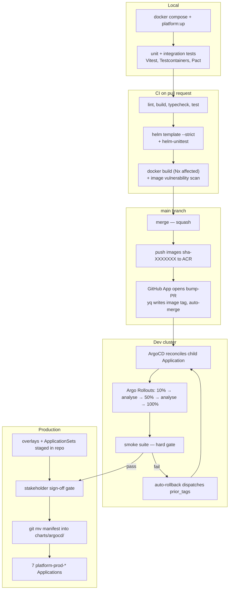
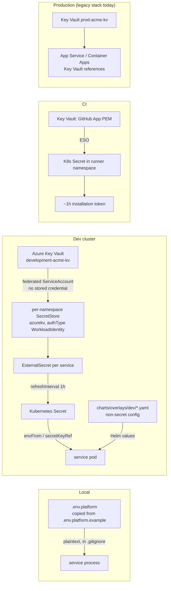
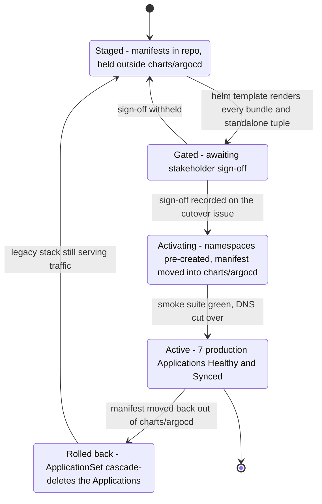

# Environments — local, dev, production

What this covers: the three places Acme Platform code runs — a developer's laptop under Docker
Compose, the shared `dev` AKS cluster, and production — plus how a change moves between them,
what is deliberately different in each, and where configuration and secrets come from. The
honest headline is that the third environment is **staged but not activated**: production still
runs the legacy stack, and the Platform production topology exists as reviewed, renderable
manifests held one directory outside the GitOps reconcile path. That is stated up front because
every promotion decision below depends on it.

---

## 1. The three environments at a glance

| Dimension          | Local                                   | Dev (`development-platform`)                         | Production (staged)                           |
| ------------------ | --------------------------------------- | ---------------------------------------------------- | --------------------------------------------- |
| Substrate          | Docker Compose on the developer machine | AKS, 3 node pools                                    | AKS, not yet provisioned                      |
| Orchestration      | `docker compose` + `scripts/platform/*` | ArgoCD AppOfApps, 7 Applications                     | 2 further ApplicationSets, 7 `*-prod-*` apps  |
| Deploy strategy    | recreate container                      | Argo Rollouts canary 10 → 50 → 100 with SLO analysis | same, production overlay sizing               |
| Replicas / service | 1                                       | 1 (`replicaCount: 1`, autoscaling **off**)           | HPA min 2, max 10, target 70% CPU             |
| Requests / limits  | host-bounded                            | 50m / 128Mi → 500m / 512Mi                           | 200m / 256Mi → 1000m / 1Gi                    |
| Quotas             | none                                    | per-namespace ResourceQuota + LimitRange             | 16 CPU / 32Gi req, 32 CPU / 64Gi lim, 60 pods |
| `NODE_ENV`         | `development`                           | `development` (explicitly overridden)                | `production` (chart default, fail-closed)     |
| Database           | `postgres:16` container, port 5433      | PostgreSQL Flexible Server 16, B_Standard_B2ms       | sized at cutover                              |
| Cache              | `redis:7-alpine`, port 6380             | Azure Cache for Redis 6.0, Basic C1 (no replication)   | Standard SKU with replication                 |
| Broker             | `rabbitmq:3-management-alpine`, 5673    | in-cluster RabbitMQ, 1 replica, 20Gi PVC              | cluster operator (ADR-0049)                   |
| Secrets            | plaintext `.env.platform`               | Key Vault → External Secrets Operator → K8s Secret   | same mechanism, prod vault                    |
| JWT signing        | RS256, ephemeral keypair at startup     | RS256, ephemeral keypair at startup                  | RS256 keypair from Key Vault + JWKS (ADR-0053) |
| Observability      | container logs                          | OTel → Collector → Loki / Tempo / Mimir → Grafana    | same                                          |

The interesting rows are the ones where dev is **weaker on purpose**, because each has a
documented reason rather than being an oversight:

- **Autoscaling is disabled in dev.** The HPA there is metric-blind (no per-pod CPU metrics), so
  a live HPA pins replicas at its minimum and never scales down; disabling it lets
  `replicaCount` drive the Rollout's `spec.replicas` deterministically. Canary and auto-rollback
  are independent of the HPA, so ADR-0034's guarantees survive.
- **Redis has no replication in dev.** Basic C1 means a restart loses the JWT JTI blocklist, so
  revoked tokens stay valid until their natural 15-minute expiry. This is an accepted dev
  trade-off and an explicit production requirement.
- **PodDisruptionBudgets exist only where `minReplicas ≥ 2`.** A PDB over a single-replica
  service blocks node drains forever, which on a 4-node dev pool is a self-inflicted outage.

---

## 2. Local environment

Infrastructure only:

```bash
cp .env.platform.example .env.platform
docker compose --env-file .env.platform -f docker-compose.platform.yml up -d
```

| Service                                    | Host port | Container port | Why offset                      |
| ------------------------------------------ | --------- | -------------- | ------------------------------- |
| PostgreSQL 16                              | **5433**  | 5432           | legacy stack owns 5432          |
| Redis 7                                    | **6380**  | 6379           | legacy stack owns 6379          |
| RabbitMQ (AMQP)                            | **5673**  | 5672           | —                               |
| RabbitMQ (mgmt)                            | **15673** | 15672          | —                               |
| Pact broker                                | **9292**  | 9292           | contract-test broker            |
| gateway                                    | 3000      | —              | legacy-api owns 3001 by default |
| auth / tenant / user / trading / inventory | 3001–3006 | —              | `PORT` env var per service      |

Every Platform-side port is offset from the legacy stack so **both stacks run simultaneously**.
That is a hard requirement while the strangler migration is in flight — you cannot verify a
parity fix if starting the new stack kills the old one.

On first start, two fixtures run automatically:

- `scripts/platform/init-db.sql` creates the 11 bounded-context schemas (`auth`, `identity`, `platform`,
  `trading`, `finance`, `inventory`, `logistics`, `commission`, `communication`, `compliance`,
  `analytics`) plus a separate `pact_broker` database — mirroring ADR-0013's per-BC schema
  isolation locally.
- `scripts/platform/rabbitmq-definitions.json` declares **13 exchanges and 2 queues**: `platform.events` (topic), `platform.dlx` (fanout), the nine per-context topic exchanges (`acme.trading`, `.identity`, `.platform`, `.inventory`, `.ai`, `.reporting`, `.accounting`, `.communication`, `.commission`), plus `acme.trading.dlx` and the `acme.audit-feed` fanout; queues `platform.dead-letters` and `acme.trading.dead-letters`. The local broker mirrors the cluster topology rather than simplifying it.

### 2.1 Full stack bring-up ordering

`npm run platform:up` starts the application services too, and the ordering is load-bearing:



**The invariant this encodes:** migrations must run _before_ any seed-capable service starts. The
seed overlay seeds during `OnApplicationBootstrap`, so on a fresh database, starting services
first makes every seed hit a missing relation; the services report unhealthy and `up` aborts
_before_ it would have run migrations — a dead stack that only a manual migrate-plus-restart
recovers. Running migrations first also mirrors production, where a migrations init container
runs ahead of the app container (`charts/platform-base/templates/deployment.yaml`). Two toggles
modulate this: `PLATFORM_FULL=1` adds the extra services, `PLATFORM_SEED=1` (default) includes
the seed overlay.

---

## 3. Promotion path



Takeaways:

1. **CI never deploys.** The deploy stage's only cluster-facing act is writing an image tag to
   `main` through a bump-PR. ArgoCD is the sole applier, so the cluster's state always has a git
   commit behind it (ADR-0032 — single-branch GitOps with AppOfApps).
2. **The writeback identity is a GitHub App, not `GITHUB_TOKEN`.** The enterprise policy blocks
   `GITHUB_TOKEN` from pushing to or approving on protected branches. The App's private key
   lives in Key Vault, is synced into the cluster by ESO, and is exchanged for a ~1-hour
   installation token per run — nothing long-lived sits in CI (ADR-0035).
   The App's permissions are **repo-wide, not path-scoped** — GitHub Apps cannot be restricted to
   path patterns. The practical containment is that the bump-PR must still pass `main`'s required
   checks; a compromised App key remains a repo-wide `contents: write` exposure.
3. **Rollback happens in-cluster first.** The canary's `AnalysisTemplate` queries Mimir for error
   rate, p95 latency and a traffic floor; a burn aborts the rollout without any GitHub Actions
   involvement (ADR-0034). The smoke suite is a second, outer gate that dispatches a rollback
   workflow with the captured previous tags.
4. **`force-deploy` exists and is break-glass.** It bypasses the smoke gate and is documented as
   requiring an incident ticket. Escape hatches are better declared than discovered.

### 3.1 The promotion trap: which file carries the image tag

```
charts/
├── platform-base/                    # the single service chart (templates)
├── bundles/
│   ├── identity-bundle/values.yaml   # <-- authoritative tag for BUNDLED services
│   ├── trading-bundle/values.yaml
│   ├── finance-bundle/values.yaml
│   ├── comms-bundle/values.yaml
│   └── ops-bundle/values.yaml
├── values/
│   ├── gateway.yaml                  # <-- authoritative tag for STANDALONE services
│   ├── ai-service.yaml
│   └── <other-service>.yaml          # service inventory only — NOT read by ArgoCD
└── overlays/
    ├── dev/{common,identity,trading,finance,comms,ops,gateway,ai}.yaml
    └── production/{common, <bc>/common.yaml}
```

Bundled services render through an umbrella chart that aliases `platform-base` once per
constituent service, and ArgoCD renders each bundle with the **overlay** value files only. A
per-service `charts/values/<service>.yaml` for a bundled service is therefore _never read by
ArgoCD_. A deploy workflow that writes the tag there produces a perfect illusion: image built,
image pushed, tag bumped, Application reports `Synced` — and the pods keep running the old
image. That failure ran silently for roughly ten days before it was caught.

The fix is worth copying: the deploy step resolves each service to the file ArgoCD actually
reads, and a **guard hard-fails the deploy if the target file or the existing tag key is
missing**, so a wrong service→bundle mapping can never quietly create a stray key. Post-deploy
verification was also corrected to poll the real bundle Application and assert the live image
across the Rollout, rather than a `kubectl rollout status deployment/...` on an object that does
not exist under Argo Rollouts.

**Invariant for any promotion mechanism:** the thing you write must be the thing the reconciler
reads, and a mismatch must fail loudly. "Synced" is not evidence of a deploy.

---

## 4. Configuration and secret sources



Takeaways:

1. **The same secret name resolves differently per environment, and only the source changes.**
   A service reads `DATABASE_URL` from its environment everywhere; locally that comes from a
   file, in the cluster from a Kubernetes Secret projected by ESO. No code branches on
   environment to find its secrets.
2. **Local secrets are deliberately weak and deliberately visible.** `.env.platform.example` ships
   obviously-fake values with `change-in-production` baked into the string. Values like the MFA
   recovery-code HMAC key and the AES-256-GCM tenant-credential key are _required with no
   default_ — a service that cannot find one fails to start rather than silently degrading to an
   insecure mode.
3. **Local and CI mint an ephemeral RS256 keypair per process; production loads persistent PEMs** (ADR-0053). There is no HMAC signing path in auth-service at all. The env file carries the
   asymmetric variables commented out, so the shape of the production configuration is visible
   from the local one.
4. **Secret zero is itself reconciled.** The SOPS age key used by ArgoCD's helm-secrets plugin is
   seeded into Key Vault by an operator and pulled into the cluster by an ExternalSecret, rather
   than being hand-created with `kubectl create secret`. The manual command survives only as the
   disaster-recovery fallback (ADR-0020 — External Secrets Operator + SOPS).
5. **Rotation cadence differs by surface.** The CI installation token expires in ~1 hour, so
   there is nothing to rotate there; the App's PEM and the broker admin credential are rotated
   by an operator and re-propagated within one ESO refresh interval, with a Grafana alert firing
   14 days before any Key Vault secret expires.

---

## 5. Production: staged, not active



What is actually staged, and why it is staged the way it is:

- `charts/overlays/production/` holds per-bundle production sizing (the resource, HPA, quota and
  limit-range values in §1's table).
- The two production ApplicationSets live in `docs/platform/operations/staged/`, **deliberately
  outside** `charts/argocd/`. The root Application walks that directory recursively, so a file's
  mere presence there activates it. Holding the manifest elsewhere means neither an ArgoCD
  reconcile nor an accidental `kubectl apply -f charts/argocd/` can spawn production
  Applications. Activation is `git mv` in; rollback is `git mv` out. No flag, no annotation, no
  `enabled: false` that someone flips by accident.
- That hardening was added _after_ an incident: applying the staged production manifest to the
  dev cluster deleted six of the seven workload namespaces, and deletion then wedged on message
  broker topology finalizers. The same incident is why namespaces are now declared in git with
  `Prune=false`.

Takeaways:

1. **"Staged" must be a structural property, not a config value.** Reachability by the
   reconciler is the switch; that cannot be toggled by a typo in a values file.
2. **Namespaces are pre-created with the labels NetworkPolicies expect.** The bundle
   ApplicationSets set `CreateNamespace=false` on purpose — an Application cannot own the
   Namespace it deploys into without circular ownership.
3. **The pre-flight gate is a render, not a deploy.** `helm template` must render cleanly for
   every `(bundle, production)` and `(standalone, production)` tuple before anything moves.
4. **Database migrations are the asymmetric part of any rollback.** Reverting an image tag is
   seconds; a migration that dropped a column is not reversible by ArgoCD. Rollback procedures
   treat the schema as a separate, forward-only concern.

Meanwhile production traffic runs on the **legacy stack** in `infra/environments/prod-acme-legacy/`:
legacy-api on App Service, legacy-web, domain-api on Container Apps, PostgreSQL, Front Door,
Application Insights, and a Key Vault holding the app settings. Its deploy path is the legacy
`Deploy` workflow with a manual approval gate, not the GitOps loop described above.

---

## 6. Ephemeral per-developer environments

`infra/environments/dev-ephemeral/` provisions a throwaway copy of the **legacy** stack per
developer, keyed by alias into its own state file (`dev-{alias}.terraform.tfstate`): App Service
B1, PostgreSQL `B_Standard_B1ms`, Free-tier static web hosting — roughly $30/month while running
and $0 when destroyed. It exists for legacy-stack parity work; the Platform stack's equivalent is
the local Compose stack, because a per-developer AKS cluster is not affordable under the
subscription's quota, let alone its budget.

---

## 7. Deciding ADRs

| ADR      | Title                                                         | Relevance to environments                   |
| -------- | ------------------------------------------------------------- | ------------------------------------------- |
| ADR-0013 | Per-BC PostgreSQL schema isolation                            | local `init-db.sql` mirrors cluster schemas |
| ADR-0015 | Zero-downtime deploys — rolling update + init container + PDB | migrations init container, PDB rules        |
| ADR-0016 | Vitest + Testcontainers                                       | the local test substrate                    |
| ADR-0017 | RabbitMQ unified messaging, Redis cache-only                  | why dev Redis loss is tolerable             |
| ADR-0020 | External Secrets Operator + SOPS for secrets                  | dev/prod secret source                      |
| ADR-0032 | Single-branch GitOps with AppOfApps                           | one `main` for every environment            |
| ADR-0033 | BC-aligned bundle deploy units                                | why the tag lives in a bundle values file   |
| ADR-0034 | Argo Rollouts canary with SLO analysis                        | promotion gate inside the cluster           |
| ADR-0035 | Workload Identity end-to-end                                  | no static credentials in any environment    |
| ADR-0049 | RabbitMQ Cluster Operator adoption                            | production broker topology                  |
| ADR-0050 | Prometheus Operator alongside Mimir                           | metrics availability that gates the canary  |
| ADR-0053 | Platform identity JWT RS256 + JWKS                            | ephemeral keypair locally, persistent PEMs in production |

See [04-infrastructure.md](04-infrastructure.md) for the cluster substrate these environments
run on.
