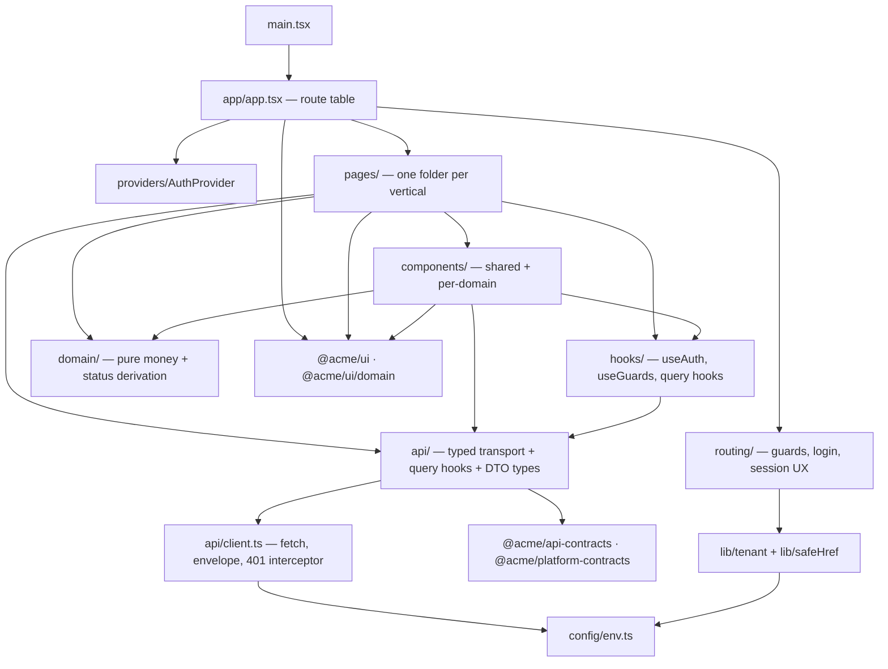
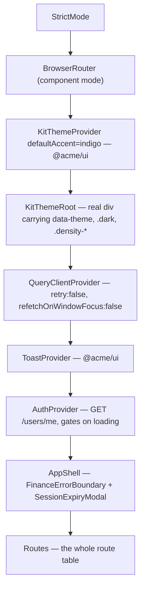
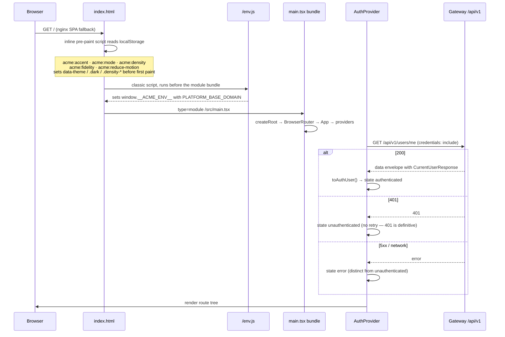
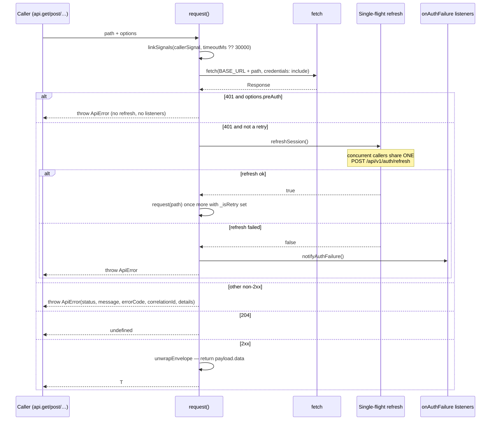
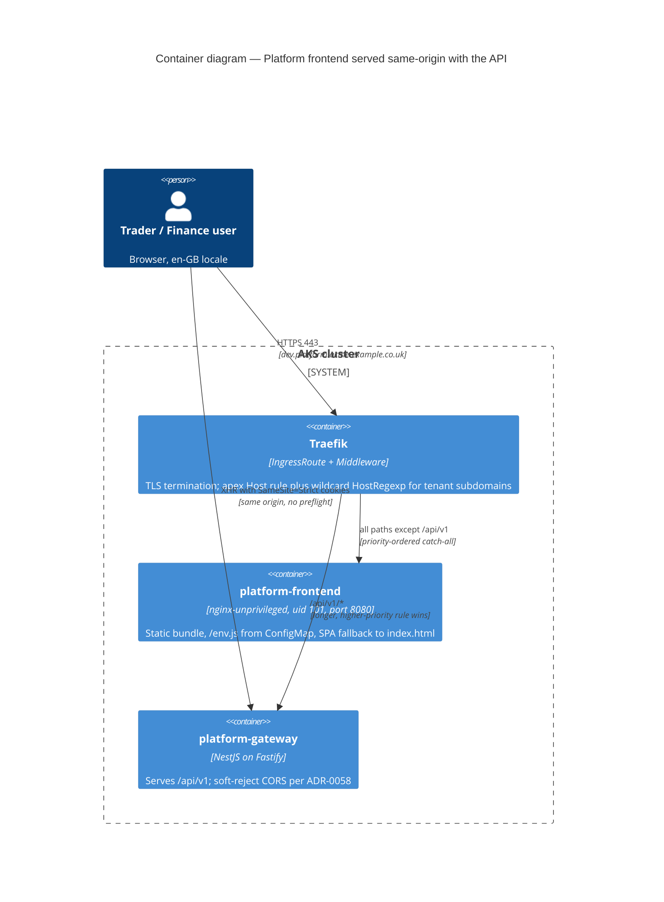

# Platform frontend — application architecture

What this covers: the internal structure of `apps/platform-frontend`, the single React SPA that
serves every Platform screen (auth, trading, accounting, commission, reference data, platform
provisioning). It documents the source layout, the provider composition at the root, the bootstrap
order, the API client's auth interceptor, and how the app is built by Vite and served same-origin
behind the gateway. Routing and the nav shell are covered separately in
[`04-routing-and-shell.md`](./04-routing-and-shell.md). Everything below was read out of the
application source; where the architecture is under-specified relative to the backend, this document
says so rather than inventing a rule.

---

## 1. Stack and the decisions behind it

| Concern         | Choice                                                | Decided by                                                                             |
| --------------- | ----------------------------------------------------- | -------------------------------------------------------------------------------------- |
| UI kit          | `@acme/ui` + `@acme/ui/domain` (Tailwind v4)          | ADR-0060 — _Frontend stack: `@acme/ui` design system + React Query state_              |
| Server state    | TanStack React Query v5 — no global client store      | ADR-0060                                                                               |
| Client state    | React `useState` / context only                       | ADR-0060                                                                               |
| Router          | `react-router-dom` 6.30, **component mode**           | as-built (`main.tsx` mounts `<BrowserRouter>`)                                         |
| Reset / theming | kit `ThemeProvider` is the sole root theme authority  | ADR-0056 — _MUI→`@acme/ui` transition, nested-provider reset/theme ownership_          |
| Nav shell       | composed in-app, no kit `AppShell`                    | ADR-0057 — _authenticated nav-shell: compose in-app, defer a kit `AppShell`_           |
| Hosting         | static nginx in-cluster, **same-origin** with the API | ADR-0058 (soft-reject CORS), superseding ADR-0052 (Static Web Apps, never implemented) |
| Build / test    | Vite 7, Vitest 4 (jsdom), Playwright for e2e          | as-built (`vite.config.mts`, `project.json`)                                           |

Pinned versions at time of writing: React 18.3.1, `react-router-dom` ^6.30.3,
`@tanstack/react-query` ^5.96.1, Vite ^7.0.0, Tailwind ^4.1.0, TypeScript ~5.9.2, `big.js` ^6.2.1.

The Nx project carries tags `["scope:platform", "type:app", "layer:presentation"]` and declares two
explicit targets — `lint` and `test:unit` — on top of Vite's inferred targets. Both exist for CI
reasons recorded in `project.json`: the inferred ESLint target has a different name and would be
skipped by `nx affected -t lint` (#1546), and the CI gate accumulator invokes `nx test:unit <svc>`
by convention.

---

## 2. Source layout

```
apps/platform-frontend/
├── index.html                 # pre-paint theme script + <script src="/env.js"> + #root
├── public/env.js              # empty runtime-config default (overridden by a ConfigMap in-cluster)
├── vite.config.mts            # dev proxy, build outDir, vitest config
├── Dockerfile                 # node build stage → nginx-unprivileged runtime stage
├── nginx.conf                 # static-only server block (no upstream, no /api handling)
└── src/
    ├── main.tsx               # createRoot → StrictMode → BrowserRouter → <App/>
    ├── app/                   # app.tsx (route table), AppShell, FinanceErrorBoundary,
    │                          #   financePermissions.ts (RBAC map + nav policy)
    ├── providers/             # AuthProvider (the only provider authored in-app)
    ├── routing/               # RequireAuth, LoginPage, Forbidden, returnTo,
    │                          #   SessionExpiryModal, DirtyFormGuard
    ├── api/          (23)     # one module per backend surface + the shared client.ts
    ├── hooks/         (6)     # useAuth, useSession, useGuards, useTenantBranding, …
    │   └── trading/           # tradingKeys, useTradingInfiniteQuery
    ├── pages/                 # one folder per vertical: auth, workspace, trading,
    │                          #   accounting, commission, reference-data, communication,
    │                          #   onboarding/, platform/ (wizards), finance/
    ├── components/            # shared/, dashboard/, trading/{,dealDetail,forms},
    │                          #   reference-data/, notifications/, search/
    ├── domain/                # deal-financials.ts — the ONLY pure-domain module
    ├── lib/                   # safeHref.ts, tenant/{host-context,resolve-tenant-slug,
    │                          #   workspace-memory,legacy-tenant-shim}
    ├── config/env.ts          # the single typed env access boundary
    ├── types/auth.ts          # AuthUser / AuthState / CurrentUserResponse + toAuthUser
    └── styles/tailwind.css    # kit preset + full Tailwind preflight (owns the reset)
```

Rough proportions: 23 API modules, 12 trading pages, 14 auth pages, 14 deal-detail components, and
two multi-step wizards (`platform/CreateTenantWizard`, `onboarding/OnboardingWizard`) that each own a
directory of step components plus a guard and a success screen.

### Module dependency directions



**Takeaways**

1. There is exactly **one transport chokepoint** (`api/client.ts`); every `api/*` module and every
   raw `fetch` in the app funnels through it or reuses its `toApiError` / `unwrapEnvelope` helpers.
2. `api/*` modules are deliberately fat — a single file holds the DTO types, the fetch wrappers,
   _and_ the React Query hooks plus its key factory. This is the app's unit of feature transport.
3. `domain/` is the only genuinely pure layer, and it holds one module. Deal GP, margin, lockability
   and stock availability are derived there and nowhere else; every other business rule lives inline
   in a page or component.
4. `config/env.ts` is the only module permitted to touch `import.meta.env`, and
   `lib/tenant/host-context.ts` is the only module permitted to read `window.location.hostname`.
   Both restrictions are stated as rules in the source headers.

**Invariant encoded:** _transport, environment access and hostname access each have exactly one
boundary module._ Everything else is a consumer.

**Where this is less formalised than the backend.** The backend enforces layering with Nx tags and
ESLint module boundaries between projects. Inside this app there is **no equivalent enforcement** —
`apps/platform-frontend/.eslintrc.json` extends the base config and adds `react-hooks` with an empty
`rules` block. Nothing stops a component importing `api/` directly, and many do. There are no ports,
no adapters, and no inversion between `pages/` and `api/`. The arrows above describe the _observed_
graph, not a checked constraint.

---

## 3. Provider composition at the root

`main.tsx` is 17 lines: `createRoot` → `StrictMode` → `BrowserRouter` → `<App/>`. All remaining
composition happens inside `app/app.tsx`.



**Takeaways**

1. `KitThemeRoot` is not decorative. It subscribes to the kit's `useTheme()` and mirrors
   `accent`/`resolvedMode`/`density` onto a **real DOM wrapper** so kit components re-skin live and
   the entire tree is a descendant of the theme root (ADR-0056 decision D1).
2. `QueryClientProvider` sits **above** `AuthProvider` because `AuthProvider` is itself a
   `useQuery` consumer — the current user is server state like any other, keyed `['auth','me']`.
3. `AuthProvider` **blocks rendering** while the initial `/users/me` probe is in flight (it returns a
   kit `BrandSpinner` instead of children). Every guard below it can therefore assume auth is
   resolved — `RequireAuth` has no loading branch at all.
4. `AppShell` wraps the route tree, not each page, so a render crash anywhere lands in one
   `FinanceErrorBoundary` and the session-expiry modal is mounted exactly once.
5. The `QueryClient` default is `retry: false`. This is intentional: a 401 must not be blindly
   retried because the client already performs one token refresh internally. Individual queries opt
   back into retry where it makes sense.

**Invariant encoded:** _no component below `AuthProvider` ever observes an unresolved auth state,
and no query below the root ever retries a 401 behind the client's back._

The MUI `ThemeProvider`/`CssBaseline` that ADR-0056 kept nested during the migration is **gone**.
The reset now comes from the kit's Tailwind preflight in `styles/tailwind.css`, and the z-index
override that existed to raise kit overlays above the MUI `AppBar` has been retired. A source-scan
test (`app/__tests__/mui-removal-kit-usage.spec.ts`) asserts that no production module imports
`@mui/*` or `@emotion/*` _and_ that at least one imports `@acme/ui`, so the removal cannot silently
regress into a deletion.

---

## 4. Bootstrap sequence



**Takeaways**

1. The FOUC guard in `index.html` duplicates the kit `ThemeProvider`'s localStorage contract in
   plain ES5 so the theme is correct on the very first paint. The two must stay in step — the keys
   are the coupling.
2. `/env.js` is the **runtime** configuration channel. In-cluster it is a Helm-templated ConfigMap
   (`charts/platform-frontend/templates/configmap-env.yaml`) mounted into the nginx web root; locally
   it is `public/env.js`, shipped empty. It is a classic (non-module) script specifically so it
   executes before the deferred app module.
3. `config/env.ts` resolves the base domain with the precedence **runtime `window.__ACME_ENV__` →
   build-time `VITE_PLATFORM_BASE_DOMAIN` → `localhost`**. No deployed environment sets the
   build-time variable; it survives only as a local escape hatch.
4. The auth probe distinguishes three failure modes. A 401 is _unauthenticated_, not an error; a 5xx
   or network failure is a genuine `{ status: 'error' }`. Conflating them would show a sign-in screen
   during a gateway outage.

**Invariant encoded:** _one built image serves every environment._ Nothing environment-specific is
baked into the bundle, which is what makes single-image GitOps promotion possible.

---

## 5. API client and the auth interceptor

`api/client.ts` is ~300 lines and is the most load-bearing single file in the app.



**Takeaways**

1. **Single-flight refresh.** A burst of 401s produces exactly one `POST /api/v1/auth/refresh`; the
   in-flight promise is shared and cleared only after it settles. The `_isRetry` flag makes the
   refresh/retry loop provably finite (depth 1).
2. **The `preAuth` escape hatch** exists because a public page (invitation accept, password reset)
   has no session to refresh. Without it, an invalid invite token would pop a _"Your session has
   expired"_ modal on a page the user was never signed in to (#1768).
3. **`beginLogout()`** latches a module-level flag that suppresses `notifyAuthFailure` for the
   remainder of the document's life. Every 401 after an intentional revoke is expected — an in-flight
   notification poll, the teardown's own requests — and must not surface the expiry modal. The flag
   is never reset in-process because logout ends in a full-page navigation.
4. **Envelope unwrapping happens in exactly one place.** `unwrapEnvelope` strips `{ data }` so
   callers receive the inner payload. The known exception is documented in `api/trading.ts`: the
   deals list envelope carries `meta` (pagination totals) alongside `data`, and `unwrapEnvelope`
   would discard it — so `listDeals` uses a thin raw `fetch` that reuses the same base URL,
   credentials and `toApiError` parsing, while the POST endpoints still go through `api.post` to
   keep the refresh interceptor. See ADR-0061 (_trading API contract: envelope, cursor, filter_).
5. **Correlation id comes from the `X-Correlation-ID` response header first**, then the body — the
   gateway's exception envelope does not carry it inline.
6. There is **no CSRF double-submit token**. CSRF protection rests entirely on `SameSite=Strict`
   session cookies, which is the constraint that forces same-origin hosting (§7).

**Invariant encoded:** _a failed refresh is a one-way transition._ `AuthProvider` responds to
`onAuthFailure` with `setQueryData(authKeys.me(), null)` and explicitly **not** `invalidateQueries` —
invalidating would refetch → 401 → refresh → fail → notify, an infinite two-request loop. The same
reasoning drives logout to use `window.location.replace('/login')` rather than `queryClient.clear()`:
clearing evicts every query while its observers are still mounted, so each immediately refetches into
a 401 storm. A hard navigation discards the entire heap, cache included.

### Query-key convention

Keys are arrays, domain-namespaced, broad → narrow, so one broad invalidation clears a whole context:

```
['auth', 'me']
['trading']                                    → tradingKeys.all
['trading', 'deals']                           → tradingKeys.resource('deals')
['trading', 'deals', 'list',   { …filters }]   → tradingKeys.list('deals', params)
['trading', 'deals', 'detail', id]             → tradingKeys.detail('deals', id)
```

`authKeys` is defined in `AuthProvider` and re-exported from `hooks/useSession` precisely so no
screen hand-rolls a different `['auth','me']` tuple — a mismatched key would leave the app stuck on
"unauthenticated" after a successful sign-in.

---

## 6. Build and dev serve

`vite.config.mts` sets `root` to the app dir, builds to `dist/apps/platform-frontend`, and registers
`react()`, `tailwindcss()`, `nxViteTsPaths()` and `nxCopyAssetsPlugin`. Vitest runs in the same
config: jsdom, globals on, `testTimeout: 30000`, `reporters: ['default']`, include glob
`src/**/*.{test,spec}.*`.

The dev proxy carries one non-obvious setting:

```
'/api': { target: 'http://localhost:3000', changeOrigin: false, xfwd: true }
```

`changeOrigin: false` is deliberate. With `changeOrigin: true` Vite rewrites `Host` to the proxy
target, so the gateway's host classifier would only ever see `localhost:3000` and never the
`{slug}.localhost` subdomain — breaking tenant sign-in locally (`freshco.localhost:5173`,
`beta.localhost:5173`). Preserving the browser's `Host` keeps local development faithful to the
deployed hostname-based tenant resolution (ADR-0066). `xfwd: true` adds `X-Forwarded-*` for parity
with the Traefik ingress.

**Verified gaps in the build.** There is **no route-level code splitting** — no `React.lazy`, no
`Suspense`, no manual chunks. All ~100 page and component modules are statically imported by
`app/app.tsx`, so the whole application ships as one bundle. There is also no bundle-size budget in
the Nx targets.

---

## 7. Serving topology: static nginx, same-origin behind the gateway



**Takeaways**

1. The frontend image is **static only**. `nginx.conf` declares no upstream and no `/api` location —
   API and auth are routed to the gateway by Traefik, not proxied by the SPA's nginx.
2. Route precedence is the whole trick. The gateway's rule is `Host(...) && PathPrefix('/api/v1')`;
   the frontend's is a bare `Host(...)` catch-all with an **explicit low `priority`**. Traefik
   already favours the longer rule, but the chart sets priority explicitly so a future change to the
   gateway rule cannot silently flip the winner.
3. A second `HostRegexp` IngressRoute mirrors the catch-all for every `{slug}.{base}` tenant
   subdomain, served by the wildcard certificate in the default TLSStore (ADR-0068). The apex route
   is left untouched as a rollback anchor.
4. Caching is split by path: `/assets/` (Vite content-hashed, immutable) gets
   `max-age=31536000, immutable` via a prefix match; everything else — including `index.html` and
   `/env.js` — falls through to the SPA fallback with `Cache-Control: no-cache`.
5. Security headers (HSTS, `nosniff`, `X-Frame-Options: DENY`, `Referrer-Policy`,
   `Permissions-Policy`) are applied by a Traefik middleware, mirroring the gateway's. **CSP is
   deliberately absent** — a mis-scoped policy would break the SPA; it is tracked as catalogue →
   report-only → enforce (#1485).
6. The runtime stage is `nginxinc/nginx-unprivileged` pinned by digest, running as uid 101 on port
   8080 so the pod satisfies a restricted Pod Security Admission profile.

**Invariant encoded:** _the SPA and the API must share an origin._ The session cookies are
`SameSite=Strict` and there is no CSRF token, so a cross-origin front end silently breaks
authentication. This is exactly why ADR-0052 (Azure Static Web Apps) was reverted before merge and
recorded as _superseded, never implemented_, and why ADR-0058 switched the gateway from hard-reject
to soft-reject CORS: on a same-origin platform the browser still sends `Origin` on non-GET requests,
so a server-side hard reject was returning 500 on every same-origin `POST /auth/login`.

---

## 8. Architecture enforcement is by fitness test, not by structure

Because the app has no internal layer enforcement, its architectural rules are asserted by
source-scanning specs under `src/app/__tests__/`:

| Spec                              | Asserts                                                                                                                                                                                                                                                                        |
| --------------------------------- | ------------------------------------------------------------------------------------------------------------------------------------------------------------------------------------------------------------------------------------------------------------------------------ |
| `mui-removal-kit-usage.spec.ts`   | no production module imports `@mui/*` or `@emotion/*`; at least one imports `@acme/ui`                                                                                                                                                                                         |
| `no-mock-data.spec.ts`            | no production module imports or references a fixture/mock — seeds live in the test tree                                                                                                                                                                                        |
| `owasp-security-gate.spec.ts`     | zero `dangerouslySetInnerHTML`; `safeHref` is the single anchor guard; localStorage is allow-listed to the theme keys; the session cookie is never read via `document.cookie`; every raw `fetch` is same-origin with `credentials:'include'`; no membership/enumeration oracle |
| `finance-rbac.spec.ts`            | the client permission map matches the documented role → action decisions                                                                                                                                                                                                       |
| `trading-routes.spec.tsx`         | the trading route table mounts the expected screens behind the expected role sets                                                                                                                                                                                              |
| `wizard-flows-a11y-gate.spec.tsx` | axe assertions over both multi-step wizards                                                                                                                                                                                                                                    |

This is a real and useful pattern — several of these were authored by an agent other than the
implementer, as a maker ≠ checker merge gate — but it is worth being clear about what it is:
**convention checked by grep**, not structure enforced by the compiler or the linter.

**Verified test-wiring gap.** The Vitest `include` glob is `src/**/*.{test,spec}.*`. The consumer
contract test at `test/pact/trading-consumer.pact.spec.ts` and the four `.feature` files under
`test/features/` are therefore **outside** the unit-test run and are not executed by
`nx test:unit platform-frontend`. Browser-level coverage lives in a separate Nx project,
`platform-frontend-e2e` (Playwright, `implicitDependencies: ["platform-frontend"]`), whose current
suite is concentrated on tenant resolution — subdomain sign-in, apex superadmin, deep link, custom
domain, suspended tenant, SSO handoff, cross-tenant isolation, legacy query param, local-dev parity.

---

## 9. Honest assessment of where this is thin

- **No enforced internal boundaries.** Nx tags and ESLint module boundaries operate between
  workspace projects; within `src/` any folder may import any other. The layering in §2 is
  descriptive.
- **`api/` conflates three responsibilities** — DTO contract, transport, and React Query hook — in
  one module per surface. It is consistent and easy to follow, but there is no seam at which to
  swap transport or to unit-test a hook without the fetch layer.
- **One domain module.** `domain/deal-financials.ts` proves the pattern works (GP, margin, derived
  deal status, stock availability, all `dec4`-only, all pure) but nothing else has followed it.
  Accounting month rules, commission tiering and invoice lifecycle logic live in page-local modules
  (`pages/accounting/invoiceLifecycle.ts`, `pages/commission/commissionPeriod.ts`).
- **`app/app.tsx` is a 537-line single file** that is simultaneously the provider composition, the
  route table and the RBAC route policy. In-source comments express the intent that verticals fill
  page bodies without touching it; in practice each new vertical has appended to it.
- **Client-side RBAC is a UI gate only,** and the source says so explicitly: server-side role guards
  are still missing on accounting-service routes (#1491), which means for those routes the client
  map is currently the _only_ role check. That is documented as a known defect, not a design.
- **No frontend telemetry.** `FinanceErrorBoundary` logs to `console.error` with a comment that it
  should become an OTel error event stream when frontend telemetry lands.
- The app-level `CLAUDE.md` config-matrix table lists _fidelity_ and _forced reduced-motion_ as
  plumbed-but-not-exposed. That is **stale**: `AppLayout` renders the kit `SettingsPanel`, which
  aggregates accent, theme, density, `FidelityToggle` and `ReduceMotionToggle` into one popover.
  Prefer the kit exports as the source of truth here.

---

## Referenced decisions

- **ADR-0052** — Frontend hosting on Azure Static Web Apps (dev-stage exception). _Superseded, never
  implemented_; reverted before merge because cross-origin breaks `SameSite=Strict` cookies.
- **ADR-0056** — Frontend MUI → `@acme/ui` transition: nested-provider reset/theme ownership.
- **ADR-0057** — Authenticated nav shell: compose in-app, defer a kit `AppShell`.
- **ADR-0058** — Gateway CORS: soft-reject unlisted origins on a same-origin platform.
- **ADR-0060** — Frontend stack: `@acme/ui` design system + React Query state.
- **ADR-0061** — Trading API contract: envelope, cursor, filter.
- **ADR-0066** — Hostname-based tenant resolution. **ADR-0069** — Pre-auth tenant slug resolution.
- **ADR-0054** — Current-user read model (source of the `x-mfa-enabled` derivation on `AuthUser`).
