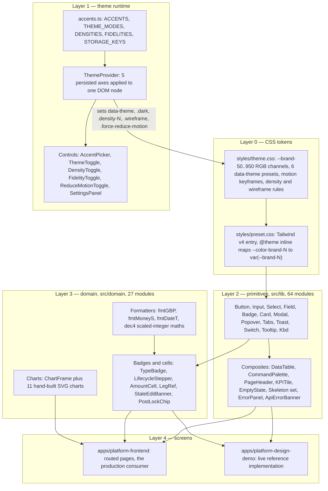
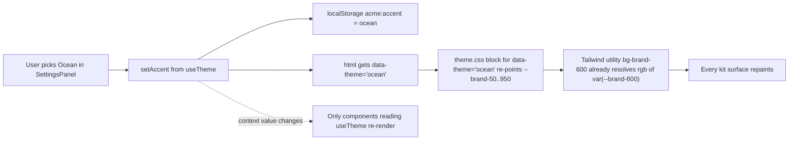
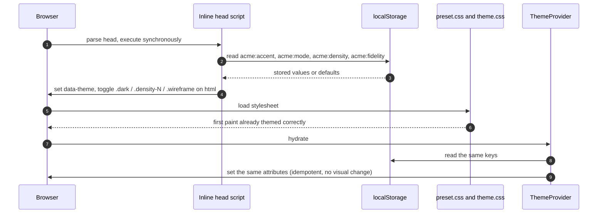
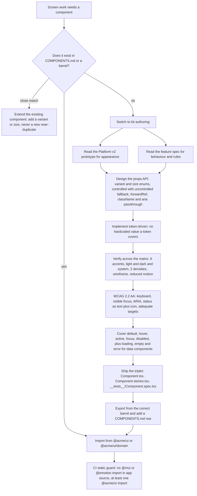

# The `@acme/ui` Design System

What this covers: the shared UI kit that every Platform screen is built from — its four layers
(CSS tokens → theme runtime → primitives → domain components), the two barrels that expose it,
the five-axis runtime configuration matrix, the Storybook and accessibility gates a component
must clear, and **policy AD-7**: a missing primitive is authored in the kit _first_ and then
consumed, never rebuilt inside a screen. Everything below was read out of `libs/platform/ui/**`
(98 component modules), the kit's `CLAUDE.md` / `COMPONENTS.md` / `README.md`, the app's
`apps/platform-frontend/**`, and the CI workflow. Where a claim could not be verified from
source — or where the source contradicts its own documentation — the prose says so.

Deciding record: **ADR-0060 — Platform Frontend Stack: `@acme/ui` Design System + React Query
State**. Supporting: **ADR-0056 — platform-frontend MUI→`@acme/ui` transition (nested-provider
reset/theme ownership)** and **ADR-0057 — nav shell composed in the app, not the kit**.

---

## 1. The four layers



### What this shows

Colour, spacing, shadow and type live **only** in Layer 0 as CSS custom properties. Layer 1
never computes a colour — it flips one attribute and four classes on a single DOM node, and the
cascade does the rest. Layers 2 and 3 read tokens through Tailwind utility classes
(`bg-brand-600`, `text-slate-500 dark:text-slate-300`) and therefore inherit every theme axis
with **no caller effort and no re-render**.

### Takeaways

1. **The dependency arrows only point down.** A primitive never imports a domain component; a
   domain component never imports a screen. The one deliberate exception is `DataTable`, which
   reads `ThemeContext` directly to auto-wire its row density (`src/lib/DataTable.tsx:633`) —
   a Layer 2 → Layer 1 read, not a cycle.
2. **Layer 3 exists because of business meaning, not because of size.** `fmtGBP`, `TypeBadge`,
   `LifecycleStepper` and the ERP-status charts encode en-GB currency, deal lifecycle and
   accounting semantics; they are kept out of the generic barrel so the kit stays reusable.
3. **Nothing in the kit ships a nav shell.** ADR-0057 decided the sidebar/topbar is composed in
   the app. The kit ships `PageHeader`, `NavItem` and `AuthShell` and stops there.
4. **The kit has no runtime dependency other than `tslib`.** It is built with `@nx/js:swc` and
   copies `src/styles/**/*.css` as build assets — no CSS-in-JS runtime, no MUI, no emotion.

**Invariant encoded:** _a value a token covers is never hardcoded._ Status colours are the
mirror-image rule — they are fixed because they carry meaning, and must never be re-skinned by
the accent.

---

## 2. Two barrels, one contract

```
libs/platform/ui/
├── package.json              exports: "." → src/index.ts
│                                      "./domain" → src/domain/index.ts
│                                      "./styles.css" → src/styles/preset.css
├── project.json              Nx project "platform-ui"
│                             tags: scope:platform-shared, type:lib, layer:ui, runtime:browser
│                             targets: build (@nx/js:swc) · test (@nx/vite:test)
│                                      lint · typecheck (lib + storybook tsconfigs)
├── CLAUDE.md                 authoring rules (auto-loaded for kit work)
├── COMPONENTS.md             the component inventory — updated with every new export
├── README.md                 setup: stylesheet import, FOUC guard, ThemeProvider
├── .storybook/
│   ├── main.ts               @storybook/react-vite + @tailwindcss/vite + nxViteTsPaths
│   ├── preview.tsx           4 toolbar globals: accent · mode · density · fidelity
│   └── setup.ts
├── test/setup.ts
├── vitest.config.ts          jsdom · reporters:['default'] · css:false · testTimeout 30s
└── src/
    ├── index.ts              @acme/ui        — 75 export statements
    ├── domain/index.ts       @acme/ui/domain — 33 export statements
    ├── styles/
    │   ├── theme.css         496 lines: brand presets, motion system, density, print
    │   └── preset.css         51 lines: Tailwind v4 entry (NO preflight)
    ├── theme/                7 components + accents.ts + useTheme + useReveal
    ├── lib/                 64 component modules + __tests__/
    └── domain/              27 modules incl. charts/ + __tests__/
```

Monorepo consumers resolve the barrels through `tsconfig.base.json` paths
(`"@acme/ui": ["libs/platform/ui/src/index.ts"]`,
`"@acme/ui/domain": ["libs/platform/ui/src/domain/index.ts"]`); the `exports` map in
`package.json` is the same contract for a built consumer. Both barrels are **public API** —
dropping an export from either is a breaking change.

One deliberate non-export: `Highlight` is `DataTable`-internal (it highlights matching text
inside a cell) and is intentionally absent from the barrel — consumers work through `DataTable`.

**Stylesheet caveat, verified in source.** `preset.css` imports only Tailwind's _theme_ and
_utilities_ layers and deliberately **omits `preflight`**, a legacy of the MUI coexistence
window when MUI's `CssBaseline` owned the reset (ADR-0056). The reset flip has since happened:
`apps/platform-frontend/src/styles/tailwind.css` declares `@layer theme, base, components,
utilities;` and re-adds `@import 'tailwindcss/preflight.css' layer(base);` itself. The kit's
`README.md` still describes the pre-flip state — **the README is stale here, the CSS is
authoritative**.

Apps also `@import` the preset by **relative path** rather than the bare `@acme/ui/styles.css`
specifier, because Vite's CSS resolver does not consult workspace `exports` for bare-specifier
`@import`. The bare specifier remains the contract for a built/published consumer.

---

## 3. The configuration matrix

`ThemeProvider` owns five independent, persisted presentation axes. Each maps to exactly one DOM
mutation on a single target node (`document.documentElement` by default; a `target` prop scopes
it, which is how Storybook themes a story root without polluting the document).

| Axis           | Values                                                 | DOM effect                                  | localStorage key     | Default in kit |
| -------------- | ------------------------------------------------------ | ------------------------------------------- | -------------------- | -------------- |
| `accent`       | `steel` `graphite` `indigo` `ocean` `emerald` `copper` | `data-theme` attribute                      | `acme:accent`        | `steel`        |
| `mode`         | `light` `dark` `system`                                | `.dark` class                               | `acme:mode`          | `system`       |
| `density`      | `comfortable` `compact`                                | `.density-comfortable` / `.density-compact` | `acme:density`       | `comfortable`  |
| `fidelity`     | `mockup` `wireframe`                                   | `.wireframe` class                          | `acme:fidelity`      | `mockup`       |
| `reduceMotion` | `true` `false`                                         | `.force-reduce-motion` class                | `acme:reduce-motion` | `false`        |

`mode: 'system'` resolves through `window.matchMedia('(prefers-color-scheme: dark)')` with a
live `change` listener, and the provider exposes the resolved value as `resolvedMode` so
consumers never re-derive it. Every `window`/`document` access is SSR-guarded, and every
`localStorage` read/write is wrapped in `try/catch` (private-browsing mode).

### 3.1 How an accent change repaints the product



### What this shows

The re-skin is a **CSS-variable indirection, not a React re-render**. `preset.css` maps the
brand scale with `@theme inline`, so the generated Tailwind utilities emit
`rgb(var(--brand-600))` rather than a baked hex. Swapping `data-theme` on `<html>` re-points
those variables and the whole surface recolours — no rebuild, no cache bust, and no component
re-render beyond the handful that call `useTheme()` directly.

### Takeaways

1. **Channels, not hex.** Tokens are stored as space-separated RGB channels
   (`--brand-600: 74 88 126`) precisely so Tailwind's opacity modifiers (`bg-brand-600/40`) and
   gradient stops keep working through the variable.
2. **The provider's context value is memoised** and the setters are `useCallback`-stable, so an
   ancestor re-render above the provider does not cascade into every `useTheme()` consumer.
3. **Six presets, eleven steps each, mode-independent.** Dark mode is a separate axis from the
   accent — a component must look right at all 6 × 2 × 2 combinations.
4. **Status colours are excluded from the brand scale** by construction: they stay on the
   default palette (emerald / rose / amber) in `theme.css`. `Badge` renders status as **text +
   icon**, never colour alone.

**Invariant encoded:** _presentation is token/context-driven, never per-screen CSS._ A new
presentation axis is added to `ThemeProvider` plus a kit toggle first, then rendered once in the
app's `AppLayout` — never as a page-local hack.

### 3.2 Pre-paint theming (the FOUC guard)

`ThemeProvider` reads `localStorage` on mount, but React hydrates _after_ the first paint — so
without a guard the default theme flashes. Every consuming app ships an inline `<head>` script
that mirrors the provider's DOM contract before any stylesheet loads.



### Takeaways

1. The guard's **fallback values must match the `default*` props** passed to `<ThemeProvider>`
   in that app's root, or the page flashes on cold start. The demo app defaults to `steel`;
   `apps/platform-frontend` pins `defaultAccent="indigo"` in both `index.html` and `app.tsx`.
2. The guard is **duplicated logic by necessity** — it cannot import the kit, because it must
   run before any module graph exists. It is the one place the provider's DOM contract is
   restated, and it is a known maintenance coupling.
3. `reduceMotion` is **not** in the guard (only the four visual axes are), which is harmless:
   the OS `prefers-reduced-motion` media block in `theme.css` already applies pre-paint.

### 3.3 Motion

`theme.css` defines the whole motion system — `cc-fade-up`, `cc-scale-in`, `cc-slide-in`,
`cc-spin`, `cc-pulse-ring`, `cc-route`, `cc-sheen`, `cc-grow-y` — plus transition-based
entrance helpers (`.enter`, `.enter-scale`, `.enter-fade`) whose _resting_ state is
`opacity: 1`, so a screenshot or a disabled-animation environment still shows content.

Two independent suppression paths exist and are kept in lockstep:

- `@media (prefers-reduced-motion: reduce)` — the OS setting.
- `.force-reduce-motion` — the in-app forced override applied by `ThemeProvider`.

Both kill `animation` and `transition` globally, force entrance helpers visible, and stop the
spinner (the static conic-gradient ring still reads as "loading"). The kit also exports
`usePrefersReducedMotion`, `useEntrance` and `useSimulatedLoad` for JS-driven motion.

---

## 4. Policy AD-7 — the kit is where primitives are born



### What this shows

The pipeline has **two distinct roles with two distinct scoped rulebooks**. Kit authoring loads
`libs/platform/ui/CLAUDE.md`; screen consumption loads `apps/platform-frontend/CLAUDE.md`. The
handshake between them is the barrel plus `COMPONENTS.md`, which is described in source as _"the
single source of truth for what the kit ships"_.

### Takeaways

1. **Two sources of truth, ranked.** The vendored prototype governs _appearance_; the feature
   specs under `docs/platform/doc-site/platform/features/` govern _behaviour and business
   rules_. Where they conflict the spec wins **and the conflict is surfaced**, never silently
   resolved.
2. **Prototype primitives were promoted, not copied.** `StatusStepper`, `MetricRail`/`Metric`,
   `AmountCell`, `Segmented`, `Kbd` and `DescriptionList` all originated in the prototype and
   now live in the kit. The prototype's HTML/Babel is never ported — screens are recreated.
3. **AD-7 is machine-enforced, not aspirational.** `apps/platform-frontend/src/app/__tests__/
mui-removal-kit-usage.spec.ts` walks every production `.ts`/`.tsx` under `src/` (excluding
   `__tests__`, `__mocks__`, `assets`) and asserts (a) no module matches
   `/from\s+['"]@mui\/[^'"]+['"]/`, (b) none matches the `@emotion` equivalent, and (c) at least
   one module imports `@acme/ui`. Clause (c) is the interesting one: it stops "MUI removed" from
   being satisfied by deletion instead of migration.
4. **Extend before you add.** The scaffolding command's step 1 is an explicit near-synonym grep;
   a close match is extended with a new `variant`/`size` rather than forked.

**Invariant encoded:** _a gap is filled in the kit first and consumed second._ The cost is one
extra step per screen; the payoff is that six epics building in parallel converge on one tested
component set instead of six divergent ones.

---

## 5. Quality gates

### 5.1 The component triplet

The stated bar is that every component ships `Component.tsx` + `Component.stories.tsx` +
`__tests__/Component.spec.tsx`, where each spec covers render, at least one behaviour/data
assertion, and an accessibility check.

Measured against the tree on the branch read:

| Metric                                                  | Count |
| ------------------------------------------------------- | ----- |
| Component modules (`.tsx`, excluding stories and tests) | 98    |
| Storybook stories                                       | 96    |
| Spec files                                              | 87    |
| Specs asserting `expectNoAxeViolations`                 | 74    |

### 5.2 Accessibility

There is no `jest-axe` in the workspace, and adding `@storybook/addon-a11y` would re-open the
Storybook-8 ↔ Vite-7 peer conflict (see 5.4). Instead the kit drives the `axe-core` engine
directly from unit tests via `src/lib/__tests__/axe-helper.ts`:

```ts
const results = await axe.run(container, {
  rules: { "color-contrast": { enabled: false } },
});
// throws with a per-violation summary if results.violations.length > 0
```

`color-contrast` is disabled because jsdom has no layout or paint context; contrast is verified
visually against the prototype instead. This is an honest, documented limitation — **automated
contrast checking does not exist in this pipeline.**

Two conventions worth knowing before extending the kit, both documented in the README and
visible in source:

- **`ariaDisabled` over native `disabled`** on a control that is locked but must stay
  keyboard-reachable (e.g. `Switch` for a mandatory security toggle). Native `disabled` removes
  the element from the tab order, which makes an attached `Tooltip` undiscoverable on focus
  (WCAG SC 1.4.13). The component must also suppress its own handlers — `aria-disabled` only
  communicates state.
- **`role="img"` on a purely visual track** (e.g. `LifecycleStepper`'s dot track) with a
  descriptive `aria-label`, because the track communicates one holistic position rather than an
  enumerable set of interactive items.

`DataTable` is the heaviest a11y surface: `role="grid"` / `role="row"` / `role="gridcell"`, a
**roving tabindex** (exactly one body row tabbable, Arrow Up/Down moves the active row), sortable
headers reachable with `tabIndex={0}`, and mobile card degradation.

### 5.3 Test-runner configuration — two hard-won settings

```ts
// vitest.config.ts
passWithNoTests: false,   // a silent no-op "green" run once masked untested components
reporters: ['default'],   // @nx/vite:test otherwise runs with only its silent internal reporter
testTimeout: 30000,       // axe-core on DataTable/CommandPalette takes ~8-10s under CI load
css: false,               // components use className strings; a stray v4 @import can't crash a run
```

`reporters: ['default']` is not cosmetic. Without it a failing `platform-ui:test` surfaced as
**exit 1 with zero output** — an undiagnosable CI block that froze every Platform image build.
It was first mis-filed as a cache bug (#1506) and refuted (Nx never caches failures); the real
fixes landed as #1370/#1398. `testTimeout: 30000` came from #1330.

### 5.4 Storybook

`.storybook/preview.tsx` exposes **accent, mode, density and fidelity as toolbar globals** and
applies them through a decorator that mirrors `ThemeProvider` onto the story wrapper (using the
same `target`-scoping idea), cleaning up on unmount so classes do not bleed between stories in
autodocs mode. `tags: ['autodocs']` generates a docs page per component story.

In CI, `build-storybook` runs as an **informational, `continue-on-error` step** on the
self-hosted 8-core runner only — deliberately excluded from `nx affected -t build` and from the
2-core fallback job because of an OOM history. It is an inferred `@nx/storybook` target on
`platform-ui` alone, so it is a fast no-op unless the kit is in the affected set.

The toolchain carries a documented, intentional split recorded in `.storybook/main.ts`: Vite 7
needs esbuild ^0.27 (pinned by a root `overrides`), while `@storybook/core` 8 bundles a nested
esbuild 0.25.x. `npm ci` installs both, including per-platform binaries; a local
`npm/bun install --ignore-scripts` will be missing the nested binary. The peer mismatch is
cleared by a **scoped** `package.json` override, not `.npmrc force`. Storybook 9 would retire
both notes and is deferred.

---

## 6. Verified gaps and documentation drift

Listing these is the point of the section — an honest gap beats a confident fiction.

1. **`CLAUDE.md` and the alignment doc are stale on two axes.** Both state that there is _no_
   `FidelityToggle` and that forced `reduceMotion` is _not wired_. Neither is true on the branch
   read: `src/theme/FidelityToggle.tsx` and `src/theme/ReduceMotionToggle.tsx` exist, both are
   exported from the barrel, `ThemeProvider` toggles `.force-reduce-motion`, and `SettingsPanel`
   aggregates all five axes into one "Tweaks" popover which `AppLayout` renders. **The code
   closed the gap; the docs did not follow.**
2. **Test-coverage holes against the stated triplet bar.** 21 component modules have no
   co-located spec: the five `Skeleton*` variants, the five `Auth*` shells/banners,
   `BrandSpinner`, `LoadingPanel`, `Reveal`, `RouteFade`, `RouteProgress`, `FieldContext`,
   `ChartFrame`, and all five theme controls. Four of the five theme controls are exercised
   indirectly by `theme/__tests__/SettingsPanel.spec.tsx`; **`AccentPicker` is not** — the panel
   inlines its own accent swatches rather than nesting the component, so `AccentPicker` has no
   test coverage at all. Two modules have no story (`FieldContext`, `ThemeProvider`); both are
   non-visual and the omission is reasonable.
3. **The scaffolding command references paths that do not exist** in this layout — it points at
   `packages/ui/CLAUDE.md` and a `design/platform-prototype/` folder. The real locations are
   `libs/platform/ui/CLAUDE.md` and the vendored prototype under `docs/platform/design/`. The
   command's _steps_ are accurate; its _paths_ have drifted.
4. **Density is only partially realised.** `theme.css` implements density via `.density-N .row-y`
   padding rules, but the alignment doc records that the only place it visibly bites is
   `DataTable` (which reads `ThemeContext.density` directly) — "other `.row-y` CSS is dead".
   Not verified independently here.
5. **Not verified from source:** whether every one of the 96 stories actually exercises dark
   mode and both densities (the stated bar), and whether the 6 × 2 × 2 matrix is checked
   anywhere automatically. No visual-regression or screenshot-diff tooling was found in the
   workspace, so matrix conformance appears to rest on review rather than on a gate.

---

## 7. Related records

| Record                                                           | Relevance                                                                         |
| ---------------------------------------------------------------- | --------------------------------------------------------------------------------- |
| **ADR-0060** — Platform Frontend Stack: `@acme/ui` + React Query | Adopts the kit program-wide; states the library-first rule that AD-7 formalises   |
| **ADR-0056** — MUI→`@acme/ui` nested-provider transition         | Reset/theme ownership; why `preset.css` omits preflight and how the flip happened |
| **ADR-0057** — nav shell composed in the app                     | Why no `AppShell` ships in the kit                                                |
| `libs/platform/ui/COMPONENTS.md`                                 | The component inventory — the file to check before authoring anything             |
| `docs/platform/design/platform-v2-alignment.md`                  | Prototype ↔ kit mapping, config-matrix support table, domain invariants           |
