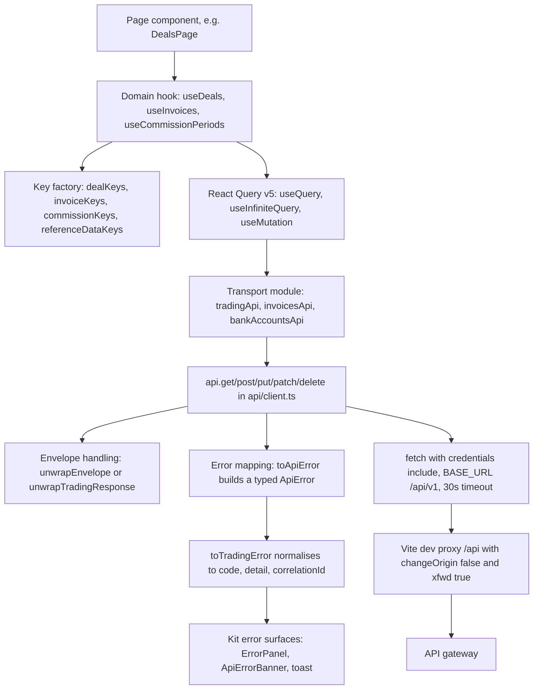
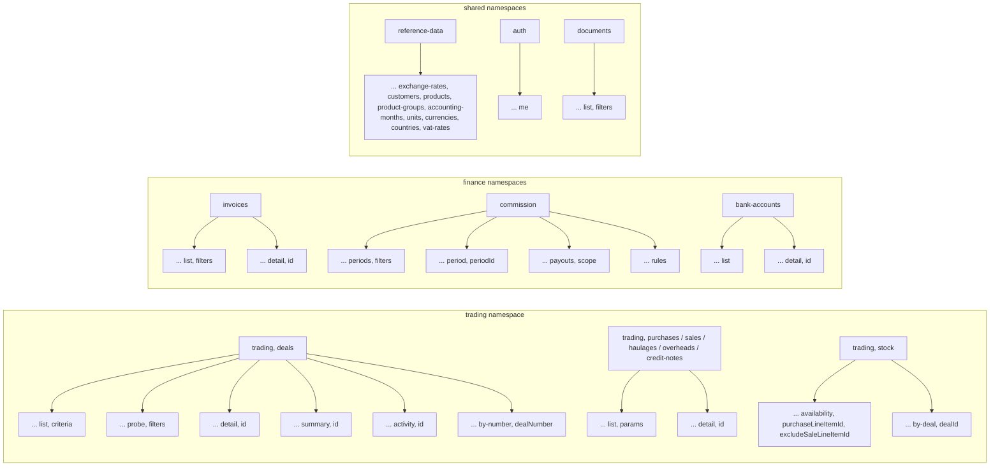
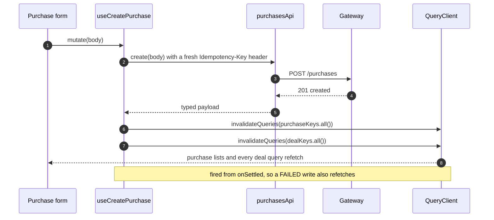
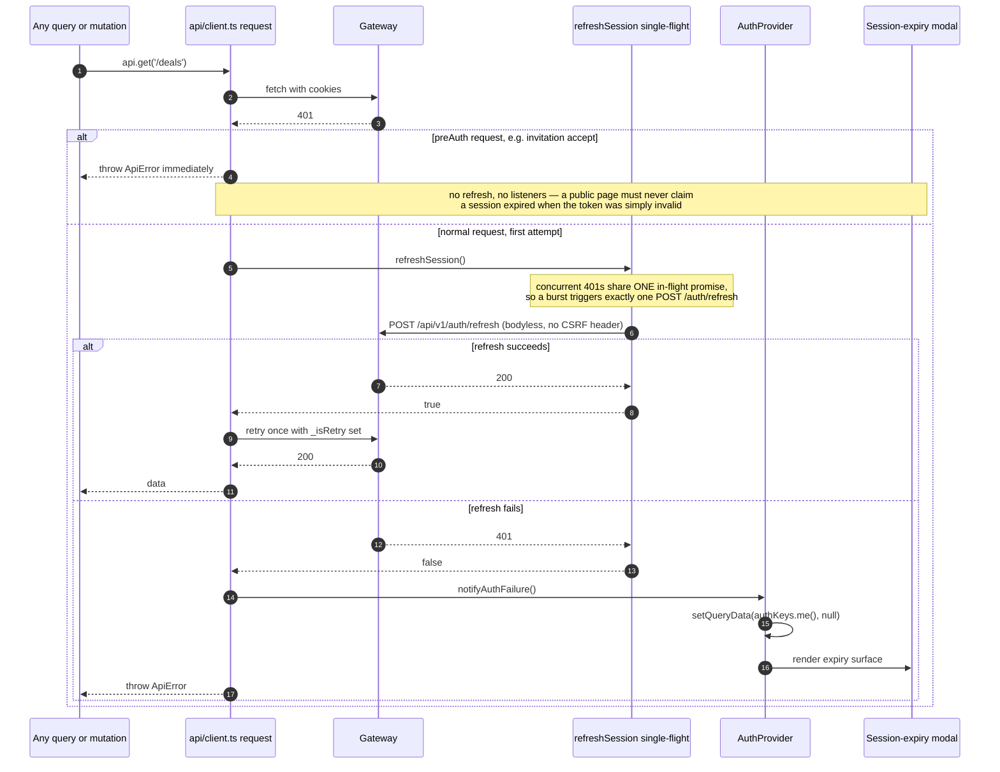
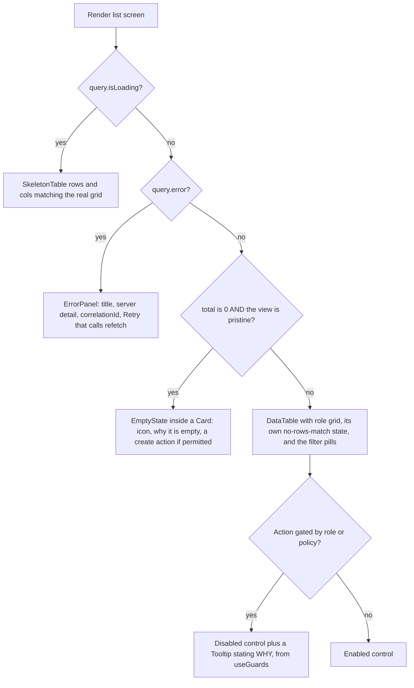

# Frontend State and Data Access

What this covers: how `apps/platform-frontend` gets data and holds state — the server-state /
client-state split, the typed transport layer under `src/api/`, the React Query key factories and
their invalidation fan-out, the two wire envelopes the client tolerates, the 401 → refresh →
retry interceptor, and the loading / error / empty / permission-denied conventions every list
screen ships. Read from `apps/platform-frontend/src/api/**` (23 modules, ~4,570 lines),
`src/providers/`, `src/hooks/`, `src/app/`, and the kit's error surfaces in
`libs/platform/ui/src/lib/`. Unverified claims are called out as such.

Deciding record: **ADR-0060 — Platform Frontend Stack: `@acme/ui` Design System + React Query
State**. Supporting: **ADR-0061 — canonical `{data, meta, errors[]}` envelope + cursor
pagination + `filter[]`**, **ADR-0071 — optimistic locking, version in DTO**, **ADR-0072 —
inbox/idempotency**.

---

## 1. The split: server state vs client state

ADR-0060 settles it: **React Query v5 for server state, React `useState`/context for UI and
local state, and no global client store.** No Redux, no Zustand, unless a future epic proves a
concrete need.

That leaves exactly four state homes in the app:

| Home                    | Holds                      | Example                                                   |
| ----------------------- | -------------------------- | --------------------------------------------------------- |
| React Query cache       | everything the server owns | deals, invoices, commission periods, `/users/me`          |
| React context (kit)     | presentation config        | `ThemeProvider` — accent, mode, density, fidelity, motion |
| React context (app)     | derived session identity   | `AuthProvider` → `useAuth()`, `useGuards()`               |
| URL / `useSearchParams` | shareable view state       | active saved view, selected row, list filters             |

The consequence worth stating: **there is no client-side mirror of server data.** A list screen
does not copy rows into local state to mutate them; it fires a mutation and invalidates. This is
what makes the fan-out rules in §4 the whole of the consistency story.

---

## 2. The data-access stack



### What this shows

Five responsibilities are separated and each lives in exactly one place: **key construction**
(the factory), **caching policy** (the hook), **URL and payload shape** (the transport module),
**transport concerns** — auth, timeout, envelope, error typing (`client.ts`) — and
**presentation of failure** (the kit surfaces).

### Takeaways

1. **One `fetch` wrapper for the whole app.** `api/client.ts` prepends `/api/v1`, always sends
   `credentials: 'include'` (session is cookie-based; there is no bearer token in JS), links the
   caller's `AbortSignal` with a 30-second timeout signal, and sets `Content-Type` **per request**
   — only when a JSON body is present, so `FormData` keeps its browser-generated boundary.
2. **Envelope unwrapping happens once.** `unwrapEnvelope<T>()` strips the `{ data }` success
   envelope inside `request()`, so every `api.*` caller receives the inner payload directly. A
   `204` short-circuits to `undefined`.
3. **The dev proxy deliberately does not rewrite `Host`.** `changeOrigin: false` preserves the
   browser's `{slug}.localhost:5173` Host so the gateway's subdomain tenant classifier works
   locally; `xfwd: true` adds `X-Forwarded-*` for parity with the production ingress. Setting
   `changeOrigin: true` silently breaks per-tenant sign-in locally.
4. **Two escape hatches exist and are documented at their call sites.** CSV export uses a raw
   `fetch` (the shared client would JSON-parse a `text/csv` body) and re-uses `toApiError` for
   consistency; the auth module fetches `/auth/*` outside `BASE_URL` and re-uses both
   `toApiError` and `unwrapEnvelope` so error and envelope handling are never re-derived.

**Invariant encoded:** _transport concerns never leak into a page._ A component sees typed data
or a typed `ApiError` — never a `Response`, never a status code branch.

---

## 3. Query keys

Keys are **array tuples produced by a per-domain factory**, never inline literals. Every factory
exposes an `all()` prefix, and every finer key extends it, so partial invalidation is a prefix
match.



### What this shows

The namespace is the **first tuple element and doubles as the invalidation blast radius**. A
deal write invalidates `['trading','deals']`, which by prefix match clears list pages, probes,
detail, summary, activity and by-number lookups in one call. A leg write invalidates _both_ its
own namespace _and_ the deal namespace, because a leg changes the parent deal's totals, derived
lock status and activity feed.

### Takeaways

1. **Filters are part of the key, as an object.** `dealKeys.list(criteria)` embeds the whole
   criteria object. React Query hashes it structurally, so two different filter sets are two
   different cache entries and switching a saved view is a cache read, not a refetch — provided
   the criteria object is constructed deterministically.
2. **Namespaces are not perfectly consistent, and it does not matter.** `referenceDataKeys` uses
   `'customers'` for the list and `'customer'` (singular) for the detail, so `customer(id)` is
   _not_ a prefix of `customers(filters)`. Every reference-data mutation invalidates
   `referenceDataKeys.all()`, which covers both — but a narrower invalidation would silently
   miss one of them. Worth knowing before optimising.
3. **`stockKeys.availability` pads a nullable argument to `null`** rather than omitting it
   (`excludeSaleLineItemId ?? null`), which keeps the tuple arity fixed and the hash stable.
4. **`authKeys` is the one factory built by spreading** (`me: () => [...authKeys.all, 'me']`) —
   functionally identical to the literal style used elsewhere.

**Invariant encoded:** _the key is the cache contract._ Because keys are only ever produced by a
factory, a mutation in one module can safely invalidate another module's data by importing its
factory — which is exactly what the leg hooks do with `dealKeys.all()`.

---

## 4. Caching and invalidation policy

### 4.1 Defaults

```ts
// app/app.tsx — one QueryClient for the whole app
new QueryClient({
  defaultOptions: {
    queries: {
      refetchOnWindowFocus: false,
      retry: false, // a 401 must not be naively retried; client.ts already does one refresh
    },
  },
});
```

`retry: false` as a **default** is the deliberate choice, inverted from React Query's own
default. The reasoning recorded in source: a 401 is definitive, not transient, and the transport
already performs exactly one refresh attempt. Individual queries opt back into retries; several
detail hooks restate `retry: false` explicitly so a 404 surfaces once instead of three times.

### 4.2 `staleTime` in practice

| Surface                                                                                                       | `staleTime`                          | Rationale in source                                             |
| ------------------------------------------------------------------------------------------------------------- | ------------------------------------ | --------------------------------------------------------------- |
| Dashboard widgets (open deals, lockable deals, profit, commissions, pending invoices, stock, recent activity) | 30 s                                 | Widget-level freshness                                          |
| Dashboard grid layout query                                                                                   | 60 s                                 | Layout changes rarely                                           |
| Notification bell list                                                                                        | 15 s, with `refetchInterval: 30_000` | Always-enabled poll; `staleTime` caps refetches on popover open |
| `/users/me` (`AuthProvider`)                                                                                  | 5 min                                | Identity is stable within a session                             |
| Deal-detail tab data                                                                                          | 5 min                                |                                                                 |
| Tenant branding                                                                                               | dedicated constant                   |                                                                 |
| Everything else                                                                                               | unset (0)                            | Refetch on mount is the norm                                    |

There is **no `gcTime` override anywhere in the app** — the React Query default garbage-collection
window applies throughout.

### 4.3 Mutation fan-out



### What this shows

Every leg mutation routes through one shared `useLegMutation` helper, so the double invalidation
is structural rather than remembered per call site. The `onSettled` choice (rather than
`onSuccess`) means a failed write **still** re-syncs the cache — a 409 stale-write or a partially
applied change cannot leave the UI showing a fabricated state.

### Takeaways

1. **Invalidate broad, not narrow.** Every mutation in the app invalidates an `all()` prefix.
   With `retry: false` and short lists this is cheap, and it removes an entire class of
   "stale row after edit" bugs.
2. **Writes carry safety headers.** `PATCH` sends the last-read `version` **in the body**
   (ADR-0071 — optimistic locking is version-in-DTO, not an `If-Match` header); creates and
   lifecycle `POST`s send a client-generated `Idempotency-Key` header (ADR-0072) so a retry
   replays instead of duplicating.
3. **Batch operations invalidate once.** `useLockDealBatch` posts to `/deals/lock-batch` a single
   time (the caller slices to the ≤50 cap) and invalidates `dealKeys.all()` on settle, so newly
   locked rows refetch to the server-authoritative status rather than being patched locally.
4. **There are no optimistic cache writes anywhere in the app.** `onMutate` appears zero times
   in the source; every write is pessimistic and invalidation-driven. `setQueryData` is used in
   exactly two places, neither of them a rollback: `AuthProvider` nulls the identity on auth
   failure, and the onboarding wizard seeds its own draft key from a mutation response. For a
   financial system whose status fields are server-_derived_ (deal status is computed, never set
   by the client) that is the correct default.

**Invariant encoded:** _the server is the authority on derived state._ The client never computes
a lock status, a total, or a commission figure and writes it into the cache.

### 4.4 Pagination

Two shapes coexist, both via `useInfiniteQuery`:

- **Offset "Load more"** — `useDeals` sums the lengths of loaded pages to compute the next
  `offset`, and `select` flattens all pages into `{ data, meta: { pagination } }` where
  `pagination` is the **last** page's, so `hasMore`/`total` describe the current tail.
- **Opaque cursor** — `useTradingInfiniteQuery` (a shared helper) and `useDealActivity` follow
  `meta.pagination.cursor` until `hasMore` is false, with `initialPageParam: undefined`.

A third pattern deserves a name: the **probe query**. `useDealProbeTotal` issues a `limit=1`
request whose only purpose is `meta.pagination.total` for a filter set, feeding the landing-strip
counters (open / locked / awaiting-lock). It is `enabled`-gated so hidden tiles never fetch, and
it is keyed separately (`dealKeys.probe`) so it does not collide with the list cache.

---

## 5. Wire contracts the client tolerates

ADR-0061 defines the canonical envelope, but a migration is in flight, so the trading data layer
accepts both shapes and normalises them. The generic `client.ts` unwrapper knows nothing about
pagination and is _not_ replaced by this — trading list callers opt into the richer helper.

```
SUCCESS — generic (handled by unwrapEnvelope in client.ts)
  { "data": <T> }                                → returns <T>
  <T>                                            → returned as-is (no "data" key)
  HTTP 204                                       → undefined

SUCCESS — trading lists (handled by unwrapTradingResponse)
  LEGACY     { "data": [...],
               "meta": { "total": 137, "offset": 50, "limit": 25 } }
             → { data, pagination: { cursor: null,
                                     hasMore: offset + limit < total,
                                     total },
                 errors: null }

  CANONICAL  { "data": [...],
               "meta": { "pagination": { "cursor": "<opaque>",
                                         "hasMore": true,
                                         "total": 137 } },
               "errors": [ { "code", "message", "field?", "correlationId?" } ] }
             → { data, pagination: { cursor, hasMore, total }, errors }

ERROR — two shapes, parsed defensively by toApiError
  CONTRACT   { "statusCode", "errorCode", "message", "details": [...], "timestamp" }
  NEST-DEFAULT { "statusCode", "message", "error" }        <- auth-service still emits this

  correlationId is read from the X-Correlation-ID RESPONSE HEADER first
  (the JSON envelope carries no correlationId field), then from the body as a fallback.
  Header access is optional-chained so a 204 or a test double without headers cannot throw.
```

`meta.pagination` is authoritative when present; the legacy branch only fires when
`meta.total` is a number. Both branches produce the same normalised
`{ cursor, hasMore, total }` so no screen ever branches on envelope shape.

---

## 6. Session lifecycle: 401, refresh, and expiry



### What this shows

Three separate hazards are each closed by one specific mechanism, and all three were learned the
hard way — the source comments read like incident notes.

### Takeaways

1. **Single-flight refresh.** A dashboard mounting eight widgets against a dead session produces
   eight simultaneous 401s. Without the shared promise that is eight refresh calls; with it,
   exactly one. The promise is nulled in `finally` so a later burst can re-trigger.
2. **`_isRetry` prevents recursion.** A second 401 after a successful refresh surfaces the error
   rather than looping.
3. **`preAuth: true` marks pre-authentication calls** (invitation accept, password reset). Those
   skip the refresh dance and never fire the auth-failure listeners, so a public page cannot pop
   a "session expired" modal for what is really an invalid token.
4. **On failure, `AuthProvider` does `setQueryData(authKeys.me(), null)` and deliberately does
   NOT invalidate.** The session is known dead; a refetch would 401 → refresh → fail →
   `notifyAuthFailure()` again, an infinite two-request loop.
5. **Logout is a full-page navigation, not `queryClient.clear()`.** `clear()` evicts every query
   while its observers are still mounted, so each one instantly refetches → 401 (cookies gone) →
   refresh fails → the modal plus a "failed to load" widget storm. A hard reload discards the
   entire in-memory heap, cache included, so no observer survives. `beginLogout()` additionally
   sets a module-level flag that suppresses the expiry listeners for the 401s that necessarily
   follow a revoke (e.g. an in-flight 30-second notification poll). The flag is never reset
   in-process because the navigation reloads the document.

**Invariant encoded:** _an expected 401 must never be presented as a session expiry._ Three
distinct suppression paths — `preAuth`, `beginLogout`, and the no-invalidate rule — exist purely
to keep that promise.

---

## 7. Loading, error, empty and denied

Every list/table screen ships four states. The kit supplies the surface for each; the page owns
only the decision.



### What this shows

The empty-state test is **not** `rows.length === 0`. It is _zero rows **and** a pristine default
view_. A server-filtered view that resolves to zero rows keeps the table and the filter pills
rendered so its own "no rows match" state and the view switcher stay reachable — otherwise the
user is trapped in an empty screen with no way back.

### Takeaways

1. **Errors are keyed on a stable machine code, not an HTTP status.** `TRD_ERROR_CODES` maps
   each code to `{ http, title, surface, tone }`, where `surface` is one of
   `inline | banner | page | toast`. Unknown codes fall back to `SERVER_ERROR`. `NOT_FOUND` and
   `ENTITY_NOT_FOUND` are both registered as aliases because the platform envelope emits one and
   the prototype registry used the other. Detail copy is **not** in the registry — it arrives
   per-call from the server envelope.
2. **`toTradingError` is the normaliser.** It turns an `ApiError` into
   `{ code, detail, correlationId, status, details }`, falling back to `HTTP_<status>` and then
   `SERVER_ERROR`. Everything a screen shows about a failure comes from that object.
3. **Every failure surface offers a support code.** `ErrorPanel` and `ApiErrorBanner` mint a
   stable per-mount correlation code (`newSupportCode()`, lazily via `useState(() => …)` so
   `Date.now()` stays out of render) when the server did not supply one, and render it through
   `CopySupportCode`. Both carry `role="alert"`.
4. **Retry is offered if and only if the caller passes `onRetry`.** It is not a registry
   property. The deals page wires it to `query.refetch()` and simultaneously pushes an info toast
   naming the endpoint being retried.
5. **A per-call failure degrades only its own panel.** `ErrorPanel`'s documented contract is
   exactly that — a failed child call must not blank the page.
6. **Render errors have a separate net.** `FinanceErrorBoundary` catches thrown render errors and
   renders an accessible fallback with "Try again" that resets the boundary. Its scope is
   explicitly render-only: auth failures are _not_ thrown errors, they arrive via the
   `onAuthFailure` signal, so the boundary can never swallow them. It currently logs to
   `console.error` because no frontend OTel transport exists yet.
7. **Permission-denied is two-layered.** Routes are gated by `RequireRole` (client-side, for
   UX); actions are gated by `useGuards()` (trading) and `canPerform()` (finance), which return
   the _reason_ copy shown in the tooltip on a disabled control — a disabled control always
   states why, never sits dead. Both files state plainly that this is a **UI gate only** and the
   server is the authority; the finance permissions module goes further and records that
   server-side role guards on the accounting routes are **not yet implemented** (#1491), so for
   those routes the client gate is currently the only role check and must not be treated as a
   security boundary.

**Invariant encoded:** _no state is unhandled and no failure is silent._ Loading, error, empty,
no-rows-match and denied each have a designated surface, and every error carries a code the user
can quote.

---

## 8. Testing the data layer

Each API module has a sibling spec under `src/api/__tests__/` — 16 of them, covering the client
itself, the trading list/detail/lock-batch paths, legs, stock, invoices/finance, commission,
bank accounts, reference data, admin, platform, onboarding, tenant discovery, tenant public and
the SSO URL builder. Page and provider specs build their own `QueryClient` with
`{ defaultOptions: { queries: { retry: false } } }` so a rejected query fails the assertion
immediately instead of burning the 30-second test timeout on retries.

App-level Vitest config mirrors the kit's hard-won settings: `testTimeout: 30000` (axe-core on
heavy pages legitimately takes ~8 s under full-matrix CI load) and `reporters: ['default']`.

**Not verified from source:** whether any contract test pins the frontend's envelope
expectations against the backend's actual emissions. The defensive dual-shape parsing in
`trading-response.ts` and `toApiError` suggests such a pin does not exist — the client is written
to tolerate drift rather than to detect it.

---

## 9. Related records

| Record                                                                                 | Relevance                                                                                                                           |
| -------------------------------------------------------------------------------------- | ----------------------------------------------------------------------------------------------------------------------------------- |
| **ADR-0060** — Platform frontend stack: `@acme/ui` + React Query                       | Establishes React Query v5 + context, no global store; domain-namespaced tuple keys; `retry:false`; mutations invalidate broad keys |
| **ADR-0061** — Trading API contract: canonical envelope, cursor pagination, `filter[]` | The canonical shape `unwrapTradingResponse` normalises toward                                                                       |
| **ADR-0071** — Optimistic locking, version in DTO                                      | Why `PATCH` carries `version` in the body and `STALE_WRITE` is a 409                                                                |
| **ADR-0072** — Inbox idempotency                                                       | Why creates and lifecycle POSTs carry a client-generated `Idempotency-Key`                                                          |
| `frontend/02-design-system.md`                                                         | The kit surfaces referenced here: `SkeletonTable`, `EmptyState`, `ErrorPanel`, `ApiErrorBanner`, `DataTable`                        |

> Documentation-drift note: the leg module's `@see` comments cite `docs/adr/0071-optimistic-lock.md`
> and `docs/adr/0072-idempotency.md`. The real filenames are longer
> (`0071-...-optimistic-locking-version-in-dto.md`, `0072-...-inbox-idempotency-...md`). The ADR
> _numbers_ are correct; the _paths_ in the code comments are not.
