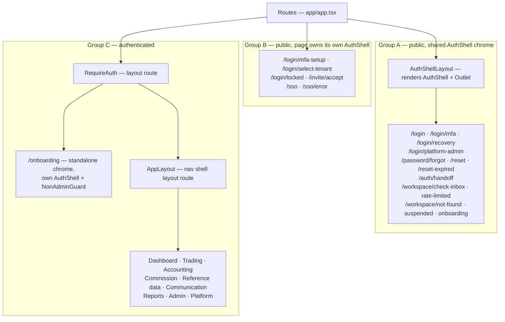
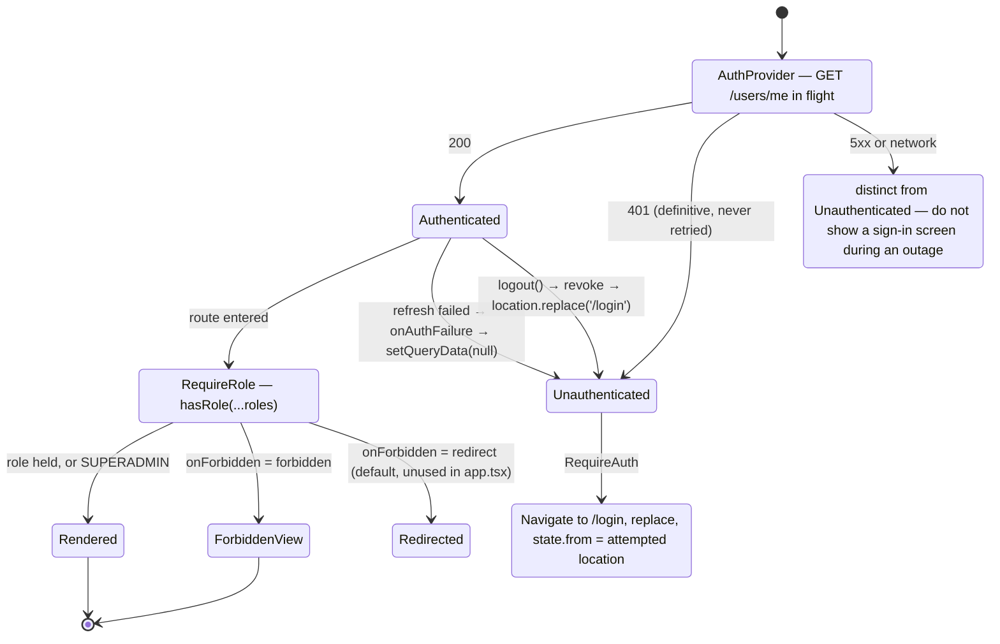
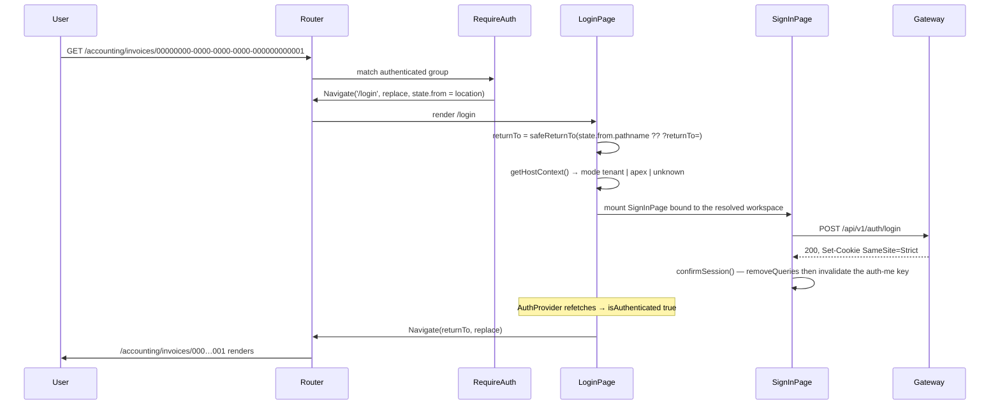
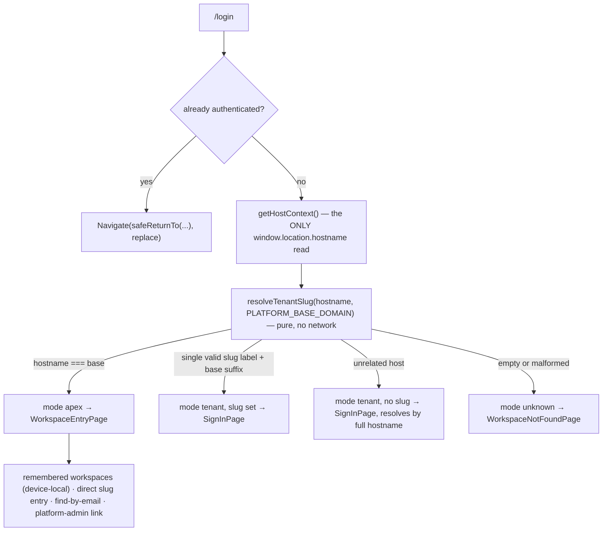
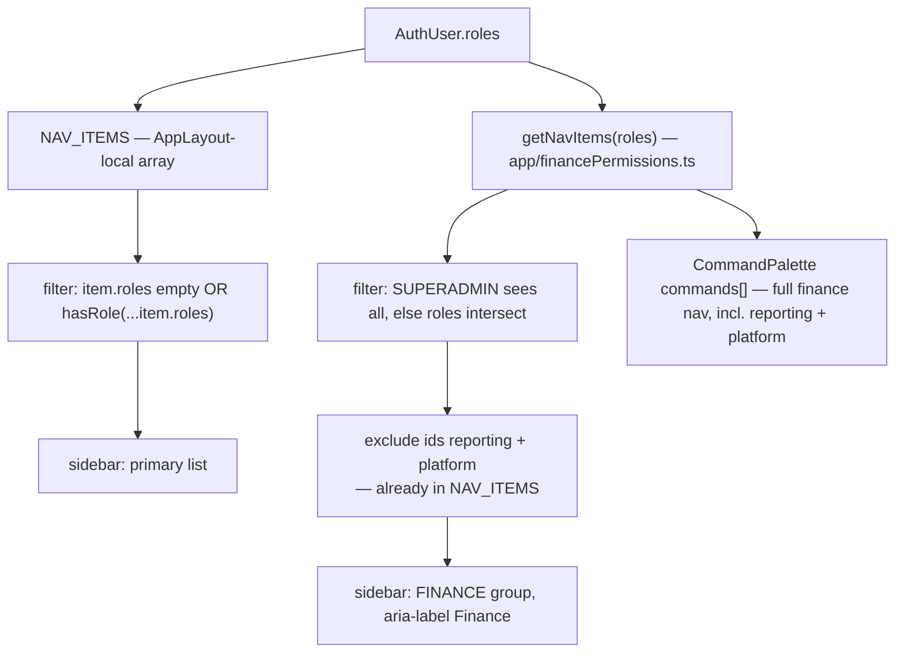
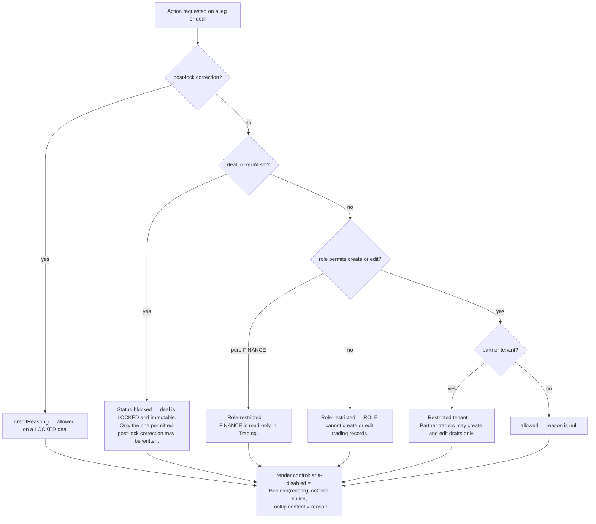

# Platform frontend — routing, guards and the nav shell

What this covers: the complete route tree of `apps/platform-frontend`, the three mount groups it is
split into, the two guard components that protect it (`RequireAuth` for authentication,
`RequireRole` for authorization), the host-aware `/login` entry point, the authenticated nav shell
composed in-app per ADR-0057, how navigation entries are permission-filtered, and the
disable-with-reason pattern that replaces hidden controls on gated actions. Application structure,
providers and build/serve are in [`01-app-architecture.md`](./01-app-architecture.md).

---

## 1. Router shape and the three mount groups

`main.tsx` mounts a **component-mode `<BrowserRouter>`** — not a data router. Every route is declared
as JSX inside a single `<Routes>` element in `app/app.tsx`. That one choice has consequences that
recur below: no loaders, no actions, no `useBlocker`, and no route-level error elements.

The tree splits into three groups that differ in what chrome they get and what must be true to reach
them.



**Takeaways**

1. The public auth screens are **siblings** of the authenticated group, not children of it. Sign-in
   is never gated behind the authentication it establishes.
2. Group A and Group B exist to avoid a **double shell**. Pages that already render their own
   `AuthShell` (MFA setup, tenant select, locked, invite, SSO) are mounted standalone; the bare
   `AuthCard` pages share one `AuthShell` supplied by the `AuthShellLayout` layout route.
3. `/onboarding` is authenticated but deliberately _outside_ `AppLayout` — it owns its own shell and
   its own ADMIN gate (`NonAdminGuard`, keyed off the session identity). Entry is driven by tenant
   status, never by a nav link.
4. The workspace edge-state pages (`not-found`, `suspended`, `onboarding`, `check-inbox`,
   `rate-limited`) are public by necessity: they are the outcomes of hostname resolution and
   workspace discovery, which happen before any session exists.

**Invariant encoded:** _chrome is owned exactly once per screen._ A page either supplies its own
`AuthShell` or inherits one from a layout route — never both.

---

## 2. The route table

Every authenticated route below sits under `RequireAuth` → `AppLayout` unless noted. All
`RequireRole` call-sites in `app.tsx` pass `onForbidden="forbidden"`, which renders the 403 view
in place rather than redirecting.

| Path                                                                                  | Roles required                         | Notes                                                                       |
| ------------------------------------------------------------------------------------- | -------------------------------------- | --------------------------------------------------------------------------- |
| `/`                                                                                   | any authenticated                      | Dashboard                                                                   |
| `/notifications/preferences`                                                          | any authenticated                      | ungated                                                                     |
| `/reports`                                                                            | ADMIN · MD · FINANCE                   |                                                                             |
| `/reports/schedules`                                                                  | ADMIN                                  |                                                                             |
| `/audit/:entityType/:entityId`                                                        | ADMIN · MD                             | parameterised only — see §7                                                 |
| `/admin/users`                                                                        | ADMIN                                  |                                                                             |
| `/admin/config`                                                                       | ADMIN                                  |                                                                             |
| `/platform/tenants/new`                                                               | SUPERADMIN                             | client gate for UX; wizard re-probes platform scope server-side             |
| `/accounting`                                                                         | ADMIN · FINANCE                        | invoices list                                                               |
| `/accounting/invoices/:id`                                                            | ADMIN · FINANCE                        |                                                                             |
| `/accounting/bank-accounts`                                                           | ADMIN · FINANCE                        | writes further ADMIN-gated in-page                                          |
| `/commission`                                                                         | ADMIN · FINANCE · MD · TRADER · VIEWER | feature flag enforced reactively via 403                                    |
| `/commission/payouts`                                                                 | ADMIN · FINANCE                        | narrowed because the list endpoint is tenant-wide, not trader-scoped        |
| `/commission/:periodId`                                                               | ADMIN · FINANCE · MD · TRADER · VIEWER |                                                                             |
| `/refdata`                                                                            | ADMIN · FINANCE                        | `RefDataLayout` + `<Outlet/>`; index redirects to `/refdata/exchange-rates` |
| `/refdata/{exchange-rates,customers,customers/:id,products,tables,accounting-months}` | inherited from `/refdata`              | children are not individually gated                                         |
| `/communication`                                                                      | ADMIN · FINANCE                        | generated documents                                                         |
| `/trading/deals`                                                                      | TRADING_ROLES                          | TRADING_ROLES = ADMIN · MD · FINANCE · TRADER · PARTNER_TRADER              |
| `/trading/deals/new`                                                                  | TRADING_ROLES                          | a deal is auto-created from its first purchase                              |
| `/trading/deals/:id`                                                                  | TRADING_ROLES                          |                                                                             |
| `/trading/{purchases,sales,haulages,overheads,credit-notes}`                          | TRADING_ROLES                          | each with `/new` and `/:id/edit` siblings                                   |
| `/trading/haulage`                                                                    | **none**                               | legacy nav path → `<Navigate to="/trading/haulages" replace/>`              |

Two structural observations that fall straight out of the table:

- **`TRADING_ROLES` is declared twice** — once in `app/app.tsx` for the route gates and once in
  `components/shared/AppLayout.tsx` for the nav visibility gate — with a comment in each asking that
  they be kept consistent. They are consistent today; nothing enforces it.
- **Reference-data children inherit their parent's gate.** Because the gate is on the `/refdata`
  layout route, adding a child route under it grants ADMIN·FINANCE access implicitly. That is
  convenient and also the easiest way to accidentally expose a future sub-page.

---

## 3. Guard chain and auth lifecycle



**Takeaways**

1. `AuthProvider` renders a `BrandSpinner` while probing, so **`RequireAuth` has no loading
   branch** — by the time it runs, auth is resolved. This is a genuine simplification, and it also
   means the whole app is blocked on one request at cold start.
2. `RequireAuth` preserves the attempted location in **router state** (`state.from`), not in the
   URL. `SessionExpiryModal` uses the other channel — a `?returnTo=` query parameter — because it
   performs a real browser navigation, not a router one.
3. `RequireRole` also redirects unauthenticated users (to `redirectTo`, default `/`) even though
   authentication is `RequireAuth`'s job. The source explains this as backward compatibility for
   older call-sites and tests.
4. **SUPERADMIN passes every `hasRole` check.** The implementation returns true when any role the
   user holds is in the required set _or_ is `SUPERADMIN`. `getNavItems` has its own matching
   short-circuit, so the two RBAC surfaces agree.
5. `Forbidden` is **enumeration-safe by design**: it says the user lacks permission without
   revealing what the resource is or whether it exists. It composes the kit `EmptyState` with a
   `role="region"` / `aria-labelledby` wrapper and a link home.

**Invariant encoded:** _the client gate decides what to_ **show**, _never what is_ **allowed**. The
source header of `app/financePermissions.ts` states this outright, along with the caveat that
server-side role guards are still missing on accounting-service routes (#1491) — for those routes
the client map is currently the only role check, which is recorded as a known defect.

### Spec drift worth naming

`test/features/route-guards.feature` specifies that a TRADER hitting `/admin/users` is _redirected to
`/dashboard`_ and shown a toast reading "You do not have permission to access this page". The
as-built behaviour is different and, arguably, better: the route renders the `Forbidden` view **in
place**, with no redirect and no toast. The feature file is a specification artifact that has not
been reconciled with the implementation, and it is not executed by the unit-test run (its directory
is outside the Vitest `include` glob).

---

## 4. Deep link → sign-in → return



**Takeaways**

1. **`returnTo` precedence is router state first, query second** — `state.from.pathname ?? ?returnTo=`
   — and the result always passes through `safeReturnTo`.
2. `safeReturnTo` is the single open-redirect guard for every entry point (`RequireAuth`,
   `SessionExpiryModal`, `SignInPage`, the SSO pages, the SSO `HandoffPage`). It accepts only a
   same-origin relative path and collapses everything else to `/`. It rejects three classes that a
   naïve `startsWith('/')` check misses, because the WHATWG URL parser normalises them before
   parsing: a protocol-relative `//host`, a backslash in the second position (`/\evil.example`,
   which resolves to `//evil.example`), and **any ASCII control character anywhere in the value**
   (a stripped tab collapses `/<TAB>/host` into `//host`).
3. `confirmSession()` (`hooks/useSession`) is what flips the app to authenticated after an in-SPA
   sign-in: it removes the cached `null` user and invalidates `['auth','me']`. It is _not_ needed
   after the OIDC/SSO callback, which is a full-page 302 back into the SPA and therefore re-runs the
   probe on a fresh mount.
4. `SessionExpiryModal` takes the other path — `window.location.assign('/login?returnTo=…')` — a real
   navigation, because the session is dead and the in-memory heap should not survive.

**Invariant encoded:** _a `returnTo` target is only ever followed if it is a same-origin relative
path_, enforced in one function so a fix to the guard covers every caller at once.

---

## 5. Host-aware `/login`

`/login` is one route that mounts three different surfaces depending on the browser's hostname
(ADR-0066 _hostname-based tenant resolution_, ADR-0069 _pre-auth tenant slug resolution_).



**Takeaways**

1. `resolveTenantSlug` is a **pure mirror** of the gateway's resolution precedence — hostname is
   passed in, never read from `window`. That purity is what makes it exhaustively unit-testable, and
   the single `window.location.hostname` read is isolated in `lib/tenant/host-context.ts`.
2. The gateway remains **authoritative**. The frontend mirror exists only to decide what to render;
   it cannot confirm that a custom domain is registered, so an unrelated host degrades to
   `mode: 'tenant'` with no slug and the page resolves by full hostname against the public
   resolve endpoint (a 404 becomes the not-found page).
3. There is deliberately **no `'default'` fallback** anywhere in the contract — the query-parameter
   `default` fallback is the defect this design replaced. A legacy `?tenant=` / `?tenantId=` URL is
   handled once at bootstrap by `maybeRedirectLegacyTenantParam()`, which fires a deprecation beacon
   and `location.replace`s to the canonical subdomain; it never establishes tenant context.
4. Opening a workspace from the apex is a genuine **cross-origin navigation** to
   `{slug}.{baseDomain}`, never an in-SPA route. `host-context.ts` builds those URLs and preserves
   the browser's port so local development on `:5173` does not aim at a dead `:80`.
5. The apex discovery surface is enumeration-safe: remembered workspaces come from device-local
   storage with zero server calls, direct slug entry navigates without confirming existence, and
   find-by-email always lands on one generic check-inbox page (a 429 diverts to a generic
   rate-limited page).
6. `/login/platform-admin` pins `mode: 'apex'` regardless of the resolved host, so operator sign-in
   is always the platform-admin form and never a tenant credential form.

**Invariant encoded:** _tenant identity is never resolved from a URL path, query parameter or
client-supplied header after authentication._ Post-auth, tenancy comes from the session.

---

## 6. The authenticated nav shell

ADR-0057 decided this shell is **composed in-app** from kit primitives rather than added to
`@acme/ui` as a generic `AppShell`. The kit exports `AuthShell` (a split-panel auth layout) and
primitives, but no top-bar/sidebar application shell, and a single consumer is not enough evidence
to design a reusable one. The trigger to promote it is explicit: a second consumer. Per amendment
A2, the implementer read `apps/platform-design-demo/src/app/app.tsx` first and documented the
deliberate deviations from it.

```
┌───────────────┬───────────────────────────────────────────────────────────┐
│ <nav          │ <header>                                                   │
│  aria-label=  │   "Acme Platform" ·······  [Commands] [TenantSwitcher]     │
│  "Primary     │   user name · role chip · tenant name                      │
│   navigation">│   [SettingsPanel] [NotificationBell] [Sign out]            │
│               ├────────────────────────────────────────────┬──────────────┤
│  Dashboard    │ <main>                                     │ <aside>      │
│  Deals        │                                            │ aria-label=  │
│  Purchases    │   {children ?? <Outlet />}                  │ "Contextual" │
│  Sales        │                                            │ 1px rail,    │
│  Haulage      │   (route element renders here)             │ lg+ only     │
│  Reports      │                                            │              │
│  Schedules    │                                            │              │
│  Audit Trail  │                                            │              │
│  Users        │                                            │              │
│  Settings     │                                            │              │
│  New tenant   │                                            │              │
│               │                                            │              │
│  ─ FINANCE ─  │                                            │              │
│  Accounting   │                                            │              │
│  Commission   │                                            │              │
│  Reference…   │                                            │              │
│  Communicat…  │                                            │              │
└───────────────┴────────────────────────────────────────────┴──────────────┘
   SearchOverlay — ⌘K, async, API-backed, entity-grouped (always mounted)
   CommandPalette — static nav launcher, opened from the header button
```

**Takeaways**

1. **Four landmarks, deliberately.** `<header>`, `<nav aria-label="Primary navigation">`, `<main>`,
   `<aside aria-label="Contextual">`. The demo shell nests its nav inside an `<aside>`; here the
   sidebar _is_ the `<nav>`, and a slim contextual rail supplies the fourth landmark. The rail is
   currently a 1px border with no content — a documented placeholder for pages to portal into.
2. **Two search surfaces, not one.** ADR-0057 amendment A1 found the original "swap `SearchOverlay`
   for the kit `CommandPalette`" mapping wrong: `CommandPalette` client-filters a static
   `commands[]` array, whereas `SearchOverlay` is an async, debounced, API-backed, entity-grouped
   search with loading and error states. Both ship: the palette as a nav/action launcher built from
   the RBAC-filtered finance nav, the overlay as the real entity search.
3. `{children ?? <Outlet />}` — the layout route feeds pages through `<Outlet/>` in the real app,
   while unit tests can pass children directly. Small detail, large effect on shell testability.
4. Active-state highlighting uses `location.pathname === item.path`, an **exact match**. A nav item
   is therefore not highlighted while a child route is open (`/trading/deals/:id` does not light up
   "Deals").
5. The tenant name is rendered only when a human-readable `tenantName` is present — the raw
   `tenantId` (a GUID) is never shown in the chrome.
6. `TenantSwitcher` renders only when the user has **more than one** membership. Its `onSelect`
   currently ignores the chosen id and navigates to `/login/select-tenant`, because switching
   re-issues a tenant-scoped session server-side and those endpoints are parked (#1276).

**Invariant encoded:** _the shell is app-local until a second consumer proves the abstraction._
ADR-0057 accepts the divergence risk against the demo shell explicitly, on the grounds that a
single-consumer "reusable" shell is guesswork.

---

## 7. Permission-gated navigation

Navigation visibility is computed from **two** independent sources that are concatenated in the
sidebar:



**Takeaways**

1. `NAV_ITEMS` (dashboard, trading, reports, schedules, audit, users, settings, new tenant) lives in
   `AppLayout`; `FINANCE_NAV` (accounting, commission, reference data, communication, reporting,
   platform) lives in `financePermissions.ts` alongside the role→action map. The shell filters the
   finance list down to the four module entries to avoid duplicating reporting and platform, which
   the generic list already provides.
2. The command palette is fed by the **unfiltered** `getNavItems(roles)` — so reporting and platform
   appear there as jump targets even though they are suppressed in the sidebar group.
3. `canPerform(role, action)` is the second half of the same module: a role → finance-action map
   (`invoice:read|approve|void|cancel|generate`, `erp:manage`, `commission:view|configure|pay`,
   `accounting:manage`, `report:read|export`). ADMIN and SUPERADMIN hold everything; FINANCE
   deliberately cannot `erp:manage`, `commission:configure`, `accounting:manage`, `invoice:generate`
   or `invoice:cancel`.
4. Because there are two nav policies and two role lists, adding a route means touching up to three
   places: the route gate in `app.tsx`, the nav entry, and — for finance actions — the permission
   map. Nothing checks that the three agree.

**Verified defect.** `NAV_ITEMS` contains `{ path: '/audit', label: 'Audit Trail' }`, but the only
audit route declared is `/audit/:entityType/:entityId`. There is also **no catch-all `path="*"`
route** in the tree. Clicking "Audit Trail" therefore renders the shell with an empty `<main>` — no
page, no 404, no error. The missing catch-all is a gap in its own right: any mistyped or stale URL
under the authenticated group produces a blank content region rather than a not-found surface.

---

## 8. Disable-with-reason instead of hidden controls

Trading actions are not hidden when unavailable — they are rendered disabled with the reason
attached. `hooks/useGuards.ts` computes the reasons; the copy strings are treated as contract and
are not paraphrased.



**Takeaways**

1. The reason functions are **layered in a fixed order**: status first (a LOCKED deal freezes
   everything), then role, then tenant restriction. A LOCKED deal produces a status message even for
   an ADMIN, because immutability is not a permission question.
2. Exactly one narrow category of correction survives the lock, so its controls read
   `creditReason()`, which allows on LOCKED, while the other four leg kinds read `transitionReason` /
   `createReason`, which do not. The exception is enumerated in one guard rather than decided per
   call site — the same shape the domain enforces server-side
   ([`domain-model.md` §2](../platform/domain-model.md#2-trading-bc--the-deal-aggregate)).
3. Controls use **`aria-disabled` plus a nulled `onClick`, never the `disabled` attribute.** A
   natively disabled button is not focusable, so its tooltip is unreachable by keyboard and screen
   reader — the reason would be invisible to exactly the users who most need it.
4. `RestrictedBanner` renders the partner-tenant restriction once at the top of trading screens for
   the tenant-wide case, so the per-control tooltips are not the only signal.
5. `useGuards` is consumed by the deal detail header, the leg action bar, the tab strip, the leg
   list screen and all five leg forms — one policy, many render sites.

**Invariant encoded:** _a disabled control must state why it is disabled, and that statement must be
reachable by keyboard._ The server remains the authority — a 403 is still possible — so these
reasons are affordances, not enforcement.

---

## 9. Cross-cutting route UX

- **`AppShell`** wraps the entire `<Routes>` element with `FinanceErrorBoundary` (a render crash
  produces an accessible `role="alert"` fallback with a "Try again" reset, never a white screen) and
  mounts `SessionExpiryModal` once. The boundary is explicitly render-only: auth failures arrive as
  the `onAuthFailure` signal, not as thrown errors, so they are never swallowed by it.
- **`SessionExpiryModal`** snapshots unsaved form values before the forms unmount, so a mid-session
  expiry does not silently destroy typed work. The snapshot deliberately skips `password`, `email`,
  `tel`, `hidden`, `autocomplete="off"` and `aria-hidden` controls and truncates values at 120
  characters to limit PII exposure. Focus trap, Escape handling, background `inert` and focus
  restoration come from the kit `Modal`.
- **`DirtyFormGuard`** gives two layers: a `beforeunload` listener while dirty (covers tab close,
  reload and external navigation) and a kit `Modal` confirmation — not `window.confirm` — for
  in-app leaves. **Automatic interception of react-router navigations is not implemented**, because
  `useBlocker` in react-router 6.30 requires a data router and this app mounts a component-mode
  `<BrowserRouter>`, where it throws at runtime. Until a data-router migration, the host must drive
  the prompt via `promptOpen`. This is the clearest example of the router choice constraining route
  UX.

---

## 10. Honest assessment

Routing here is **flat, explicit and static**. That is a defensible choice for a moderate route
count: everything is visible in one file, the guard chain is two components deep, and there is no
loader/action indirection to trace. It is also the reason for most of the friction listed above.

- The route table, the provider composition and the RBAC route policy share a **single 537-line
  file**. In-source comments express the intent that verticals fill page bodies without touching it;
  each new vertical has appended to it instead.
- **No catch-all route** and one nav entry (`/audit`) pointing at no route — together these produce
  a silent blank screen rather than a 404.
- **Three places encode the same role facts** (route gate, nav entry, permission map) with no
  consistency check; `TRADING_ROLES` is duplicated verbatim across two files.
- **No route-level code splitting**: every page is statically imported, so there is no lazy boundary
  at which to add a route-level suspense or error element even if the router supported one.
- **Component-mode router** rules out `useBlocker`, loaders, actions and per-route error elements.
  The dirty-form guard is the concrete casualty.
- The `route-guards.feature` specification and the implemented `Forbidden`-in-place behaviour have
  **diverged**, and the feature file is not in the executed test set — so nothing flagged the drift.

---

## Referenced decisions

- **ADR-0057** — Authenticated nav shell: compose in-app, defer a kit `AppShell` (incl. amendment A1
  on `SearchOverlay` vs `CommandPalette`, and A2 on reading the demo shell first).
- **ADR-0056** — Frontend MUI → `@acme/ui` transition: nested-provider reset/theme ownership.
- **ADR-0060** — Frontend stack: `@acme/ui` design system + React Query state.
- **ADR-0058** — Gateway CORS: soft-reject unlisted origins on a same-origin platform.
- **ADR-0066** — Hostname-based tenant resolution. **ADR-0069** — Pre-auth tenant slug resolution.
- **ADR-0052** — Frontend hosting on Azure Static Web Apps. _Superseded, never implemented._
