# The Legacy System — `legacy-api`

What this covers: the system Acme Platform is replacing. `legacy-api` is a single-process
Express 4 application on TypeORM and PostgreSQL, packaged as a webpack bundle and run on an
Azure Linux App Service. It carries the whole trading business today — deals, purchases,
sales, credit notes, invoices, PDF and email generation, ERP posting, and a PostgreSQL-backed
job queue. This document describes its layering, its multi-tenancy mechanism, its job and
document pipelines, its ERP integration, and how it is deployed. Everything below was read
from `apps/legacy-api/**`, `infra/modules/app-service-legacy-api/`, and
`.github/workflows/reusable-build-deploy-app.yml` in the source repository. Where the
in-repo design documents describe something that is **not** in the code, that is called out
rather than repeated.

A note on tone: this system works. It posts real invoices to a real ERP for real money every
day, and most of what looks crude in it is crude on purpose. Where a design choice looks
wrong, the document says which incident produced it.

---

## 1. Shape of the application

```
apps/legacy-api/
├── src/
│   ├── server.ts              # entrypoint: DataSource.initialize -> validate env -> cron -> jobs -> listen
│   ├── bootstrap.ts           # MUST be first import — APM SDK setup, sampling, telemetry processors
│   ├── app.ts                 # 24 lines: cors, json(50mb), morgan, trimWhitespace, mount /api
│   ├── routes.ts              # 87 lines: a { path -> Controller } map, nothing else
│   ├── controllers/           # 27 controllers + a base Controller type. Thin: asyncHandler + Zod + delegate
│   ├── services/              # ~48 modules, imported as `import * as FooService`
│   ├── repositories/          # 46 tenant-scoped factories + 2 base classes
│   ├── models/
│   │   ├── db/                # 71 files: TypeORM entities, enums, subscribers
│   │   ├── request/           # Zod request schemas + typed Request
│   │   ├── response/          # build*Response mappers
│   │   └── error/             # domain error classes -> HTTP status
│   ├── middleware/            # auth, tenant header, roles, validate, rate limit, error handler
│   ├── jobs/                  # 4 jobs + lib/ (queue adapter, DLQ, stuck-invoice recovery)
│   ├── api/
│   │   ├── erp/               # 21 files: per-resource ERP clients + guard + throttle + retry + mock
│   │   ├── taxservice/        # published FX rate fetch, government tax service
│   │   ├── storage/           # blob storage client abstraction
│   │   └── httpBaseApi.ts     # raw fetch wrapper (no timeout, no retry — see §7)
│   ├── templates/pdf/         # pdfmake document templates (invoice + 4 confirmation types)
│   ├── emailTemplates/        # pug Subject/Body pairs per template
│   ├── helpers/               # 15 modules incl. the canonical line-item money formula
│   └── db/migrations/         # TypeORM migrations, explicitly registered in DataSourceConfig
├── webpack.config.js          # bundles workspace libs, externalises real npm deps
└── docker-compose.yml         # local PostgreSQL + blob emulator + domain-api
```

| Concern    | Library                     | Notes                                           |
| ---------- | --------------------------- | ----------------------------------------------- |
| HTTP       | Express `^4.18`             | Routers assembled from a map, no decorators     |
| ORM        | TypeORM `^0.3`              | `numeric` and date transformers at the boundary |
| Validation | Zod `^3.22`                 | Per-route schemas in `models/request`           |
| Job queue  | pg-boss `^10.1`             | `pgboss` schema in the application database     |
| PDF        | pdfmake `^0.2`              | Document definitions as TypeScript              |
| Email      | pug `3.0` + cloud email SDK | `Subject.pug` / `Body.pug` pairs                |
| Money      | `big.js`                    | Never floats; API strings, DB `numeric`         |

There is no dependency-injection container, no module system, and no framework-level
lifecycle. Wiring is `import`. That is the single most important fact about this codebase:
every architectural property below is a _convention enforced by review and lint_, not by a
framework.

---

## 2. Request pipeline

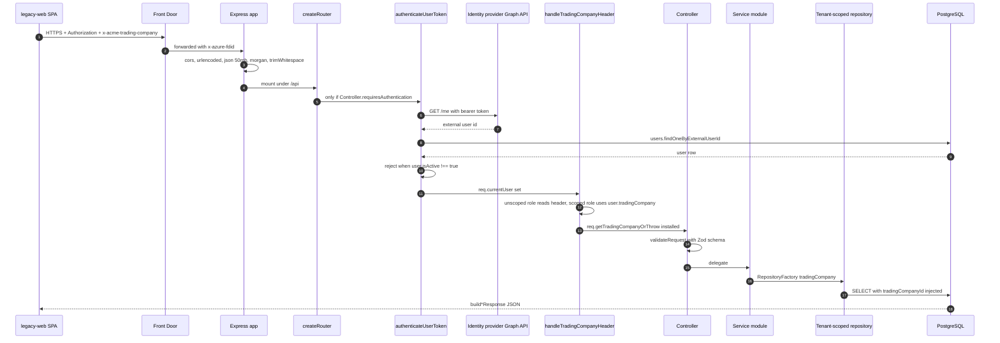

### What this shows

`routes.ts` is a map from a path prefix to a controller class, and `createRouter` walks that
map building one `express.Router` per controller. Middleware is attached per controller from
two static flags on the controller — `requiresAuthentication` and `requiresAdminRole` — not
per route. Authentication is delegated to the identity provider's Graph endpoint: the bearer
token is _not_ validated locally, it is spent on a `/me` call, and the returned external user
id is looked up in the local `user` table.

### Takeaways

1. **Auth costs a network round trip on every request.** Verifying the token by calling the
   IdP is simple and always correct, but it puts a third party on the hot path of every
   authenticated call and is the largest single contributor to legacy p95 latency.
2. **Local user row is the authorisation record.** A valid IdP token with no matching `user`
   row is a 401, and `isActive !== true` is a hard fail-closed check with a structured,
   greppable denial log. Deactivation in Acme is the access gate — the IdP token stays valid.
3. **Tenant selection is role-dependent.** `ADMIN` and `FINANCE` are _unscoped_ roles and
   choose their trading company via the `x-acme-trading-company` header; `TRADER` and `MD`
   are pinned to `user.tradingCompany` and the header is ignored. There are exactly 4 roles.
4. **Coarse-grained middleware.** Because the flags are per controller, "this one endpoint
   needs admin" is expressed by splitting a controller, not by decorating a route.
5. **Prefix quirk.** Controllers are mounted under `/api`, so `/v1/deals` is reachable at
   `/api/v1/deals` — and the internal controller registered at `/api/internal` is genuinely
   reachable at `/api/api/internal/...`. This is a real, load-bearing wart.

### Invariant encoded

> **No handler runs without both `req.currentUser` and a resolved tenant.** Any controller
> that sets `requiresAuthentication` gets both middlewares, in that order, and
> `getTradingCompanyOrThrow()` throws rather than returning a nullable. A controller that
> forgets the flag is unauthenticated — the failure mode is silent, which is why the flag
> lives on the class and is reviewed, not on each route.

---

## 3. Layering, and the namespace-service idiom

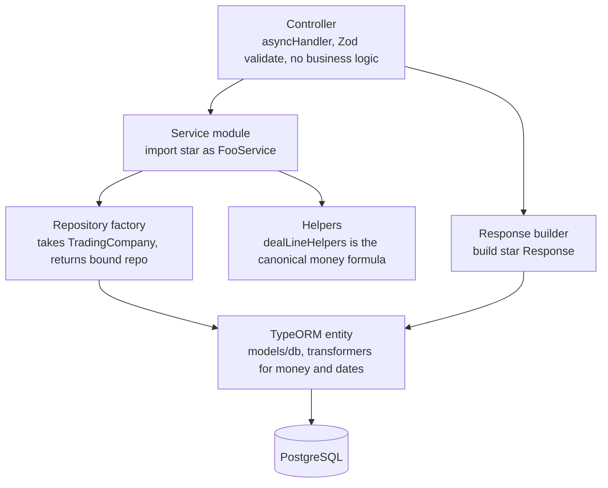

### What this shows

Four layers, one direction. Services are _modules_, not classes: `import * as InvoicesService`
gives a namespace of exported functions with no constructor and no injected collaborators.
Naming is conventional and consistent — `find*` / `get*` for reads, `create*` / `update*` /
`destroy*` for writes, `parse*` / `build*` / `map*` for pure transforms.

### Takeaways

1. **The namespace idiom is why testing hurts.** With no injection point, a unit test must
   mock the module registry (`AppDataSource` plus a repository-mock helper) rather than pass a
   double. This is the single most cited reason for the rebuild — it is a _testability_
   argument, not a performance one.
2. **It is also why the code is easy to read.** There is no indirection: a call to
   `InvoicesService.postInvoiceToErp` resolves to exactly one function in one file. New
   engineers navigate this codebase faster than they navigate the Platform one.
3. **Money has exactly one implementation.** The line-amount calculation lives in one helper
   module (`helpers/dealLineHelpers.ts`) and every caller goes through it — including the
   report paths that bypass the ORM, which regression tests assert explicitly. A money formula
   duplicated into hand-written SQL is a defect that reconciles to a different number than the
   UI, and only a test that reads the SQL will catch it.
4. **Numeric and temporal types are transformed at the ORM boundary.** `BigNumericTransformer`
   maps `numeric` to `big.js`; `DateTransformer` maps `date`/`timestamptz`. Nothing above the
   entity layer sees a float.
5. **Response shape is explicit.** `build*Response` mappers in `models/response/` mean the
   wire contract is a reviewable artefact rather than "whatever the entity serialises to".

---

## 4. Multi-tenancy: the scoped repository factory

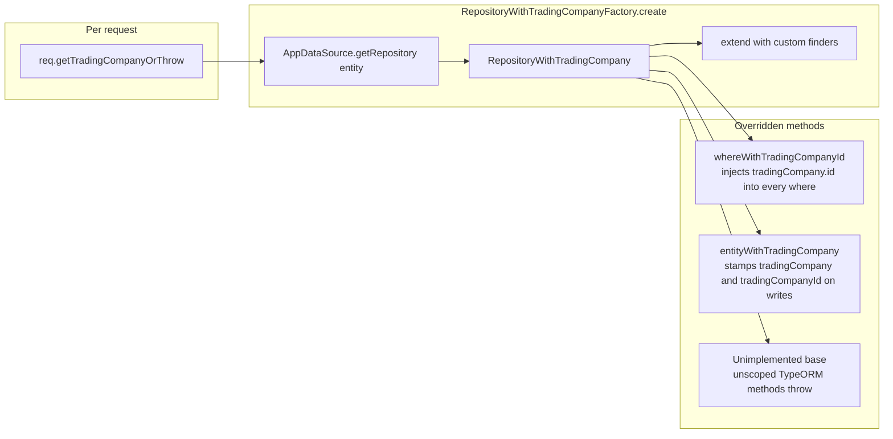

### What this shows

Tenancy is not a database feature here — there is no row-level security and no schema per
tenant. It is a _repository wrapper_. `RepositoryWithTradingCompanyFactory.create(entity,
tradingCompany, customs)` returns a TypeORM repository whose `find`, `findOne`, `create`,
`insert` and friends have been overridden to inject `tradingCompany: { id }` into every
`where` clause and to stamp both `tradingCompany` and `tradingCompanyId` onto every written
entity. The base class the wrapper extends is named
`RepositoryWithTradingCompanyUnimplementedMethods` — the unsafe, unscoped TypeORM surface
throws instead of leaking.

### Takeaways

1. **Isolation is opt-out-by-throwing, not opt-out-by-forgetting.** Calling an unscoped
   method is a runtime error, which is the strongest guarantee available without RLS.
2. **Raw SQL is outside the guard.** `UnifiedInvoicesRepository` and the reporting paths write
   query-builder / raw SQL; those must add the tenant predicate themselves. This is the known
   soft spot, and it is why the reporting repositories carry dedicated regression tests.
3. **`tradingCompanyId` is stamped explicitly on writes** in addition to the relation, because
   entity subscribers run before TypeORM has synced the relation object. That comment in the
   source is load-bearing.
4. **Unscoped roles cross tenants by design.** `ADMIN` and `FINANCE` legitimately switch
   trading companies mid-session via a header. Tenant isolation therefore protects data, not
   people — an authorised human can see every tenant.
5. **The tenant is an integer.** `trading_company.id` is a serial. Platform uses UUID tenant
   ids; any data bridge has to carry a mapping table, not a cast.

---

## 5. The domain model, briefly

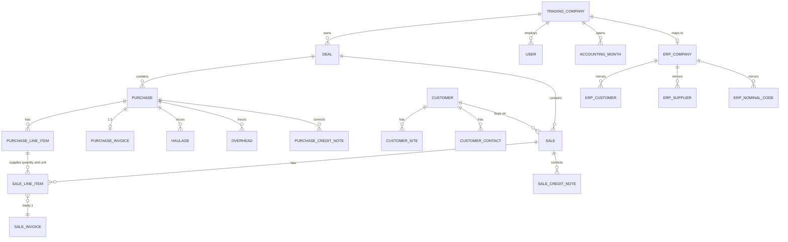

### What this shows

71 files under `models/db`, but the spine is short: a `Deal` aggregates `Purchase` and `Sale`; line
items carry the quantities; invoices attach on both sides with **different cardinalities**.

### Takeaways

1. **The two invoice relations have different cardinalities.** One side is a direct 1:1
   relation; the other has to be reached through the line items, with the intermediate relation
   eagerly loaded, and callers must test which shape they have before dereferencing. A
   deliberate asymmetry in an otherwise-symmetrical pair of relations is a reliable source of
   production bugs, because the code that handles one side reads as if it handles both.
2. **ERP mirror tables are first-class entities.** `erp_customer`, `erp_supplier`,
   `erp_nominal_code`, `erp_vat_code`, `erp_currency`, `erp_bank` are local read-model copies
   of ERP master data, scoped by `erp_company`, refreshed by sync. Their `reference` column is
   the join key back to the ERP — a fact that matters enormously for migration (see the
   companion document).
3. **`accounting_month` is the period boundary object.** Periods are rows that open and close,
   not a date truncation, so "which period does this belong to" is a lookup against explicit
   state rather than arithmetic on a timestamp. The assignment rule is therefore data, editable
   without a deploy, and a closed period is a row that exists rather than a date that has passed.
4. **The frozen figure on the deal is a deliberate denormalisation.** The derived value is
   computed once, at the moment the record is committed, and stored — so that later edits to its
   inputs cannot drift it away from the number another system has already consumed and acted on.
   Recomputation is an explicit, narrow event, not a side effect of touching an input.

---

## 6. Lifecycles worth knowing

Two state machines carry most of the behaviour. The first is the record lifecycle the trading
entities share, drawn with neutral state names — the topology is the transferable part:

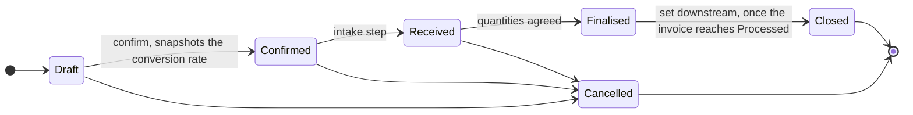

Three cancel edges, and no fourth: past `Finalised` a record can be corrected but not withdrawn.
`Closed` is the one state the owning module never sets itself — it arrives from the invoice machine
below, which is the only upstream edge into the trading tables.

The second is the invoice's, worth reproducing because of where it puts the asynchronous boundary:

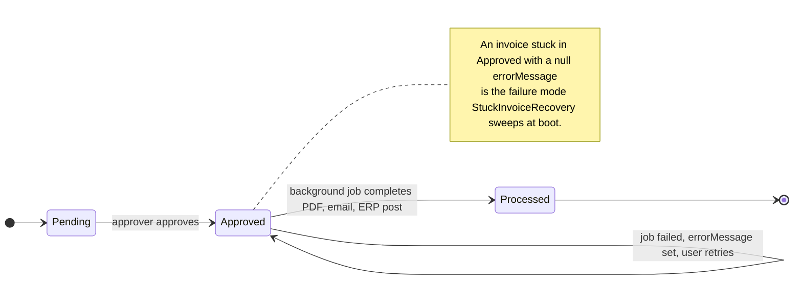

### Takeaways

1. **`Approved` is the async boundary.** Approval is synchronous and cheap; everything
   expensive happens in a queued job afterwards. The UI shows a spinner keyed on the invoice
   status. See ADR-0012 _Targeted status updates for invoice creation_.
2. **Failure is recorded on the entity, not only on the job.** `invoice.errorMessage` is the
   user-visible retry surface — the job queue itself is invisible to the business.
3. **Illegal transitions are made unrepresentable rather than validated.** The three cancel edges
   in the first diagram are a union type (`CancellableFromStatus`), not a runtime guard, so
   cancelling from `Finalised` fails to typecheck instead of throwing in production.

---

## 7. Background jobs

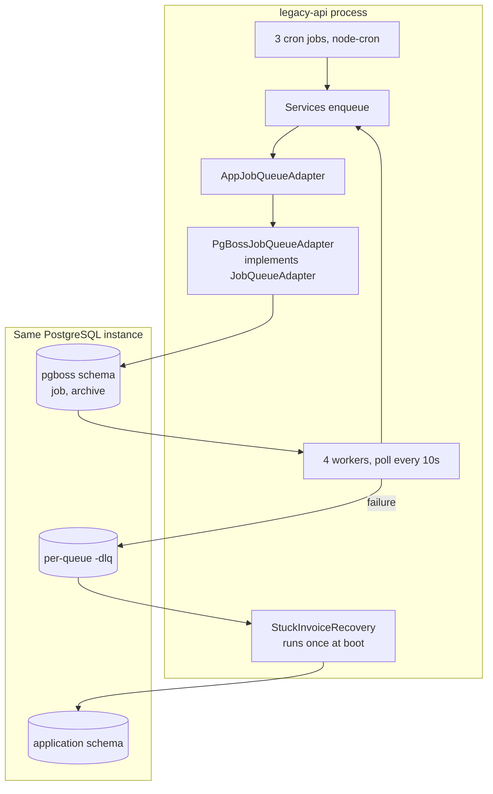

### What this shows

The queue is a table in the same database as the business data, driven by `pg-boss`. Four job
types are registered: `ProcessSaleInvoiceJob`, `ProcessPurchaseInvoiceJob`,
`SyncErpCustomersJob`, `SendConfirmationEmailJob` (the last one added by ADR-0007 _Async
confirmation email_). Workers poll every 10 seconds. The default enqueue option is
`retryLimit: 0` — **no automatic retries**.

### Takeaways

1. **No retries is a deliberate financial-safety choice.** A retried invoice post can create a
   duplicate invoice in the ERP. Recovery is human-triggered ("Retry" in the UI) after the
   error is shown, not automatic.
2. **The DLQ exists to write the error back to the business entity.** Each queue has a
   `-dlq` companion; the handler extracts the message from pg-boss's `output` field and stamps
   it on `invoice.errorMessage`, falling back to a 15-minute-timeout message.
3. **Boot-time sweep closes the crash window.** `recoverStuckInvoices()` runs once at startup
   and finds invoices left `Approved` with a null `errorMessage` — the state produced when the
   process died mid-job or was swapped out during a deploy.
4. **Same-database queueing is the right call at this scale.** It gives transactional enqueue
   semantics for free and removes a broker from the operational surface. The cost is telemetry
   noise — the poller generated roughly 186k dependency spans a day until an APM processor was
   added to drop `pgboss.job` queries.
5. **Three cron jobs, all wrapped so a thrown exception cannot kill the scheduler.** One
   refreshes an external system's access token on a short interval; the other two are periodic
   business housekeeping. The wrapper is the point: an unhandled rejection inside a scheduled
   callback takes down every _other_ schedule in the same process, and the failure is silent.

### Invariant encoded

> **A job never leaves a business entity in an unexplained state.** Every terminal path —
> success, caught error, DLQ, boot-time sweep — writes either a cleared or a populated
> `errorMessage`. The queue is an implementation detail; the entity is the contract.

---

## 8. Document generation and delivery

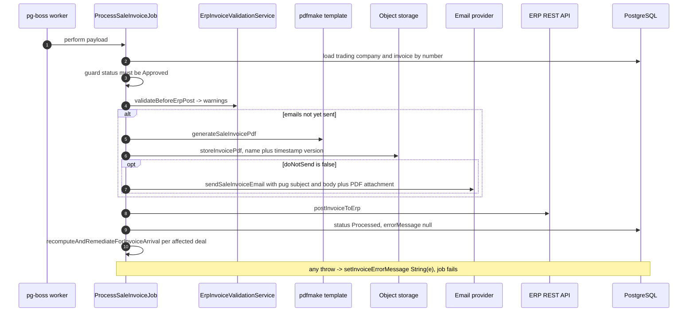

### What this shows

One job does document rendering, storage, delivery, ERP posting and downstream GP
reconciliation, in that order, guarded by an idempotency check on "have emails already been
sent".

### Takeaways

1. **PDFs are code, not templates.** `pdfmake` document definitions live in
   `templates/pdf/{saleInvoice,purchaseConfirmation,saleConfirmation,haulageConfirmation,overheadConfirmation}`
   with a shared `theme.ts` and an explicit font registry. There is no HTML-to-PDF step and no
   headless browser — which is why PDF generation is fast and has never been a scaling problem.
2. **Emails are pug pairs.** Every template is a `<name>Subject.pug` / `<name>Body.pug` couple
   rendered server-side and sent through the cloud email provider with the PDF as an
   attachment. In development the message is opened in a browser preview instead of sent.
3. **Blob names are versioned by timestamp.** `uploadFile` appends `-${Date.now()}` and
   `downloadFile` lists versions and picks the latest. Overwrite is impossible by construction;
   the audit trail is the version list.
4. **Asset resolution is dual-path.** Both the email templates and the trading-company logos
   are looked up first at the webpack-bundled location (`cwd/emailTemplates`, `cwd/assets`)
   and then at the source path. Startup validates every trading company's `logoFilename`
   resolves and logs a structured `LOGO_FILE_MISSING` error if not — added after an incident
   where invoices for one entity shipped without a logo.
5. **Ordering is not transactional.** PDF-store, email-send and ERP-post are three separate
   side effects with no compensation. The email-already-sent guard is the only idempotency
   control, and it protects the _customer-visible_ effect, which is the right one to protect.

---

## 9. ERP integration

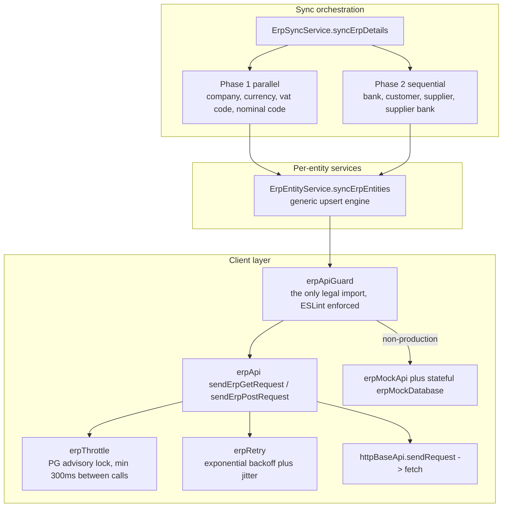

### What this shows

A five-layer client stack whose entry point is deliberately narrowed: `erpApiGuard.ts` is the
only module the rest of the codebase may import, enforced by an ESLint rule that bans direct
`erpApi.ts` imports. The guard handles environment filtering (non-production is pinned to a
demo company), retry, logging, and mock selection.

### Takeaways

1. **Rate limiting is distributed via a PostgreSQL advisory lock**, not an in-process token
   bucket — so it holds across App Service instances and slots. Minimum 300 ms between calls.
2. **POST and GET have different retry policies, on purpose.** GET retries on 429 and 5xx and
   network errors; POST retries on **429 only**. A retried POST can mint a duplicate invoice in
   the customer's accounts. This asymmetry is the most important line of defence in the whole
   integration and was carried forward verbatim into the Platform design (ADR-0024 _ERP
   integration strategy_).
3. **Sync has a hard dependency order.** Currencies, VAT codes and nominal codes must exist
   before customers and suppliers can reference them. Phase 1 runs in parallel, Phase 2 runs
   sequentially after it.
4. **Mock mode is a first-class environment, and it is fail-fast.** `USE_ERP_MOCK=true` in a
   production environment causes `process.exit(1)` at boot; production additionally _requires_
   `ERP_POSTING_ENABLED` to be set explicitly, with no default. The startup banner prints the
   whole resolved configuration.
5. **The known weakness is the bottom of the stack.** `httpBaseApi.sendRequest` calls `fetch`
   with **no timeout and no AbortController** — an in-repo deep-dive attributes the recurring
   sync hangs to exactly this, compounded by `$top=5000` page sizes. This is documented, not
   fixed, because the ERP path is being replaced rather than rebuilt.

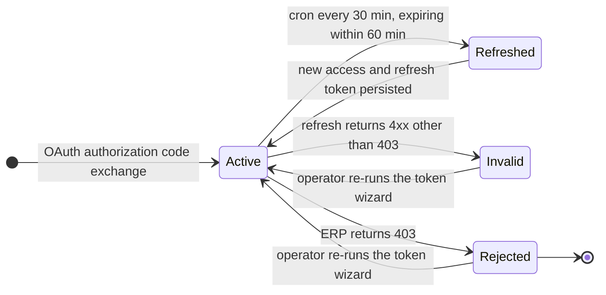

### Takeaways

1. **Tokens are ~8 hours and refresh is proactive**, guarded by a PostgreSQL advisory lock so
   concurrent instances cannot both spend the refresh token.
2. **`Rejected` is a dead refresh family, not a transient error.** Recovery is an operator
   task — an interactive re-authorisation — and the state is persisted in the `erp_token`
   table. Diagnosing from APM traces instead of that table has wasted real incident time.
3. **Token telemetry bypasses sampling.** Because production APM sampling is 25 %, an explicit
   telemetry processor forces `ERP_TOKEN*` and commission-webhook events to 100 %. Rare,
   critical events must not be sampled away.

---

## 10. Deployment and runtime

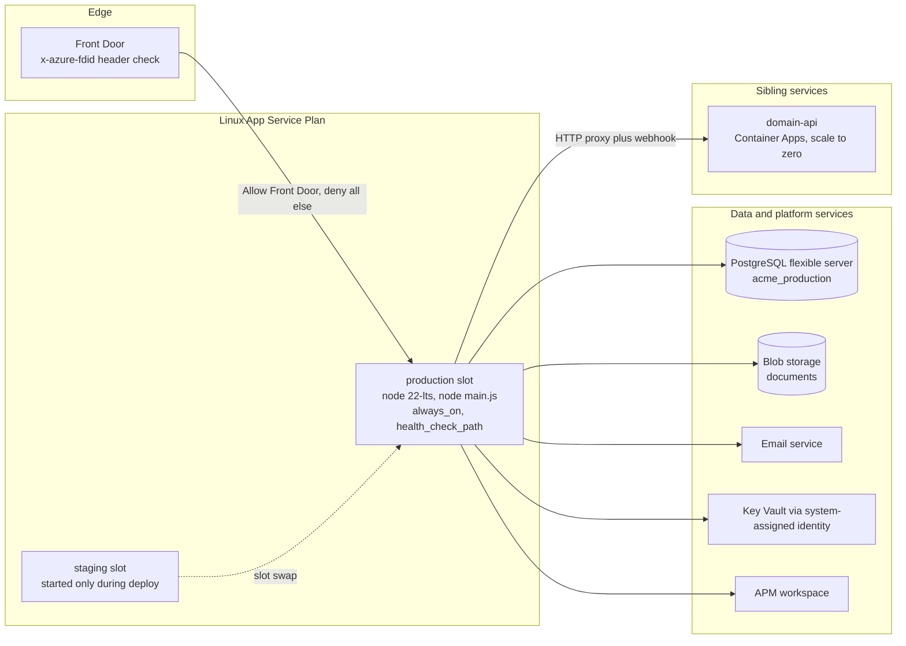

### What this shows

`legacy-api` is **not** containerised. It is a webpack bundle (`main.js` plus externalised npm
dependencies, with workspace libraries bundled in) deployed to an Azure Linux Web App running
the Node 22 LTS stack with `app_command_line = "node main.js"`. Its containerised sibling
`domain-api` runs on Container Apps with scale-to-zero; the two are different hosting models
in the same environment.

### Takeaways

1. **Zero-downtime is a slot swap, not a rollout.** The deploy workflow starts the staging
   slot, deploys, health-checks `/api/v1/up/ready`, runs a smoke test, swaps, re-verifies
   through Front Door, and auto-rolls-back by swapping again on failure. The staging slot is
   stopped afterwards to avoid paying for it.
2. **Sticky settings are the safety mechanism.** `DB_MIGRATIONS_RUN_ENABLED` and
   `ERP_POSTING_ENABLED` are pinned to the slot, so the staging slot can never run production
   migrations or post real invoices, and APM connection strings stay per-slot.
3. **The app is Front-Door-only.** `ip_restriction_default_action = "Deny"` with a single allow
   rule matching the Front Door id header. Anything that needs to call the internal reconcile
   endpoint must go through Front Door.
4. **Managed identity for secrets, VNet integration for egress.** System-assigned identity
   reads Key Vault; `vnet_route_all_enabled` puts outbound traffic on the subnet.
5. **Startup is a validation gauntlet.** Environment banner → consistency checks
   (`NODE_ENV` vs `ENVIRONMENT_NAME` mismatch warning) → ERP environment validation (fatal on
   mock-in-production or missing credentials) → logo file validation → cron start → queue start
   → listen. Several of these checks exist because a specific incident happened.

---

## 11. Observability

`bootstrap.ts` must be the first import in `server.ts`, before anything else loads. It
configures the APM SDK to **complement** the platform's auto-instrumentation agent rather than
duplicate it: HTTP requests, dependencies and console are left to the agent, while the SDK
adds exception capture, W3C trace-context correlation, live metrics, disk-retry caching, and —
critically — sampling that the agent cannot express.

- Sampling is environment-derived: 25 % production, 50 % staging, 100 % development.
- One telemetry processor **drops** noise: `pgboss.job` polling queries and empty keepalive
  database dependencies.
- A second telemetry processor **forces `sampleRate = 100`** for messages or exceptions
  carrying `COMMISSION_*`, `DEAL_PROFITABILITY`, `ERP_TOKEN*`, or the
  `COMMISSION_WEBHOOK_FAILURE` / `ERP_TOKEN_RECOVERY` categories.

The pattern generalises: _sample the volume, never the alerts_. Structured single-line JSON
logs with a `category` field are the second half of it — every alertable condition in this
codebase is a greppable category string.

---

## 12. Honest assessment

**What it does well**

- **Correctness where it counts.** The money formula has one home and regression tests that
  assert every SQL path joins the conversion table. GP is frozen at lock so it cannot drift.
  POST is not retried. These are mature financial-system instincts.
- **Operational legibility.** Four roles, one tenant header, one queue table, one database.
  An engineer can hold the whole runtime in their head, which is worth more than it sounds at
  3 a.m.
- **Fail-fast configuration.** The process refuses to boot in several specific
  misconfigurations rather than running wrongly. Each of those checks is a scar.
- **Cheap, predictable hosting.** One always-on App Service with a swap slot; no cluster, no
  service mesh, no GitOps controller to be broken.

**Where it hurts**

- **No injection seam** → mocking the module registry, slow and brittle unit tests, integration
  tests disabled in CI.
- **Auth on the hot path** → an IdP round trip per request.
- **No timeout in the HTTP base client** → the recurring ERP sync hang has a known root cause
  and no fix in this codebase.
- **Tenant safety is repository-shaped** → raw-SQL reporting paths sit outside the guard.
- **Coarse middleware flags** → authorisation granularity is per controller, not per route.

None of these are reasons to rewrite on their own. Together with a product requirement for
true multi-tenancy on UUID tenants, per-context deployability, and an auditable event trail,
they are. That argument, and the sequence for acting on it, is the companion document.

---

## Related decisions

| ADR      | Title                                               | Relevance here                            |
| -------- | --------------------------------------------------- | ----------------------------------------- |
| ADR-0007 | Async confirmation email                            | 4th job type, queue-based delivery        |
| ADR-0008 | Lockable deals default config                       | Deal lifecycle eligibility                |
| ADR-0009 | Invoice net amount formula — single source of truth | One canonical money calculation           |
| ADR-0011 | Commission webhook consistency model                | Fail-open webhook to `domain-api`         |
| ADR-0012 | Targeted status updates for invoice creation        | `Approved` as the async boundary          |
| ADR-0024 | ERP integration strategy                            | What Platform reuses from this ERP client |
| ADR-0046 | Commission sync remediation envelope                | Reconcile cron and stop-loss caps         |

Companion document: [`02-strangler-migration.md`](./02-strangler-migration.md).
