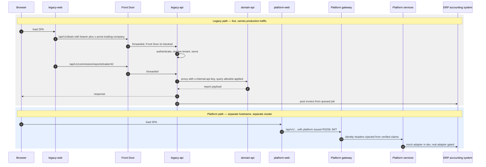
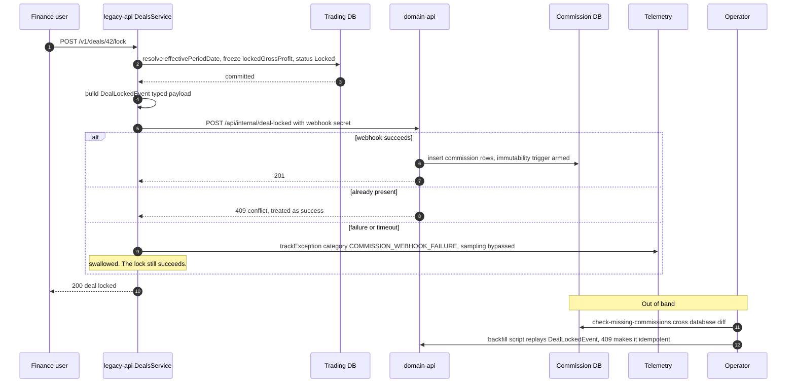
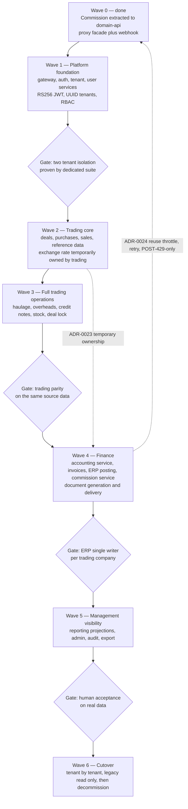
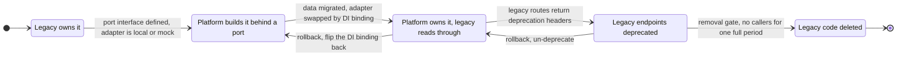
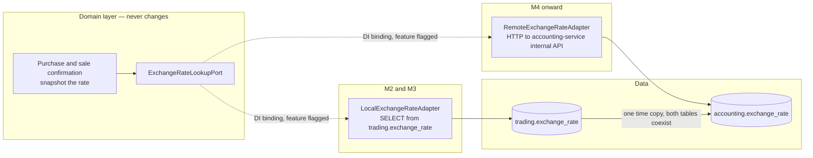
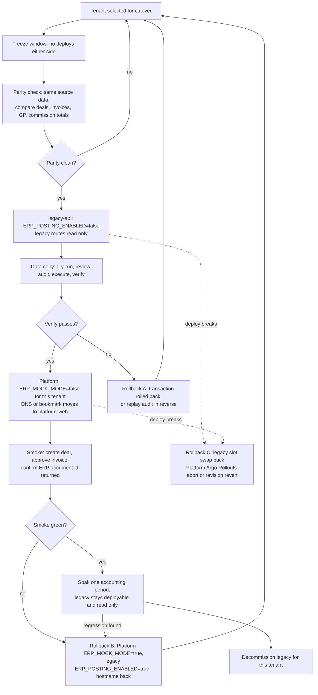

# Strangler-Fig Migration — Legacy to Acme Platform

What this covers: how the legacy Express stack (`legacy-api`, `legacy-web`, `domain-api`) is
being replaced by the Acme Platform microservices without a big-bang cutover. It covers what
coexistence looks like **today** (verified from source, not from plan documents), the one
capability cut that has already been executed, the ordering of the remaining waves, the
mechanisms used to move ownership of a capability and its data, and the cutover and rollback
paths on both sides of the wall. Sources: `apps/legacy-api/**`, `apps/domain-api/**`,
`apps/platform/**`, `.eslintrc.base.json`, `.github/workflows/*`, and ADRs 0011, 0023, 0024,
0044, 0045.

**One correction up front.** A 10-part design series in the repository describes a _hybrid
single-process server_ — Express and NestJS in one binary, with per-module feature flags
(`USE_NESTJS_USERS`, `USE_NESTJS_SALES`, …) routing each URL prefix to one or the other. That
design was **not** built. No such flag exists in the source, and no hybrid router exists.
The rebuild that is actually happening is a _separate deployable platform_ on a separate
cluster, with a hard build-time wall between the two codebases. Everything below describes the
real thing; the hybrid plan is noted only so nobody implements it from a stale document.

---

## 1. Where the boundary actually is

```
Nx monorepo — one repo, two systems, one enforced wall

apps/
├── legacy-api/          tag scope:backend    ─┐
├── legacy-web/          tag scope:frontend    │  legacy stack
├── domain-api/          tag scope:commission ─┘
│
├── platform/            tag scope:platform      ─┐
│   ├── gateway/                               │
│   ├── auth-service/                          │  Acme Platform
│   ├── tenant-service/                        │
│   ├── trading-service/                       │
│   ├── accounting-service/                    │
│   ├── commission-service/                    │
│   └── …                                      │
└── platform-web/        tag scope:platform      ─┘

libs/
├── shared/              tag scope:shared          ← legacy-only shared kernel
└── platform/            tag scope:platform-shared    ← platform-only shared kernel

.eslintrc.base.json — @nx/enforce-module-boundaries
  scope:backend       -> [scope:backend, scope:shared]
  scope:frontend      -> [scope:frontend, scope:shared]
  scope:commission    -> [scope:commission, scope:shared]
  scope:platform         -> [scope:platform, scope:platform-shared]      ← cannot see scope:shared
  scope:platform-shared  -> [scope:platform-shared]

CI:  ci.yml + deploy.yml          (legacy: App Service, slot swap)
     platform-pipeline.yml + platform-deploy.yml  (platform: AKS, ArgoCD, Argo Rollouts)
```

The two systems share a git repository, a package manager and a CI runner pool. They share
**nothing else at build time**. `scope:platform` is deliberately excluded from `scope:shared`, so
the Platform cannot even import the legacy shared-constants or domain-types libraries — a
type must be re-declared on the Platform side rather than borrowed. That looks wasteful and
is not: it is what stops the rebuild from inheriting the legacy model by accident.

### Takeaways

1. **The wall is a lint rule, and lint runs in both pipelines.** Violations fail the build, so
   the boundary cannot erode gradually.
2. **Separate pipelines mean separate blast radii.** A red Platform pipeline cannot block a
   legacy hotfix, which matters because legacy is the system currently earning money.
3. **The shared kernels are duplicated on purpose.** Re-declaration is the anti-corruption
   layer; the alternative is a shared library that pins the new model to the old one.
4. **Nothing about the wall prevents _runtime_ coupling** — see §2, which is where the real
   coexistence risk lives.

---

## 2. Coexistence today — what actually routes where



### What this shows

There is **no shared edge router** and **no traffic splitter** between the two systems today.
They are two front doors on two hostnames. A user is in one system or the other, decided by
which URL they opened — not by a flag, a header, or a percentage.

### Takeaways

1. **The only in-process bridge that exists is legacy → `domain-api`.**
   `CommissionProxyController` in `legacy-api` mounts at `/v1/commission` and forwards a fixed
   set of routes to the commission service, authenticating with an internal API key.
2. **That proxy is allowlist-based, and the allowlist is a real coupling.** Query parameters
   and export formats are validated against per-endpoint allowlists before forwarding; a new
   capability in `domain-api` that is not added to the proxy's allowlist is rejected with a
   400 by the proxy, not by the service. Export formats are at least imported from the shared
   constants library rather than hardcoded, which removes one class of drift.
3. **Route ordering is load-bearing in the proxy.** Literal routes (`/traders`, `/companies`)
   must be registered before parameterised ones (`/:dealId`, `/:id`) or Express captures them
   as parameters. This is a documented footgun with a comment in the source.
4. **Some `/v1/commission/*` routes are _not_ proxied.** Deal-profitability endpoints are
   served locally by `legacy-api` because they read the trading database directly. The prefix
   is shared; the ownership is not. Anyone reasoning about "commission is extracted" needs
   this caveat.
5. **Both systems can reach the same ERP tenant.** That is the single most dangerous property
   of the current topology, and §6 states the invariant that contains it.

### Invariant encoded

> **A capability is served by exactly one system at a time, and the choice is made at the
> hostname, not at request time.** There is no dual-run, no shadow traffic and no percentage
> split in the current topology. Any claim of "canary between legacy and Platform" is
> aspiration, not implementation.

---

## 3. The one cut that has already been made

Commission was extracted from `legacy-api` into `domain-api` before the Platform rebuild
started. It is the working template for every subsequent cut, and it is worth studying
precisely because it was done under production pressure and shows both the pattern and its
costs.



### What this shows

A synchronous, fire-and-forget HTTP webhook across a bounded-context boundary, made survivable
by three things: a typed payload interface that is the single source of truth for the contract,
a 409-on-duplicate receiver that makes replay idempotent, and an out-of-band reconciliation +
backfill pair.

### Takeaways

1. **Fail-open was the right call and it has a named cost.** The deal lock must never fail
   because a downstream service is down — but a lock _can_ therefore exist with no commission
   rows. ADR-0011 _Commission webhook consistency model_ accepts this explicitly and names the
   detection and recovery mechanisms rather than pretending the gap is closed.
2. **At-most-once delivery plus idempotent replay ≈ at-least-once, run by a human.** There is
   no retry queue. The reconciliation script is the retry, and it needs an operator and
   simultaneous access to two production databases.
3. **The contract lives in code, in one place.** `DealLockedEvent` is a TypeScript interface;
   both the live webhook and the backfill script must produce payloads conforming to it. That
   the payload is constructed in two places is listed as a known negative in the ADR.
4. **Immutability downstream forces correctness upstream.** A database trigger blocks
   modification of commission rows, so a wrong payload cannot be patched — it must be deleted
   and recreated. That is what pushed the freeze-on-commit work (`lockedGrossProfit`) upstream
   into the trading system: if the receiver cannot be corrected in place, the sender must be
   right the first time.
5. **A second webhook was needed later**, to tell the downstream system that a value it had
   already consumed had changed. Its response is versioned and carries an explicit `outcome`
   rather than a bare 200 — `applied`, or one of several named `skipped_*` reasons for the
   cases where the receiver legitimately declines to act. **Skip outcomes must be in the
   contract from day one.** Retrofitting them was the expensive part: a caller that only
   understands success and failure has nowhere to put "understood, and correctly did nothing",
   so every such case first arrives as a false alarm.

### Invariant encoded

> **Cross-context writes are idempotent by key, and every failure is both alertable and
> replayable.** The receiver returns 409 for a duplicate; the failure is logged with a
> sampling-bypassed category; a script can reconstruct and replay the event. Any future cut
> that cannot satisfy all three does not ship.

---

## 4. Migration waves



### What this shows

The ordering is **dependency-driven, not value-driven**. Identity and tenancy first because
nothing else can be tenant-scoped without them; trading before finance because invoices
reference deals; reporting last because projections need a stable write model.

### Takeaways

1. **Wave 0 happened before the rebuild and shaped it.** The commission cut proved the
   webhook-plus-reconcile pattern, and forced the upstream freeze-the-derived-value rule that
   Platform inherited.
2. **Wave 2 deliberately takes on a known-wrong ownership.** Exchange rates belong to
   Accounting, which does not exist until Wave 4 — so trading-service owns them temporarily
   behind a port. See §5.
3. **The gates are the interesting part, not the waves.** Each gate is a machine-checkable
   condition, except the last, which is a human acceptance on real data — the one thing no
   assertion can stand in for. A wave that cannot state its gate is not ready to start.
4. **Finance is the highest-risk wave because it is where two systems could both write to the
   ERP.** The gate before it is a single-writer proof, not a test-coverage number.
5. **Cutover is per tenant, not per capability.** By Wave 6 the capability set is complete, so
   the remaining variable is which trading company is live on which system.

---

## 5. How a capability changes hands



The canonical worked example is ADR-0023 _ExchangeRate temporary ownership_, which is the
whole pattern in one page:



### Takeaways

1. **The port is the stable artefact; the adapter is the disposable one.** No consumer changes
   when ownership moves — only a dependency-injection binding does. That is what makes the
   rollback one config flip rather than a revert.
2. **Both tables coexist through the migration window.** Data is copied, not moved. The old
   table is dropped only after the new owner has been stable for a full accounting period.
3. **Deprecation is a state, not an event.** Legacy endpoints stay reachable and start
   returning deprecation headers with a sunset date; removal is gated on observed zero callers.
4. **Temporary ownership must be written down at the time it is taken.** ADR-0023 records
   _when_ the swap happens and _what the rollback is_, on the day the wrong-but-necessary
   ownership was accepted. Undocumented temporary ownership becomes permanent.
5. **The pattern applies to the ERP too.** ADR-0024 defines `IErpAdapter` with a mock and a
   real implementation; the real one is gated behind `ERP_MOCK_MODE`, which throws at startup
   if set to `false` before the adapter is finished. Fail-fast on an unfinished adapter is
   better than a silent fallback.

---

## 6. Data and ERP-ownership transitions

Three distinct data problems, three different mechanisms — all verified in source.

**a. Model translation (legacy integer tenants → Platform UUID tenants).** Nothing casts.
Every migrated record needs an explicit mapping, and the legacy `trading_company.id` is a
serial while the Platform `tenant_id` is a UUID. Per-bounded-context PostgreSQL schemas
(ADR-0013) mean the Platform target is `trading.*`, `accounting.*`, `commission.*` rather than
one flat namespace.

**b. Master-data movement.** The repository contains a fully-worked example of copying a
tenant's reference data into another tenant (ADR-0045 _Cross-tenant master-data copy_). Its
shape is the reusable part:

| Property               | Mechanism                                                                                                              |
| ---------------------- | ---------------------------------------------------------------------------------------------------------------------- |
| Strictly additive      | No source row mutated, no existing target row overwritten or deleted                                                   |
| Skip-on-match          | Case-insensitive normalised name match; collisions are skipped **and remapped**, not duplicated                        |
| Atomic                 | Whole copy in one transaction; mid-flight error rolls everything back                                                  |
| Idempotent             | Re-running after success produces zero inserts and zero collisions                                                     |
| Reversible             | ID-mapping audit persisted to a `tenant_copy_audit` table **and** a JSON snapshot on disk                              |
| Three modes            | `dry-run` (simulate, same audit output), `execute`, `verify` (re-read audit and assert)                                |
| Domain-rule-preserving | Driven by the existing repository factories, not raw SQL — so unique constraints, cascades and entity invariants apply |

The last row is the one people get wrong. A raw-SQL copy re-implements the invariants; a
repository-driven copy inherits them.

**c. ERP reference-code parity.** The join key between a migrated business record and its ERP
counterpart is the external system's own `reference` string, not any internal id — so seeding a
new ERP company means getting that string right, in bulk, through a client that is **read-only**
for master data. The route chosen (ADR-0044) was to generate import files preserving `reference`
verbatim and load them through the ERP's own tooling, rather than build a write path the
integration otherwise had no reason to have. Engineering kept control of the join key; the
one-off did not become a permanent API surface.

### Invariant encoded

> **Exactly one system may POST invoices to a given trading company's ERP company at any
> moment.** Both `legacy-api` and the Platform accounting service can technically reach the
> same ERP tenant, both hold OAuth credentials, and neither knows about the other. The control
> is configuration, not code: `ERP_POSTING_ENABLED` on the legacy side (required explicitly in
> production, no default, sticky to the deployment slot) and `ERP_MOCK_MODE` on the Platform
> side. Cutting a trading company over means flipping both, in that order, in one window —
> legacy off _before_ Platform on. Never the reverse, and never overlapping.

---

## 7. Cutover and rollback



### What this shows

Three independent rollback mechanisms at three different layers, each with its own trigger and
its own blast radius.

### Takeaways

1. **Rollback A is free because the copy is transactional.** Failure during `execute` rolls the
   whole copy back; failure discovered later replays the ID-mapping audit in reverse. This is
   only true because the audit is persisted in two places (table plus on-disk snapshot).
2. **Rollback B is a configuration flip, not a deploy.** Both sides' ERP writers are gated by
   environment settings, so reversing the writer takes seconds. The hostname move is the only
   user-visible part.
3. **Rollback C is per-system and already exists.** Legacy: swap the deployment slot back —
   the deploy workflow does this automatically when the post-swap health check through Front
   Door fails. Platform: abort the Argo Rollouts canary or revert the ArgoCD revision (ADR-0032
   _Single-branch GitOps AppOfApps_, ADR-0034 _Argo Rollouts SLO analysis_). Neither system's
   rollback touches the other.
4. **Legacy stays deployable through the whole soak.** "Read-only" means the external writer is
   off, not that the process is stopped. Deleting the old deployment before a full business
   cycle has closed removes the only fallback at exactly the moment the cycle's end reveals
   discrepancies.
5. **The soak is one full business cycle, not one calendar week.** The failure modes that matter
   are the ones that only manifest at a cycle boundary, and a soak shorter than the cycle cannot
   observe a single one of them. Pick the soak length from the domain's own period, not from
   the sprint calendar.

### Invariant encoded

> **Every step in the cutover has a stated reversal, and the reversal is exercised before the
> step is taken.** A dry-run that has not been reviewed is not a dry-run; a rollback path that
> has never been executed in a lower environment is a hypothesis.

---

## 8. What is verified, and what is not

Honesty about the state of this migration matters more than a tidy diagram.

| Claim                                                                     | Status                                                                                               |
| ------------------------------------------------------------------------- | ---------------------------------------------------------------------------------------------------- |
| Build-time wall between legacy and Platform scopes                        | **Verified** — `@nx/enforce-module-boundaries` constraints in `.eslintrc.base.json`                  |
| Separate CI and deploy pipelines                                          | **Verified** — `ci.yml`/`deploy.yml` vs `platform-pipeline.yml`/`platform-deploy.yml`                      |
| Commission extracted behind a proxy façade plus webhook                   | **Verified** — proxy controller, internal API key, `DealLockedEvent`, 409 idempotency                |
| Reconciliation and backfill scripts exist                                 | **Verified** — referenced from ADR-0011 and the service documentation                                |
| Port/adapter ownership swap for exchange rates                            | **Verified as a decision** (ADR-0023); the M4 adapter swap itself is not yet executed                |
| Repository-driven, audited, three-mode data copy                          | **Verified** — ADR-0045, with a `tenant_copy_audit` entity present in the legacy model               |
| ERP adapter reuse plan (throttle, retry, POST-429-only, token encryption) | **Verified as a decision** (ADR-0024, status _Proposed_); the real Platform adapter is not complete  |
| Hybrid single-process Express + NestJS server with `USE_NESTJS_*` flags   | **Not implemented.** Planning artefact only — see the note at the top                                |
| Traffic splitting or canarying between legacy and Platform                | **Not implemented.** No shared edge router exists; the split is by hostname                          |
| Per-tenant cutover having been performed                                  | **Not performed.** §7 describes the designed path, assembled from mechanisms that exist individually |
| A dated cutover schedule                                                  | **Not present in source.** Wave ordering is dependency-derived; dates are not committed              |

The most important row is the last-but-two. §7 is a _design_ built from parts that are each
real — the slot-swap rollback runs on every legacy deploy, the Argo Rollouts abort runs on
every Platform deploy, the three-mode copy script has been executed once — but the end-to-end
sequence has not been run. Treat it as a plan to be rehearsed in a lower environment, not as a
runbook that has been proven.

---

## Related decisions

| ADR      | Title                                                       | Relevance                                     |
| -------- | ----------------------------------------------------------- | --------------------------------------------- |
| ADR-0011 | Commission webhook consistency model                        | The executed cut; fail-open plus reconcile    |
| ADR-0013 | Per-bounded-context PostgreSQL schema isolation             | Target shape for migrated data                |
| ADR-0014 | Microservices, separate binaries day one                    | Why this is not a hybrid in-process migration |
| ADR-0018 | Transactional outbox for domain events                      | What replaces the fire-and-forget webhook     |
| ADR-0023 | ExchangeRate temporary ownership                            | The ownership-transfer pattern, worked        |
| ADR-0024 | ERP integration strategy                                    | What is reused from the legacy ERP client     |
| ADR-0032 | Single-branch GitOps AppOfApps                              | Platform-side rollback mechanism              |
| ADR-0034 | Argo Rollouts SLO analysis                                  | Platform-side automated canary abort          |
| ADR-0044 | ERP CSV import for tenant onboarding                        | Reference-code parity as the join key         |
| ADR-0045 | Cross-tenant master-data copy via idempotent audited script | The data-movement mechanism                   |
| ADR-0046 | Commission GP sync remediation envelope                     | Stop-loss caps on automated reconciliation    |

Companion document: [`01-legacy-architecture.md`](./01-legacy-architecture.md).
