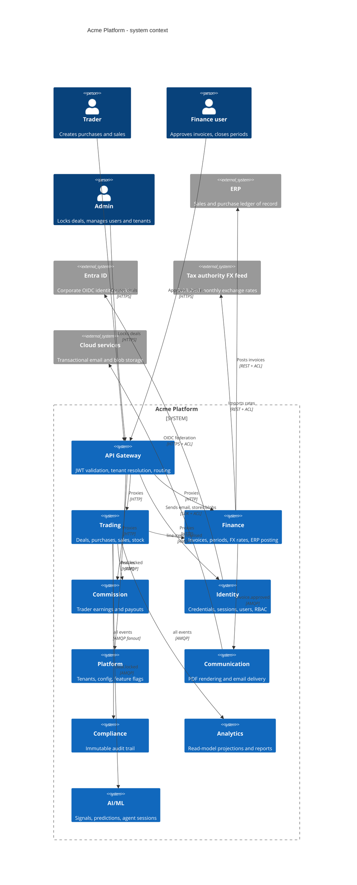
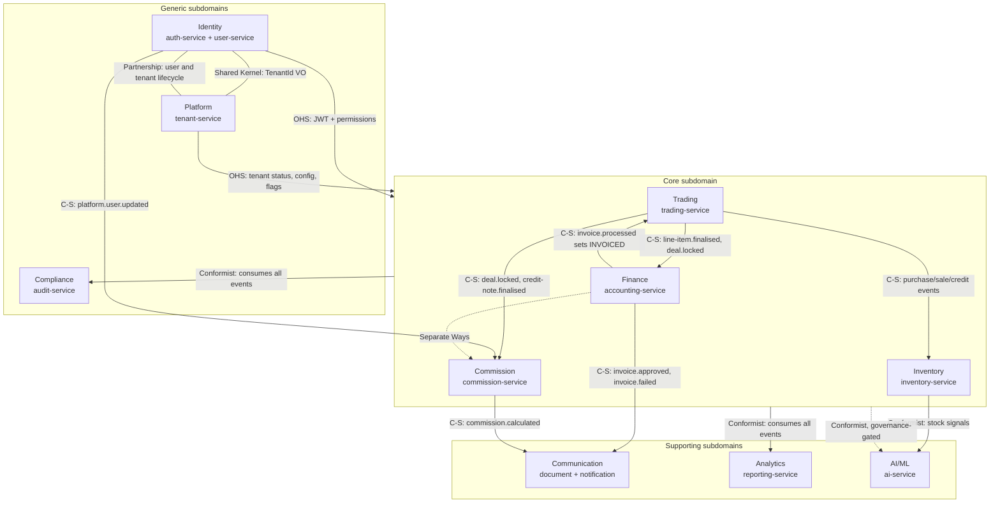
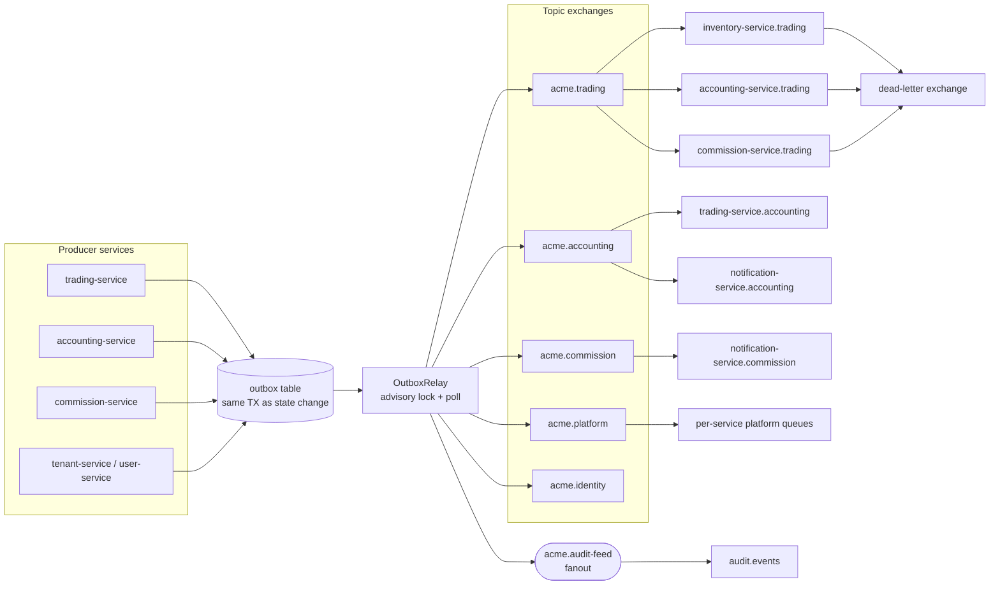
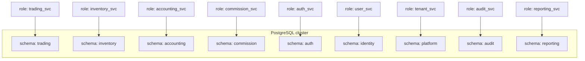

# Bounded Contexts — Acme Platform

This document is the strategic DDD map of the Acme Platform: the nine bounded contexts, the
thirteen services that realise them, the integration pattern on every context boundary
(Open Host Service, Shared Kernel, Partnership, Customer–Supplier, Conformist, Separate Ways,
Anti-Corruption Layer), and the messaging topology that carries those relationships at runtime.
Everything here is derived from the context map, the bounded-context canvases and the service
source under `apps/platform/**`. Where the written architecture and the shipped code disagree,
that is called out rather than smoothed over — see [Unreconciled](#unreconciled-and-unverified).

---

## 1. The nine contexts

| Bounded context   | Subdomain  | Service(s)                             | DB schema(s)              | Port(s)    |
| ----------------- | ---------- | -------------------------------------- | ------------------------- | ---------- |
| **Trading**       | Core       | trading-service, inventory-service     | `trading`, `inventory`    | 3005, 3006 |
| **Finance**       | Core       | accounting-service                     | `accounting`              | 3010       |
| **Commission**    | Core       | commission-service                     | `commission`              | 3012       |
| **Identity**      | Generic    | auth-service, user-service             | `auth`, `identity`        | 3001, 3003 |
| **Platform**      | Generic    | tenant-service                         | `platform`                | 3002       |
| **Communication** | Supporting | notification-service, document-service | `notification`,`document` | 3020, 3021 |
| **Compliance**    | Generic    | audit-service                          | `audit`                   | 3022       |
| **Analytics**     | Supporting | reporting-service                      | `reporting`               | 3023       |
| **AI/ML**         | Supporting | ai-service                             | `ai`                      | 3024       |

Ports verified against `charts/values/<service>.yaml`. The **gateway** (port 3000) is deliberately
absent from this table: it is infrastructure, not a bounded context. It owns no domain concept —
it validates JWTs, resolves the tenant, rate-limits, breaks circuits, and proxies by path prefix.

Two contexts are realised by _two_ services each. That is a deployment decision, not a modelling
one: Trading and Inventory share a ubiquitous language and a lifecycle (stock only exists because
a purchase was receipted), and Document and Notification are two halves of one "get a rendered
artefact to a human" story. Per-BC schema isolation (**ADR-0013: Per-BC PostgreSQL Schema
Isolation**) means no cross-schema foreign key exists anywhere in the platform; every cross-context
reference is a bare UUID column.

---

## 2. System context



**What it shows.** Every human enters through one gateway; every context-to-context edge inside the
boundary is asynchronous (AMQP); every edge that leaves the boundary passes through an
Anti-Corruption Layer.

Takeaways:

1. There is **no synchronous fan-out between domain contexts** on the write path. A deal lock does
   not call commission-service; it commits an outbox row.
2. The gateway is the only component that terminates user auth. Downstream services trust
   gateway-injected identity headers (`x-tenant-id`, `x-user-id`, `x-user-roles`, `x-permissions`).
3. Four external systems, four ACLs. None of their vocabulary leaks into a domain model.
4. Compliance receives _everything_ — it is wired to a fanout exchange, not to per-BC bindings
   (**ADR-0026: Audit Feed Fan-Out Exchange**).

**Invariant encoded:** a bounded context may be changed without coordinating a release with any
other context, because the only coupling is a versioned event contract plus a UUID.

---

## 3. Relationship patterns



**What it shows.** Which pattern governs each boundary, and therefore who is allowed to break whom.

Takeaways:

1. **Open Host Service** appears exactly twice — Identity and Platform. Both publish a stable,
   documented contract that everyone consumes and nobody negotiates with. Adding a context costs
   these two nothing.
2. **Customer–Supplier** is the pattern for every _financial_ edge. The downstream context (Finance,
   Commission, Inventory) gets a say in the payload: `trading.line-item.finalised` carries a full
   line snapshot precisely because Finance asked for it (**ADR-0063: Invoice Generation from
   Event-Carried Trading Line-Item Snapshot**), and `trading.deal.locked` carries a full financial
   breakdown with trader assignments because Commission asked for it.
3. **Conformist** governs Compliance, Analytics and AI/ML. They consume whatever upstream emits and
   have no negotiating position — the fanout binding means upstream does not even know they exist.
   _(The written context map labels these edges "Published Language". Published Language describes
   the shared `DomainEvent<T>` envelope; the downstream posture on these three edges is Conformist.
   Both descriptions are correct at different levels.)_
4. **Separate Ways** between Finance and Commission is a deliberate non-relationship. Both consume
   `trading.deal.locked` independently, both maintain their own notion of a closed month
   (`accounting_month` vs `closed_commission_month`), and neither reads the other. This is why
   invoicing can be behind on a month that commission has already closed.
5. There is exactly one **upstream edge back into the core**: `accounting.invoice.processed` is the
   only way a trading line reaches `INVOICED`. Trading never sets that status itself.

**Invariant encoded:** the core subdomain is downstream of nothing except Identity, Platform and its
own Finance callback. No generic or supporting context can force a change in Trading.

### 3.1 Pattern catalogue

| Pattern               | Boundary                                | Mechanism                                                                                |
| --------------------- | --------------------------------------- | ---------------------------------------------------------------------------------------- |
| Open Host Service     | Identity → all                          | RS256 JWT with `sub`/`tid`/`roles`/`permissions` claims (**ADR-0053**), JWKS rotation    |
| Open Host Service     | Platform → all                          | Tenant status + tier + feature flags, Redis-cached at the gateway with 60s TTL           |
| Shared Kernel         | Identity ↔ Platform                     | `TenantId` branded type, co-owned in `@acme/domain-primitives`                           |
| Partnership           | Identity ↔ Platform                     | Bidirectional events: `platform.user.*` ↔ `platform.tenant.*`; contracts evolve together |
| Partnership           | document-service ↔ notification-service | `communication.document.generated` gates the email that attaches the PDF                 |
| Customer–Supplier     | Trading → Inventory                     | 8 lifecycle events drive stock positions, movements and reservations                     |
| Customer–Supplier     | Trading → Finance                       | `trading.line-item.finalised` (full snapshot), `trading.deal.locked` (FX snapshot)       |
| Customer–Supplier     | Trading → Commission                    | `trading.deal.locked`, `trading.credit-note.finalised` where `isPostLockCredit`          |
| Customer–Supplier     | Finance → Trading                       | `accounting.invoice.processed` → source line becomes `INVOICED`                          |
| Customer–Supplier     | Finance/Commission → Communication      | `contextData` in the event is the PDF render model                                       |
| Customer–Supplier     | Identity → Commission                   | `platform.user.updated` refreshes denormalised `trader_name`                             |
| Conformist            | all → Compliance, Analytics, AI/ML      | Fanout / topic bindings; downstream adapts, upstream unaware                             |
| Separate Ways         | Finance ⇄ Commission                    | No interaction by design                                                                 |
| Anti-Corruption Layer | Finance → ERP                           | `ErpApiGuard`: retry, rate limit, idempotency key = invoice id (**ADR-0024**)            |
| Anti-Corruption Layer | Finance → tax authority FX feed         | Rate import with fallback; `ExchangeRateLookupPort` isolates consumers (**ADR-0023**)    |
| Anti-Corruption Layer | Identity → Entra ID                     | OIDC federation, PKCE, nonce/state validation, auto-provisioning                         |
| Anti-Corruption Layer | Communication → cloud email/blob        | Provider SDK never crosses into the domain layer                                         |

---

## 4. Messaging topology



**What it shows.** The write path from a domain transaction to every consumer queue.

Takeaways:

1. **Nothing is published directly.** A state change and its outbox row commit in one PostgreSQL
   transaction (**ADR-0018: Transactional Outbox for Domain Events**); the relay publishes later
   and only marks the row published after a broker confirm. A broker outage delays events, it never
   loses them.
2. Exchange naming is `acme.{bc}`; queue naming is `{consumer-service}.{producer-bc}`. A queue name
   tells you both ends of a Customer–Supplier edge.
3. The relay **double-publishes**: once to the BC topic exchange, once to the `acme.audit-feed`
   fanout. Compliance therefore needs zero topology changes when a new context appears
   (**ADR-0026**).
4. Routing keys are versioned so that two releases of a consumer can coexist during a rolling
   deploy (**ADR-0036: Versioned Event Routing Keys for Safe Rolling Deploys**).
5. Consumers must be idempotent. Delivery is at-least-once, and per-service inbox/idempotency
   tables in PostgreSQL are the dedupe substrate (**ADR-0072: inbox, idempotency-key and
   parked-message stores as per-service PostgreSQL tables**).

**Invariant encoded:** an integration event exists if and only if the state change that produced it
was committed — the outbox row and the aggregate mutation share a transaction boundary.

---

## 5. Repository layout

Services and libraries are physically separated so that the module-boundary lint rules can enforce
the context map. A service may import shared libraries; it may never import another service.

```
apps/platform/
├── gateway/                 # 3000  infrastructure, not a BC
├── auth-service/            # 3001  Identity BC — credentials, sessions, MFA, OIDC
├── tenant-service/          # 3002  Platform BC — tenants, config, feature flags
├── user-service/            # 3003  Identity BC — users, invitations, RBAC
├── trading-service/         # 3005  Trading BC — deals and their component legs
├── inventory-service/       # 3006  Trading BC — stock positions, movements, reservations
├── accounting-service/      # 3010  Finance BC — invoices, periods, FX, ERP ACL
├── commission-service/      # 3012  Commission BC — rules, calculations, payouts
├── notification-service/    # 3020  Communication BC — email delivery, preferences
├── document-service/        # 3021  Communication BC — PDF rendering, blob refs
├── audit-service/           # 3022  Compliance BC — append-only audit entries
├── reporting-service/       # 3023  Analytics BC — rpt_* projections, scheduled reports
├── ai-service/              # 3024  AI/ML BC — signals, predictions, agent sessions
└── Dockerfile               # single shared multi-stage build, service chosen by build arg

libs/platform/
├── domain-primitives/       # Money, Quantity, Percentage, DateRange, ExchangeRate, branded ids
├── event-contracts/         # DomainEvent<T> envelope, OutboxRecord  (Published Language)
├── platform-contracts/      # gateway header names, role and tier enums
├── api-contracts/           # ApiResponse<T>, PaginatedResponse, ApiError
├── exceptions/              # AppException hierarchy -> HTTP status + errorCode
├── specifications/          # And/Or/Not combinators
├── mikro-orm/               # TenantBaseEntity, TenantContext, TenantEntityManager, DecimalType
├── event-bus/ queue/        # RabbitMQ publish/subscribe, outbox relay, work queues
└── auth-client/ service-client/ config/ logger/ testing/
```

A single service module tree follows Clean Architecture, which is what keeps the aggregate rules in
the domain layer rather than in controllers:

```
trading-service/src/modules/deal/
├── domain/
│   ├── entities/          deal.entity.ts, deal-activity.entity.ts,
│   │                      deal-sequence.entity.ts, exchange-rate-snapshot.entity.ts
│   ├── services/          deal-status-deriver.ts, deal-status.enum.ts
│   └── ports/             i-deal.repository.ts   (interface only)
├── application/           lock-deal.use-case.ts  (one execute() per use case)
├── infrastructure/        mikro-orm repository implementations, outbox writer
└── api/                   controller + DTOs (class-validator, never `import type`)
```

---

## 6. Context boundaries in the data tier

Per **ADR-0013**, each context owns a PostgreSQL schema on a shared server, with its own role and
restricted grants. There are no cross-schema foreign keys — a `deal_id` in `accounting.invoice` is a
`varchar` with no referential integrity to `trading.deal`.



Takeaways:

1. One role per service, granted only on its own schema. A compromised service cannot read another
   context's tables.
2. Every tenant-scoped table inherits `TenantBaseEntity` and is covered by a **fail-closed** global
   MikroORM filter — a query without a tenant in `AsyncLocalStorage` throws rather than returning
   rows.
3. Reporting is the one context whose tables (`rpt_*`) are _derived_: they are event-built
   projections, truncatable and rebuildable (**ADR-0025: CQRS Read-Model Projections for
   Reporting**).
4. Because there is no FK across schemas, referential validity is a _domain_ obligation enforced by
   invariants (see `domain-model.md`), not a database obligation.

**Invariant encoded:** cross-context references are UUIDs; cross-context integrity is eventual and
is repaired by events, never by a database constraint.

---

## Unreconciled and unverified

Honest gaps, so that nobody reads a confident diagram as settled fact:

- **Inventory's status as a context.** The context map treats Trading → Inventory as a
  Customer–Supplier edge between contexts; the bounded-context map places Inventory _inside_ the
  Trading BC as a sibling service. Both documents are current. This document follows the second
  reading (one BC, two services) because they share ubiquitous language, but the event contract
  between them is written as if they were separate contexts — which is the safer engineering
  posture either way.
- **Core vs Supporting for Finance and Commission.** The bounded-context map's summary table calls
  them Supporting; the per-context canvases call them Core. The table in §1 follows the canvases.
  The classification has no mechanical effect — it affects staffing and investment, not routing.
- **`acme.finance` exchange.** Older diagrams show a combined `acme.finance` topic exchange. It does
  not exist; `accounting.*` and `commission.*` publish to `acme.accounting` and `acme.commission`
  respectively. Treat any reference to `acme.finance` as stale.
- **AI/ML ingestion.** The AI/ML edges from Trading, Finance and Commission are ratified as targets
  but gated on an explicit data-governance approval, because those streams are the sensitive ones.
  Only the Inventory → AI/ML edge is unconditionally buildable. The ai-service consumers currently bind
  routing keys and exchanges that do not exist, so the context is inert in the live topology — the
  dashed edges in §3 are design intent, not running code.
- **Exchange-rate ownership.** FX conceptually belongs to Finance, but Trading owned it first
  because it needed rates before accounting-service existed (**ADR-0023**). The
  `ExchangeRateLookupPort` interface makes the ownership swap a DI binding change. Both
  `trading.exchange_rate` and `accounting.exchange_rate` may exist during the migration window.
- **Reservation saga vs row locks.** The Trading → Inventory reservation saga (**ADR-0012: Stock
  Reservation via Saga Pattern**) is the documented target. As built, oversell prevention is an
  in-process check in trading-service serialised by `SELECT … FOR UPDATE` on the purchase line-item
  rows (**ADR-0070**). The saga is deferred, not rejected.
- Analytics and AI/ML relationship labels are taken from the canvases; unlike Trading, Finance and
  Commission, their consumer wiring has not been read end-to-end in source for this document.

**See also:** [`domain-model.md`](./domain-model.md) for the aggregates, entities, value objects and
invariants inside each of these contexts.
