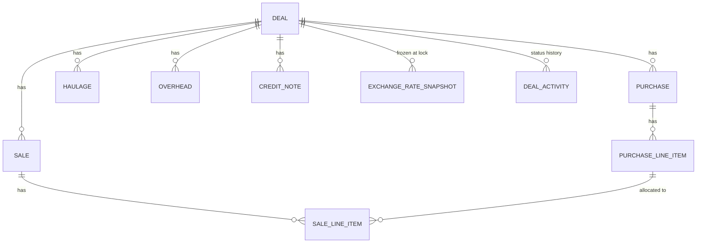
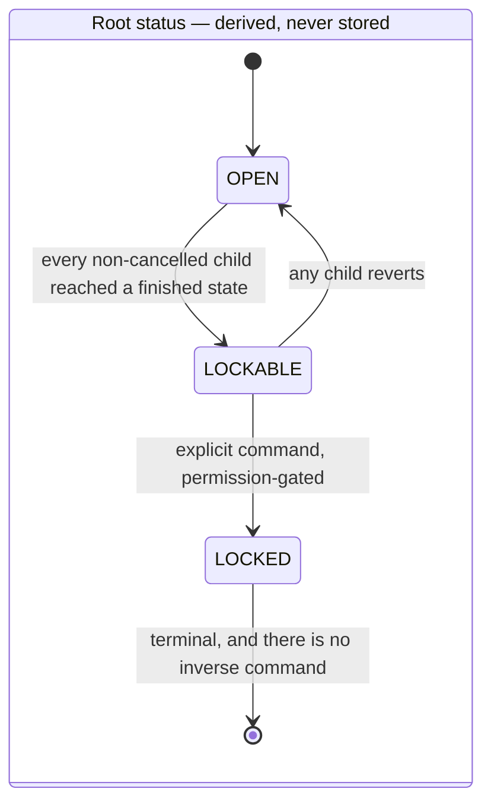
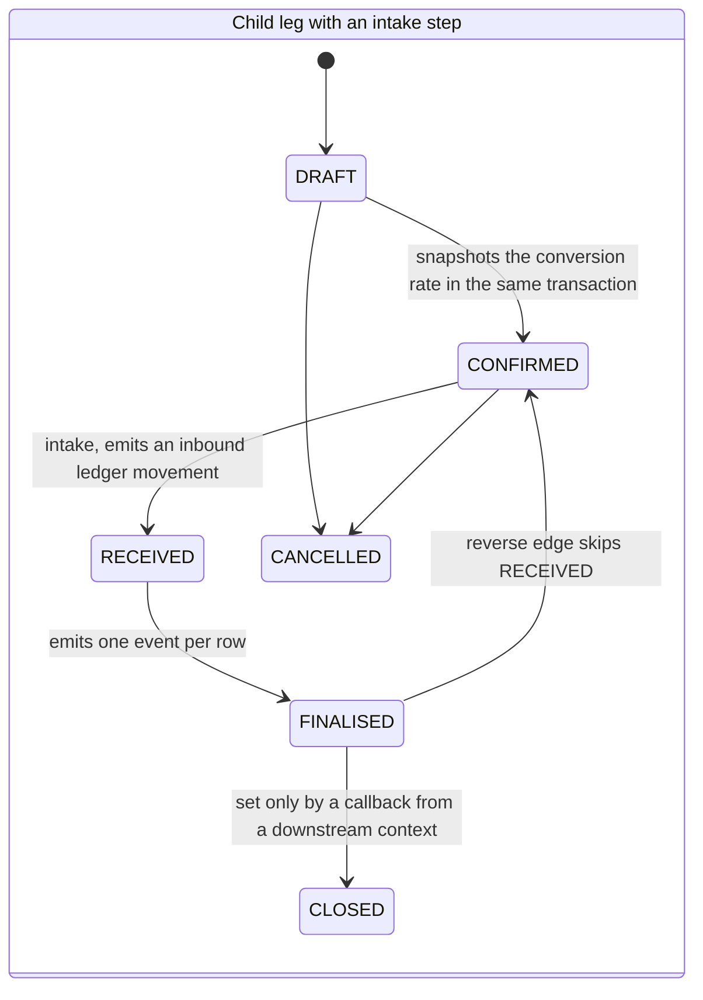
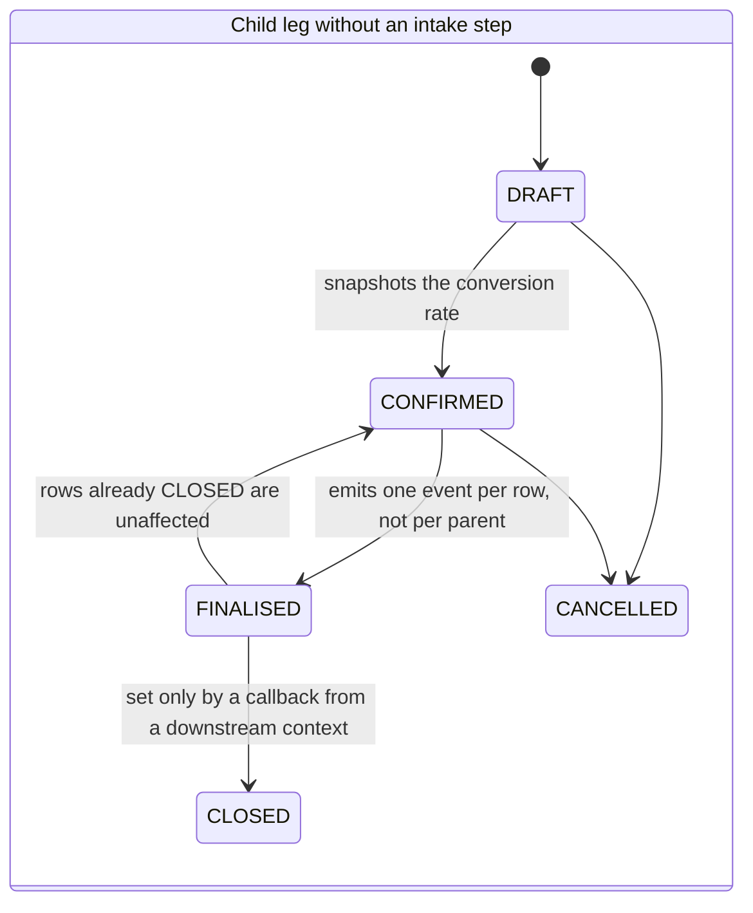
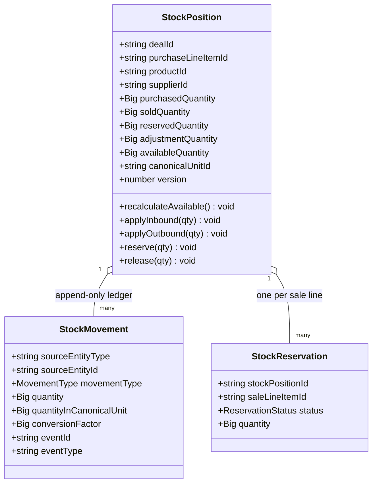
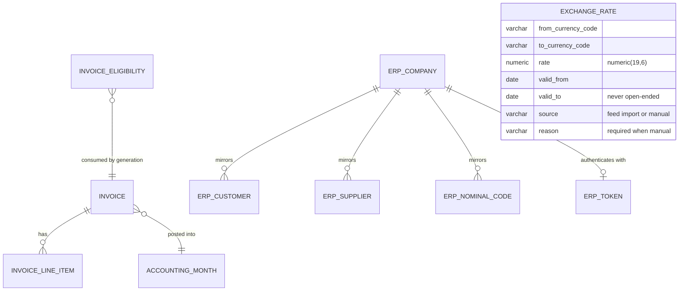
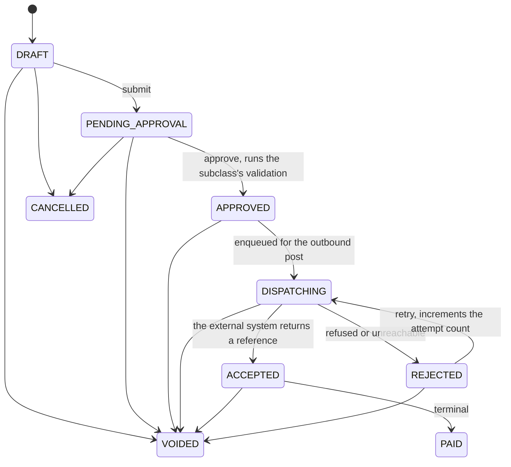
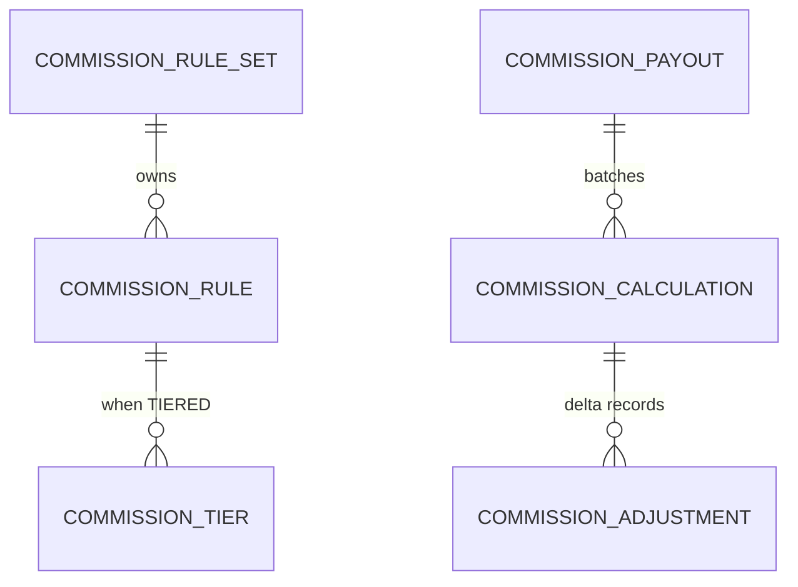
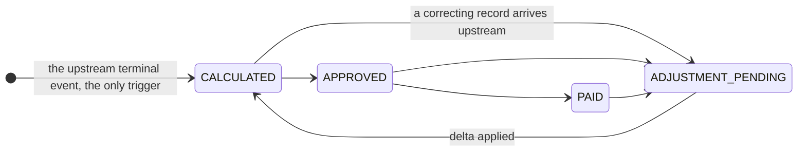

# Domain Model — Acme Platform

This document describes what lives _inside_ each bounded context: the shared kernel, the aggregate
roots and their boundaries, the entities and value objects each aggregate owns, the state machines
that govern them, and — most importantly — the invariants each aggregate exists to protect. The
structure comes from the aggregate-design documents; the field names, enum members and guard
clauses were read out of the shipped entities under `apps/platform/*/src/modules/**/domain/`.
Where the design documents and the code have drifted apart, the code wins and the drift is noted.
For the context boundaries themselves see [`bounded-contexts.md`](./bounded-contexts.md).

---

## 1. Shared kernel

`@acme/domain-primitives` is a zero-dependency library importable from any layer, including domain.
It is the only code co-owned by more than one context.

| Value object   | Fields                                 | DB precision    | Used for                         |
| -------------- | -------------------------------------- | --------------- | -------------------------------- |
| `Money`        | `amount: string`, `currencyId: string` | `numeric(19,4)` | Every monetary amount            |
| `Quantity`     | `value: string`, `unitId: string`      | `numeric(19,4)` | Product quantities               |
| `Percentage`   | `value: string`                        | `numeric(5,4)`  | Commission rates, margins        |
| `DateRange`    | `from: Date`, `to: Date`               | —               | Period filters, validity windows |
| `ExchangeRate` | `rateToGBP: string`, `date: Date`      | `numeric(19,6)` | FX snapshots                     |

**No floats, ever.** Numeric value objects carry `string` at the boundary and `Big` (big.js) in the
domain. `DecimalType`, a custom MikroORM type, maps `Big ↔ numeric` and **throws on a raw
`number`** — that rejection is the enforcement mechanism, not a convention.

Branded types give nominal typing over UUID strings: `TenantId`, `UserId`, `DealId`, `InvoiceId`,
`CustomerId`, `ProductId`, `UnitId`, `CurrencyId`, plus `CurrencyCode` and `CountryCode`. Passing a
`UserId` where a `TenantId` is expected is a compile error, which matters a great deal in a codebase
where every cross-context reference is an unconstrained UUID column.

Every tenant-scoped entity extends `TenantBaseEntity` (`id`, `tenant_id`, `created_at`,
`updated_at`) and is covered by a global, **fail-closed** MikroORM filter: a query issued outside a
`TenantContext.run()` scope throws `MissingTenantContextError` rather than returning cross-tenant
rows. Forked or non-request entity managers must opt out explicitly — silence is not permission.

---

## 2. Trading BC — the Deal aggregate



**What it shows.** One aggregate, nine entity types, one transactional boundary. Every record a
single trade touches hangs off one root, so the aggregate can be loaded, validated and committed as
one consistent snapshot rather than assembled from independently-mutable tables.

The boundary is drawn where it is because of the one operation that has to be atomic: freezing a
derived figure. A boundary that excluded any cost or revenue child would make that figure a
distributed read.

Takeaways:

1. `deal_number` is the business-facing identifier: sequential per tenant, immutable, allocated
   through a `DealSequence` row under `SELECT … FOR UPDATE`, and backed by a database unique
   constraint on `(tenant_id, deal_number)` so a bad import cannot duplicate it.
2. **Status is derived, not stored.** There is no `status` column on `deal`. `DealStatusDeriver`
   returns `LOCKED` if `locked_at` is set, otherwise inspects child statuses. The entity getter
   deliberately returns `OPEN` for any unlocked deal, because the child collections may not be
   loaded; obtaining `LOCKABLE` requires an explicitly populated aggregate. This is a real trap and
   it is documented in the entity itself.
3. `SALE_LINE_ITEM.purchase_line_item_id` is the single most load-bearing reference in the platform:
   it is the child-to-child link that the aggregate's hardest invariant is defined over, which is
   itself the argument for both children living under the same root.
4. The **`live_*` cache columns are best-effort** and are recomputed by SUM queries after any child
   changes. `updateFinancialCache()` refuses to write them once the record is locked, so the cache
   can never contradict the frozen figure — the frozen column is the audited number, the live ones
   are a UI convenience. A cache that can outlive the thing it caches is worse than no cache.
5. `DEAL_ACTIVITY` is a trading-owned status-history projection (**ADR-0062: Deal Activity
   Read-Model**), not an audit trail — Compliance keeps its own. Two things that look like the same
   table are kept separate because one is a feature and the other is evidence.

**The invariants worth naming**, with the domain vocabulary stripped out — each of these is a shape
you can lift into any aggregate that has a point of no return:

- The business-facing identifier is allocated under a row lock **and** backed by a database unique
  constraint. The lock orders concurrent allocation; the constraint is what stops a bulk import that
  never took the lock.
- Status is derived from children for every value except the terminal one, which only a command may
  set. Deriving the intermediate states means they cannot be wrong; storing the terminal one means it
  cannot be recomputed away.
- The terminal transition is **irreversible by omission**: there is no inverse command anywhere in
  the codebase. Not a guard that refuses — an operation that does not exist.
- The precondition for that transition is re-validated _inside_ the transaction under a pessimistic
  row lock, not merely checked on entry. The entry check saves work; the inner check is the one that
  is correct under concurrency, and it must read the same row instance it is about to write.
- The frozen figure is written exactly once, in that transaction, and never updated.
- After the terminal transition, exactly one narrow category of write remains legal, and every other
  mutation raises. The exception is enumerated in the entity, not decided by the caller.
- Any flag that says "this happened after the record was frozen" is derived server-side from the
  record's own state; client input for it is ignored.
- The outbox row for the resulting event is written in the same transaction, so the event cannot
  exist without the state change or the state change without the event.

> **Drift note.** The aggregate-design document calls the frozen figure `cachedGrossProfit` and
> describes no live cache. The shipped entity uses `lockedGrossProfit` plus eight `live_*` columns.
> Code is authoritative.

### 2.1 Lifecycles

Every child entity has its own small status enum with an explicit, closed transition set; the root's
status is derived from them. The three machines below carry neutral state names — what transfers is
the topology: which edges exist, which do not, and where the machine stops.







Reading them: `CLOSED` and `CANCELLED` are terminal, and cancellation is reachable only from the two
states before the point of no return — once a leg is finalised it can be corrected but not withdrawn.
The intake step exists on one leg only; the others collapse straight from `CONFIRMED` to `FINALISED`,
which is why the enum is per-child rather than one shared vocabulary. And the reverse edge lands on
`CONFIRMED` rather than on `RECEIVED`, the state immediately before it, so a leg that is reversed and
re-finalised re-runs the intake step instead of inheriting its previous outcome.

Four properties of _how_ these transitions are implemented generalise:

1. **Every transition that snapshots a value or emits an event does so in the same transaction as
   the status write.** A rate captured "at confirmation" is only trustworthy if a crash cannot leave
   the status advanced and the snapshot missing.
2. **One status value is never set by the owning service at all.** It arrives as a callback event
   from another bounded context, which makes it the one upstream edge into the core context — and
   makes it visible in the entity, rather than buried in a consumer.
3. **The reverse transitions are deliberately asymmetric with the forward ones**, and the asymmetry
   is documented on the enum rather than left to be rediscovered. A state machine drawn as if it
   were reversible is the commonest way a lifecycle bug gets designed in.
4. **The emitted event's granularity is chosen by its consumer, not its producer.** The finalise
   event fires per line item rather than per parent, because the downstream context needs one event
   per row it will act on. Emitting the coarser event and making every consumer fan it out is how a
   producer exports its own convenience as everyone else's join.

### 2.2 Supporting aggregates in Trading

| Aggregate root | Children                          | Shape of its invariants                                                                       |
| -------------- | --------------------------------- | ---------------------------------------------------------------------------------------------- |
| `Customer`     | `CustomerSite`, `CustomerContact` | Children must belong to a parent in the same tenant; a counterparty must carry the right role |
| `ProductGroup` | `Product`                         | A child always belongs to a group in the same tenant; every referenced id must resolve         |
| `Unit`         | —                                 | Its conversion factor must be present and non-zero, so a comparison can never divide by zero  |
| `Currency`     | —                                 | Reference data, effectively global                                                             |
| `VatCountry`   | —                                 | Renamed from the legacy `Country`                                                              |
| `Warehouse`    | —                                 | Physical storage location                                                                      |

The pattern across the whole table is the same one: an invariant that is checkable from the
aggregate's own loaded state lives on the root, and everything else moves to a domain service.

Cross-cutting domain services, none of which belong on an aggregate root because each needs data the
root would otherwise have to eager-load:

- `DealStatusCalculator` / `DealStatusDeriver` — derives `OPEN`/`LOCKABLE` after any child change.
- `DealLockingPolicy` — the lock preconditions, in one object, re-checked inside the transaction.
- `DealFinancialSummaryCalculator` — the single implementation of the money calculation.
- `ExchangeRateResolver` — the ACL to Finance; short-circuits the identity case without a network
  call.
- `PartnerRestrictionPolicy` — a policy object that narrows which commands a principal may issue.
  The mechanism worth copying is that it is keyed off **tenant configuration, not user role**: the
  restriction follows the tenant a principal is acting in, so it cannot be escaped by a role grant.

---

## 3. Trading BC — the Inventory aggregate



**What it shows.** A materialised projection (`StockPosition`) backed by an immutable ledger
(`StockMovement`) and gated by reservations (`StockReservation`), all driven by Trading events.

Takeaways:

1. **The available quantity is a stored derivation, and it is recomputed inside every mutating
   method** rather than by whoever calls them. A derived column that any caller may forget to
   refresh is a column that will eventually disagree with its own inputs. It also carries a
   non-negativity check, so an overdraw fails at the domain object rather than at a report.
2. **Quantities are normalised to a canonical unit on write, and the conversion factor used is
   persisted on the movement row.** Storing the factor — not just the converted value — is what
   makes a replay reproducible after the reference data has since changed.
3. **Movements are append-only and immutable.** `StockMovement` carries a **unique index on
   `event_id`** — that is the idempotency guard for at-least-once delivery, enforced by the database
   rather than by handler logic.
4. `StockReservation` has a unique index on `sale_line_item_id`: one reservation per sale line, ever.
   Status runs `ACTIVE → CONFIRMED` on sale confirmation, `→ RELEASED` on cancellation.
5. `StockPosition` carries an optimistic-lock `version` column, exposed in write DTOs so a stale
   client write is rejected rather than silently merged (**ADR-0071**).

**Invariant encoded:** stock availability is a _derived_ quantity that can always be reconstructed by
replaying the movement ledger — the position table is a cache with a proof.

The event mapping that drives all of this:

| Trading event                   | Inventory effect                                    |
| ------------------------------- | --------------------------------------------------- |
| `trading.purchase.receipted`    | `INBOUND` movement, creates or updates the position |
| `trading.purchase.cancelled`    | Position removed or cancelled                       |
| `trading.sale.created`          | `OUTBOUND` movement plus reservation                |
| `trading.sale.confirmed`        | Reservation `ACTIVE → CONFIRMED`                    |
| `trading.sale.updated`          | Reservation quantity adjusted                       |
| `trading.sale.cancelled`        | `REVERSAL` movement, reservation released           |
| `trading.credit-note.finalised` | `ADJUSTMENT` movement when quantity-affecting       |
| `trading.deal.locked`           | `deal_status` metadata refresh only                 |

---

## 4. Finance BC — the Invoice aggregate



**What it shows.** accounting-service owns four things: the invoice aggregate and its lines, the
accounting period, the exchange-rate table (standalone — it is referenced by date, not by foreign
key, which is why it hangs off nothing), and an anti-corruption layer of `Erp*` mirror entities that
keeps the vendor's vocabulary out of the domain. Six legacy invoice tables are collapsed into one
polymorphic table using MikroORM single-table inheritance.

Takeaways:

1. **Six `InvoiceType` values map onto four classes.** `PURCHASE`, `HAULAGE` and `OVERHEAD` all
   instantiate `PurchaseSideInvoice`; `SALE` → `SaleSideInvoice`; plus `PurchaseCreditInvoice` and
   `SaleCreditInvoice`. The discriminator column is declared explicitly so it can be queried.
2. Each subclass implements `validateForApproval()` and `buildErpPayload()`, and each has its own
   required-field set. **Type-specific rules live in the subclass, not in an `if` ladder in a
   service** — adding a seventh type is a new class, not a seventh branch in six places.
3. `INVOICE_ELIGIBILITY` holds the **event-carried line snapshot** from
   `trading.line-item.finalised` (**ADR-0063**). Finance never calls back into Trading to build an
   invoice — everything it needs arrived in the event, so invoice generation is available even when
   trading-service is down.
4. `idempotency_key` equals the invoice id: the ERP can never be posted the same invoice twice, no
   matter how many retries the relay performs (**ADR-0024**).
5. `recalculateTotals()` sums line items into `total_amount`/`vat_amount`. The header is derived from
   the lines; the lines are never derived from the header.
6. The ACL keeps the vendor's world in its own entities — `ErpCompany`, `ErpCustomer`, `ErpSupplier`,
   `ErpVatCode`, `ErpNominalCode`, `ErpCurrency`, `ErpBankAccount`, `ErpToken`, `ErpPostingAudit` —
   all in the `accounting` schema. **No ERP identifier appears on a domain entity**; the only trace
   on `INVOICE` is `erp_urn`, the receipt of a successful post.

**Invariants (Finance)**, the structural ones:

- Batch generation is atomic in one transaction — no partial output.
- One record per `(source_entity_id, type)` per tenant, enforced by a unique constraint rather than
  by a pre-flight query, so two concurrent generators cannot both pass the check.
- A period cannot be closed twice, and the guard is a transition check on the entity, so both
  directions are covered by one rule.
- Once a record has been transmitted to an external system of record it is immutable: corrections
  are additional compensating records, never edits.
- Rate rows always carry both bounds of their validity window; an open-ended row is rejected,
  because "the current rate" then depends on insertion order.

The invoice's own status machine is the largest in the platform — nine states, with the steps that
named the external vendor's posting cycle relabelled neutrally:



Three mechanical properties, none of them about the shape. First, `PAID`, `CANCELLED` and `VOIDED`
are terminal and the terminality is enforced **by the entity**: the transition methods refuse to run
from them, so no service can talk a record out of being finished. Second, `ACCEPTED` — the state
meaning "the external system took this" — is the one that emits the event other contexts consume, so
the external call and the loop-closing event are adjacent by design rather than the event firing
hopefully at submit time. Third, the two withdrawal paths are not interchangeable: cancel is
reachable only from the two states before anything has left the platform, so a record the external
system has already seen can be voided but never cancelled. That asymmetry is the whole reason there
are two words for it.

**Invariant encoded:** once an invoice has been transmitted to the ledger of record, the platform can
only add compensating records; it can never rewrite history.

---

## 5. Commission BC



**What it shows.** commission-service has two halves that are deliberately shaped differently: a
per-tenant **configuration** aggregate — a rule set owning its rules, and tiers under a rule — and
an append-only **ledger** of calculations with additive adjustment rows, batched into payouts. It
consumes `trading.deal.locked` and publishes `commission.commission.calculated`.

Takeaways:

1. **One configuration per tenant, enforced by a unique constraint** on `tenant_id`. The aggregate
   root exists specifically so that "exactly one active configuration" is an atomic property of the
   schema rather than a query the application has to remember to run.
2. **Validation of a configuration is total, and it lives on the root.** The set is checked as a
   whole — completeness, ordering and the absence of gaps between its parts — which is only possible
   because the whole set is the aggregate. A partially-valid configuration is never persisted, so
   nothing downstream has to defend against one.
3. **A configuration row that has been used becomes immutable.** A flag flips the first time a row
   participates in a calculation, and every later edit raises. You supersede a used row with a new
   one; you never amend a row whose output something else has already acted on. This is the same
   idea as the frozen figure in §2, applied to configuration instead of data.
4. **Corrections are additive.** The original calculation row is never modified; a correction is a
   new immutable child row and the net figure is derived from base plus children. That is what makes
   a historical statement reproducible — you can always rebuild what the number was on any date.

The ledger half has one further property the takeaways do not show: its lifecycle has **no terminal
state at all**.



Every forward state, `PAID` included, can be pulled back into `ADJUSTMENT_PENDING` and re-enter
`CALCULATED`, because a correction upstream can land long after the figure was approved and settled.
Compare §4, where the terminal states are the point. A machine that must stay open indefinitely is
exactly the case where additive correction is the only workable design: give it a truly terminal
state and it has to choose between refusing a late correction and rewriting a settled row.

**Invariant encoded:** every figure this context produces is either an immutable row or a derivation
over immutable rows. Nothing is restated in place.

---

## 6. Identity, Platform and the generic contexts

These contexts are modelled more thinly on purpose — they are generic subdomains, and the goal is a
boring, replaceable implementation.

| Context       | Aggregate root         | Owned entities                                 | Headline invariants                                                                                                                                                                                                                                                                              |
| ------------- | ---------------------- | ---------------------------------------------- | ------------------------------------------------------------------------------------------------------------------------------------------------------------------------------------------------------------------------------------------------------------------------------------------------ |
| Identity      | `Credential`           | `PasswordHistory`, `MfaConfig`, `RefreshToken` | Argon2id hashes; lockout after 5 failures for 15 min; ≥12 chars with mixed classes; no reuse of a previous hash; SSO-provisioned accounts cannot use password login                                                                                                                              |
| Identity      | `Session`              | —                                              | JTI checked against a Redis revoked set on every request; refresh-token reuse revokes the whole family; tenant suspension revokes all sessions within 60s                                                                                                                                        |
| Identity      | `User`                 | `UserRole`, `UserPreference`                   | Exactly one role per user (assignment replaces); a user cannot change their own role; email unique **per tenant**, not globally; SUPERADMIN has `tenant_id = NULL`                                                                                                                               |
| Identity      | `Invitation`           | —                                              | Single-use token, 72h TTL, validated against the target tenant; duplicate pending invite → 409                                                                                                                                                                                                   |
| Identity      | `Role`                 | `Permission`, `RolePermission`                 | 7 roles; permissions resolved at token issue time and carried in the JWT, so changes take effect on refresh                                                                                                                                                                                      |
| Identity      | `OidcProvider`         | `OidcMapping`                                  | State and nonce validated on callback; auto-provisioning assigns the tenant default role                                                                                                                                                                                                         |
| Platform      | `Tenant`               | `TenantConfig`                                 | Slug globally unique and immutable; `maxUsers` enforced (deactivated users do not count); onboarding must complete before general API access; suspended → 403 everywhere; soft-delete purges after a 30-day retention window; integration credentials encrypted and masked except for SUPERADMIN |
| Platform      | `FeatureFlag`          | —                                              | Tier supplies defaults; a SUPERADMIN override survives tier recalculation                                                                                                                                                                                                                        |
| Compliance    | `AuditEntry`           | —                                              | Append-only and immutable; indexed by tenant+timestamp, entity, user and correlation id; carries `source_event_type`/`source_event_id` for provenance (**ADR-0031**)                                                                                                                             |
| Communication | `NotificationDelivery` | `NotificationTemplate`, `EmailSuppression`     | Delivery state per recipient; suppression list respected before send                                                                                                                                                                                                                             |
| Communication | `GeneratedDocument`    | `DocumentTemplate`                             | Document must exist before the email that attaches it is dispatched (Partnership)                                                                                                                                                                                                                |
| Analytics     | `ReportDefinition`     | `ScheduledReport`, `GeneratedReport`, `rpt_*`  | System reports immutable; role matrix checked before execute/export; projection upserts skipped when `event.timestamp <= lastEventAt`                                                                                                                                                            |

Two details worth pulling out because they cross contexts:

- **Tenant isolation is enforced twice.** The gateway resolves and validates the tenant before
  proxying; the ORM filter refuses to run a tenant-scoped query without a context. Neither layer
  trusts the other.
- **Audit entries store `new_state` verbatim as JSONB.** That is powerful and dangerous: any secret
  that travels in an event payload lands in the audit store. The denylist that strips secret fields
  before the audit fan-out is a required control, not an optimisation.

---

## 7. Cross-aggregate reference rules

Because there are no cross-schema foreign keys, the rules about what may reference what are domain
rules. They are simple enough to state exhaustively:

```
Within one aggregate  →  ORM relation (@ManyToOne / @OneToMany) + real FK
                         e.g. Purchase.deal_id, SaleLineItem.purchase_line_item_id,
                              InvoiceLineItem.invoice_id, CommissionTier.commission_rule_id

Across aggregates,    →  plain UUID column, no relation, no FK
same context             e.g. Purchase.supplier_id → Customer
                              PurchaseLineItem.product_id → Product
                              Overhead.unit_id → Unit

Across contexts       →  plain UUID column, no relation, no FK, validity is eventual
                         e.g. Deal.locked_by_id → Identity.user
                              Invoice.deal_id → Trading.deal
                              StockPosition.purchase_line_item_id → Trading.purchase_line_item
                              CommissionCalculation.trader_id → Identity.user

Denormalised copies   →  kept fresh by an event subscription, never by a join
                         e.g. CommissionCalculation.trader_name ← platform.user.updated
                              SaleLineItem.product_id (denormalised for query performance)
                              StockPosition.deal_status ← trading.deal.locked
```

Consequences, stated plainly: a deleted customer does not cascade into historical deals; a renamed
trader does not retroactively rename past commission statements unless the subscription rewrites
them (it deliberately only affects future records); and a dangling UUID is a data-quality problem
detected by reconciliation, not a constraint violation caught at write time.

---

## Unreconciled and unverified

- **`cachedGrossProfit` vs `lockedGrossProfit`.** The design docs use the former; the entity uses the
  latter plus eight live-cache columns the docs do not mention. Documented from code above.
- **`ErpPostingLog` vs the shipped `ErpPostingAudit`.** The entity file is
  `erp-posting-audit.entity.ts`; the design docs call it a posting _log_. Same purpose, different
  name; the columns were not read field-by-field for this document.
- **`AccountingMonth` shape.** Two spec pages disagreed — `startDate`/`endDate` versus `year`/`month`.
  The shipped entity has `year` and `month` as integers with an `OPEN`/`CLOSED` status; that
  disagreement is settled in code.
- **`CommissionTier` placement.** It is a real MikroORM `@Entity` with its own table, but it lives in
  the `domain/value-objects/` directory. It behaves as a value object (meaningless outside its rule,
  replaced wholesale) while being persisted as an entity. The directory reflects the modelling
  intent, not the persistence mechanism.
- **`ClosedCommissionMonth.company_id`.** The column is named `company_id` rather than `tenant_id`,
  a survival from the legacy commission service. Whether it is populated with a tenant id was not
  verified.
- Identity, Platform, Communication, Compliance and Analytics invariants in §6 come from the
  aggregate-design documents and canvases. Unlike Trading, Finance and Commission, their entity
  source was enumerated but not read line-by-line — field lists there should be treated as
  indicative.
