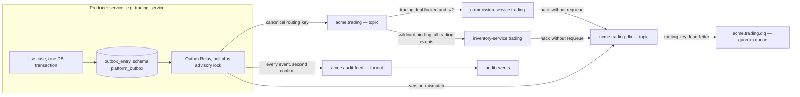
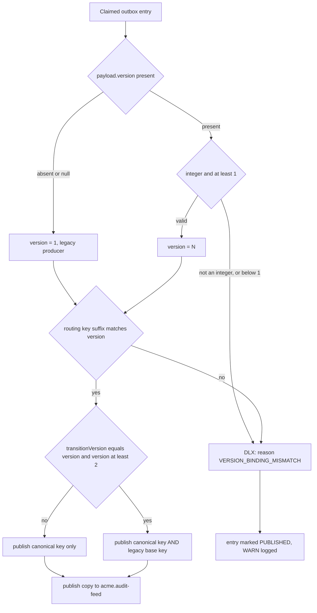
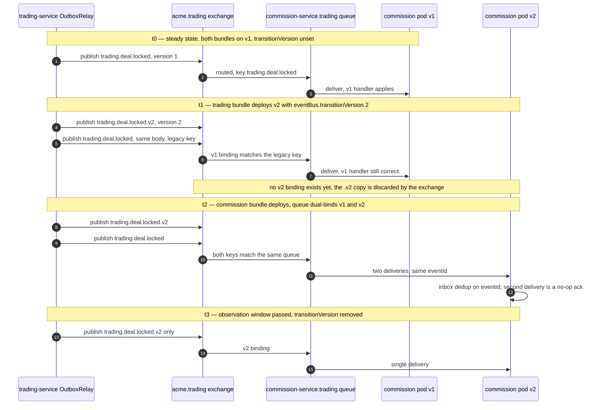

# Platform Event Catalog and Routing Scheme

What this covers: the domain-event taxonomy of the Acme Platform (the NestJS/AKS
microservice stack, distinct from the legacy `legacy-api` / `legacy-web` pair), the
`DomainEvent<T>` envelope that every message on the wire carries, the RabbitMQ
exchange / routing-key / dead-letter naming grammar, and the **versioned routing key**
mechanism (ADR-0036) that lets a payload-breaking change roll out across producer and
consumer bundles without dropping or corrupting a single event. Everything below is
read off the shipped code in `libs/platform/event-bus`, `libs/platform/event-contracts`,
the `charts/platform-rmq-bootstrap` topology chart, and the ADRs; where the as-built
diverges from an ADR, the divergence is called out rather than smoothed over.

---

## 1. The envelope

Every integration event is a `DomainEvent<T>` from `@acme/event-contracts` — the DDD
_published language_ library, which depends only on the shared kernel
(`@acme/domain-primitives`) so no bounded context can drag its internals into a contract.

```ts
export interface DomainEvent<T = unknown> {
  readonly eventId: string; // UUID v7 — time-ordered, also the inbox dedup key
  readonly eventType: string; // 'trading.deal.locked'
  readonly version: number; // schema version, starts at 1
  readonly tenantId: TenantId;
  readonly userId: UserId;
  readonly correlationId: string;
  readonly causationId: string; // the event that caused this one
  readonly timestamp: string; // ISO 8601
  readonly payload: T;
  readonly aggregateId?: string;

  // Serialization aliases populated by the relay — consumers may read either form
  readonly id?: string;
  readonly type?: string;

  // Optional audit / notification metadata (added later, backward compatible)
  readonly userEmail?: string;
  readonly recipientUserIds?: string[];
  readonly ipAddress?: string;
  readonly changedFields?: string[];
}
```

Two things to know before you read a payload type:

- **`eventId` is the idempotency anchor.** It is the primary key of the consumer-side
  inbox (`processed_event`), so it must be a fresh UUID v7 per emission — never reused
  when an event is re-emitted for a different state change.
- **Payloads are name-enriched.** By convention (`trading-events.ts` header) payloads
  carry `supplierName`, `traderName`, `currencyCode`, `productName` alongside the ids so
  a consumer never has to call back into the producing service to render a row. The
  `trading.deal.locked` payload is a full snapshot of the deal — purchases, sales,
  haulage, overheads, credit notes, each with line items.

> **Documentation drift, verified:** ADR-0018 specifies an `IntegrationEvent` shape with
> `aggregateType`, `occurredAt`, and a nested `metadata: { tenantId, correlationId, … }`.
> The shipped interface is flat, uses `timestamp` rather than `occurredAt`, and has no
> `aggregateType`. The code is the source of truth on the wire; the ADR text has not been
> re-synced.

---

## 2. Naming grammar

```
exchange       ::= "acme." <bc>                          topic, one per bounded context
audit exchange ::= "acme.audit-feed"                     fanout, every event, every BC
dlx            ::= <exchange> ".dlx"                     topic
dlq            ::= <exchange> ".dlq"                     durable quorum queue

eventType      ::= <bc> "." <aggregate> "." <past-tense-verb>
                   e.g. trading.deal.locked · accounting.invoice.processed

routing key    ::= <eventType>                for version 1
                 | <eventType> ".v" <N>       for version N >= 2   (ADR-0036)

consumer queue ::= <service> "." <source-bc>            e.g. commission-service.trading
                 | <exchange> ".consumer." <eventType>  auto-derived default
                 | "audit.events"                       audit-service, fanout binding

job queue      ::= "jobs." <service> "." <purpose>      e.g. jobs.tenant.cleanup
dead-letter rk ::= "dead-letter"                        fixed; set by x-dead-letter-routing-key
```

The exchange is _derived_, never configured per event: `OutboxRelay.deriveExchange()`
takes the first dotted segment of `eventType` and prefixes `acme.`. An `eventType` with
no dot throws at publish time. The same derivation runs consumer-side in
`EventHandlerExplorer`, which is why producer and consumer agree on topology without a
shared registry.

---

## 3. Broker topology



**What it shows.** One bounded context's slice of the broker: outbox → relay → two
publishes (BC topic exchange + audit fanout), consumer queues bound by routing key, and
the dead-letter chain that catches both consumer nacks and relay-detected version drift.
The inventory queue's wildcard binding is literally `trading.#`; commission binds two exact
keys because it must distinguish v1 from v2 of the same event type.

**Takeaways**

1. **Every event is published twice** — once to `acme.<bc>` and once to
   `acme.audit-feed` (ADR-0026). Audit-service binds one queue to the fanout and is
   therefore BC-agnostic forever: a new bounded context needs no new binding. The cost is
   one extra publisher confirm per event.
2. **The DLX chain is only real if a queue is bound to it.** `charts/platform-rmq-bootstrap`
   declares `<exchange>.dlx`, `<exchange>.dlq` and the binding with routing key
   `dead-letter`; the runtime (`setup-rabbit-consumer.ts`, `event-handler-explorer.ts`)
   sets each consumer queue's `x-dead-letter-routing-key` to exactly `dead-letter`. The
   chart comments call this the runtime coupling — change one side and the DLX becomes a
   black hole.
3. **Consumers never `assertExchange` a foreign exchange.** They `checkExchange`
   (passive declare) because BC isolation withholds `configure` on another context's
   exchange; an active assert returns `403 ACCESS_REFUSED` and crash-loops the pod.
4. **Queues are quorum type**, pinned to the broker default, so a redeclare against
   leftover classic-queue state cannot trip `PRECONDITION_FAILED`.

**Invariant encoded.** A producer owns `configure`+`write` on its own exchange only; a
consumer owns `configure`+`write` on its own queue namespace and `read` on the foreign
exchanges it subscribes to. Binding queue _Q_ to exchange _X_ requires **write on Q** and
**read on X** — the asymmetry that has repeatedly crash-looped services whose ACL listed
only `read`.

Declared exchanges (10 total, from the bootstrap chart values):

| Exchange             | Type   | Owner                                  |
| -------------------- | ------ | -------------------------------------- |
| `acme.identity`      | topic  | auth-service                           |
| `acme.platform`      | topic  | tenant-service, user-service           |
| `acme.trading`       | topic  | trading-service                        |
| `acme.inventory`     | topic  | inventory-service                      |
| `acme.accounting`    | topic  | accounting-service                     |
| `acme.commission`    | topic  | commission-service                     |
| `acme.communication` | topic  | notification-service, document-service |
| `acme.reporting`     | topic  | reporting-service                      |
| `acme.ai`            | topic  | ai-service                             |
| `acme.audit-feed`    | fanout | shared — every producer holds `write`  |

---

## 4. Event taxonomy

Version column is the schema version carried in the envelope; `v1` means the canonical
routing key has no suffix.

### Identity BC — auth-service, exchange `acme.identity`

| Event type           | Ver | Consumers                           | Key payload fields                     |
| -------------------- | --- | ----------------------------------- | -------------------------------------- |
| `auth.login.success` | 1   | audit, user-service (`lastLoginAt`) | userId, tenantId, ipAddress, userAgent |

### Platform BC — tenant-service and user-service, exchange `acme.platform`

| Event type                       | Ver | Consumers                            | Key payload fields                            |
| -------------------------------- | --- | ------------------------------------ | --------------------------------------------- |
| `platform.user.created`          | 1   | audit, commission                    | userId, tenantId, email, firstName, lastName  |
| `platform.user.updated`          | 1   | audit, commission                    | userId, tenantId, email, firstName, lastName  |
| `platform.user.invited`          | 1   | audit, communication                 | userId, tenantId, email, invitedBy, **token** |
| `platform.user.deactivated`      | 1   | audit, identity (session revocation) | userId, tenantId, deactivatedBy               |
| `platform.user.reactivated`      | 1   | audit                                | userId, tenantId, reactivatedBy               |
| `platform.tenant.config.updated` | 1   | audit                                | tenantId, changedFields, featureFlags         |

`platform.user.invited` is the one payload carrying a bearer secret; see §6.4.

### Trading BC — trading-service, exchange `acme.trading`

| Event type                                                        | Ver   | Consumers                                           | Key payload fields                                                                                                                                |
| ----------------------------------------------------------------- | ----- | --------------------------------------------------- | ------------------------------------------------------------------------------------------------------------------------------------------------- |
| `trading.deal.created`                                            | 1     | audit, analytics                                    | dealId, tenantId, dealRef, customerId, traderIds                                                                                                  |
| `trading.deal.updated`                                            | 1     | audit, analytics                                    | dealId, tenantId, changedFields                                                                                                                   |
| `trading.deal.locked`                                             | **2** | audit, analytics, accounting, commission, inventory | full deal snapshot: purchases, sales, haulage, overheads, credit notes with line items, exchange rates, trader assignments, `idempotencyKey` (v2) |
| `trading.purchase.created` / `.updated`                           | 1     | audit, analytics                                    | purchaseId, dealId, supplierId, commodity, quantity, price                                                                                        |
| `trading.purchase.receipted` / `.cancelled`                       | 1     | audit, analytics, inventory                         | purchaseId, dealId, receiptedAt / cancelledAt, quantity                                                                                           |
| `trading.sale.created` / `.updated` / `.confirmed` / `.cancelled` | 1     | audit, analytics, inventory                         | saleId, dealId, customerId, line items with `purchaseLineItemId`, quantity, unitCode                                                              |
| `trading.haulage.created` / `.updated`                            | 1     | audit, analytics                                    | haulageId, dealId, haulier, cost                                                                                                                  |
| `trading.overhead.created` / `.updated`                           | 1     | audit, analytics                                    | overheadId, dealId, description, amount                                                                                                           |
| `trading.credit-note.created`                                     | 1     | audit, analytics                                    | creditNoteId, dealId, amount, currency                                                                                                            |
| `trading.credit-note.finalised`                                   | 1     | audit, analytics, inventory, commission             | creditNoteId, dealId, isPostLockCredit, amount                                                                                                    |
| `trading.line-item.finalised`                                     | 1     | accounting (invoice-generation eligibility)         | entityType, entityId, lineItemId, dealId, productId, quantity, price, currencyCode, exchangeRateToGBP, counterpartyId, finalisedAt                |

`trading.line-item.finalised` carries the **full line snapshot** rather than a pointer —
see ADR-0063 _Invoice generation event-carried line items_. Accounting can generate an
invoice without a synchronous callback into trading.

### Accounting BC — accounting-service, exchange `acme.accounting`

| Event type                                               | Ver | Consumers                       | Key payload fields                                                 |
| -------------------------------------------------------- | --- | ------------------------------- | ------------------------------------------------------------------ |
| `accounting.invoice.created` / `.updated`                | 1   | audit, analytics                | invoiceId, dealId, type, totalAmount, currency                     |
| `accounting.invoice.approved`                            | 1   | audit, analytics, communication | invoiceId, approvedAt, approvedById, contextData                   |
| `accounting.invoice.processed`                           | 1   | audit, analytics, **trading**   | invoiceId, sourceEntityType, sourceEntityId, `erpUrn`, processedAt |
| `accounting.invoice.rejected` / `.failed` / `.cancelled` | 1   | audit, analytics, communication | invoiceId, reason, timestamps, actor ids                           |
| `accounting.exchange-rate.updated`                       | 1   | audit, analytics                | baseCurrency, targetCurrency, rate, effectiveAt                    |
| `accounting.accounting-month.opened` / `.closed`         | 1   | audit, analytics                | periodId, month, year, closedAt, closedBy                          |

`accounting.invoice.processed` is the only event trading-service _consumes_; it drives the
FINALISED → INVOICED write-back documented in `integration-patterns.md` §2.

### Commission BC — commission-service, exchange `acme.commission`

| Event type                         | Ver | Consumers                       | Key payload fields                             |
| ---------------------------------- | --- | ------------------------------- | ---------------------------------------------- |
| `commission.commission.calculated` | 1   | audit, analytics, communication | commissionId, dealId, traderId, amount, period |
| `commission.commission.adjusted`   | 1   | audit, analytics                | adjustmentAmount, netCommission, adjustedAt    |
| `commission.commission.approved`   | 1   | audit, analytics                | traderId, approvedAt, approvedById             |
| `commission.commission.paid`       | 1   | audit, analytics                | traderId, paidAt, amount                       |

### Inventory BC — inventory-service, exchange `acme.inventory`

| Event type                                           | Ver | Consumers            | Key payload fields                            |
| ---------------------------------------------------- | --- | -------------------- | --------------------------------------------- |
| `inventory.position.updated`                         | 1   | audit, analytics     | commodity, quantity, warehouseId              |
| `inventory.movement.created`                         | 1   | audit, analytics     | movementId, type, commodity, quantity, dealId |
| `inventory.stock.low`                                | 1   | audit, communication | commodity, currentQuantity, threshold         |
| `inventory.stock.reserved` / `.reservation-released` | 1   | audit, analytics     | stockPositionId, saleLineItemId, quantity     |

### Communication BC — document-service and notification-service, exchange `acme.communication`

| Event type                         | Ver | Consumers           | Key payload fields                |
| ---------------------------------- | --- | ------------------- | --------------------------------- |
| `communication.document.generated` | 1   | audit, notification | documentId, type, fileUrl, dealId |

---

## 5. Versioned routing keys — ADR-0036

The `version` field alone does not protect a rolling deploy. During a bundle rollout the
producer may already emit a v2 payload while some consumer pods are still v1; on a single
routing key, the v1 consumer deserializes a v2 body and corrupts state silently
(TypeScript types are a compile-time guarantee only). ADR-0036 _Versioned Event Routing
Keys for Safe Rolling Deploys_ closes that window by moving the version into the routing
key and having the broker do the filtering.

### 5.1 Relay-side enforcement



**What it shows.** The per-entry decision `OutboxRelay.publishToChannel()` takes before a
message ever reaches an exchange.

**Takeaways**

1. **Missing `version` defaults to 1**, so producers written before ADR-0036 keep working
   unchanged; only a _malformed_ version (non-integer, `< 1`) is a fault.
2. **The routing key and the version must agree.** `validateVersionRoutingKeyMatch()`
   parses the `\.v(\d+)$` suffix (absent ⇒ expect v1) and compares it with the envelope's
   version. Disagreement is a programmer error and is routed to `<exchange>.dlx` with a
   structured body `{ originalRoutingKey, expectedVersion, actualVersion, eventId,
reason }`, the original payload preserved on the `x-acme-original-payload` header and
   any non-numeric raw version on `x-acme-actual-version-raw`.
3. **Dual-publish triggers on an exact match** — `transitionVersion === version && version >= 2`.
   A degenerate `transitionVersion: 1` is treated as single-publish, because canonical and
   base are the same key and dual would mean duplicate delivery.
4. **Both publishes go through `Promise.allSettled`**, not sequentially. If canonical
   confirmed and legacy failed sequentially, the entry would be retried and canonical
   delivered twice. Settling both first means any rejection fails the whole entry, which
   the retry budget handles — and consumers are required to be `eventId`-idempotent
   anyway.
5. **A DLX'd entry is still marked PUBLISHED.** The relay deliberately does not retry a
   structural fault; the fix belongs at the producer or in bundle config.

**Invariant encoded.** _No consumer ever receives a body whose shape it did not bind for._
The broker, not the consumer, performs version filtering.

### 5.2 A rolling deploy that drops nothing



**What it shows.** The four-phase transition window from ADR-0036, with the as-built
detail that commission-service **dual-binds one queue** to both routing keys rather than
running two queues.

**Takeaways**

1. **At every instant at least one binding matches**, so no event is lost regardless of
   the order in which the two bundles roll.
2. **Dual-bind on one queue means dual delivery** during t2 — the same `eventId` arrives
   twice. This is safe _only_ because of the inbox pattern (ADR-0072); ADR-0036 explicitly
   depends on consumer idempotency, it does not provide it.
3. **The consumer dispatches on the AMQP routing key**, not on `eventType` — v1 and v2 of
   `trading.deal.locked` share an `eventType`, so `msg.fields.routingKey` is the only
   discriminator (`trading-event-consumer.ts` reads it explicitly, falling back to
   `event.eventType`).
4. **Closing the window is a human step.** `transitionVersion` must be removed from the
   bundle values after the observation window; ADR-0036 mitigates the forgotten-window
   risk with a dashboard panel and an alert if it stays set beyond a week.

**Invariant encoded.** The window may be opened by the producer alone and closed by the
producer alone; consumers migrate at their own pace in either order.

### 5.3 As-built wiring of the one live transition

| Layer          | Value                                                                                                                                                                                   |
| -------------- | --------------------------------------------------------------------------------------------------------------------------------------------------------------------------------------- |
| Producer       | `lock-deal.use-case.ts` emits `eventType: 'trading.deal.locked'`, `version: 2`, payload `DealLockedEventPayloadV2` = v1 snapshot + `idempotencyKey` (`${dealId}:${lockedAt}`)           |
| Bundle config  | `charts/bundles/trading-bundle/values.yaml` → `eventBus.transitionVersion: 2`, with a REMOVE-when comment naming both exit conditions                                                   |
| Chart plumbing | `charts/platform-base` renders `EVENT_BUS_TRANSITION_VERSION` into both the Deployment and the Rollout only when the value is set                                                       |
| Runtime        | `EventBusModule.createOutboxRelay()` parses `EVENT_BUS_TRANSITION_VERSION` and `OUTBOX_ADVISORY_LOCK_ID` from env into `OutboxRelayConfig`                                              |
| Consumer       | `commission-service.trading` queue binds `trading.deal.locked` **and** `trading.deal.locked.v2`; a helm-unittest asserts trading-service has the env var and inventory-service does not |

Advisory-lock registry (ADR-0036 §Outbox lock IDs) — each container runs its own relay, so
each needs its own PostgreSQL advisory lock id; the chart is meant to fail template
rendering when a broker-attached service has none:

```
900000 gateway (no broker)   900005 trading      900010 notification
900001 auth                  900006 inventory    900011 audit
900002 tenant                900007 accounting   900012 reporting
900003 user                  900008 commission   900013 ai
                             900009 document
```

The library default is `900001` — a service that forgets to set the env var silently
shares auth-service's lock and starves.

---

## 6. Verified gaps

These are as-built facts on the branch that was read, not aspirations:

1. **Version-mismatch DLX copies are not retained.** `dlxRoute()` publishes with
   `routingKey = originalRoutingKey`, but the retention DLQ is bound to the DLX with the
   fixed key `dead-letter`. A mismatch therefore reaches the DLX and is dropped; the WARN
   log is the only forensic record. The relay's own comment says as much and calls a bound
   retention queue a tracked follow-up.
2. **Only four services run a relay.** `enableRelay` is a compile-time module option, not
   an env flag. It is `true` in inventory-, tenant-, user- and auth-service; it is `false`
   in trading-, accounting-, commission-, notification-, document-, reporting-, ai- and
   audit-service. Those services write `outbox_entry` rows that nothing publishes. The
   module logs a WARN at boot when the relay is off, and trading-service ships an
   `outbox-lag` OTel observer measuring the age of the oldest PENDING row — which is the
   detector for exactly this condition.
3. **`version` is validated but never negotiated.** There is no schema registry; ADR-0036
   defers it explicitly. Two producers could disagree on the shape of a v2 payload and
   nothing would catch it before runtime. Contract tests (Pact) cover the specific
   producer/consumer pairs that have them, not the taxonomy as a whole.
4. **The audit fanout sees the payload verbatim**, including bearer secrets, unless the
   relay's per-`eventType` denylist is configured. See `integration-patterns.md` §5.

## Related decisions

- ADR-0017 — RabbitMQ Unified Messaging (Events + Jobs)
- ADR-0018 — Transactional Outbox for Domain Events
- ADR-0026 — Audit Feed Fan-Out Exchange for Event Consumption
- ADR-0036 — Versioned Event Routing Keys for Safe Rolling Deploys
- ADR-0063 — Invoice Generation Event-Carried Line Items
- ADR-0072 — Inbox, Idempotency-Key and Parked-Message Stores as Per-Service PostgreSQL Tables
