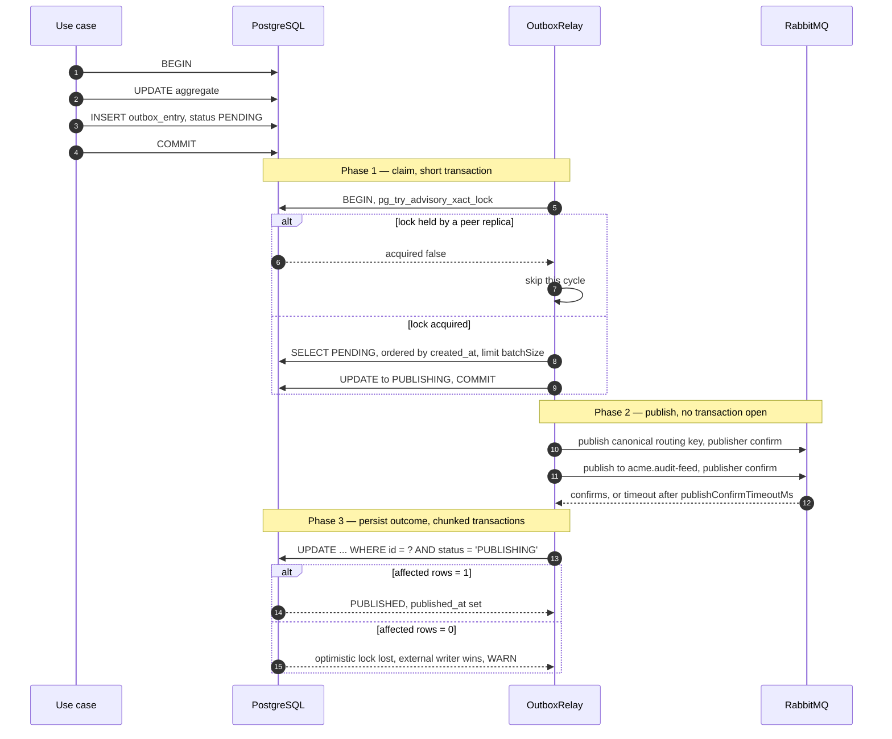
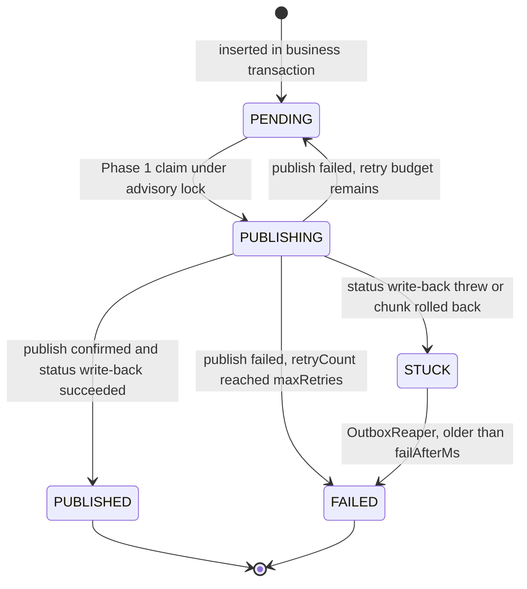
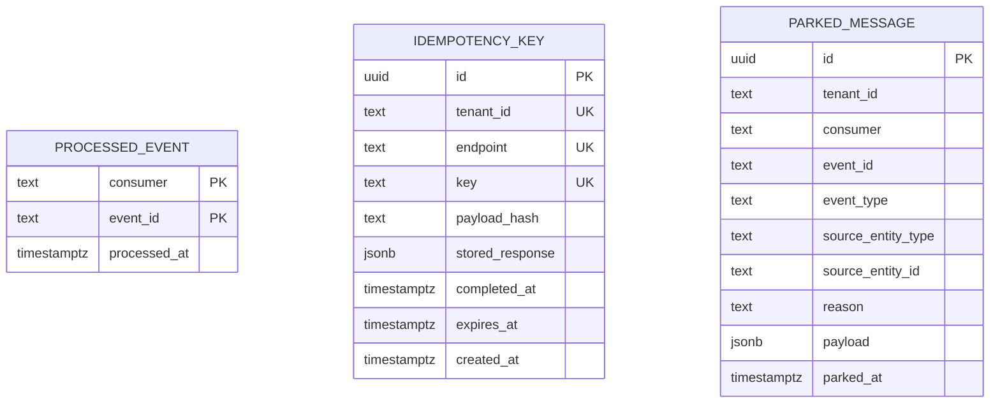
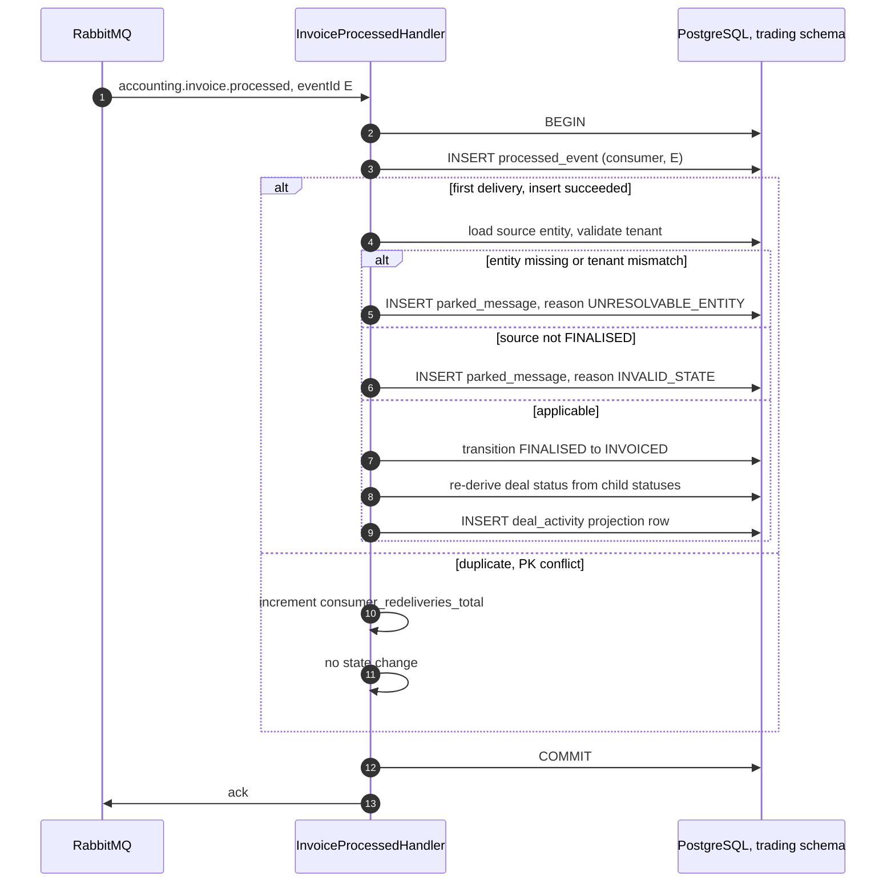
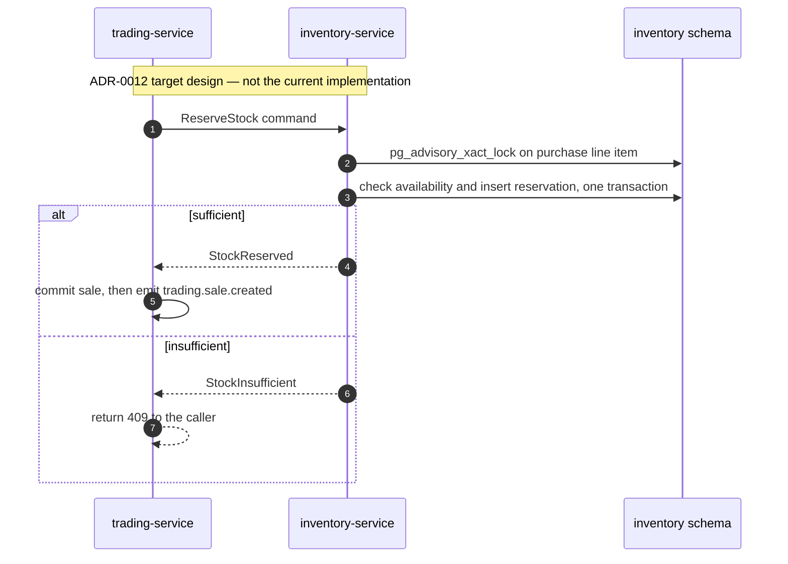
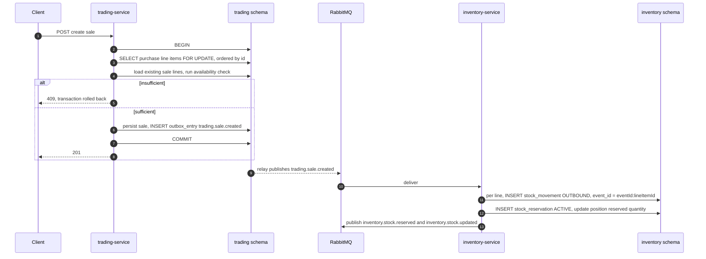
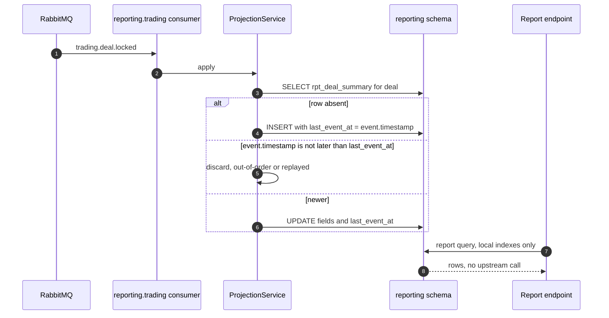
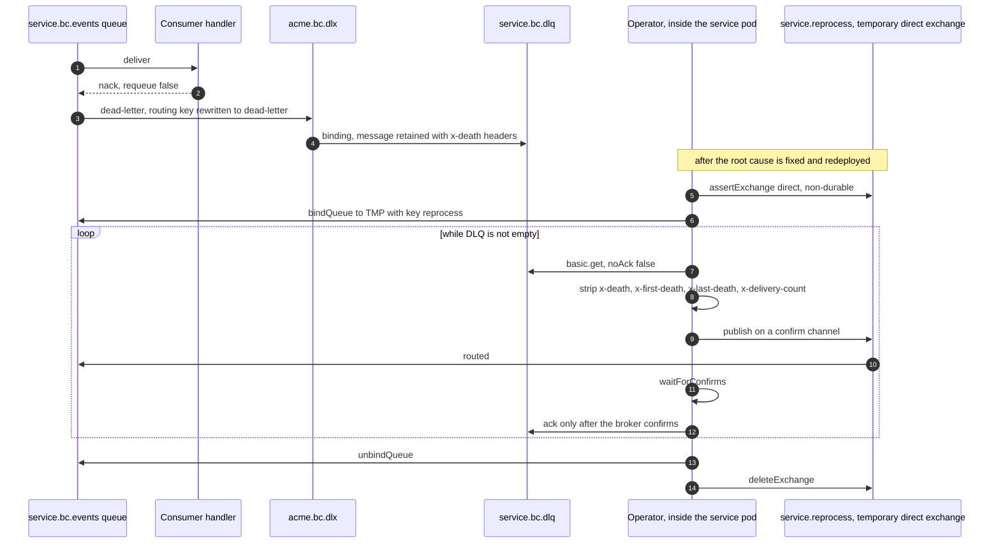

# Platform Integration Patterns

What this covers: the five message-handling patterns the Acme Platform relies on to stay
correct under at-least-once delivery — the transactional outbox (ADR-0018), the inbox +
idempotency-key + parked-message trio (ADR-0072), the stock-reservation saga (ADR-0012,
amended by ADR-0070), CQRS read-model projections (ADR-0025), and the dead-letter +
reprocess path. Each section states the decision, draws the flow, and names the invariant.
Where the shipped code diverges from the deciding ADR, the divergence is stated.

One sentence summarises all five: **delivery is at-least-once, processing is
effectively-once, and the mechanism that upgrades one to the other is a row written in the
same database transaction as the state change.**

---

## 1. Transactional outbox — ADR-0018

A business write and a broker publish cannot share a transaction, and writing both
independently (the "dual write") loses events whenever the process dies in between —
unacceptable for a financial system of record. ADR-0018 inserts the event into
`platform_outbox.outbox_entry` **inside the business transaction** and has a separate relay
drain it. `EventPublisher.publish(em, event)` does exactly one thing —
`em.persist(new OutboxEntry(...))` on the caller's transactional EntityManager; it never
touches AMQP. `entryType` discriminates `DOMAIN_EVENT` from `JOB`, so background jobs get
the same atomicity (ADR-0017 unified both on RabbitMQ; Redis is cache-only).

**What it shows.** The three-phase poll cycle, split precisely so that a database failure
can never resurrect an already-published message.

**Takeaways**

1. **Phases are separate transactions on purpose.** An earlier design wrapped the whole
   cycle in one transaction; a Phase-3 rollback then reverted N successful publishes back
   to `PENDING` and redelivered every one of them on the next tick. The claim now commits
   before any publish happens.
2. **`PUBLISHING` is a safe stuck state.** The relay query filters on `status = PENDING`,
   so an entry whose status write-back failed is never re-published — it is stranded, not
   duplicated, and an `outbox_relay_stuck_publishing_total` counter (labelled by
   `event_type` only, to bound cardinality) drives the alert.
3. **Phase 3 uses an optimistic predicate, not an ORM flush.** `WHERE status = 'PUBLISHING'`
   means an admin, a recovery tool, or a peer relay that moved the row between phases wins;
   the relay logs a WARN and does not overwrite.
4. **The advisory lock is transaction-scoped** (`pg_try_advisory_xact_lock`) so it
   auto-releases on commit or connection loss; each service needs its own lock id, and the
   library default `900001` is auth-service's (see `event-catalog.md` §5.3). Publisher
   confirms are separately bounded by `withConfirmTimeout` (30 s) — a half-closed AMQP
   socket that never invokes the confirm callback would otherwise hang the cycle and block
   `SIGTERM`.
5. **The relay is not tenant-scoped.** `outbox_entry` lives in the platform-level
   `platform_outbox` schema, while the ORM registers a fail-closed global `tenant` filter
   that _throws_ with no tenant context. Every relay and reaper query must pass
   `{ filters: { tenant: false } }` — on the `find` **and** on the `nativeUpdate`, since
   MikroORM v6 applies filters to both. Omitting it on the update leaves every entry stuck
   in `PUBLISHING` forever.

**Invariant encoded.** An event exists on the broker only if its business transaction
committed, and a committed business transaction's event is eventually on the broker.
Duplicates are permitted; loss is not.

### 1.1 Entry lifecycle and the reaper

`STUCK` is not a stored value — it is `PUBLISHING` plus age. The `OutboxReaper` is
co-located with the relay (it only makes sense where the relay runs), scans every 15
minutes after a 5 s warm-up, warns on entries older than 15 minutes, and flips entries
older than 4 hours to `FAILED` with an explanatory `lastError` so they surface on any
FAILED-status dashboard; `failAfterMs: 0` gives warning-only mode. A `SET LOCAL
statement_timeout` bounds each flip so a wedged reaper cannot block Phase 3. Retries are
bounded (`maxRetries`, default 5) and `lastError` is preserved for forensics. The reaper is
a _safety net over a safe state_, not a correctness mechanism — nothing it does can cause a
duplicate publish.

---

## 2. Inbox idempotency and parked messages — ADR-0072

At-least-once delivery plus the outbox's own crash-recovery duplicates means every consumer
can see the same `eventId` twice. Before ADR-0072 none deduplicated: inventory's eight
`trading.#` handlers would double-apply stock movements on redelivery. Redis was not an
option — it is cache-only here, and dedup must be transactional with the state change it
guards. The decision is three small PostgreSQL tables **per service, in that service's own
schema** (ADR-0013; no shared infrastructure store).

**What it shows.** The three per-service tables and their keys. `processed_event` has a
composite primary key `(consumer, event_id)` — two logical consumers of the same event are
independent dedup namespaces. `idempotency_key` is unique on `(tenant_id, endpoint, key)`.
`parked_message` has no uniqueness constraint; it is an append-only quarantine journal
indexed by `event_id`.

**Takeaways**

1. **Message dedup and HTTP dedup are different problems** and get different tables.
   `processed_event` protects against broker redelivery; `idempotency_key` protects
   against a client or gateway retrying a financial mutation.
2. **`parked_message` is the domain-level quarantine**, distinct from the broker DLQ. A
   DLQ holds messages that _failed_; a parked message was delivered fine and simply cannot
   be applied. Parked rows are queryable SQL with a reason — auditable and replayable,
   unlike an opaque DLQ payload.
3. **Every parked row increments a metric** (`acme_trading_parked_messages_total`,
   labelled consumer / event type / reason) which drives an alert — parking is visible, not
   a silent drop. The convention is mechanical: commission, accounting and notification
   consumers reuse the same three table shapes.

### 2.1 Duplicate delivery, and the two legal orderings

**What it shows.** The reference implementation: inbox insert, state change, projection
row and park decision all inside **one** `em.transactional` — all-or-nothing.

**Takeaways**

1. **Record-then-apply requires one transaction.** Trading can do this because every write
   uses the same transactional EM. Inventory cannot: its stock repositories persist through
   per-operation forked EntityManagers, so no single caller transaction spans the inbox
   insert and every stock write. Inventory's `withInbox()` therefore records the inbox row
   **after** a successful `apply()` — a crash in between simply re-runs `apply()`, which is
   safe because each handler is independently idempotent via a `UNIQUE` index on
   `stock_movement.event_id` (`{eventId}:{lineItemId}`).
2. **Recording before applying, without a shared transaction, is the anti-pattern** —
   mark-processed then lose the state change. The two orderings above are the only two
   correct ones, and which is available is decided by the persistence topology, not taste.
3. **Park, never drop and never crash-loop.** `INVALID_STATE` and `UNRESOLVABLE_ENTITY` are
   the two reasons in use; both are validly-delivered messages the domain cannot accept. A
   concurrent redelivery that races past the probe is caught by the UNIQUE index, surfaces
   as a `UniqueConstraintViolationException`, and is acked as a benign duplicate rather than
   crashing the handler.
4. **The transition is guarded in the entity, set nowhere else.** `markInvoiced()` on the
   aggregate is the only path to `INVOICED`, so the handler cannot smuggle an entity into a
   state its own invariants forbid.

**Invariant encoded.** _Effectively-once processing_: for a given `(consumer, eventId)` the
state change happens at most once, and if the inbox row exists then the state change
committed with it (trading ordering) or before it (inventory ordering).

### 2.2 HTTP idempotency keys

An `IdempotencyInterceptor` on financial mutations activates only when the request carries
an `Idempotency-Key` header and a tenant context. A repeat key with the same `payload_hash`
replays the stored response (status + body); with a _different_ hash it is rejected
`409 IDEMPOTENCY_KEY_REUSE`; a key whose first request is still in flight (no
`completed_at`) is rejected `409 IDEMPOTENCY_KEY_IN_FLIGHT` rather than replayed as a
null-bodied false success. Expired rows are purged by a `@nestjs/schedule` cron under the
same advisory-lock pattern the relay uses — without the TTL purge an in-flight row would pin
the key at 409 forever.

---

## 3. Stock reservation — ADR-0012, amended by ADR-0070

Two concurrent `CreateSale` calls against the same purchase line item can both pass a naive
availability check and both commit, jointly overselling the line. ADR-0012 _Stock
Reservation via Saga Pattern_ chose a two-step saga — trading sends a `ReserveStock`
command, inventory reserves atomically under `pg_advisory_xact_lock(hashtext(pli_id))` and
answers `StockReserved` or `StockInsufficient`, trading commits or returns 409 — over the
optimistic-and-compensate alternative, because a trader seeing "sale created" followed by a
cancellation notification is worse UX than immediate feedback.

**As-built, verified in code, is different.** The saga was never implemented. ADR-0070
("Trading stock-check serialization via `PESSIMISTIC_WRITE` on purchase line items") amends
ADR-0022's "intentional debt" note and serialises the check locally instead:

**What they show.** The decided target versus the shipped reality: authoritative
serialisation lives in trading-service on the purchase-line-item rows; inventory's
reservation is an asynchronous downstream projection of the committed sale.

**Takeaways**

1. **Locks are taken in sorted id order** for multi-line sales — deadlock avoidance encoded
   in the repository method `findLineItemsForUpdate(ids)`, not left to callers. Services
   never issue raw locking SQL.
2. **`PESSIMISTIC_WRITE` was chosen over `pg_advisory_xact_lock(hashtext(...))`** for equal
   correctness with better discoverability: hash collisions can serialise unrelated lines,
   and advisory locks are invisible to row-level tooling. Serializable isolation was
   rejected for blast radius.
3. **Calling the availability checker outside such a transaction is banned** — an
   architecture anti-pattern enforced by true-concurrency Testcontainers specs, where two
   parallel transactions race one line item and exactly one must succeed.
4. **The reservation is therefore eventually consistent** with the sale — acceptable because
   commitment is gated by the row lock, not by the reservation. The remaining debt is
   architectural placement, not correctness: stock truth is computed trading-local rather
   than inventory-owned, and ADR-0070 defers rather than rejects the ADR-0012 saga.

**Invariant encoded.** No two sales may jointly exceed a purchase line item's quantity; the
serialisation point is the PLI row lock inside the sale transaction.

---

## 4. CQRS read-model projections — ADR-0025

Reporting spans trading, accounting, commission and inventory. Fetching at report time via
REST would couple report availability to every upstream service, forbid SQL joins across
per-BC schemas, and add fan-out latency to every query. ADR-0025 makes reporting-service a
pure projection consumer: 8 denormalised tables in its own `reporting` schema
(`rpt_deal_summary`, `rpt_line_item_summary`, `rpt_invoice_summary`,
`rpt_commission_summary`, `rpt_stock_position`, `rpt_customer_summary`,
`rpt_trader_summary`, `rpt_accounting_period`) fed by four consumer groups —
`reporting.trading`, `reporting.accounting`, `reporting.commission`, `reporting.inventory`.
Every report query hits local indexes only.

**What it shows.** The projection upsert and the ordering guard that makes it safe under
out-of-order and duplicate delivery.

**Takeaways**

1. **`last_event_at` is the guard, not a timestamp for display.** The entity's apply method
   returns `false` when `eventAt <= this._lastEventAt`, so a late or replayed event cannot
   roll a projection backwards. This is the projection-side equivalent of the inbox.
2. **REST is used exactly once**, at bootstrap: `SeedAdapter` ports with Pact-tested
   contracts backfill projections on first deploy. Steady state is event-driven only, and an
   admin rebuild endpoint exists for schema evolution and corruption recovery.
3. **Availability is decoupled.** Reports keep working when trading-service is down; the
   cost is eventual consistency with a sub-5 s lag target and denormalised storage.
4. **New event types require consumer changes** — the projection layer is not generic; that
   is the maintenance price of the decoupling. A data warehouse was rejected as premature at
   hundreds of events per hour, and cross-schema views because they breach per-BC schema
   isolation (ADR-0013).

**Invariant encoded.** A projection row is a monotone function of the event stream: applying
the same event twice, or an older event after a newer one, is a no-op.

---

## 5. Dead-letter and reprocess

Two distinct failure lanes end at the same place. A consumer that throws nacks **without
requeue**, so the message dead-letters via the queue's `x-dead-letter-exchange` to
`<exchange>.dlx`, where the fixed `dead-letter` routing key binds it to the durable quorum
`<exchange>.dlq`. Separately, the relay routes version-binding faults to the same DLX (see
`event-catalog.md` §5.1) — though with the _original_ routing key, which the retention
binding does not match, so those copies are not retained.

**What it shows.** The dead-letter chain and the reprocess procedure that has been executed
end-to-end in the dev environment (an email-delivery backlog: DLQ drained to zero, all
messages reaching `DELIVERED`, no re-failures).

**Takeaways**

1. **Confirm-then-ack is the safety property.** If the republish is refused or anything
   throws, the `basic.get` message was never acked and the broker returns it to the DLQ —
   zero loss on a failed reprocess.
2. **Stay inside the service's own AMQP grants.** Per-service users are tightly scoped: a
   consumer user has no `write` on the _producing_ BC's exchange, and no write on the
   default exchange (its empty name matches no permission regex). A temporary direct
   exchange in the service's own namespace is the only path that needs neither admin
   credentials nor a permission change, so the reprocess is run from inside the service's
   own pod using its own `RABBITMQ_URI`.
3. **Body-driven dispatch is what makes it work.** Consumers that dispatch on
   `event.eventType` from the message body reach the right handler regardless of the
   exchange or routing key used to re-inject. Consumers that dispatch on the AMQP routing
   key — as the commission consumer must, to tell v1 from v2 `deal.locked` — need the
   original key preserved; it survives in the `x-death` headers, which are otherwise
   stripped before republishing so the message looks fresh to redelivery-count logic.
4. **Check idempotency before reprocessing.** Handlers that dedup on a natural key (e.g.
   `source_event_id` + template) will skip already-applied work; where an operator retry
   endpoint exists, prefer it over a bulk drain.

**Invariant encoded.** A message leaves the DLQ only after a broker-confirmed copy exists
elsewhere. Reprocessing is a copy-then-delete, never a move.

### 5.1 Audit-lane redaction

The relay dual-publishes each payload verbatim to the BC exchange **and** the audit fanout,
and audit-service persists the audit copy into `audit_entry.new_state`. A payload carrying a
bearer secret — `platform.user.invited` carries the raw invite token, which notification
legitimately needs to build the email link — would therefore land unredacted at rest in the
platform-wide audit store, defeating the "no usable token at rest" control. The relay takes
an off-by-default per-`eventType` denylist of dotted paths
(`{ 'platform.user.invited': ['payload.token'] }`): when configured it deep-clones the
envelope, deletes those paths from the **audit copy only**, and rewrites the stored outbox
`payload` when the entry transitions to `PUBLISHED` so the token does not linger in the
durable row either. Unconfigured event types return the original buffer unchanged — same
bytes, no clone — so every other relay is a pure no-op.

**Invariant encoded.** A secret may travel the BC lane (a specific consumer needs it) but
must never reach the audit lane or survive in the outbox row after publication.

---

## Related decisions

- ADR-0012 — Stock Reservation via Saga Pattern
- ADR-0013 — Per-BC PostgreSQL Schema Isolation
- ADR-0017 — RabbitMQ Unified Messaging (Events + Jobs)
- ADR-0018 — Transactional Outbox for Domain Events
- ADR-0022 — Database Instance Hardening Strategy (in-process stock-check debt)
- ADR-0025 — CQRS Read-Model Projections for Reporting
- ADR-0026 — Audit Feed Fan-Out Exchange for Event Consumption
- ADR-0036 — Versioned Event Routing Keys for Safe Rolling Deploys
- ADR-0070 — Trading Stock-Check Serialization via PESSIMISTIC_WRITE on Purchase Line Items
- ADR-0072 — Inbox, Idempotency-Key and Parked-Message Stores as Per-Service PostgreSQL Tables
