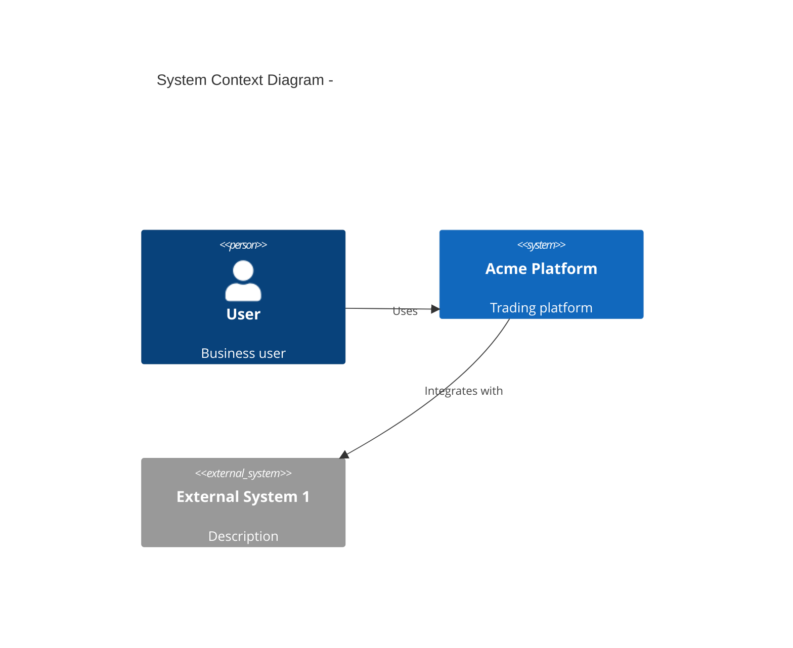
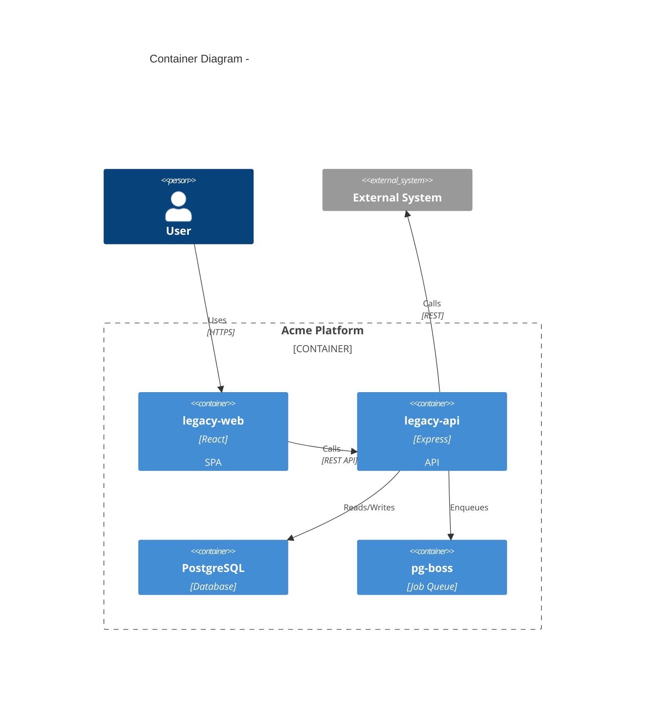
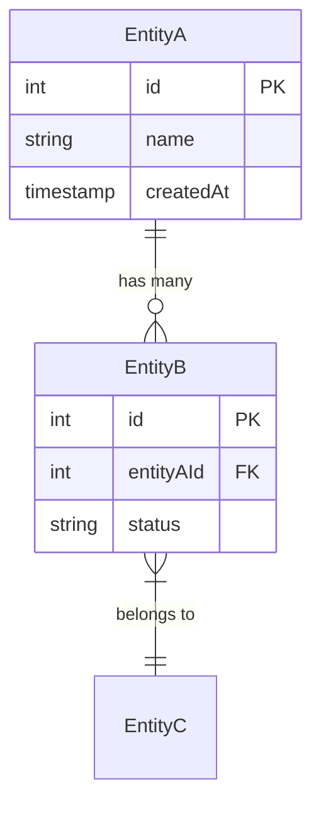
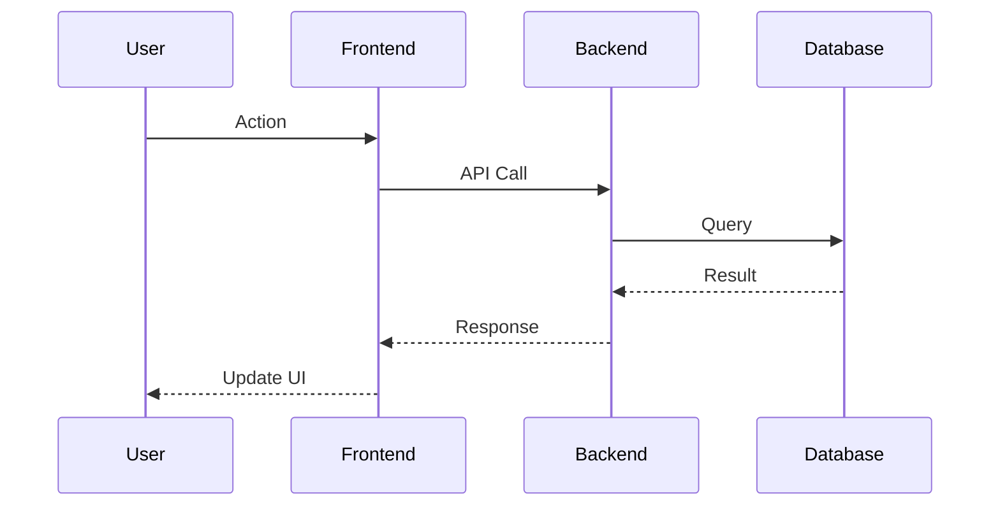

# System Design: <Feature Name>

**Date**: YYYY-MM-DD
**Author**: Claude Code
**Status**: Draft
**Reviewers**: [To be assigned]

## 1. Executive Summary

### Problem Statement

<1-2 sentences describing the problem>

### Proposed Solution

<1-2 sentences describing the solution>

### Key Benefits

- <Benefit 1>
- <Benefit 2>

### Major Trade-offs

- <Trade-off 1>
- <Trade-off 2>

## 2. Context Diagram (C4 Level 1)



## 3. Container Diagram (C4 Level 2)



## 4. Component Design

### 4.1 <Component Name>

**Responsibilities**:

- <Responsibility 1>
- <Responsibility 2>

**Interfaces**:

- Input: <Description>
- Output: <Description>

**Dependencies**:

- <Dependency 1>
- <Dependency 2>

## 5. Data Model



## 6. Sequence Diagrams

### 6.1 <Flow Name>



## 7. API Contract

### 7.1 <Endpoint Name>

```yaml
POST /api/v1/<resource>/<action>
  summary: <Description>
  parameters:
    - name: id
      in: path
      required: true
      schema:
        type: integer
  requestBody:
    content:
      application/json:
        schema:
          type: object
          properties:
            field1:
              type: string
  responses:
    200:
      description: Success
    400:
      description: Invalid input
    404:
      description: Not found
```

## 8. Non-Functional Requirements

| Requirement | Target | Rationale |
| ---------------- | ----------- | ----------------- |
| Response time | < 200ms p95 | User experience |
| Availability | 99.9%       | Business critical |
| Data retention | 7 years | Legal requirement |
| Concurrent users | 100         | Expected load |

## 9. Security Considerations

### 9.1 Authentication

<How users are authenticated>

### 9.2 Authorization

<How access is controlled>

### 9.3 Data Protection

<Encryption, PII handling>

### 9.4 Audit Logging

<What actions are logged>

## 10. Trade-offs and Alternatives

| Decision | Chosen | Alternative | Rationale |
| ---------- | -------- | ------------- | --------- |
| <Decision> | <Choice> | <Alternative> | <Why>     |

## 11. Implementation Phases

### Phase 1: <Title>

- Task 1
- Task 2

### Phase 2: <Title>

- Task 1
- Task 2

## 12. Risks and Mitigations

| Risk | Impact | Likelihood | Mitigation |
| ------ | ------ | ---------- | ------------ |
| <Risk> | High | Medium | <Mitigation> |

## 13. Open Questions

- [ ] Question 1
- [ ] Question 2

## 14. References

- [Related Document 1](path/to/doc)
- [External Reference](https://example.com)
