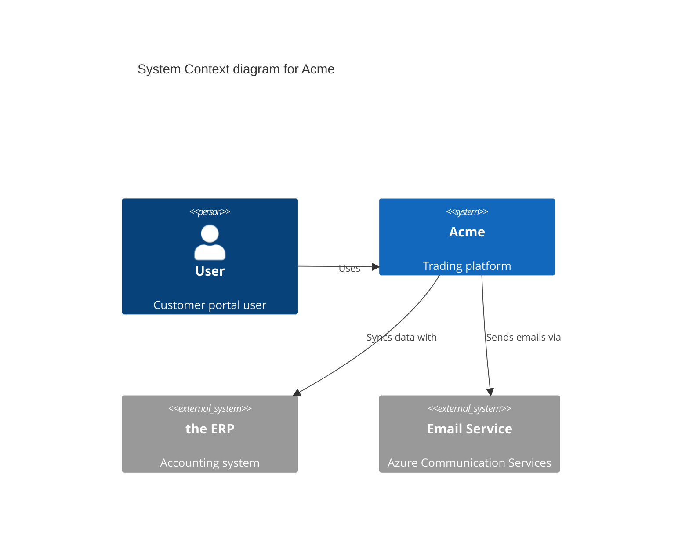
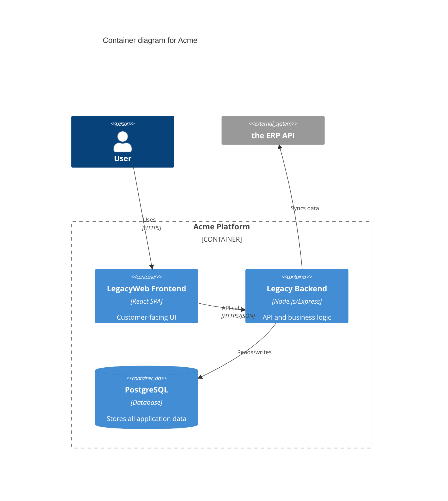
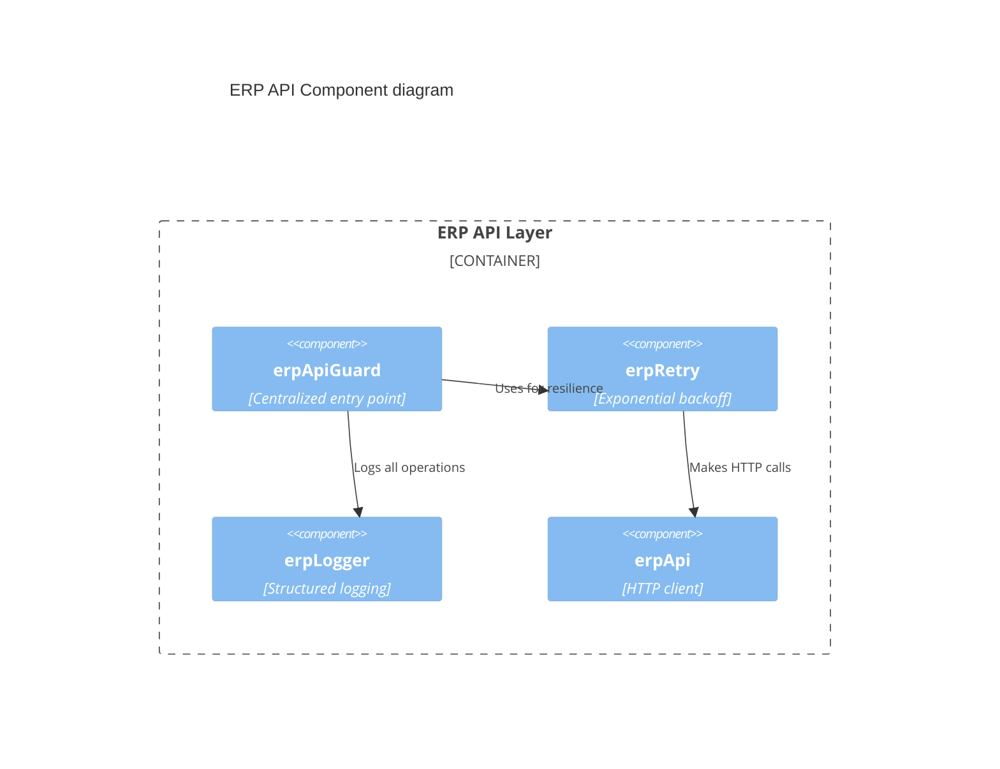

# CLAUDE.md - Legacy Backend Documentation

Instructions for Claude Code when working with documentation in this folder.

## Quick Reference

| Need | Location |
| --------------------- | ------------------------------------------------------------------------ |
| Navigation hub | [README.md](./README.md)                                                 |
| Architecture overview | [architecture/erp-api/README.md](./architecture/erp-api/README.md)     |
| Architecture diagrams | [architecture/erp-api/diagrams.md](./architecture/erp-api/diagrams.md) |
| ADRs | [architecture/erp-api/adr/](./architecture/erp-api/adr/)               |
| CTO reports | [reports/](./reports/)                                                   |
| Technical debt | [improvements/](./improvements/)                                         |

## Documentation Conventions

### File Naming

```
✓ kebab-case.md           # lowercase, hyphens
✗ PascalCase.md           # avoid
✗ snake_case.md           # avoid

✓ ADR-001-short-title.md  # ADRs: numbered prefix
✓ fix-production-xyz.md   # troubleshooting: verb prefix
✓ oauth-setup-guide.md    # guides: topic-guide suffix
```

### Document Structure

Every document should include:

```markdown
# Title

> One-line summary (blockquote)

## Table of Contents (if > 3 sections)

## Content sections...

---

_Last Updated: YYYY-MM-DD_
```

### Diagrams

**Always use Mermaid** for diagrams (not images):

```markdown
​`mermaid
flowchart LR
    A[Start] --> B[Process] --> C[End]
​`
```

Benefits:

- Version controlled with code
- Renders in GitHub/GitLab
- Diff-friendly

### C4 Model for Architecture Diagrams

Use the **C4 model** hierarchy when documenting architecture:

| Level | Purpose | When to Use |
| ---------------- | ----------------------------- | ---------------------------------------- |
| **1. Context**   | System in its environment | Executive summaries, onboarding |
| **2. Container** | Major services/apps | Technical overviews |
| **3. Component** | Components within a container | Deep-dive documentation |
| **4. Code**      | Class/function level | Rarely needed (code is self-documenting) |

#### C4 Diagram Examples

**Context Diagram** (Level 1) - Shows external actors and systems:



**Container Diagram** (Level 2) - Shows deployable units:



**Component Diagram** (Level 3) - Shows components within a container:



#### When to Use Each Level

| Document Type | Recommended Level |
| --------------------- | ------------------------------------- |
| CTO/Executive reports | Context (L1)                          |
| Architecture README   | Container (L2) + Component (L3)       |
| ADRs | Component (L3) for specific decisions |
| diagrams.md | All relevant levels |

#### Naming Conventions

- Use consistent naming across all diagrams
- Match component names to actual code/service names
- Include technology choices in descriptions

### Links

- **Internal docs**: Use relative paths (`./architecture/erp-api/README.md`)
- **External resources**: Use absolute URLs
- **Code references**: Use relative paths from docs folder (`../src/api/erp/erpApiGuard.ts`)

## When to Create Documentation

| Scenario | Action |
| --------------------------- | ---------------------------- |
| New major feature | Add architecture docs + ADR  |
| Significant design decision | Create ADR                   |
| Bug fix with learnings | Add to troubleshooting guide |
| Config change | Update setup guides |
| Incident post-mortem | Add to runbooks |

## ADR Guidelines

### When to Write an ADR

Create an ADR when:

- Making a significant architectural decision
- Choosing between multiple valid approaches
- The decision has long-term consequences
- Future maintainers need to understand "why"

### ADR Template

```markdown
# ADR-XXX: Title

## Status

Proposed | Accepted | Rejected | Superseded by [ADR-XXX](./ADR-XXX.md)

## Date

YYYY-MM-DD

## Context

What is the issue motivating this decision?

## Decision

What change are we making?

## Consequences

### Positive

- What becomes easier?

### Negative

- What becomes harder?

### Mitigations

- How do we address the negatives?

## Alternatives Considered

What other options were evaluated?

## Related

- Links to related ADRs, docs, or code
```

### ADR Numbering

- Get the next number from [adr/README.md](./architecture/erp-api/adr/README.md)
- Format: `ADR-XXX-short-descriptive-title.md`
- Update the ADR index after creating

## Documentation Types

### 1. Architecture Documentation (`architecture/`)

**Purpose**: Explain how systems work and why

| Type | Example |
| --------------- | -------------------------------------- |
| Overview README | Component relationships, data flow |
| Diagrams | Mermaid architecture as code |
| ADRs | Architectural decisions with rationale |

### 2. Operational Guides (`erp/`, `db/`)

**Purpose**: Step-by-step procedures

| Type | Example |
| --------------- | ---------------------- |
| Setup guides | OAuth configuration |
| Troubleshooting | Production error fixes |
| Procedures | Database seeding plan |

### 3. Technical Debt (`improvements/`)

**Purpose**: Track known issues

| Priority | File |
| -------- | ------------------------------ |
| Critical | `critical-issues.md`           |
| High | `architecture-improvements.md` |
| Medium | `quality-improvements.md`      |

### 4. Executive Reports (`reports/`)

**Purpose**: Non-technical summaries for stakeholders

## Updating Documentation

### Before Making Changes

1. Read the existing document fully
2. Check for related documents that may need updates
3. Understand the document's audience

### After Making Changes

1. Update the `*Last Updated*` date at the bottom
2. Update cross-references if structure changed
3. Verify all links still work
4. Update README.md navigation if adding new docs

## Code-to-Docs Mapping

Key implementation files and their documentation:

| Code File | Documentation |
| ---------------------------------- | -------------------------------------------------------------------------------------------- |
| `src/api/erp/erpApiGuard.ts`     | [architecture/erp-api/README.md](./architecture/erp-api/README.md)                         |
| `src/api/erp/erpMockDatabase.ts` | [ADR-003](./architecture/erp-api/adr/ADR-003-database-backed-mock-persistence.md)           |
| `src/api/erp/erpThrottle.ts`     | [ADR-004](./architecture/erp-api/adr/ADR-004-distributed-throttling.md)                     |
| `src/api/erp/erpLogger.ts`       | [architecture/erp-api/README.md](./architecture/erp-api/README.md) (Observability section) |

## Common Tasks

### Adding a New ADR

```bash
# 1. Check next number in ADR index
cat docs/architecture/erp-api/adr/README.md

# 2. Create new ADR file
# Use template above

# 3. Update ADR index
# Add entry to table in README.md
```

### Updating Architecture Diagrams

1. Edit `architecture/erp-api/diagrams.md`
2. Use Mermaid syntax
3. Preview in VS Code or GitHub
4. Update related README if diagram purpose changed

### Creating a Troubleshooting Guide

1. Create file in `erp/` with `fix-*.md` naming
2. Include:
   - Problem description
   - Root cause analysis
   - Step-by-step fix
   - Prevention measures

---

_Last Updated: 2026-01-05_
_Added C4 Model guidance: 2026-01-05_
